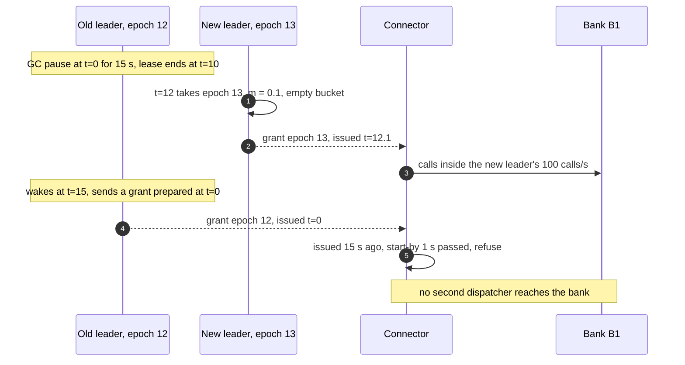
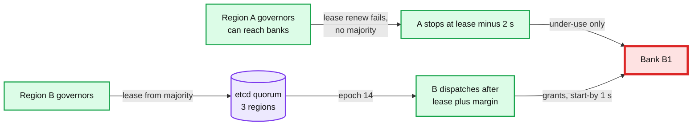
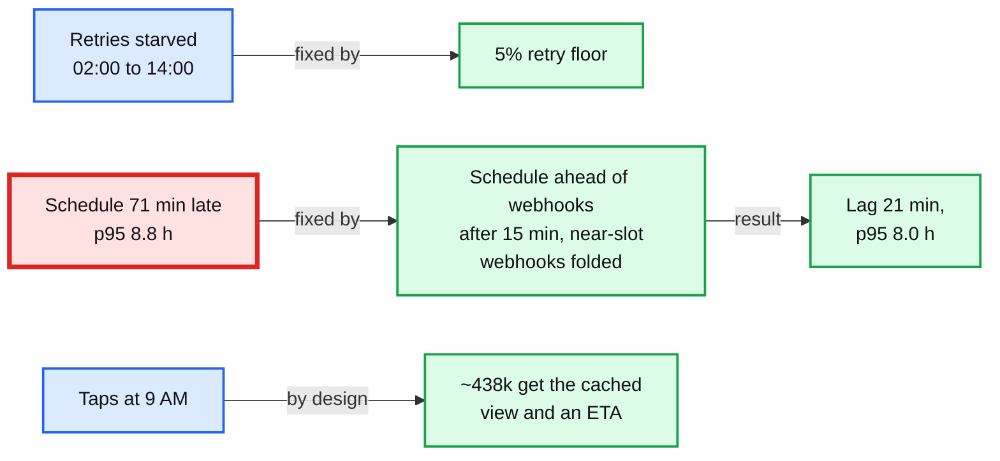
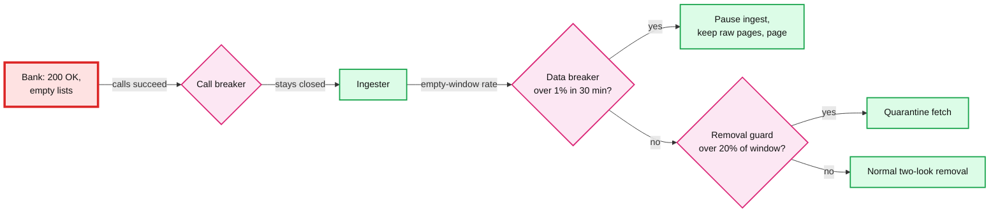

# Edge cases: bank feed aggregation

Every entry answerable in under 60 seconds out loud. Categories: failure, consistency, scale, data, operations, security / abuse. Design reference: [`solution.md`](solution.md). Where the design has a rule because a simpler first draft failed, the entry gives the first draft's number from the deep-dive simulations. An answer bullet that starts with **Decision:** still goes past what solution.md states. B1 is the largest institution: ~3 M connections, an assumed 1,000 calls/s and 800 calls in flight `[estimate]`. Acronyms: FDX (Financial Data Exchange), OAuth (open authorization), KMS (key management service), DEK (data encryption key), AIMD (additive increase, multiplicative decrease), GC (garbage collection), AZ (availability zone), SLO (service level objective), SLI (service level indicator), SLA (service level agreement), MFA (multi-factor authentication), OFX (Open Financial Exchange), ETA (estimated time of arrival), VM (virtual machine), UTC (Coordinated Universal Time), RFC (request for comments, an internet standard), HSM (hardware security module).

---

## Failure
## Edge case: B1's API is down for 6 hours and comes back at 9 AM on a Monday
- **Trigger:** `503`s and timeouts from 03:00 to 09:00; recovery lands on the busiest hour of the week.
- **Symptom:** ~2.2 M stale B1 connections (~6.5 M calls to catch up), ~0.8 M calls of webhook demand left from the night (half the burst folded into slots), and taps arriving at ~590 calls/s.
- **Answer:**
  - The breaker opens in ~30 s (it counts the last 200 calls, so timeouts trip it ~22 s in); taps get stored data and `as_of` at once; nothing calls B1; probes every 60 s; then a ramp from 10% to 100% in ~8 minutes (solution §5.5).
  - After recovery: parked taps first, then the schedule floor, then the catch-up lane, most stale first. Only ~100 calls/s are spare at 9 AM, so the catch-up ends early afternoon: ~13:04 in the simulation with half the night's webhooks folded into slots, ~14:00 if none fold. No jitter: one governor already meters every call, so random order would only raise the p95.
  - Nothing is lost: the 14-day window covers the gap. See [`deep-dives/institution-outages-and-recovery.md`](deep-dives/institution-outages-and-recovery.md) §4.
- **Confidence:** [ ] shaky  [ ] ok  [ ] confident

## Edge case: B1 is slow, not down: every call takes 5 s
- **Trigger:** B1's backend degrades; the error rate stays under the breaker threshold.
- **Symptom:** the cap must hold in-flight calls at 800 while each call takes 5x longer. A first draft capped jobs, whose 2 transactions calls ran in parallel: **1,600 calls in flight, twice the contract**, at the moment B1 was weakest (simulated).
- **Answer:**
  - AIMD halves m once p99 passes 3x its baseline.
  - The cap counts calls (solution §5.1). Background jobs run their calls one after another and hold 1 unit; taps hold 2. In-flight work stays at 800 and the rate falls to ~160 to 184 calls/s by itself.
  - Taps still answer within the 25 s job deadline, with stored data and `as_of` if the bank has not answered.
- **Confidence:** [ ] shaky  [ ] ok  [ ] confident

## Edge case: the governor leader pauses 15 s, past its 10 s lease
- **Trigger:** a GC pause or a VM freeze on shard 0's leader, right after it checked its lease.
- **Symptom:** the standby takes epoch 13 at ~12 s and starts at m = 0.1. The old leader wakes and sends grants it had prepared. Connectors that have not polled the new leader yet accept epoch 12. The bank cannot read epochs.
- **Answer:**
  - If the lease is checked on a monotonic clock every 10 ms tick, ~1 tick leaks (~10 calls). If leadership is a flag cleared by an etcd callback (~3 s), up to ~2,100 calls reach B1 in the first second.
  - So every grant carries `issued_at` and must start its first call within 1 s; a connector refuses an older grant whatever its epoch (solution §5.1, §10.4). A paused governor's late grants are void, so a dead governor can only cause under-use. See [`deep-dives/refresh-scheduling-and-rate-limits.md`](deep-dives/refresh-scheduling-and-rate-limits.md) §6.
- **Diagram:**

- **Confidence:** [ ] shaky  [ ] ok  [ ] confident

## Edge case: the vault, or the bank's token endpoint, is slow for 150 s
- **Trigger:** a vault overload or a slow OAuth token endpoint; connectors wait before their first bank call.
- **Symptom:** grants are waiting at connectors that cannot call yet. A first draft reclaimed permits at 120 s and granted 800 more jobs; when the stall cleared, 1,600 jobs fired together: **4,800 calls in one second and 3,200 in flight** (simulated).
- **Answer:**
  - A grant older than 1 s at its first call is void; the connector drops it and releases (solution §5.1).
  - The governor reclaims only after the 25 s job deadline plus the 20 s call timeout (45 s), never at a fixed 120 s. Same stall, simulated: the peak stays at 932 calls/s and 800 in flight.
- **Confidence:** [ ] shaky  [ ] ok  [ ] confident

## Edge case: the vault or KMS is down, or KMS throttles
- **Trigger:** the vault cluster fails, KMS has an outage, or KMS throttles at its default 10,000 requests/s per account and Region.
- **Symptom:** no fetch anywhere. Reads of ingested data are unaffected. This is our own single point of failure.
- **Answer:**
  - Vault across 3 AZs, a page at the first errors (solution §8). Freshness degrades evenly; nothing is lost.
  - A 5-minute DEK cache would almost never hit: each tenant is touched every 8 h. That is 1 to 2 KMS decrypts per fetch, 3k to 6k/s at the ~3k refreshes/s peak, so the vault routes by tenant, holds the DEK for the life of a fetch, and the quota is raised (solution §5.7). A per-shard middle key would cut KMS to a few calls a minute.
  - On recovery the 1 s grant rule stops a burst.
- **Confidence:** [ ] shaky  [ ] ok  [ ] confident

## Edge case: a transaction-store shard primary fails mid-ingest
- **Trigger:** shard 7's primary dies with ingest transactions open.
- **Symptom:** 1/32 of connections see no new data for ~30 s; consumers of those accounts see a pause.
- **Answer:**
  - Open transactions roll back. Fetching continues: raw pages and Kafka (7 days of retention) buffer.
  - The synchronous standby in another AZ is promoted (no committed data lost); redelivered fetches either apply or fail the `fetch_seq` check.
  - The outbox relay resumes from the last relayed `seq`; consumers dedupe on `(account_id, seq)`.
- **Confidence:** [ ] shaky  [ ] ok  [ ] confident

## Edge case: the manifest is written, but `fetch-completed` never reaches Kafka
- **Trigger:** Kafka is unavailable, or the connector dies between writing the manifest and publishing.
- **Symptom:** raw pages exist and nothing ingests them. The governor already moved `next_due_at` 8 h ahead, so the connection looks served. A tap waits for nothing.
- **Answer:**
  - A sweeper republishes manifests older than 60 s with no `FETCH` row; the publish is idempotent on `(connection_id, fetch_seq)` (solution §4.3). **Decision:** the release also carries `NOT_PUBLISHED`, so the connection is retried in 5 minutes.
  - `last_success_at` (the freshness SLI) is set by the ingester at commit, never by the connector, so the SLO cannot count a fetch that never landed.
- **Confidence:** [ ] shaky  [ ] ok  [ ] confident

## Edge case: a partner aggregator is down
- **Trigger:** Plaid has an outage; thousands of long-tail institutions sit behind it.
- **Symptom:** every one of those institutions fails at once. The "breakers open on over 50 institutions" page fires, and it is not us.
- **Answer:**
  - The partner is a governor key with its own breaker (solution §5.1). **Decision:** errors on a partner route count against the partner key first; per-(partner, bank) breakers open only if the partner key stays closed. One page, not 5,000.
  - Taps get `as_of` with "your bank's data provider is unavailable". Recovery ramps the partner key; its own limits (2,500 sync calls a minute per client) cap the catch-up.
- **Confidence:** [ ] shaky  [ ] ok  [ ] confident

## Edge case: a region is lost, or only cut off
- **Trigger:** region A goes dark, or is partitioned from region B while still able to reach the banks.
- **Symptom:** region B's standby governors must take over B1. If A is only partitioned, two governors for B1 means twice the contract.
- **Answer:**
  - Governor leases live in an etcd quorum spanning 3 regions, so only the side with a majority can hold a lease. Without a 3-region quorum, a fetch failover is a human decision after A is fenced (egress cut) (solution §10.11, diagrams.md D9).
  - B's egress IPs are allowlisted in advance; feed reads move to async replicas (~1 s behind); consumers resync from the last common `seq` on the new cursor epoch.
- **Diagram:**

- **Confidence:** [ ] shaky  [ ] ok  [ ] confident

---

## Consistency
## Edge case: a worker crashes after writing half a page
- **Trigger:** an ingester pod is killed after upserting 40 of 135 rows.
- **Symptom:** none visible: the open transaction dies with the process.
- **Answer:**
  - One fetch is one database transaction on one shard, so the crash leaves all or nothing. Kafka redelivers after the rebalance (~10 s).
  - The retry reads the same immutable pages and computes the same fingerprints; `fetch_seq` makes a second delivery a no-op. Solution Flow 3.
- **Confidence:** [ ] shaky  [ ] ok  [ ] confident

## Edge case: a zombie connector publishes fetch 58 after fetch 59 was applied
- **Trigger:** a connector stalls with its grant, the governor re-dispatches as fetch 59, then the zombie wakes and finishes.
- **Symptom:** ingest is safe (58 is skipped), but B1 served c_9 twice: the zombie's calls are extra calls on top of fetch 59's, paid with new tokens (diagrams.md D5a).
- **Answer:**
  - `fetch_seq 58 ≤ 59`: skip and ack.
  - A zombie may not start a first call after `start_by` (1 s) or any call after the 25 s job deadline, and reclaim waits 45 s, until both have passed. Its extra calls are bounded to a job already in progress and never overlap the replacement's.
- **Confidence:** [ ] shaky  [ ] ok  [ ] confident

## Edge case: a pending charge changes amount while still pending, on a route with no ids
- **Trigger:** a $45.00 dinner pending on Tuesday shows $54.00 on Wednesday, still pending (a tip). Plaid: pending rows are "frequently altered or removed by the institution before finally settling".
- **Symptom:** the amount is in the no-id fingerprint, so a second active pending is inserted. Credit Karma shows $99.00 for **8 h** (24 h for a dormant connection) until the old one is dropped twice. A spend alert can fire on the phantom.
- **Answer:**
  - Pending continuity (solution §5.4): before inserting a pending row, pair it with an active pending that went missing in the same window (same date and merchant, amount inside the category band). Same `txn_id`, one MODIFIED. Simulated: the first draft's 8 h of double count becomes 0.
  - QuickBooks never sees it: pending rows are filtered out. See [`deep-dives/pending-to-posted-matching.md`](deep-dives/pending-to-posted-matching.md).
- **Confidence:** [ ] shaky  [ ] ok  [ ] confident

## Edge case: a pending row shows up after its posted row
- **Trigger:** the bank's pending list lags its posted list, or a fast debit posts before our first fetch saw its pending.
- **Symptom:** the matcher only runs for new **posted** rows, so the late pending is never matched: double counted until it is dropped twice (16 h in the simulation) or expires (up to 14 days).
- **Answer:**
  - The reverse match (solution §5.4): a new pending is compared with posted rows in the window that have no pending link; a match inserts it already SUPERSEDED.
  - SUPERSEDED and EXPIRED are terminal (solution §5.4). A later edit to such a row is stored for audit, emits nothing and never reactivates it.
- **Confidence:** [ ] shaky  [ ] ok  [ ] confident

## Edge case: the bank edits a posted description and two same-amount rows swap occurrence numbers
- **Trigger:** two $5.00 rows on one date, ranked by raw description `#22 SF` and `#31 SF`; the bank rewrites the first to `STORE 0022 SF`, or reverses it.
- **Symptom:** rank-based numbering flips: **two MODIFIED events on posted rows**, with the two `txn_id`s now holding each other's transactions; after a reversal, the wrong row is REMOVED. QuickBooks matches to invoices break.
- **Answer:**
  - Pair first, then number (solution §5.3): incoming rows pair with stored rows in the group (exact match first, then description similarity); paired rows keep their stored occurrence; only newcomers get `max + 1`. Simulated: one correct MODIFIED, or one correct REMOVED.
  - Identical coffees still pair exactly, so `{#1, #2}` stays stable. See [`deep-dives/idempotent-ingestion.md`](deep-dives/idempotent-ingestion.md) §5.
- **Confidence:** [ ] shaky  [ ] ok  [ ] confident

## Edge case: two $45.00 pendings and one $54.00 posted, no provider link
- **Trigger:** two dinners at the same restaurant, or a merchant that authorized twice.
- **Symptom:** both candidates score the same.
- **Answer:**
  - Assign greedily by score, ties to the **oldest pending**, then `txn_id`. Deterministic, so a re-run gives the same answer (solution §5.4).
  - The younger pending waits for its own posted row, or is dropped twice, or expires at 14 days. The count is right; which of two identical pendings went first does not matter.
- **Confidence:** [ ] shaky  [ ] ok  [ ] confident

## Edge case: one account in a connection always fails
- **Trigger:** a closed account, or a per-account `403`, inside a connection with 3 healthy accounts.
- **Symptom:** a first draft refused incomplete manifests, so the healthy accounts never ingested either.
- **Answer:**
  - Completeness is per account (solution §4.3). Complete windows are applied; the failing account is skipped and never counts toward removals.
  - After 3 days of per-account failure, the account is marked `UNAVAILABLE` in the feed so the app can say so.
- **Confidence:** [ ] shaky  [ ] ok  [ ] confident

## Edge case: a partner sync crashes after our commit, before the cursor is saved
- **Trigger:** a delta (`/transactions/sync`) fetch is ingested, then the process dies before storing `next_cursor`.
- **Symptom:** the next fetch re-reads from the old cursor.
- **Answer:**
  - Every re-read item is a no-op on its fingerprint, and a delta never infers removal from absence (solution §10.1).
  - If Plaid returns `TRANSACTIONS_SYNC_MUTATION_DURING_PAGINATION`, "the entire pagination request loop must be restarted" from the first cursor ([Plaid API](https://plaid.com/docs/api/products/transactions/)); the manifest is discarded, nothing half-applied.
- **Confidence:** [ ] shaky  [ ] ok  [ ] confident

---

## Scale
## Edge case: Monday 9 AM at B1, when the contract is 800 calls in flight
- **Trigger:** ~590 tap calls/s plus 302 scheduled plus a little webhook: ~948 calls/s.
- **Symptom:** Flow 1's calls average 0.93 s, so 800 in flight allows only `800 ÷ 0.93 ≈ 857 calls/s`. Demand is ~111% of the real ceiling (a first draft used 0.8 s per call and called it 95%).
- **Answer:**
  - The lanes behave: the schedule keeps its floor, taps queue, then **~179k taps in the peak hour** (about a quarter) get the cached view and an ETA (simulated with the 5% retry floor; ~170k without it).
  - The design plans against 857, not 1,000, and asks B1 for a user-present allowance (Plaid notes an institution limit "is not applied to user-present traffic").
- **Confidence:** [ ] shaky  [ ] ok  [ ] confident

## Edge case: B1's real limit is 500 calls/s, not 1,000
- **Trigger:** the agreement was misread, or a `429` storm leaves AIMD at m = 0.5 all day.
- **Symptom:** average demand 417/s is 83% of the limit; the peaks do not fit.
- **Answer:**
  - A first draft (no retry floor, webhooks always ahead of the schedule) degraded in this order (simulated): retries got nothing 02:00 to ~14:00; the nightly webhook burst pushed the schedule 71 minutes behind (p95 staleness ~8.8 h, over the SLO); webhooks drained at 07:55; ~429k taps got the cached view.
  - The design (solution §5.2): webhook demand for connections whose slot is within 4 h folds into that slot; the schedule borrows ahead of webhooks once it lags 15 minutes; retries have a 5% floor. Simulated: retries never wait, schedule lag peaks at 21 minutes (p95 ~8.0 h, inside the SLO), webhooks drain at 05:15, and taps absorb the rest (~438k get the cached view). Two refreshes a day for connections nobody read in 7 days is the reserve.
- **Diagram:**

- **Confidence:** [ ] shaky  [ ] ok  [ ] confident

## Edge case: an accountant clicks "refresh all" on 5,000 client companies
- **Trigger:** a firm user with access to 5,000 QuickBooks companies, each its own tenant.
- **Symptom:** "round robin by tenant" does not help: these are 5,000 tenants. The firm takes 15k calls of B1's on-demand lane ahead of everyone.
- **Answer:**
  - Fairness inside the on-demand lane is keyed by the **caller** (the authenticated user or firm), not the tenant (solution §5.1). Each caller gets one turn per round. **Decision:** each caller also has a budget of 100 taps a minute `[estimate]`.
  - Bulk refresh is background demand: it goes to the webhook lane with an ETA. Connections refreshed in the last 15 minutes return `FRESH` with no bank call.
- **Confidence:** [ ] shaky  [ ] ok  [ ] confident

## Edge case: 1.6 M webhooks for B1 in one hour after the nightly posting run
- **Trigger:** a partner sends `SYNC_UPDATES_AVAILABLE` for most B1 connections between 02:00 and 03:00.
- **Symptom:** ~1,333 calls/s of demand against the webhook lane's ~386/s ceiling (45% of the ~857 usable).
- **Answer:**
  - Webhooks only set demand on the row, so duplicates coalesce. A webhook for a connection whose next slot is within 4 h folds into that slot (solution §5.2); with 8 h slots that is about half of them `[estimate]`.
  - The rest drain in ~1.5 to 2 h (simulated: by 03:28 at 1,000/s, 03:43 at 857/s), under the schedule's floor. Without folding it took ~3 h, and at 500/s the burst used to push the schedule 71 minutes late.
- **Confidence:** [ ] shaky  [ ] ok  [ ] confident

## Edge case: 10x connections tomorrow
- **Trigger:** 150 M connections; B1 alone needs ~4,170 calls/s on average.
- **Symptom:** our side scales by adding shards. B1's limit does not grow.
- **Answer:**
  - Transaction store to ~128 shards, more governor shards, more connectors: horizontal (solution §10.11).
  - The real levers are product decisions: fewer scheduled refreshes for dormant and unread connections, a negotiated user-present lane, bank notifications where offered, and cross-product sharing of one connection **with** explicit consent.
- **Confidence:** [ ] shaky  [ ] ok  [ ] confident

## Edge case: a governor deploy rolls through shard 0 at Monday 9 AM
- **Trigger:** a routine rolling deploy restarts B1's governor shard.
- **Symptom:** if every leader change started at m = 0.1, the ~8-minute ramp would cost B1 ~300k calls (~100k refreshes) of capacity at its peak.
- **Answer:**
  - A planned handoff passes `m` and the in-flight table to the successor, which takes over at that rate. Only an unplanned failover ramps from 0.1 (solution §5.1).
  - **Decision:** shards that own a top-20 institution deploy outside 07:00 to 11:00 in that institution's timezone, one shard at a time.
- **Confidence:** [ ] shaky  [ ] ok  [ ] confident

---

## Data
## Edge case: a connection comes back after 20 days in NEEDS_USER_ACTION
- **Trigger:** consent expired or an MFA prompt was ignored for 20 days; the user reconnects.
- **Symptom:** the first fetch reads only 14 days. Six days fall outside the window and the seventh is the guard day: **7 days of transactions never reach QuickBooks**, and nothing alerts.
- **Answer:**
  - The design: `window_start = min(today − 14, last_complete_fetch_date − 1)` per account (solution §5.3). A 20-day gap reads 21 days once. Simulated: the first draft's 7 missed days become 0.
  - The spike guard is scaled by the days the fetch covers for the first time, so the catch-up is not quarantined.
- **Confidence:** [ ] shaky  [ ] ok  [ ] confident

## Edge case: a posted row is backdated 14 days or more, or the window edge falls on a timezone boundary
- **Trigger:** the bank posts an adjustment with an old posted date; or the bank applies our date filter in its own timezone. Plaid's FDX reference: it "doesn't normalize timestamps, so a local time labeled Z is read as UTC".
- **Symptom:** a first draft matched a row first listed on the guard day but never inserted it, and never saw a row older than 14 days.
- **Answer:**
  - The guard day exists because a timezone cut can halve the first day. A cut can only remove rows, so the design inserts on the guard day when a group's incoming count exceeds the stored count (solution §5.3).
  - One fetch a week per account reads 60 days. ~300 rows fit one page, so bank calls do not change; ~1 B extra rows re-read a day (~12% more CPU). Rows backdated up to 59 days are caught.
- **Confidence:** [ ] shaky  [ ] ok  [ ] confident

## Edge case: the bank answers 200 OK with empty transaction lists
- **Trigger:** a silent outage: the bank's transaction backend is down, its API is not.
- **Symptom:** every call succeeds, so the call breaker stays closed. Two empty windows 6 h apart remove every row: **~400 M REMOVED events at B1**, all reaching QuickBooks. The spike guard counts adds only.
- **Answer:**
  - Per account, a removal guard quarantines a fetch that would remove more than `max(5, 20%)` of the stored posted rows (solution §5.3).
  - Per institution, a data breaker opens when more than 1% of account windows come back empty in 30 minutes where the last fetch had at least 5 rows: raw pages are still fetched, ingest stops, the on-call is paged (solution §5.5).
- **Diagram:**

- **Confidence:** [ ] shaky  [ ] ok  [ ] confident

## Edge case: B1 migrates its core system and every transaction id changes
- **Trigger:** cutover night; every account's next fetch returns ~70 unknown ids.
- **Symptom:** without care, ~400 M duplicate posted rows reach QuickBooks within 8 h, then ~400 M removals.
- **Answer:**
  - Pair new ids with stored rows that went missing in the same window, on `content_fp`; re-key, alias the old id, emit nothing. Over 1% of B1's accounts flagged in 30 minutes puts B1 in REMAP mode and pages (solution §5.6).
  - If descriptions changed too, pair per day on `(date, amount)` only when per-day counts match; else quarantine.
  - **Decision:** a rolling migration (10% of accounts a night) keeps REMAP on until 24 h pass with no flagged fetch.
- **Confidence:** [ ] shaky  [ ] ok  [ ] confident

## Edge case: a new connection's 90-day history trips the spike guard
- **Trigger:** the initial fetch adds ~450 rows; the guard is `max(20, 5 × p99 daily adds)`.
- **Symptom:** a flat add guard would quarantine and page on every new connection's history.
- **Answer:**
  - Fetch mode `INITIAL` has its own budget; otherwise the add guard is scaled by the number of days the fetch covers for the first time (solution §5.3).
  - The guard still catches a parser that doubles rows: it compares adds with what those days could plausibly hold.
- **Confidence:** [ ] shaky  [ ] ok  [ ] confident

## Edge case: the description normalizer ships a new major version
- **Trigger:** cleaning "POS 1234 BLUE BOTTLE #22" changes, so every no-id fingerprint changes.
- **Symptom:** without care, the next fetch looks like ~70 new rows per account.
- **Answer:**
  - The fingerprint includes the normalizer's major version. Compute both versions, match on the old, re-key to the new, account by account on its next fetch (solution §5.3).
  - With pair-then-number counters this is a re-key of stored rows. The spike guard is the backstop.
- **Confidence:** [ ] shaky  [ ] ok  [ ] confident

## Edge case: a tenant is deleted while backups still exist
- **Trigger:** a QuickBooks company closes, or a Credit Karma user exercises a deletion right.
- **Symptom:** "destroy the tenant key" is only true if no copy of the wrapped DEK survives. A database backup of the key table has it, and the KMS key that unwraps it still exists.
- **Answer:**
  - Revoke tokens at the bank, stop refreshes, destroy secrets (solution §10.10).
  - Deletion is complete when the last backup holding the wrapped DEK expires (35 days `[estimate]`), and the deletion SLA says so (solution §10.10). **Decision:** wrapped DEKs live in their own store with that short retention, and a tombstone list is replayed on any restore.
  - The consumer's books (QuickBooks) are the consumer's records, under its own retention.
- **Confidence:** [ ] shaky  [ ] ok  [ ] confident

## Edge case: what the data looks like in 3 years
- **Trigger:** steady growth at today's rates.
- **Symptom:** storage, not throughput, drives the shard count.
- **Answer:**
  - Transactions: ~55 TB a year; 13 months hot (~60 TB on 32 shards, ~1.9 TB each), older months in a Parquet lake.
  - Raw pages: ~0.75 TB a day compressed, 90 days hot (~68 TB), then archive for 7 years: `0.75 × 365 × 7 ≈ 1.9 PB` `[estimate]`. The archive is the biggest store we own; price it at the archive tier.
  - The change log keeps 30 days (~2.5 TB); older cursors get `410` and resync from a snapshot.
- **Confidence:** [ ] shaky  [ ] ok  [ ] confident

## Edge case: a parser bug is found 3 days after release
- **Trigger:** B1's new parser mis-signed refunds.
- **Symptom:** wrong amounts already in the change log and in QuickBooks.
- **Answer:**
  - Pin the previous parser for B1. Find affected rows by `fetch_seq` range.
  - Rebuild from the raw store into a shadow table in `fetch_seq` order, diff, swap, and emit only the MODIFIED and REMOVED corrections; never rewrite the log (solution §10.9).
- **Confidence:** [ ] shaky  [ ] ok  [ ] confident

---

## Operations
## Edge case: what pages at 3 AM
- **Trigger:** any of the alerts below.
- **Symptom:** the on-call needs to know which are us and which are the banks.
- **Answer:**
  - Pages (solution §8): measured rate over 95% of a contract for 5 minutes, counted per institution at the egress proxy so token calls are seen; schedule lag over 15 minutes (the 8 h p95 has ~24 minutes of slack); a data breaker open; a governor shard leaderless for 60 s; ingest lag over 15 minutes; REMAP entered; quarantines over 0.1%; vault or KMS errors over 1%; breakers open on over 50 institutions.
  - **Decision:** add: in-flight calls over 800 at any top-20 institution; more than 1% of grants refused as stale (a stall in progress).
  - Not a page: one bank's breaker open, unless it is a top-20 institution open for more than 30 minutes.
- **Confidence:** [ ] shaky  [ ] ok  [ ] confident

## Edge case: migrating QuickBooks' current bank feed onto this platform
- **Trigger:** cutover from the existing pipeline and partners.
- **Symptom:** two fetchers sharing one bank limit is the breach this design exists to prevent; QuickBooks references legacy ids.
- **Answer:**
  - Import transactions with legacy ids as `provider_txn_id`; shadow on the old pipeline's raw responses, never a second fetch; cut over per institution, the whole limit moving at once (solution §8, D12).
  - Rollback per institution is a route flip; the old pipeline's own window refills. Keep the legacy id map while rollback is possible.
- **Confidence:** [ ] shaky  [ ] ok  [ ] confident

## Edge case: rolling out a new parser for B1
- **Trigger:** B1 adds fields to its FDX responses.
- **Symptom:** a bad parser writes wrong rows for 6 M accounts.
- **Answer:**
  - Long tail first, top 20 last. A shadow parse diffs canonical rows against the current parser on the same raw pages for 24 h (solution §10.9).
  - The spike guard, the removal guard and the data breaker catch the loud failures; the shadow diff catches the quiet ones.
- **Confidence:** [ ] shaky  [ ] ok  [ ] confident

## Edge case: B1 cuts our limit in half tomorrow
- **Trigger:** institution relations gets a notice: 500 calls/s from 00:00.
- **Symptom:** the 500/s entry above, but planned.
- **Answer:**
  - The contract is configuration on `INSTITUTION`; the governor reloads it without a restart, and lanes scale with it.
  - Before midnight apply the 500/s fixes: fold webhooks into slots, schedule ahead of webhooks when lagging, retry floor, 2 a day for unread connections. Post a status note for support: B1 taps will queue at 9 AM.
- **Confidence:** [ ] shaky  [ ] ok  [ ] confident

---

## Security / abuse
## Edge case: a connector pod is compromised, or an insider wants raw pages
- **Trigger:** an attacker runs code in one connector pod; or an engineer with object-store access browses raw pages.
- **Symptom:** tokens and full bank responses are the prize.
- **Answer:**
  - The vault releases a token only against a governor grant for that connection, under 1 s old. The pod gets tokens only for jobs it is handed; a read without a grant pages security.
  - Raw pages are encrypted with the tenant's DEK; a raw read needs a logged break-glass role.
  - **Decision:** governor signing keys are per shard, in an HSM (hardware security module), and the vault rate-limits grants per shard to ~1.2x the contract, so forged grants show within a minute.
- **Confidence:** [ ] shaky  [ ] ok  [ ] confident

## Edge case: the OAuth token reply is lost and the bank rotates refresh tokens
- **Trigger:** the bank issued a new refresh token and retired the old one; the reply timed out.
- **Symptom:** our retry presents the retired token. Under rotation with replay detection (RFC 9700 §4.14.2) the bank "will revoke the active refresh token": the user must reconnect. ~1,000 reconnects a day at B1 at 1 lost reply in 10,000 `[estimate]`.
- **Answer:**
  - Single flight per connection across the whole vault cluster (a row lock or routing by connection), so two workers never refresh at once (solution §5.7).
  - Retry only when the request provably never left; ask banks for certificate-bound refresh tokens (RFC 8705) or a reuse grace window (solution §5.7). **Decision:** on an ambiguous outcome, prompt the user now rather than fail 8 h later. See [`deep-dives/connectors-and-credentials.md`](deep-dives/connectors-and-credentials.md) §4.
- **Confidence:** [ ] shaky  [ ] ok  [ ] confident

## Edge case: credential stuffing through our link flow
- **Trigger:** on a credential route, an attacker uses our link page to test stolen bank passwords.
- **Symptom:** the bank sees thousands of failed logins from **our** egress IPs and blocks them, cutting every user at that bank.
- **Answer:**
  - **Decision:** rate-limit link attempts per user, device and IP; challenge after 3 failures.
  - **Decision:** a per-institution failed-login budget in the governor (50 a minute `[estimate]`); when spent, new credential links pause and the security team is paged.
- **Confidence:** [ ] shaky  [ ] ok  [ ] confident

## Edge case: forged or flooded webhooks
- **Trigger:** forged requests to `/v1/webhooks/{source}`, or a compromised partner sending millions of valid ones.
- **Symptom:** an attempt to make us hammer a bank.
- **Answer:**
  - Signature check and event-id dedupe (7 days). A webhook only creates demand; it never carries data we trust (solution §10.10).
  - Demand coalesces on the row, and the webhook lane is capped at 45% of the contract, so a flood fills one lane and never exceeds the bank's limit. **Decision:** a webhook for a connection refreshed in the last 15 minutes is dropped.
- **Confidence:** [ ] shaky  [ ] ok  [ ] confident

## Edge case: a user scripts the refresh button
- **Trigger:** a client loops `POST /refresh` every second.
- **Symptom:** an attempt to spend the on-demand lane.
- **Answer:**
  - A tap within 15 minutes of a success returns `FRESH` with no bank call; `Idempotency-Key` collapses retries; per-caller tap budgets and round robin inside the lane (solution §10.10).
  - The bank sees at most one refresh per connection per 15 minutes from us, inside Plaid's own per-Item refresh limit of 2 a minute.
- **Confidence:** [ ] shaky  [ ] ok  [ ] confident

## Edge case: a hostile or broken bank response
- **Trigger:** a 2 GB page, an OFX file with nested XML entities, negative amounts on debits, or a `transactionId` reused for a different row.
- **Symptom:** a parser crash loop, memory exhaustion, or overwritten rows.
- **Answer:**
  - Size limits, streaming parsers with entity expansion off, schema validation and amount ranges; a failing response is stored raw, not ingested, and counts as an institution error for the breaker (solution §10.10).
  - A reused id with different content is a MODIFIED that the spike guard and REMAP detector watch; FDX says a duplicate id "will cause the transaction to be overwritten", so the bank, not us, defines that as an overwrite.
- **Confidence:** [ ] shaky  [ ] ok  [ ] confident
