# HLD: Bank feed aggregation

> One-line answer: a **refresh scheduler** turns 15 M bank connections into fetch jobs, and every job must pass a **rate governor** that owns one token bucket plus one cap on calls in flight per institution for the whole fleet, with priority lanes (on-demand above webhook-triggered above scheduled) and scheduled refreshes spread across the day by hashing each connection into a time slot. So 3 M users at one bank become a steady ~300 calls/s that the bank allows, and a user who taps refresh still gets an answer in under 30 s. Each fetch re-reads an overlapping window (the last 14 days), stores the raw response immutably, and upserts normalized transactions on a deterministic **fingerprint**: the bank's own id when it is stable, otherwise a hash of account, posted date, amount, cleaned description and an occurrence counter. Any retry or replay is a no-op. A **matcher** links each posted transaction to the pending one it replaces (the provider's link first, then amount, date and merchant rules), marks the pending one superseded, and appends added / modified / removed events to a per-account change log with a cursor. QuickBooks consumes only posted transactions. The thing that breaks first is the bank: its rate limit and its outages. Grants that die at the holder after 1 s, per-institution breakers (one for failing calls, one for empty data), a ramped catch-up served most-stale first, and an id-migration detector keep a bank's bad day from becoming our stampede, our duplicates or our deletions.

Sources: the problem contract in [`README.md`](README.md) and the research notes in [`research/facts-survey.md`](research/facts-survey.md). Primary pages I opened and quote: Plaid's [Transactions API reference](https://plaid.com/docs/api/products/transactions/), [transaction states](https://plaid.com/docs/transactions/transactions-data/), [Transactions overview](https://plaid.com/docs/transactions/), [webhooks](https://plaid.com/docs/transactions/webhooks/) and [rate-limit errors](https://plaid.com/docs/errors/rate-limit-exceeded/); the FDX (Financial Data Exchange) v6.0 data provider spec as published by [Plaid Core Exchange](https://plaid.com/core-exchange/docs/reference/6.0/); [Yodlee's refresh policy](https://developer.yodlee.com/resources/yodlee/refresh-policy/docs); [QuickBooks' bank download help page](https://quickbooks.intuit.com/learn-support/en-us/help-article/banking/get-bank-error-download-transactions-quickbooks/L5Tek4yh7_US_en_US); [Open Banking Expo on FDX adoption](https://www.openbankingexpo.com/news/fdx-api-adoption-hits-114m-customer-connections/) (Apr 2025); and the [Cozen O'Connor alert on CFPB (Consumer Financial Protection Bureau) Section 1033](https://www.cozen.com/news-resources/publications/2026/section-1033-compliance-date-open-banking-rule-enjoined-and-under-reconsideration) (Apr 2026). Every per-institution rate limit in this file is an `[estimate]`: real limits sit in private bank agreements, and Plaid's own docs say "each institution has unique rate limiting behavior". Reusable blocks: [`../../concepts/rate-limiting-and-load-shedding.md`](../../concepts/rate-limiting-and-load-shedding.md), [`../../concepts/exactly-once.md`](../../concepts/exactly-once.md), [`../../concepts/leases-fencing-clocks.md`](../../concepts/leases-fencing-clocks.md), [`../../concepts/sharding.md`](../../concepts/sharding.md), [`../../concepts/oauth.md`](../../concepts/oauth.md), [`../../concepts/stream-processing.md`](../../concepts/stream-processing.md). Related problems: hierarchical limits in [`../network-throttling/`](../network-throttling/), the posted-transaction consumer in [`../quickbooks-ledger/`](../quickbooks-ledger/), the alert consumer in [`../credit-score-alerts/`](../credit-score-alerts/), the outbox relay in [`../cdc-pipeline/`](../cdc-pipeline/).

Written flow-first: §4 builds one diagram one functional requirement at a time, §5 breaks and mutates it one non-functional requirement at a time, §6 shows the final design and the six flows to rehearse.

---

## 1. Understanding the problem

Restate before designing. Three facts shape every decision. Say all three in the first minute:

1. **The bank is the bottleneck, not us.** Our side is small: ~2k bank calls/s and ~2.4k row writes/s on average. One large bank holds ~3 M of our connections and allows some fixed number of calls per second for **all** of our traffic. Plaid documents an `INSTITUTION_RATE_LIMIT` error that is "distinct from per-Item or per-client limits", and tells clients to "spread these requests over a longer time window". Breaking a bank's limit can cost the connection for every user at that bank. So the core of the design is deciding **who waits**.
2. **Bank data is a moving snapshot, not an event log.** We poll. A pending charge "may not include a tip" and posts days later with a different amount and a **different id** (Plaid: "typically about one to five business days ... up to fourteen days in rare situations"). Posted transactions can still change. Some banks give no pending data at all (Plaid names Capital One and USAA). Some legacy channels give no stable ids. So ingestion must be **idempotent on content we compute**, not on events the bank sends.
3. **Two consumers want two different streams from the same data.** Credit Karma shows pending charges. QuickBooks books only posted ones, and a duplicate posted transaction is a wrong number in a company's books. So the output is a clean, ordered, per-account stream of added / modified / removed events that a consumer can filter to posted only and replay from a cursor.

### 1.1 Functional requirements

Core:
1. **Connect.** A user links accounts at an institution through its OAuth-based FDX API where one exists, or through a legacy channel: OFX (Open Financial Exchange) Direct Connect, or a partner aggregator (Plaid, MX, Finicity) that holds the credentials. We store tokens, never passwords where an API exists.
2. **Refresh.** Fetch new transactions and balances on a schedule (1 to 4 times a day, matching Plaid's documented "between one and four times per day, depending on the institution"), on demand when the user asks, and when the institution or a partner sends a webhook.
3. **Ingest idempotently.** Every fetch, retry and replay produces each real transaction exactly once in our canonical store, and every change is traceable to a raw response.
4. **Reconcile pending and posted.** A posted transaction replaces its pending version. Expired authorizations disappear. Consumers get a clean added / modified / removed stream with a per-account cursor.

Below the line (say it out loud):
- **Categorization ML (machine learning) and QuickBooks "For Review" matching** to invoices and bills. They are consumers of our stream ([`../quickbooks-ledger/`](../quickbooks-ledger/)).
- **Payment initiation**, investment holdings, loan details, statements and tax documents. **Building the bank-side APIs**: we consume FDX, we do not implement it.
- **Merging one person's connections across products.** If a user links Chase in QuickBooks and in Credit Karma, that is two connections with two consents. Sharing would halve bank calls for overlap users but crosses a consent boundary (§7).

### 1.2 Non-functional requirements

Ask for scale first: how many connected accounts, how many institutions, how concentrated (the top bank's share), what refresh cadence the products promise, and whether we have direct agreements or go through partners. Then:

| Dimension | Target | Why it matters |
|---|---|---|
| Scale | ~30 M connected accounts [estimate] in ~15 M connections across ~15k institutions. Top 20 institutions hold ~70% of accounts; the largest (call it B1) holds ~3 M connections. ~60 M refreshes/day (avg ~700/s, peak ~3k/s), ~180 M bank calls/day. ~150 M new transactions/day. ~8 B rows re-read/day because of the 14-day overlapping window, ~1 B more from a weekly 60-day read (§5.3) | Our compute is modest. The concentration is not: B1 alone is 20% of all calls against one limit |
| Freshness | Every posted transaction visible within 24 h. Active connections p95 under 8 h stale (time since the last successful refresh; the bank's posting time is not observable). On-demand refresh: p95 under 30 s, except during a declared institution surge | QuickBooks promises a daily feed ("most banks update transactions with QuickBooks every 24 hours"). Credit Karma users expect a refresh button that works |
| Rate limits | Never exceed any institution's agreed limit, fleet-wide, including during autoscaling, deploys and recovery | A breach can cost the connection for every user at that bank. This is the requirement that shapes the architecture |
| Correctness | Zero duplicate posted transactions in the canonical store. A pending item is either matched to its posted item or expires. Every change is traceable to a raw response | A duplicate posted transaction is a wrong balance in a customer's books |
| Availability | 99.9% for reads of already-ingested data. One institution's outage affects only its connections | Outages are routine at 15k institutions; at any moment some are down |
| Security | Tokens and credentials in a vault, encrypted with per-tenant keys. Least-privilege scopes. Every token use logged | A credential store for millions of bank logins is a top-tier target |

Consistency, stated up front: **strong within one connection's shard** (one fetch is applied in one transaction, and each account's change log is totally ordered); **eventual between the bank and us** (bounded by refresh cadence, p95 8 h); **eventual from our change log to consumers** (seconds); balances carry an `as_of` timestamp. Per-edge table in §10.6.

---

## 2. Back-of-envelope

Only the numbers that change the design. Inputs marked `[estimate]` are assumptions to state, not facts.

**Connections and refreshes.** `30 M accounts ÷ ~2 accounts per connection = 15 M connections` [estimate]. Scheduled cadence by activity tier, the way Yodlee does it ("daily for 0-30 day active users ... every three days for 30-45 day active users"): 95% of connections are active (a login, a consumer read, or a new transaction in 90 days) and get 3 scheduled refreshes/day; 5% are dormant and get 1/day. `15 M × (0.95 × 3 + 0.05 × 1) = 15 M × 2.9 = 43.5 M` scheduled. Add ~8 M webhook-triggered and ~8.5 M on-demand: **~60 M refreshes/day**. `60 M ÷ 86,400 = 694/s`, **~700/s average**. Peak is not 10x, because the scheduled part is flat by design (`43.5 M ÷ 86,400 = 503/s`). The peak is Monday morning: on-demand at 10x its average (`8.5 M ÷ 86,400 = 98/s`, so ~1k/s), webhook bursts after banks' nightly posting (~1k/s), plus retries: **~3k/s**.

**Bank calls.** One refresh = 1 call for accounts and balances + 1 transactions call per account (a 14-day window is ~70 rows and fits one page of 100 to 500, so ~1.05 pages per account): `1 + 2 × 1.05 ≈ 3 calls`. `60 M × 3 = 180 M calls/day = 2.1k/s` average, ~9k/s at peak, spread over 15k institutions.

**The largest bank, B1 (the number that matters).** 3 M connections.

| B1 traffic | Per day | Calls/day | Calls/s |
|---|---|---|---|
| Scheduled: `3 M × 2.9` | 8.7 M refreshes | 26.1 M | **302** (flat) |
| Webhook-triggered (20% of 8 M) | 1.6 M | 4.8 M | 56 avg |
| On-demand (20% of 8.5 M) | 1.7 M | 5.1 M | 59 avg, ~590 at Monday 9 AM |
| **Total** | 12 M | 36 M | **417 avg** |

Assume B1's agreed limit is **1,000 calls/s and 800 calls in flight** [estimate]. The second number binds first. By Little's law, at Flow 1's ~0.93 s per call, 800 in flight allows `800 ÷ 0.93 ≈ 857 calls/s`: **plan against ~857, not 1,000**. One full pass over B1 is `3 M × 3 = 9 M calls`. At the scheduled lane's guaranteed 40% (~343/s) a pass takes `9 M ÷ 343 ≈ 26,200 s ≈ 7.3 h`; three passes a day need ~22 of the 24 h, so **~90% of the scheduled guarantee is spoken for**. Monday 9 AM asks for ~948 calls/s: **~111% of the usable ceiling**. If all 3 M users tapped refresh in the same 10 minutes, that is 9 M calls against a ~514/s on-demand ceiling: **~4.9 h** to drain. Nobody can promise 30 s to everyone at once. §5.1 decides who waits.

**The call nobody counted.** Access tokens live ~15 minutes and slots are 8 h apart, so nearly every fetch first calls the bank's token endpoint. If B1 meters that endpoint with its data API, B1 needs ~556 calls/s on average and ~1,264/s at Monday peak (§5.1, §5.7). Ask the bank how it meters; govern it either way.

**Transactions and the overlap.** README: ~150 M new transactions/day (pending and posted rows together), so `150 M ÷ 30 M = 5 per account per day` and `150 M ÷ 86,400 = 1,736/s`. A 14-day window holds `14 × 5 = 70` rows. Account-fetches per day: `60 M refreshes × 2 accounts = 120 M`. Rows re-read: `120 M × 70 = 8.4 B/day`. A weekly 60-day read per account (§5.3) adds `30 M × ~230 extra rows ÷ 7 ≈ 1 B/day`, with no extra bank calls (~300 rows still fit one page). Total ~9.4 B/day, ~110k rows/s. Parsing and hashing that at ~10 µs each is **~1 core**. The overlap costs reads in memory, not writes: only the diff is written.

**Writes.** 150 M inserts + ~60 M state changes (pending superseded or expired, amount edits) [estimate] = `210 M/day ÷ 86,400 = 2.4k writes/s`, ~10k/s peak. Over 32 shards that is ~75/s per shard average, ~300/s peak. Tiny for Postgres.

**Storage.**
- Transactions: `150 M × ~1 KB` (row plus 3 indexes) = **150 GB/day, ~55 TB/year**. Keep 13 months hot: ~60 TB on 32 shards, ~1.9 TB each. Older months go to a Parquet lake.
- Change log: `210 M × ~400 B = 84 GB/day`, 30 days retained = ~2.5 TB.
- Raw responses: `60 M refreshes × ~75 KB` (5 KB accounts + 2 × 35 KB transaction pages) = **4.5 TB/day** uncompressed, ~0.75 TB/day gzipped (6x) [estimate]. 90 days hot = ~68 TB. After 90 days, archive tier for 7 years [estimate: records-retention policy].
- Connection DB: `15 M × ~1 KB = 15 GB`. One Postgres cluster. Do not shard what fits.
- Bandwidth: `4.5 TB ÷ 86,400 = 52 MB/s` average inbound from banks. Not a constraint.

**What the numbers tell us.** Every resource on our side (CPU ~1 core for fingerprints, ~2.4k writes/s, 52 MB/s) has 10x headroom or more. The binding constraint is B1's limit: our steady state already uses ~49% of what B1 really lets us run (417 of ~857/s), a Monday morning asks for ~111%, and a post-outage catch-up or a metered token endpoint asks for more. The design is mostly about **admission control in front of someone else's API**.

---

## 3. The set-up

Data-processing shape with a product API on both ends. Product-style set-up because users and consumer apps call us.

### 3.1 Core entities

- **Institution**: a bank or a route to it. Protocol (FDX, OFX, partner), agreed rate limit and cap on calls in flight, lane shares, breaker state, `id_stability` (STABLE or UNSTABLE), timezone, maintenance calendar, `migration_mode`.
- **Connection**: one login (one consent) at one institution, owned by one tenant (a QuickBooks company or a Credit Karma user). Route, status, schedule slot, tier, `next_due_at`, outstanding demand, lease, `fetch_seq`, vault reference.
- **Account**: a checking, savings or card account under a connection. Mask (last 4), type, balances with `as_of`, `next_change_seq`, `last_applied_fetch_seq`.
- **Fetch**: one completed refresh of one connection. Lane, window, manifest of raw objects, `fetch_seq`. The unit of ingestion and the unit of audit.
- **Transaction**: our canonical row. Our own stable `txn_id`, the fingerprint it is keyed by, the provider id if any, status (PENDING or POSTED), amount in integer minor units plus currency, dates, raw and normalized description, state (ACTIVE, SUPERSEDED, EXPIRED, REMOVED), link to the pending it replaced.
- **Change**: one entry in an account's change log: `(account_id, seq)`, kind (ADDED, MODIFIED, REMOVED), the transaction, the fetch that caused it.
- **Secret**: an OAuth token pair, a partner access token, or legacy credentials, encrypted under the tenant's data key in the vault.

### 3.2 API

External (apps, consumer services). REST, tenant from the caller's token.

| Call | Request | Response | Notes |
|---|---|---|---|
| `POST /v1/link-sessions` | `institution_id` | `link_session_id`, `authorize_url` (FDX OAuth with PKCE) or a credential form for legacy routes | Starts FR1 |
| `POST /v1/connections` | `link_session_id`, OAuth `code` and `state`, or a partner public token | `connection_id`, accounts (id, mask, type) | Token exchange happens server side. Queues the initial 90-day history fetch |
| `PATCH /v1/connections/{id}` | new credentials, MFA (multi-factor authentication) answer, or re-consent code | status | "Update mode" when a connection needs the user |
| `DELETE /v1/connections/{id}` | | `204` | Revokes the token at the bank, stops refreshes, crypto-shreds secrets |
| `POST /v1/connections/{id}/refresh` | `Idempotency-Key` | `refresh_id`, `status` (FRESH, QUEUED, RUNNING), `eta_s`, `as_of` | `FRESH` without a bank call if refreshed in the last 15 min. `202` with an ETA when the bank's lane is busy |
| `GET /v1/refreshes/{refresh_id}` | `wait=25s` (long poll) | status, `as_of`, `changes_cursor` | The app waits here for the on-demand result |
| `GET /v1/accounts/{id}/changes` | `cursor`, `count` (max 500), `status=posted` filter | `added[]`, `modified[]`, `removed[]`, `next_cursor`, `has_more` | The consumer contract. Shaped like Plaid's `/transactions/sync`. `410` when the cursor is older than retention: resync from a snapshot |
| `GET /v1/accounts/{id}/transactions` | `from`, `to`, `status` | rows, `snapshot_cursor` | Snapshot plus the cursor to continue from |
| `POST /v1/webhooks/{source}` | signed body from a bank or partner | `202` | Verified, deduplicated by event id, turned into webhook-lane demand |

Internal: `Governor.Acquire(institution, lane, cost) → grant {epoch, issued_at, start_by, call budget, cap units}` and `Release(grant, calls_used, outcome)`; Kafka topics `raw-fetches` (pointer to a completed manifest) and `account-changes` (the change log, relayed from an outbox).

### 3.3 Data model

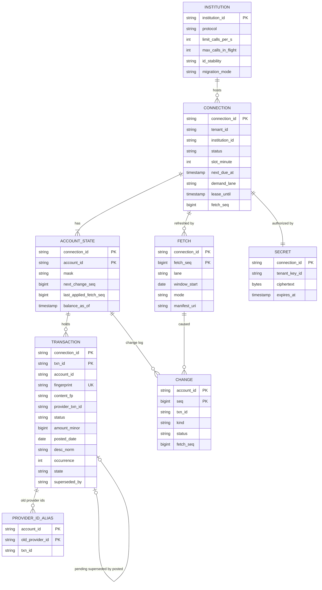

Columns left out of the diagram for space: `content_hash`, `missing_count`, `auth_date`, `currency` on `TRANSACTION`; `route`, `tier`, `demand_at`, `lease_epoch`, `last_success_at`, `vault_ref` on `CONNECTION`; `last_complete_fetch_date` on `ACCOUNT_STATE`; `lane_shares`, `breaker_state` on `INSTITUTION`; `payload` on `CHANGE`.

Access patterns that justify it:
- **The transaction store is partitioned by `connection_id`.** One fetch covers one connection's accounts, so one fetch is applied in **one transaction on one shard**. That single fact carries the whole idempotency story. 32 logical shards [estimate]; an account id carries its connection id, so a read by account finds its shard without a lookup.
- **Ingest diff** (every account window, ~1.4k/s): range read of `TRANSACTION` by `(connection_id, account_id, posted_date)` over the window, ~70 rows per account. Unique index on `(account_id, fingerprint)` makes every insert an upsert.
- **Pending candidates** (every new posted row): partial index on `(account_id, status = PENDING, state = ACTIVE)`. A handful of rows per account.
- **Content pairing and id migration** (§5.6): non-unique index on `(account_id, content_fp)`.
- **Consumer reads** (`/changes`): `CHANGE` by `(account_id, seq > cursor)`. Partitioned by day, dropped after 30 days.
- **Governor dispatch** (connection DB): `CONNECTION` by `(institution_id, demand_lane, demand_at)` for on-demand and webhook demand, and by `(institution_id, next_due_at)` for scheduled work, both filtered on `lease_until < now()`. The connection rows **are** the queue (§4.2).
- **Expiry sweeper**: pending rows by `auth_date` older than the expiry window. **Retention**: `TRANSACTION` hot 13 months, then the lake; `FETCH` rows 90 days, matching the raw store's hot tier.

**Money is integer minor units plus an ISO 4217 currency code.** No floats. A bank that sends `45.0` and later `45.00` must produce the same fingerprint, so amounts are parsed to integers before anything is hashed.

---
## 4. High-level design

One subsection per functional requirement. Each traces input to output through the boxes, adds the boxes it needs to one diagram, and ends with what is still missing. The design at the end of §4 is deliberately the simple version; §5 breaks it.

### 4.1 Connect: link accounts with a token, not a password

**What breaks first (the ladder, compressed).**
- **Naive: store the username and password and log in as the user** (screen scraping or OFX with credentials). Every login can trigger MFA that a background job cannot answer. Banks block scraper traffic. We hold millions of bank passwords. FDX reported in April 2025 that "tens of millions of consumers and small businesses in North America are still sharing financial data through methods that require sharing login credentials", so this route still exists, but it is the fallback, not the design.
- **Good: a partner aggregator for every bank.** No bank integrations to build. But we pay per connection, we inherit the partner's limits (Plaid's `/transactions/sync` allows 2,500 calls/minute per client by default, ~42/s), and the partner's outage is every bank's outage.
- **Chosen: a route per institution.** FDX OAuth directly for the top institutions (they are ~70% of accounts), a partner aggregator for the long tail, OFX Direct Connect only where nothing else exists. Every secret goes into a vault, encrypted under a per-tenant data key. FDX's API connections reached ~114 M customer connections in spring 2025, up from 76 M a year earlier (Open Banking Expo), so the token route covers most volume and is growing.

**Flow: a QuickBooks company links its B1 business checking (FDX route).**

1. The app calls `POST /v1/link-sessions {institution: B1}`. The connect service looks up B1's route (FDX OAuth), creates a link session with a PKCE (proof key for code exchange) verifier and a `state` value, and returns B1's authorize URL with the least scopes we need: accounts, balances, transactions.
2. The user logs in **at the bank**, completes the bank's MFA, and picks which accounts to share. We never see the password.
3. The bank redirects back with a one-time `code`. The app calls `POST /v1/connections` with it.
4. The connect service exchanges the code at B1's token endpoint (mutual TLS client authentication) for an access token (short-lived) and a refresh token (long-lived).
5. It writes both to the **vault**. The vault encrypts them under the tenant's data key, which is itself wrapped by a KMS (key management service) key, and returns a `vault_ref`.
6. It calls B1's accounts endpoint once, writes the `CONNECTION` row (route, slot, tier, `vault_ref`) and the account directory, and records an initial-history demand: 90 days, matching Plaid's default `days_requested` of 90 (maximum 730).
7. It returns `connection_id` and the accounts to the app.

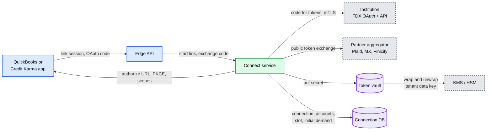

Data model touched: `CONNECTION`, `ACCOUNT_STATE` (directory entry), `SECRET`.

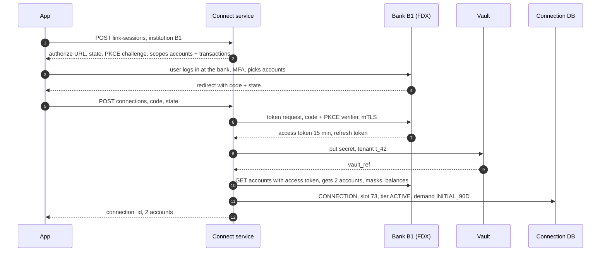

**What is still missing:** nothing fetches transactions yet, and nothing stops 3 M connections from all being fetched at once. §4.2.

### 4.2 Refresh: on a schedule, on demand, and on webhooks, inside the bank's limit

**What breaks first.**
- **Naive: a cron job at 2 AM that enqueues every connection, and a worker pool that calls banks as fast as it can.** At B1 that is 9 M calls released at once. Even at the full ~857 calls/s B1 really allows, that is a ~3 h wall of traffic at its limit, and in practice we hit `429 Too Many Requests` in the first second and retry into it.
- **Good: spread the schedule.** Hash each connection into a slot: `slot = hash(connection_id) mod 480` minutes, refreshed at `slot`, `slot + 8 h` and `slot + 16 h`. B1's scheduled load becomes a flat `26.1 M ÷ 86,400 = 302 calls/s`. Yodlee states the same goal for its nightly run: "uniformly distributing load ... eliminating refresh spikes". But a flat schedule alone does not bound on-demand taps, webhook bursts or retries, and each worker cannot know what the other 200 are doing.
- **Chosen: slots plus a rate governor.** One governor process owns each institution and holds its token bucket and its cap on calls in flight. A connector may call a bank only with a grant from it, and a grant is void unless its first call starts within 1 s (§5.1). The **connection rows are the queue**: the governor pulls due connections from the `next_due_at` index and demanded connections from the demand index. That gives three things a message queue would not: one outstanding refresh per connection however many triggers arrive (coalescing), durability without a separate queue, and a backlog after an outage that is just "rows with `next_due_at` in the past", drained at whatever rate the bucket allows.

**Flow: B1 connection c_9's 9:13 AM slot.**

1. c_9's `next_due_at` is already 09:13: the scheduler wrote it when the previous refresh finished, from c_9's slot (minute 73, so 01:13, 09:13 and 17:13) and tier (ACTIVE). The scheduler never enqueues anything; it only writes due times and demand.
2. The governor shard that owns B1 pulls due rows for B1 ordered by `next_due_at`, `FOR UPDATE SKIP LOCKED`, and for each one takes 4 tokens (the token call, accounts, 2 windows; the token call counts here when B1 meters its token endpoint with its data API, otherwise it takes a token from a sibling key) and 1 unit of the 800-call cap (a background job runs its calls one at a time). It writes a lease on c_9 (`lease_until = now + 45 s`, `fetch_seq = 58`) and hands a connector that is long-polling it a grant stamped `issued_at`.
3. The connector presents the grant to the vault. c_9's 15-minute access token expired hours ago, so the vault refreshes it at B1's token endpoint, inside the grant (the 4th call). Then the connector calls `GET /accounts` for balances, then `GET /accounts/{id}/transactions?startTime=<window start>&endTime=<today>` for each account in turn; the window start is `min(today − 14, last complete fetch − 1)` (§5.3). FDX filters this endpoint on `postedTimestamp`, and Plaid "always queries this endpoint using a startTime and an endTime".
4. It writes every response page to the **raw store** (object storage, immutable, keyed by content hash), then a manifest listing the pages, the window and `fetch_seq = 58`.
5. It releases the grant with `calls_used = 4`. The governor clears the lease and sets `next_due_at = 17:13`, the next slot. Whether c_9 counts as fresh is decided later: the ingester sets `last_success_at` only when the fetch commits (§4.3).

On-demand and webhook triggers differ only in step 1: the edge API writes `demand_lane = ON_DEMAND` (or `WEBHOOK`) and `demand_at = now` on the connection row and nudges the owning governor shard. A second trigger for a connection that already has demand or a lease changes nothing.

```mermaid
%% Incremental diagram, step 2 of 4: refresh. The scheduler sets due times and demand on connection rows. The governor owns each institution's bucket and is the only way to reach a bank. The bank is red: its limit is what breaks first (5.1).
flowchart LR
    APP[Apps] -->|"tap refresh"| API[Edge API]
    WH[Bank and partner<br/>webhooks] -->|"new data for c_9"| API
    API -->|"demand ON_DEMAND or WEBHOOK"| SCH[Refresh scheduler<br/>slots, tiers, demand]
    SCH -->|"next_due_at, demand"| CDB[(Connection DB<br/>rows are the queue)]
    CDB -->|"due and demanded rows<br/>per institution"| GOV[Rate governor<br/>bucket + call cap<br/>per institution]
    GOV -->|"job + grant + fetch_seq"| CW[Connectors<br/>FDX, OFX, partner]
    CW -->|"grant for token refresh"| VAULT[(Token vault)]
    CW -->|"accounts, 14-day windows"| BANK[Institutions<br/>and partners]
    CW -->|"pages + manifest"| RAW[(Raw store<br/>immutable)]
    CW -->|"release, calls used"| GOV

    class APP,API client
    class SCH,GOV,CW service
    class CDB,VAULT,RAW store
    class WH external
    class BANK critical

    classDef client   fill:#dbeafe,stroke:#2563eb,stroke-width:2px,color:#111
    classDef service  fill:#dcfce7,stroke:#16a34a,stroke-width:2px,color:#111
    classDef store    fill:#ede9fe,stroke:#7c3aed,stroke-width:2px,color:#111
    classDef critical fill:#fee2e2,stroke:#dc2626,stroke-width:4px,color:#111
    classDef external fill:#e5e7eb,stroke:#6b7280,stroke-width:2px,color:#111,stroke-dasharray:4 3
```

Data model touched: `CONNECTION` (`next_due_at`, `demand_lane`, `lease_until`, `lease_epoch`, `fetch_seq`), `SECRET` (rotated refresh token), raw objects.

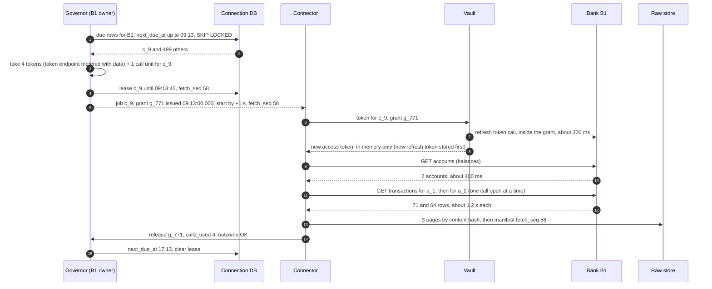

**What is still missing:** the raw pages sit in object storage. Nothing turns them into transactions, and a retry would fetch the same 135 rows again. §4.3.

### 4.3 Ingest idempotently: every fetch, retry and replay is a no-op for rows we already have

**What breaks first.**
- **Naive: insert every row in every response.** With 14-day windows each transaction is re-read about 56 times (`14 days × 4 fetches per account per day`), so the store would take 8.4 B rows/day instead of 150 M: ~56 copies of everything.
- **Good: dedupe on the bank's transaction id.** Correct for FDX, whose `transactionId` is a "long term persistent unique identifier ... unique within the scope of the account" that "must not be based on a counter that resets". It breaks on routes with no stable id (some OFX servers, credential-based fetches), and when a bank changes ids (§5.6).
- **Chosen: an immutable raw store, plus an upsert on a deterministic fingerprint, plus one database transaction per fetch.** The fingerprint is the provider id when the institution's ids are stable, otherwise a content hash with an occurrence counter (§5.3). The unique index on `(account_id, fingerprint)` turns every insert into an upsert, and a per-connection `fetch_seq` check makes a stale or repeated fetch a no-op.

**Flow: ingest c_9's fetch 58.**

1. The connector publishes `fetch-completed {connection: c_9, fetch_seq: 58, manifest_uri}` to Kafka `raw-fetches`, keyed by `connection_id`, so one connection's fetches are consumed in order by one ingester. If a connector wrote a manifest but died before publishing, a sweeper republishes any manifest older than 60 s that has no `FETCH` row [estimate].
2. The ingester reads the manifest and every page. Completeness is per account: a complete account window is applied, an incomplete one is skipped and never counts toward removals, so one closed account cannot block the others. It parses with the route's parser into canonical rows: amount to integer minor units, dates in the bank's own calendar, description normalized by a versioned normalizer.
3. It computes each row's fingerprint over the **whole window of an account**, never per page, so occurrence counters do not depend on page boundaries.
4. It opens one transaction on c_9's shard: lock `ACCOUNT_STATE` rows, check `58 > last_applied_fetch_seq` (else commit nothing and ack), read the account's existing rows in the window, and diff: new fingerprint means insert, same fingerprint with a different `content_hash` means modify, identical means nothing. A stored row missing from this complete window gets `missing_count + 1`.
5. It writes the inserts and modifications, the balances with their `as_of`, and `FETCH 58` with its manifest URI, sets `last_applied_fetch_seq = 58` and each account's `last_complete_fetch_date`, and commits. Only now does the connection's `last_success_at` move.
6. It commits the Kafka offset **after** the database commit. A crash between the two redelivers fetch 58, which now fails the `fetch_seq` check: a no-op.

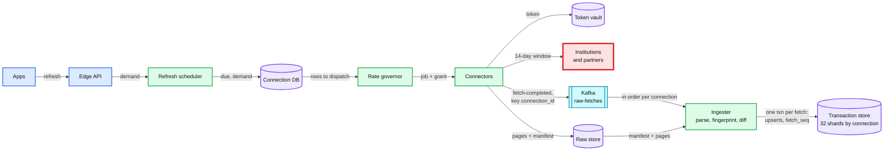

Data model touched: `FETCH`, `TRANSACTION` (insert or modify by fingerprint), `ACCOUNT_STATE.last_applied_fetch_seq`.

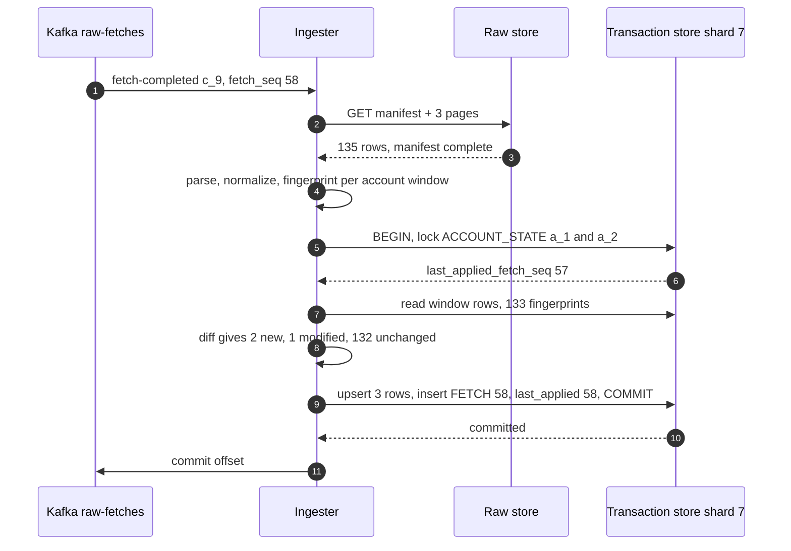

**What is still missing:** the store now holds both the $45.00 pending dinner and the $54.00 posted dinner as two transactions, and nobody downstream hears about any change. §4.4.

### 4.4 Reconcile pending and posted, and publish a clean stream

**What breaks first.**
- **Naive: show whatever the bank returned.** The pending $45.00 and the posted $54.00 (with a new id) are both on screen until the pending one drops off the bank's list. Spending is double-counted for 1 to 5 business days, and QuickBooks would book a pending authorization that may never settle.
- **Good: trust the provider's link.** Plaid's posted row carries `pending_transaction_id`; FDX has `referenceTransactionId` ("for credit card posting transactions, the identity of the authorization transaction"). But Plaid also says "in some rare cases, Plaid will fail to match a posted transaction to its pending counterpart", and legacy routes give no link at all.
- **Chosen: provider link first, rules second, expiry last, all inside the ingest transaction.** The matcher (§5.4) runs on every new posted row (and on every new pending row, against posted rows with no link yet): the provider link if present, otherwise rules on amount tolerance by merchant category, date window and merchant similarity. A matched pending row becomes SUPERSEDED. Pending rows that never match expire after 14 days (30 for hotels and car rental) [estimate]. Every change is appended to the account's **change log** in the same transaction, with a per-account sequence number, and relayed to Kafka from an outbox.

**Flow: the $45.00 pending dinner posts as $54.00 with a new id.**

1. Fetch 61 for c_9 contains a POSTED row: $54.00, "CAFE ROMA 0231", posted Thursday, provider id `p_88`, and no `referenceTransactionId`. The pending row `t_17` ($45.00, "CAFE ROMA", authorized Tuesday) is no longer in the bank's pending list.
2. The ingester inserts the posted row as `t_41` (new fingerprint).
3. The matcher looks for ACTIVE pending rows on the same account authorized within 14 days before the posted date. `t_17` qualifies: restaurant category, `54.00 ÷ 45.00 = 1.20`, within the 1.00 to 1.30 tip band [estimate]; merchant similarity 0.92; 2 days apart.
4. It sets `t_17.state = SUPERSEDED, superseded_by = t_41`, and `t_41.pending_txn_id = t_17`.
5. It appends to account a_1's change log: `seq 1042 REMOVED t_17 (reason SUPERSEDED)`, `seq 1043 ADDED t_41 (POSTED, pending_txn_id t_17)`. Same transaction as the rows, so a reader can never see both active.
6. An outbox relay publishes the two changes to Kafka `account-changes`, keyed by `account_id`. QuickBooks' bank-feed consumer reads with a posted-only filter and sees one event: `ADDED t_41 $54.00`. Credit Karma's consumer sees both and replaces the pending row in place.

This is Plaid's own model ("the pending transaction's transaction_id in the removed field ... and the new posted transaction in the added section"), so consumers written against Plaid already understand it. A posted transaction gets a new identity because the books need one that never changes.

```mermaid
%% Incremental diagram, step 4 of 4: the matcher runs inside the ingest transaction, and the change log leaves through an outbox. Consumers read a cursor, filtered to posted if they want.
flowchart LR
    APP[Apps] -->|"refresh, changes"| API[Edge API<br/>connect, refresh, feed]
    API -->|"demand"| SCH[Refresh scheduler]
    SCH -->|"due, demand"| CDB[(Connection DB)]
    CDB -->|"rows to dispatch"| GOV[Rate governor]
    GOV -->|"job + grant"| CW[Connectors]
    CW -->|"token"| VAULT[(Token vault)]
    CW -->|"14-day window"| BANK[Institutions<br/>and partners]
    CW -->|"pages + manifest"| RAW[(Raw store)]
    CW -->|"fetch-completed"| KR[[Kafka raw-fetches]]
    KR -->|"per connection"| ING[Ingester + matcher]
    ING -->|"rows, matches,<br/>change log, outbox"| TXN[(Transaction store)]
    TXN -->|"outbox relay"| KC[[Kafka account-changes<br/>key account_id]]
    KC -->|"posted only"| CONS[QuickBooks feed,<br/>Credit Karma, alerts]
    TXN -->|"changes after cursor"| API

    class APP,API,CONS client
    class SCH,GOV,CW,ING service
    class CDB,VAULT,RAW,TXN store
    class KR,KC queue
    class BANK critical

    classDef client   fill:#dbeafe,stroke:#2563eb,stroke-width:2px,color:#111
    classDef service  fill:#dcfce7,stroke:#16a34a,stroke-width:2px,color:#111
    classDef store    fill:#ede9fe,stroke:#7c3aed,stroke-width:2px,color:#111
    classDef queue    fill:#cffafe,stroke:#0891b2,stroke-width:2px,color:#111
    classDef critical fill:#fee2e2,stroke:#dc2626,stroke-width:4px,color:#111
```

Data model touched: `TRANSACTION.state`, `superseded_by`; `CHANGE`; `ACCOUNT_STATE.next_change_seq`.

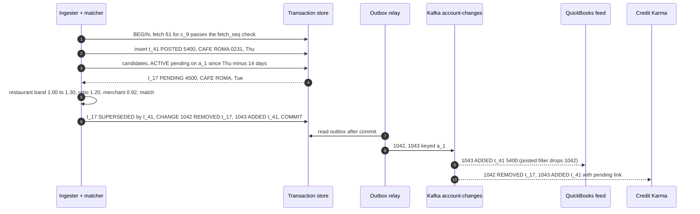

**What is still missing:** all of §5. One governor bucket per institution has no priority, so a Monday-morning surge of taps waits behind 302 calls/s of scheduled work, and a slow bank still gets our full rate (§5.1, §5.2). Two identical $5 coffees with no ids hash to the same fingerprint (§5.3). Two $45.00 pendings and one posted $54.00 need a rule (§5.4). A 6-hour outage leaves a 6.5 M-call backlog (§5.5). A bank that changes every id would double every transaction (§5.6). And the vault is now the most valuable box we own (§5.7).

---
## 5. Deep dives

One per non-functional requirement, phrased as the interviewer's question. Each names what breaks in the §4 design with a number, fixes it, and lists what changed in the API, the data model and the diagram.

### 5.1 "B1 allows 1,000 calls/s for all of our traffic. 3 M users want a refresh at 9 AM Monday. Who waits?"

**What breaks in the current design.** §4.2 has one FIFO bucket per institution.

1. **No priority.** At Monday 9 AM B1 sees ~590 calls/s of taps (10x the 59/s average) on top of 302/s scheduled and 56/s webhook: ~948/s. A FIFO bucket gives a tap no advantage over a scheduled refresh nobody is waiting for. In the extreme case (all 3 M users tap within 10 minutes, 9 M calls) FIFO either starves the schedule for hours, so every QuickBooks feed at B1 goes stale by noon, or makes every tap wait hours.
2. **The cap counts the wrong thing, and a slow bank gets our full rate.** At Flow 1's ~0.93 s per call, 1,000 calls/s means ~930 calls in flight (Little's law), already over the 800 the contract allows. A cap of 800 **jobs** cannot see it, because a job can have 2 calls open. If B1 slows to 5 s per call, 800 jobs hold up to 1,600 calls: 2x the contract, exactly when the bank is struggling.
3. **The real limit is not the contract.** Banks throttle by time of day, count other clients' traffic, or change limits without notice. Plaid warns that "the cause of the rate limit may be another client". A fixed rate gets `429`s.
4. **Fencing does not reach the bank.** An epoch fences our database; the bank answers whoever calls. A governor paused past its lease, connectors that have not heard the new epoch, or connectors that stall for 150 s while the governor reclaims and re-grants at 120 s, all end the same way: two sets of grants fire together (~4,800 calls in one second in the stall case).
5. **Uncounted calls.** The vault's OAuth refresh calls reach the bank outside the governor: +1 call per fetch (§2).

**The fix.**

- **Priority lanes as a hierarchical token bucket.** The same design Linux HTB (hierarchical token bucket) uses for bandwidth: each lane has a guaranteed share it always gets, and a ceiling up to which it may borrow spare tokens, in priority order. See [`../network-throttling/`](../network-throttling/) for the general version.

| Lane at B1 | Guarantee | Ceiling | Borrows | At ~857/s usable | Demand |
|---|---|---|---|---|---|
| On-demand (a user is waiting) | 20% | 60% | 1st | 171 / 514 | 59 avg, ~590 Monday 9 AM |
| Webhook-triggered | 15% | 45% | 2nd | 129 / 386 | 56 avg, ~1,330 for an hour after the nightly posting run |
| Scheduled | 40% | 100% | 3rd, 2nd once it lags 15 min | 343 / 857 | 302 flat |
| Retries and catch-up | 5% (retries) | 50% | 4th | 43 / 429 | ~8 retries |
| Unassigned float | 20% | | by priority | 171 | |

  **Who waits:** at Monday 9 AM taps want ~590/s and the lane tops out near 514, so its queue (2 minutes of lane ceiling, ~62k calls) fills and **~180k taps in the 9 AM hour, about a quarter, get the cached view with its `as_of` and an ETA**; their demand drops to the webhook lane. **The schedule never waits below its floor**, because one starved schedule is 3 M stale feeds, and nobody pressed a button for those. The real fix is commercial: ask B1 for a user-present allowance. Plaid's institution limit "is not applied to user-present traffic (e.g., within Link)", so banks already think this way. Simulated minute by minute in [`deep-dives/institution-outages-and-recovery.md`](deep-dives/institution-outages-and-recovery.md) §4.
- **A cap on calls in flight, next to the rate.** B1: 800 calls [estimate]. A grant holds one cap unit per call it may have open: background jobs run their calls one at a time and hold 1; taps run account windows in parallel and hold 2. At 0.93 s per call the cap allows ~857 calls/s. If B1 slows to 5 s per call, it holds us to `800 ÷ 5 s = 160 calls/s` by itself, which is what a struggling bank needs. The bucket and the cap must speak the same units: the bucket rate is `min(contract, cap ÷ measured call latency) × m` (~857/s at B1 today), so lane shares are shares of what can actually run, and the cap never re-orders work outside lane order.
- **Grants expire at the holder.** A grant carries `epoch`, `issued_at` and `start_by = issued_at + 1 s`; a connector refuses to start the first call after `start_by` (host clocks kept within 100 ms). Later calls must start before the 25 s job deadline, and the governor reclaims a grant only after `25 s + 20 s call timeout = 45 s`, never sooner. So a dead or paused governor, a stale-epoch grant or a stalled connector can only cause **under-use**, never a burst. The OAuth token call is inside the grant (4 tokens when the access token has expired, when B1 meters its token endpoint with its data API), or takes a token from a sibling governor key if the bank meters its token endpoint separately. The overshoot each rule removes is simulated in [`deep-dives/refresh-scheduling-and-rate-limits.md`](deep-dives/refresh-scheduling-and-rate-limits.md) §5 and §6.
- **An adaptive multiplier under the contract (AIMD: additive increase, multiplicative decrease).** Rate = `min(contract, cap ÷ latency) × m`. On a `429`, or p99 latency above 3x its baseline, `m = m × 0.5`, and any `Retry-After` is honored. Each clean minute, `m = m + 0.05` up to 1.0. The contract is the ceiling we never pass; m is the bank's actual mood today. For long-tail institutions with no agreement, the contract is a conservative default (5 calls/s, 5 in flight [estimate]) and m discovers the rest.
- **Fairness inside a lane, by caller.** Taps are served round robin by **calling user or firm**, not by tenant: an accounting firm that clicks "refresh all" across 5,000 client companies is 5,000 tenants but one caller, and gets one turn per round.
- **One owner per institution.** Institutions map to 32 governor shards [estimate]; each shard has one leader holding a 10 s lease in etcd with an increasing epoch ([`../../concepts/etcd.md`](../../concepts/etcd.md), [`../../concepts/leases-fencing-clocks.md`](../../concepts/leases-fencing-clocks.md)). etcd is one quorum across 3 regions, so a partition cannot elect two leaders. A **planned** handoff (a deploy) passes `m` and the in-flight table to the successor; only an **unplanned** failover starts with an empty bucket and ramps from m = 0.1, because a ramp gives up ~300k B1 calls and a deploy at 9 AM must not cause one.
- **Partners are institutions too.** A partner route is a governor key with the partner's own limits (Plaid's `/transactions/refresh` is limited to "2 per minute, 120 per hour, 2,880 per day (per Item)" and "100 per minute, 18,000 per hour, 432,000 per day (per client)"), and a per-(partner, bank) multiplier that learns the partner's hidden per-bank limit from its `INSTITUTION_RATE_LIMIT` errors.

**Push back on the textbook answer.** "Put a distributed token bucket in Redis and have every worker take a token before each call." It enforces a rate, and that is all it does. Priority needs one place that sees every waiter, or the next token goes to whoever polls first. A concurrency cap needs leases and release on completion, which a bucket key does not have. A Redis failover can reset the bucket and grant a fresh burst. Per-connector call slices (each pod holds a 1 s budget) share the grants' safety property, but were rejected as the main mechanism: 15k long-tail banks at 5 calls/s cannot be sliced across ~400 pods, and priority still needs one place that sees every waiter.

**What changed:** lanes (HTB) with a retry floor and a schedule that overtakes webhooks when late; the cap counted in calls; grants with a 1 s start-by and a 45 s reclaim; the token call inside the grant; AIMD; round robin by caller; planned handoffs that keep `m`. `INSTITUTION` gains `lane_shares`. The refresh API gains `202` with `eta_s` and `as_of`.

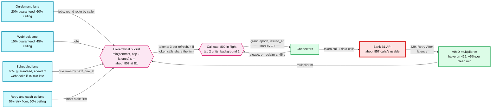

### 5.2 "Scheduled data under 8 hours old, and a tapped refresh back in 30 seconds. How?"

**What breaks in the current design.**

1. **A failed refresh waits for its next slot.** With 8 h between slots, one `5xx` at B1 makes that connection up to 16 h stale. At a 2% institution-level failure rate [estimate], that alone puts ~2% of active connections near the p95 line.
2. **On-demand results queue behind scheduled ingestion.** Both go through `raw-fetches`. After a catch-up, ingester lag can reach minutes, and a tap whose bank call took 3 s waits 10 minutes for its rows.
3. **Webhook bursts.** After a bank's nightly posting run, a partner can send ~1.6 M `SYNC_UPDATES_AVAILABLE` webhooks for B1 within an hour: ~1,330 calls/s against the webhook lane's ~386/s ceiling.
4. **Tiers go stale.** A dormant connection (1 refresh/day) whose owner opens the app today should not wait until tomorrow's slot.
5. **The SLO has almost no slack.** A perfect 8 h schedule already has a p95 staleness of `0.95 × 8 h = 7.6 h`. **The schedule can fall only ~24 minutes behind before the 8 h p95 breaks.**

**The fix.**

- **Retries in their own lane, with backoff.** A failed job sets `next_due_at` to now + 5 min, 15 min, 1 h [estimate] in the retry lane, not the next slot. The lane's 5% floor means a failure is retried within the hour even when the bank is tight. Only per-connection failures (consent revoked, MFA needed) stop retries and move the connection to `NEEDS_USER_ACTION`.
- **A separate interactive path through ingestion.** On-demand fetches publish to `raw-fetches-interactive`, consumed by a reserved ingester pool. A scheduled backlog never delays a tap.
- **Webhooks are coalesced hints.** A webhook sets demand on the connection row; a webhook for a connection whose next slot is within 4 h is folded into that slot. With about half of a 1.6 M burst folded, the rest drains in ~1.5 to 2 h (by 03:28 at 1,000/s, 03:43 at 857/s), inside the 8 h target. Once the schedule lags 15 minutes it borrows **ahead** of the webhook lane: webhooks are hints, the schedule carries the SLO, and schedule lag over 15 minutes pages.
- **Tier promotion on read.** Any read by the owner promotes a dormant connection to active, and triggers an on-demand refresh if its data is older than 4 h [estimate].
- **If the real contract is half (500/s).** What degrades, in order: retries, then the schedule at night, then taps at 9 AM. With the rules above, retries never wait and taps absorb the shortfall (~438k get the cached view), but the 8 h p95 holds by only ~3 minutes (lag peaks at 21 min), and a 6 h outage on top pushes lag to 33 min (p95 ~8.2 h, a breach). So demoting active connections nobody read in 7 days to 2 refreshes a day is **the margin, not an extra**: switch it on whenever the contract is that small ([`deep-dives/institution-outages-and-recovery.md`](deep-dives/institution-outages-and-recovery.md) §4).
- **The latency budget for a tap** (when the lane is not in surge):

| Step | p50 | p95 |
|---|---|---|
| API to governor, grant issued | 50 ms | 2 s |
| Vault: KMS decrypt, then the bank's token endpoint (token expired) | 0.3 s | 1.5 s |
| Bank: accounts call | 0.4 s | 2 s |
| Bank: transactions calls, accounts in parallel | 1.2 s | 6 s |
| Raw store, interactive topic, ingest transaction, long poll returns | 0.35 s | 1.2 s |
| **Total** | **~2.3 s** | **~13 s** |

  Each bank call has a 20 s timeout and the job a 25 s deadline. At the deadline the API answers with what is stored and its `as_of`, and the job finishes in the background. **The 30 s p95 holds when the bank is healthy and the lane is not in a declared surge (Monday 9 AM at B1 is one); both exceptions are visible to the user, not hidden.**
- **SLI (service level indicator) for freshness**: staleness of each active connection, `now − last_success_at`, where the ingester sets `last_success_at` on commit. p95 under 8 h; any connection over 24 h is a ticket.

**Push back on the textbook answer.** "Use webhooks instead of polling." There is usually nobody to push: most banks do not notify, and partners send webhooks only after they have polled the bank themselves. A webhook is a hint that saves a few hours of staleness. The schedule stays the floor, and every webhook goes through the same governor as everything else.

**What changed:** the retry lane with its floor, webhooks folded into near slots, the schedule overtaking webhooks when late, `raw-fetches-interactive` with its own ingester pool, tier promotion, the 25 s job deadline, and the staleness SLI with a 15-minute lag page. [`deep-dives/refresh-scheduling-and-rate-limits.md`](deep-dives/refresh-scheduling-and-rate-limits.md).

### 5.3 "A worker crashes halfway through a page. Two identical $5 coffees and no ids. Exactly once?"

**What breaks in the current design.**

1. **Two identical coffees collapse.** Same account, same posted date, $5.00, "BLUE BOTTLE". With no provider id, a content hash gives both the same fingerprint, and the second is dropped as a duplicate. A real transaction is missing from the books.
2. **Counters by rank.** Ranked page by page, two coffees on different pages both become #1. Ranked on a field the bank can edit (raw description), an edit to one coffee swaps the two `txn_id`s: two MODIFIED events for the wrong rows, and a QuickBooks match now points at the other store's charge.
3. **Pages that shift.** On offset pagination, a row posted between our page 1 and page 2 shifts the offsets, one row appears on both pages, and on a no-id route that is a fake third coffee.
4. **A normalizer upgrade.** If cleaning "POS 1234 BLUE BOTTLE #22" changes, every content fingerprint changes and the next fetch looks like 70 new rows per account.
5. **A replayed old fetch.** Re-ingesting fetch 57 after fetch 61 was applied would resurrect the pending dinner that 61 superseded.
6. **Window edges.** A connection stuck in `NEEDS_USER_ACTION` for 20 days comes back to a 14-day window: 7 days of transactions are never read. A row backdated by exactly 14 days lands on the guard day and is never inserted.
7. **An empty answer.** A bank in a silent outage answers `200 OK` with empty lists. Two such fetches 6 h apart would remove every posted row in the window: ~400 M REMOVED events at B1.

The crash itself is the easy part: one fetch is one database transaction, so a crash leaves either all of it or none of it, and the retry recomputes the same fingerprints from the same immutable raw pages.

**The fix: the fingerprint, defined exactly.**

- **Stable ids** (`id_stability = STABLE`, e.g. FDX `transactionId`, Plaid `transaction_id`): `fingerprint = H(institution, account, status, provider_txn_id)`. FDX requires pending and posted versions to have different ids, which is why status is in the key.
- **No stable ids:** `fingerprint = H(account, status, date, amount_minor, currency, desc_norm, normalizer_major, occurrence)`, where date is the posted date for posted rows and the authorization date for pending rows.
- **Always also** `content_fp`, the same formula without the provider id, stored for pairing (§5.6).
- **The occurrence counter, step by step:**
  1. Compute it only over a **complete account window**, after all pages are in. Never per page.
  2. The window is whole posted dates in the bank's calendar, from `min(today − 14, last complete fetch − 1)` to today, so a connection back from a 20-day gap reads 21 days once. One fetch per account per week reads 60 days (~1 B more rows re-read/day, no extra bank calls) to catch rows backdated up to 59 days. The first day is a **guard day**: a bank filtering dates in another timezone can only cut rows **off** it, so a guard-day row is inserted only when its group has more incoming rows than stored rows.
  3. Group rows by the base key `(status, date, amount_minor, currency, desc_norm)`.
  4. **Pair first, then number.** Inside a group, pair each incoming row with a stored row: exact match first, then the highest description similarity, ties to the lower stored occurrence. A paired row keeps its stored occurrence, so its fingerprint. Only unpaired incoming rows get new numbers, `max + 1`. Unpaired stored rows are "missing".

  Why this is stable: the occurrence is a **stored attribute**, never recomputed. A re-fetch cannot change it; an edit to one coffee's description stays on that coffee; a third coffee becomes #3. Fully identical rows still pair exactly, so `{#1, #2}` stays `{#1, #2}`. It is the same pairing pass as §5.6. Simulated in [`deep-dives/idempotent-ingestion.md`](deep-dives/idempotent-ingestion.md) §4, §5 and §8.
- **Pages.** Request a page size above the window (Plaid's `count` maximum is 500; FDX has a `limit` parameter), so almost every account window is one page. When a window spans pages on a no-id route, check that the total count did not change between pages; if it did, restart from page 1. Plaid documents the same rule for its own cursor: "the entire pagination request loop must be restarted".
- **Removals need two looks and a guard.** A stored row missing from a complete window gets `missing_count + 1`; it becomes REMOVED only after 2 consecutive complete fetches at least 6 h apart. A fetch that would remove more than `max(5, 20%)` of an account's stored posted rows is quarantined, and an institution where over 1% of account windows come back empty in 30 minutes trips a **data breaker** (§5.5). A `200 OK` with empty lists never removes posted rows.
- **Normalizer versions.** The fingerprint includes the normalizer's major version. A new major version is rolled out by computing both versions, matching on the old one and re-keying to the new one, account by account on its next fetch. A normalizer change never creates a duplicate.
- **Order.** `fetch_seq ≤ last_applied_fetch_seq` means skip. A deliberate reprocessing (a parser bug fix) never uses the live path: it rebuilds into a shadow table in `fetch_seq` order and is diffed before the swap.
- **A spike guard.** A fetch that would add more than `max(20, 5 × the account's p99 daily adds)` [estimate] rows, scaled by the days it covers that we had not seen before, is quarantined: nothing is emitted and the on-call is alerted. INITIAL history fetches (90 days, ~450 rows) have their own budget. It is the last line against every bug above, and the first detector for §5.6.

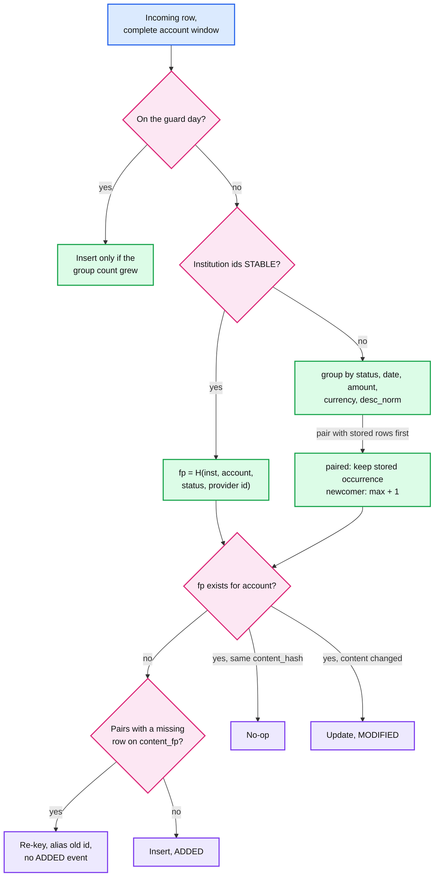

**Push back on the textbook answer.** "Turn on Kafka exactly-once." Kafka transactions make a read-process-write loop exactly once **inside Kafka**. Our side effect is a Postgres write, and our duplicates come from the bank re-sending the same rows on purpose, which no broker setting can see. At-least-once delivery, plus one database transaction per fetch, plus a unique fingerprint, plus a `fetch_seq` check gives an exactly-once **effect** with nothing exotic. See [`../../concepts/exactly-once.md`](../../concepts/exactly-once.md).

**What changed:** the exact fingerprint, pair-then-number occurrences, the gap-aware window and weekly 60-day read, the count-based guard day, two-look removals with a removal guard, the spike guard by unseen days, normalizer versioning, the shadow rebuild path. `TRANSACTION` gains `content_fp`, `occurrence` (stored), `missing_count`. [`deep-dives/idempotent-ingestion.md`](deep-dives/idempotent-ingestion.md).

### 5.4 "A $45.00 pending charge posts two days later as $54.00 with a new id. One transaction or two? What if there were two $45.00 pendings?"

**What breaks in the current design.** §4.4 matches the easy case. The hard ones:

1. **Two candidates.** Two $45.00 pendings at the same restaurant (two dinners, or a merchant that authorized twice) and one $54.00 posted row. Both score the same.
2. **Holds that are not the amount.** A gas pump authorizes $1 or holds $100+ and posts $52.37. A hotel holds $300 and posts $212. An amount rule rejects both.
3. **The gap.** Some banks drop the pending one fetch before the posted row appears. Emitting REMOVED at once makes the balance jump, then jump back.
4. **Never posts.** Plaid: "a pending transaction may not convert to a posted transaction at all and will simply disappear", e.g. an authorization hold. Some banks keep listing stale pendings for weeks.
5. **No pendings at all.** Plaid notes Capital One and USAA "do not provide pending transaction data". Nothing to match; posted rows are simply added.
6. **Edits and late arrivals on no-id routes.** A pending whose amount changes while still pending ($45.00 to $54.00) gets a new fingerprint: two pendings, $99.00 of dinner, for ~8 h (24 h on a dormant connection). A pending listed **after** its posted row never matches, because the matcher ran when the posted row arrived: a double count for up to 14 days.

**The fix.**

- **Provider link first.** Plaid's `pending_transaction_id`, FDX's `referenceTransactionId`. Deterministic, wins over every rule.
- **Rules second, by merchant category** [all bands are estimates to tune on labeled data]:

| Category | Amount rule (posted ÷ pending) | Date window | Merchant similarity |
|---|---|---|---|
| Restaurants, bars, taxis, salons | 1.00 to 1.30 (tips) | 14 days | at least 0.8 |
| Fuel | any amount (the pending is a hold) | 7 days | at least 0.9 |
| Lodging, car rental | 0.5 to 1.5 | 30 days | at least 0.8 |
| Foreign currency | within 3% | 14 days | at least 0.8 |
| Everything else | exact | 14 days | at least 0.8 |

- **Assignment.** Per account, score every (new posted, active pending) pair that passes the rules, then assign greedily by score. Ties go to the **oldest pending first**, then by `txn_id`, so the result is deterministic and a re-run gives the same answer. Two $45.00 pendings: the older one is superseded by the $54.00 row; the younger stays ACTIVE until its own posted row arrives or it disappears. The pair is interchangeable to the user; the count is what must be right.
- **Grace for drops.** A pending missing from the bank's list is REMOVED only after 2 consecutive complete fetches at least 6 h apart. Usually the posted row arrives in the same fetch (Plaid: "these aren't guaranteed to be in the same page, but should happen within the same overall update").
- **Expiry.** A sweeper marks an ACTIVE pending EXPIRED after its category's window (14 days default, matching Plaid's "up to fourteen days in rare situations"; 30 for lodging and car rental), even if the bank still lists it, and appends `REMOVED (reason EXPIRED)`. A posted row that arrives later is added with no link. Nothing is double counted.
- **Split captures.** One $100 order authorization that posts as $60 and $40: the first posted row supersedes the pending; the second is added with an informational link only.
- **Pending continuity (no-id routes).** Before inserting a new pending row, pair it with an active pending that went missing in this same window: same date, same `desc_norm`, amount inside the category band. A pair keeps the `txn_id`: one MODIFIED, no second pending. The self-loop in the state diagram below holds on stable-id routes by the id, and on no-id routes only because of this rule.
- **Reverse match.** A new pending row is also matched against posted rows in the window that have no pending link, same rules. A match inserts it directly as SUPERSEDED with the link and emits nothing to posted-only consumers.
- **Terminal states.** SUPERSEDED and EXPIRED never come back. If the bank keeps listing or edits a superseded pending, its stored content may change for audit, but no event is emitted and the row is never reactivated.
- **The stream contract.** Per account, `seq` strictly increases with no gaps inside an epoch. Every entry carries the row's status. The posted filter keeps entries whose status is POSTED, so pending churn never reaches QuickBooks. Consumers apply idempotently on `(account_id, seq)`. The cursor is `(epoch, seq)`, retained 30 days; older cursors get `410` and resync from a snapshot.
- **Why heuristics are acceptable here.** Pending rows are display-only; the books see only posted rows. A wrong pending match leaves a pending row on screen a day longer. It never changes a posted row. Matching posted to posted (dedup) is never heuristic: that is the fingerprint's job (§5.3).

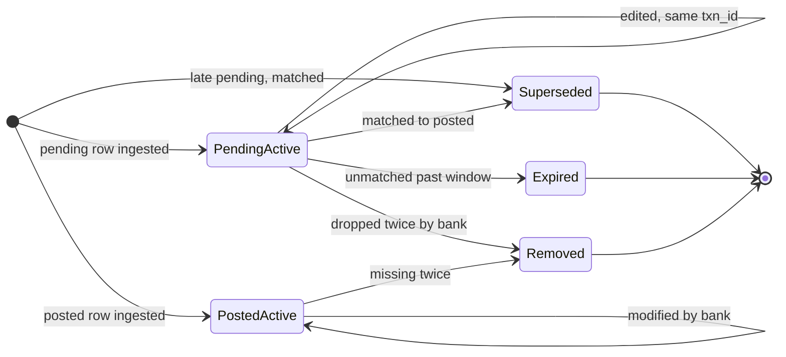

**Push back on the textbook answer.** "Match on equal amounts." Tips, fuel holds and hotel holds are exactly the transactions people look at. Equal-amount matching fails on the cases that matter and succeeds only where the provider link already exists.

**What changed:** the category rules, deterministic assignment, pending continuity, the reverse match, terminal SUPERSEDED and EXPIRED, grace for drops, the expiry sweeper, the `(epoch, seq)` cursor and the posted filter. Both no-id gaps are reproduced and fixed in [`deep-dives/pending-to-posted-matching.md`](deep-dives/pending-to-posted-matching.md) §5 and §8.

### 5.5 "B1's API is down for 6 hours. What do users see, and what happens when it recovers?"

**What breaks in the current design.**

1. **We keep calling.** Without a breaker, every lane keeps dispatching into timeouts. 800 calls held open for a 20 s timeout each is ~40 failing calls/s, and every failure schedules a retry: the retry lane fills with B1 work for 6 hours.
2. **Taps hang.** A tap waits its full 25 s and gets nothing.
3. **Recovery is a stampede.** After 6 h, about `6/24 × 8.7 M ≈ 2.2 M` B1 connections are stale (~6.5 M calls), plus parked taps and webhook demand. Releasing that at the full 1,000/s into a bank that has just come back can knock it over again.
4. **Other banks suffer.** If B1's hung calls occupied a shared worker pool, every other institution would starve.
5. **Silent outages pass every call check.** A bank whose backend lost its data but whose API answers `200 OK` with empty lists keeps the breaker closed. Two such fetches 6 h apart would remove ~400 M posted rows at B1 (`6 M accounts × ~67`).

**The fix.**

- **Bulkhead by construction.** The call cap is per institution, so B1 can hold at most 800 connector slots out of a pool sized for the fleet. Other institutions do not notice.
- **A breaker per institution, in the governor.** One breaker per institution in one place, not one per worker, so there is no fleet-wide herd of breakers closing at the same moment. It looks at the last 200 calls, never more than 5 minutes back, and opens when at least 20 of them were made and 50% failed with **institution-level** errors (`5xx`, timeouts, `429` after backoff), on 5 consecutive failures at a tiny institution, or when p99 latency passes 20 s [estimate]. On timeouts at B1 it opens ~22 s after the outage starts; a pure 5-minute window would take 2.5 to 4.6 minutes. Per-connection errors (consent revoked, wrong password, closed account) never count. FDX's `503` "Scheduled maintenance" with a `Retry-After` header opens it until that time without paging anyone.
- **While open.** No dispatch to B1. A tap gets an immediate answer: the stored data, its `as_of` time and "B1 is not responding; we will refresh when it is back", with an opt-in notification. Scheduled rows simply age. Webhook demand stays on the rows.
- **Half-open, then ramp.** Every 60 s, probe at 1 call per 10 s using a canary set of 20 healthy connections; 20 consecutive successes close it. The AIMD multiplier then restarts at m = 0.1 and doubles every 2 minutes while errors stay under 2%: 10%, 20%, 40%, 80%, 100%, about 8 minutes. Any `429` or `5xx` spike halves it.
- **A data breaker next to the call breaker.** If over 1% of an institution's account windows come back empty in 30 minutes where the previous fetch had at least 5 rows, fetching continues (raw pages are evidence), ingestion for that institution pauses, and the on-call is paged. With the per-account removal guard (§5.3), an empty `200 OK` never deletes books.
- **Catch-up, most stale first.** When the breaker starts ramping, connections whose next regular slot is within 2 h keep it (with 8 h slots, ~25% of them). The rest (~1.65 M, ~5 M calls) enter the catch-up lane ordered by `last_success_at`; taps parked in the last hour go first, in the on-demand lane. No jitter: one governor already meters every call, so a random order only raises the p95. If B1 comes back at Monday 09:00, the morning peak leaves only ~100 calls/s spare: the webhook backlog drains ~10:25 and **the catch-up finishes ~13:00** (~13:04 simulated; ~14:00 if no webhook can be folded), about 4 h after recovery ([`deep-dives/institution-outages-and-recovery.md`](deep-dives/institution-outages-and-recovery.md) §4).
- **Nothing is lost.** The 14-day window covers the 6 h gap. The catch-up is a freshness optimization, not a correctness requirement.

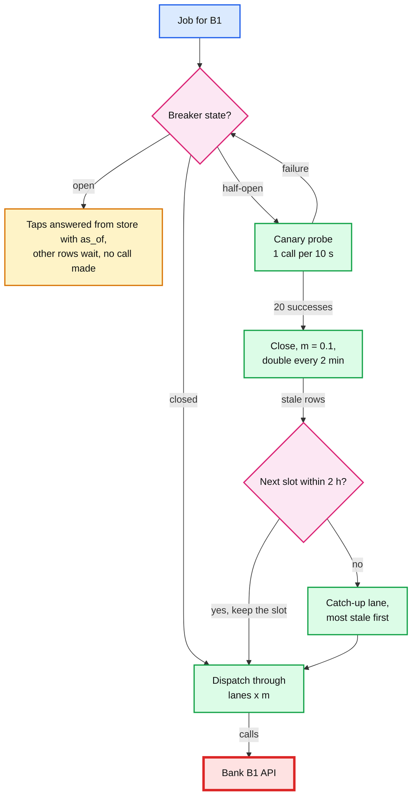

**Push back on the textbook answer.** "Replay every missed refresh when the bank comes back." Overlapping windows make missed refreshes coalesce: one fetch per stale connection replaces all the slots it missed. For a 6 h outage that changes little (each connection missed at most one 8 h slot), but for a 24 h outage it is 9 M calls instead of 26 M. And the connections whose next slot is near need nothing at all.

**What changed:** the call breaker and the data breaker per institution, the canary probe, the ramp, the most-stale-first catch-up, and the outage message in the refresh API. [`deep-dives/institution-outages-and-recovery.md`](deep-dives/institution-outages-and-recovery.md).

### 5.6 "B1 migrates its core system and every transaction id changes. What happens to dedup?"

**What breaks in the current design.** B1 is a STABLE-id institution, so fingerprints are built on its ids. After the cutover, each account's next fetch returns ~70 rows with new ids. All 70 look new; ~67 duplicate rows we already hold, and the ~67 old rows go missing and are removed two fetches later. Across B1: `3 M connections × 2 accounts × ~67 ≈ 400 M` duplicate posted adds, then ~400 M removes, pushed to QuickBooks within ~8 h. Every B1 customer's books double, then halve.

**The fix.**

- **Always keep a content fingerprint**, even for STABLE institutions (§5.3).
- **A pairing pass in every ingest.** Before inserting a row whose id is new, pair it with a stored row that went missing in this same complete window: first on equal `content_fp`, then on (date, amount) with description similarity of at least 0.8. A pair is a **re-key**: update `provider_txn_id` and `fingerprint`, write `PROVIDER_ID_ALIAS (old id → txn_id)`, emit nothing (or MODIFIED if a visible field changed). The same pass absorbs the occasional single id change.
- **Per-account detection.** If 50% or more of the window's stored rows re-key in one fetch [estimate], the fetch is flagged `ID_REMAP`.
- **Per-institution detection.** If more than 1% of B1's fetched accounts are flagged in a rolling 30 minutes [estimate], B1 enters `migration_mode = REMAP`: every ingest pairs first, the spike guard tightens, and the on-call and the institution-relations team are paged. B1 runs ~280 account fetches/s, so after a cutover nearly every fetch is flagged and the 1% line is crossed in well under a minute.
- **Formats change too.** If the new core also rewrote descriptions, `content_fp` will not match. In REMAP mode, pair per day on (date, amount) when the per-day counts match exactly; if they do not, quarantine that account's fetch (emit nothing) for review. Rows older than the window keep their old ids; a deep history refetch, if ever needed, runs in REMAP mode.
- **Route switches are the same problem.** When a connection moves from a credential route to FDX OAuth after re-consent, the new route's ids differ from the partner's. Its first fetch on the new route runs in REMAP mode.

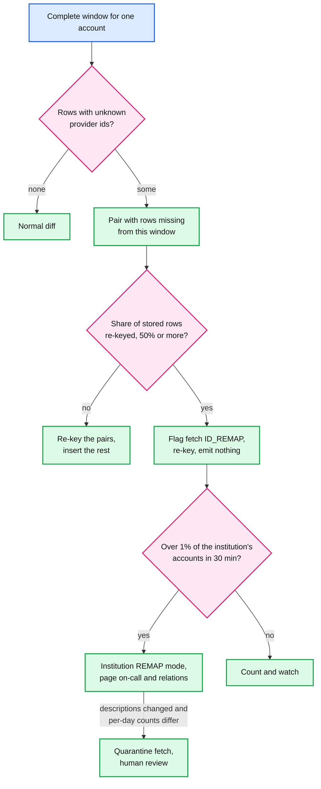

**What changed:** the pairing pass, `PROVIDER_ID_ALIAS`, `migration_mode` on `INSTITUTION`, the institution-level detector and its page. [`deep-dives/institution-outages-and-recovery.md`](deep-dives/institution-outages-and-recovery.md).

### 5.7 "Where do credentials live, and how does the move away from screen scraping change the design?"

**What breaks in the current design.** The vault holds tokens for 15 M connections, and any connector can ask it for any of them. The raw store holds full bank responses (names, account details) in whatever form the bank sent. One compromised connector, or one leaked object-store credential, exposes everyone.

**The fix.**

- **Envelope encryption with per-tenant keys.** Each tenant (a QuickBooks company, a Credit Karma user) has a data key, wrapped by a KMS key held in an HSM (hardware security module). Raw objects are encrypted with the same tenant key before they are written. **KMS load:** a 5-minute cache of unwrapped keys almost never hits, because a tenant's connections are fetched 8 h apart, so each fetch costs 1 to 2 KMS decrypts: 3k to 6k/s at the ~3k refreshes/s peak, against AWS KMS's default shared quota of 10,000 cryptographic requests/s per account and Region. So the vault routes requests by tenant and holds the key for the life of a fetch (or adds a per-shard key layer), and we raise the quota. **Deletion:** destroying a tenant's data key makes every token and raw page unreadable (crypto-shredding), but only once the last backup holding the wrapped key has expired (35 days [estimate]); the deletion SLA says so.
- **Grant-bound secret access.** The vault releases a token only to a connector presenting a governor grant for that exact connection, signed, from the current epoch, and under 1 s old. A compromised connector can read only the tokens of jobs it was given. Every secret read is logged with `(connection, grant, lane, job)`; a read without a grant pages security.
- **OAuth refresh without races.** The refresh call is a bank call, counted inside the grant. Refresh tokens often rotate on use, so two workers refreshing at once leave one with `invalid_grant`: the vault refreshes single-flight **cluster-wide** (a row lock on the secret, or routing by connection to one vault node) and writes the new refresh token durably before anyone uses the access token. Rotation with replay detection has a second trap: if the bank's reply is lost, our retry presents the retired token and the bank revokes the whole grant (at 1 lost reply in 10,000, ~1,000 B1 reconnects a day [estimate]). So we ask banks for certificate-bound refresh tokens (RFC 8705) or a reuse grace window, and retry only when the request provably never left ([`deep-dives/connectors-and-credentials.md`](deep-dives/connectors-and-credentials.md) §3 to §5). A real `invalid_grant` means the user revoked consent: the connection goes to `NEEDS_USER_ACTION` and leaves every lane. Scopes are accounts, balances and transactions only, and `DELETE /connections/{id}` revokes the token at the bank.
- **Legacy credentials, only where no token route exists.** Stored encrypted the same way, preferably held by a partner aggregator instead of us. A background fetch that hits an MFA challenge cannot answer it: the connection goes to `NEEDS_USER_ACTION`, and the next user-present session answers the MFA prompt interactively (5-minute session).
- **Network.** Connectors egress through fixed IP ranges that banks allowlist, with mutual-TLS client certificates per environment. The standby region's IPs are allowlisted too, or a region failover stops every fetch.
- **CFPB Section 1033, dated.** As of the Cozen O'Connor alert of 2026-04-09: the CFPB finalized the rule in October 2024 with the first compliance date of April 1, 2026 for the largest providers; a federal court in the Eastern District of Kentucky enjoined enforcement; the CFPB began reconsideration with an advance notice of proposed rulemaking in August 2025. FDX was recognized by the CFPB as a standard-setting body in early 2025 (Open Banking Expo). **Design consequence:** none in the architecture. The route per institution is configuration, and we move institutions from credentials to FDX tokens as they open APIs, rule or no rule. If banks end up allowed to charge for access, the tier policy (§2) becomes a cost lever.

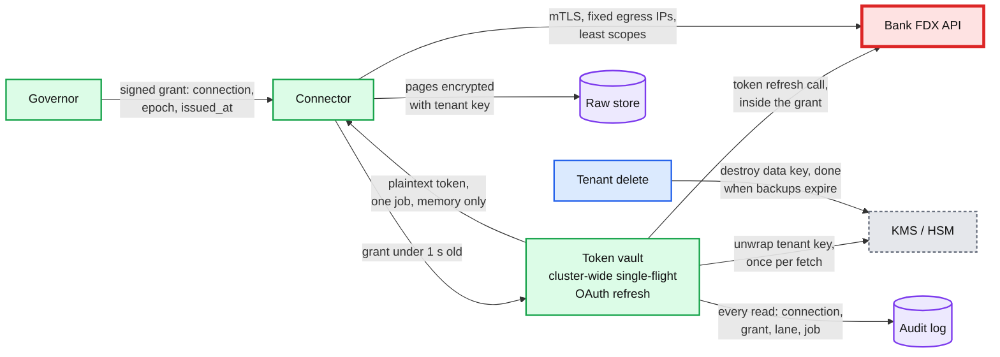

**What changed:** per-tenant data keys for secrets and raw pages, KMS sized and cached per fetch, grant-bound vault reads, cluster-wide single-flight OAuth refresh inside the grant, the `NEEDS_USER_ACTION` state, fixed egress, a deletion SLA that counts backups. [`deep-dives/connectors-and-credentials.md`](deep-dives/connectors-and-credentials.md).

---
## 6. Final design and the six core flows

Everything from §5 composed. 14 nodes; zoom-ins in [`diagrams.md`](diagrams.md). The bank is the one red node: every lane, cap, breaker and ramp in this design exists because its limit and its availability are not ours. Not drawn: the Parquet lake (transactions older than 13 months) and the expiry sweeper (a job on the transaction store).

```mermaid
%% D3: final design. The institutions are red: their rate limits and outages are the first thing that breaks, and the governor exists to protect them and us.
flowchart LR
    APP[QuickBooks and<br/>Credit Karma apps] -->|"link, tap refresh,<br/>read changes"| API[Edge API<br/>connect, refresh, feed, webhooks]
    API -->|"demand: on-demand, webhook"| SCH[Refresh scheduler<br/>slots, tiers, catch-up order]
    SCH -->|"next_due_at, demand"| CDB[(Connection DB<br/>rows are the queue)]
    CDB -->|"due and demanded rows"| GOV[Rate governor, 32 shards<br/>lanes, call cap, 1 s grants,<br/>AIMD, call + data breakers]
    GOV -->|"job + grant + epoch"| CW[Connectors<br/>FDX, OFX, partner]
    CW -->|"grant for token refresh"| VAULT[(Token vault<br/>per-tenant keys, KMS)]
    CW -->|"token + data calls,<br/>within the grant"| BANK[Institutions and partners<br/>limits, outages, id changes]
    CW -->|"encrypted pages + manifest"| RAW[(Raw store<br/>immutable, 90 d hot)]
    CW -->|"fetch-completed,<br/>scheduled or interactive"| KR[[Kafka raw-fetches]]
    KR -->|"in order per connection"| ING[Ingester + matcher<br/>fingerprint, pair, match]
    RAW -->|"pages"| ING
    ING -->|"one txn per fetch:<br/>rows, change log, outbox"| TXN[(Transaction store<br/>32 shards by connection)]
    TXN -->|"outbox relay"| KC[[Kafka account-changes]]
    KC -->|"posted only, or all"| CONS[QuickBooks feed,<br/>Credit Karma, alerts]
    TXN -->|"changes after cursor"| API

    class APP,API,CONS client
    class SCH,GOV,CW,ING service
    class CDB,VAULT,RAW,TXN store
    class KR,KC queue
    class BANK critical

    classDef client   fill:#dbeafe,stroke:#2563eb,stroke-width:2px,color:#111
    classDef service  fill:#dcfce7,stroke:#16a34a,stroke-width:2px,color:#111
    classDef store    fill:#ede9fe,stroke:#7c3aed,stroke-width:2px,color:#111
    classDef queue    fill:#cffafe,stroke:#0891b2,stroke-width:2px,color:#111
    classDef critical fill:#fee2e2,stroke:#dc2626,stroke-width:4px,color:#111
```

The six flows below are the ones to say from memory. Each is the final design, not the §4 version.

### Flow 1: a scheduled refresh at B1 (about 4.5 s from dispatch to consumers)

1. 09:13:00.000. c_9's row is due. The B1 governor shard pulls it in a batch of 500 (`SKIP LOCKED`), takes 4 tokens from the scheduled lane (when B1 meters its token endpoint with its data API, as assumed here) and 1 of 800 call units, writes the lease (until 09:13:45) with `fetch_seq 58` and epoch 12.
2. +5 ms. A connector long-polling the shard receives the grant (`issued_at` 09:13:00.000, first call by +1 s) and presents it to the vault.
3. +0.3 s. c_9's access token expired hours ago: the vault refreshes it at B1's token endpoint (call 1 of 4, inside the grant) and stores the new refresh token before handing over the access token.
4. +0.7 s. B1 answers `GET /accounts`: 2 accounts, balances.
5. +1.9 s and +3.1 s. B1 answers the two 14-day windows, one after the other (a background job holds 1 call unit): 71 and 64 rows, one page each.
6. +3.3 s. 3 encrypted pages and the manifest are in the raw store. `fetch-completed` goes to `raw-fetches`. The grant is released with `calls_used 4`; `next_due_at` becomes 17:13.
7. +3.5 s. The ingester reads the pages, computes fingerprints over each whole account window, opens one transaction on shard 7, checks `58 > 57`, diffs 135 rows against 133 stored: 2 inserts, 1 modification, 0 removals. The matcher finds no pending candidates for the 2 new posted rows. 3 change entries are appended, `last_success_at` moves. Commit.
8. +3.8 s. The outbox relay publishes 3 entries to `account-changes`. QuickBooks' feed consumer has them by ~+4.5 s.

### Flow 2: Monday 9 AM at B1, and who waits

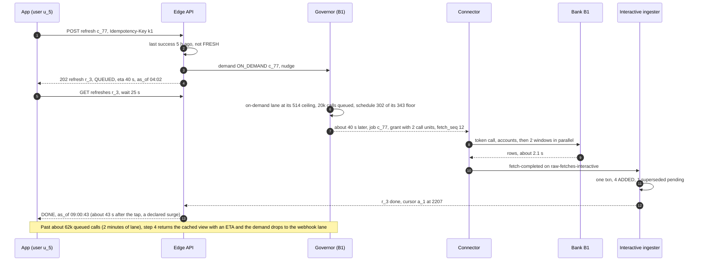

Rehearse the numbers: B1 really allows ~857 calls/s (800 in flight at 0.93 s per call). Taps at Monday peak want ~590 calls/s against a ~514/s lane ceiling: **~180k taps in the 9 AM hour get the cached view** with an honest `as_of`. The schedule runs 302/s against its 343/s floor, untouched; webhooks are idle by morning. All 3 M tapping at once would be 9 M calls, ~4.9 h at the ceiling. The fix that removes the queue is a user-present allowance from B1.

### Flow 3: a worker crashes halfway through a write

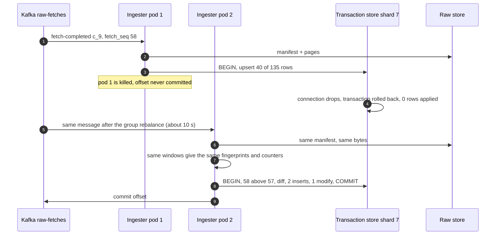

A connector crash mid-pagination is the same story one hop earlier: no manifest is written, the governor reclaims the grant at 45 s (25 s job deadline + 20 s call timeout) and re-dispatches with `fetch_seq 59`, and if a stalled connector later publishes fetch 58 after 59 was applied, the `fetch_seq` check skips it. The stalled connector's calls are **extra** calls against B1's limit, but they never overlap the new ones: by 45 s it is past its own 25 s deadline and may not start another call. A manifest written but never published is republished by the sweeper (§4.3).

### Flow 4: the $45.00 dinner posts as $54.00, and the case with two $45.00 pendings

Shown in §4.4 (sequence) and §5.4 (rules). Rehearsal: provider link first; otherwise restaurant band 1.00 to 1.30, ratio 1.20, merchant similarity 0.92, 2 days apart: match. One transaction for the user, one ADDED for QuickBooks. With two $45.00 pendings, the **older** one is superseded; the younger stays pending until its own posted row comes or it disappears from the bank's list twice, and then REMOVED. Worst case after 14 days: EXPIRED.

### Flow 5: B1 is down for 6 hours

Shown in §5.5 (decision flow) and §10.4 (timeline). Rehearsal: breaker opens ~22 s in (half of the last 200 calls time out); taps get stored data with `as_of` instantly; nothing else calls B1. Probes every 60 s. At recovery, 20 clean probes close the breaker, the multiplier ramps 10% to 100% in ~8 min, ~25% of the ~2.2 M stale connections wait for their slot (under 2 h away), and the other ~1.65 M go most stale first in the catch-up lane. On a Monday only ~100 calls/s are spare at 9 AM, so it finishes ~13:00 (~14:00 if nothing folds). Other institutions never noticed. Nothing was lost: the windows overlap.

### Flow 6: B1 changes every transaction id

Shown in §5.6. Rehearsal: the first fetch after cutover returns ~70 unknown ids per account; the pairing pass matches ~67 of them to rows that went missing in the same window, re-keys them and emits nothing; 3 are genuinely new and are ADDED. Over 50% re-keyed flags the fetch. B1 runs ~280 account fetches/s, so the institution crosses the 1% line within a minute and enters REMAP mode, which pages a human. Without this, ~400 M duplicate posted rows would have reached QuickBooks in 8 hours.

---

## 7. Trade-offs

| Decision | Option A | Option B | Chose | Why |
|---|---|---|---|---|
| Who enforces the bank's limit | Per-worker limits (limit ÷ N) or a shared Redis bucket | One governor owner per institution, grants that die at the holder after 1 s | Owner + expiring grants | Priority and a call cap need one place that sees every waiter. Autoscaling breaks limit ÷ N; 400 pods cannot split 5 calls/s. A Redis failover can re-grant a burst. An epoch cannot fence the bank; a grant's age can |
| Cap unit | Jobs | Calls in flight (tap 2, background 1) | Calls | The contract is in calls; a job cap undercounts by up to 2x when the bank is slow |
| Priority | FIFO | Lanes with guarantees and ceilings (HTB) | Lanes | A tap borrows spare capacity; the schedule never drops below its floor |
| The work queue | Kafka or SQS with one message per job | Connection rows with `next_due_at` and demand columns | Rows | Coalescing for free (one outstanding refresh per connection), a backlog is just old rows, no 45k per-institution queues |
| Scheduling | Fixed times (2 AM) | Hash slots, 3 per day for active, 1 for dormant | Slots | Flat 302 calls/s at B1 instead of a wall. Costs a predictable up-to-8 h staleness |
| Fetch window | Since last fetch (incremental), or 14 days once a day and 3 days otherwise | Overlapping 14 days on every fetch | 14 days, every fetch | Catches backdated posts, late changes and outages for free. Costs ~56 re-reads per row and ~1 core of hashing, nothing at the bank (one page either way) |
| Dedup key | Provider id only | Provider id when stable, else content hash + occurrence counter, plus a content fingerprint always | Both | Ids are best when they exist and stay put. The content fingerprint covers legacy routes and id migrations |
| Ingestion unit and exactly once | Row by row, or Kafka transactions | One fetch, one DB transaction, one shard; at-least-once delivery + fingerprint + `fetch_seq` | One fetch, at-least-once | Atomic and retry-safe. The duplicates come from the bank, not the broker |
| Pending to posted | Modify the pending row in place | Remove pending, add posted with a link (Plaid's model) | Remove + add | Posted rows need their own permanent identity for the books; consumers already know Plaid's shape |
| Matching | Provider link only | Link, then category rules, then expiry | Link + rules | Rare unlinked cases and no-link routes. Errors only affect display |
| Outage recovery | Replay every missed refresh at full rate | Breaker, canary, ramp, coalesced catch-up served most stale first | Ramped catch-up | A recovering bank is fragile; overlapping windows make missed refreshes coalesce |
| Credentials | Hold passwords and scrape | FDX OAuth tokens; partners for the long tail; credentials only where nothing else exists | Tokens first | MFA, liability, and where the industry and the rule are heading |
| What we refused to build | A distributed rate limiter in Redis, real-time streaming from banks, Kafka exactly-once, cross-product sharing of one connection, an ML model inside the fingerprint, multi-region active-active fetching | | | Each adds a failure mode or crosses a consent boundary without serving a requirement |

---

## 8. Staff-level notes

- **Simplest thing that meets the requirement.** One governor owner per institution, connection rows as the queue, one transaction per fetch on one shard, a fingerprint, and a change log. No distributed rate limiter, no per-institution queues, no stream processor, no exactly-once broker. We refused cross-product connection sharing (it would save maybe a third of B1's calls for overlap users [estimate] but merges two consents), and real-time "push" feeds (banks do not offer them at scale).
- **Failure modes and blast radius.**
  - *An institution* (outage, throttling, id change): only its connections, bulkheaded by its call cap and contained by its breakers and REMAP mode. *A governor shard*: its ~470 institutions [estimate: 15k ÷ 32] stop dispatching for ~10 to 15 s while a new leader waits out the lease, then ramp from 10% (a planned handoff keeps `m`); old grants are void after 1 s, so no bank sees a burst. *A connector pod*: its grants are reclaimed after 45 s and re-dispatched with a new `fetch_seq`.
  - *An ingester or a transaction-store shard*: fetching continues (raw pages and Kafka buffer); 1/32 of connections see no new data until the shard fails over (~30 s) or the ingester catches up. Kafka retention (7 days) bounds how long the store can be behind.
  - *The vault or KMS*: no fetch anywhere. This is our own single point of failure: spread over 3 AZs (availability zones), a raised KMS quota, data keys held per fetch, and a page at the first sign of errors.
  - *A bad normalizer or parser release*: the spike guard quarantines fetches before anything is emitted; rollback is a version pin.
- **Migration from an existing system** (QuickBooks' current bank-feed pipeline and third-party aggregators):
  1. *Mirror ids.* Import every existing transaction with its legacy id as `provider_txn_id` and compute fingerprints. QuickBooks references those ids, so they must survive.
  2. *Shadow without doubling bank calls.* Run the new pipeline on the old pipeline's raw responses where they exist, or on a 1% sample of connections inside the old pipeline's budget. Diff posted sets per account until the diff is explained. Never fetch twice from a bank to test.
  3. *Cut over per institution.* The new governor takes the institution's whole limit; the old pipeline stops fetching it. QuickBooks reads that institution's accounts from the new change stream, starting at a cursor whose first state equals the imported state.
  4. *Rollback per institution* is flipping the route back. The old pipeline resumes with its own overlapping window, so nothing is lost. The one-way door is QuickBooks accepting new posted rows with our `txn_id`s: keep the legacy-id mapping for as long as rollback is possible.
- **Operability.** SLOs (service level objectives) over 28 days: 95% of active connections refreshed within 8 h; 100% within 24 h excluding institutions with an open breaker; on-demand p95 under 30 s when the bank is healthy; zero calls over any institution's contracted limit (measured per institution per second at the egress proxy, which also sees token calls); zero duplicate posted rows (nightly content-pair audit). **Pages at 3 AM:** a governor shard without a leader for 60 s; schedule lag over 15 minutes (the 8 h p95 has ~24 minutes of slack); ingest lag over 15 minutes; a data breaker open; any institution's measured rate above 95% of its contract for 5 minutes (our bug, not theirs); breakers open on more than 50 institutions at once (it is us); an institution entering REMAP mode; quarantined fetches above 0.1%; vault or KMS errors above 1%. **Not a page:** one bank's breaker open (a dashboard and a status note for support), unless it is a top-20 institution open for more than 30 minutes.
- **Cost.** Infrastructure is small: 32 Postgres shards (~60 TB hot), one connection-DB cluster, Kafka at ~250 GB/day, ~68 TB of hot raw pages (roughly $1.5k a month at standard object-storage prices [estimate]), a few hundred connector pods. The real costs are per-connection fees to partner aggregators and engineering: per-institution integration, monitoring and relationships. Moving the top 20 institutions to direct FDX is the biggest cost lever. Team shape [estimate]: a platform team of 6 to 8 (governor, scheduler, ingestion), a connectors team per protocol family, an institution-relations function that owns contracts and limits, and consumer teams (QuickBooks feed, Credit Karma) that own what they do with the stream.
- **Explicit trade-off.** We accept up to 8 h of staleness on scheduled data and visible queueing for taps in a surge, in exchange for never being the reason a bank throttles or cuts us off. And we accept heuristic errors in pending matching, because pending rows never reach the books.

---

## 9. What is expected at each level

**Mid (80/20 breadth/depth).** Draws scheduler, workers, a transactions table and an API. Dedupes on the bank's transaction id with a unique constraint. Knows pending and posted differ and links them with the provider's field. Rate limiting is "a token bucket per bank". May not notice that the limit is fleet-wide, or that a re-fetch re-reads old rows.

**Senior (60/40).** Spreads the schedule, uses a shared limiter per institution, makes ingestion idempotent with an upsert, and handles the no-id case with a content hash. Matches pending to posted with amount and date tolerance. Has retries with backoff and a circuit breaker. Goes deep on one of: limits, dedup, or matching.

**Staff+ (40/60).** Says in the first minute that the bank is the bottleneck and does B1's arithmetic (3 M connections, 9 M calls per pass, ~857 calls/s usable at 800 in flight, ~111% at Monday peak). Designs priority lanes with a floor for the schedule and says who waits. Caps calls in flight because a slow bank is worse than a down one, and knows an epoch cannot fence someone else's API. Assigns occurrence numbers by pairing with stored rows, so a re-fetch or an edit cannot move them. Treats pending as display-only so matching can be heuristic, while posted dedup never is. Detects id migrations from the spike of re-pairable rows. Plans the catch-up as coalesced, ramped and most stale first, and guards against a `200 OK` with no data. Covers credentials with a vault and per-tenant keys, and places CFPB 1033 with a date. Talks about migrating QuickBooks' existing feed without fetching twice from any bank.

---
## 10. Nitty-gritty (past interview scope)

### 10.1 Internals of each chosen technology

**The rate governor.** 32 shards; each shard is a leader process plus a hot standby. The leader holds a 10 s lease in etcd and an epoch that increases on every change of leader. Per institution it runs a 10 ms tick, checking its lease on a monotonic clock each time: refill each lane's bucket at its guaranteed rate times m, refill the parent with the unassigned float plus what lanes did not use, then dispatch while the parent has tokens and the call cap has room, stamping each grant with `issued_at`, lanes in priority order, each lane taking from its own bucket first and borrowing from the parent up to its ceiling. Scheduled work is prefetched: every few seconds the leader pulls the next ~500 due rows per busy institution with `FOR UPDATE SKIP LOCKED` and writes their leases, so the 10 ms loop never waits on the database. On-demand demand arrives by an RPC (remote procedure call) nudge and is also on the row, so a leader that restarts loses nothing. Small institutions are visited from a per-shard min-heap of "next due time per institution", rebuilt every minute. Shard ownership and failover: [`diagrams.md` D9b](diagrams.md#d9b-governor-shard-ownership); the lanes: §5.1.

**Postgres as the transaction store.** The upsert is `INSERT ... ON CONFLICT (account_id, fingerprint) DO UPDATE SET ... WHERE transaction.content_hash IS DISTINCT FROM excluded.content_hash RETURNING txn_id, xmax = 0 AS inserted`, so one statement tells insert, update and no-op apart, and the no-op writes nothing. The ingest transaction takes `ACCOUNT_STATE` rows `FOR UPDATE` in account-id order, so two ingests of the same connection (a zombie and its replacement) serialize instead of interleaving. The change log and the outbox are the same rows: a relay reads committed `CHANGE` rows through logical decoding (as in [`../cdc-pipeline/`](../cdc-pipeline/)) and publishes them. Pending candidates use a partial index `WHERE status = 'PENDING' AND state = 'ACTIVE'`, which stays tiny.

**Kafka.** `raw-fetches` has 128 partitions keyed by `connection_id`, so one connection's fetches are applied in order by one consumer; `raw-fetches-interactive` is the same with a reserved consumer group. Messages are pointers (~500 B); the bytes live in the raw store. `account-changes` has 256 partitions keyed by `account_id`, preserving per-account order for consumers. Producers use `acks=all` with `min.insync.replicas=2` and idempotence on. Ingesters commit offsets only after the database commit.

**FDX through OAuth.** Authorization code flow with PKCE; access tokens are short-lived, refresh tokens long-lived and often rotated. Transactions are read with `startTime` and `endTime`, which filter on `postedTimestamp`; `postedTimestamp` is required for POSTED and omitted for PENDING. Statuses are `AUTHORIZATION`, `MEMO` ("a pending transaction to be completed at the end of this day"), `PENDING` and `POSTED`; like Plaid, we treat the first three as pending. `transactionId` is unique within an account, pending and posted versions "must have different IDs", and a posting can name its authorization through `referenceTransactionId`. `503` with `Retry-After` means scheduled maintenance. See [`../../concepts/oauth.md`](../../concepts/oauth.md).

**Partner routes (Plaid's sync).** `/transactions/sync` returns `added`, `modified`, `removed`, `next_cursor` and `has_more`, up to `count` 500 per page. It is a **change feed**, not a snapshot: absence means nothing. So the manifest carries a mode, and the ingester never applies "missing means removed" to a DELTA fetch. The partner's cursor is committed to the connection **after** the ingest commits, so a crash re-reads from the old cursor and every item is a no-op on its fingerprint. The two modes side by side: [`diagrams.md` D6b](diagrams.md#d6b-snapshot-vs-delta-ingest).

### 10.2 Configuration knobs that matter

| Component | Knob | Value | Why |
|---|---|---|---|
| Governor | B1 contract rate / calls in flight | 1,000 calls/s / 800 [estimate] | The cap binds first: ~857 calls/s at 0.93 s per call |
| Governor | lane guarantee and ceiling (on-demand, webhook, scheduled, catch-up) | 20/60%, 15/45%, 40/100%, retries 5/50%; schedule ahead of webhooks after 15 min of lag | §5.1. The schedule's floor is the protected number |
| Governor | AIMD | halve on 429 or p99 over 3x baseline; +5% per clean minute | Track the bank's real limit under the contract |
| Governor | grant start-by / reclaim / leader lease | 1 s / 45 s / 10 s | An unstarted grant dies by age; reclaim only after the holder's own deadline |
| Breaker | open / half-open / close | last 200 calls (at most 5 min back) with 20+ and 50% failing, or 5 in a row at tiny institutions, or p99 over 20 s / probe every 60 s at 1 per 10 s / 20 successes | Institution-level errors only |
| Data breaker / removal guard | open / quarantine | 1% of windows empty in 30 min / over `max(5, 20%)` of an account's posted rows | A `200 OK` with no data never removes books |
| Scheduler | slots and tiers | 3/day active, 1/day dormant (no activity in 90 days) | §2 arithmetic |
| Scheduler | retry backoff | 5 min, 15 min, 1 h [estimate], 5% lane floor | Retry well before the next 8 h slot, even when the bank is tight |
| Connector | per-call timeout / job deadline | 20 s / 25 s | The on-demand budget |
| Connector | window | from `min(today − 14, last complete − 1)`; 60 days once a week; guard day by count | Plaid: pending up to 14 days; gaps and backdated posts |
| Ingester | spike guard | `max(20, 5 × p99 daily adds)` scaled by unseen days; own INITIAL budget | Quarantine before emitting |
| Vault | KMS quota / data key lifetime | raised above the 10k/s default / one fetch | A 5-minute cache misses at 8 h spacing |
| Kafka | `acks` / `min.insync.replicas` / retention | all / 2 / 7 days | A shard can be down for days without losing fetched data |

### 10.3 Capacity math per component

| Component | Per unit | Total | Limit and headroom |
|---|---|---|---|
| **B1's API** | 417 calls/s average, ~948 at Monday peak (plus ~139/s token calls if metered together) | contract 1,000; usable ~857 at 800 in flight | **~111% at peak: taps queue. The closest limit in the system** |
| Connectors | ~25 in-flight calls per pod at ~1 s each | 2.1k calls/s average, 9k peak, ~9k in flight at 1 s | ~400 pods at peak [estimate], autoscaled on grants issued |
| Vault | 700 reads/s average, 3k peak; 1 to 2 KMS decrypts per fetch | 3 nodes per AZ | KMS 3k to 6k/s at peak against a 10k/s default quota: raise it |
| Raw store | 0.75 TB/day compressed, ~2k PUTs/s | 68 TB hot | Object storage; no limit in sight |
| Kafka | `raw-fetches` ~700 msg/s, 30 GB/day; `account-changes` ~2.4k msg/s, ~210 GB/day | 128 + 256 partitions | Under 1% of a small cluster |
| Ingesters | ~110k rows/s parsed and hashed (~1 core), ~700 fetch transactions/s (1.4k account windows) | ~20 pods | Bound by DB round trips, not CPU |
| Transaction store | ~75 writes/s per shard average, ~300 peak; ~1.9 TB per shard | 32 shards | Comfortable; storage, not throughput, sets the shard count |
| Connection DB | 15 GB; ~1k lease writes/s | 1 cluster + replicas | Fits in memory |

### 10.4 Failure timeline

**B1 is down for 6 hours.**

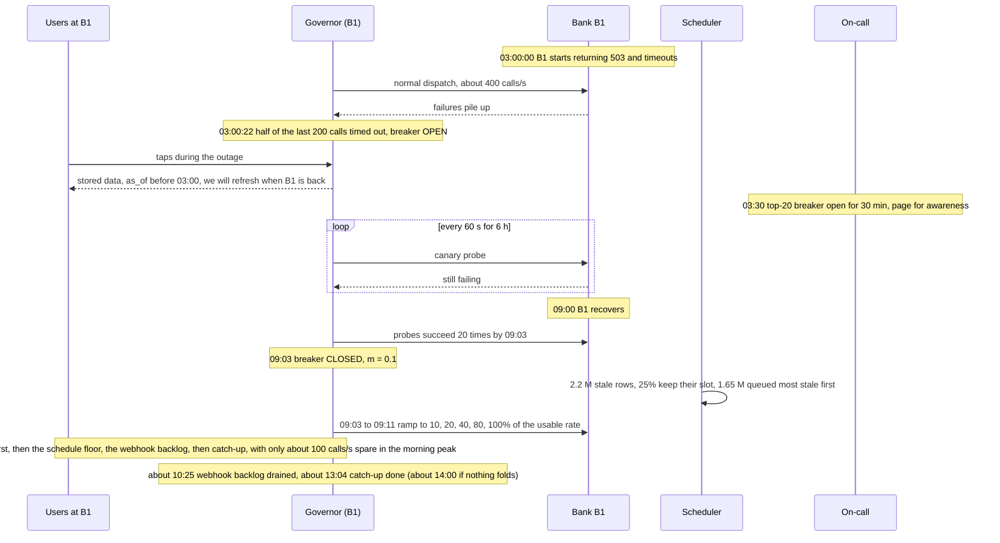

Data at risk: none. The bank holds the truth and the 14-day window covers the gap. What users see: an honest `as_of` and an "institution unavailable" banner, not a spinner.

**The governor leader for shard 0 (B1's shard) dies.** t=0 the leader's process is killed. Its lease expires at t ≤ 10 s. The standby, watching etcd, waits the lease plus a 2 s clock-drift margin, takes epoch 13 at ~12 s, and starts dispatching with an empty bucket at m = 0.1 (unplanned, so it ramps; a planned handoff would pass `m` and the in-flight table), back to full rate ~8 minutes later. Epoch-12 grants that never started are already void, being older than 1 s; those in flight count against the 800-call cap until released or reclaimed at 45 s. Taps in those ~12 s wait in the API's long poll. **No bank sees more than its contract at any instant, and that rests on the 1 s start-by rule, not on the epoch**: a paused old leader that wakes and sends grants sends dead ones ([`deep-dives/refresh-scheduling-and-rate-limits.md`](deep-dives/refresh-scheduling-and-rate-limits.md) §6).

### 10.5 Exactly-once and idempotency end to end

| Hop | Where duplicates come from | Dedup key | Where removed | Lifetime |
|---|---|---|---|---|
| Triggers to the connection | Repeated taps, webhook retries, a slot and a tap together | `connection_id` (one demand and one lease per row); webhook `event_id`; `Idempotency-Key` on taps | Coalesced on the row; event ids kept 7 days | Until the fetch completes |
| Governor to connector | Leader failover, reclaim | `(connection_id, fetch_seq)`, epoch and `issued_at` on the grant | Grants older than 1 s void at the connector; a re-dispatch gets a new `fetch_seq` | 45 s |
| Connector to raw store | Retry after a failed PUT | content hash of the page | Same key, same bytes | 90 days hot |
| Raw store to Kafka | Connector retries the publish; the sweeper republishes an unpublished manifest | `(connection_id, fetch_seq)` | Ingester's `fetch_seq` check | 7 days |
| Kafka to ingester | Redelivery after crash or rebalance | `fetch_seq` vs `last_applied_fetch_seq` | Inside the ingest transaction | Forever (a counter) |
| Bank re-sending the same rows (the overlap) | Every fetch, on purpose | `fingerprint`, unique per account | The upsert; no-op when `content_hash` is equal | Life of the row |
| Bank changing ids | Core migration, route switch | `content_fp` pairing, `PROVIDER_ID_ALIAS` | Pairing pass before insert | Life of the row |
| Change log to consumers | Outbox relay retries, consumer restarts | `(account_id, seq)` | Consumer applies idempotently | 30 days of log |

The two that matter: the `fetch_seq` check makes **delivery** duplicates harmless, and the fingerprint makes **data** duplicates (the overlap) harmless. The second is the one most designs forget.

### 10.6 Consistency model per edge

| Edge | Model | Why |
|---|---|---|
| Bank to us | Eventual, bounded by refresh cadence (p95 8 h active) | We poll a snapshot |
| Governor to bank | At most the contract at every instant, because grants die at the holder after 1 s (an epoch alone cannot fence the bank) | The agreement |
| Ingester to transaction store | Strong: one serializable unit per fetch on one shard | Atomic diff, match and change log |
| Within an account's change log | Total order by `seq` | Consumers replay deterministically |
| Change log to Kafka to consumers | Eventual, ~1 s; per-account order kept | Outbox relay, keyed by account |
| Feed API reads | Read-your-writes for the user after a tap (served from the primary for 60 s), else replicas | The user sees what they just refreshed |
| Primary to cross-region replica | Asynchronous, ~1 s; cursor epoch bumps on failover | Consumers resync from the last common `seq` |

### 10.7 Alternatives rejected

| Alternative | Why it looked attractive | Why rejected |
|---|---|---|
| Redis token bucket shared by all workers | The standard rate-limiter answer, sub-ms | Rate only. No priority, no concurrency cap, polling under contention, burst after failover |
| Kafka or SQS per institution and lane | "Queues for jobs" is familiar | 15k institutions × 4 lanes; no coalescing; a backlog needs draining instead of just existing as old rows |
| Kafka Streams or Flink for ingestion | Keyed state, exactly-once inside the stream | The state we need (the window's stored rows) is in Postgres anyway, and the duplicates come from the bank |
| Dedup with a content hash only | One rule for all banks | Two identical coffees collapse without an occurrence counter, and a provider id is better when it exists |
| ML model inside the fingerprint | Learned similarity handles messy descriptions | A fingerprint must be deterministic and versioned. Models belong in matching pending rows (§12), never in posted dedup |
| Screen scraping as the primary route | Universal coverage | MFA, bank blocking, password custody, and the industry is moving to FDX tokens |
| One partner aggregator for everything | No integrations to build | Per-connection fees, their limits (2,500 sync calls/minute per client by default), their outage is all of ours |

### 10.8 How the big companies do it

- **Plaid** exposes the model this design consumes and mirrors: `/transactions/sync` with a cursor and `added` / `modified` / `removed`; pending-to-posted as "removed" plus "added" with `pending_transaction_id`; checks "between one and four times per day, depending on the institution"; per-Item and per-client refresh limits; and a separate `INSTITUTION_RATE_LIMIT` that "is not applied to user-present traffic (e.g., within Link)". That last point is worth repeating in an interview: banks distinguish a user who is waiting from background traffic, which is exactly our lane split.
- **Yodlee** runs its scheduled refresh as a nightly "cache run" from 10 AM to 5 AM PDT (a 19-hour window), peaking 9 PM to 4 AM, and none from 5 to 10 AM, "the peak usage period". Cadence is tiered by user activity, and refreshes stop for users inactive over 90 days. Its stated goal is "uniformly distributing load to Yodlee content providers, eliminating refresh spikes". Our slots are the same idea at a finer grain, with a guaranteed floor.
- **FDX**, as Plaid publishes it for data providers (Core Exchange v6.0), pins down the contract that makes idempotent ingestion possible: a long-term persistent `transactionId` unique within the account, never "based on a counter that resets", different ids for pending and posted, and `referenceTransactionId` to link them. FDX-aligned APIs carried ~114 M customer connections in spring 2025.
- **QuickBooks** sets the consumer expectation: "Most banks update transactions with QuickBooks every 24 hours, but times can vary." Our 24 h bound is that promise; the 8 h p95 is better than it.

### 10.9 Operational runbook

- **Dashboards (the five):** per institution, calls/s against contract with m and lane split (top 20 on one screen); breaker states and error rates by institution; staleness p50/p95 for active connections, by institution; on-demand latency p50/p95 and queue depth by lane; ingest lag (`raw-fetches` and interactive), quarantined fetches and REMAP events.
- **Alerts:** measured rate above 95% of any contract for 5 minutes, counted per institution at the egress proxy so token calls are included (page, platform); schedule lag over 15 minutes (page); a data breaker open (page, ingestion); a governor shard leaderless for 60 s (page); ingest lag over 15 minutes (page); quarantine rate over 0.1% (page, ingestion); REMAP mode entered (page, plus institution relations); breakers open on over 50 institutions (page, it is us); a top-20 breaker open over 30 minutes (page for awareness, support status note); vault or KMS errors over 1% (page, security and platform).
- **Rollout:** connectors and parsers roll out **per institution**, long tail first, top 20 last, each behind a shadow parse that diffs canonical rows against the current parser on the same raw pages for 24 h. Governor changes roll out shard by shard, never two at once. Normalizer major versions roll out with dual fingerprints (§5.3).
- **Rollback:** pin the previous parser or normalizer version per institution. Rows written by a bad parser are found by `fetch_seq` range and rebuilt from the raw store in the shadow path, then diffed and swapped. A bad emission already consumed by QuickBooks is corrected with MODIFIED and REMOVED entries, never by rewriting the log.

### 10.10 Security and abuse

- **Auth boundaries.** Users authenticate to the edge API with the product's identity (Intuit account, OAuth 2.0). Services use mTLS. Inbound webhooks are verified by signature and deduplicated by event id; a webhook only creates demand, it never carries data we trust.
- **Tenant isolation.** Every connection belongs to one tenant; the edge API checks the caller's tenant on every connection and account id. Secrets and raw pages are encrypted with that tenant's key. No human reads secrets; support sees masks (last 4) only; raw pages need a break-glass role, logged and reviewed.
- **Abusive tapping.** Per connection, a tap within 15 minutes of a success returns `FRESH` with no bank call (Plaid's own per-Item refresh limit is 2 per minute). Per calling user or firm (not per tenant: one accounting firm can own 5,000 client tenants), taps are rate-limited and served round robin inside the lane, so one caller cannot drain B1's on-demand capacity ([`../../concepts/rate-limiting-and-load-shedding.md`](../../concepts/rate-limiting-and-load-shedding.md)).
- **Hostile or broken bank responses.** Parsers enforce size limits, schema validation and amount ranges; a response that fails is stored raw, not ingested, and counts as an error for the breaker. The spike guard catches the rest.
- **Deletion.** A user deleting a connection revokes the token at the bank and destroys secrets. A tenant deletion destroys the tenant key (crypto-shredding), complete when the last backup holding the wrapped key expires (35 days [estimate]). Where financial-records retention applies to a consumer's books, that copy belongs to the consumer (QuickBooks), not to this platform.

### 10.11 Evolution

- **10x connections (150 M).** B1-sized institutions become the whole problem: their limits do not grow 10x. The levers, in order: activity tiers (fewer scheduled refreshes for dormant connections), a negotiated user-present lane, banks' own change notifications where offered, and cross-product sharing of a connection **with** explicit user consent. Our side scales by adding shards: transaction store to ~128, governor shards as needed, all horizontal.
- **Real-time feeds.** If banks push transaction events, they become webhook-lane demand first (hints), and later a DELTA route like a partner's sync. The schedule stays as the floor and the reconciliation check.
- **Per-call fees.** If 1033 reconsideration ends with banks allowed to charge for access, every call has a price: the governor gains a budget per institution per day next to its rate, and tiers become a cost decision.
- **Multi-region.** Reads go active-active from replicas quickly. Fetching stays single-writer per institution (the governor's lease), with etcd as one quorum across 3 regions (or a manual governor failover; a 2-region etcd lets a partition elect two governors) and the standby region's egress IPs allowlisted in advance. The seam is the governor's lease scope.
- **Investments, loans, and new consumers.** New account types are new parsers and canonical tables; the governor, raw store and change log do not change. A new consumer that needs a new filter (say, "business accounts only, posted, over $1,000"). The seam is the change-log filter on the feed API and a consumer-side Kafka filter; ingestion is untouched.

---

## 11. Follow-up questions to expect

Ranked by how likely an interviewer asks them. Answers in [`edge-cases.md`](edge-cases.md) and the deep dives.

1. **A worker crashes after writing half a page. The job retries. Duplicates?** One transaction per fetch plus the fingerprint plus `fetch_seq`, §5.3 and Flow 3, [`deep-dives/idempotent-ingestion.md`](deep-dives/idempotent-ingestion.md).
2. **3 M users at one bank, N calls/s. Who waits? Why not a Redis rate limiter?** Lanes with floors and ceilings, one owner per institution, §5.1, Flow 2, §10.7, [`deep-dives/refresh-scheduling-and-rate-limits.md`](deep-dives/refresh-scheduling-and-rate-limits.md).
3. **$45.00 pending, $54.00 posted, new id. And with two $45.00 pendings?** §5.4, [`deep-dives/pending-to-posted-matching.md`](deep-dives/pending-to-posted-matching.md).
4. **Two identical $5 coffees, no ids.** The occurrence counter over a complete window, §5.3, [`deep-dives/idempotent-ingestion.md`](deep-dives/idempotent-ingestion.md).
5. **The bank is down for 6 hours.** Call and data breakers, ramp, most-stale-first catch-up (~13:00 on a Monday, ~14:00 if nothing folds), §5.5, §10.4, [`deep-dives/institution-outages-and-recovery.md`](deep-dives/institution-outages-and-recovery.md).
6. **The bank changes every transaction id.** Pairing on the content fingerprint, REMAP mode, §5.6, [`deep-dives/institution-outages-and-recovery.md`](deep-dives/institution-outages-and-recovery.md).
7. **Where do credentials live? What about MFA and 1033?** §5.7, [`deep-dives/connectors-and-credentials.md`](deep-dives/connectors-and-credentials.md).
8. **How fresh is the data, really?** 8 h slots, retries, webhooks as hints, §5.2, [`deep-dives/refresh-scheduling-and-rate-limits.md`](deep-dives/refresh-scheduling-and-rate-limits.md).
9. **How do you move QuickBooks onto this without breaking books?** §8 migration, [`diagrams.md` D12](diagrams.md#d12-rollout--migration), operations entries in [`edge-cases.md`](edge-cases.md).
10. **What does QuickBooks see when a posted transaction is removed?** A REMOVED entry; QuickBooks turns it into a review item, §5.3, [`../quickbooks-ledger/`](../quickbooks-ledger/).

---

## 12. Presenting this as an Intuit case study

Intuit's Principal loop is a case study you present and then defend across about four rounds, with AI and security graded in every one ([`../company-questions.md`](../company-questions.md) §1). Scoping is graded: say what you cut on slide 2.

**The 10 slides.**
1. **The problem in one line, and the numbers.** 30 M accounts, 15 M connections, 15k institutions, 60 M refreshes/day. "The bank is the bottleneck."
2. **Scope and what we cut.** In: connect, refresh, idempotent ingest, pending/posted, the stream. Out: categorization, For Review matching, payments, investments. Refused: a Redis rate limiter, Kafka exactly-once, cross-product connection sharing, scraping as a primary route.
3. **The constraint, with arithmetic.** B1: 3 M connections, 9 M calls per pass, ~857 calls/s usable at 800 in flight, ~111% at Monday peak, +1 token call per fetch.
4. **Architecture.** The §6 diagram, red on the bank.
5. **The governor.** Lanes, floors and ceilings, a cap on calls, grants that die after 1 s, AIMD, one owner. Who waits: ~180k Monday taps.
6. **Idempotent ingestion.** Raw store, fingerprint, the occurrence counter, one transaction per fetch.
7. **Pending to posted and the stream.** Rules, expiry, the posted-only stream QuickBooks reads.
8. **AI.** The match scorer below, with its guardrails.
9. **Security.** Tokens not passwords, per-tenant keys, grant-bound vault reads, 1033 status with a date.
10. **Running it.** SLOs, the 3 AM pages, the migration of QuickBooks' current feed, cost levers.

**The AI story: a learned scorer for unlinked pending-to-posted pairs.** Labels are free: every provider-linked pair (Plaid `pending_transaction_id`, FDX `referenceTransactionId`) is a positive example, and the other candidates in that account and window are negatives. A small gradient-boosted model scores (pending, posted) pairs on amount ratio by category, day gap, merchant-token similarity and the institution's habits; it replaces the hand-tuned bands in §5.4 only where no provider link exists. **Guardrails:** hard rules still gate every candidate (same account, inside the category's window, inside a wide amount bound); a match needs a score above a threshold tuned for precision (target 99.5% on held-out linked pairs [estimate]); below it, nothing matches and the pending row simply expires, which is safe. The model version is stored on every match; it ships in shadow first, diffing against the rules. **Fallback:** it runs in process; if it fails to load, the rules from §5.4 run. **Why here and not elsewhere:** pending rows never reach the books, so a model error costs a day of display, never a wrong ledger. No model ever touches a fingerprint or posted dedup. (Categorization ML is the obvious second AI story, but it is a consumer of our stream and below the line.)

**The security story.** Authn: users through the product's OAuth identity; services through mTLS; banks through OAuth tokens with PKCE and mTLS client certificates. Authz: every connection and account checked against the caller's tenant; least scopes at the bank. PII (personally identifiable information): masks only in logs and support tools; full responses encrypted with the tenant's key. Encryption: envelope encryption, KMS keys in an HSM, crypto-shredding on deletion. Audit: every secret read logged with its grant and job, and a read without a grant pages security.

**What each round will re-open (3 questions each).**

| Round | Questions |
|---|---|
| Architecture presentation | Why one owner per institution instead of a distributed limiter? What happens when the governor shard dies? Why rows as a queue and not Kafka? |
| Data correctness deep dive | Prove a re-fetch gives the same occurrence counters. How do you know a posted row was really removed? What does QuickBooks see during an id migration? |
| AI | Where would an LLM (large language model) help, and why not in the fingerprint? How do you get labels for the match scorer? What is the fallback when the model is wrong or missing? |
| Security and operations (or hiring manager) | Where do legacy credentials live and who can read them? What pages at 3 AM and what does not? How do you move QuickBooks onto this with a rollback at every step? |
