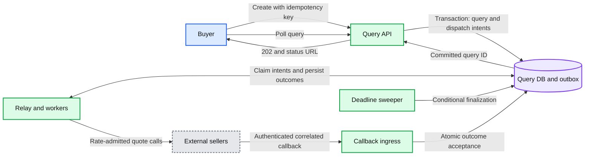
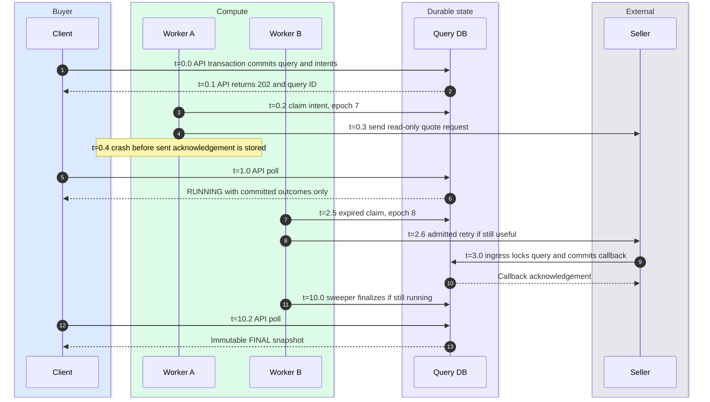

# Broker crash recovery and seller callbacks

> One-line answer: restart short-lived read-only searches after a broker crash; add durable query state, transactional dispatch intents, and authenticated callbacks only when the same query must remain retrievable.

Reference basis: async request-reply [S11], aggregator correlation [S2], and transactional row-lock behavior [S12] in [sources](../research/sources.md).

## Baseline crash contract

The broker keeps live query state in memory. If it dies at 0.7 seconds, the buyer gets a reset, gateway error, or outer timeout. Some sellers may continue processing the already-sent requests. A jittered retry starts a new query with new observation times, subject to caller and seller retry budgets.

If the broker had computed an answer but died before delivery, the buyer cannot tell that apart from an earlier failure. The baseline does not promise to replay that answer. A load balancer, sticky session, or distributed lock does not make memory durable.

This is often the simplest answer for an interactive quote search. The optional protocol below changes both durability and operational cost.

## Durable protocol

### Create and dispatch

1. Validate the BookContext, caller, requested duration, and seller set.
2. In one database transaction, insert a query plus its selected seller slots and dispatch intents. A unique `(tenantId, idempotencyKey)` maps to this query; store the context hash. Same key with different context returns 409.
3. Return 202 only after commit, with Location, Retry-After, deadline, and retention policy. A lost 202 can be recovered by replaying the idempotency key. [S11]
4. A relay polls the outbox and claims bounded work. A database-backed outbox is enough initially; a message queue can be added later for distribution. Delivery is at least once.
5. Before every send, check query state, deadline, attempt allowance, and seller quota. Mark dispatch intent progress, but recognize there is no atomic transaction spanning our database and an external seller's HTTP server.

Crash after send but before marking sent can cause redispatch. Sellers with an idempotent quote operation can deduplicate a stable operation key. Without that contract, duplicate remote work is possible; count it against traffic budgets and deduplicate accepted results locally. Read-only quote requests make this tolerable; checkout would require another protocol.

### Callback and outcome acceptance

Use a stable callback endpoint behind the load balancer, never a specific broker IP. The payload carries signed query, seller, logical operation, and attempt IDs, plus a nonce/expiry as appropriate. Authenticate the seller before spending database resources. Bound payload size and reject unknown tenant/query relationships.

For each accepted callback or synchronous worker result:

1. Begin a short transaction and lock the query row.
2. Read authoritative state and time *after acquiring the lock*. In PostgreSQL, transaction-start `now()` alone can be stale after lock waiting; use an appropriate current clock check and a bounded lock timeout.
3. Require query RUNNING, current database time before its cutoff, a known seller slot, valid attempt/callback authentication, and no settled outcome for that seller.
4. Insert/settle the seller outcome, advance the aggregate version, and, if every slot is terminal, finalize in this same transaction.
5. Commit, then acknowledge callback receipt. Crash before commit yields a safe retry; crash after commit before acknowledgement yields a deduplicated callback.

All quote writes and all finalizers must lock the same query row. Otherwise a quote insert can race a finalizer that read an earlier set. A uniqueness constraint alone prevents duplicate rows but does not enforce “no accepted quote after finalization.”

Acknowledging a duplicate callback can be idempotent. Authenticated late callbacks can be acknowledged and ignored to stop retries; invalid signatures are rejected. Expired/unknown query IDs do not recreate requests.

### Deadline and finalization

Store a database-authoritative wall-clock cutoff for durable eligibility. A deadline sweeper locks eligible query rows and marks pending slots timed out, revalidates candidates, writes final snapshot and version, and commits. Fast local timers can trigger the same transaction; the sweeper is the recovery path. Gate every new outcome on the cutoff so a delayed sweeper cannot admit late quotes.

Durable mode defines receipt at transactional acceptance, not HTTP arrival. A callback that arrives before the cutoff but cannot obtain the query lock in time can be excluded. A transaction accepted before cutoff can commit just after it; the finalizer waits for that transaction and includes it. Bound transaction duration and state this eligibility contract explicitly.

Database clock jumps need monitoring and a bounded-skew policy. A new process cannot recover another process's monotonic clock deadline. Conservative expiry is safer than extending the query unknowingly during failover.

### Ownership, cancellation, and polling

Worker leases use monotonically increasing epochs for our own dispatch/outbox updates. Stale workers cannot update query state with old ownership. The stable seller callback may still be valid after a worker takeover if it matches an issued attempt and the query is still running; do not discard it just because its originating worker died.

Epochs protect our database, not a seller that does not check them. Egress quota control and deadline checks still govern possible duplicate sends. A worker that loses its lease can already have an in-flight external request.

DELETE locks the query row and transitions RUNNING to CANCELLED. If completion already won, return its existing terminal state. Cancellation produces outbox/control signals to stop work but does not claim remote rollback. Polling checks caller ownership and returns stored versions with read-your-writes; after retention expires, return a documented expired/unknown response without recreating work.

## Failure timeline

Illustrative timings for a separate **10-second durable query**, not a promise that a failed query still meets the baseline 2-second SLO:

API and callback-ingress participants are folded into DB-facing arrows to keep the diagram small; clients and sellers never access the database directly.

The on-call sees lease-expiry count, replay count, outbox age, callback latency, and finalization lag. Data at risk is work not yet committed; committed records survive only the configured database failure model. Synchronous multi-AZ replication can cover an AZ loss; asynchronous cross-region replication has a nonzero RPO.

## Capacity and retention consequences

At 10 M queries/day and 100 slots/query there are 1 B outcome slots/day. Even compact 300-byte records imply approximately 300 GB/day before indexes, WAL, outbox, and replication. At peak, up to 120k outcome writes/s contend across query rows, although each query has its own lock. Benchmark and partition by query ID; do not assume one ordinary database instance handles this.

Persist only resumable traffic initially. Coalesce safe duplicate work, bound retention, and delete query/outcome/outbox/idempotency records consistently. A 24-hour dedup window is a contract: a retry after expiry cannot be promised replay. If seller callbacks can retry longer, retain a minimal expiry tombstone or reject them through signed expiry without rebuilding deleted state.

## Trade-offs

| Choice | Benefit | Cost |
|---|---|---|
| Restart baseline | Simple and cheap | Different result after retry; no durable query ID |
| Durable query and outbox | Recoverable acceptance and progress | Write amplification, retention, and recovery latency |
| Query-row serialization | Clear no-late-write and no-double-finalization invariant | Hot per-query lock at huge N; short transactions required |
| At-least-once dispatch | No silently lost committed work intent | Possible duplicate remote calls without seller idempotency |
