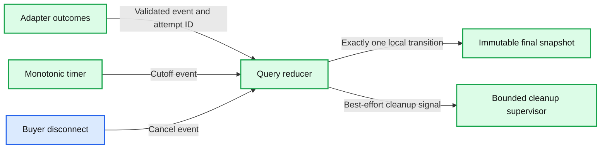
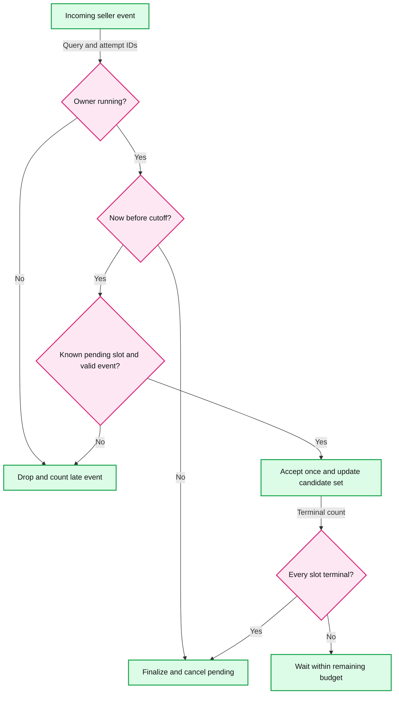

# Deadlines and aggregation

> One-line answer: serialize every outcome and close event through one query owner, accept each seller once before the monotonic cutoff, and freeze the final result before cancelling remaining work.



This is a mechanism specification, not runnable implementation code. [S2, S3, S4, and S10](../research/sources.md) explain the pattern and runtime behavior behind it.

## Query state and invariants

The owner stores `queryId`, pinned BookContext and registry version, monotonic cutoff, state, seller slots, current attempts, candidate offers, and coverage counters. Use an event loop or a short lock around these local mutations. Never await network I/O while holding that lock.

1. Query state moves from `RUNNING` to `FINAL` or `CANCELLED` once. `completionReason` records `ALL_TERMINAL`, `DEADLINE`, or `CLIENT_CANCEL` separately.
2. Every selected seller has exactly one slot. A retry creates an attempt, not another seller slot.
3. A slot settles at most once. A transport failure with an admissible retry keeps the slot pending until the retry ends or the query closes.
4. Each outcome is bound to the selected seller, BookContext, query, and known attempt. Unknown IDs are not used to create state.
5. A final snapshot never changes. Late events can affect telemetry, not the answer already delivered.
6. Price selection is the minimum among offers still valid under the final comparison rules. A majority does not establish correctness over missing offers.

## The cutoff and finalization race

Let `D` be the owner's local monotonic aggregation cutoff. Each event handler first reads monotonic time. It accepts a quote only if `state == RUNNING`, `now < D`, the slot is pending, and the quote passes validation. At `now >= D`, it invokes close instead. Equality belongs to the timeout side.



- **Quote handled at D minus 1 ms:** accepted if validation and acceptance complete before D. Close includes it.
- **Bytes arrived at D minus 1 ms, event handled at D plus 1 ms:** excluded. “Received” is defined at reducer acceptance, not at the network card.
- **Timer wakes late:** a quote handler still checks time and closes; the late timer does not widen eligibility.
- **Two close events:** the first serialized transition wins; the other sees terminal state and does nothing.
- **Buyer cancellation races completion:** whichever transition the owner serializes first wins. If the network has gone away, a computed answer may never reach the buyer.

Use a fresh time check after potentially expensive validation, immediately before accepting. Better still, cap parsing cost and isolate expensive normalization. Choose a single comparison-rule version for the query.

The cutoff controls quote acceptance. It does not guarantee that an overloaded runtime can serialize and send the answer by exactly D. Reserve response budget and monitor timer/event-loop lag.

## Terminal outcomes and the final minimum

At close, classify unsettled slots as timed out or cancelled according to the close reason. Preserve explicit admission skips and previous errors. Revalidate candidate expiry, stock claims, and normalized price fields; candidates that are no longer valid become `INVALID_EXPIRED` for final coverage. Do not return `NO_OFFERS` merely because no valid quote remains.

Keep up to 100 candidates rather than just one running minimum. If A at INR 400 expires before close and B at INR 450 remains valid, B must win. A small final O(N) scan is adequate. Seller timestamps need a bounded clock-skew allowance or a seller-agreed relative validity contract. Unknown expiry means the offer cannot be reused as a fresh cache entry without a defined policy.

If all quotes say no stock, return `NO_OFFERS`. If some sellers never answered and there are no quotes, return `UNAVAILABLE`. A complete set of offers is still not an atomic marketplace snapshot: sellers observed their inventories at different moments.

## Budget propagation

The edge captures the incoming request's maximum remaining duration. Each hop subtracts elapsed local time and passes a remaining duration onward. On one machine use a monotonic clock. Do not serialize one process's monotonic timestamp or compare it on another machine. gRPC can propagate deadlines with elapsed time deducted, subject to language configuration. [S3]

For a seller attempt:

```text
attempt budget = min(seller configured timeout, request cutoff - local now)
retry allowed  = transient read-safe failure
                 AND attempts remain
                 AND backoff + minimum useful call time < remaining budget
                 AND retry budget, rate token, and in-flight permit are available
```

Queue wait, quota RPC, DNS, connection establishment, TLS, body reads, validation, and backoff all consume time. A timeout limited to the socket read is insufficient.

## Retries and duplicate outcomes

Maintain a logical key `(queryId, sellerId)` and distinct attempt IDs. First accepted valid terminal outcome settles the seller. A failed attempt is not immediately a terminal seller failure if the retry policy elects another attempt. Once the seller settles, subsequent attempts cannot revise its quote or decrement/increment counters again.

Do not overlap application retries by default. With HTTP, a local timeout can still leave remote work running. Callback sellers may emit results for multiple attempts; authenticate them, then apply the same slot rule. If their protocol permits quote revisions, that is a different contract requiring ordered versions and a rule for the final revision, not an accidental side effect of retry handling.

A quote's `quoteId` identifies an offer; an `attemptId` identifies one outbound invocation; an idempotency key identifies a logical operation only if the seller promises to honor it. These IDs are not interchangeable.

## Cancellation and shared work

The owner first freezes the final result, then asks children to stop. A cleanup supervisor tracks actual transport completion with its own bounded work set. Do not let a hung cancellation consume a buyer-facing response deadline or silently release a still-active local socket permit.

For shared in-flight lookups, cancellation removes one waiter. Cancel the underlying seller request only when no interested waiter remains or the shared lookup's fixed maximum lifetime expires. A new waiter inherits the existing attempt and its remaining lifetime; it cannot extend it indefinitely. Each query still decides whether the shared result arrived before its own cutoff and is fresh enough.

Late events for unknown query IDs are dropped and do not resurrect state. Keep metrics bounded; do not make query IDs metric labels.

## Trade-offs

| Choice | Benefit | Cost |
|---|---|---|
| Reducer acceptance defines receipt | Implementable, deterministic local boundary | A network-arrived quote can miss the cutoff under local scheduling delay |
| Keep all bounded candidates | Correct fallback when cheapest expires | O(N) memory and final scan |
| Immutable final answer | Stable client semantics | Later cheaper quotes require a new query |
| Separate cleanup lifetime | Buyer latency stays bounded under cooperative scheduling | Must supervise leaks and account for remote work uncertainty |
