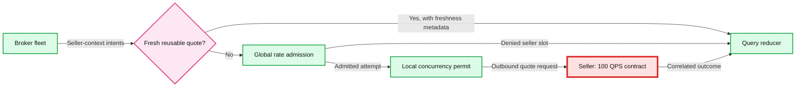

# Seller limits and scale

> One-line answer: rate-limit each seller across the whole broker fleet, isolate local in-flight work, and reduce fan-out before adding workers when provider capacity is the bottleneck.



The red seller quota is the bottleneck in [solution §5.2](../solution.md#52-nfr2-how-do-we-isolate-one-seller-and-honor-its-global-qps). References: [S6, S7, S8](../research/sources.md).

## Three controls, three jobs

| Control | Measures | What it protects | Does not guarantee |
|---|---|---|---|
| Rate limiter | Attempt starts over time | Seller request allowance and cost | Bounded concurrent work when duration rises |
| Concurrency bulkhead | Local active attempts, sockets, buffers | Broker resources and isolation | Fleet-wide QPS or remote work termination |
| Health breaker | Errors/timeouts with sampling and cooldown | Avoiding futile calls to failing sellers | Exact rate or availability |

Use a bounded process-wide cap as well as seller-specific caps. With 100k sellers, 100k independent pools each allowing 10 requests could still consume one million attempts. Allocate pools lazily and evict idle connection resources, while preserving safe quota state separately.

## Global rate admission

For a token bucket with rate `r` and capacity `b`, the allowed admissions over an interval of length T are bounded by approximately `b + r*T`. This is not the same as “at most 100 calls in every rolling second.” Match the seller's actual fixed-window, rolling-window, token-bucket, per-credential, or per-IP contract.

One atomic quota decision per attempt:

1. Identify the real contract scope, such as `(sellerAccount, endpointClass)`, shared across tenants and regions if the seller counts them together.
2. Read/refill/debit atomically at the authority. Store a monotonic progression of authority time; wall-clock jumps need clamping and monitoring.
3. Dispatch immediately within a small admission lifetime. Avoid acquiring a rate token and then waiting in an unbounded concurrency queue. A nonblocking local permit can be reserved briefly while checking quota, then released on denial.
4. Consume rate budget on all actual sends, including retries, health probes, and work whose response is lost. An uncertain admission or send is conservatively considered spent.
5. Reject or skip when capacity is unavailable. Do not hold interactive work behind a seconds-long backlog.

In the diagram, admission and permit checking are logical gates. Implementation ordering must avoid token hoarding: either reserve local capacity before the quota check, or perform a no-wait local check after admission and accept the conservative loss of an unused rate token. Never delay an admitted send long enough to bunch old admissions into a new seller window.

### Practical Redis option and hard-contract option

An atomic Redis script is a useful implementation for ordinary rate control. It gives an atomic decision on its current primary. Asynchronous replica failover can forget debits, and split-brain writers can admit twice. `WAIT` or a lock lease alone is not a complete strict-quota proof. Redis documents these atomicity and replication boundaries explicitly. [S13, S14](../research/sources.md)

For a contractual hard ceiling, use a seller-scoped serialized egress authority with durable/consensus-backed admission state, fenced dispatch, and a clock policy matching the seller's limit. Fence old egress at the actual network or credential boundary, not merely with an epoch the third-party seller ignores. Persist admission before send; crash uncertainty may waste capacity but must not recreate it.

If that authority or fencing state is uncertain, fail closed. For a fixed/rolling-window contract, recovery can conservatively wait out the entire affected seller window after old egress is fenced and all permitted delayed dispatch is impossible. For token buckets, resume with zero tokens and a fresh refill origin after fencing, or recover authoritative state. Do not claim that an arbitrary Redis failover pause is a universal proof for every quota algorithm.

Permit leases can reduce authority RPCs at high volume, but unused permits reduce utilization and expired/duplicated leases complicate correctness. The basic design does not need them at the assumed rate without a measured authority bottleneck.

## Slow-seller isolation

Little's law: local concurrency is approximately arrival rate times mean occupancy. A 100/s seller with 300 ms duration needs roughly 30 active calls fleet-wide to sustain that rate. At 1.5 seconds it needs 150. Holding a fixed concurrency cap limits load as latency rises.

Use seller-local semaphores, small pending queues, transport timeouts, and process caps. Do not block a shared event loop on DNS, a synchronous SDK, decompression, or JSON validation. A bounded worker pool dedicated to a problematic adapter contains the blast radius.

If the seller ignores cancellation, bound our socket/task lifetime and avoid issuing more attempts than the allowed rate. A remote concurrency contract requires seller-enforced cancellation or a server-defined maximum work lifetime. Closing a client socket is not proof that a server-side job ended.

For HTTP 429, respect Retry-After only when enough query budget remains. Usually mark that seller unavailable for the current comparison and reduce future admission. Circuit-open sellers remain in the selected count as skipped; removing them would artificially improve coverage.

## Hot books, cache, and request coalescing

Cache key: `(sellerId, ISBN, edition/condition, quantity, destinationZone, currency, shippingTier, tenantPriceTier, authScope, adapterVersion, comparisonRuleVersion)`.

- Cache only reusable offers allowed by seller policy. A customer-specific coupon cannot become a public quote.
- TTL is the lesser of the freshness budget and quote expiry minus a safety margin. Preserve observed time and source quote ID.
- Coalesce identical seller/context lookups. Per-process coalescing is simplest; consistent routing by lookup key or a shared lookup owner can improve fleet-wide reuse when measurements justify it.
- Bound waiter count. One popular book can otherwise use unbounded memory even if only one seller call is sent.
- Negative cache only authoritative no-stock, for a short explicit TTL. Do not cache timeouts as absence of inventory.
- Use jittered expiration and cap refresh work so a cold cache does not turn into a provider traffic surge.

At 1,200 requests/s, a 100/s common seller needs at least `1 - 100/1200 = 91.7%` call reduction or denial, even before retry headroom. A theoretical 95% hit/reuse ratio would reduce demand to 60/s. This is an illustrative feasibility condition, not an assumed measured cache hit rate. Highly personalized shipping and pricing can destroy reuse.

## The 100000-seller follow-up

```text
Unfiltered peak calls = 1,200 * 100,000 = 120,000,000 per second
Wire traffic          = 120 M * 2 KB = 240 GB/s
Mean in-flight        = 120 M * 0.3 s = 36 M attempts
Metadata alone        = 36 M * 8 KiB = approximately 275 GiB
```

Index eligibility by ISBN and market. If exactly 100 sellers are eligible and the index is complete, querying those 100 preserves “all eligible.” If 10,000 are eligible and we validate only the best 100 feed-derived candidates, that is a declared shortlist with incomplete marketplace coverage.

A candidate index may use a search engine or a partitioned key-value index once actual access patterns require it. Do not introduce one just because the seller registry has 100k rows. The large object is usually the seller-to-book offer catalog, whose cardinality must be estimated separately.

If all N must be queried, a tree of fan-out workers can reduce local memory and merge minima with associative reduction. It does not reduce total seller calls. Return per-partition coverage and propagate the same cutoff. Partition boundaries cannot turn missing sellers into a global minimum proof.

For a feed-based alternative, define catalog freshness, missing-feed handling, update sequence numbers, tombstones for removed offers, reconciliation scans, and the live validation policy. It offers a different price-freshness contract from the original live comparison.

## Trade-offs

| Choice | Benefit | Cost |
|---|---|---|
| Shared quota authority | Enforces fleet-level admission policy | Hot keys, availability dependency, and failover correctness |
| Fail closed on uncertain hard quota | Protects provider contract | Reduced seller coverage |
| Quote reuse and coalescing | Fewer calls and lower latency | Context-sensitive keys and freshness policy |
| Shortlist live validation | Affordable broad marketplace search | Cannot guarantee the minimum over all eligible sellers |
