# Book seller broker: diagram set

> One-line answer: trace seller selection, bounded fan-out, serialized aggregation, and the failure boundaries around a final answer.

Diagrams embedded elsewhere are linked rather than duplicated. Red identifies the seller-capacity bottleneck.

| ID | View | Location |
|---|---|---|
| D1 | Context | Below |
| D2 | Data flow | Below |
| D3 | Component architecture | [Solution §6](solution.md#6-final-design) |
| D4a | FR1 concurrent lookup | [Solution §4.1](solution.md#41-fr1-query-eligible-sellers-concurrently) |
| D4b | FR2 minimum and coverage | [Solution §4.2](solution.md#42-fr2-return-the-cheapest-valid-offer-with-coverage) |
| D4c | FR3 cancellation | [Solution §4.3](solution.md#43-fr3-bound-lifecycle-cancellation-and-retries) |
| D5a | Timeout and late response | Below |
| D5b | Broker crash | Below |
| D5c | Durable recovery | [Recovery timeline](deep-dives/crash-recovery.md#failure-timeline) |
| D6 | Reducer decisions | [Cutoff race](deep-dives/deadlines-and-aggregation.md#the-cutoff-and-finalization-race) |
| D7 | Entity relationship | Below |
| D8 | Query lifecycle | Below |
| D9 | Deployment | Below |
| D10 | Partitioning | Below |
| D11 | Failure map | Below |
| D12 | Rollout | Below |

## D1: Context

Buyer requests and seller quotes cross separate trust boundaries.

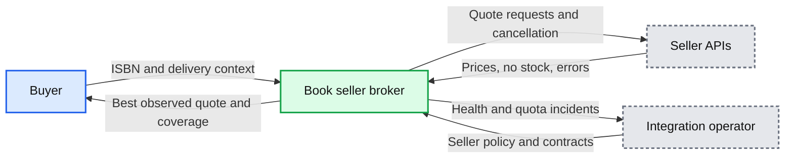

## D2: Data flow

The expensive edge is outbound fan-out, estimated before cache hits and rate denial.

```mermaid
%% Inputs become seller intents, normalized offers, and one comparison result
flowchart LR
    C[Buyer] -->|BookContext JSON 0.5 KB, 1200 per second peak| B(Select sellers)
    P[(Registry snapshot)] -->|Seller refs 2 KB each, local reads per query| B
    B -->|100 intents per query, 120k per second offered| A(Admit and dispatch)
    A -->|Quote JSON 0.5 KB, up to 120k per second primary| S[Seller APIs]
    S -->|Outcome JSON 1.5 KB assumed, admitted rate| R(Validate and reduce)
    A -->|Skipped outcome about 0.1 KB, overload dependent| R
    R -->|Final JSON about 1 KB, up to 1200 per second| C
    R -.->|Summary about 1 KB, bounded sample rate| O[(Operational summaries)]
    class C client
    class B,A,R service
    class P,O store
    class S external
    classDef client fill:#dbeafe,stroke:#2563eb,stroke-width:2px,color:#111
    classDef service fill:#dcfce7,stroke:#16a34a,stroke-width:2px,color:#111
    classDef store fill:#ede9fe,stroke:#7c3aed,stroke-width:2px,color:#111
    classDef external fill:#e5e7eb,stroke:#6b7280,stroke-width:2px,color:#111,stroke-dasharray:4 3
```

## D5a: Seller timeout and late response

At 1.8 seconds the response freezes; a cheaper late quote cannot revise it.

```mermaid
%% One seller failure reduces coverage without blocking healthy outcomes
sequenceDiagram
    autonumber
    box rgb(219,234,254) Buyer
    participant C as Client
    end
    box rgb(220,252,231) Broker
    participant B as Query owner
    participant A as Adapter
    end
    box rgb(229,231,235) External
    participant S as Slow seller
    end
    C->>B: t=0.0 compare request
    B->>A: t=0.1 attempt with remaining deadline
    A->>S: t=0.1 outbound request
    Note over B: t=0.4 other sellers have valid quotes
    A->>A: t=1.6 seller timeout, no useful retry remains
    A-->>B: Terminal seller timeout
    B->>B: t=1.8 cutoff for other pending slots, freeze result
    B-->>C: t=1.8 to 2.0 PARTIAL and coverage
    B->>A: Cancel pending attempts
    S-->>A: t=1.9 late response if transport still alive
    A->>A: Ignore for settled slot and close transport
    Note over B,A: Metrics: seller timeout and cleanup lag; no per-query page
```

## D5b: Broker crash

Memory is lost; a retry is a new comparison subject to the same quotas.

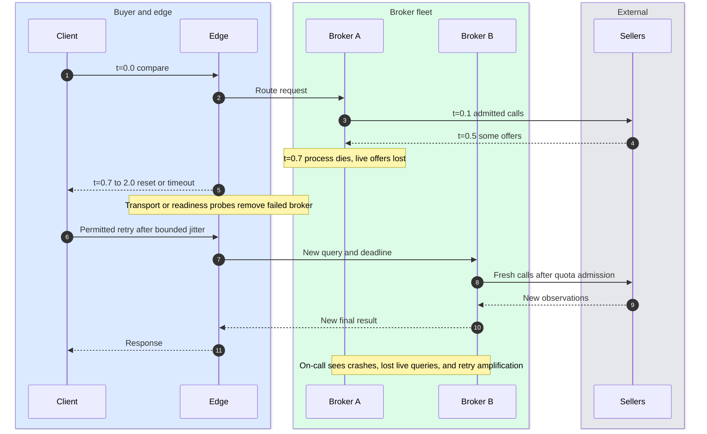

## D7: Entity relationship

Query entities live in memory initially; durable mode persists them by query ID.

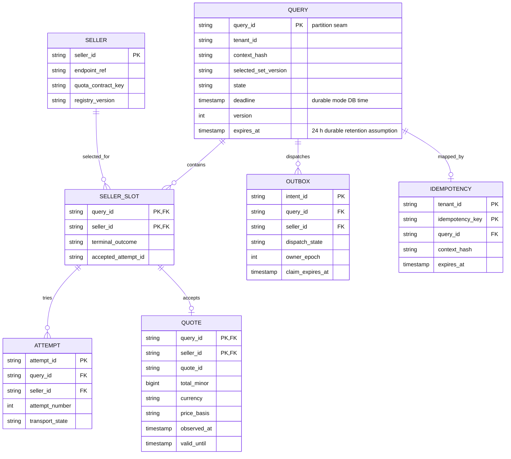

OUTBOX and IDEMPOTENCY apply only to durable mode. Baseline retention ends after response and bounded cleanup. Cached quotes use a full seller/context/version key, independent of a query's primary key.

## D8: State machine

Lifecycle and result quality are separate; FINAL can carry COMPLETE, PARTIAL, NO_OFFERS, or UNAVAILABLE.

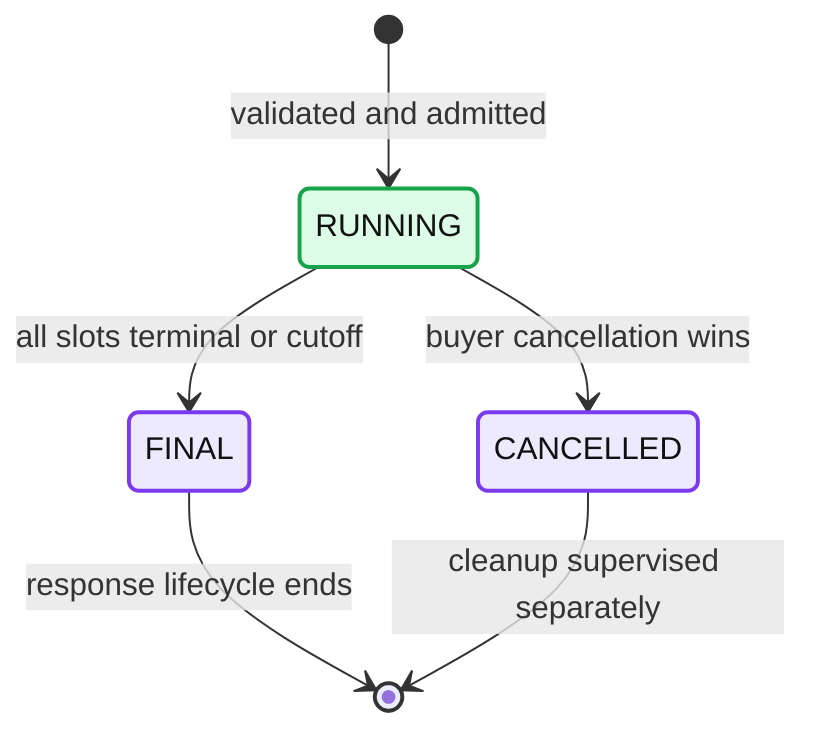

Baseline crashes lose this state. Durable retention expiry deletes records; it cannot reopen a finished query.

## D9: Deployment

Three AZs limit a broker/AZ failure's blast radius; one live query remains on one broker.

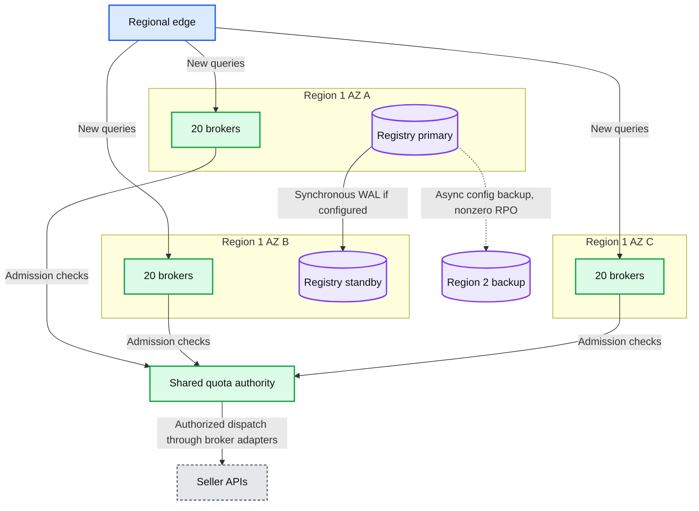

Quota checks and broker sends are folded into one logical dispatch arrow. The authority is partitioned across AZs with the [quota failover policy](deep-dives/seller-limits-and-scale.md#practical-redis-option-and-hard-contract-option). A standby needs a managed/fenced promotion mechanism; replication alone is not safe failover. No live query state crosses regions in the baseline.

## D10: Scaling and partitioning

Query ownership and quota admission use different keys.

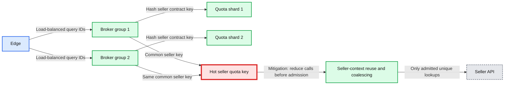

The mitigation edge is not runtime ordering: reuse occurs before quota consumption. Independent full-rate counters per shard violate the contract; allocated shares need a common total bound.

## D11: Failure mode map

Each failure maps to its user-visible effect and mitigation.

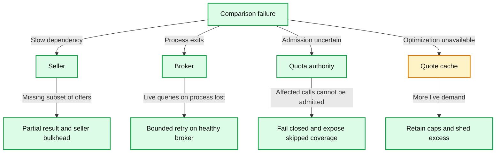

## D12: Rollout

Illustrative phases include rollback gates; dates do not schedule a real deployment.

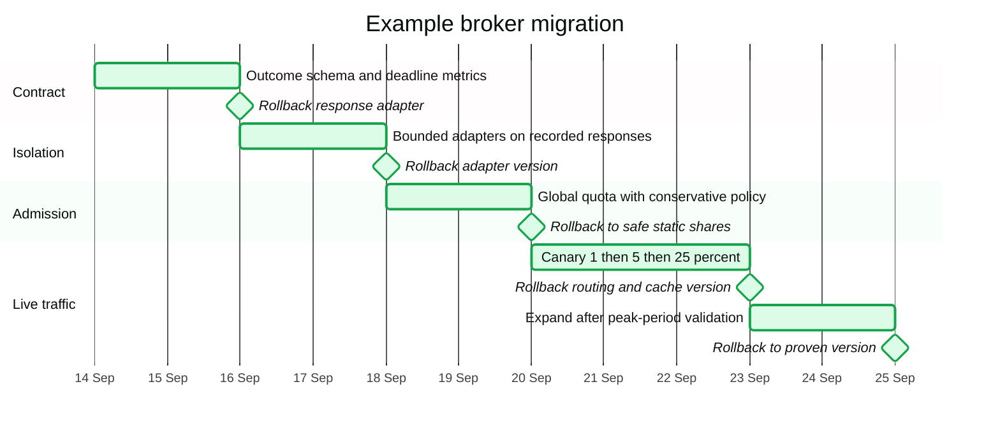

## Technology internals

### Async HTTP runtime

Socket readiness uses small event-loop slices; blocking SDKs need isolated workers.

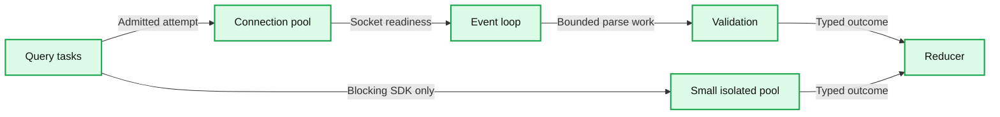

### Redis admission

Primary atomicity and failover safety are distinct guarantees.

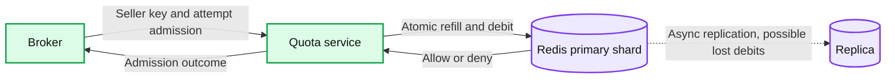

### PostgreSQL state

Durable outcomes and finalizers lock the same query row and commit together.

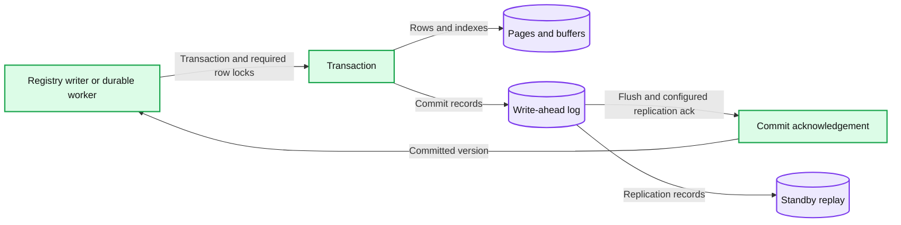
