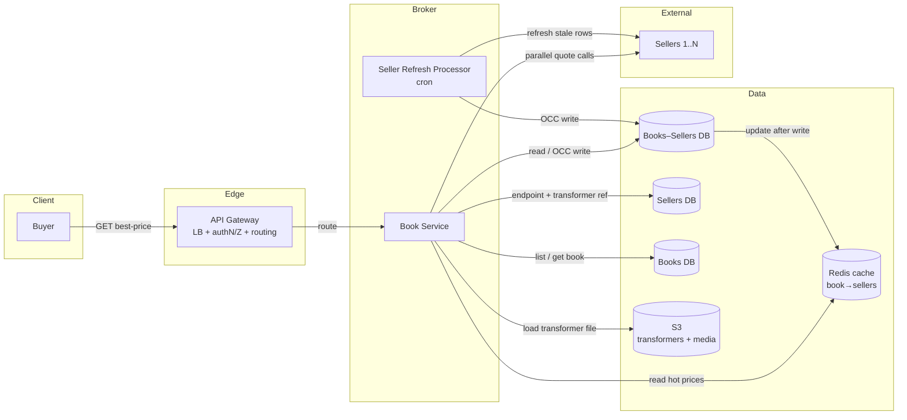
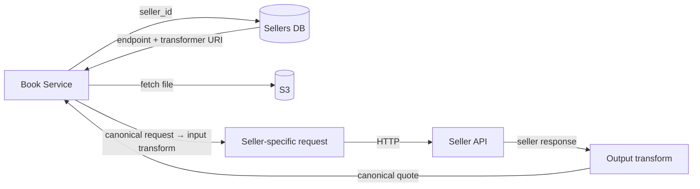
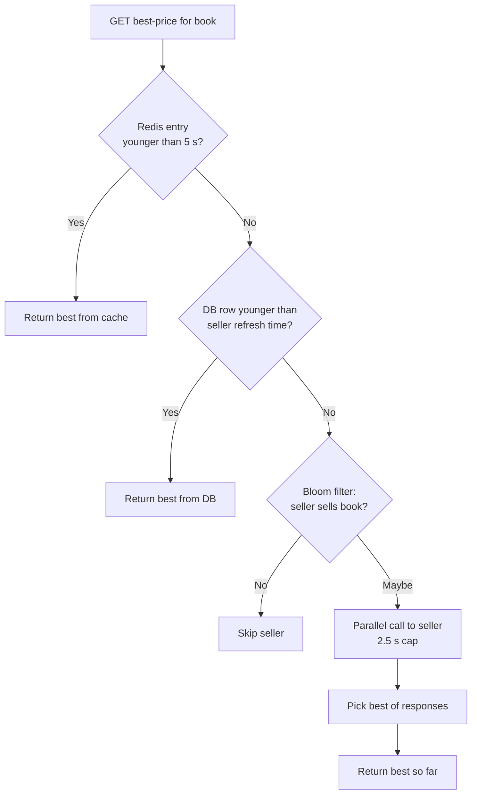
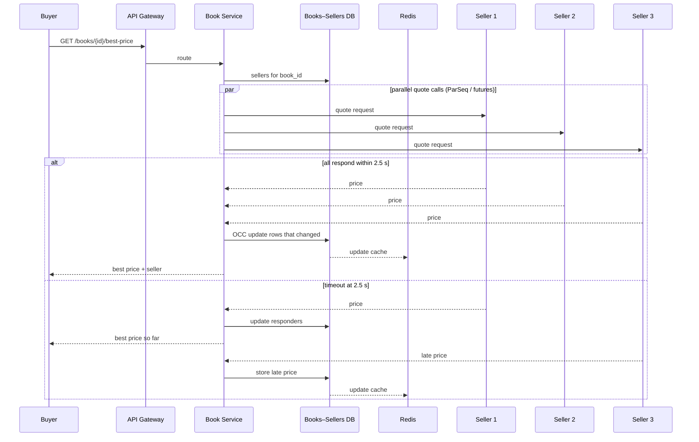
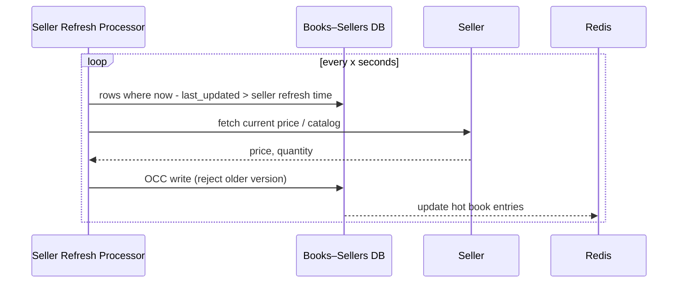
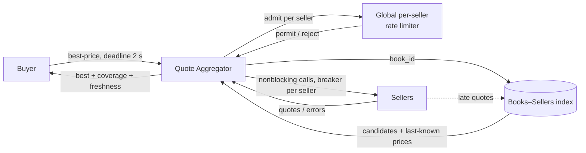

# Mock Interview: Book Seller Broker (Staff Engineer)

- **Date:** 2026-09-17
- **Candidate:** Vinay
- **Problem:** [hld/book-seller-broker](https://github.com/vicky22291/VinayPractise/tree/main/hld/book-seller-broker)
- **Format:** two sessions, candidate-driven, interviewer silent
- **Layout:** Part 1 = transcript and design as presented. Part 2 = verdict and feedback.

## Problem statement

A buyer supplies a book identifier. Query N independent sellers asynchronously and return the best price. Sellers can be slow, unavailable, rate limited, or return after the buyer has stopped waiting. Explain how the broker behaves when N grows from 100 to 100,000 and when it crashes mid-request.

---

# Part 1: Transcript and design

## 1. Transcript

### Session 1

So yes, I think we will try interview practice of bookseller broker. So basically, the problem statement is a buyer gives you a book identifier and the system has to, it queries different and independent sellers asynchronously and returns the best price. The sellers can be slow, unavailable or rate limited. So some may respond after the buyer has stopped waiting. And you will also need to explain how the broker behaves when n grows from 100 to 100,000. So this is the way it is.

I think, so yes, first let's talk about the functional. One, buyer should be able to query for a book. For a book prices. Always return the best price available for the book. And three is like, functionally, buyer should be able to vary the price, then always return the best price available for the book. What else is the functional requirements that we can think of? Okay, I think functionally there can be a way buyer should be receiving a notification for the query they just made. So I think these are the three functional requirements that we can take of simple.

And non-functional requirements. I think here availability is much, much, much important than consistency. Then I think, because the reason for availability much, much greater than the consistency is because let's say a seller gives you some update, but it comes a little later. So it doesn't need to be that available. Like you should be telling the customer back that this is the update, etc. Once you have communicated, I think we can leave it like that. But if that is also needed, we can take care of it later. Is what is important because the business of the sellers will be considered, will be a big thing here. The second thing is that sellers can grow to very high number. And three, I think overall query SLA should be below, let's say, 3 seconds. So this is what I am thinking that we can do.

So the scope out of scope is one filter, filtering based on the seller reviews and interests of the buyer and any search mechanism. So this is the one. So this is one of the core entities. So before going anything, I think we should have actors. So actors are one, the buyer, then the seller, since this is what we have. And I think, yeah, these are the two actors, just to identify the use cases.

So basically, from the core entities perspective, let's try to, so this is, this can be a growing listing as well. But high level, like I am trying to get the core entities. So I think there will be firstly books, then books entities, and then there will be selling prices maybe. And yeah, different kinds of users. Users will be there, so which is like a buyer and a seller, and anyone can be acting as a seller for any other. So I think at this particular time the user will have this data. Users is also one more. And yeah, I think I can think of only these core entities.

So quickly on to the APIs also. So I think, so simply. So then you respond back with best price and seller details. The same will be, I think, since there is only one right now. I think I can think of other use cases also. We can load this up use case by saying that sellers can register for their books. So maybe we will say create or put. So it will have the seller details. Firstly, I think what we can do is users. /users/create, then you will get the seller details. I think the APIs are not very necessary here. Let's see. Users/ and books/create will have the book details and seller details. So this is the one.

And then same for an existing one already. So maybe we can say that it is like a POST. So books slash bid slash register. If the seller details and price or something like that. So this is the other one. And on a high level, books creates book ID and sellers. And so one thing, okay, so and this one, okay, and get the, okay, maybe we will also need a GET slash books. Is a, because there is no search, then we don't need to put it here. But if there is a search, we can also put like a query params and all of those things. So this is what you will get as a list of book details. And yeah, we is not talk about the search mechanism, but it will have a query. So this is what it is.

And now coming to the HLD. So within the HLD, I think first we will have, so firstly we will have a buyer who is on this side. And then let's say every request always forwarded through API gateway, which acts as the load balancer plus the LP, which acts as the authentication, authorization and also the router for this. So let's say a simple buyer request would be like, assuming that we already have the data of all the sellers having whatever this is. So high level, I think let's say we will have one.

I think first what we need to do is that we need to identify the, so there will be like an end-to-end relationship. Basically every buyer, seller can sell multiple books, and the same book can be part of multiple sellers as well. So because our frequent query itself is like the number of books itself, sorry, for a book, the number of sellers that we have. So maybe we will have this. So basically we will have this DB called the seller's DB, so which has the seller's details like ID, name, all the details, the metadata details and all. And then they can, the sellers will also have API endpoint. Basically, I think API endpoint and maybe if required, because every API endpoint needs a transformer, maybe a transformer is necessary, which might be an interesting one.

This might be an interesting one, and also input transformer and output transformer. I think input and output transformer we can also think of something like a JSON expression. I think what is that, JSON P or something. So we use that kind of a language and say that we upload this whole thing to S3 and put the data endpoint here. And then whenever we are actually making a call to these endpoints or getting the response back, we try to use that file and then use the conversion. So that's how I am thinking. So maybe we can think of a small, a small, like. So something like this. So this is what we can have. So yeah, here we will have an input transformer file and.

So in general, for any updates, it is always better to have an OCC control. So this is coming to the sellers side of work. And now coming to the books DB. So we will have a books DB as well. So this is the seller's DB, and what we will have is the books ID and then the name, the details and any media information. Same, the media information also, it can be related through the CD, and then we will have a blob store, let's say S3. And whenever it is uploaded, we will update it like this and all of those things.

For every product, whatever, like specific, like book details that the seller wants to do, that is not supported. So there is a single bookstore. So maybe we can say that that's like an admin API also. It registers the book once, and then we need to tag the sellers to each of them. So then what happens is this media is also present and everything is there here. And same, the version is also necessary if something has to be.

So this is the books DB. So what happens when the query comes? So first we will query for the books and then, so the list books DB. So this is like for the list call. So we can have a list all as well as get book as well. So these are the two things that we can make a query for.

### Session 2

Yes, we will start from where we left off. So the book service, so first we identified that the buyer will first make a request for the list of books, and then like the request comes to the book service, and then the book service actually makes a call to the books DB. So from the book, like there can be a list all, and also the individual book details also it can get.

So these are the two APIs that a buyer will first do. So the list books API is also there, and then get book API is also there. Now coming to the buyer will actually query for give me the price, right? Best price. So best price. Maybe, I think.

So we will get a call to the book service again. We will think about whether there is too much responsibility, or we can think about all of that. So book service will be there.

So we will have an intermediate joining table which will be having this end-to-end relationship between the sellers and books. So basically we will have books to sellers DB kind of. So basically we will have, it will be a kind of a simple foreign key join kind of a thing, which will be like ID, sorry, book ID and then a seller ID. That's it. So I think this should be sufficient for the query as of now. And yeah, I think we can also update the seller, sorry, the price and the quantity and also status, maybe available or not available at all, and version and last updated date.

So each one is, these are like joinings, and the price is basically the last best price that we know that the seller has actually is. The quantity is also same, and status not available, or you can say something of that sort. So generally it will be available or not available. That can be derived from the quantity as well, but let's say we will keep it maybe as a derived status also. So version is the one that we will use for OCC, just to make sure that we are not overriding something old, and last updated date. So basically this is the key. So version is for OCC, but we will ensure that we will not update the older version or older data also. So once we have reached a newer state, then we will retain that particular state. So that, for that reason, the books and sellers DB is also needed the last update date. So what happens here?

So what happens here is that every seller will first register that they sell those books, like their catalog first, and then with that catalog we will build this DB of books and sellers. And then the book service internally, let's say using some kind of like we will be using like individually, like I said.

So as I said, we will go and fetch this transformer block data, and then we will identify that this is the API endpoint and this is the request that can be generated, and we will get the API request. So then it will go out. Let's say there are multiple sellers, sellers 1, 2 and 3. One, each one will get a request, and so it will be done in an asynchronous fashion, meaning asynchronous in the sense we will have like parallel calls to all three, and then we will wait for the response to come. So basically, I think, so first in the positive case.

So that every, like we will let's say keep holding the request in the request queue for let's say 30, let's say those three seconds or two seconds, two and a half seconds or something like that. And then within that, we will see if the response has come. So we will just give it back. So what happens if, so first in positive case, and a parallel request and response within, let's say, with some buffer. So after removing some buffer for other processing, we, if we get 2.5 seconds, so 2.5 seconds we will try to cap. So we can use something like a Parsec or Parsec library or something we can use to get these things done, where we can set the timeouts properly. Maybe Parsec or even Futures are also fine. I think that is also fine. So something like that. Here I am just thinking in the implementation level details, but just I was saying that. So once each seller responds back, so we will be block waiting on this particular queue.

So every request can be like a Parsec request. So it will execute, and if it is blocking, so that the request thread will be used by someone, some other request. So that way it is like this. So it will be blocked on the response from the clients, from the sellers. And once there is a response, we.

So this is the best, and then respond. So this is the positive case, and what if the negative case is the timeout case? Basically, what if there is a timeout response outside 2.5 seconds? So we unblock, like which the price from whichever seller that has the best price so far. So this is the way that we will get. And yes, so before we do anything, I think one thing is that we, before we respond.

We also, I think in the positive case also, we just update the books and sellers data. If there is any change only, we will update the data. Only if there is any change. So let's say we are expecting this, and then we will update this data.

So we will update whichever sellers have responded. Update for sellers that have responded, and from the responses we will pick the best response, and we will give in the timeout case. But what will happen if the timeouts are actually. So what will happen is that these kind of requests can go again and again, and then is going to be an issue, right? We don't need to make this seller call every time. So maybe what we can do is that because all the requests, assuming that all the requests are actually going through the sellers itself, like through our broker itself, what we can do is that for every seller can configure a time, a refresh time, if they do some offline sales. So this refresh time might help us beyond that particular assumption. Or also it will also help if the sellers are continuously out of, like they were not responsive basically. Then also you will, you can use this data to refresh the data. So basically this refresh for the first time.

So what we will have is that we will have a small Redis DB, Redis cache, which has this books to sellers data. So then all the popular books data will be there with this, and automatically whenever you update this one, we will automatically update the Redis as well. We will not immediately respond if this data is available based on the refresh time. Time is some x time, so we will make a call to the seller again and then pull the data and then update it here and then write it to the Redis.

So within the Redis also, what we can do is that maybe we can have a specific timeout. So let's say this refresh time is generally in tens of seconds. So within the books service, like basically if a has come and it is within let's say 10 seconds, a fixed 10 seconds or a 5 seconds window, then we will fetch that data. Like we will refetch the data based on how many number of times the cache hit actually happened. So we will maintain a cache hit with, so we will maintain, so it's like, okay, number of queries that are coming for this book kind of.

So that way we can serve these things faster instead of waiting for the sellers to do that job. So for this, I think we can also somewhat introduce an offline from the seller. So we can do this. If there is a list all kind of or get all, get a catalog of books kind of a API, then the seller refresh can also help here. For this, I think we can have a cron kind of a thing, a timer kind of a thing inside the seller refresh processor itself. All of these booksellers and data, and then it will try to refresh every x second. So it's like if the data is already updated recently, and based on the refresh time, we will fetch the data if it is outdated. So that way, like you will see that you will try to first fetch it from the booksellers database if it is available in.

Is still present. So within the availability is still present, then you, after five seconds, you make a call to the booksellers and then update the data here. If the last updated date is like more than the refresh time, then we go and make a call to the three, to the individual seller. So not every seller will need to be refreshed every time because everyone will have different refresh times, and every request will not be impacted.

So basically, we will be serving from the Redis within the first 5 seconds, and then we will be serving from the booksellers within the refresh time. And then we will be, if not, then we will be fetching it from the sellers. To reduce this load even further during the online transaction or online fetch, we can also have the... So that's how this will work.

Let's say, like we mentioned, let's say there are 100K sellers, and we have, let's say, 1 million books. So, 1 million books. And so, the combination will be like 100,000 is like 100 GB of data, right? The books and sellers will be, let's say, is even if we have 1 MB of data for this one. But I don't think it is like 1 MB of data because book ID, let's say it is a 64 uint, so that is like 64 bits of data. That means by 8, so that is like 8 bytes of data. Seller ID also 8 bytes of data. Price is also like, you can say, a double maybe or a float, so basically 8 or 16 bytes of data. So quantity is also long, so it is also 8 bytes of data. Status can be just a flag, so it's like a 1 or 2. And version can also be a long, so 8 bytes of data. And then last updated, that anyhow, it's an 8 bytes or 16 bytes of data.

So at max, I think it is coming to 100 bytes. So 1 million is equal to 100 MB, and 100 MB into, let's say, on an average one book is being sold by 100, like all the 100 sellers, 100K sellers, then you will need all of this. And I believe at a book ID level, we will try to go and fetch this data. So Redis, I think we will not have, we will not persist everything here. Only available ones we will be persisting, but for unavailable ones, we will have to make the call, which is the unnecessary call.

So I think what we can do is that we can introduce a Bloom filter which says per book, right? We can have a Bloom filter which says that whether a book is sold by the seller or not. So if it is not, then it, if it's a false negative, the query also further.

So, this is the whole idea that I had for this particular system. So, reiterating, I think we will store it in Redis. Of making the call, so booksellers DB will be the one which will be the relationship between the sellers and the books. So that's why it is in between. And then seller refresh will be based on the book. Every book will be fetching. So the seller refresh is basically, we will identify that, okay, these are the sellers that are there. So do we want to make a request or not based on this?

So, yeah, I think we want to make every request for every seller, 100K sellers or 1 million sellers within that if there is 100K sellers. So, we will not make a request for everyone, right? So, for that only we are using the Bloom filter. So, Bloom filter is basically to identify if this book is sold by a seller or not. If it is... If it is not, then we will not make a request. If it is, then we first verify with the bookseller, and then we will go and fetch the thing.

So what will happen if whatever the response that comes after this timeout, it will just go into the DB. The data will be going into the DB and updating the Redis. And that's how it is. So the staleness is at max 5 seconds. Even if we respond from the data that we have within the Redis, even after, like we first write it to the booksellers DB, and then we write it to Redis. But if at all we miss the update, then the staleness is only 5 seconds. So that will ensure that they always have the latest information by within 5 seconds. So this will ensure, this is the way that I am thinking will answer the question.

---

## 2. Design as presented

This section restates the candidate's design as spoken, cleaned up. It adds no new ideas; gaps are covered in Part 2.

### 2.1 Requirements

**Functional**
- FR1: Buyer queries a book's prices.
- FR2: Return the best available price for the book.
- FR3: Buyer is notified about the query result (mentioned; not designed further).

**Non-functional**
- Availability prioritized over consistency; late seller updates are acceptable.
- Seller count can grow very large (100 → 100,000).
- End-to-end query SLA under 3 seconds; seller fan-out capped at 2.5 seconds.

**Out of scope**
- Filtering by seller reviews or buyer interests.
- Book search.

### 2.2 Actors and core entities

- **Actors:** Buyer, Seller. A user can act as either.
- **Entities:** User, Book, Seller, Book–Seller price record.

| Table | Key fields (as stated) |
|---|---|
| `sellers` | seller_id, name, metadata, API endpoint, input/output transformer file location (S3), version |
| `books` | book_id, name, details, media reference (S3 via CDN), version |
| `books_sellers` | book_id, seller_id, price, quantity, status (derived from quantity), version (OCC), last_updated |

### 2.3 APIs

| Method | Path | Purpose |
|---|---|---|
| POST | `/users/create` | Create user / seller profile |
| POST | `/books/create` | Admin registers a book once |
| POST | `/books/{id}/register` | Seller registers a book with price |
| GET | `/books` | List books (query params if search is added later) |
| GET | `/books/{id}` | Get book details |
| GET | `/books/{id}/best-price` | Best price and seller details |

The best-price response contract was not specified beyond "best price and seller details".

### 2.4 High-level architecture

What to notice:
- Book Service owns listing, quoting, fan-out, and cache writes; the candidate flagged this as possibly too much responsibility.
- Seller API differences are handled by data-driven transformers stored in S3.
- `books_sellers` is both the routing index and the last-known price store.
- A background refresher keeps prices warm so fewer requests hit sellers live.

### 2.5 Seller adapter (transformers)

What to notice:
- Adding a seller is a data change (endpoint + mapping file), not a code deploy.
- The mapping language was described as a JSON expression language ("JSON P"); JSONata or JOLT fit that description.
- Seller rows are updated with optimistic concurrency control.

### 2.6 Read path: best price (as described)

What to notice:
- Three freshness tiers: Redis (~5 s), DB (per-seller refresh time, tens of seconds), live seller call.
- Refresh frequency of hot books was to be driven by a per-book query/hit counter.
- The Bloom filter was meant to avoid calling sellers that do not carry the book.

### 2.7 Sequence: live quote with deadline

What to notice:
- The request thread waits on a response queue until all sellers answer or 2.5 s passes.
- Late responses are not discarded; they refresh DB and cache for future queries.
- DB is written before Redis; the candidate relied on a 5 s cache window to bound staleness if the cache write is missed.

### 2.8 Background refresh

What to notice:
- Each seller has its own refresh interval, useful when they also sell offline.
- Unresponsive sellers keep their last known price until refresh succeeds.

### 2.9 Estimates (as stated)

| Field | Size |
|---|---|
| book_id | 8 B |
| seller_id | 8 B |
| price | 8–16 B |
| quantity | 8 B |
| status | 1 B |
| version | 8 B |
| last_updated | 8–16 B |
| **Row total** | **~100 B (upper bound)** |

- 1 M rows ≈ 100 MB. Scale factor of sellers per book was raised but not finished.
- Redis holds only available entries for popular books.

---

# Part 2: Verdict and feedback

## 3. Verdict

**Lean No Hire at Staff. Solid Hire at Senior.**

The building blocks are right: seller adapters, deadline-capped fan-out, keeping late responses, a price cache, and a book→seller index. The three stressors the problem names were mostly not handled: rate-limited sellers, N growing from 100 to 100K, and crash mid-request. Staff interviewers weigh those most.

| Dimension | Signal | Notes |
|---|---|---|
| Problem framing | Weak | "Best" and "async" never defined; FRs muddled |
| Estimation | Weak | Row size fine; no QPS, fan-out, or total size |
| Core design | Mixed | Right components; blocking threads; overloaded Book Service |
| Scale (100 → 100K) | Weak | Cache + Bloom filter only; no candidate-selection strategy |
| Failure handling | Weak | No rate limits, breakers, crash story, or cancellation |
| Trade-offs | Weak | Not stated explicitly (pull vs push, freshness vs cost) |
| Communication | Mixed | Covered ground; heavy hedging, time on out-of-core APIs |

## 4. What worked

- **Seller adapters as data.** Per-seller input/output transformers in S3 fit heterogeneous seller APIs; many candidates miss this.
- **Book–seller join table** with price, quantity, version, and last-updated, plus "never overwrite newer data".
- **Deadline-capped fan-out.** Kept ~0.5 s of the 3 s SLA as buffer; returns best seen so far on timeout.
- **Late responses are kept** in DB and cache instead of discarded.
- **Per-seller refresh interval** plus popularity-driven refresh is a reasonable cost-control idea.
- **Scoping.** Putting search and reviews out of scope kept focus.

## 5. Gaps that cost the Staff signal

1. **"Best" was never defined.** Edition, condition, shipping, currency, and landed price were not settled. "Async" (parallel calls vs seller callbacks) was not clarified. Staff candidates settle both in the first two minutes.
2. **Rate limits ignored**, though the problem names them. Missing:
    - Per-seller token bucket shared across broker replicas
    - Circuit breakers
    - Retry budget
    - Bulkheads so one slow seller cannot exhaust shared connections
3. **Bloom filter is a technical error.** An exact `book_id → sellers` index already exists, so a per-book Bloom filter adds nothing. Also, Bloom filters produce false *positives*, never false negatives.
4. **Threading model does not scale.** "Block waiting on the queue" costs a thread per pending call. At ~1,000 searches/s × 100 sellers that is ~100K outbound calls/s and tens of thousands of blocked threads. Needed: nonblocking I/O, per-query concurrency limit, per-seller connection pools. (Library likely meant: LinkedIn ParSeq.)
5. **The 100K answer was cache + Bloom filter.** Missing:
    - Select candidates from last-known prices, then check a top-K shortlist live
    - Sellers push price feeds instead of being polled
    - Coalesce identical in-flight lookups for hot books
    - Shard by `book_id`
    - State that "all 100K live within 3 s" is unaffordable and which requirement must change
6. **Crash mid-request never discussed.** A one-liner would do: in-memory state is lost and the client retries; durable resumption is an optional extension with its own cost.
7. **Freshness story contradicts itself.** "Staleness at most 5 s" conflicts with serving DB prices valid within the refresh time (tens of seconds). The response should mark each quote live or cached, with age and seller coverage. DB-then-Redis dual write needs a stated failure rule, or change data capture.
8. **Deadline semantics thin.** Not covered:
    - Early return once every seller has answered
    - Which wins when a quote races the deadline
    - Cancelling pending calls
    - Propagating the remaining deadline to seller calls
    - Making the final answer immutable
9. **Estimates incomplete.** Size should be (book, seller) pairs × row size, e.g. 100 M pairs × 100 B ≈ 10 GB. No QPS or outbound call rate, the number that drives the design.
10. **Time spent off the core.** User CRUD, media in S3, and admin APIs (self-described as "not very necessary") took time. The core `GET /books/{id}/best-price` contract never got a response shape. Heavy hedging ("I think", restarts); Staff candidates announce a structure and drive it.

## 6. What would move this to Staff

- Open with a definition of "best", the async interpretation, and a QPS × fan-out estimate.
- Split a **Quote Aggregator** out of Book Service; draw one nonblocking fan-out path with seller-level isolation.
- Give a strategy per N: all sellers live at 100; feed + shortlist at 100K. State what "best" guarantees at each.
- Define the response contract: completion reason (`ALL_TERMINAL` / `DEADLINE` / `CLIENT_CANCEL`), coverage, freshness per quote.
- Name each failure mode (slow seller, rate limit, crash, late quote) with its mechanism.

### Target shape of the fan-out (reference, not what was presented)

What to notice:
- Rate limiting is shared across broker replicas, not per process.
- Candidate selection happens before any live call, which is what makes 100K sellers tractable.
- Late quotes refresh the index but never change a returned answer.

## 7. Practice follow-ups

1. Ten sellers time out. What does "best" mean and what does the client see?
2. A cheaper quote races the deadline. Which event wins?
3. One seller allows 100 req/s. How is that enforced across 20 broker replicas?
4. 100,000 sellers. Which requirement changes to make this economical?
5. The broker crashes after dispatch. Does the retry resume, restart, or replay?
