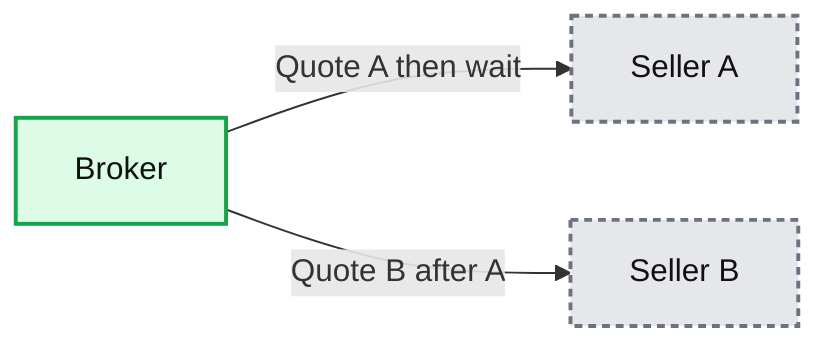
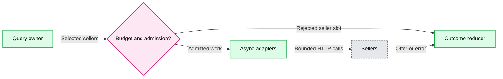
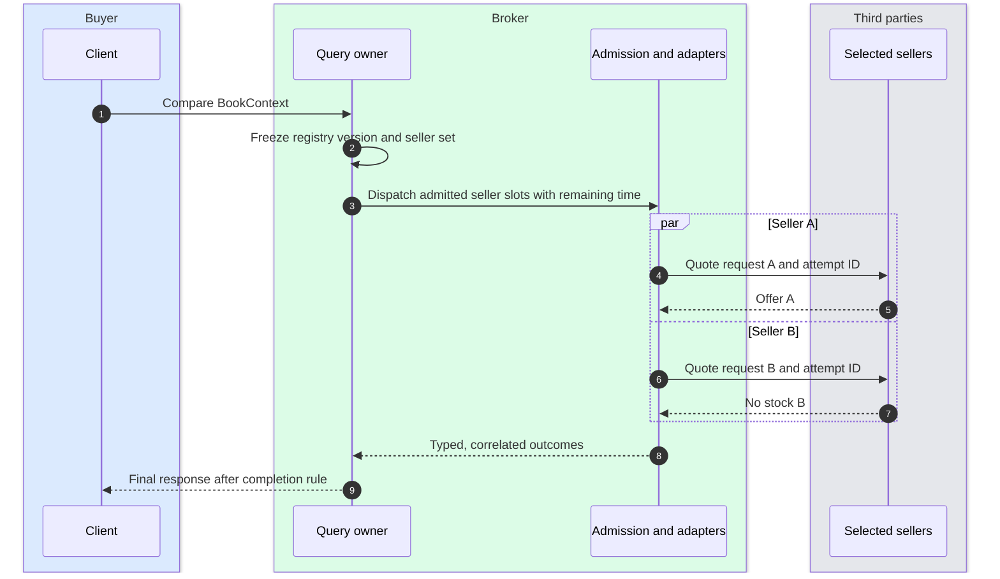
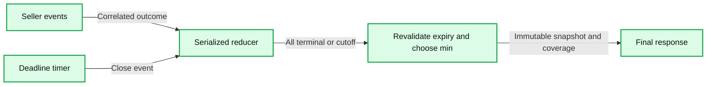
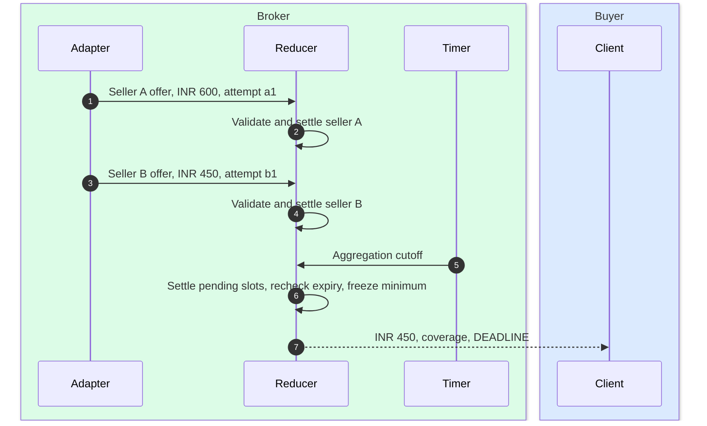
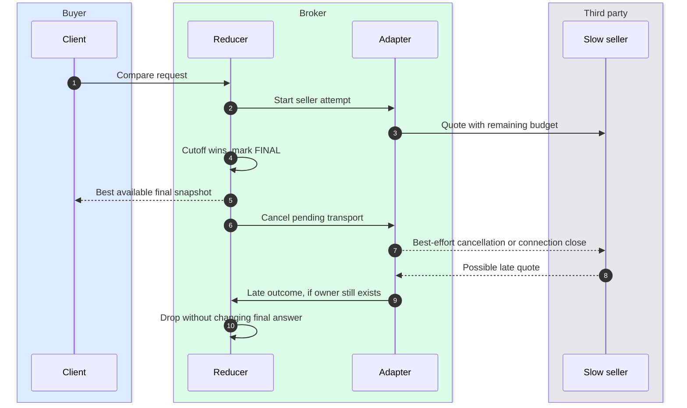
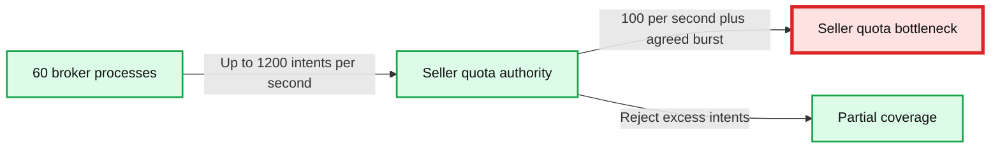
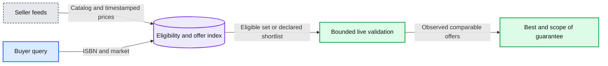
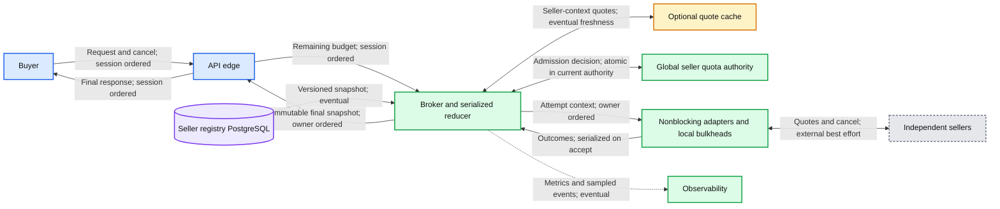

# HLD: Book seller broker

## 0. One-line answer

> Build a deadline-bound scatter-gather broker with nonblocking seller adapters, per-seller rate and concurrency admission, and one serialized reducer per query that returns the cheapest valid observed quote with explicit coverage.


Pattern basis: [Scatter-Gather](https://www.enterpriseintegrationpatterns.com/patterns/messaging/BroadcastAggregate.html) and [Aggregator](https://www.enterpriseintegrationpatterns.com/patterns/messaging/Aggregator.html). Technical evidence, access limits, and source IDs S1 to S14 are in [research/sources.md](research/sources.md). Numbers below are explicit worked assumptions. This is an interview reference design, not a claim about a company's implementation.

## 1. Understanding the problem

### 1.1 Functional requirements

| ID | Core requirement |
|---|---|
| FR1 | Query a frozen set of eligible sellers concurrently for the same book and purchase context |
| FR2 | Return the minimum comparable valid offer, with coverage and a clear completion reason |
| FR3 | Bound the query lifecycle: finish, cancel outstanding work, and handle retries and late responses safely |

Below the line: checkout, payment, reservations, book search/ranking, seller onboarding UI, guaranteed globally cheapest price, and durable request resumption. Callback-only sellers and resumability are explicit extensions in [crash recovery](deep-dives/crash-recovery.md).

Ask whether async means parallel HTTP calls or a seller callback protocol. The baseline uses parallel HTTP calls. The buyer receives one response. One seller's failure must not cancel healthy siblings.

**Define best before drawing boxes.** Compare the same ISBN/edition, condition, quantity, delivery region, service level, and currency. Use landed price, including required shipping and taxes. If tax cannot be determined, agree to compare a stated pre-tax basis for every seller. Never mix bases silently. A quote is advisory until checkout revalidates it.

### 1.2 Non-functional requirements

Ask for scale first. If absent, use the following assumptions and say so.

| ID | Dimension | Worked target and meaning |
|---|---|---|
| NFR1 | Latency | p99 under 2 s at the API edge; aggregation cutoff 1.8 s after edge admission |
| NFR2 | Resource isolation | Up to 100 selected sellers/query; bounded per-query, per-process, and per-seller in-flight work; honor seller-global rate budgets |
| NFR3 | Scale and cost | 1 M daily users, 10 searches/user/day, approximately 1,200 peak searches/s; evolve to a 100,000-seller directory |
| NFR4 | Availability and correctness | 99.9% eligible, admitted requests receive a valid final response within 2 s; terminal answers immutable; no duplicate seller accounting |
| NFR4 | Consistency | Single serialized owner for live query state; eventual registry/cache freshness; no consistent snapshot across independent sellers |
| NFR4 | Durability | Live search state may be lost on broker death; restart is permitted. Durable resumption requires the extension |

Track overload rejection rate separately so rejecting traffic cannot make the service appear healthy. Also track quote yield and coverage separately: a timely `UNAVAILABLE` response is not a successful price comparison. Report coverage against the pre-admission selected set, including sellers skipped by breakers or quota admission.

## 2. Back-of-envelope

```text
Searches/day          = 1,000,000 users * 10 = 10,000,000
Average searches/s    = 10,000,000 / 86,400 = 115.7
Peak searches/s       = 10 * average = 1,157, rounded to 1,200
Primary attempts/s    = 1,200 * 100 = 120,000 before cache/coalescing
Mean seller duration  = 0.3 s assumption
In-flight attempts    = 120,000 * 0.3 = 36,000 by Little's law
Full-timeout scenario = 120,000 * 1.8 = 216,000 potential attempts
Wire bytes/attempt    = 0.5 KB request + 1.5 KB response = 2 KB
Peak seller traffic   = 120,000 * 2 KB = 240 MB/s before protocol overhead
Daily seller traffic  = 10 M * 100 * 2 KB = 2 TB/day
Summary retention     = 10 M * 1 KB = 10 GB/day = 3.65 TB/year raw
All quote retention   = 10 M * 100 * 1.5 KB = 1.5 TB/day, deliberately avoided
```

These are offered-load figures, not promises to dispatch beyond seller quotas. A common seller selected by all buyers receives 1,200 requests/s without reuse. If its contract allows 100/s, it is already the bottleneck. More brokers do not increase that contract.

With 60 broker processes, the mean is 20 searches/s, 2,000 primary seller attempts/s, and 600 in-flight attempts/process. Provision a starting cap of 1,000 attempts/process, then benchmark CPU, transport memory, and event-loop delay. A broad slowdown reaches this cap and reduces coverage rather than growing to 3,600 attempts/process.

No per-search durable database write is required in the baseline. Sampled operational summaries are optional, with bounded retention and privacy controls. Full one-year retention above is sizing arithmetic, not the default policy.

## 3. The set-up

Product-style interface. The broker performs read-only comparisons.

### 3.1 Core entities

- **BookContext:** ISBN, condition, quantity, destination zone, currency, shipping tier, tenant/price tier, and comparison-rule version.
- **Seller:** ID, endpoint reference, supported markets, adapter version, quota policy, and health information.
- **Query:** random query ID, context hash, frozen selected seller IDs, remaining budget, state, outcome map, and completion reason.
- **SellerOutcome:** logical seller slot plus attempt IDs; offer, no stock, invalid response, timeout, error, or skipped admission.
- **Quote:** seller quote ID, exact monetary fields in integer minor units, stock/condition, observed time, expiry, and price basis.

### 3.2 API

| Method | Path | Input | Output |
|---|---|---|---|
| POST | `/v1/quotes:compare` | BookContext; requested timeout clamped to server maximum | One final comparison response |
| GET | `/health/ready` | Internal only | Admission readiness, not every seller's health |
| POST | `/v1/quote-queries` | Extension: BookContext and Idempotency-Key | 202 with query ID, Location, Retry-After |
| GET | `/v1/quote-queries/{id}` | Extension: authenticated owner | Current or final durable snapshot |
| DELETE | `/v1/quote-queries/{id}` | Extension: authenticated owner | Idempotent cancellation status |

Baseline cancellation is client disconnect or propagated request cancellation. A lost HTTP response means the caller can start a new comparison. It does not imply replay of the original prices.

Illustrative final response, using INR minor units:

```json
{
  "queryId": "q_7f2",
  "state": "FINAL",
  "completionReason": "DEADLINE",
  "result": "PARTIAL",
  "best": {
    "sellerId": "seller_18",
    "quoteId": "offer_302",
    "currency": "INR",
    "totalMinor": 49900,
    "priceBasis": "LANDED",
    "validUntil": "2026-09-13T10:00:30Z"
  },
  "selection": {"mode": "ALL_ELIGIBLE", "eligible": 100, "selected": 100},
  "coverage": {
    "offer": 75, "noStock": 10, "invalid": 2,
    "timeout": 8, "error": 3, "skipped": 2,
    "authoritativeFraction": 0.85
  },
  "guarantee": "MINIMUM_VALID_OBSERVED_QUOTE"
}
```

The seven terminal categories, including `cancelled` when relevant, sum to `selected`. Only `offer` and `noStock` are authoritative seller answers. Freshness metadata belongs on any reused quote. Do not represent unknown sellers as expensive or out of stock.

| Result | Meaning | HTTP policy |
|---|---|---|
| COMPLETE | Every selected seller gave a comparable offer or authoritative no-stock; at least one final-valid offer | 200 |
| PARTIAL | At least one final-valid offer, but seller knowledge is incomplete | 200, with coverage |
| NO_OFFERS | All selected sellers definitively returned no stock | 200, `best: null` |
| UNAVAILABLE | No final-valid offer and any seller is unknown, invalid, timed out, or errored | 503, structured coverage if available |
| NO_ELIGIBLE_SELLERS | The eligibility lookup succeeded and selected nobody | 200, separate result |

Bad input returns 400, caller quota exhaustion 429, global admission failure 503. A client timeout shorter than the broker's target is honored. `ALL_TERMINAL` can still produce `PARTIAL`: a terminal error is not a valid quote. A shortlist result is complete only over that shortlist, never the entire marketplace.

### 3.3 Data model

The ER diagram is in [D7](diagrams.md#d7-entity-relationship). Most query entities are in memory in the baseline.

| Data | Storage and access pattern | Key, retention, consistency |
|---|---|---|
| Seller registry | PostgreSQL administrative writes; versioned local snapshot for request reads | `seller_id`; durable; query pins one snapshot version |
| Query/outcomes | Broker-owned memory; append outcomes and finalize locally | `query_id`, then `seller_id`; request lifetime plus bounded cleanup |
| Per-seller quote cache | Optional shared cache or bounded process cache | Seller ID + complete BookContext + adapter/rule version; provisional maximum 5 s, always bounded by quote expiry |
| Quota state | Global quota authority; atomic admission per seller contract key | Account/seller/endpoint/region scope per actual contract; no eviction of active policy state |
| Durable query extension | PostgreSQL query, seller slot, and outbox rows | `query_id` partition seam; 24 h result/idempotency retention assumption |

Credentials live in a secret manager, not a registry row or quote cache. Cache failure loses an optimization. Quota-state loss changes admission safety and needs different recovery behavior.

## 4. High-level design

### 4.1 FR1: Query eligible sellers concurrently

**Bad: sequential requests.** One outbound call at a time is simple and limits resources. At 100 sellers and 300 ms mean latency it takes approximately 30 seconds. It misses NFR1.



**Good: parallel calls on a fixed worker pool.** Works for small N and low load. Challenges: blocking connections occupy workers; a shared FIFO lets slow sellers crowd out healthy sellers; a bounded thread pool with an unbounded submission queue still leaks latency and memory.


**Great: nonblocking adapters with bounded admission at three levels.** Freeze seller selection, check cache eligibility, then require request, process, and seller admission before dispatch. Separate rate tokens from in-flight permits. A full queue waits at most 20 ms and only while useful budget remains; otherwise record `SKIPPED_CAPACITY` or `SKIPPED_QUOTA`.



Challenges: async I/O still uses sockets, buffers, and CPU. Third-party SDKs may hide blocking DNS, connection setup, parsing, or retries. Isolate blocking adapters in small dedicated pools. Never run them on the reducer's event loop.



### 4.2 FR2: Return the cheapest valid offer with coverage

**Bad: return the first successful response.** Gives excellent latency but selects the fastest seller, not the cheapest. A 100 ms quote at INR 600 can precede a 200 ms quote at INR 450.

**Good: wait for every seller, then take the minimum.** Correct over comparable returned quotes if all sellers finish. Challenges: one silent seller prevents completion without a cutoff. With independent probability 0.99 of each seller finishing within a chosen time, all 100 finish with probability `0.99^100 = 36.6%`. Independence is a simplifying assumption; shared failures make tail reasoning harder. [S9]

**Great: collect every outcome until all slots are terminal or the deadline wins.** One reducer serializes events, records each logical seller once, validates offers, and freezes a final response. Use a deterministic tie-break `(totalMinor, sellerId, quoteId)`. Retain all at most 100 candidates so expiry of the current minimum cannot leave the reducer without the next valid quote.



Challenges: “received before deadline” needs a precise boundary. Here it means accepted by the query reducer before its monotonic cutoff, after validation. Bytes sitting in a kernel buffer do not count. Report reducer lag; overloaded validation should shed work, not silently expand the deadline.



Full acceptance rules and the finalization race are in [deadlines and aggregation](deep-dives/deadlines-and-aggregation.md).

### 4.3 FR3: Bound lifecycle, cancellation, and retries

**Bad: time out the incoming HTTP handler only.** The buyer leaves, but 100 seller calls can remain active. At 1,200 searches/s that is up to 120,000 new abandoned calls/s.

**Good: propagate cancellation and put a timeout around every child.** Works with cooperative adapters. Challenges: cleanup may block; a seller may ignore cancellation; an SDK may continue work in a background thread. Python's `wait_for` explicitly may outlast its timeout while waiting for cancellation. [S3, S4, S10]

**Great: separate response finalization from bounded transport cleanup.** Freeze the answer at the deadline, cancel pending work, release query ownership, and supervise a capped cleanup set. Release local transport permits only when the transport actually closes or completes. If it hangs, destroy the connection or isolate the worker. A seller-global QPS token is consumed once sent and is not refunded merely because we timed out.

The topology is the same as §4.2; cancellation is another serialized control event. Health errors become seller outcomes. A query-wide cancellation is distinct from an ordinary seller timeout.

Retry at one layer only: at most one application retry per logical seller, only for safe transient failures, after randomized backoff, with sufficient remaining time and fresh quota/permit admission. Limit aggregate extra attempts to 5% of original attempts over a sliding operational window. Disable or account for SDK/proxy retries. Avoid retrying timed-out sellers by default. [S5, S6]

Challenges: remote exactly-once execution and cancellation acknowledgement are unavailable unless the seller exposes them. This is safe for a read-only quote lookup, but duplicate work still costs quota and may return a different price.



## 5. Deep dives

### 5.1 NFR1: How do we meet a 2-second p99 with slow sellers?

Walk the path: edge admission, seller selection, quota check, connection pool, DNS/TLS, seller work, parsing, reducer, serialization. Each consumes the same remaining budget.

- **Bad:** 2 seconds for every stage, or a fresh 2 seconds on every retry. Serial stages exceed the API promise.
- **Good:** one absolute deadline with per-call limits. Challenges: hidden queueing and cleanup still consume wall time.
- **Great:** monotonic local deadline, propagated remaining duration, 1.8-second aggregation cutoff, and approximately 200 ms reserved for finalization and response. Bound queueing and parse size. Per-seller attempt timeout is the lesser of its configured cap and remaining aggregation budget. Challenges: a stalled runtime or network can still miss p99; this is an SLO, not a hard real-time guarantee.


**Push back on the textbook answer:** waiting for a majority is not a price quorum. The missing seller can be cheaper than every responding seller. Hedging across *different* sellers is normal fan-out, not a duplicate request to equivalent replicas. Do not send redundant requests to one throttled seller to improve p99 without spare quota and evidence it helps.

### 5.2 NFR2: How do we isolate one seller and honor its global QPS?

Walk the path: client quota, selected-seller admission, global rate authority, local in-flight permit, bounded transport queue, seller. See [quota deep dive](deep-dives/seller-limits-and-scale.md).

- **Bad:** one shared executor and one per-process token bucket set to the full seller quota. With 60 brokers, a 100/s seller can receive 6,000/s.
- **Good:** divide the quota among a fixed fleet and use separate seller pools. It works conservatively if allocations and process identities cannot overlap. Challenges: idle shares waste capacity and fleet changes require safe reassignment.
- **Great:** local bulkheads plus one logically shared rate authority keyed by the seller contract. Perform atomic admission close to dispatch. A Redis-backed authority is a practical soft-limit implementation; contractual hard limits require the stronger failover behavior in the deep dive. Challenges: the authority is on the request path and one popular seller is a hot quota key. Failure must skip affected seller work rather than bypass the limit. [S7, S8]



Rate limits cap attempts per time interval. Concurrency limits cap simultaneously active local work. A health breaker opens on repeated failures and allows a bounded number of half-open probes. These are three separate mechanisms. Seller-observed concurrency cannot be proven bounded if that seller keeps working after cancellation.

### 5.3 NFR3: How do we support 100,000 sellers and hot books?

Walk the path: eligibility lookup, selected-set size, cache/coalescing, dispatch count, provider quotas, aggregation. The offered work is `search QPS * selected sellers`, not directory size alone.

- **Bad:** live broadcast to 100,000 sellers for every query. At 1,200 searches/s this produces 120 M attempts/s and approximately 240 GB/s at 2 KB per exchange, before retries.
- **Good:** distribute fan-out across workers. Works for lower request rates and sellers with sufficient capacity. Challenges: preserves the same total calls, provider limits, and price-completeness problem; each query's fan-in is larger.
- **Great:** index sellers by ISBN/market, consume seller catalog or price feeds, and live-validate a bounded eligible set or declared shortlist. Coalesce identical in-flight seller/context lookups and use fresh quotes where permitted. Challenges: an incomplete feed can omit the cheapest seller; a shortlist weakens the guarantee and must be explicit in the API.



If the interviewer insists on **all 100,000 sellers live**, retain that scope and push back on the 2-second deadline, request rate, or seller contracts. Sharding cannot make those requirements simultaneously affordable. A feed-derived minimum is “best known as of feed timestamps,” not a globally current minimum.

### 5.4 NFR4: How do we survive failures without lying about the result?

Walk the path: registry availability, owner process, callback/transport, reducer mutation, final snapshot, delivery to buyer.

- **Bad:** declare every query durable because requests went through a load balancer. In-memory state dies with its broker; another process cannot recover its offers.
- **Good:** accept request loss, return/reset on crash, and let the buyer retry with jitter. This meets the stated baseline durability requirement. Challenges: duplicate seller calls and different returned prices; use a retry budget to avoid overload.
- **Great for the baseline:** the same restart model plus immutable finalization, typed seller outcomes, multi-AZ brokers, graceful drain, and no database on the hot result path. Challenges: there is still no replay guarantee after a lost response. This is a deliberate contract.
- **If the requirement changes:** persist query state and outbox work before returning 202; lock query state while storing outcomes or finalizing; poll or stream saved snapshots. This is the [durable extension](deep-dives/crash-recovery.md). Challenges: database write amplification, dedup retention, lease fencing, and recovery that usually cannot preserve the original 2-second latency during a crash.

The baseline failure path is [D5b](diagrams.md#d5b-broker-crash). Its topology is unchanged. The extension has its own diagram and SLO. Do not present an unnecessary durable workflow as the default “better” design.

## 6. Final design



The quota authority can use partitioned Redis underneath. Its counter semantics and failover limitations are distinct from the optional quote cache. See [D9 deployment](diagrams.md#d9-deployment) and [D10 scaling](diagrams.md#d10-scaling-and-partitioning).

## 7. Trade-offs

| Decision | Option A | Option B | Chose | Why |
|---|---|---|---|---|
| Completion | Wait for every seller indefinitely | Deadline plus coverage | B | Bounded latency; gives up completeness when sellers fail |
| Parallelism | Blocking pool | Nonblocking I/O with caps | B | Lower thread occupancy; still needs transport limits |
| Crash semantics | Durable every quote | Restart ephemeral searches | B initially | Meets read-only baseline without durable write amplification |
| Seller bottleneck | Add broker replicas | Respect quota, reuse or skip | B | The red bottlenecks in §5.1 and §5.2 are outside broker compute |
| Caching | Strict live quotes only | Fresh reusable quotes | A baseline, B optional | Reuse needs seller permission, complete cache keys, and honest freshness |
| Scale | Broadcast to every registered seller | Eligibility index and declared shortlist | Eligibility first | A shortlist changes the completeness contract |
| Transport | Kafka for every search | Direct outbound HTTP | HTTP | A queue does not improve seller latency or recover unpersisted state |
| Resilience | Automatic retries everywhere | One bounded retry owner | B | Controls amplification and quota consumption |
| Scope | Purchase and reserve | Quote only | Quote only | Writes would require separate idempotency and inventory protocols |

## 8. Staff-level notes

- **Blast radius:** one bad seller should consume only its bounded allocation. A broken shared HTTP pool, DNS resolver, quota authority, or reducer loop can affect all sellers; measure these separately.
- **Migration:** introduce typed outcomes and deadline metrics first, then bounded adapters, then quota authority, then optional caching. Do not shadow every seller call without provider quota approval; replay captured sanitized responses for comparison.
- **Operability:** latency, quote yield, coverage, and rejection rate are separate indicators. A fast empty response is not a business success.
- **Cost:** outbound calls dominate. At 1 B calls/day, even an illustrative USD 0.00001 per call is USD 10,000/day. Actual provider prices are unknown. Reducing calls matters more than optimizing a 100-element minimum.
- **Ownership:** platform team owns admission, runtime, and telemetry; integrations team owns seller schemas, quotas, credentials, and cancellation contracts; product owns completeness and freshness promises.
- **Verification:** load-test offered traffic with synthetic sellers, including one never returning, all timing out, malformed bodies, and delayed cancellation. Compare reducer output to a deterministic oracle over accepted events. This document does not claim such a benchmark has been run.

## 9. What is expected at each level

**Mid, roughly 80/20 breadth/depth:** explain concurrent requests, a timeout, minimum price, and a simple API. Avoid returning the first success or comparing mismatched currencies.

**Senior, roughly 60/40:** define partial results, deadline propagation, per-seller pools, cancellation, cache keys, typed errors, and broker-crash behavior. Show the 100-to-100,000 fan-out calculation.

**Staff+, roughly 40/60:** distinguish observed minimum from global cheapest; reason about quota scope across replicas and failover; define a linearization boundary for late quotes; quantify provider bottlenecks and retry load; choose when durability is justified; cover rollout, cost, and coverage SLOs unprompted.

## 10. Nitty-gritty, past interview scope

### 10.1 Internals of each chosen technology

- **Async HTTP runtime:** a small number of event-loop threads multiplex socket readiness. Connection pools reuse TCP/TLS sessions; HTTP/2 streams share connections where sellers support it. Parsing remains bounded CPU work. Expected seller failures are returned as data so structured-concurrency fail-fast behavior does not cancel other sellers. [S10]
- **Redis quota authority:** an atomic script reads current bucket state, refills to capacity using server time, conditionally consumes a token, and stores the new state. One shard serializes a seller key. Replication is not a guarantee of zero lost admissions on failover. Quote cache Redis, if used, has a separate failure and eviction policy. [S13, S14]
- **PostgreSQL registry:** infrequent administrative transactions persist seller policy; request owners pin a local snapshot. In the durable extension, a row lock on the query serializes quote persistence with finalization; its transaction includes seller outcome, aggregate version, and any outbox record. [S12]

See [technology internals diagrams](diagrams.md#technology-internals) for one diagram per technology. Existing [Kafka internals](../../popular_systems_deepdive/kafka/README.md) are useful if a later feed pipeline needs a log; Kafka is not a core dependency here. `concepts/` has no matching populated notes to cross-link at the time of writing.

### 10.2 Configuration knobs that matter

Starting values to validate against load and seller contracts:

| Component | Knob | Starting choice and reason |
|---|---|---|
| Request owner | Overall budget | 2 s maximum; smaller caller budgets win |
| Request owner | Response reserve | 200 ms; collection stops at 1.8 s |
| Runtime | Concurrent seller tasks | 100/query and 1,000/process; both must admit |
| Adapter | Queue wait / connect timeout / body cap | 20 ms / 150 ms / 16 KiB decompressed; all inside the remaining budget |
| Adapter | Total seller attempt cap | Default 1.5 s, tuned by seller; remaining request budget can be shorter |
| Retry owner | Attempts / backoff / retry budget | At most 2 total attempts, randomized 25 to 100 ms first backoff, extra attempts at most 5% |
| Seller bulkhead | In-flight cap | Seller-specific; provisional local cap 10, then tune from rate and measured latency |
| Health breaker | Open / probe policy | Example: over 50% eligible failures in 20 s with at least 50 samples; open 10 s, limited probes; 429 drives rate control separately |
| Quota authority | Rate / burst / failure policy | Seller contract; example 100/s plus burst 10; fail closed on unknown admission |
| Quote cache, optional | TTL / size / eviction | At most 5 s and quote expiry minus safety margin; bounded memory; eviction permitted |
| Quota store | Eviction / recovery | No eviction of live quota state; uncertain failover blocks admission pending safe recovery |
| Registry | Snapshot refresh | Example 30 s with version pinning; emergency deny policy has a faster push path |
| PostgreSQL extension | Transaction / retention | No network calls while holding row lock; 50 ms lock timeout starting point; results and idempotency mapping retained 24 h |

### 10.3 Capacity math per component

| Component | Estimate | Limit and implication |
|---|---|---|
| Broker CPU | 2,000 attempts/s/process; assume 0.25 ms local CPU/attempt = 0.5 CPU-seconds/s | Assumption excludes TLS and framework overhead; benchmark before node sizing |
| Broker in-flight state | 600 mean attempts/process * 8 KiB assumed metadata = 4.7 MiB | Transport buffers and retained quote candidates are additional |
| Broker cap | 1,000 attempts * 8 KiB = 7.8 MiB metadata; 16 KiB response cap adds up to 15.6 MiB if all buffers full | Cap cleanup separately; requests cannot bypass the attempt cap |
| Broker response candidates | Up to 40 active queries at 20/s * 2 s; 100 * 1.5 KB each = approximately 6 MB | Keep candidates until final revalidation |
| Fleet seller network | 240 MB/s / 60 = 4 MB/s/process before overhead | Global all-timeout cap prevents socket growth, but coverage falls |
| Quota authority | Up to 120k checks/s, approximately 126k with 5% retries | Eight illustrative shards average 15.75k/s each; hot sellers do not spread evenly; benchmark scripts and skew |
| Common seller | 1,200 desired calls/s versus 100/s contract | **First hard limit**; reduce calls or expose skipped coverage |
| Optional cache | 1 M distinct entries * 2 KiB = approximately 2 GiB payload | Index/allocator/replication overhead additional; quote context can explode cardinality |
| Registry | 100k sellers * 2 KB = 200 MB raw | Use indexed selection for large catalogs rather than copying full offer inventories per broker |
| Durable extension | 1,200 queries/s * 100 outcomes = 120k outcome writes/s at peak | A single unbenchmarked PostgreSQL primary is not an assumed solution at this scale |

### 10.4 Failure timelines

See [D5a](diagrams.md#d5a-seller-timeout-and-late-response), [D5b](diagrams.md#d5b-broker-crash), and [durable recovery timeline](deep-dives/crash-recovery.md#failure-timeline). They show detection, what is lost, retry behavior, and what the buyer sees. Baseline process failures are detected by transport closure or the outer deadline, not by waiting for a cluster-wide election.

### 10.5 Exactly-once and idempotency, end to end

| Hop | Duplicate entry point | Rule |
|---|---|---|
| Buyer to ephemeral broker | Lost response or client retry | New query ID and fresh search; no replay guarantee |
| Broker to seller | Timeout ambiguity, transport retry, application retry | Stable logical slot `(queryId, sellerId)` plus unique attempt ID; every sent attempt spends quota |
| Seller to reducer | Duplicate response, overlapping callback or retry | First valid terminal outcome for the logical slot wins; subsequent events cannot change counts |
| Shared lookup to waiters | Many callers share a seller request | Each waiter independently validates and settles its own query slot |
| Durable create | Retried POST with same key | Unique `(tenantId, idempotencyKey)` and context hash; mismatch returns 409; same request returns existing query |
| Durable outcome | Repeated delivery | Unique logical seller slot plus transaction locking query state; no updates after finalization |

Baseline dedup state lives for the query and bounded cleanup lifetime. IDs are never reused; events for a missing owner are dropped. Durable dedup lasts the advertised 24 h retention window; callback replay horizons must fit that policy or be explicitly rejected. Exactly-once **remote execution** is not promised. At most one accepted terminal state is a local/database invariant, not exactly-once HTTP delivery.

### 10.6 Consistency model per edge

Every edge in §6 states its ordering/freshness boundary. Session ordering and a serialized reducer are local guarantees; they do not make third-party inventory linearizable. The registry and quote cache can be stale. The current quota authority can decide atomically, but failover requires the safety policy in the quota deep dive.

For durable mode, poll the authoritative query row or a replica known to have applied the caller's version to provide read-your-writes. Reject old owner epochs in state transactions. Cross-region asynchronous replication cannot provide an unconditional RPO 0 promise.

### 10.7 Alternatives rejected

| Alternative | Why attractive | Specific rejection |
|---|---|---|
| Kafka and stream processor per interactive query | Replay and scalable fan-in | Adds persistence, consumer lag, and correlation cleanup before resumability is required |
| One thread per seller per query | Simple blocking code | 36k mean fleet-wide in-flight calls; 100k-seller follow-up becomes untenable |
| Unbounded futures | Low thread cost | Still unbounded task, socket, buffer, and queue memory |
| Majority or first response | Lower latency | Cannot prove a minimum over unknown sellers |
| Distributed lock around each query | Apparent concurrency safety | One local owner already serializes state; a lock does not recover memory |
| Cache only the winning seller | Small payload | Winner can expire; cannot compare the next candidate or preserve coverage |
| Automatic hedging to slow seller | Potential tail reduction | Doubles load against the exact dependency already struggling |
| Redis async failover as strict quota proof | Easy high availability | Lost counter updates can reissue spent capacity |

### 10.8 How published systems handle similar problems

- **Enterprise Integration Patterns' loan broker examples:** banks replace booksellers; scatter-gather routes quote requests and an aggregator chooses an offer. These are published examples, not a claim about a production bookstore. [S1, S2]
- **Google:** the Tail at Scale publication motivates tail-tolerant composition; the SRE overload chapter describes quotas, degraded responses, and client throttling. Unlike this broker, Google can often control both ends of an RPC. [S6, S9]
- **Envoy:** offers connection/request/retry bulkheads and global rate-limit integration. Those primitives do not define price comparison semantics or durable query ownership. [S7, S8]
- **Microsoft Azure architecture guidance:** async request-reply exposes a durable operation resource with polling and idempotency, matching the optional long-running variant. [S11]

### 10.9 Operational runbook

Five dashboard groups:

1. End-to-end latency and on-time final-response rate, split by completion reason.
2. Quote yield and authoritative coverage, split by market and selected-set size.
3. Per-seller latency, timeout/429 rate, dispatched attempts, and skipped admission.
4. Process in-flight count, cleanup backlog, queue delay, event-loop lag, and memory.
5. Retry amplification, quota authority errors, cache hit rate, and shared-lookup waiter count.

Starting alert rules: page broker on-call if over 1% of eligible admitted requests miss 2 s for 5 minutes, or healthy-market quote yield falls by over 20 percentage points for 10 minutes. Page integrations on-call for a contracted seller's sustained 429 rate over 1% for 10 minutes. Page immediately on evidence of dispatch exceeding a hard seller contract. These are proposed thresholds to calibrate, not existing production SLOs.

At 3am: identify whether the regression is seller-specific or shared; disable retries for an overloaded dependency; reduce admissions; inspect DNS/pool/quota latency; roll back the offending adapter version. Do not flush quota state to “fix Redis.”

Canary 1%, 5%, 25%, then 100% over at least one peak period. Compare price normalization and coverage using recorded sanitized responses before live traffic. A rollback restores the previous adapter and policy snapshot. Cache keys include versions, so stale entries can age out safely. Baseline query state needs no backfill. Durable schemas use additive changes until old workers have drained.

### 10.10 Security and abuse

- Authenticate buyers when the product requires it; enforce tenant/user/IP limits before expensive fan-out. An anonymous public endpoint still needs abuse controls.
- Use only allowlisted registry endpoints. Users cannot supply seller URLs. Block private/link-local addresses, unsafe redirects, and DNS rebinding at egress to prevent server-side request forgery.
- Validate seller JSON against bounded schemas, cap decompressed bytes, reject NaN/negative/overflowing prices, and compare money without floating point.
- Include tenant price tier and authorization scope in cache/coalescing keys. Send the minimum destination context; avoid logging addresses, access tokens, or complete request bodies.
- Seller callbacks require authentication/signatures, signed correlation IDs, expiry, and replay checks. An unguessable query ID alone is not authentication.
- Registry emergency disable and credential revocation bypass normal cache refresh delays. Third-party quote text is data, never executable content.

### 10.11 Evolution

At 10x buyer traffic, desired attempts rise to 1.2 M/s. Provider quotas usually constrain growth before broker CPU. Use quote reuse, per-seller/context coalescing, better eligibility, and negotiated capacity before multiplying worker fleets.

At 100,000 sellers, introduce seller catalog/price feeds and indexed selection. At a new requirement for persistent callbacks, introduce the durable query resource and outbox seam. At multi-region, keep each live query in one region, split global seller budgets across regions, and define whether failover restarts or resumes. At a privacy deletion requirement, avoid durable personal context by default and delete retained tenant-associated snapshots within policy.

## 11. Follow-up questions to expect

1. [Ten sellers time out; what do we return?](edge-cases.md#edge-case-ten-sellers-time-out)
2. [A cheaper response races the deadline.](deep-dives/deadlines-and-aggregation.md#the-cutoff-and-finalization-race)
3. [Does cancellation stop the seller?](edge-cases.md#edge-case-a-seller-ignores-cancellation)
4. [A seller has a global 100-qps contract.](deep-dives/seller-limits-and-scale.md#global-rate-admission)
5. [One slow seller uses all workers.](edge-cases.md#edge-case-one-seller-blocks-the-runtime)
6. [Now there are 100000 sellers.](deep-dives/seller-limits-and-scale.md#the-100000-seller-follow-up)
7. [Can we retry without double counting?](deep-dives/deadlines-and-aggregation.md#retries-and-duplicate-outcomes)
8. [The broker crashes after dispatch.](deep-dives/crash-recovery.md)
9. [Can the client poll or receive seller callbacks?](deep-dives/crash-recovery.md#durable-protocol)
10. [How do we keep cached prices honest?](edge-cases.md#edge-case-the-cheapest-quote-expires)
