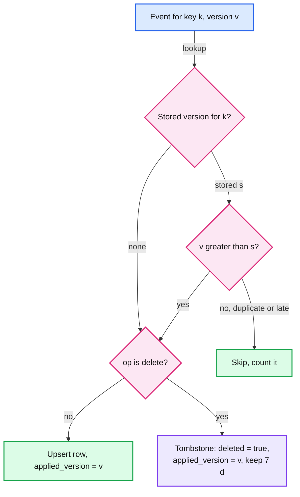
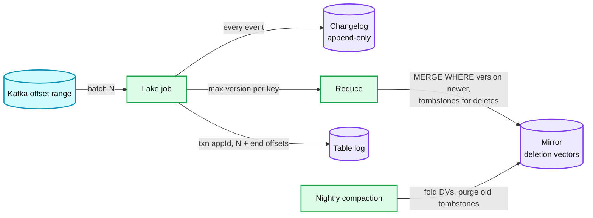
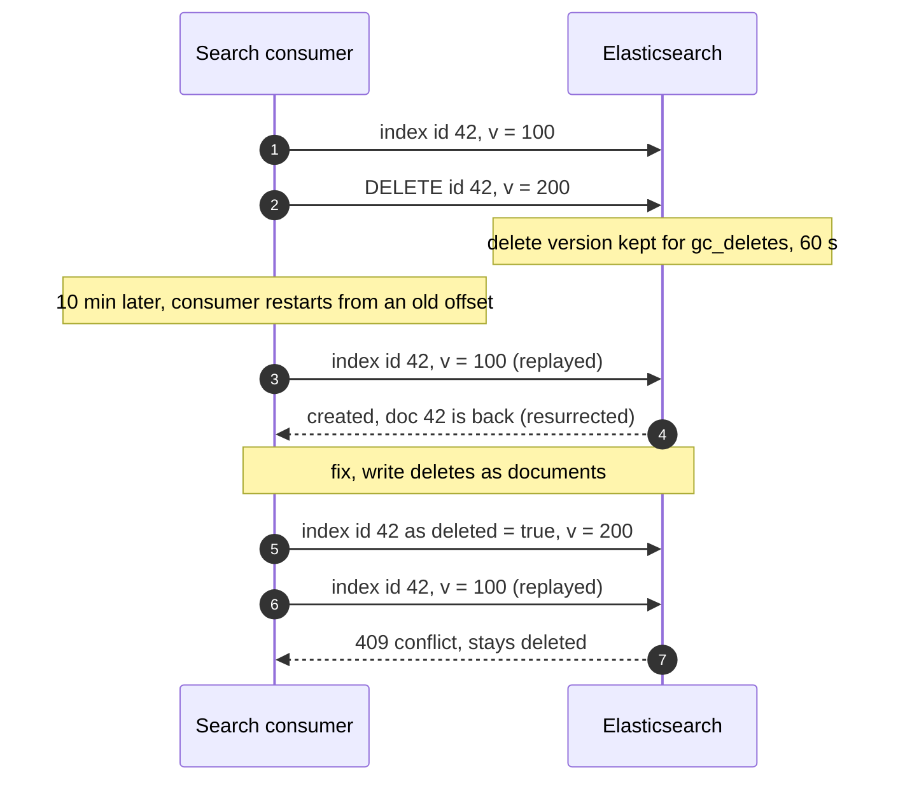

# Deep dive: exactly-once effect at the sinks

> One-line answer: delivery is at-least-once on every hop and stays that way; exactly-once is an effect built at each sink by one rule, "store the version you last applied for each key and apply a change only if its version is newer", where the version is `(epoch, commit position, index)`; that single comparison makes duplicates no-ops, makes replays and late arrivals harmless, merges snapshot rows with live changes, and needs no transaction across systems, while Kafka's exactly-once only cleans up the copy inside Kafka.

Part of [`../solution.md`](../solution.md) §4.3, §5.2, §5.5, §10.5. Sources: [Debezium 3.6 Postgres connector](https://debezium.io/documentation/reference/stable/connectors/postgresql.html), [Debezium exactly-once delivery](https://debezium.io/documentation/reference/stable/configuration/eos.html), [Postgres logical decoding](https://www.postgresql.org/docs/current/logicaldecoding-explanation.html), [Databricks AUTO CDC](https://docs.databricks.com/aws/en/ldp/cdc), [Elasticsearch index API](https://www.elastic.co/docs/api/doc/elasticsearch/operation/operation-index), [Elasticsearch `IndexSettings.java`](https://github.com/elastic/elasticsearch/blob/main/server/src/main/java/org/elasticsearch/index/IndexSettings.java), [Kafka Connect `WorkerConfig.java`](https://github.com/apache/kafka/blob/trunk/connect/runtime/src/main/java/org/apache/kafka/connect/runtime/WorkerConfig.java), [Scaling Memcache at Facebook](https://www.usenix.org/system/files/conference/nsdi13/nsdi13-final170_update.pdf). Concepts: [`../../../concepts/exactly-once.md`](../../../concepts/exactly-once.md), [`../../../concepts/caching-patterns.md`](../../../concepts/caching-patterns.md), [`../../delta-lake-transactions/`](../../delta-lake-transactions/), [`../../streaming-ingestion/`](../../streaming-ingestion/), [`../../distributed-cache/`](../../distributed-cache/).

## 1. Where duplicates and disorder come from

None of these is a bug. Each is a normal day.

- **Connector offset flush.** Kafka Connect commits source offsets every `offset.flush.interval.ms`, 60,000 ms by default ([WorkerConfig.java](https://github.com/apache/kafka/blob/trunk/connect/runtime/src/main/java/org/apache/kafka/connect/runtime/WorkerConfig.java)). A crash re-sends up to 60 s of events: 3.6 M duplicates on the 60k/s database. Debezium says consumers "should always anticipate some duplicate events" and can use the LSN to detect them ([Debezium](https://debezium.io/documentation/reference/stable/connectors/postgresql.html)).
- **Slot rewind.** A slot's position "is persisted only at checkpoint, so in the case of a crash the slot might return to an earlier LSN", and "logical decoding clients are responsible for avoiding ill effects" ([Postgres](https://www.postgresql.org/docs/current/logicaldecoding-explanation.html)).
- **Snapshot overlap.** A snapshot row and a live change for the same key, or a chunk re-emitted after a crash at a higher high watermark ([`snapshot-and-stream-handoff.md`](snapshot-and-stream-handoff.md)).
- **Sink consumer rebalance or restart.** The consumer re-reads from its last committed consumer offset, re-applying events it already wrote.
- **Failover.** Re-sent events after reconnect, and in the unsafe case, phantom events and reused positions ([`failover-and-recovery.md`](failover-and-recovery.md)).
- **Delete then replay.** A replay re-delivers an old insert after the sink already applied the delete.

## 2. The one rule

Every event carries `version = (epoch, commit position, index in transaction)`. It only goes up per key: commit positions follow commit order, two transactions cannot write one key concurrently, the index orders changes inside one transaction, and the epoch outranks everything from a broken position lineage ([`../solution.md`](../solution.md) §4.1). Snapshot rows carry the high watermark's position with index 0.

Each sink stores `applied_version` next to each key and applies an event only if `event.version > applied_version`. Three properties fall out:
- **Idempotency.** A duplicate has an equal version: no-op.
- **Order safety.** A late or replayed event has a lower version: no-op. The sink never goes back.
- **Snapshot merge.** A snapshot row is just an event with version `HW`. It loses to any change committed after `HW` and wins over anything before.



**Tombstones must outlive the replay window.** A sink that forgets a deleted key cannot reject a late insert for it. The longest replay is a consumer reset to the start of Kafka retention, so tombstones are kept at least 7 days, and a bootstrap from the mirror loads them too.

## 3. Lake: changelog plus mirror

Per micro-batch ([`../../streaming-ingestion/`](../../streaming-ingestion/) landing job):
1. Append every event to the **changelog** table. Append-only, so duplicates here are rows with the same `(key, version)`; readers dedup on that pair. It is the history and the replay source after Kafka's 7 days.
2. Reduce the batch to the highest version per key.
3. Merge into the **mirror** with the guard. `_version` is stored as a fixed-width sortable binary (2 bytes epoch, 8 bytes position, 4 bytes index) so one `>` compares the tuple (our encoding choice).

```sql
MERGE INTO mirror t
USING latest_per_key s ON t.id = s.id
WHEN MATCHED AND s._version > t._version AND s.op = 'd'
  THEN UPDATE SET _deleted = true, _version = s._version, _commit_ts = s._commit_ts
WHEN MATCHED AND s._version > t._version
  THEN UPDATE SET *
WHEN NOT MATCHED AND s.op = 'd'
  THEN INSERT (id, _deleted, _version, _commit_ts) VALUES (s.id, true, s._version, s._commit_ts)
WHEN NOT MATCHED
  THEN INSERT *
```

The last-but-one clause matters: a delete for a key the mirror has never seen still writes a tombstone, so a snapshot row or replayed insert with a lower version arriving later is rejected.

4. Commit with the `txn` marker `(appId, batch)` and the batch's end offsets in the commit metadata, so a re-run of the same batch is skipped and a new consumer can start from this table version.

**On Databricks** the same thing is `AUTO CDC`, which replaces `APPLY CHANGES` with the same syntax (the old name still works) ([Databricks](https://docs.databricks.com/aws/en/ldp/cdc)). The clauses that matter here: `KEYS (id)`, `APPLY AS DELETE WHEN op = 'd'`, and `SEQUENCE BY STRUCT(epoch, pos, idx)`; with a struct, it "orders by the first field first, and in the event of a tie, considers the second field". `STORED AS SCD TYPE 1` keeps the latest row only, and late updates "arrive late and are dropped". `SCD TYPE 2` keeps every version with `__START_AT` and `__END_AT`. One trap: "`NULL` sequencing values are not supported", so snapshot rows must carry their `HW` version, never a null.

**Cost.** The 2 TB mirror (~2,000 files of 1 GB) at 20k changes/s gets 1.2 M changes per 60 s batch, ~600 per file, so every file is touched every batch. Copy-on-write rewrites 2 TB per minute (33 GB/s): impossible. Deletion vectors write the new row versions (1.2 M × 500 B = ~600 MB) plus a small bitmap per touched file, and a nightly compaction folds the bitmaps into files and purges tombstones older than 7 days. See [`../../delta-lake-transactions/`](../../delta-lake-transactions/) for copy-on-write versus merge-on-read.



## 4. Elasticsearch: external versions from the source

Elasticsearch has the rule built in. With `version_type=external`, "if the value provided is less than or equal to the stored document's version number, a version conflict will occur and the index operation will fail" (HTTP 409). `external_gte` indexes when the version is "equal or higher". And the docs make the CDC point directly: with versions from the source database "there is no need to maintain strict ordering of async indexing operations" ([Elasticsearch](https://www.elastic.co/docs/api/doc/elasticsearch/operation/operation-index)).

- **Packing.** The version must be one non-negative long: `epoch << 56 | commit position`. A position below 2^56 is 72 PB of WAL, far beyond any database's lifetime. Seven epoch bits allow 128 epochs; reaching the top means a reindex (assumption: rare, epochs bump only on lineage breaks).
- **Why `external_gte`.** The packed version has no room for the index, so two changes to one key in one transaction share a version, and the later one must win. `external` would reject it.
- **Reduce per batch.** The consumer keeps only the last change per key in each poll, so normally one write per key per transaction.
- **The price of `_gte`.** Elastic warns it "can result in loss of data" if misused. Here it is safe because one partition is read in order: if a replay re-applies an earlier change of transaction T, the later changes of T follow in the same partition. A replay whose batch boundary splits T can briefly show T's intermediate state, then converges on the next batch.

**Deletes and `gc_deletes`.** Elasticsearch remembers a deleted document's version only for `index.gc_deletes`, 60 s by default ([IndexSettings.java](https://github.com/elastic/elasticsearch/blob/main/server/src/main/java/org/elasticsearch/index/IndexSettings.java)). After that, an index request for the key has nothing to compare against and recreates the document.



So the search consumer writes a delete as a soft-delete document (`deleted: true`, with the delete's version), queries filter it out, and a nightly job hard-deletes soft-deleted documents older than 7 days, past which no replay can reach.

## 5. Cache: delete only

The cache consumer turns every change into `DELETE key`. Deletes commute and repeat safely, so this sink needs no version and no ordering. It is a **backstop** behind the application's own delete-on-write: it catches writes that bypass the application (migrations, admin scripts, other services). Meta built the same thing: an `mcsqueal` daemon on every database tails committed statements and broadcasts the deletes, because invalidations taken from the commit log can be replayed after a misrouting ([Scaling Memcache](https://www.usenix.org/system/files/conference/nsdi13/nsdi13-final170_update.pdf)).

The hole to name: the **stale fill**. A reader misses, reads the old row, the change commits and the CDC delete runs (nothing to delete yet), then the reader sets the old value. It stays stale until TTL unless fills are guarded with leases that a delete invalidates. That fix, and the stated staleness bound, belong to the cache design: [`../../distributed-cache/`](../../distributed-cache/) and [`../../../concepts/caching-patterns.md`](../../../concepts/caching-patterns.md). Our end of the contract is the delete arriving within ~5 s of commit.

## 6. Relational and service sinks

A service that keeps its own copy writes it with the same guard in one local statement:

```sql
INSERT INTO customer_copy AS t (id, name, tier, _version)
VALUES (:id, :name, :tier, :version)
ON CONFLICT (id) DO UPDATE
  SET name = excluded.name, tier = excluded.tier, _version = excluded._version
  WHERE excluded._version > t._version;
```

Zero rows affected means duplicate or stale, which the consumer counts and moves on. Deletes become a tombstone update (`deleted = true`, version) rather than a `DELETE`, for the same reason as §2. If the change must trigger side effects (an email, a call to another service), the service records them in its own outbox in the same local transaction, and a relay sends them with their own idempotency keys. The change event is an input, never a side effect ([`../../../concepts/exactly-once.md`](../../../concepts/exactly-once.md)).

## 7. What Kafka exactly-once buys, and what it does not

KIP-618 lets a source connector write its records and its source offsets in one Kafka transaction. Setup: Kafka Connect 3.3.0 or later in distributed mode, `exactly.once.source.support=enabled` on every worker, `exactly.once.support=required` on the connector, and `transaction.boundary=poll` (the default, required for Debezium). Debezium's MariaDB, MongoDB, MySQL, Oracle, PostgreSQL and SQL Server connectors support it ([Debezium EOS](https://debezium.io/documentation/reference/stable/configuration/eos.html)). Consumers must read with `isolation.level=read_committed` to skip aborted copies.

It buys: no re-sent duplicates **inside Kafka** after a connector crash. We turn it on for service-facing topics so inbox counters stay clean.

It does not buy:
- Anything at a sink outside Kafka. Every sink here (lake, search, cache, service databases) is outside.
- Protection from snapshot overlap, consumer replays, or the phantom events of an unsafe failover. Those are correct records from Kafka's point of view.
- Proven correctness. Debezium's own page says "it remains unclear whether the implementation is fully correct", cites the Redpanda and Bufstream Jepsen reports, and lists open issues KAFKA-17734, KAFKA-17754 and KAFKA-17582 ([Debezium EOS](https://debezium.io/documentation/reference/stable/configuration/eos.html)).

So the design never depends on it. The versioned apply is the guarantee; KIP-618 is hygiene.

## 8. Every duplicate, where it dies

| Duplicate or disorder source | Removed by | Key | Retention |
|---|---|---|---|
| Connector crash, up to 60 s re-sent | Version check at each sink (KIP-618 also removes it inside Kafka) | `(key, version)` | `applied_version` lives with the row |
| Slot rewind after a Postgres crash | Connector skips positions at or below its offset, then the version check | position, version | Offsets topic, sink row |
| Snapshot row vs live change | Watermark window drops the row; `HW` version ranks it otherwise | `(key, HW version)` | Sink row |
| Chunk re-emitted after a crash | Higher `HW'` version, state is newer or equal | version | Sink row |
| Sink consumer rebalance | Version check; lake batches also skipped by `txn` marker | version, `(appId, batch)` | Sink row, table log |
| Replayed insert after a delete | Tombstone with version | `(key, version, deleted)` | ≥ 7 days (Kafka retention) |
| Elasticsearch replay after `gc_deletes` | Soft-delete document with version | `(id, version)` | 7 days, then purge job |
| Same-transaction changes to one key | `external_gte` plus per-batch reduce | packed version | Document |
| Cache | Delete commutes | none | none |
| Failover phantom or reused position | Epoch bump plus re-snapshot | epoch | `SOURCE_DB.epoch` |

## 9. Replaying a sink after a bad sink release

A normal replay (rebalance, restart) is a no-op by design: every replayed event carries a version equal to or below the stored one. That same property defeats a repair. If a buggy sink release wrote wrong values, the stored version is correct and the value is not, so replaying from before the release changes nothing under a strict `>` guard. Repairs therefore run in **repair mode**: reset the consumer group to a time before the release and apply with `>=`. An equal full version is by construction the same source event, so re-applying it is safe and overwrites the bad value. Search already runs `external_gte`. The lake mirror is simpler to rebuild from the changelog.

## Failure modes

| Failure | Effect | Mitigation |
|---|---|---|
| Tombstones purged before the replay window ends | A replayed insert resurrects a deleted row | Tombstone retention ≥ Kafka retention, loaded on bootstrap |
| Version built from the change LSN | Concurrent-transaction case loses an update to a snapshot row | Commit position as the version, index for ties |
| Null version on snapshot rows | `AUTO CDC` rejects NULL sequencing, custom merges treat it as lowest or highest by accident | Snapshot rows carry `HW` |
| Real deletes in Elasticsearch | Resurrection after 60 s | Soft deletes plus purge |
| `external` instead of `external_gte` | Last change of a transaction to a key is rejected | `external_gte`, one partition per key in order |
| Epoch bits exhausted | Packed version wraps | Reindex at the top epoch (assumption: rare) |
| Service side effect fired from the change handler | Email sent twice on replay | Outbox in the same local transaction, idempotency key on the send |
| Mirror copy-on-write on a hot table | Batch never finishes, lag unbounded | Deletion vectors above ~1k changes/s, nightly compaction |

## Interview soundbite

"I do not try to deliver once. Every hop is at-least-once, and every sink stores the version it last applied per key, where the version is the source's epoch and commit position. A change applies only if it is newer. That one comparison makes duplicates no-ops, makes replays and late events harmless, merges snapshot rows stamped at the high watermark, and keeps deletes as tombstones for as long as a replay can reach. Elasticsearch gets it through external versions with soft deletes because it forgets delete versions after 60 seconds, the lake through a guarded MERGE or AUTO CDC with SEQUENCE BY, the cache by only ever deleting. Kafka's exactly-once is nice hygiene inside Kafka, but every sink I care about is outside it."
