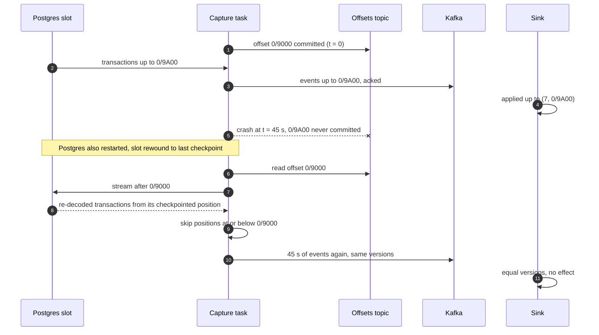
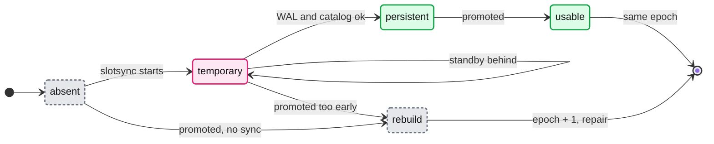
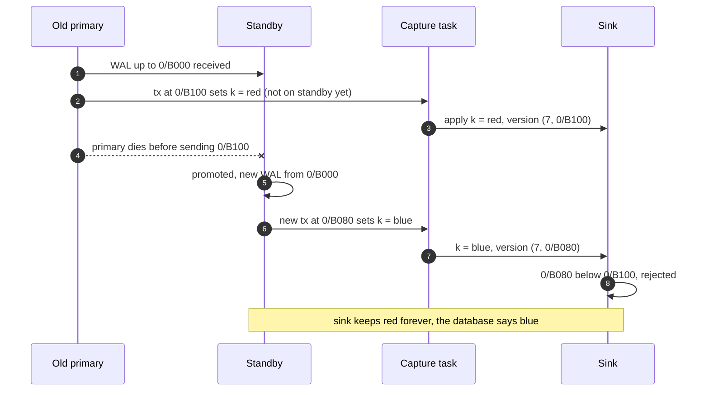
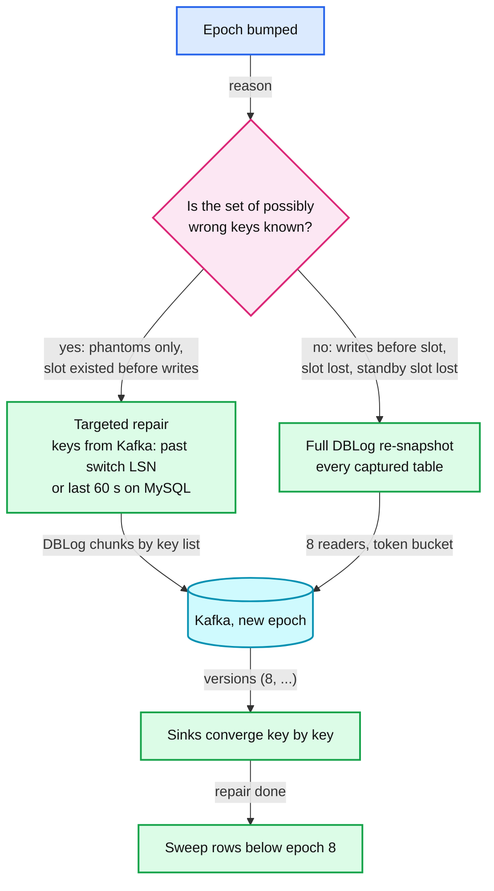

# Deep dive: failover and recovery

> One-line answer: duplicates are the easy failure (every sink rejects a version it has already applied), so recovery is really about the position lineage: a connector crash or a Postgres restart only rewinds within one lineage and is absorbed by versions, a Postgres 17+ failover with a synced failover slot and `synchronized_standby_slots` continues the same lineage with no phantoms, and everything else that breaks the lineage (a pre-17 failover, a promoted server outside the synced list, a MySQL failover, a lost slot, a major upgrade) bumps the source epoch so every new event outranks every old one, then repairs the keys that could be wrong with a targeted or full watermark snapshot.

Part of [`../solution.md`](../solution.md) §5.2, §6 Flows 3 to 5, §10.4. Sources: [logical decoding concepts](https://www.postgresql.org/docs/current/logicaldecoding-explanation.html), [Postgres replication settings](https://www.postgresql.org/docs/current/runtime-config-replication.html), [logical replication failover](https://www.postgresql.org/docs/current/logical-replication-failover.html), [pg_replication_slots](https://www.postgresql.org/docs/current/view-pg-replication-slots.html), [upgrading logical replication clusters](https://www.postgresql.org/docs/current/logical-replication-upgrade.html), [Debezium 3.6 Postgres connector](https://debezium.io/documentation/reference/stable/connectors/postgresql.html), [Debezium exactly-once](https://debezium.io/documentation/reference/stable/configuration/eos.html), [Kafka Connect WorkerConfig](https://github.com/apache/kafka/blob/trunk/connect/runtime/src/main/java/org/apache/kafka/connect/runtime/WorkerConfig.java). Concepts: [`../../../concepts/replication-and-quorums.md`](../../../concepts/replication-and-quorums.md), [`../../../concepts/leases-fencing-clocks.md`](../../../concepts/leases-fencing-clocks.md), [`../../../concepts/exactly-once.md`](../../../concepts/exactly-once.md).

## 1. Three positions and one epoch

Recovery reasons about four numbers per source database:

| Number | Where it lives | Who writes it | Rule |
|---|---|---|---|
| Kafka offset of the capture task (an LSN or a GTID set plus a synthetic offset) | Connect offsets topic | Connect, every `offset.flush.interval.ms` (60,000 ms default) | Only after Kafka acked the events |
| `confirmed_flush_lsn` | The slot, on the database | The task, after the offset commit (`lsn.flush.mode = connector`) | Always at or behind the offset |
| `restart_lsn` | The slot | Postgres | WAL older than it may be recycled |
| `epoch` | Control plane registry, copied into every event's version | Control plane only | Bumped whenever the position lineage breaks |

A **position lineage** is a sequence of positions that only goes forward and means the same history everywhere. Inside one lineage, versions `(epoch, position, index)` compare correctly and duplicates are harmless. When a lineage breaks (positions reused, repeated with different content, or unreachable), the epoch bumps so the new lineage outranks the old one, and anything the old lineage may have got wrong is re-snapshotted.

## 2. Failures inside one lineage: absorbed by versions

**Connector crash.** Offsets commit every 60 s by default, so a crash re-sends up to 60 s of events: 60k/s × 60 s = **3.6 M duplicates** on the busiest database. Debezium's docs describe exactly this: after a Connect process crash, "the new replacement tasks might generate some of the same change events that were processed just prior to the crash. The number of duplicate events depends on the offset flush period and the volume of data changes just before the crash" ([Debezium](https://debezium.io/documentation/reference/stable/connectors/postgresql.html)). The top 20 databases run `offset.flush.interval.ms = 10000` to shrink the window to 600k.

**Postgres crash.** The database rewinds too: "A logical slot will emit each change just once in normal operation. The current position of each slot is persisted only at checkpoint, so in the case of a crash the slot might return to an earlier LSN, which will then cause recent changes to be sent again when the server restarts. Logical decoding clients are responsible for avoiding ill effects from handling the same message more than once" ([Postgres](https://www.postgresql.org/docs/current/logicaldecoding-explanation.html)). The task requests changes after its stored offset and skips anything at or below it; sinks reject the rest by version.



**Connect worker loss and rebalance.** A graceful stop migrates tasks and "the new connector tasks start processing exactly where the prior tasks stopped"; a crash falls back to the last offset as above ([Debezium](https://debezium.io/documentation/reference/stable/connectors/postgresql.html)). Either way the slot is idle while the task moves, which spends budget but never correctness.

**Kafka unavailable.** Nothing is lost: the slot keeps everything. The task's queue (`max.queue.size`, 8,192) fills and it stops reading, so every slot in the fleet spends budget at once. Kafka runs across 3 AZs with `min.insync.replicas = 2`, and the page fires at 5 min, long before the smallest budget (2.8 h) matters. See [`source-safety-and-slot-budget.md`](source-safety-and-slot-budget.md).

**Optional: clean topics with KIP-618.** For topics consumed by services, `exactly.once.source.support = enabled` on the Connect workers and `exactly.once.support = required` on the connector (Kafka Connect 3.3.0+, distributed mode) write records and offsets in one Kafka transaction, so `read_committed` consumers never see the re-sent copies. The design does not rely on it: Debezium's own page says "it remains unclear whether the implementation is fully correct" and lists open Kafka issues ([Debezium EOS](https://debezium.io/documentation/reference/stable/configuration/eos.html)).

## 3. Postgres failover before version 17

The slot exists only on the old primary. A standby has none, so after promotion there is no slot, and everything committed on the new primary before one is created is invisible to CDC forever. Debezium's documented procedure ([Debezium](https://debezium.io/documentation/reference/stable/connectors/postgresql.html)): "Ensure that the required replication slot exists on the server before writes resume", ensure Debezium can replicate and create publications, "Promote the standby PostgreSQL node to primary", "Restart the connector", then "Set the snapshot mode to `always`, and perform a snapshot on the new primary server ... and ensure that no data is lost."

In this design step 5 is a watermark re-snapshot at epoch + 1, not a locked `always` snapshot. Two outcomes:
- **Slot created before writes resumed:** no change on the new primary was missed. Only phantoms (§5) can be wrong. A targeted repair is enough.
- **Writes resumed first** (the usual case in an unplanned failover): an unknown set of keys changed while nobody was capturing. Only a full re-snapshot of every captured table fixes that.

## 4. Postgres 17+: failover slots

The slot is synced to the standby continuously, so after promotion it is already there.

| Where | Setting | Why |
|---|---|---|
| Slot | `failover = true` (Debezium `slot.failover = true`, default false) | Marks the slot for syncing |
| Standby | `sync_replication_slots = on` (off by default) | The slotsync worker copies failover slots periodically |
| Standby | `primary_slot_name` set (a physical slot on the primary) | "mandatory to have a physical replication slot between the primary and the standby" |
| Standby | `hot_standby_feedback = on` | Required for synchronization |
| Standby | valid `dbname` in `primary_conninfo` | Required for synchronization |
| Primary | `synchronized_standby_slots` lists that physical slot | Logical walsenders wait for the standby (§5). Quotes from [logical decoding concepts](https://www.postgresql.org/docs/current/logicaldecoding-explanation.html) and [settings](https://www.postgresql.org/docs/current/runtime-config-replication.html) |

Two details decide whether a failover actually works:
- **Only persistent synced slots survive.** "Only persistent slots that have attained synced state as true on the standby before failover can be used for logical replication after failover. Temporary synced slots cannot be used for logical decoding." If the standby lacks the WAL or catalog rows the slot needs, it logs "could not synchronize replication slot" and does not persist it.
- **Check readiness before a planned failover** with the documented query on the standby ([failover](https://www.postgresql.org/docs/current/logical-replication-failover.html)). For a non-Postgres subscriber like Debezium, list the slots to check on the primary with `SELECT array_agg(quote_literal(r.slot_name)) FROM pg_replication_slots r WHERE r.failover AND NOT r.temporary;`

```sql
SELECT slot_name, (synced AND NOT temporary AND invalidation_reason IS NULL) AS failover_ready
FROM pg_replication_slots
WHERE slot_name IN ('cdc_orders_db');
```



After promotion the capture task reconnects through the new primary's endpoint, finds the slot at its confirmed position, and continues. LSNs continue across a promotion, so the epoch stays. §6 Flow 4 of the solution: about 15 s of CDC pause, nothing lost, nothing rebuilt.

## 5. Phantoms, and why `synchronized_standby_slots` matters

With asynchronous replication the primary can be ahead of its standby. Without `synchronized_standby_slots`, the walsender decodes and sends a transaction the standby has not received yet. If the primary dies at that moment:
1. The sinks hold a change the database no longer has (a **phantom**).
2. The promoted standby starts writing new WAL at its own last position, so new transactions **reuse the LSN range** the phantom used. A real change to the same key can get a lower LSN than the phantom and be rejected by every sink as "older".



`synchronized_standby_slots` closes the window at the source: "Logical WAL sender processes will send decoded changes to plugins only after the specified replication slots confirm receiving WAL. This guarantees that logical replication failover slots do not consume changes until those changes are received and flushed to corresponding physical standbys" ([settings](https://www.postgresql.org/docs/current/runtime-config-replication.html)). CDC can never be ahead of the standby that will be promoted.

The price, also documented:
- "some latency is expected when sending changes to logical subscribers" (CDC latency now includes standby lag).
- "logical replication will not proceed if the slots specified in the `synchronized_standby_slots` do not exist or are invalidated". A dead standby stalls CDC and spends slot budget, so replacing or removing a standby updates the list in the same change.
- The primary "will not completely shut down until the corresponding standbys ... have confirmed receiving the WAL".

The guarantee only covers the standby in the list. Promoting any other server is an unsafe failover: epoch + 1 and repair.

## 6. The epoch

**What bumps it.** A slot `lost` at the cap, a failover without a persistent synced slot, promotion of a server not in `synchronized_standby_slots`, any MySQL failover, a lost CDC standby slot, a Postgres major upgrade, and an operator-declared "capture wrote bad data" incident. Everything else (crashes, rebalances, Kafka outages, graceful moves) stays in the epoch.

**How the control plane does it.**
1. Stop the capture task for the database and fence it (its Connect task is deleted, not paused, so a stale worker cannot publish into the new lineage).
2. Write `epoch = epoch + 1` with the reason to the registry.
3. Create the slot on the current primary (or resume by GTID on MySQL) and record the start position.
4. Start the task with the new epoch and the new start position in its offsets.
5. Schedule the repair (below).

**Why new outranks old.** Versions compare lexicographically, epoch first, so `(8, anything) > (7, anything)` in every sink. For sinks that need one 64-bit number (Elasticsearch) the version is `epoch << 56 | position`, which keeps the same order. Old-epoch events still in Kafka reach sinks first (same partition, earlier offsets) and are then overridden; any that arrive late are rejected.

**Every repair ends with a sweep.** A snapshot only re-emits rows that still exist. A row deleted while CDC was blind, or a phantom insert, never gets a new-epoch event, so after the repair finishes each sink deletes that source's rows (or, for a targeted repair, those keys) whose version is still below the new epoch. A targeted repair also emits `op = d` at the high-watermark version for any requested key the read does not find. See [`log-capture-and-positions.md`](log-capture-and-positions.md) §5.6.



A targeted repair on the solution's MySQL example is ~1,200 keys, minutes. A full re-snapshot of the busiest database is about 7 h (the 4 B-row table at 8 readers is 6.9 h). During either, live changes of the new epoch apply immediately and sinks stay per-key monotonic.

## 7. MySQL failover with GTID

- The connector stores the executed GTID set in its offsets and resumes on the new primary by asking for everything after it. GTIDs survive failover; file and offset positions do not, because they are per server.
- The synthetic 64-bit position (cumulative binlog bytes in the lineage) would jump backwards on the new server, so the epoch bumps and the control plane stores a new base with the offsets. The re-base is deterministic on replay because the base is persisted.
- **Phantoms are possible**: the connector is just another binlog client and can read a transaction the promoted replica never received. §10.4 of the solution walks it: GTIDs 4,991 to 5,000 existed only on the old primary, the repair re-snapshots the ~1,200 keys the lake changelog shows as changed in the last 60 s.
- Assumption, not verified here: semi-synchronous replication narrows but does not remove this window for a CDC reader, because acknowledgement is about replicas, not about the CDC client. The design treats every unplanned MySQL failover as unsafe and repairs, which does not depend on the answer. If the new primary has purged binlogs the connector still needs, it falls off: full re-snapshot at epoch + 1.

## 8. Slot lost at the cap: the rebuild timeline

From §6 Flow 5 of the solution, busy primary, Connect cluster down at peak:

| t | Event |
|---|---|
| 0 | Connect cluster down, slot pins 180 GB/h |
| 1.4 h | Warn: half the 2.8 h budget used |
| 1.8 h | Page: 1 h of budget left |
| 2.8 h | Checkpoint removes WAL, `wal_status = lost`, `invalidation_reason = wal_removed`. The primary is fine |
| 3.5 h | Cluster back, slot invalid, control plane bumps epoch 7 to 8, new slot, streaming resumes |
| 3.5 to ~10.5 h | Full DBLog re-snapshot under the token bucket, sinks converge table by table |

Data at risk: none acknowledged to a service. What users see: search and caches stale for keys changed during the outage until their chunk passes, the lake behind by hours on that database.

## 9. Major version upgrades

`pg_upgrade` "attempts to migrate logical slots", but "Migration of logical slots is only supported when the old cluster is version 17.0 or later. Logical slots on clusters before version 17.0 will silently be ignored." Prerequisites include `max_replication_slots` on the new cluster at least the number of old slots, the output plugins installed, every old slot usable, and no permanent logical slots already on the new cluster ([upgrade](https://www.postgresql.org/docs/current/logical-replication-upgrade.html)).

| Old version | Plan |
|---|---|
| 16 or older | Treat as a lineage break. Stop writes, wait until the task has confirmed the last LSN, upgrade, create the slot on the new cluster **before** writes resume, bump the epoch. Because nothing was written while no slot existed, no re-snapshot is needed. If writes cannot be stopped for the drain, this becomes a full re-snapshot |
| 17 or newer | Check the prerequisites, let `pg_upgrade` migrate the slot, verify it is usable, resume. Bump the epoch anyway: it costs nothing and removes any question about position continuity |

## 10. Recovery times per failure

| Failure | Detection | CDC pause | Data at risk | What sinks see | Epoch |
|---|---|---|---|---|---|
| Capture task crash | Connect restarts it | < 1 min | None | Up to 60 s re-sent, rejected by version | Same |
| Postgres crash and restart | Connection loss | Postgres recovery time | None | Re-sent from last checkpoint, rejected | Same |
| Connect worker loss | Rebalance | Seconds to a minute | None | Duplicates if not graceful | Same |
| Kafka unavailable | Producer errors, page at 5 min | Outage length | None within budget | Stale by the outage length | Same |
| Postgres 17+ failover, synced slot | Primary loss | ~15 s | None | Seconds of staleness | Same |
| Postgres failover without synced slot | Primary loss, slot missing | Until slot created | Writes before the slot, phantoms | Wrong keys until repaired | + 1, full or targeted |
| MySQL unplanned failover | Primary loss | ~20 s | Phantom GTIDs | Phantom states for minutes | + 1, targeted |
| Slot lost at cap | `wal_status = lost` | Outage + ~7 h rebuild | Changes during the gap | Stale keys until their chunk passes, deleted rows until the sweep | + 1, full |
| CDC standby lost | Slot gone | Until new slot | Changes during the gap | Same as above | + 1, full |
| Major upgrade | Planned | Drain plus upgrade | None if drained | Seconds to minutes | + 1, none |

## Failure modes

| Failure | Blast radius | Mitigation | Residual risk |
|---|---|---|---|
| Stale capture task publishes after the epoch bump | Wrong lineage in Kafka | Delete (fence) the old task before bumping | Operator error in the runbook |
| Listed standby dies with `synchronized_standby_slots` set | CDC stalls for that database | Runbook updates the list with the topology change | Budget spent until updated |
| Failover slot not yet persistent at promotion | Slot unusable | `failover_ready` check before planned failovers | Unplanned failovers still need repair |
| Phantom on MySQL | Keys changed in last seconds | Targeted repair with the key list read from Kafka for the last 60 s (never the lake changelog, which can lag 10 min), `op = d` for keys not found, then sweep | Transactions older than 60 s that no replica had, which semi-sync makes unlikely [assumption] |
| Repair without a sweep | Deleted and phantom rows live forever in sinks | Sweep below the new epoch after every repair | None |
| Epoch wraps in the 64-bit encoding | Search versions go backwards | 7 bits of epoch is 128 lineages; reindex before wrap | Negligible |
| Upgrade from 16 without drain | Unknown gap | Full re-snapshot | Rebuild load |

## Interview soundbite

"Duplicates are the easy part: every event carries a version and sinks only apply newer ones, so a connector crash or a Postgres restart just re-sends 60 seconds of no-ops. The hard part is the position lineage. On Postgres 17 I use failover slots plus `synchronized_standby_slots`, so the slot is on the standby when it is promoted and CDC was never ahead of it, which means no phantoms and no rebuild. Anything that breaks the lineage, a pre-17 failover, a MySQL failover, a lost slot, a major upgrade, bumps an epoch that outranks every old version, and then I repair: by key list when the damage window is known, with a full chunked re-snapshot when it is not."
