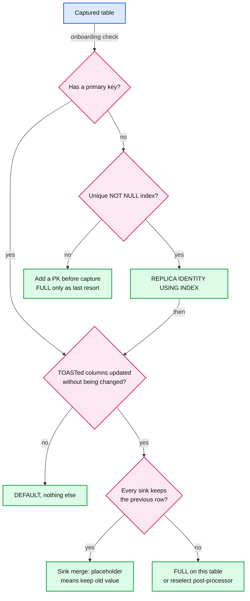
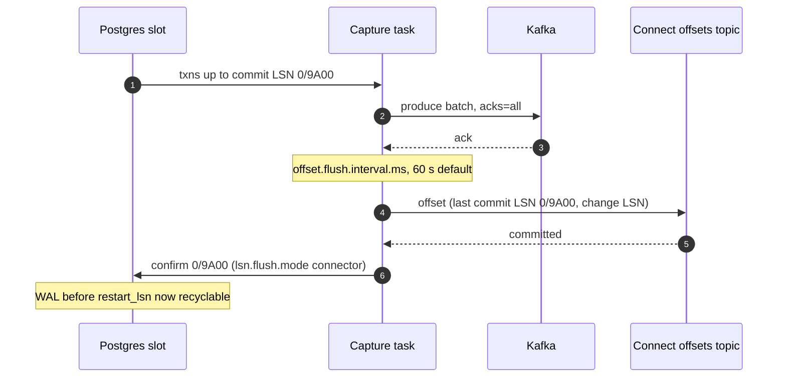
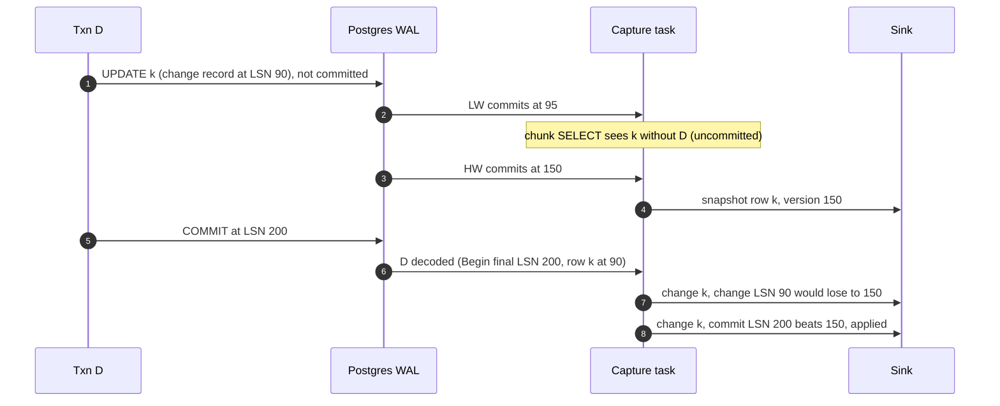
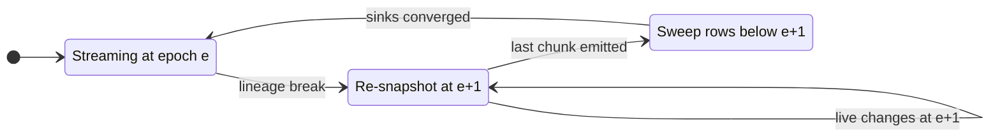

# Deep dive: log capture, positions, and the version

> One-line answer: read the database's commit log through exactly one position per database (a Postgres logical slot or a MySQL binlog GTID set), move that position forward only after Kafka has the events and Connect has stored the offset, and stamp every event with a version built from the transaction's commit position (not the row's own LSN, not a timestamp) plus an epoch that is bumped whenever the position lineage breaks, so that "apply only if newer" is correct at every sink, including across snapshots and failovers.

Part of [`../solution.md`](../solution.md) §4.1, §5.2, §10.1. Sources: [Postgres logical decoding](https://www.postgresql.org/docs/current/logicaldecoding-explanation.html), [pgoutput message formats](https://www.postgresql.org/docs/current/protocol-logicalrep-message-formats.html), [logical replication protocol](https://www.postgresql.org/docs/current/protocol-logical-replication.html), [pg_replication_slots](https://www.postgresql.org/docs/current/view-pg-replication-slots.html), [ALTER TABLE REPLICA IDENTITY](https://www.postgresql.org/docs/current/sql-altertable.html), [publication replica identity](https://www.postgresql.org/docs/current/logical-replication-publication.html), [Debezium 3.6 Postgres connector](https://debezium.io/documentation/reference/stable/connectors/postgresql.html), [Debezium MySQL connector](https://debezium.io/documentation/reference/stable/connectors/mysql.html), [MySQL 8.4 binlog options](https://dev.mysql.com/doc/refman/8.4/en/replication-options-binary-log.html). Concepts: [`../../../concepts/stream-processing.md`](../../../concepts/stream-processing.md) §7, [`../../../concepts/exactly-once.md`](../../../concepts/exactly-once.md), [`../../../popular_systems_deepdive/kafka/`](../../../popular_systems_deepdive/kafka/).

## 1. Postgres: from WAL to a change event

### 1.1 Setup, once per database

- `wal_level = logical` (restart required), and a publication with an explicit table list (column lists on Postgres 15+ keep secrets out).
- A logical slot per database with the built-in `pgoutput` plugin. One slot, one reader: a slot cannot be consumed by two connections at once.
- The CDC role: `REPLICATION` plus `SELECT` on the published tables.

### 1.2 The pipeline inside the server

```mermaid
%% Postgres logical decoding, one slot. The walsender reads WAL from restart_lsn, the reorder buffer assembles each transaction, pgoutput filters by publication and sends whole transactions in commit order. The slot (red) is the thing that pins WAL.
flowchart LR
    BK[Backends] -->|"WAL records, interleaved by txn"| WAL[(WAL segments)]
    WAL -->|"read from restart_lsn"| WS[walsender]
    WS -->|"records"| RB[Reorder buffer<br/>per transaction<br/>spill above 64MB]
    RB -->|"whole txn at commit"| PO[pgoutput<br/>publication filter]
    PO -->|"Begin, Relation, rows, Commit"| CT[Capture task]
    CT -->|"confirmed_flush_lsn"| SL[Slot<br/>restart_lsn, catalog_xmin]:::critical
    SL -->|"oldest WAL still needed"| WAL

    class BK client
    class WS,RB,PO,CT service
    class WAL store

    classDef client   fill:#dbeafe,stroke:#2563eb,stroke-width:2px,color:#111
    classDef service  fill:#dcfce7,stroke:#16a34a,stroke-width:2px,color:#111
    classDef store    fill:#ede9fe,stroke:#7c3aed,stroke-width:2px,color:#111
    classDef critical fill:#fee2e2,stroke:#dc2626,stroke-width:4px,color:#111
```

- Transactions are decoded when they commit and sent one by one, never interleaved: "all messages between a pair of Begin and Commit messages belong to the same transaction" ([protocol](https://www.postgresql.org/docs/current/protocol-logical-replication.html)). Aborted transactions are dropped.
- The reorder buffer keeps up to `logical_decoding_work_mem` (64MB by default) per walsender, then spills to disk on the primary. A 10 M-row transaction is spilled, then sent in one burst (see [`transactions-and-ordering.md`](transactions-and-ordering.md)).
- The publication filter runs after the reorder buffer. A second slot on the same database decodes every transaction again. That is why "split the slot" costs source CPU.

### 1.3 The messages a transaction becomes

| Message | Carries | What the capture task does with it |
|---|---|---|
| `Begin` | final LSN of the transaction, commit timestamp, xid | Remembers the commit position for the version of every row that follows |
| `Relation` | relation OID, namespace, name, replica identity setting, columns with type OIDs | Updates the cached table shape. Sent before the first row of a table, and again whenever the table's definition changed ([protocol](https://www.postgresql.org/docs/current/protocol-logical-replication.html)) |
| `Insert` | new tuple | `op = c` |
| `Update` | optional old key (`K`) or old tuple (`O`), new tuple | `op = u`. `K` only if the key changed, `O` only with REPLICA IDENTITY FULL |
| `Delete` | old key or old tuple, never both | `op = d`, then a tombstone |
| `Commit` | commit LSN, end LSN, commit timestamp | Closes the transaction, advances the position |

### 1.4 The slot's two positions

| Column | Meaning | Who moves it |
|---|---|---|
| `confirmed_flush_lsn` | "Data corresponding to the transactions committed before this LSN is not available anymore" | The capture task, by confirming |
| `restart_lsn` | Oldest WAL the slot might still need; not removed at checkpoints unless it falls more than `max_slot_wal_keep_size` behind | Postgres, trailing the confirm (in-progress transactions still need older WAL) |
| `catalog_xmin` | Oldest transaction whose catalog rows the slot needs | Postgres. A stuck slot also stops catalog vacuum |

The slot's position is persisted only at checkpoint, "so in the case of a crash the slot might return to an earlier LSN", and "logical decoding clients are responsible for avoiding ill effects from handling the same message more than once" ([Postgres](https://www.postgresql.org/docs/current/logicaldecoding-explanation.html)). The client asks to start from its own stored position; the versions absorb anything re-sent.

## 2. What an UPDATE or DELETE carries: REPLICA IDENTITY and TOAST

| REPLICA IDENTITY | Old image in WAL ([ALTER TABLE](https://www.postgresql.org/docs/current/sql-altertable.html)) | Cost | Use it when |
|---|---|---|---|
| `DEFAULT` | Old primary key columns. With no primary key, same as `NOTHING` | None extra | Almost always |
| `USING INDEX idx` | Old values of a unique, non-partial, non-deferrable index on NOT NULL columns | None extra | No PK but a natural unique key |
| `FULL` | Old values of all columns | Every update and delete logs the whole old row | A sink needs old non-key values, or TOASTed columns must always be present |
| `NOTHING` | Nothing | | Never on a captured table |

- **No primary key.** `DEFAULT` without a PK means no identity, and "tables with a replica identity defined as NOTHING, DEFAULT without a primary key ... cannot support UPDATE or DELETE operations when included in a publication replicating these actions. Attempting such operations will result in an error on the publisher" ([Postgres](https://www.postgresql.org/docs/current/logical-replication-publication.html)). Adding such a table to a publication breaks the application. Onboarding checks for it: add a PK, use `USING INDEX`, or `FULL` as the last resort, and set `message.key.columns` so the Kafka key is still stable.
- **Primary key change.** Debezium emits a delete for the old key and a create for the new key, with `__debezium.newkey` and `__debezium.oldkey` headers ([Debezium](https://debezium.io/documentation/reference/stable/connectors/postgresql.html)). The two go to different partitions, so a consumer can see them in either order. Both carry the same commit version; each sink handles each key independently, which is correct.
- **Changing which columns form the PK** races the connector's JDBC lookup of key columns. Debezium's documented procedure is read-only mode, drain, stop, alter, restart. Treat it as a schema migration ([`schema-evolution-and-ddl.md`](schema-evolution-and-ddl.md)).

**TOAST.** Large values are stored out of line (TOAST). An `UPDATE` that did not change such a value sends it as `u`, "unchanged TOASTed value (the actual value is not sent)" ([formats](https://www.postgresql.org/docs/current/protocol-logicalrep-message-formats.html)). Debezium writes the placeholder `__debezium_unavailable_value` (`unavailable.value.placeholder`). A naive sink stores the placeholder over the real text.

The three fixes: `REPLICA IDENTITY FULL` (the old tuple carries the value, paid on every write), Debezium's reselect-columns post-processor (queries the source for the current value, which is a read on the source and may be newer than the event), or a sink-side rule "placeholder means keep what you have" (free, needs a sink that holds the previous row; the lake mirror and the search document do).

## 3. MySQL: the row binlog

| Event | Meaning |
|---|---|
| `GTID` | `server_uuid:n`, identity of the transaction |
| `Query(BEGIN)` or `Query(DDL)` | Start of a transaction, or a DDL statement in order with rows |
| `Table_map` | Table id to name and column types for the rows that follow |
| `Write_rows` / `Update_rows` / `Delete_rows` | After image, before and after images, before image |
| `Xid` | Commit |

- Settings: `binlog_format = ROW` (default; the variable itself is deprecated), `binlog_row_image = FULL` (default, whole before and after rows), `binlog_row_metadata = FULL` (default MINIMAL; FULL puts column names in `Table_map`, so the log alone says which column is which).
- The whole transaction is written as one contiguous group at commit, so **binlog order is commit order** and a transaction is never interleaved.
- **GTID vs file and offset.** `mysql-bin.000412:88231` exists only on one server. A GTID set (`uuidA:1-5000`) means the same thing on every server that applied those transactions. Debezium stores the executed GTID set and can "fail over to different multi-primary MySQL replicas as long as the new replica is caught up" ([Debezium MySQL](https://debezium.io/documentation/reference/stable/connectors/mysql.html)).
- **Schema history.** The binlog has DDL but not a table's current shape at an arbitrary position, so Debezium records every DDL with its binlog position in a schema history topic and replays it on restart. Details in [`schema-evolution-and-ddl.md`](schema-evolution-and-ddl.md).
- **Retention.** Binlogs are purged by age (`binlog_expire_logs_seconds`, 2,592,000 s = 30 days by default), whether or not a reader has consumed them. A connector further behind than that has lost its position.
- Hosted MySQL (RDS, Aurora) forbids global read locks, so Debezium's blocking snapshot falls back to table locks there. One more reason to use incremental snapshots only.

## 4. How the position moves

- Kafka Connect commits source offsets every `offset.flush.interval.ms` (60,000 ms default, [WorkerConfig.java](https://github.com/apache/kafka/blob/trunk/connect/runtime/src/main/java/org/apache/kafka/connect/runtime/WorkerConfig.java)). The Postgres connector flushes to the slot the commit LSN from the committed offset ([PostgresStreamingChangeEventSource.java](https://github.com/debezium/debezium/blob/main/debezium-connector-postgres/src/main/java/io/debezium/connector/postgresql/PostgresStreamingChangeEventSource.java)).
- On restart the connector "sends a request to the PostgreSQL server to send the events starting just after that position" ([Debezium](https://debezium.io/documentation/reference/stable/connectors/postgresql.html)). Up to 60 s of events are re-sent. That is the known duplicate window.
- **Heartbeats.** `heartbeat.interval.ms` (default 0, off) emits a heartbeat record so the offset can move with no captured changes. On a quiet database sharing a cluster with a busy one, add `heartbeat.action.query` (an insert into a heartbeat table) so there is a real change to confirm. Without it the quiet database's slot holds the busy neighbours' WAL.

## 5. The version

Every event carries `version = (epoch, commit position, index in transaction)`; sinks apply a change only if it is newer than what they hold for that key.

### 5.1 Why not the change's own LSN

- Postgres writes WAL records in execution order and emits transactions in commit order. The change LSN of a row inside a long transaction can be older than things already emitted.
- Per key, the commit LSN only goes up: two transactions cannot both hold a row lock on `k`, so the second one to write `k` commits after the first. Inside one transaction the index breaks ties.

### 5.2 Why not the commit timestamp

Commit timestamps come from the server clock. Two transactions can share a microsecond, an NTP step can move the clock backwards, and after a failover the new primary's clock is a different clock. A version must be a position in the log, not a time.

### 5.3 Debezium's `source.sequence`

Debezium's Postgres events carry `sequence = [lastCommitLsn, lsn]` ([SourceInfo.java](https://github.com/debezium/debezium/blob/main/debezium-connector-postgres/src/main/java/io/debezium/connector/postgresql/SourceInfo.java)). `lastCommitLsn` is updated when a commit is processed, so it is the commit LSN of the previous transaction, and the pair increases in emission order. It is usable as an ordering key, with one care: snapshot rows must take the sequence of the high-watermark event itself, not a value derived from the watermark's commit. The platform instead stamps the transaction's own commit LSN from `Begin` (assumption: this needs a small post-processor or connector patch, since `source` exposes `lsn`, `txId` and `sequence` but not the current transaction's commit LSN).

### 5.4 MySQL: a synthetic offset

Within one epoch, `position = (sum of sizes of earlier binlog files in this lineage) + offset of the transaction's GTID event`, and the index is the row number within the group. Binlog order is commit order, so the start of the group is enough. After a failover the new server's files and offsets are unrelated to the old ones, so the epoch bumps and the synthetic offset starts a new base; the stored offsets record the base so a restart recomputes the same numbers.

### 5.5 Packing into one 64-bit number (Elasticsearch)

- `version = epoch << 56 | position`. 2^56 bytes is ~72 PB of WAL: 50 MB/s for 45 years. 7 bits of epoch (the sign bit stays 0, versions must be non-negative) allow 128 lineage breaks before the index needs a rebuild.
- Two writes to one key in one transaction share the commit position, so the search consumer reduces to the last one per key per transaction and uses `version_type=external_gte`.

### 5.6 When the epoch bumps, and the sweep that must follow

| Event | Why the lineage broke |
|---|---|
| Slot invalidated at the WAL cap | Changes in the blind window are gone |
| Postgres failover without a synced failover slot, or with a standby not in `synchronized_standby_slots` | Missed writes before the new slot, possible phantoms |
| Slot recreated for any reason (major upgrade from before 17, decode moved between primary and a CDC standby) | New slot starts at its creation point |
| MySQL failover | Offsets are per server |

The sweep matters. A re-snapshot only re-emits rows that exist. A row deleted during the blind window, or a phantom insert from a lost timeline, exists in the sinks and not in the source, so no chunk will ever overwrite it. After the last chunk of the new epoch, each sink deletes rows of that source whose version is below `(e+1, 0, 0)`.

## Failure modes

| Failure | Effect | Mitigation |
|---|---|---|
| Postgres crash | Slot rewinds to its last checkpointed position, re-sends | Connector resumes from its own offset, versions absorb the rest |
| Connector crash | Up to 60 s re-sent | Versions; shorter flush interval on the top databases |
| Quiet database on busy cluster | Slot never confirms, WAL grows | `heartbeat.action.query` |
| Table without a key added to a publication | Application UPDATE and DELETE fail on the publisher | Onboarding check, PK or `USING INDEX` first |
| TOAST placeholder reaches a sink | Real text overwritten by `__debezium_unavailable_value` | Sink keeps old value on placeholder, or FULL |
| Primary key change | Delete and create on two partitions | Per-key versions, both keys handled independently |
| Change LSN used as version | Long transaction lost behind a snapshot row | Commit position as the version |
| MySQL binlog purged before read | Position lost | Budget alarm on age, epoch bump, re-snapshot |
| Lineage break without a sweep | Deleted and phantom rows live forever in sinks | Sweep below the new epoch after the re-snapshot |

## Interview soundbite

"I read the database's own commit log through one slot per database, and I only move the slot after Kafka has the events and Connect has stored the offset, so a crash re-sends and never loses. Every event gets a version from the transaction's commit position, not the row's LSN or a clock, because a long transaction can write a row early and commit late. An epoch on top of it survives failovers and lost slots, and after an epoch rebuild I sweep anything the new epoch did not touch. With that, every sink just applies newer versions and ignores the rest."
