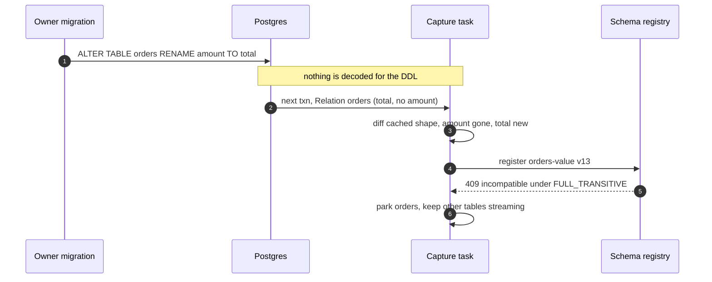
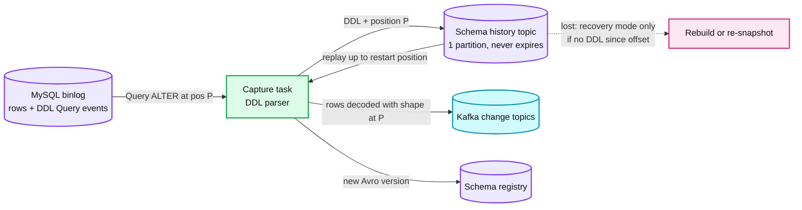
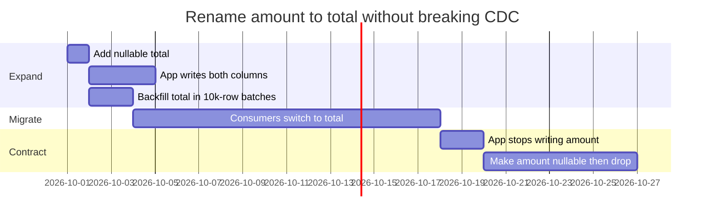
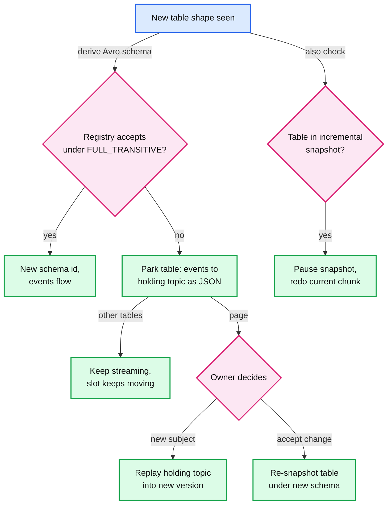

# Deep dive: schema evolution and DDL

> One-line answer: a captured table is a published API, so its schema is a registry subject checked in the owner's migration CI before the DDL ships; in production additive changes register and flow at the exact log position where they happened, and anything the registry rejects parks only that table in a holding topic so the rest of the database keeps streaming and the slot keeps moving.

Part of [`../solution.md`](../solution.md) §4.4, §6 Flow 6. Sources: [Postgres logical replication protocol](https://www.postgresql.org/docs/current/protocol-logical-replication.html), [pgoutput message formats](https://www.postgresql.org/docs/current/protocol-logicalrep-message-formats.html), [Debezium 3.6 Postgres connector](https://debezium.io/documentation/reference/stable/connectors/postgresql.html), [Debezium MySQL connector](https://debezium.io/documentation/reference/stable/connectors/mysql.html), [Confluent schema evolution and compatibility](https://docs.confluent.io/platform/current/schema-registry/fundamentals/schema-evolution.html), [Avro schema resolution](https://avro.apache.org/docs/1.11.1/specification/#schema-resolution). Concepts: [`../../../concepts/exactly-once.md`](../../../concepts/exactly-once.md) (outbox), [`../../streaming-ingestion/deep-dives/schema-drift-and-quarantine.md`](../../streaming-ingestion/deep-dives/schema-drift-and-quarantine.md) (the same ideas for event streams), [`log-capture-and-positions.md`](log-capture-and-positions.md).

## 1. How DDL shows up in each log

### 1.1 Postgres: no DDL, only the new shape

- Logical decoding "does not support DDL changes", so the connector "is unable to report DDL change events back to consumers" ([Debezium](https://debezium.io/documentation/reference/stable/connectors/postgresql.html)).
- What arrives instead: "Before the first DML message for a given relation OID, a Relation message will be sent ... a new Relation message will be sent if the relation's definition has changed since the last Relation message was sent for it" ([Postgres](https://www.postgresql.org/docs/current/protocol-logical-replication.html)).
- A `Relation` message carries namespace, name, replica identity setting, and per column: a key flag, the name, the type OID and type modifier ([formats](https://www.postgresql.org/docs/current/protocol-logicalrep-message-formats.html)). It does not carry defaults, the DDL statement, or history.

| You can learn | You cannot learn |
|---|---|
| A column appeared, disappeared, or changed type | Whether a disappear-plus-appear was a rename |
| The change took effect by the next row of this table | When the DDL ran if no row followed (a quiet table) |
| Which columns are in the replica identity | Which columns form the primary key (Debezium reads that over JDBC, a side channel that can race) |

- **Rename is drop plus add.** `amount` disappears, `total` appears. Downstream queries on `amount` silently return null for new rows. Only the CI gate (§3) knows it was a rename.
- Debezium refreshes its in-memory schema when the message disagrees with it: `schema.refresh.mode` default `columns_diff`, or `columns_diff_exclude_unchanged_toast` for speed on tables with TOASTed columns (with the documented risk of a stale schema if a TOASTable column is dropped).
- **Primary key definition changes** race that JDBC lookup. Debezium's documented procedure: put the application in read-only mode, let the connector drain, stop it, change the key, resume writes, restart ([Debezium](https://debezium.io/documentation/reference/stable/connectors/postgresql.html)).

### 1.2 MySQL: DDL in the log, and a history to replay it

- MySQL writes DDL statements into the binlog as `Query` events, in order with the rows. Debezium parses each statement and updates an in-memory model of every table ([Debezium MySQL](https://debezium.io/documentation/reference/stable/connectors/mysql.html)).
- It also records "all DDL statements along with the position in the binlog where each DDL statement appeared" in a **schema history topic**. On restart from an old position, it rebuilds the table shapes at that position by replaying the topic up to it.
- Rules for that topic: never partition it (one partition, "a consistent, global order"), and never let it expire (our setting: `retention.ms = -1`), because a restart replays it from the beginning.
- Losing it: `snapshot.mode = recovery` rebuilds it from the current tables, with the warning "do not use this mode ... if schema changes were committed to the database after the last connector shutdown". If they were, rows between the offset and the DDL would be decoded with the wrong shape: re-snapshot instead.
- Online schema change tools (gh-ost, pt-online-schema-change) create helper tables; Debezium says to capture them and filter their events with an SMT.

## 2. The registry contract per table

One subject per table (`orders-value`). Which compatibility mode? Confluent's default is `BACKWARD`, "so that you can rewind consumers to the beginning of the topic", and it means "upgrade all consumers before you start producing" ([Confluent](https://docs.confluent.io/platform/current/schema-registry/fundamentals/schema-evolution.html)). CDC breaks that ordering: the producer is a DDL statement the owner runs whenever they deploy, so producers always upgrade first, which is `FORWARD`. CDC consumers also rewind (replays, new sinks bootstrapping from 7 days of Kafka, the changelog), which is `BACKWARD`. Both at once is **`FULL_TRANSITIVE`**: "you can upgrade the producers and consumers independently", checked against all previous versions.

| Change on the source | Under FULL_TRANSITIVE | Why |
|---|---|---|
| Add a nullable column (Avro optional, default null) | Safe, flows automatically | Old readers ignore it, new readers default it on old data |
| Add a column with a default | Safe if the Avro field gets the default | Same |
| Add a NOT NULL column without default | Breaking | New readers cannot default it on old data |
| Drop a nullable column | Safe | Old readers default it to null |
| Drop a NOT NULL column | Breaking | Old readers have no default |
| Rename | Breaking | Drop plus add, history split in two |
| Widen `int` to `bigint` | Breaking under FULL | Avro promotes int to long for new readers, not long to int for old ones |
| Change `numeric` scale | Breaking | With `decimal.handling.mode = precise` (default) the scale is part of the Avro decimal type |
| Change type (text to int) | Breaking | No resolution rule |

Under plain `BACKWARD` more of these would pass, and every old consumer would learn about it by failing to deserialize.

## 3. Shift left: the CI contract check and expand/contract

- The migration tool (Flyway, Liquibase, gh-ost, whatever the team uses) runs a **contract check** in CI for every migration that touches a captured table: derive the Avro schema the connector would produce after the migration, ask the registry's compatibility API for the table's subject, fail the build on incompatible.
- The failure message is the recipe, not just "no":

- The backfill runs in batches of at most 10k rows per transaction, because a single 10 M-row `UPDATE` stalls the whole database's CDC stream (see [`transactions-and-ordering.md`](transactions-and-ordering.md)).
- A table that must change shape incompatibly and cannot wait gets a new table (`orders_v2`) and a new subject; consumers move over, the old table is retired.

## 4. In production: park, do not fail

When a breaking change reaches production anyway (a hand-run `ALTER`):
- **Failing the connector** is the default behaviour of Kafka Connect (`errors.tolerance = none` stops the task on a conversion error). That stops every table of the database, not just the broken one, and the slot starts burning WAL budget (see [`source-safety-and-slot-budget.md`](source-safety-and-slot-budget.md)). A schema argument becomes a disk emergency.
- **Parking** the table: the capture task writes that table's events to a per-database holding topic as schemaless JSON with their versions, keeps streaming every other table, keeps confirming the slot, and pages the owner.
- The owner decides: register the new shape as a new subject or table version and replay the holding topic into it (the versions keep the replay idempotent), or accept the change and re-snapshot the table under the new schema.

## 5. DDL during an incremental snapshot

- Debezium's Postgres connector "does not support schema changes while an incremental snapshot is running" ([Debezium](https://debezium.io/documentation/reference/stable/connectors/postgresql.html)). A chunk buffered under the old shape would be emitted after rows of the new shape.
- Our rule: a shape change on a table with a snapshot in progress pauses that table's snapshot, discards the in-flight chunk buffer, and restarts from the current chunk cursor under the new schema. Chunks already emitted are fine: they are versioned at their high watermarks, before the DDL.
- The CI gate warns when a migration targets a table whose snapshot is running.

## 6. How each sink evolves

| Sink | Additive change | Breaking change |
|---|---|---|
| Lake changelog and mirror | Column added in the same commit as the first batch that carries it | New table version, backfilled from the changelog or re-snapshot |
| Search | Unknown fields ignored until the mapping adds them; dynamic mapping off so a new column cannot create a wrongly typed field | Reindex into a new index, alias flip |
| Cache | Nothing (it only deletes keys) | Nothing |
| Service consumers | Readers ignore unknown fields (Avro reader schema) | Consume the new subject when ready |

## 7. When raw tables are the wrong contract

- A consumer outside the owning org should not depend on the source's internal columns at all. The owner writes an **outbox** row per business event in the same transaction, with a versioned payload they control. The same CDC pipeline carries it (Debezium's outbox event router). Internal refactors then never reach that consumer.
- This is Hello Interview's line in practice: raw CDC is for consumers that "just need a copy of your data".

## 8. TRUNCATE

- Debezium emits `op = t` with no key, so on a multi-partition topic "there is no ordering guarantee" between the truncate and row events, and `skipped.operations` defaults to `t`: truncates are dropped ([Debezium](https://debezium.io/documentation/reference/stable/connectors/postgresql.html)).
- Dropped means every sink keeps rows that no longer exist. Our handling: capture `t` on a control record for the table carrying its commit version `P`; each sink deletes that table's rows with version below `P` (lake: one `DELETE WHERE _version < P`; search: delete by query; cache: drop the table's key prefix). Rows inserted after the truncate have versions above `P` and survive, whatever partition order the consumer sees. CI flags `TRUNCATE` on captured tables anyway.

## Failure modes

| Failure | Effect | Mitigation |
|---|---|---|
| Rename run by hand on Postgres | Looks like drop plus add, column history split | CI gate; registry rejects under FULL_TRANSITIVE; park |
| Breaking change with `errors.tolerance = none` | Whole database stops, slot budget burns | Park the one table, keep streaming |
| Schema history topic expired or deleted (MySQL) | Connector cannot decode from its offset | Never-expiring 1-partition topic; `recovery` only if no DDL since offset, else re-snapshot |
| DDL during incremental snapshot | Buffered rows in the old shape | Pause and redo the current chunk |
| PK definition changed live | Keys with inconsistent structure for a moment | Debezium's read-only, drain, alter, restart procedure |
| BACKWARD mode on CDC subjects | Old consumers break on the first producer-first change | FULL_TRANSITIVE |
| TRUNCATE skipped by default | Sinks keep deleted rows | Control record, delete below `P` |
| Quiet table altered | Shape change unseen until the next row | Harmless: nothing to decode until then |

## Interview soundbite

"Postgres never shows me the DDL, only the new shape on the next row, and a rename looks exactly like a drop plus an add. So the real control is before production: the owner's migration CI checks the change against the table's registry subject, in FULL_TRANSITIVE mode because the producer always upgrades first and my consumers rewind. Additive changes flow at the exact log position. If something breaking slips through, I park that one table in a holding topic instead of failing the connector, because failing stops the whole database and turns a schema argument into a WAL-budget emergency."
