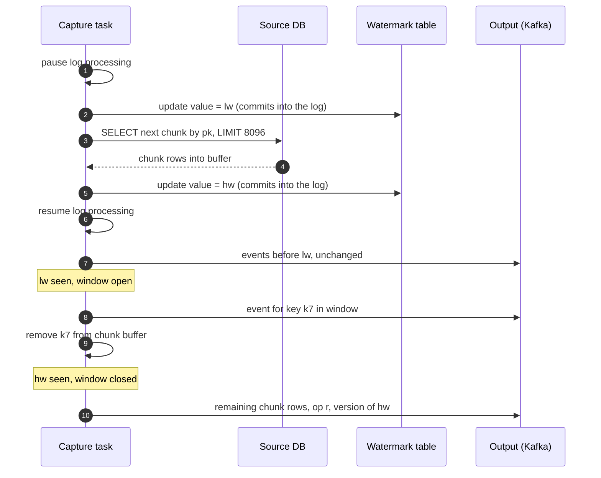
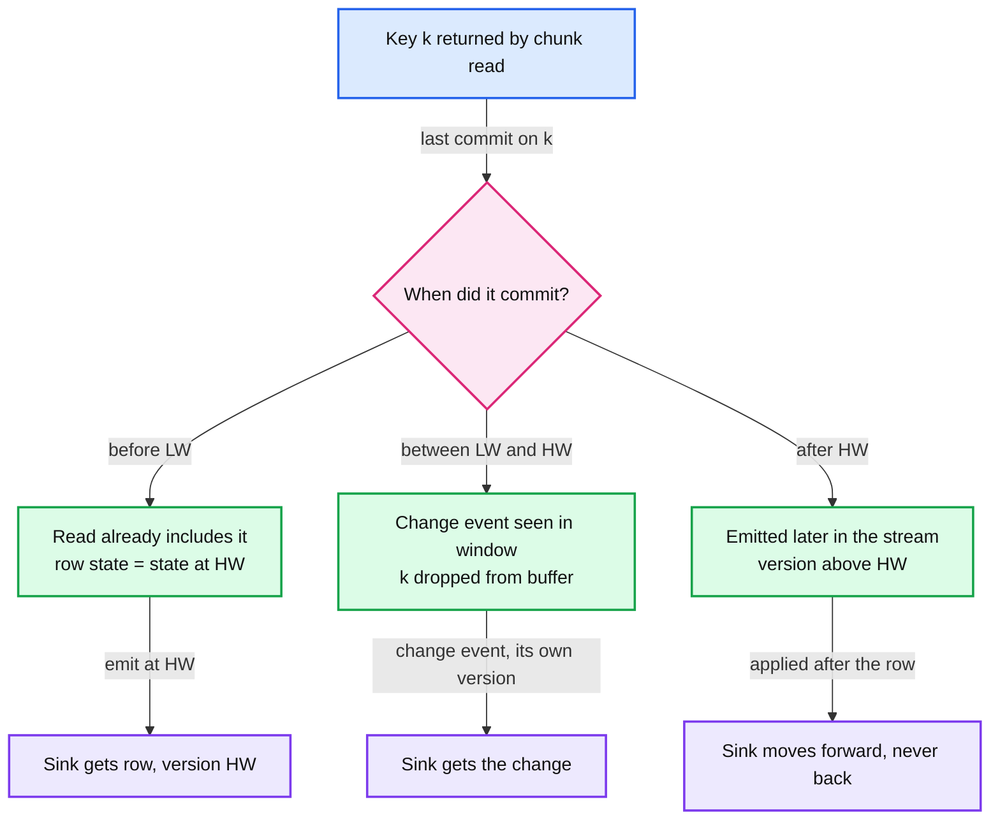
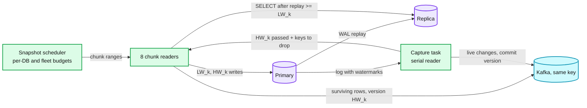
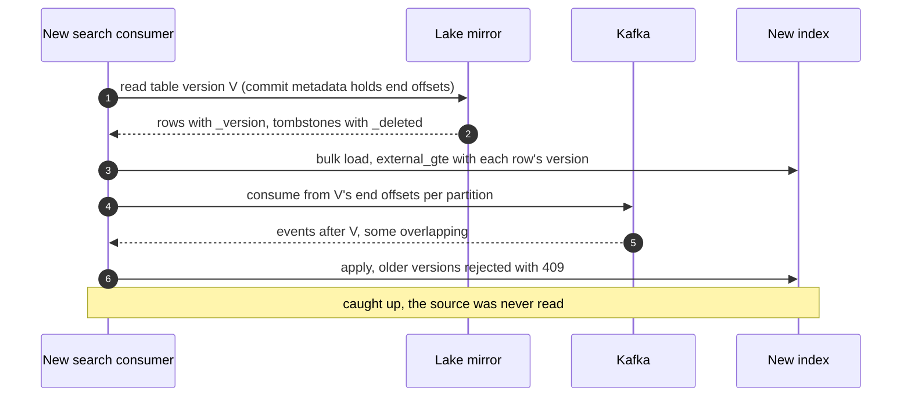

# Deep dive: snapshot and stream handoff

> One-line answer: the log only holds what changed since the slot was created, so existing rows must be read from the tables and merged into the live stream; do it with DBLog watermark chunks (write a low mark into the log, read one primary-key chunk, write a high mark, drop every buffered key that changed between the marks, emit the rest at the high mark with the high mark's version), which takes no lock, holds no long transaction, can pause, resume and repair a key range, and never shows a sink older state than it already had.

Part of [`../solution.md`](../solution.md) §4.2, §5.4, §5.5. Sources: [DBLog paper, Netflix](https://arxiv.org/pdf/2010.12597), [Debezium 3.6 Postgres connector](https://debezium.io/documentation/reference/stable/connectors/postgresql.html), [Flink CDC 3.6 MySQL source](https://nightlies.apache.org/flink/flink-cdc-docs-stable/docs/connectors/flink-sources/mysql-cdc/), [Notion data lake](https://www.notion.com/blog/building-and-scaling-notions-data-lake), [Shopify CDC](https://shopify.engineering/capturing-every-change-shopify-sharded-monolith), [LinkedIn Databus](https://dl.acm.org/doi/10.1145/2391229.2391247). Concepts: [`../../../concepts/stream-processing.md`](../../../concepts/stream-processing.md) §7, [`../../../concepts/exactly-once.md`](../../../concepts/exactly-once.md).

## 1. The problem at the seam

A Postgres slot starts at the position where it was created. A MySQL binlog is purged by age (30 days by default). Neither holds the rows that existed before capture began, so a new table, a repaired key range, or a rebuild after a lost slot needs a read of the table itself. The read and the log are two views of one database taken at different moments. The seam between them is where changes get lost (gap), applied twice out of order (double apply), or where a sink briefly goes back to older state (time travel).

The requirements from the DBLog paper are the ones to name: trigger a full capture at any time, pause and resume it, run it next to log capture without stalling either, and prevent time travel ([DBLog](https://arxiv.org/pdf/2010.12597), §1).

## 2. The four rungs

| Rung | How | Lock on source | Long transaction | Time travel at sink | Pause / resume | Key-range repair | Write access needed |
|---|---|---|---|---|---|---|---|
| Lock and copy | Lock table, read it, record the log position, unlock, stream from there | Yes, for the whole copy. Shopify: "will hold a read lock on the table ... can take hours" | Yes | No | No | No | No |
| Exported snapshot plus parallel COPY | Create the slot with an exported snapshot, COPY every table in parallel inside that snapshot, stream from the slot's start | No | Yes, the snapshot stays open for the whole copy and pins the vacuum horizon | No | No | No | No |
| Position, then replay with upsert | Start capture, note time `t`, bulk export, load, replay the log from `t` over it (Notion: RDS export at `t`, Kafka from `t` into Hudi) | No | No (export runs off-box) | Yes, during the replay | No | No | No |
| DBLog watermark chunks | Per chunk: low mark, read, high mark, drop keys changed in the window, emit rest at the high mark | No | No, one short read per chunk | No | Yes, per chunk | Yes | Yes (signal table), unless a read-only variant |

The third rung is correct because a later write wins in an upsert sink, and every change after `t` is replayed in order. Its cost is visible to readers: a key that the export already has at its newest state is taken back to an older state by an early replayed change, then forward again ([Notion](https://www.notion.com/blog/building-and-scaling-notions-data-lake)). Fine for a lake nobody reads during bootstrap. Not fine for a search index serving users.

## 3. DBLog Algorithm 1, step by step

The paper's watermark is a single-row table in a dedicated namespace holding a UUID. "A watermark is then generated by updating the UUID value of that row", which produces an ordinary change event in the log ([DBLog](https://arxiv.org/pdf/2010.12597), §3.2).

1. Pause log event processing (briefly).
2. Generate `lw` and `hw` UUIDs. Update the watermark table to `lw`.
3. Select the next chunk: primary key greater than the last key of the previous chunk, with a limit. Hold it in memory.
4. Update the watermark table to `hw`. Resume log event processing.
5. Process log events in order. Before `lw` arrives, output each event as usual.
6. Between `lw` and `hw`: output each event, and if the chunk contains that event's key, remove the key from the chunk.
7. When `hw` arrives: append every row left in the chunk to the output, then continue with log events.

The pause in step 1 only needs to cover steps 2 to 4, which are two single-row writes and one indexed `SELECT ... LIMIT`, so it is short. It exists so that the chunk is in memory before the log processor reaches `lw`.

**In our design** the chunk may be read on a replica (§6), which takes longer than a primary read. Pausing the capture task for that long would stall the whole database's stream. So instead of pausing, the capture task records the set of keys inside the chunk's primary-key range that change between `LW_k` and `HW_k`, and subtracts that set from the chunk when the buffer arrives. The set is bounded by the chunk's key range, so it is at most 8,096 keys. Same output, no pause. This is our variant, not the paper's.

## 4. Why it is correct

The paper states two requirements: the log emits changes "from a linear history in commit order", and the chunk read must see every change committed before it executes ("non-stale reads"), which read committed gives for a single-select transaction ([DBLog](https://arxiv.org/pdf/2010.12597), §3.2 and §3.3). With those, take any key `k` that the chunk read returned. The read executed somewhere between `LW_k` and `HW_k`.

- **Committed before `LW_k`.** The read sees it. If nothing touched `k` between the marks, the row's state at the read equals its state at `HW_k`, so emitting it with version `(epoch, position of HW_k, 0)` is exact.
- **Committed between the marks.** The change event appears in the window, is published with its own version, and `k` is dropped from the buffer. The read may or may not have seen that change; it does not matter, because its row is never emitted.
- **The concurrent transaction.** Transaction D writes `k` before `LW_k` but commits after `HW_k`. The read (read committed) does not see D. D's commit is not between the marks, so `k` is not dropped, and the pre-D row is emitted at `HW_k`. Then D's change is emitted after `HW_k` with version `(epoch, D's commit position, i)`, which is higher than `HW_k`. The sink applies it. This case is exactly why the version is the **commit** position, not the change record's own LSN: D's change record sits at an LSN before `LW_k`, and a change-LSN version would lose to the snapshot row ([`../solution.md`](../solution.md) §4.1).
- **Deleted keys.** A row deleted before the read is not returned, and its delete event (older) already went out. A row deleted between the marks is dropped from the buffer and its delete event goes out. Nothing resurrects it.

## 5. What the tools actually do

**Debezium (3.6).** Incremental snapshots are triggered by a signal (a row in the table named by `signal.data.collection`, no default, or a Kafka signal). The chunk size is `incremental.snapshot.chunk.size`, default 1,024 rows. The watermarks are writes to the signal table; `incremental.snapshot.watermarking.strategy` is `insert_insert` by default (one entry to open each window, a second to close it) or `insert_delete` (one entry, removed at close) ([Debezium](https://debezium.io/documentation/reference/stable/connectors/postgresql.html)). `read.only` (default false) controls whether the connector writes watermarks to the signal table at all; the doc has a read-only incremental snapshot section for connectors that support it. Two limits to say out loud:
- The Postgres connector "does not support schema changes while an incremental snapshot is running". Our control plane pauses a table's snapshot on DDL and restarts the current chunk.
- The older **blocking** snapshot (stop streaming, snapshot, resume) warns that a delay between the signal and the stop "might emit some event records that duplicate records captured by the snapshot". Versioned sinks absorb those.

**Flink CDC (3.6).** Same idea, no writes to the source. For each chunk it records the current binlog position as `LOW`, reads and buffers `SELECT * FROM t WHERE id > chunk_low AND id <= chunk_high`, records the position as `HIGH`, reads the binlog records for that chunk between `LOW` and `HIGH`, and **upserts them into the buffered chunk** before emitting it ([Flink CDC](https://nightlies.apache.org/flink/flink-cdc-docs-stable/docs/connectors/flink-sources/mysql-cdc/)). Default `scan.incremental.snapshot.chunk.size` is 8,096. It needs no global read lock. A table without a primary key needs `scan.incremental.snapshot.chunk.key-column`. Chunks are read in parallel by Flink subtasks, and checkpoints give exactly-once on restart.

The difference is small but worth knowing: DBLog drops changed keys and lets the stream deliver the newer state; Flink CDC folds the window's changes into the chunk and emits the chunk's state as of `HIGH`. Either way, the stream that follows must not re-apply a window change as if it were newer, which versions (ours) or the source's split bookkeeping (Flink's) guarantee.

## 6. Reading chunks on a replica

The read can move to a replica if two conditions hold, which keep the correctness argument of §4 intact:
1. **Before the read:** the replica has replayed at least up to `LW_k`. On Postgres, wait until `pg_last_wal_replay_lsn() >= LW_k`. On MySQL, wait until the replica's executed GTID set contains the watermark transaction. That gives "non-stale" relative to `LW_k`.
2. **After the read:** `HW_k` is written on the primary only after the read returns. The replica cannot have replayed past a commit that did not exist yet, so the read's point is below `HW_k`.

So the read lands between the marks, which is all §4 needs. What it buys: the primary serves only the two watermark writes; the chunk scan, its CPU and its buffer cache churn go to a replica. What it costs: waiting for replica lag before each chunk, so the worker pauses when lag exceeds 30 s ([`../solution.md`](../solution.md) §5.1).

## 7. Parallel readers, memory and rate limits

One reader at 20k rows/s needs 4 × 10^9 ÷ 2 × 10^4 = 200,000 s = **55.6 h** for the 4 B-row table. Eight readers, each with its own `LW_k` and `HW_k`, reach 160k rows/s and **6.9 h**. Buffers: 8 × 8,096 rows × 500 B = **~32 MB**.

Where the rows are emitted matters, and the numbers force a choice:
- **Small and medium tables:** rows go out through the capture task at `HW_k`, capped at **20% of the task's throughput** (4k rows/s on a 20k/s task) so live changes keep their p99.
- **The big tables:** 4 B rows at 4k rows/s would take 10^6 s, 11.6 days. So the snapshot workers produce their own surviving rows in parallel, after the capture task reports that `HW_k` passed and hands back the set of keys to drop. The task's work per chunk is then tiny (watermarks and a key set). A worker's row for `k` and a later live change for `k` are now written by two producers and can land in the partition in either order. The version makes that safe: the live change carries a commit position above `HW_k` and wins at every sink whichever arrives first.

Rate limits: a per-database token bucket (default 20k rows/s on the replica), a fleet budget (2 M rows/s) owned by the scheduler, and an automatic pause when replica lag > 30 s or primary CPU > 70%.

## 8. Crash mid-chunk

The chunk cursor (table, last primary key of the last emitted chunk, chunk id) is saved with the connector's offset. After a crash the task resumes from the last committed offset, which may be before `LW_k`. It will see `LW_k` and `HW_k` again in the replayed log, but it no longer holds a buffer for them. Each watermark carries a UUID, and the task acts only on watermarks it registered in this run, so stale ones are ignored. The chunk is then re-read with fresh marks `LW_k'` and `HW_k'`.

If chunk `k` had already been emitted before the crash, it is emitted again at `HW_k'`, a higher version. That is safe: the re-read reflects every change up to `HW_k'`, so a sink moves to the same or a newer state, never back.

## 9. A new consumer bootstraps from the mirror, not the source

LinkedIn's Databus built a bootstrap service so that new and lagging consumers never land on the source database ([Databus](https://dl.acm.org/doi/10.1145/2391229.2391247)). Our lake mirror plays that role.

Conditions: the lake job writes each batch's end offsets into its commit so a table version maps to Kafka offsets (the `txn` idea from [`../../streaming-ingestion/`](../../streaming-ingestion/)). The bootstrap must finish within Kafka retention (7 days) minus the age of `V`. Tombstones travel with the mirror (kept 7 days), otherwise a replayed older insert could resurrect a deleted key.

## 10. Key-range repair and rebuilds

- **Repair.** `snapshot(table, key_range)` runs the same chunks restricted to a range. A key set works too (`WHERE id IN (...)` between marks), because the algorithm reasons per key. Used when a sink's reconciliation finds divergent keys, and after an unplanned MySQL failover for the keys the changelog shows as changed in the last 60 s ([`../solution.md`](../solution.md) §5.2).
- **Rebuild after an epoch bump.** A lost slot or an unsafe failover bumps the epoch and re-snapshots every captured table. Every new-epoch row outranks every old-epoch event, so a phantom or a missed write is corrected when that key's chunk passes. Until then the key keeps its old state: the repair window is bounded by the snapshot's duration (~7 h for the busiest database). When the last chunk is emitted, sinks sweep: rows still below the new epoch were deleted during the blind window (or never existed), because every live row has just been re-emitted.

## Failure modes

| Failure | Effect | Mitigation |
|---|---|---|
| Crash mid-chunk | Buffer lost, stale watermarks in the log | UUID watermarks ignored, cursor in offset, re-read at a higher `HW` |
| Replica lag grows | Worker waits for replay ≥ `LW_k` | Pause at 30 s lag, resume automatically |
| DDL on the table during its snapshot | Buffered rows have the old shape; Debezium's Postgres connector does not support it | Pause the table's snapshot, restart the current chunk after the schema settles |
| Signal-table writes forbidden | No DBLog watermark | Read-only variant where the connector supports it, or Flink CDC style log positions as marks |
| Table without a primary key | No chunk order, no per-key merge | Declare a unique chunk key (Flink CDC `chunk.key-column`), or capture without snapshot and bulk-load once |
| Snapshot floods the stream | Live p99 blown | 20% emission share through the task, worker-side emission for big tables, token buckets |
| Bootstrap slower than Kafka retention | Offsets from `V` are gone | Start from a fresher mirror version, or extend retention for the duration |
| Very wide rows (TOAST) in a chunk | Buffer memory above 32 MB | Chunk size by bytes, not rows, for wide tables (assumption: tune per table) |

## Interview soundbite

"I never lock and I never hold a snapshot open. Each chunk is bracketed by a low and a high watermark written into the log, read on a replica that has replayed past the low mark, and any key that changes between the marks is dropped because the log already carries a newer state. The survivors go out at the high mark with the high mark's commit position as their version, so a transaction that started before the chunk and committed after it still wins. It pauses, resumes, repairs a key range, and a new consumer bootstraps from the lake mirror plus Kafka offsets instead of hitting the database again."
