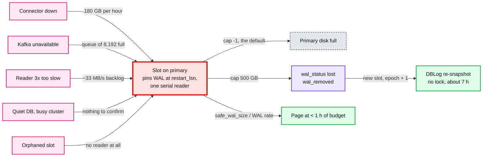
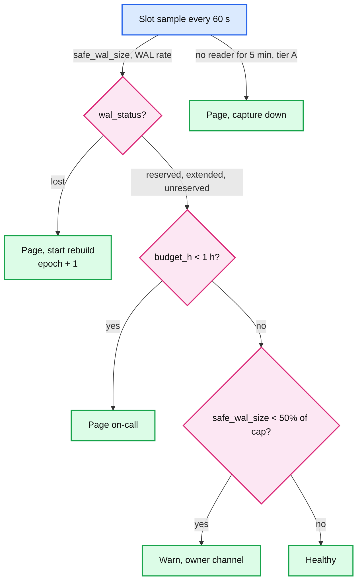
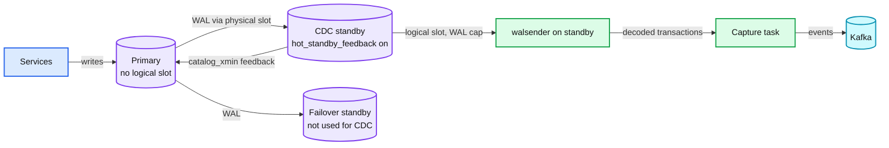

# Deep dive: source safety and the slot budget

> One-line answer: a logical replication slot is a promise from the production primary to keep every byte of WAL the reader has not confirmed, so every way the reader falls behind (down, blocked on Kafka, too slow, idle, orphaned) becomes disk on the primary; the design caps the slot with `max_slot_wal_keep_size`, converts the cap into hours of budget at the current WAL rate, pages before the budget runs out, and when it does run out lets Postgres invalidate the slot and rebuilds CDC with a lock-free snapshot, because a lost slot is a background job and a full primary disk is an outage.

Part of [`../solution.md`](../solution.md) §5.1 (the red node), with pieces of §5.3 and §5.4. Sources: [Postgres replication settings](https://www.postgresql.org/docs/current/runtime-config-replication.html), [pg_replication_slots](https://www.postgresql.org/docs/current/view-pg-replication-slots.html), [logical decoding concepts](https://www.postgresql.org/docs/current/logicaldecoding-explanation.html), [Postgres resource settings](https://www.postgresql.org/docs/current/runtime-config-resource.html), [pg_stat_replication_slots](https://www.postgresql.org/docs/current/monitoring-stats.html), [Debezium 3.6 Postgres connector](https://debezium.io/documentation/reference/stable/connectors/postgresql.html), [MySQL 8.4 binary log options](https://dev.mysql.com/doc/refman/8.4/en/replication-options-binary-log.html). Concepts: [`../../../concepts/replication-and-quorums.md`](../../../concepts/replication-and-quorums.md), [`../../../concepts/leases-fencing-clocks.md`](../../../concepts/leases-fencing-clocks.md), [`../../../concepts/exactly-once.md`](../../../concepts/exactly-once.md).

## 1. What the slot promises

A slot is three positions and a horizon, stored on the primary and persisted at checkpoints:

| Field | What it means | What it holds back |
|---|---|---|
| `confirmed_flush_lsn` | "The address (LSN) up to which the logical slot's consumer has confirmed receiving data" | Nothing by itself. It is what the reader said |
| `restart_lsn` | "The address (LSN) of oldest WAL which still might be required by the consumer of this slot and thus won't be automatically removed during checkpoints unless this LSN gets behind more than `max_slot_wal_keep_size`" | **WAL on disk.** Trails `confirmed_flush_lsn` because an in-progress transaction may have started earlier |
| `catalog_xmin` | "The oldest transaction affecting the system catalogs that this slot needs the database to retain. VACUUM cannot remove catalog tuples deleted by any later transaction" | **Catalog vacuum.** Decoding an old change needs the catalog as of that change |

Quotes from [pg_replication_slots](https://www.postgresql.org/docs/current/view-pg-replication-slots.html). The default is the dangerous one: "If `max_slot_wal_keep_size` is -1 (the default), replication slots may retain an unlimited amount of WAL files" ([settings](https://www.postgresql.org/docs/current/runtime-config-replication.html)).

With a cap set, the slot moves through four documented `wal_status` values, and `safe_wal_size` tells you how many more bytes of WAL can be written before it is lost ("NULL for lost slots, as well as if `max_slot_wal_keep_size` is -1").

```mermaid
%% wal_status lifecycle of one slot, as documented in pg_replication_slots. Unreserved can still recover. Lost cannot; the only way out is a new slot and a rebuild.
stateDiagram-v2
    direction LR
    [*] --> reserved: slot created
    reserved --> extended: past max_wal_size
    extended --> reserved: reader catches up
    extended --> unreserved: past the cap
    unreserved --> extended: caught up in time
    unreserved --> reserved: caught up in time
    unreserved --> lost: checkpoint removes WAL
    lost --> [*]: drop, new slot, epoch + 1

    classDef service fill:#dcfce7,stroke:#16a34a,stroke-width:2px,color:#111
    classDef cache fill:#fef3c7,stroke:#d97706,stroke-width:2px,color:#111
    classDef decision fill:#fce7f3,stroke:#db2777,stroke-width:2px,color:#111
    classDef external fill:#e5e7eb,stroke:#6b7280,stroke-width:2px,color:#111,stroke-dasharray:4 3
    class reserved service
    class extended cache
    class unreserved decision
    class lost external
```

- `reserved`: "the claimed files are within `max_wal_size`".
- `extended`: "`max_wal_size` is exceeded but the files are still retained, either by the replication slot or by `wal_keep_size`".
- `unreserved`: "the slot no longer retains the required WAL files and some of them are to be removed at the next checkpoint. This typically occurs when `max_slot_wal_keep_size` is set to a non-negative value. This state can return to `reserved` or `extended`".
- `lost`: "this slot is no longer usable". `invalidation_reason` then says why: `wal_removed`, `rows_removed` (logical only), `wal_level_insufficient`, or `idle_timeout` (Postgres 18).

## 2. Every way WAL gets pinned

Numbers from [`../solution.md`](../solution.md) §2: the busy primary writes **50 MB/s** of WAL at peak (about a third of that on average), a median database **1 MB/s**.

| Cause | Mechanism | Growth on the busy primary |
|---|---|---|
| Connector down | Nobody reads, nobody confirms | 50 MB/s × 3,600 s = **180 GB per hour** |
| Kafka unavailable to the connector | Producer retries, Debezium's blocking queue (`max.queue.size`, 8,192 records) fills, the log-reading thread stops | Same 180 GB/h |
| Reader slower than the database | 60k changes/s against ~20k/s per task. If WAL tracks changes, the reader keeps up with a third of it | ~33 MB/s at peak, 500 GB cap gone in ~4.2 h of peak (approximation) |
| Quiet database on a busy cluster | WAL is per cluster, slots are per database. No captured change means nothing to confirm ([Debezium](https://debezium.io/documentation/reference/stable/connectors/postgresql.html), "WAL disk space consumption") | Whatever the neighbours write, forever |
| Orphaned slot | Pipeline decommissioned, slot left behind | Everything, forever |
| Stuck `catalog_xmin` | Any of the above | Catalog bloat rather than WAL |

The headroom on a 4 TB WAL volume with 40% free is 1.6 TB: at 180 GB/h it is gone in ~9 h. That is the outage the cap exists to prevent.

Not on the list: a slow sink. Kafka sits between the capture task and every sink, so a search cluster down for a day grows consumer lag in Kafka and nothing on the primary.

## 3. Sizing the cap

`max_slot_wal_keep_size` is one value for the whole cluster ("can only be set in the `postgresql.conf` file or on the server command line"), and it applies to every slot on it, physical standby slots included. A standby that is down longer than the budget loses its slot too and has to be re-cloned. Size it with the database team, not around them.

The method:
1. **Headroom.** Free space on the WAL volume on the worst normal day: 1.6 TB on the busy primary.
2. **Cap.** About 30% of headroom, leaving room for normal WAL (`max_wal_size`), growth, and a second slot during a rebuild: **500 GB**. Median databases: **50 GB**.
3. **Budget.** `cap ÷ WAL rate`. Busy primary: 500,000 MB ÷ 50 MB/s = 10,000 s = **2.8 h at peak**, ~**8.3 h** at the average rate. Median: 50,000 MB ÷ 1 MB/s = 50,000 s = **~14 h**.
4. **Check against recovery.** The connector recovery SLO is 15 min. The smallest budget in the fleet must be several times that (2.8 h is 11x). If a database fails the check, grow its disk; do not shrink the SLO.

## 4. Alarm in hours, not bytes

"The slot holds 212 GB" means 1 hour on the busy primary and 2.5 days on a median one. Nobody can page on it. The alarm is:

`budget_h = safe_wal_size ÷ WAL rate ÷ 3,600`, where WAL rate is the change in `pg_current_wal_lsn()` over the last 5 minutes.

On the busy primary with the connector down at peak, this warns at 1.4 h (half the 2.8 h budget used), pages at 1.8 h (1 h left), and the slot is lost at 2.8 h, which is §6 Flow 5 of the solution.

## 5. Quiet databases, orphans and the catalog horizon

- **Heartbeats.** `heartbeat.interval.ms` defaults to 0 (off). Set it to 10,000 everywhere, and on databases whose captured tables can go quiet, set `heartbeat.action.query` to an insert into a heartbeat table. Debezium's doc names the case exactly: "capturing changes from a low-traffic database on the same host as a high-traffic database prevents Debezium from processing WAL records and thus acknowledging WAL positions". The insert creates a change in that database, the connector confirms its LSN, the slot moves.
- **Orphans.** The control plane lists `pg_replication_slots` on every cluster every 10 min and reconciles against the pipeline registry. An unknown slot pages and is dropped after 24 h. On Postgres 18, `idle_replication_slot_timeout` (default 0, off) is set to 3 days as a last resort: it "invalidate[s] replication slots that have remained inactive ... for longer than this duration", checked at checkpoint using `inactive_since`, and does not apply to synced standby slots. It is a sweeper, not the main control: the WAL cap fires much sooner on any busy database.
- **Catalog horizon.** A stuck slot also holds `catalog_xmin`, so system catalog tables bloat. The same cap-and-rebuild handles it: an invalidated slot releases its horizon.

## 6. Snapshot load on the source

The snapshot is the other way CDC can hurt a primary. Controls from [`../solution.md`](../solution.md) §5.1 and §5.4:
- Chunk reads go to a **replica**, after checking its replay position has passed the chunk's low watermark. Only the two watermark writes per chunk touch the primary: at 20k rows/s and 8,096-row chunks that is ~2.5 chunks/s, ~5 tiny commits/s.
- A **token bucket per database**, 20k rows/s by default, plus a fleet-wide 2 M rows/s budget in the snapshot scheduler.
- **Automatic pause** when replica lag > 30 s or primary CPU > 70%.
- **No exported snapshots held for hours** on busy databases. A snapshot held open pins the vacuum horizon for every table in the database, which is a slower version of the same problem as the slot.

## 7. Decoding on a CDC standby (top 20 databases)

Postgres 16+ can create a logical slot on a hot standby. The walsender's CPU and the slot's WAL retention move to a dedicated CDC standby: if its disk fills, a standby dies, not the primary.

The costs, all from [logical decoding concepts](https://www.postgresql.org/docs/current/logicaldecoding-explanation.html):
- `hot_standby_feedback` "should be set on the standby" so the primary keeps catalog rows the standby's slot needs; "if any required rows get removed, the slot gets invalidated". A physical slot between primary and standby is "highly recommended", because feedback alone only works while the connection is alive. So a stuck standby slot can still bloat the primary's catalogs.
- Creating the slot needs "information about all the currently running transactions", obtained from the primary, so "slot creation may need to wait for some activity to happen on the primary" (`pg_log_standby_snapshot()` on the primary speeds it up).
- Lowering `wal_level` on the primary below `logical` invalidates standby slots.
- **Not failover-safe.** Slots synced from the primary "can neither be used for logical decoding nor dropped manually" on a hot standby, so a standby slot cannot also be a failover slot. Losing the CDC standby means a new slot and a rebuild (epoch + 1, re-snapshot). That is the trade: primary protection for the top 20 databases, bought with a rebuild on a rarer failure and ~20 extra standbys (the largest line in the cost estimate).

Set `max_slot_wal_keep_size` on the CDC standby too; the budget logic is identical.

## 8. Large transactions, spill and decode CPU

- **Spill.** `logical_decoding_work_mem` "defaults to 64 megabytes"; above it decoded changes "are written to local disk", on the machine doing the decoding. "Since each replication connection only uses a single buffer of this size ... it's safe to set this value significantly higher than `work_mem`". The top 20 databases run 512 MB. `pg_stat_replication_slots` shows `spill_txns` and `spill_bytes` per slot; the platform warns when `spill_bytes` keeps rising for 10 min. A 10 M-row transaction at ~500 B per change is ~5 GB decoded, almost all of it spilled at 64 MB (approximation: decoded size is not event size).
- **Head-of-line.** The same transaction is emitted as one burst into one serial stream: 10 M ÷ 20k/s = 500 s of lag for every table on that database. The slot does not move until it is through, so a large transaction also spends budget.
- **Decode CPU.** One walsender per slot, roughly a core at high rates. Splitting a database into N slots makes N walsenders each decode the whole WAL of the database, because the reorder buffer assembles every transaction before the publication filter drops tables. Extra slots are paid on the source, which is why decoding on a standby (§7) comes before splitting.

## 9. MySQL is the mirror image

The binlog is purged by age, not by readers: `binlog_expire_logs_seconds` defaults to 2,592,000 (30 days) in MySQL 8.4 ([MySQL](https://dev.mysql.com/doc/refman/8.4/en/replication-options-binary-log.html)). A CDC client cannot make a MySQL primary keep one extra byte.

| | Postgres slot | MySQL binlog |
|---|---|---|
| Who decides retention | The slowest slot, up to the cap | The clock |
| CDC outage can fill the primary's disk | Yes, without a cap | No |
| CDC outage can lose the position | Only past the cap (by choice) | Past the retention (always) |
| Budget | `safe_wal_size ÷ WAL rate` | `retention - (now - time of connector position)` |
| On expiry | Slot `lost`, rebuild | Position purged, rebuild |

Same alarm shape, same rebuild, opposite risk.

## 10. Push back: "never cap the slot"

Most setups leave the cap at -1 because "losing the slot means a full re-snapshot". That was right when a snapshot meant a table lock held for hours. With watermark chunks read from a replica under a token bucket, a rebuild is a rate-limited background job that sinks tolerate key by key. An uncapped slot means the primary goes read-only because a Connect worker was OOM-killed on a Saturday. The copy has to be the thing that breaks. Say this, then say the cap is sized so the 15 min recovery SLO never gets close to it.

## 11. Dashboard and alerts

| Signal | Source | Warn | Page |
|---|---|---|---|
| Slot budget hours, sorted ascending | `safe_wal_size`, WAL rate | `safe_wal_size` < 50% of cap | < 1 h |
| `wal_status` | `pg_replication_slots` | `extended` for 30 min | `lost` |
| Slot active | `active`, `inactive_since` | inactive 1 min | inactive 5 min on tier A |
| Unknown slots | Reconciler vs registry | found | not dropped after 24 h |
| Spill | `spill_bytes` in `pg_stat_replication_slots` | rising 10 min | none |
| Capture throughput vs WAL rate | Connector metrics, LSN delta | < 1.2x for 30 min | < 1x for 30 min at peak |
| Snapshot pressure | Replica lag, primary CPU | lag > 30 s, CPU > 70% (auto-pause) | none |
| Kafka reachable from Connect | Producer errors | 1 min | 5 min |
| MySQL budget | Retention minus connector position age | < 50% | < 1 day |

## Failure modes

| Failure | Effect on the source | Mitigation | Residual risk |
|---|---|---|---|
| Connect cluster down 3 h on the busy primary | 540 GB would be pinned | Cap at 500 GB, page at 1 h left, slot lost at 2.8 h, rebuild | ~7 h of rebuild load on a replica |
| Kafka down for the whole fleet | Every slot burns at once | Page at 5 min, 3-AZ Kafka | Smallest budget sets the deadline |
| Idle captured database | Neighbours' WAL pinned | `heartbeat.action.query` | Heartbeat table needs write access |
| Orphaned slot | Unbounded WAL | Reconciler, `idle_replication_slot_timeout` 3 days | 24 h window |
| 10 M-row transaction | Spill to disk, 500 s head-of-line | 512 MB decode memory, batch backfills at source | Budget spent during the burst |
| CDC standby dies | None on the primary | New slot, epoch + 1, rebuild | Rebuild load |
| Cap too small for a physical standby | Standby loses its slot too | Size the cap with the DBA team | Re-clone of the standby |
| Snapshot on a busy primary | CPU and IO competition | Replica reads, token bucket, auto-pause | Watermark writes still on primary |

## Interview soundbite

"The slot is a promise from the production primary to keep WAL until my reader confirms it, and every way my reader falls behind turns into disk on that primary: 180 GB an hour on the busiest one. So I cap it at 500 GB, which is 2.8 hours at peak, alarm in hours of budget rather than bytes, and size my 15-minute recovery SLO well inside it. If the budget runs out anyway, Postgres invalidates the slot, I bump the epoch and rebuild with a lock-free chunked snapshot from a replica. A rebuild is a background job. A full primary disk is an outage. The copy is the thing that breaks."
