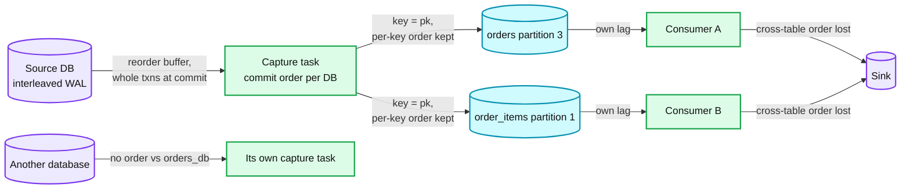
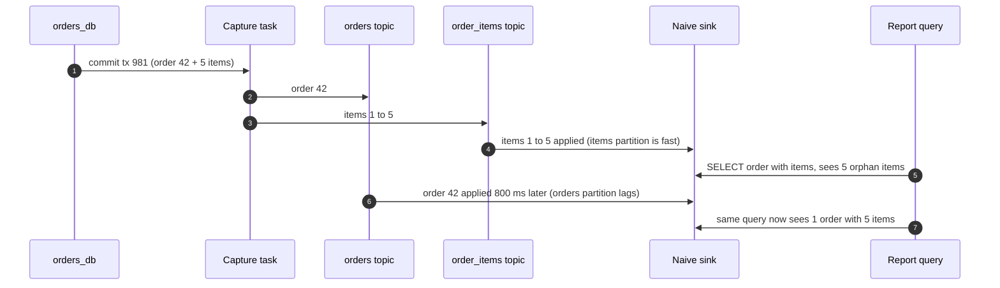
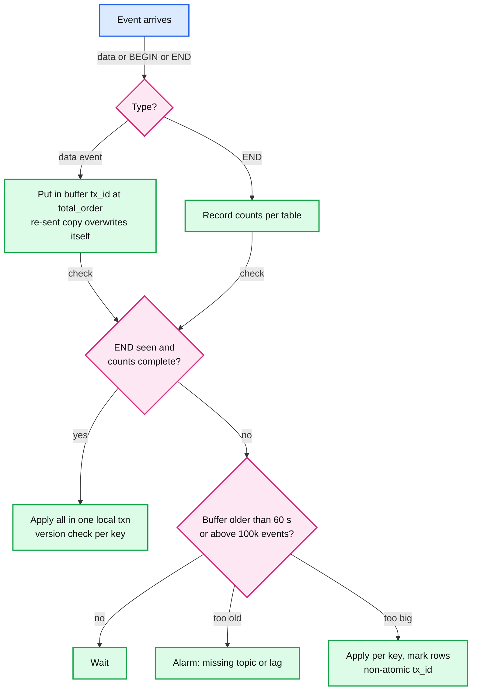
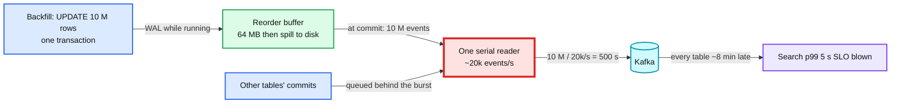

# Deep dive: Transactions and ordering

> One-line answer: the database hands us whole transactions in commit order, one serial stream per database, and the pipeline keeps only per-key order from there (partition by primary key), so the default promise is "a key never goes backwards, keys and tables converge eventually"; the few sinks that must never show half a transaction consume Debezium's transaction metadata and buffer by transaction id until the END event and every counted event have arrived; services that need a whole business fact get an outbox row instead of reassembling row changes; and a 10 M-row transaction is a source-side contract, because it spills on the primary and then stalls every table of that database behind one serial reader.

Part of [`../solution.md`](../solution.md) §5.3. Sources: [Postgres logical decoding](https://www.postgresql.org/docs/current/logicaldecoding-explanation.html), [pgoutput protocol versions](https://www.postgresql.org/docs/current/protocol-logical-replication.html), [pg_stat_replication_slots](https://www.postgresql.org/docs/current/monitoring-stats.html), [logical_decoding_work_mem](https://www.postgresql.org/docs/current/runtime-config-resource.html), [Debezium 3.6 Postgres connector, transaction metadata](https://debezium.io/documentation/reference/stable/connectors/postgresql.html), [Debezium outbox pattern](https://debezium.io/blog/2019/02/19/reliable-microservices-data-exchange-with-the-outbox-pattern/), [Outbox event router](https://debezium.io/documentation/reference/stable/transformations/outbox-event-router.html), [Materialize consistency](https://materialize.com/blog/strong-consistency-in-materialize/), [Databricks AUTO CDC](https://docs.databricks.com/aws/en/ldp/cdc), [Hello Interview CDC](https://www.hellointerview.com/learn/system-design/deep-dives/change-data-capture). Concepts: [`../../../concepts/exactly-once.md`](../../../concepts/exactly-once.md), [`../../../concepts/distributed-transactions.md`](../../../concepts/distributed-transactions.md), [`../../../concepts/stream-processing.md`](../../../concepts/stream-processing.md).

## 1. What order the database gives us

**Postgres.** Concurrent transactions write their WAL records interleaved. For each slot, the walsender feeds WAL into a **reorder buffer** that assembles each transaction's changes separately, and at commit it passes the whole transaction to the output plugin (`pgoutput`): `Begin`, `Relation` messages, row changes, `Commit`. Aborted transactions are thrown away. So the stream is **whole transactions, in commit order, committed data only**, per database ([Postgres](https://www.postgresql.org/docs/current/logicaldecoding-explanation.html)).

**MySQL.** With `binlog_format = ROW`, each transaction is written to the binlog at commit as one contiguous event group: `GTID`, `Query(BEGIN)`, `Table_map` plus `Write_rows` / `Update_rows` / `Delete_rows` per table, `Xid`. Same shape: whole transactions, commit order, per server.

**What the order does not cover.** Nothing orders two databases against each other. A service that writes to `orders_db` and then to `billing_db` produces two streams with no relation between them. Say this before anyone asks for "global order".

## 2. What each hop keeps and loses

| Hop | Order kept | Order lost |
|---|---|---|
| WAL or binlog to capture task | Commit order per database, whole transactions | Nothing inside one database |
| Capture task to Kafka | Per key (partition by primary key) | Across keys, across tables, across transactions |
| Grouped per-database topic (quiet tables, key = table + pk) | Per key | Across keys. Two tables that hash to one partition happen to be in commit order; do not rely on it, a repartition breaks it |
| Kafka to consumers | Per partition within one consumer | Across partitions (each has its own lag) |
| Across databases | Nothing | Everything |

## 3. The torn transaction, worked

`BEGIN; INSERT INTO orders (id=42); INSERT INTO order_items x5; COMMIT;` commits as one unit. The capture task emits six events in that order, but they land on two topics.

Per key nothing went wrong: every row is correct and never went backwards. Across keys the sink showed a state the database never had. For search, cache and the lake mirror that is acceptable (each serves per-row reads). For a relational replica that runs joins, or a materialized view that sums order totals, it is not.

**The default promise, said out loud:** per-key order and exactly-once effect per key; across keys and tables, eventual consistency with a lag of seconds (search, cache) or minutes (lake). Atomicity is opt-in and paid for by the sink that wants it.

## 4. Transaction metadata and the buffering sink

With `provide.transaction.metadata = true` (default `false`), Debezium publishes a `BEGIN` and an `END` event per transaction to a per-database transaction topic. `END` carries `event_count` (total) and `data_collections` (the event count per table). Every data event also gets a `transaction` block: `id`, `total_order` (position of the event among all events of the transaction) and `data_collection_order` (position among the events of its table) ([Debezium](https://debezium.io/documentation/reference/stable/connectors/postgresql.html)).

**The buffering algorithm** (for a sink with `add_sink(..., atomic = true)`):
1. Consume the transaction topic plus every data topic of the tables involved, in one consumer.
2. For each data event, put it in `buffer[tx_id]` keyed by `total_order`. A re-sent event with the same `(tx_id, total_order)` overwrites itself: the buffer is idempotent.
3. On `END`, record the expected counts per table.
4. When `buffer[tx_id]` holds exactly the counted events for every table in `data_collections`, apply all of them in **one local transaction** of the sink (still with the per-key version check of §4.3), then drop the buffer.
5. Apply transactions in the order their `END` events appear on the transaction topic, which is commit order for that database.

The 60 s and 100k-event thresholds are this design's choices, not defaults of any tool.

**Costs of atomicity.**
- **Latency of the slowest topic.** A transaction is visible only when its laggiest topic has caught up. The torn example above becomes an 800 ms delay for the whole transaction instead of a torn read.
- **Memory bounded by the largest transaction.** A 10 M-row transaction at 500 B per event is 5 GB in one buffer. Hence the size fallback, and hence the source-side batch limit in §7.
- **Co-consumption.** The sink must read every topic the transaction touched. That couples it to tables it may not otherwise care about.
- **Crash and resume.** After a capture task crash, events from the last committed offset are re-sent, including part of a transaction the sink already buffered, plus its `BEGIN` and `END` again. The buffer is keyed by `(tx_id, total_order)`, so the re-sent half overwrites itself and the transaction completes normally. A sink crash loses the buffer; the sink rewinds its consumer to the offsets of its oldest unapplied `BEGIN` and rebuilds.

**Materialize** takes the same idea into the engine: every update from one source transaction gets the same timestamp, so no query can see part of it ([Materialize](https://materialize.com/blog/strong-consistency-in-materialize/)).

## 5. The lake: per-table atomic, cross-table by watermark

A lake mirror commit is atomic per table per batch; a batch of `orders` and a batch of `order_items` are two commits. Cross-table atomicity in the lake is not offered. What is offered:
- Every mirror and changelog row carries `_tx_id` and `_commit_ts`.
- The lake job publishes a per-database watermark: "every captured table of `orders_db` is applied through commit timestamp T". An idle table does not hold it back because the capture task's 10 s heartbeats advance the position every table has been read through.
- A reader that needs a consistent cross-table view reads the history tables as of T. With `AUTO CDC ... STORED AS SCD TYPE 2`, every row version has `__START_AT` and `__END_AT` ([Databricks](https://docs.databricks.com/aws/en/ldp/cdc)), so "as of T" is `__START_AT <= T AND (__END_AT > T OR __END_AT IS NULL)` on every table.

## 6. Why not one partition per database

Putting every table of a database in one partition would keep commit order all the way to the consumer. For the largest database that is 60k changes/s × 500 B = 30 MB/s into one partition, three times the ~10 MB/s comfortable per-partition figure in [`../solution.md`](../solution.md) §10.3, and exactly one consumer thread per consumer group for that database, forever. Every sink of that database would be capped by a single thread's apply rate. Transaction metadata buys atomicity for the few sinks that need it and leaves ~6 partitions of parallelism per busy table for everyone else.

## 7. Parent and child: foreign keys at the consumer

The database guarantees the parent row exists when the child commits. The consumer does not see that guarantee, because parent and child travel on different topics. Three options:
1. **Buffer by transaction** (§4). Exact, costs latency and memory.
2. **Tolerate and retry.** Apply the child with a nullable or deferred reference, or park it and retry until the parent shows up (bounded by the parent topic's lag). Fine for search and the lake, where orphans are temporary.
3. **Outbox.** Stop reassembling rows (§8).

## 8. The outbox: when the consumer needs the business fact

Hello Interview's line is the test: "CDC works best when consumers just need a copy of your data. But it can start to fall apart when they need to know why that data changed" ([Hello Interview](https://www.hellointerview.com/learn/system-design/deep-dives/change-data-capture)). An order with its items, "payment captured", "user deleted their account" are facts with intent. The owning service writes them explicitly:

```mermaid
%% Outbox: the business event is one row written in the same transaction as the state change. CDC captures the outbox table like any other, and the event router turns rows into domain events. Consumers dedup by event id.
flowchart LR
    SVC[Order service] -->|"BEGIN, INSERT orders,<br/>INSERT items, INSERT outbox, COMMIT"| DB[(orders_db<br/>orders, items, outbox)]
    DB -->|"commit-order log"| CT[Capture task]
    CT -->|"outbox row change"| ER[Outbox event router<br/>topic by aggregate type]
    ER -->|"OrderPlaced with items,<br/>key = aggregate id"| K[(Kafka domain topic)]
    K -->|"at-least-once"| C[Consumer service]
    C -->|"inbox: skip seen event id"| CDB[(Consumer DB)]

    class SVC client
    class CT,ER,C service
    class K queue
    class DB,CDB store

    classDef client   fill:#dbeafe,stroke:#2563eb,stroke-width:2px,color:#111
    classDef service  fill:#dcfce7,stroke:#16a34a,stroke-width:2px,color:#111
    classDef store    fill:#ede9fe,stroke:#7c3aed,stroke-width:2px,color:#111
    classDef queue    fill:#cffafe,stroke:#0891b2,stroke-width:2px,color:#111
```

- The outbox row commits in the same transaction as the state change, so it exists if and only if the change does. No dual write ([Debezium outbox](https://debezium.io/blog/2019/02/19/reliable-microservices-data-exchange-with-the-outbox-pattern/)).
- The payload is designed by the owner: a whole order with its items, a versioned schema, no internal column names. Atomicity is inside one message, so no sink buffering is needed.
- Debezium's [outbox event router](https://debezium.io/documentation/reference/stable/transformations/outbox-event-router.html) routes each outbox row to a topic by aggregate type, keyed by aggregate id (per-aggregate order).
- Delivery is still at-least-once, so consumers keep an inbox keyed by event id ([`../../../concepts/exactly-once.md`](../../../concepts/exactly-once.md)).
- The outbox rows can be deleted right after insert: the log already has them.

## 9. Large transactions: one backfill stalls the whole database

Postgres decodes at commit, so a transaction's changes wait in the reorder buffer until it commits. Above `logical_decoding_work_mem` (64 MB by default, one buffer per walsender) the decoded changes **spill to disk on the source** ([Postgres](https://www.postgresql.org/docs/current/runtime-config-resource.html)). `pg_stat_replication_slots` counts it: `spill_txns` (both top-level transactions and subtransactions are counted), `spill_bytes`, `total_bytes` ([Postgres](https://www.postgresql.org/docs/current/monitoring-stats.html)). Savepoints are decoded as part of their top-level transaction.

The arithmetic: 10 M events ÷ 20k/s = **500 s, about 8 minutes** during which every table of that database is late, not just the backfilled one. Plus disk I/O on the primary for the spill.

**What the platform does.**
- **Batch limit at the source.** Migration and backfill tooling commits at most 10k rows per transaction. 10k events at 20k/s is 0.5 s of head-of-line delay, inside the search budget.
- **Alarm on spill.** `spill_bytes` rising for 10 min on any slot is a warning with the database owner cc'd.
- **More decode memory on the top databases.** `logical_decoding_work_mem = 512 MB` on the top 20. It is one buffer per walsender and there is one walsender per database, so the cost is bounded.
- **Not streaming in-progress transactions.** pgoutput protocol version 2 (Postgres 14+) can stream large in-progress transactions before commit, so the source stops spilling ([Postgres](https://www.postgresql.org/docs/current/protocol-logical-replication.html)). The platform does not turn it on: the connector would then receive changes of transactions that later abort, and would have to buffer them itself until commit or discard them. "Only committed data leaves the database" is the property every sink relies on; moving the buffer from the source to the connector does not remove it.
- **Two-phase commit** (protocol version 3, Postgres 15+, decode at `PREPARE`) is below the line for the same reason.

## 10. When one database is split into several slots

§5.4 of the solution allows splitting a hot database into 2 to 4 slots with disjoint publications. Each slot decodes the whole WAL and emits only its publication's tables, so a transaction that writes tables in two publications is **split across two streams**, with two independent positions and, with transaction metadata on, two `END` events that each count only their own tables. An atomic sink would have to know in advance which streams a transaction touched, which neither stream tells it. Rule: tables written in the same transaction go in the same publication. If that is impossible, atomicity for those tables is off the table and the sink is told so.

## Failure modes

| Failure | Effect | Mitigation |
|---|---|---|
| Consumer of two topics with different lag | Torn read: items without their order for up to the lag | Accept (search, cache, lake), buffer by `tx_id` (atomic sinks), or outbox |
| `END` never arrives at an atomic sink | Buffer waits forever | 60 s age alarm; usually the transaction topic is not being consumed or is lagging |
| Capture task crash mid-transaction | Part of a transaction re-sent with its `BEGIN` and `END` | Buffer keyed by `(tx_id, total_order)`, re-sent events overwrite themselves |
| 10 M-row transaction | Spill on the primary, ~500 s lag for every table of the database, 5 GB buffer at atomic sinks | 10k-row batch limit, spill alarm, 512 MB decode memory, size fallback at the sink |
| Hot database split into slots | Transactions across publications split across streams | Keep co-written tables in one publication |
| Child applied before parent | Foreign key missing at the sink | Deferred reference or retry, or buffer by transaction |
| Consumer assumes order across databases | Causal violations (billing before order) | There is no such order. Carry a business id and reconcile, or use an outbox in one database |
| Grouped topic repartitioned | Coincidental cross-table order changes | Only per-key order was ever promised |

## Interview soundbite

"The database gives me whole transactions in commit order, per database, and I keep exactly one thing from that: per-key order, by partitioning on the primary key, with a version so no key ever goes backwards. Across keys and tables it is eventual, and I say so. A sink that must not show half a transaction reads Debezium's transaction metadata and buffers by transaction id until the END event and every counted event are there, then applies them in one local transaction, and it pays for that in latency and memory. A service that wants 'an order with its items' gets an outbox row, not a join over row changes. And a 10 M-row update is a contract with the database owner, because decoding happens at commit, it spills on the primary, and then one serial reader spends eight minutes on it while every other table of that database waits."
