# Diagrams: Change data capture (CDC) pipeline

The D1 to D12 set from `hld/CLAUDE.md` §4. A diagram is drawn once: the ones embedded in [`solution.md`](solution.md) are linked here, not repeated.

| # | Diagram | Where |
|---|---|---|
| D1 | Context | below |
| D2 | Data flow | below |
| D3 | Component architecture (final design) | `solution.md` §6 |
| D4 | Happy path per FR | FR1 capture: `solution.md` §4.1 step diagram and §6 Flow 1. FR2 snapshot: §4.2 and §6 Flow 2. FR3 delivery: §4.3 and §6 Flow 1. FR4 schema: §4.4 and §6 Flow 6. Postgres logical decoding internals: §10.1 |
| D5 | Failure paths | Connector crash, duplicates: `solution.md` §6 Flow 3. Postgres failover with failover slot: §6 Flow 4. Slot budget exhausted: §6 Flow 5. MySQL failover: §10.4. Half a transaction at an atomic sink: §5.3. Kafka unavailable to Connect: below. Late insert after delete at the search sink: below |
| D6 | Decision flow | Failure triage and epoch bump: `solution.md` §5.2. Scaling a database past one reader: §5.4. Watermark window inside the capture task: below. Sink apply rule: below |
| D7 | Entity relationship | `solution.md` §3.3 |
| D8 | State machine | Captured table lifecycle: below. Snapshot chunk lifecycle: below. Replication slot lifecycle: below |
| D9 | Deployment / topology | below |
| D10 | Scaling / partitioning | Options for a database past its reader: `solution.md` §5.4. Topic grouping: below |
| D11 | Failure mode map | below. The WAL causes and the cap: `solution.md` §5.1 |
| D12 | Rollout / migration | below |

---

## D1. Context (zoom-out)

Our system is the capture tasks, the snapshot workers, Kafka and the sink framework. Databases, their owners, and every consumer sit outside it.

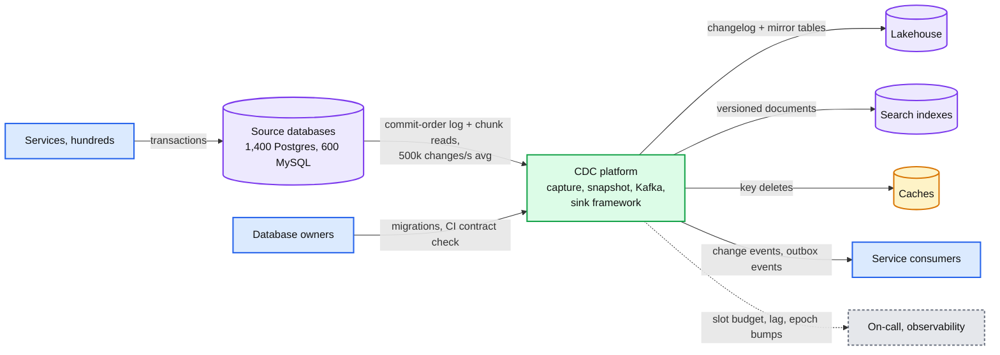

## D2. Data flow

Format, size and rate on every edge. Bytes are small. The reader per database and the lake's rewrite cost are what matter.

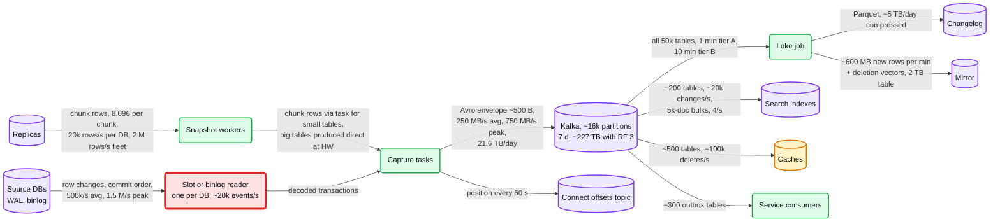

## D5. Failure path: Kafka unavailable to Connect for 20 minutes

Nothing is lost, the slot holds everything, but the slot budget burns and the catch-up is bounded by the serial reader.

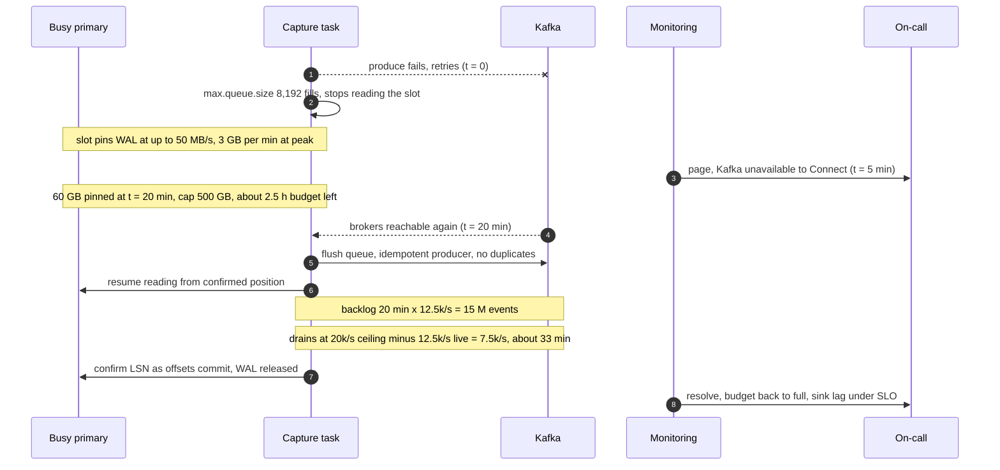

## D5. Failure path: a late older insert after a delete at the search sink

Why the search sink writes soft deletes. A real delete forgets its version after `index.gc_deletes` (60 s), so a replayed older insert resurrects the row.

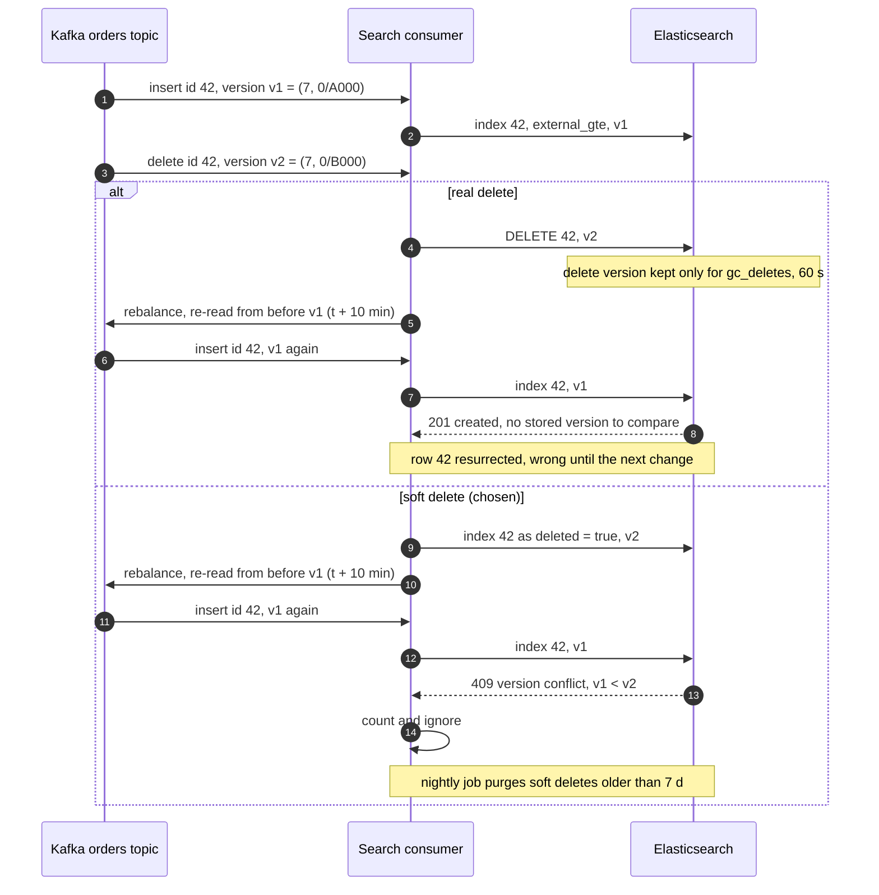

## D6. Decision flow: the watermark window inside the capture task

What the capture task does with each event it reads from the log while a chunk is in flight. This is the DBLog handoff from `solution.md` §4.2, in the variant that never pauses the log: keys are recorded by primary-key range, because a replica read may still be running when `LW_k` is processed.

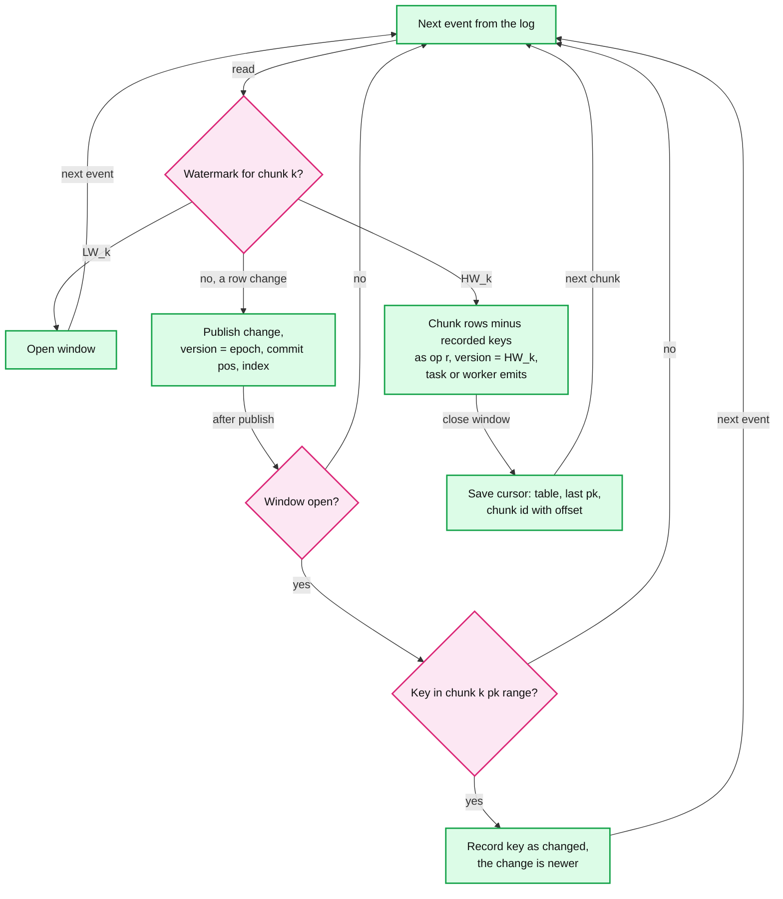

## D6. Decision flow: the sink apply rule

One rule at every versioned sink. It turns at-least-once delivery into exactly-once effect, merges snapshot rows with live changes, and survives failover because the epoch leads the version.

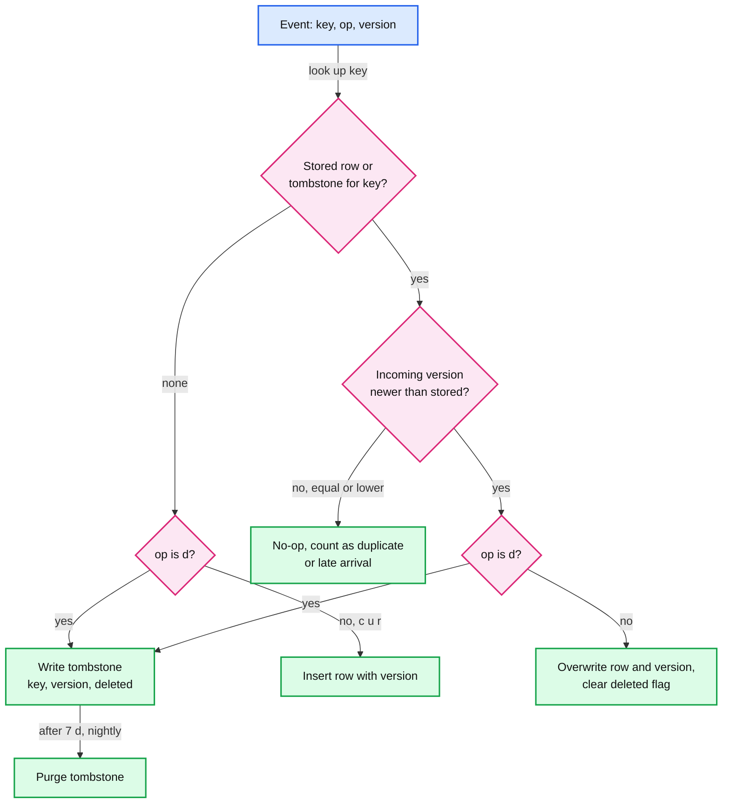

Search uses `external_gte`, so "equal" is accepted there: two changes to one key in one transaction share a commit LSN, and the consumer reduces each batch to the last change per key before writing.

## D8. State machine: captured table lifecycle

A table streams live changes from the moment it is registered. The snapshot runs beside the stream, not before it.

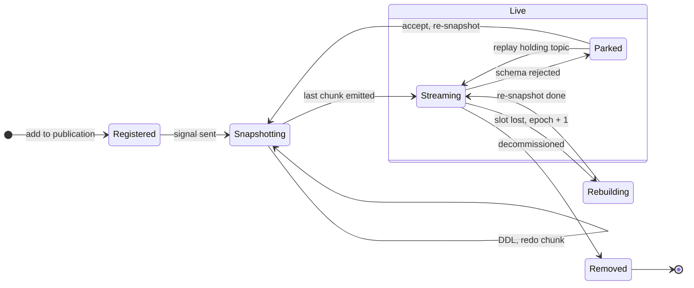

## D8. State machine: snapshot chunk lifecycle

A chunk is re-readable until its rows are emitted. The cursor is saved with the connector offset, so a crash repeats at most one chunk.

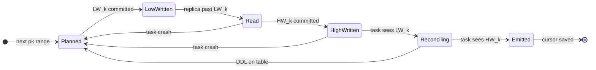

## D8. State machine: replication slot lifecycle

The `wal_status` column of `pg_replication_slots` plus invalidation. `extended` is past `max_wal_size` but still retained; `unreserved` means required files go at the next checkpoint; `lost` is unusable.

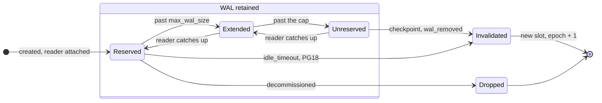

Orthogonal to this: `active` (a reader is streaming) versus inactive (`inactive_since` set), and on a Postgres 17+ standby a `synced = true` copy that cannot be decoded or dropped there and becomes the live slot only after promotion (`solution.md` §6 Flow 4).

## D9. Deployment: one region, three AZs

Where each piece runs. The failover slot lives on the primary and is synced to one standby; the top 20 databases also get a CDC standby that decodes off the primary.

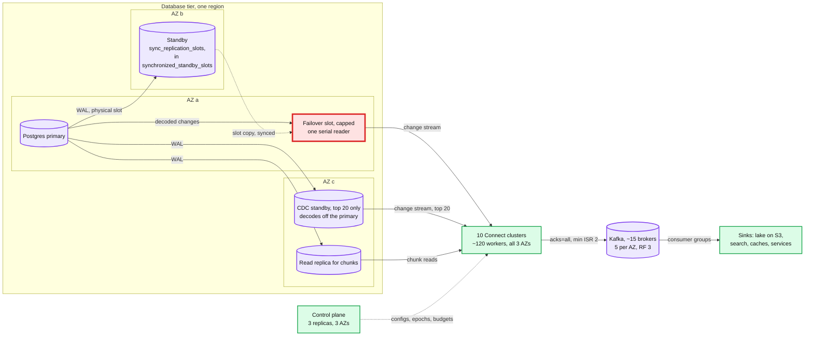

Nothing crosses a region boundary on the capture path. Multi-region consumers read mirrored topics (`solution.md` §10.11).

## D10. Scaling: topic grouping

Partitions scale consumers, not capture. The hot element is still the one serial reader per database; grouping only fixes the broker count.

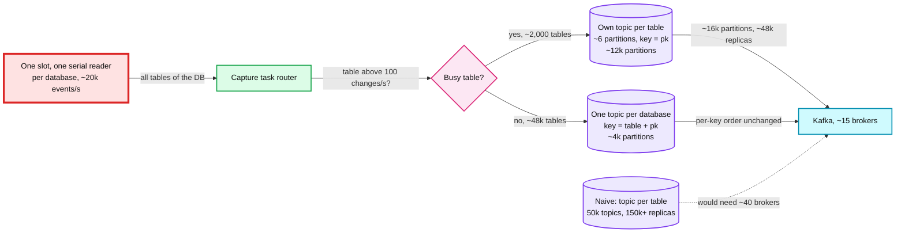

## D11. Failure mode map

Component, what fails (on the edge), blast radius (in the node), mitigation. The only red node is the one whose failure could reach production.

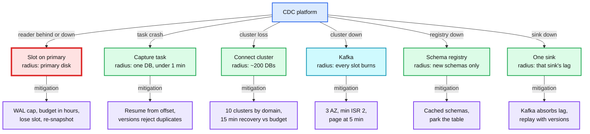

## D12. Rollout: from nightly dumps and dual writes to CDC

Phases with a rollback point at each phase end. Readers flip via views and services via a flag, so every rollback is a view change or a flag.

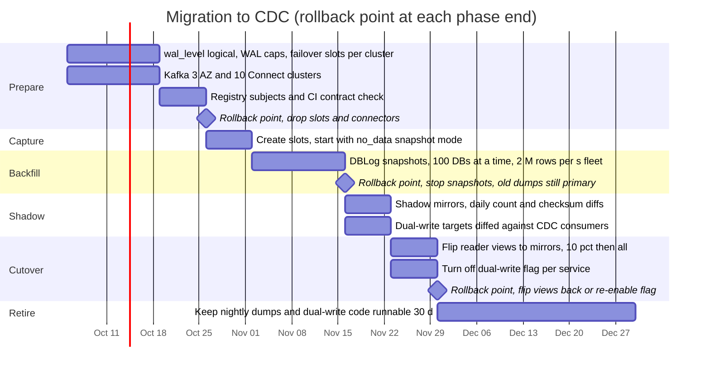
