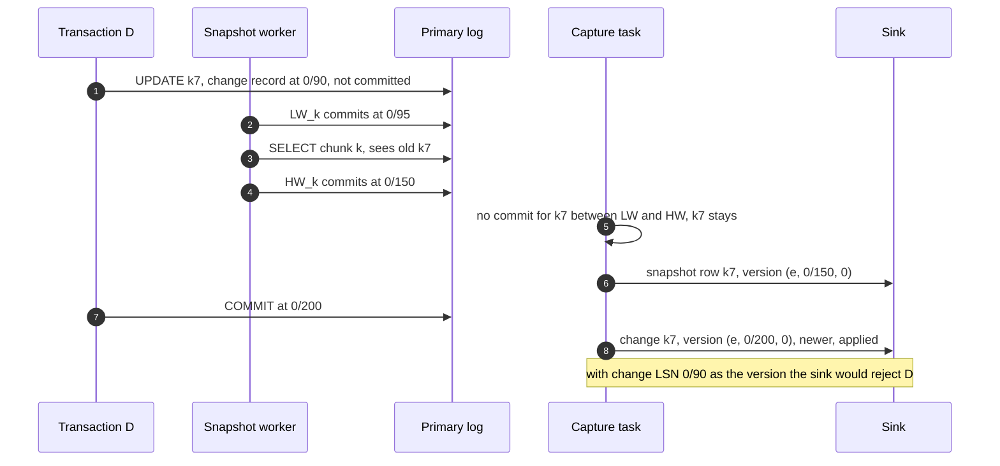

# Edge cases: Change data capture (CDC) pipeline

Every entry answerable in under 60 seconds out loud. Categories: failure, consistency, scale, data, operations, security. Design reference: [`solution.md`](solution.md). Version everywhere means `(epoch, commit position, index in transaction)`.

---

## Failure

## Edge case: the connector crashes after producing, before its offset commit
- **Trigger:** OOM kill, node loss, deploy, between two offset flushes (`offset.flush.interval.ms`, 60 s by default).
- **Symptom:** none for users. Kafka holds up to 60 s of events twice: 3.6 M duplicates on the 60k/s database.
- **Answer:**
  - The restarted task reads the last committed offset and restarts replication from it. The slot's `confirmed_flush_lsn` is at or behind that offset, so the WAL is still there.
  - The re-sent events carry the same versions. Every sink applies only newer versions, so they are no-ops (or counted 409s in search).
  - The top 20 databases flush offsets every 10 s to shrink the window. KIP-618 on service-facing topics removes the copies inside Kafka, but nothing depends on it.
- **Diagram:** `solution.md` §6 Flow 3.
- **Confidence:** [ ] shaky  [ ] ok  [ ] confident

## Edge case: Postgres crashes and the slot comes back at an older position
- **Trigger:** primary crash and restart (no failover). A slot's position "is persisted only at checkpoint".
- **Symptom:** after restart the slot resumes from its last checkpointed position, earlier than what the connector already published.
- **Answer:**
  - Postgres says it plainly: logical decoding clients are responsible for avoiding ill effects of changes sent twice.
  - The connector asks to start from its own stored offset and skips positions at or below it. Anything re-sent anyway has an old version and is rejected at every sink.
  - Nothing is lost: an older restart point means more WAL replayed, never less.
- **Confidence:** [ ] shaky  [ ] ok  [ ] confident

## Edge case: a Connect cluster is down longer than the slot budget
- **Trigger:** a bad deploy or a crash loop on one of the 10 Connect clusters, not fixed in time.
- **Symptom:** ~200 databases stop streaming. On the busy primary the slot pins 180 GB of WAL per hour against a 500 GB cap.
- **Answer:**
  - Warn at 50% of budget (t = 1.4 h), page at < 1 h left (t = 1.8 h). The 15 min recovery SLO means this is already a second failure.
  - At t = 2.8 h the checkpoint marks the slot `lost` (`invalidation_reason = wal_removed`). The primary's disk is untouched. That is the whole point of the cap.
  - Control plane: new slot, epoch + 1, stream from now, DBLog re-snapshot of every captured table (~7 h). Sinks converge key by key because every new-epoch version outranks the old ones.
- **Diagram:** `solution.md` §6 Flow 5.
- **Confidence:** [ ] shaky  [ ] ok  [ ] confident

## Edge case: Kafka is unavailable to the capture tasks
- **Trigger:** Kafka cluster outage, network partition between Connect and the brokers, ACL misconfiguration.
- **Symptom:** producers retry, Debezium's queue (`max.queue.size`, 8,192 records) fills, the task stops reading the log. Every slot burns budget at once.
- **Answer:**
  - Nothing is lost: the slot holds the WAL. This is the one failure where every database's budget runs at the same time.
  - Page at 5 min of "Kafka unavailable to Connect", far ahead of the smallest budget (2.8 h at peak).
  - Kafka is 3 AZs with RF 3 and `min.insync.replicas = 2`, so a full outage is rare. If it lasts past a budget, that database takes the lost-slot path above, never a full disk.
- **Confidence:** [ ] shaky  [ ] ok  [ ] confident

## Edge case: a quiet database sits on a busy Postgres cluster
- **Trigger:** captured tables in database A see no writes for hours while database B on the same cluster writes gigabytes of WAL.
- **Symptom:** A's slot never advances, retained WAL grows, the budget alarm fires on a database with zero changes.
- **Answer:**
  - WAL belongs to the cluster, the slot to one database. No captured events means nothing to confirm.
  - `heartbeat.interval.ms = 10000` plus `heartbeat.action.query` (a tiny insert into a heartbeat table in A) gives the slot something to confirm every 10 s. Debezium documents exactly this fix.
  - The heartbeats also keep `now - commit_ts` fresh for idle tables, so lag dashboards stay honest.
- **Diagram:** `solution.md` §5.1.
- **Confidence:** [ ] shaky  [ ] ok  [ ] confident

## Edge case: a decommissioned pipeline left its slot behind
- **Trigger:** a team stopped using a table, the connector was deleted, nobody dropped the slot.
- **Symptom:** a slot with `active = false` pins WAL forever and holds back `catalog_xmin`.
- **Answer:**
  - The control plane reconciles every slot on every cluster against the pipeline registry every 10 min. An unknown slot pages and is dropped after 24 h.
  - On Postgres 18, `idle_replication_slot_timeout` (default 0, off) is set to 3 days as the last-resort sweeper. The cap still bounds the damage meanwhile.
  - Deleting a pipeline is one control-plane call that drops the connector and the slot together.
- **Confidence:** [ ] shaky  [ ] ok  [ ] confident

## Edge case: the Postgres primary fails over and the slot was a synced failover slot
- **Trigger:** primary dies on Postgres 17+, slot created with `failover = true`, standby has `sync_replication_slots = on`, primary lists the standby in `synchronized_standby_slots`.
- **Symptom:** ~15 s CDC pause.
- **Answer:**
  - The standby already holds a synced copy of the slot. After promotion the capture task reconnects to the new primary and resumes from its offset.
  - LSNs continue across a promotion, so the epoch stays the same and versions keep rising.
  - `synchronized_standby_slots` meant CDC never received a change the standby did not have, so there is no phantom to clean up.
- **Diagram:** `solution.md` §6 Flow 4.
- **Confidence:** [ ] shaky  [ ] ok  [ ] confident

## Edge case: the Postgres primary fails over without a failover slot
- **Trigger:** Postgres 16 or older, or a 17+ cluster where the slot was not created as a failover slot.
- **Symptom:** the new primary has no slot. Writes committed there before a slot exists are invisible to CDC.
- **Answer:**
  - Debezium's documented recovery: create the slot on the new primary before writes resume, then re-snapshot with `snapshot.mode = always`.
  - We do the lock-free version: epoch + 1, new slot. If the slot existed before the new primary took writes, nothing is missed and only phantoms (events published past the timeline switch LSN) need a targeted re-snapshot of their keys. If writes came first, a full DBLog re-snapshot of every captured table.
  - Either way the repair ends with a sweep: rows still below the new epoch (deleted during the gap, or phantom inserts) are deleted in every sink, because a snapshot only re-emits rows that exist.
  - Prevention is the fix: every Postgres 17+ cluster gets failover slots, and pre-17 clusters are on the upgrade list.
- **Diagram:** `solution.md` §5.2.
- **Confidence:** [ ] shaky  [ ] ok  [ ] confident

## Edge case: CDC published a change that the failover threw away (phantom)
- **Trigger:** asynchronous replication. The old primary decoded a transaction, CDC published it, the primary died before the standby received it.
- **Symptom:** sinks hold state the database never had. Worse, the new primary writes new transactions into the same LSN range: same versions, different content, so real changes can be rejected as "older".
- **Answer:**
  - Prevent: `synchronized_standby_slots` makes logical walsenders send only WAL the listed standby has confirmed. CDC can never be ahead of the promotion candidate.
  - If it happened anyway (no synced slot, or the promoted server was not listed): epoch + 1, so every new event outranks the phantom range, then re-snapshot so each phantom key is overwritten with the real row.
  - Say it out loud: this is the failure Kafka exactly-once cannot see.
- **Confidence:** [ ] shaky  [ ] ok  [ ] confident

## Edge case: the standby listed in `synchronized_standby_slots` dies
- **Trigger:** the failover-candidate standby crashes or its physical slot is invalidated.
- **Symptom:** CDC for that database stops. Postgres: "logical replication will not proceed if the slots specified in `synchronized_standby_slots` do not exist or are invalidated". The slot budget starts burning.
- **Answer:**
  - Page on "CDC stalled on synchronized standby", separate from connector health, because the connector looks fine.
  - Runbook: bring up a replacement standby and put it in the list, or remove the dead one from the list and accept the phantom window until a new standby is listed.
  - The standby change and the list change ship together as one change, so a planned standby replacement never stalls CDC.
- **Confidence:** [ ] shaky  [ ] ok  [ ] confident

## Edge case: a MySQL primary fails over
- **Trigger:** MySQL primary dies, a replica with GTIDs is promoted.
- **Symptom:** binlog file names and byte offsets on the new primary have nothing to do with the old ones. The synthetic position would jump backwards.
- **Answer:**
  - The connector stores the executed GTID set in its offsets and resumes on the new primary after it. GTIDs survive failover, byte offsets do not.
  - The control plane bumps the epoch and rebases the synthetic offset, so versions keep rising.
  - Phantoms are possible (the connector may have read a transaction no replica had). The control plane reads the keys of events produced to Kafka in the last 60 s before failover (not the lake changelog, which can be 10 min behind), re-snapshots just those keys, emits `op = d` for any key the read does not find, and then sweeps those keys' old-epoch versions.
- **Diagram:** `solution.md` §10.4.
- **Confidence:** [ ] shaky  [ ] ok  [ ] confident

## Edge case: MySQL purged the binlog before the connector caught up
- **Trigger:** connector down longer than `binlog_expire_logs_seconds` (30 days by default, 7 to 30 days in our config).
- **Symptom:** the stored position no longer exists on the server. The connector cannot resume.
- **Answer:**
  - MySQL is the mirror image of Postgres: it purges by age whether or not a reader consumed the binlog, so CDC never fills the disk but can fall off the end.
  - Do not let Debezium's `when_needed` take a classic (locking) snapshot. Epoch + 1, restart from the current GTID set with `no_data`, then signal DBLog incremental snapshots.
  - Same budget alarm as Postgres, computed as retention minus lag.
- **Confidence:** [ ] shaky  [ ] ok  [ ] confident

## Edge case: the MySQL schema history topic is deleted or aged out
- **Trigger:** someone applies default retention to all topics, or deletes "unused" internal topics.
- **Symptom:** after the next restart the connector cannot decode binlog rows from its stored position, because it no longer knows the table shapes at that position.
- **Answer:**
  - Prevention: infinite retention, RF 3, excluded from topic cleanup automation, an alarm if it disappears.
  - Recovery: epoch + 1, start from the current position (schemas read from the live tables), DBLog re-snapshot of that database.
  - Postgres has no equivalent: its `Relation` messages carry the schema in the stream.
- **Confidence:** [ ] shaky  [ ] ok  [ ] confident

## Edge case: a major version upgrade drops the logical slots
- **Trigger:** `pg_upgrade` of a cluster older than 17. Logical slots on clusters before 17.0 "will silently be ignored".
- **Symptom:** after the upgrade there is no slot. Writes after the upgrade are invisible to CDC until a new one exists.
- **Answer:**
  - Treat a pre-17 upgrade as a planned lineage break: create the new slot before writes resume, epoch + 1, DBLog re-snapshot, scheduled under the fleet snapshot budget.
  - From 17 on, pg_upgrade migrates logical slots if the prerequisites hold (enough `max_replication_slots`, the output plugin installed, no conflicting slots, no permanent logical slots on the new cluster).
  - The upgrade checklist includes CDC, owned by the database team with the CDC team as reviewer.
- **Confidence:** [ ] shaky  [ ] ok  [ ] confident

---

## Consistency

## Edge case: a transaction writes a key before the low watermark and commits after the high watermark
- **Trigger:** snapshot of chunk k runs while transaction D (row lock on key `k7`) is open across the whole window.
- **Symptom:** the chunk read sees the old `k7` (D not committed). Nothing for `k7` commits between the watermarks, so the snapshot row survives and is emitted at `HW_k`.
- **Answer:**
  - The snapshot row gets version `(e, HW_k, 0)`. D is emitted later with version `(e, D's commit LSN, 0)`, which is higher, so every sink applies it.
  - If the version were D's change-record LSN (written before `LW_k`), it would be lower than `HW_k` and sinks would reject a real update. That is why the version is the commit position, not the change LSN.
  - Per key, commit positions only go up: two transactions cannot hold the same row lock at once.
- **Diagram:**

- **Confidence:** [ ] shaky  [ ] ok  [ ] confident

## Edge case: the snapshot worker crashes in the middle of a chunk
- **Trigger:** worker or capture task restart after `LW_k` was written and before `HW_k` was processed.
- **Symptom:** the in-memory chunk buffer is gone. `LW_k` (and maybe `HW_k`) are in the log with no buffer behind them.
- **Answer:**
  - The chunk cursor is saved with the connector offset only after a chunk is emitted, so the restart re-reads chunk k with fresh watermarks `LW_k'` and `HW_k'`. Orphan watermarks from the dead attempt are ignored.
  - Rows re-emitted at `HW_k'` carry a higher version than any first-attempt rows, and they reflect state at `HW_k'`, so sinks apply them safely.
  - Cost: one chunk (8,096 rows) read twice. The table is never restarted from the beginning.
- **Confidence:** [ ] shaky  [ ] ok  [ ] confident

## Edge case: the replica used for chunk reads lags behind the low watermark
- **Trigger:** heavy write burst on the primary, replica apply falls behind by minutes.
- **Symptom:** a read on that replica would return rows older than changes already published before `LW_k`.
- **Answer:**
  - The worker waits until `pg_last_wal_replay_lsn() >= LW_k` (GTID set on MySQL) before the `SELECT`. Reading earlier breaks DBLog's "non-stale reads" rule, and a stale row stamped with `HW_k` would overwrite newer state.
  - The replica cannot be past `HW_k`, because `HW_k` is written after the read returns.
  - If replica lag passes 30 s, the snapshot pauses itself. Live capture is unaffected.
- **Diagram:** `solution.md` §6 Flow 2.
- **Confidence:** [ ] shaky  [ ] ok  [ ] confident

## Edge case: two changes to the same key in one transaction reach Elasticsearch
- **Trigger:** `UPDATE orders SET status='paid' WHERE id=42; UPDATE orders SET total=... WHERE id=42` in one transaction.
- **Symptom:** both events share commit LSN `C`. The search version is a single long, `epoch << 56 | C`, so the index-in-transaction tie-breaker is lost.
- **Answer:**
  - The consumer reduces each poll to the last change per key, so usually one write happens.
  - If the two events land in different polls, `version_type=external` rejects the second (equal is not greater) and the document keeps the intermediate state. `external_gte` accepts equal, so the later change wins.
  - A replay that re-applies the first change at the same version is also accepted, but partition order re-applies the second right after it, so the document converges.
- **Confidence:** [ ] shaky  [ ] ok  [ ] confident

## Edge case: a delete is followed by a late replay of an older insert
- **Trigger:** consumer rewind after a rebalance, or a snapshot row racing a delete.
- **Symptom:** a sink that forgot the deleted key accepts the older insert and resurrects the row.
- **Answer:**
  - Every sink keeps a tombstone `(key, version, deleted = true)` for at least 7 days (Kafka retention, the longest replay window).
  - Elasticsearch forgets a real delete's version after `index.gc_deletes` (60 s). So the search consumer writes a soft-delete document (key, version, `deleted: true`, no other fields) and a nightly job purges soft deletes older than 7 days.
  - The lake mirror keeps `_deleted` rows with `_version` until nightly compaction purges those older than 7 days.
- **Confidence:** [ ] shaky  [ ] ok  [ ] confident

## Edge case: a consumer sees an order without its items
- **Trigger:** one transaction inserts `orders` and five `order_items`. Two topics, different partitions, different consumer lag.
- **Symptom:** a dashboard counts an order with zero items for a few seconds; a service rejects an item whose parent it has not seen.
- **Answer:**
  - The default promise is per-key order and eventual consistency across keys. Say it first.
  - Sinks that need atomicity turn on `provide.transaction.metadata`, buffer per `tx_id` until `END` and every counted event arrive, then apply in one local transaction.
  - Services that need "an order with its items" read an outbox event written in the same transaction, not raw rows.
- **Diagram:** `solution.md` §5.3.
- **Confidence:** [ ] shaky  [ ] ok  [ ] confident

## Edge case: an UPDATE changes a row's primary key
- **Trigger:** `UPDATE accounts SET id = 900 WHERE id = 17`.
- **Symptom:** the Kafka key is the primary key, so there is no single key to put the change under.
- **Answer:**
  - Debezium sends a delete event for the old key (followed by its tombstone) and a create event for the new key, each with a header marking the primary key change.
  - They land on different partitions, so a consumer may see the new key before the old one is deleted. For per-key state that is fine: two independent keys, each versioned.
  - A sink that indexes by something other than the primary key (for example a secondary lookup) must handle a short window where both exist.
- **Confidence:** [ ] shaky  [ ] ok  [ ] confident

---

## Scale

## Edge case: a 10 M-row UPDATE runs in one transaction
- **Trigger:** a backfill `UPDATE events SET region = ...` without batching.
- **Symptom:** decoding spills past `logical_decoding_work_mem` (64 MB default) to disk on the primary; at commit 10 M events burst out. Every table in that database lags ~500 s (10 M ÷ 20k/s).
- **Answer:**
  - Head-of-line blocking: one serial stream per database, so one huge transaction delays all of its tables.
  - Prevent at the source: migration tooling caps backfill transactions at 10k rows. It is a contract with database owners.
  - Detect: alarm on `spill_bytes` in `pg_stat_replication_slots`. Top 20 databases run with 512 MB of decoding memory.
  - No streaming of in-progress transactions: it would push aborted work into the connector.
- **Diagram:** `solution.md` §5.3.
- **Confidence:** [ ] shaky  [ ] ok  [ ] confident

## Edge case: one row is updated thousands of times per second
- **Trigger:** a counter or a status row hammered by the application.
- **Symptom:** one partition carries that key's events. At 5k/s × 500 B = 2.5 MB/s it is well under ~10 MB/s per partition.
- **Answer:**
  - CDC cannot split a key without losing its order, and does not need to.
  - Search and lake reduce each batch to the last version per key, so 5k changes/s become one write per batch. Cache deletes coalesce the same way.
  - Capture cost is per change, not per key. The real question is whether the database should be doing this.
- **Confidence:** [ ] shaky  [ ] ok  [ ] confident

## Edge case: one database does 60k changes/s against a ~20k/s reader
- **Trigger:** the largest database at peak.
- **Symptom:** capture falls behind every afternoon, lag grows, the slot budget burns without anything being "down".
- **Answer:**
  - In order: tune the task (batch 8,192, Avro, no SMTs in the connector), decode on a CDC standby, split into 2 to 4 slots with disjoint publications, shard the source.
  - Each extra slot decodes the whole WAL again, so 3 slots is 3x decode CPU on the source, and a transaction spanning two groups is split across streams.
  - "Add partitions" does not help: one slot feeds one serial reader however many partitions the topic has.
- **Diagram:** `solution.md` §5.4.
- **Confidence:** [ ] shaky  [ ] ok  [ ] confident

## Edge case: topic per table means 50k topics
- **Trigger:** Debezium's default naming across 50,000 captured tables.
- **Symptom:** 50k+ partitions and 150k+ replicas: ~40 brokers sized by partition count while bytes need far fewer.
- **Answer:**
  - The ~2,000 tables above 100 changes/s keep their own topics (~6 partitions each, ~12k).
  - The ~48k quiet tables go to one topic per database keyed by table plus primary key (~4k partitions). Per-key order is unchanged.
  - Result: ~16k partitions, ~48k replicas, ~15 brokers. Lake jobs demultiplex by table.
- **Confidence:** [ ] shaky  [ ] ok  [ ] confident

## Edge case: the first fleet bootstrap stampedes the replicas
- **Trigger:** onboarding 2,000 databases (~1 T rows) at once.
- **Symptom:** replica lag climbs everywhere, read-heavy services using those replicas slow down.
- **Answer:**
  - Two budgets: 20k rows/s per database (token bucket on the replica) and 2 M rows/s fleet-wide, enforced by the control plane's snapshot scheduler.
  - Snapshots pause automatically when replica lag > 30 s or primary CPU > 70%.
  - 100 databases at a time: ~1 T rows ÷ 2 M rows/s = 5.8 days of reading, run as a 1 to 2 week migration.
- **Confidence:** [ ] shaky  [ ] ok  [ ] confident

## Edge case: a new team wants the whole 2 TB table in their own store
- **Trigger:** a new search index or service on a table already captured.
- **Symptom:** the naive answer re-snapshots the source for every new consumer.
- **Answer:**
  - Bootstrap from the lake mirror at a table version whose commit recorded the Kafka offsets, then consume Kafka from exactly those offsets. The versioned apply makes the overlap harmless.
  - Condition: the bootstrap finishes inside Kafka's 7-day retention.
  - The source pays once per table, not once per consumer. This is Databus's bootstrap service idea, built on the lake.
- **Confidence:** [ ] shaky  [ ] ok  [ ] confident

---

## Data

## Edge case: a DDL runs on a table while its snapshot is in progress
- **Trigger:** `ALTER TABLE orders ADD COLUMN ...` during a multi-hour incremental snapshot.
- **Symptom:** buffered chunk rows have the old shape while the stream has the new one. Debezium's Postgres connector does not support schema changes while an incremental snapshot is running.
- **Answer:**
  - The capture task detects the new `Relation` message for a table that is snapshotting, drops the current chunk buffer, and pauses that table's snapshot.
  - After the new schema registers, the snapshot resumes from the saved cursor. Only the current chunk is re-read.
  - Other tables' snapshots and all live streaming continue.
- **Confidence:** [ ] shaky  [ ] ok  [ ] confident

## Edge case: a column rename ships around the CI gate
- **Trigger:** a hand-run `ALTER TABLE orders RENAME COLUMN amount TO total` on Friday evening.
- **Symptom:** the Postgres stream shows it as "amount gone, total added". If `total` is nullable, the new schema passes `FULL_TRANSITIVE` and the registry accepts it: the column's history silently splits in two.
- **Answer:**
  - If the new shape is incompatible (for example a required field), the registry rejects it and the table is parked: events to a holding topic, other tables keep streaming, owner paged.
  - The compatible case is the dangerous one. A contract job flags any version that removes one field and adds another on a captured table and pages the owner.
  - The owner decides: register a new table version and replay the holding topic, or accept and re-snapshot the table under the new schema.
- **Diagram:** `solution.md` §6 Flow 6.
- **Confidence:** [ ] shaky  [ ] ok  [ ] confident

## Edge case: a column is added
- **Trigger:** `ALTER TABLE orders ADD COLUMN coupon text`.
- **Symptom:** none, if the design works.
- **Answer:**
  - Postgres emits no DDL. pgoutput sends a fresh `Relation` message before the next `orders` row, so the change is discovered at the right position. MySQL writes the DDL into the binlog in order.
  - The task registers a new optional field. `FULL_TRANSITIVE` accepts it (old readers skip it, new readers default it), events carry the new schema id.
  - The lake adds the column in the same commit as the first batch that carries it. Search and service consumers ignore unmapped fields.
- **Confidence:** [ ] shaky  [ ] ok  [ ] confident

## Edge case: someone truncates a captured table
- **Trigger:** `TRUNCATE staging_orders`.
- **Symptom:** by default nothing: Debezium's `skipped.operations` defaults to `t`, so truncates are skipped and sinks keep every row.
- **Answer:**
  - Capture truncates on purpose: remove `t` from `skipped.operations`. The event (op `t`) has no message key, so on a multi-partition topic it has no order relative to row events.
  - Sinks treat it as a table-level floor: delete every row with a version below the truncate's version and keep that floor so late lower-version events are rejected.
  - For busy multi-partition tables, the simpler repair is a truncate floor plus a re-snapshot of the (now small) table.
- **Confidence:** [ ] shaky  [ ] ok  [ ] confident

## Edge case: an update event carries `__debezium_unavailable_value`
- **Trigger:** an UPDATE that did not touch a large TOASTed column. Postgres omits unchanged TOASTed values unless REPLICA IDENTITY is FULL.
- **Symptom:** the sink overwrites a 50 KB JSON body with the placeholder string.
- **Answer:**
  - Sinks treat the placeholder as "unchanged, keep the stored value": the lake `MERGE` uses a `CASE` per TOAST-able column, the search consumer merges with the stored document before indexing.
  - For tables where that is awkward, set REPLICA IDENTITY FULL (the old image then carries the value) at the cost of logging the whole old row on every update.
  - Debezium's reselect-columns post processor can re-query the source, at the cost of reads on the source.
- **Confidence:** [ ] shaky  [ ] ok  [ ] confident

## Edge case: a table has no primary key
- **Trigger:** a legacy or log-style table added to the capture list.
- **Symptom:** with no replica identity, Postgres refuses UPDATE and DELETE on a table in a publication that replicates them: "Attempting such operations will result in an error on the publisher". CDC onboarding breaks production writes.
- **Answer:**
  - Onboarding refuses tables without a primary key or a unique not-null index.
  - Options for the owner: add a primary key, `REPLICA IDENTITY USING INDEX` on a unique index (and `message.key.columns` for the Kafka key), or FULL as a last resort.
  - Without any unique key there is no per-key version and no chunking key, so the table can only be captured as an append-only changelog, never mirrored.
- **Confidence:** [ ] shaky  [ ] ok  [ ] confident

## Edge case: a row is tens of MB
- **Trigger:** a document or blob column. Shopify saw records of "many tens of MBs" against Kafka's 1 MB default.
- **Symptom:** the producer rejects the record, the task fails, the database's stream stops and the slot budget burns.
- **Answer:**
  - Decide per column: exclude it from capture (publication column list, or connector-side column filtering) if no sink needs it.
  - Otherwise use a claim check: the payload goes to object storage, the event carries a reference plus the version.
  - Raising the topic's max message size is a last resort for a few topics, never the platform default.
- **Confidence:** [ ] shaky  [ ] ok  [ ] confident

## Edge case: a GDPR delete request
- **Trigger:** a user asks to be forgotten. The service deletes their rows.
- **Symptom:** the delete propagates to every sink within its SLO. The history does not: Kafka and the lake changelog still hold old values.
- **Answer:**
  - Kafka ages out in 7 days. Tombstones and soft-delete documents carry only key and version, never PII.
  - The changelog is purged by key (or crypto-shredded per user) by a deletion job with a 30-day SLA.
  - Mirrors purge soft-deleted rows older than 7 days at nightly compaction.
- **Confidence:** [ ] shaky  [ ] ok  [ ] confident

---

## Operations

## Edge case: what pages at 3am
- **Trigger:** any of the conditions below.
- **Symptom:** a page with the database, the budget in hours, and the runbook link.
- **Answer:**
  - Pages: slot budget < 1 h, slot `lost`, Kafka unavailable to Connect for 5 min, tier A capture task down 5 min, epoch bump (failover without a synced slot), tier A table parked, CDC stalled on a synchronized standby.
  - Warnings, not pages: budget < 50%, `spill_bytes` rising for 10 min, sink lag over SLO for 10 min, unknown slot found by the reconciler.
  - Never page on lag in offsets. Lag is `now - commit_ts` in seconds, with heartbeats for idle tables.
- **Confidence:** [ ] shaky  [ ] ok  [ ] confident

## Edge case: a bad release wrote wrong values into a sink
- **Trigger:** a search or service consumer deploy mis-mapped a field for 2 hours.
- **Symptom:** documents have wrong content but correct versions.
- **Answer:**
  - Reset that sink's consumer group to a time before the release and replay. Versions keep the replay safe.
  - A sink that applies only strictly newer versions would ignore the replay (same versions), so replay runs in repair mode (`>=`, safe because an equal full version is the same event). Search already uses `external_gte`.
  - For the lake, rebuild the mirror from the changelog rather than replaying Kafka.
  - If the capture side published the wrong values (a converter bug in a connector image), replaying cannot help: roll back the image, bump the epoch for the affected databases, and DBLog re-snapshot the affected tables so new-epoch rows overwrite everything.
- **Confidence:** [ ] shaky  [ ] ok  [ ] confident

## Edge case: migrating from nightly dumps or application dual writes
- **Trigger:** the current world is a nightly dump into the warehouse and services that publish to Kafka after committing.
- **Symptom:** stale warehouse, silent drift between the database and the dual-written copies.
- **Answer:**
  - Dumps: create slots and start with `no_data` so the stream flows from now, DBLog backfill under the fleet budget, build the mirror as a shadow table, diff row counts and per-partition checksums daily for a week, flip readers via a view, keep the dump job runnable for a month.
  - Dual writes: capture the table, run the new consumer in shadow and diff against the dual-write target, then delete the dual-write path behind a flag. Rollback is flipping the flag: the table was always the source of truth.
  - Services that consumed the dual-written events get an outbox table first.
- **Confidence:** [ ] shaky  [ ] ok  [ ] confident

---

## Security and abuse

## Edge case: the CDC database credential leaks
- **Trigger:** a leaked secret for the role with `REPLICATION` and `SELECT` on every published table.
- **Symptom:** whoever holds it can stream every captured change in the company.
- **Answer:**
  - Least privilege: `REPLICATION` plus `SELECT` on published tables only; writes only to the signal and heartbeat tables (none with read-only snapshots).
  - The secret lives in a secret store with rotation, and replication connections are only accepted from the Connect network.
  - Rotate and audit which slots were read. It is the most privileged read credential in the company, so it is treated like one.
- **Confidence:** [ ] shaky  [ ] ok  [ ] confident

## Edge case: a captured table contains secrets
- **Trigger:** a team onboards `users`, which has `password_hash` and `mfa_secret`.
- **Symptom:** secrets would flow into Kafka, the lake, and every consumer with access.
- **Answer:**
  - Publications list columns (Postgres 15+), so secret columns never leave the database in the log stream. On MySQL the binlog has whole rows, so the connector drops them before Kafka.
  - Registry schemas carry `pii` tags that drive topic ACLs and lake masking.
  - Topics are ACL'd per domain, Kafka and Connect use mTLS, so a consumer reads only tables it was granted.
- **Confidence:** [ ] shaky  [ ] ok  [ ] confident
