# HLD: Change data capture (CDC) pipeline

> One-line answer: read each database's own commit log (a Postgres logical replication slot, the MySQL binlog) with exactly one serial reader per database, publish every committed row change to Kafka keyed by primary key and stamped with a version that only goes up per key in commit order (source epoch, commit position), backfill existing rows with a DBLog-style watermark-chunked snapshot that takes no lock and never shows a sink older state, and make every sink apply a change only if its version is newer than what it holds, so at-least-once transport becomes exactly-once effect without any cross-system transaction. The thing that breaks first is the replication slot on the production primary: it pins WAL for as long as the reader is behind, so the design caps it, alarms on it in hours of budget, and deliberately loses the slot (then re-snapshots without locks) rather than let CDC fill a primary's disk.

Sources: [Postgres logical decoding](https://www.postgresql.org/docs/current/logicaldecoding-explanation.html), [pg_replication_slots](https://www.postgresql.org/docs/current/view-pg-replication-slots.html), [Postgres replication settings](https://www.postgresql.org/docs/current/runtime-config-replication.html), [Debezium 3.6 Postgres connector](https://debezium.io/documentation/reference/stable/connectors/postgresql.html), [Debezium exactly-once](https://debezium.io/documentation/reference/stable/configuration/eos.html), [DBLog paper, Netflix](https://arxiv.org/pdf/2010.12597), [Flink CDC incremental snapshot](https://nightlies.apache.org/flink/flink-cdc-docs-stable/docs/connectors/flink-sources/mysql-cdc/), [Databricks AUTO CDC](https://docs.databricks.com/aws/en/ldp/cdc), [Elasticsearch external versioning](https://www.elastic.co/docs/api/doc/elasticsearch/operation/operation-index), Shopify, Notion, Meta Wormhole and McSqueal, LinkedIn Databus (see [`research/`](research/) for URLs and the spot-check corrections). Hello Interview's public CDC page sets the scope line used in §1: "CDC works best when consumers just need a copy of your data. But it can start to fall apart when they need to know why that data changed" ([page](https://www.hellointerview.com/learn/system-design/deep-dives/change-data-capture), mostly paywalled). Written flow-first: §4 builds one diagram one functional requirement at a time, §5 breaks and mutates it one non-functional requirement at a time, §6 shows the final design and the six flows to rehearse.

---

## 1. Understanding the problem

Restate before designing. The database is the source of truth. Several other systems hold copies of its data in other shapes: a lakehouse table for analytics, a search index, a cache, another service's local view. Every copy goes stale the moment a row changes. The job is to move each committed change from the database to every copy, in the right order, exactly once in effect, without asking application teams to write twice, and without making the database slower or less available.

Why not have the application write to both? Because two writes to two systems cannot be atomic. If the database commit succeeds and the Kafka publish fails, the copy is missing a change forever; if the order is reversed and the database rolls back, the copy has a change that never happened ([Kleppmann](https://martin.kleppmann.com/2015/05/27/logs-for-data-infrastructure.html), [Confluent](https://www.confluent.io/blog/dual-write-problem/)). The database already has a log that is exactly the ordered list of committed changes: its write-ahead log. CDC reads that.

Two things to say in the first minute:
- **CDC copies state, not intent.** It tells a consumer "row 42 now has `status = shipped`", not "the order shipped, send the email". A consumer that needs intent gets an outbox table written in the same transaction, captured by the same pipeline ([Debezium outbox](https://debezium.io/blog/2019/02/19/reliable-microservices-data-exchange-with-the-outbox-pattern/)).
- **The source database is the product, CDC is a derived copy.** Every trade-off below that pits "keep the pipeline going" against "protect the database" picks the database.

### 1.1 Functional requirements

Core:
1. **Capture.** Every committed insert, update and delete on a captured table is published within seconds, in commit order per row, with its source position and transaction id.
2. **Snapshot and handoff.** A newly captured table, or a repair of a key range, gets its existing rows without locking the source, with no gap and no double apply against the live stream, and without a sink ever going back to older state.
3. **Deliver with exactly-once effect.** Lake mirror tables, search indexes, cache invalidation and service consumers each converge to the source's state per key despite duplicates, replays and failovers. Deletes are applied.
4. **Schema changes.** DDL on a captured table flows through without stopping capture and without corrupting sinks; breaking changes are caught before they ship.

Below the line: business events with intent (outbox, same pipeline), transforms and joins (downstream jobs), bidirectional replication and conflict resolution, sources beyond Postgres and MySQL, and the lake landing machinery (file sizing, commit markers, compaction), which is reused from [`../streaming-ingestion/`](../streaming-ingestion/) §4.1 and §5.1.

### 1.2 Non-functional requirements

Ask for scale first. "All our databases" at a company of this size is about 2,000 of them. Pin the numbers and derive the rest.

| Dimension | Target | Why this number |
|---|---|---|
| Sources | 2,000 databases (1,400 Postgres, 600 MySQL), 50,000 captured tables | Hundreds of services, a few databases each. Notion alone runs 480 logical Postgres shards on 96 instances ([Notion](https://www.notion.com/blog/building-and-scaling-notions-data-lake)), Shopify 100+ MySQL shards ([Shopify](https://shopify.engineering/capturing-every-change-shopify-sharded-monolith)) |
| Change rate | 500k row changes/s average, 1.5 M/s peak (3x daily peak), 43 B/day. Top 20 databases carry half of it; the largest does 60k/s at peak | Shopify measured ~65k records/s average and 100k/s spikes over ~150 connectors at BFCM 2020. We are ~8x that |
| Freshness | Commit to Kafka p99 < 2 s. Search and cache p99 < 5 s from commit. Lake mirror p99 < 2 min (tier A) or 10 min (tier B) | Shopify reports p99 < 10 s insert to Kafka. Search users notice seconds, analysts notice minutes |
| Correctness | No committed change lost. Per-key order at every sink. Exactly-once effect per change per sink. Transaction boundaries available on request | At-least-once everywhere, dedup at the apply |
| Source safety | No table locks. < 5% added CPU on a primary. WAL pinned by CDC capped per database and alarmed in hours of budget | The source is the product. CDC is a copy |
| Availability | Capture 99.9%, connector recovery < 1 min, source failover survived without a full re-snapshot on Postgres 17+ and GTID MySQL | Capture is asynchronous. The database keeps serving through a CDC outage, up to the WAL cap |
| Snapshot | 4 B-row (2 TB) table in < 24 h, pausable, rate-limited, re-runnable for a key range | Notion's bootstrap "usually complete within 24 hours" |
| Retention | Change topics 7 days. Lake changelog forever | 7 days is the replay and new-consumer bootstrap window. The database's own log is gone after hours |

Below the line: sub-100 ms propagation (that is synchronous replication, a different system), global commit order across databases (there is no such order without a sequencer), and cross-database transactions.

---

## 2. Back-of-envelope

**Changes.** 500,000/s × 86,400 s = **43.2 B changes/day** average. Peak 3x = **1.5 M/s**.

**Bytes into Kafka.** An Avro envelope with `before`, `after` and a `source` block for a ~20-column row is ~500 B. 500k/s × 500 B = **250 MB/s** average, **750 MB/s** peak, 43.2 B × 500 B = **21.6 TB/day**. JSON with inline schemas would be several times that, which is one reason the registry exists.

**Skew.** The top 20 databases carry 250k/s between them: **12.5k/s each on average, ~37k/s at peak, 60k/s for the largest**. The other 1,980 share 250k/s: **~125/s each**. The long tail is quiet; the head is where every problem lives.

**The serial reader.** A Postgres slot is decoded by one walsender process and consumed by one connector task; a MySQL binlog is read by one client. Plan on **~20k events/s per connector task** (a planning figure to benchmark per schema: row width and converters dominate, and no primary source publishes a number). At peak, **the top ~20 databases are at or over the ceiling** and the largest is 3x over. That is §5.4.

**WAL pinned by the slot.** WAL volume is several times the logical change volume (indexes, full-page images). Say a busy primary writes **50 MB/s** of WAL at peak and a median one **1 MB/s**. A connector down for 1 hour on the busy one pins **180 GB**. A 4 TB volume with 40% free has 1.6 TB of headroom, gone in **~9 h** at peak. That is §5.1, and the reason every slot gets a cap:
- Busy primary, cap 500 GB: 500,000 MB ÷ 50 MB/s = 10,000 s = **2.8 h of budget at peak**, ~8.3 h at the average rate.
- Median database, cap 50 GB: 50,000 MB ÷ 1 MB/s = 50,000 s = **~14 h of budget**.

**Kafka.** 7 days × 21.6 TB = 151 TB logical, ~2x compression = ~76 TB, × RF 3 = **~227 TB**, of which 24 h local is ~32 TB and the rest tiered to object storage. Partitions decide the broker count, not bytes. Topic per table (the Debezium default) is **50k topics, ≥ 50k partitions, 150k+ replicas**. Grouping the ~48k quiet tables into one topic per database (keyed by table and primary key) and giving the ~2,000 busy tables their own topics at ~6 partitions each is **~12k + ~4k = ~16k partitions, ~48k replicas**: one cluster of **~15 brokers** across 3 AZs instead of ~40.

**Connectors.** 2,000 databases = 2,000 connectors, one task each. Shopify packed ~150 connectors onto 12 pods (~12 per pod). Pack ~20 quiet connectors per worker and give the top 20 their own: **~120 workers**, split into ~10 Connect clusters so one rebalance or one bad deploy touches 200 databases, not 2,000.

**Snapshot.** The largest table is 4 B rows. One chunk reader at 20k rows/s: 4 × 10^9 ÷ 2 × 10^4 = 200,000 s = **55.6 h**, over the 24 h target. Eight parallel readers on a replica: 160k rows/s, **6.9 h**. The whole fleet (~500 TB, ~1 T rows at 500 B) at a fleet-wide budget of 2 M rows/s is 500,000 s = **5.8 days**, so the first rollout is phased by database.

**Sinks.**
- Lake: all 50k tables, as a changelog (append) plus a mirror (current row per key).
- Search: ~200 tables, ~20k changes/s. At 5k docs per bulk request that is 4 requests/s. Trivial.
- Cache invalidation: ~500 tables, ~100k changes/s as key deletes.
- Services: ~300 outbox tables.

**The lake mirror's cost.** A 2 TB mirror (4 B rows, ~2,000 files of 1 GB) taking 20k changes/s gets 1.2 M changes per 60 s batch, ~600 per file, so **every file is touched every batch**. Copy-on-write `MERGE` would rewrite 2 TB per minute (33 GB/s). With deletion vectors it writes ~600 MB of new rows plus ~2,000 small bitmaps. Merge-on-read is not an optimisation here, it is the only option (§5.5).

**Freshness budget (search, p99 < 5 s).** Decoded at commit ~10 ms, connector poll wait ≤ 500 ms (`poll.interval.ms` default 500), produce with `acks=all` ~10 ms, sink batch ~200 ms, bulk index ~100 ms, index refresh 1 s. Typical worst ~1.8 s. The p99 headroom is for GC pauses, rebalances and large transactions (§5.3).

---

## 3. The set-up

Data-processing style: system interface, naive data flow, then the data model.

### 3.1 System interface

**Input**
- The database's change stream. Postgres pgoutput messages per transaction, in commit order: `Begin`, `Relation` (table schema), `Insert` / `Update` / `Delete` (new row, old key or old row per REPLICA IDENTITY), `Commit` (commit LSN). MySQL row-based binlog: `GTID`, `Query` (DDL), `Table_map`, `Write_rows` / `Update_rows` / `Delete_rows` (before and after images with `binlog_row_image=FULL`), `Xid` (commit).
- Snapshot reads: `SELECT ... WHERE pk > :last ORDER BY pk LIMIT :chunk`.
- Control: `capture(db, tables, tier)`, `add_sink(table, type, config)`, `snapshot(table, key_range?)`, `pause(db)`, `resume(db)`.

**Output**
- Change events in Kafka. Key = primary key (plus table name in grouped topics). Value = `{op ∈ c,u,d,r, before, after, source: {db, table, tx_id, commit_ts, position}, version: (epoch, position, index), schema_id}`. A delete is followed by a tombstone (null value) so compacted consumers drop the key.
- Transaction boundaries on a per-database topic: `BEGIN(tx_id)`, `END(tx_id, event_count per table)`, and on each event `(tx_id, total_order, data_collection_order)` ([Debezium transaction metadata](https://debezium.io/documentation/reference/stable/connectors/postgresql.html)).
- Sink state: lake changelog and mirror tables, search documents, cache deletes, service inbox rows.
- Metrics: slot retained WAL and `safe_wal_size`, end-to-end lag in seconds per table and sink, snapshot progress.

### 3.2 Data flow (deliberately naive)

1. A cron job per table runs every 5 minutes: `SELECT * FROM t WHERE updated_at > :last_seen`.
2. It publishes each row to Kafka and advances `:last_seen` to the max `updated_at` it saw.
3. Each sink upserts what arrives.

This is Shopify's predecessor, Longboat, and it failed in exactly the ways a Staff answer lists ([Shopify](https://shopify.engineering/capturing-every-change-shopify-sharded-monolith)):
- **Deletes are invisible.** A deleted row matches no query.
- **Intermediate states are lost.** Three updates in 5 minutes arrive as one.
- **Writes that do not touch `updated_at` are missed.** A migration, an admin script, a bulk `UPDATE` that forgot the column.
- **A long transaction is skipped forever.** A transaction that stamped `updated_at = 12:04:59` but committed at 12:05:03 is invisible to the 12:05:00 poll (not committed yet) and to every later poll (its timestamp is below the watermark). Timestamps are assigned at write, visibility happens at commit.
- **Freshness is the poll interval, and the load is a scan per poll.** Shopify's could not go below an hour.

Every section of §4 removes one of these.

### 3.3 Data model

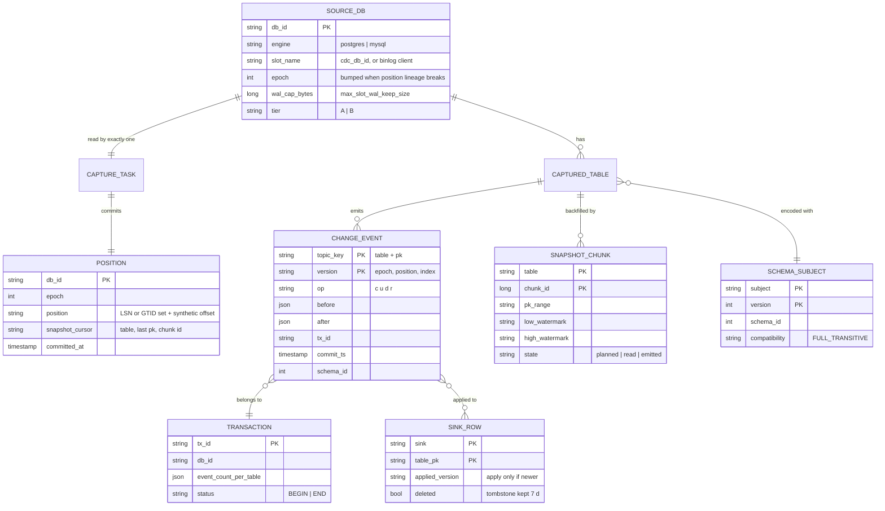

Access patterns that justify it:
- **"Where do I resume?"** is `POSITION` by `db_id`, one row per database, written after every Kafka ack (Kafka Connect's offsets topic). The database side keeps its own copy (`confirmed_flush_lsn` on the slot), always at or behind this one.
- **"Is this change newer than what I hold?"** is `SINK_ROW.applied_version` by `(sink, table, pk)`. It is a column in the mirror table, the external version of a search document, a field in the service's inbox row. It is the exactly-once lookup and it lives with the data it guards.
- **"Which schema decodes this event?"** is `SCHEMA_SUBJECT` by `schema_id`, immutable, cached forever by every consumer.
- **"Has this transaction fully arrived?"** is `TRANSACTION` by `tx_id` for the few sinks that ask for atomicity (§5.3).
- **Partition key** of every change topic is the primary key (plus the table in grouped topics). That is what gives per-key order, and nothing else in the design gives any order at all.

---

## 4. High-level design

One subsection per functional requirement. Each one traces a change through the boxes, adds the boxes it needs to one growing diagram, and ends with what is still missing (fixed by a deep dive in §5). The design at the end of §4 is deliberately single-reader, single-region and naive about failures.

### 4.1 Capture: every committed change leaves the database, in commit order, within seconds

What breaks on the way to the answer:
- **Polling `updated_at`** (§3.2): misses deletes, intermediate states, long transactions. Dead.
- **Triggers** writing each change into an audit table, then polling the audit table: captures deletes and every state, but doubles every write inside the user's transaction (the trigger's insert is on the commit path), and the audit table is now the hottest table in the database.
- **Dual writes from the application:** not atomic (§1). The copy drifts on the first partial failure, silently.
- **Read the database's own log.** The log is written anyway, is in commit order, contains deletes and every state, and only has committed data. The cost moves to the reader, and the reader's position pins the log (§5.1).

**Flow: one transaction on Postgres database `orders_db`**

1. One-time setup per database: `wal_level = logical`, a publication listing the captured tables, a logical slot `cdc_orders_db` using the built-in `pgoutput` plugin. Onboarding refuses a table without a primary key unless its owner first sets `REPLICA IDENTITY FULL` or `USING INDEX`: Postgres rejects UPDATE and DELETE on a published table with no usable replica identity, so adding it to the publication as-is would break production writes, and CDC would have no key to partition by anyway. On MySQL: `binlog_format = ROW`, `binlog_row_image = FULL`, `binlog_row_metadata = FULL` (column names in the log), GTIDs on.
2. The capture task for `orders_db` (a Debezium connector, one task, because one slot can have only one reader) connects to the slot and asks for changes after its stored position.
3. The application commits `BEGIN; UPDATE orders SET status='paid' WHERE id=42; INSERT INTO payments ...; COMMIT`. Postgres decodes the transaction when it commits and sends it whole, in commit order: `Begin`, `Relation` messages for any table whose schema the reader has not seen, the two row changes, `Commit` with the commit LSN. Aborted transactions never appear. Nothing is visible before commit.
4. The task turns each row change into an envelope, sets the Kafka key to the primary key, looks up the schema id in the registry (registering a new version if the table changed, §4.4), and stamps the **version** `(epoch, commit LSN, index in transaction)`. Debezium's own `source` block has `lsn`, `txId` and `sequence`, not this tuple, so the platform adds it in a small post-processor; pgoutput's `Begin` message already carries the transaction's commit LSN, so it is known before the first row. It produces to the table's topic with `acks=all` and the idempotent producer.
5. Kafka acknowledges each batch. Periodically (`offset.flush.interval.ms`, 60 s by default in Kafka Connect) Connect writes the latest acknowledged source offset (the LSN) to its offsets topic. After that commit, the task confirms the LSN back to Postgres (`confirmed_flush_lsn`), which is the only thing that lets Postgres recycle the WAL behind it. The order is fixed: **Kafka ack, then offset commit, then confirm to the database.** Confirm first and a crash loses changes. Commit rarely and a crash re-sends up to 60 s of events, which §4.3 makes harmless.
6. Every 10 s the task emits a heartbeat, and on quiet databases runs `heartbeat.action.query` (a tiny insert into a heartbeat table) so the slot keeps moving even when the captured tables are idle. Without it, a quiet database on a busy cluster holds WAL forever: the WAL is shared by the cluster, the slot is per database, and a slot that sees no events never confirms anything ([Debezium, WAL disk space consumption](https://debezium.io/documentation/reference/stable/connectors/postgresql.html)).

**Why the version is (epoch, commit position), not the change's own LSN.** Postgres interleaves the WAL records of concurrent transactions and emits transactions in commit order. A transaction that wrote row `k` at LSN 90 but committed at LSN 200 is emitted after one that committed at LSN 150. Two transactions cannot both have written `k` concurrently (row lock), so per key the commit LSN only goes up. The index breaks ties inside one transaction. The epoch is bumped by the control plane whenever the position lineage breaks (a lost slot, an unsafe failover, a MySQL failover to a server with different binlog offsets), so every event of a new lineage outranks every event of the old one (§5.2). On MySQL, the position is a synthetic 64-bit offset: cumulative bytes across binlog files in the current lineage.

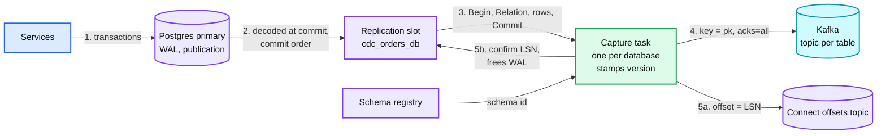

Data model so far: `SOURCE_DB(slot_name, epoch)`, `POSITION(db_id, epoch, position)`, `CHANGE_EVENT(key, version, op, before, after, tx_id)`.

**What is still missing:** (a) the slot pins WAL for as long as the task is behind or down, on the production primary (§5.1, the red node). (b) The rows that existed before the slot was created are not in the log (§4.2). (c) If the primary fails over, is the slot still there? (§5.2). (d) One task per database is a throughput ceiling (§5.4). (e) The order and the payment went to two topics; a consumer can see one without the other (§5.3).

### 4.2 Snapshot and handoff: existing rows arrive without a lock, a gap, a double apply, or time travel

The log only has what changed since the slot was created, and a Postgres WAL or MySQL binlog is kept for hours or days, not years. Existing rows have to be read from the tables and merged into the stream. The hard part is the seam.

What breaks on the way to the answer:
- **Lock, copy, record position, unlock.** Correct and simple. Blocks writers for the copy. Debezium's classic initial snapshot "will hold a read lock on the table ... Snapshots can take hours to complete" ([Shopify](https://shopify.engineering/capturing-every-change-shopify-sharded-monolith)). On a 2 TB table that is an outage.
- **Record the position first, copy without a lock, then replay the log from that position, and let the sink upsert.** Notion does this: start Debezium, at time `t` start an RDS export to S3, load the export, then replay Kafka from `t` into an upsert table ([Notion](https://www.notion.com/blog/building-and-scaling-notions-data-lake)). No lock. Correct, because every change after `t` is replayed in order over the copy and the last write wins. Three costs: (1) during the replay the sink **time-travels**: a row can go from its newest state (in the copy) back to an older one (an early replayed change) and forward again, which a search index serving users cannot show; (2) it is all-or-nothing per table, with no pause, no resume, no "re-copy these 10k keys"; (3) a consistent copy without an export service means holding one snapshot open for hours (Postgres exported snapshot), which pins the vacuum horizon and bloats every busy table on the database.
- **Watermark-chunked snapshot (DBLog).** Read the table in small primary-key chunks, each bracketed by two markers written into the log, and let the log decide which snapshot rows are stale. No lock, no long transaction, pausable per chunk, runnable for a key range at any time, no time travel. This is the answer.

**Flow: chunk k of table `orders` (8,096 rows, Flink CDC's default chunk size; Debezium's is 1,024)**

1. The snapshot worker picks the next chunk: `pk > last_pk_of_chunk_k-1`, up to 8,096 rows.
2. It writes the **low watermark** `LW_k` into the log: a single-row update of a signal table in the source database (Debezium's `signal.data.collection`) or, on Postgres, a transactional logical message. It is an ordinary commit, so it appears in the change stream at a known position.
3. It reads the chunk: `SELECT * FROM orders WHERE id > :a ORDER BY id LIMIT 8096` at read committed. The read may run on a **replica**, after checking that the replica has replayed at least up to `LW_k` (`pg_last_wal_replay_lsn() >= LW_k`, or the GTID set on MySQL). The rows go into a buffer keyed by primary key.
4. It writes the **high watermark** `HW_k` into the log.
5. The capture task keeps streaming the log in order; it never pauses for the read. When it sees `LW_k` it starts recording every key **in chunk k's primary-key range** that changes, and publishes those change events as usual. (The DBLog paper pauses log processing for the few milliseconds of a primary-key-index read so the buffer exists before `LW_k` is processed. A replica read takes longer, so this variant records the changed keys by range and subtracts them later.)
6. When the task sees `HW_k`, it hands the recorded key set to the chunk. The chunk rows minus those keys are published as `op = r` events, keyed by primary key into the same topic, each with version `(epoch, position of HW_k, 0)`. Small tables are published by the task itself; big tables by the snapshot worker (§5.4), which is safe because the version, not the producer, decides the order at the sink.
7. The chunk cursor (table, last pk, chunk id) is saved with the connector offset, so a crash resumes at the next chunk, not the beginning of the table.

**Why it is correct.** The chunk read happened somewhere between `LW_k` and `HW_k`. For a key the read returned, either some transaction changed it with a commit between the watermarks, and then the change event (newer or equal to what the read saw) is published and the snapshot row is dropped; or nothing changed it between the watermarks, and then its state at the read equals its state at `HW_k`, so publishing it at `HW_k` with that version is exact. A change that committed before `LW_k` is already in the read. A change that commits after `HW_k` comes later in the same partition with a higher version. The DBLog paper states the two requirements: the log must be in commit order, and the read must see everything committed before it started ("non-stale reads"), which read committed gives ([DBLog](https://arxiv.org/pdf/2010.12597)). The replica trick in step 3 keeps both: the replica has replayed past `LW_k` and cannot be past `HW_k`, because `HW_k` is written after the read returns.

**A new consumer never snapshots the source again.** When a team adds a search index on a table that is already captured, it bootstraps from the lake mirror at a table version whose commit recorded the Kafka offsets it had consumed (the `txn`-marker idea from [`../streaming-ingestion/`](../streaming-ingestion/) §4.1), then consumes Kafka from exactly those offsets. The versioned apply (§4.3) makes the overlap harmless. LinkedIn's Databus built this as a separate bootstrap service for the same reason: new and lagging consumers must not land on the source ([Databus](https://dl.acm.org/doi/10.1145/2391229.2391247)). The condition is that Kafka retention (7 days) is longer than the bootstrap.

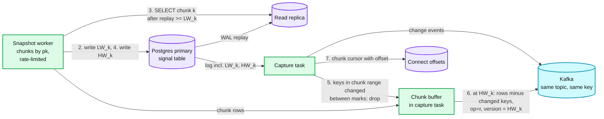

Data model so far: `SNAPSHOT_CHUNK(table, chunk_id, pk_range, low_watermark, high_watermark, state)`, `POSITION.snapshot_cursor`, events with `op = r`.

**What is still missing:** one chunk at a time at 20k rows/s is 55.6 h for the 4 B-row table (§5.4 adds parallel chunk readers). The watermark needs a write into the source database, which some teams forbid (read-only variants use the database's own snapshot boundaries: GTID sets on MySQL). A DDL on the table while its snapshot runs breaks the buffered chunk's schema; Debezium's Postgres connector does not support schema changes during an incremental snapshot ([Debezium](https://debezium.io/documentation/reference/stable/connectors/postgresql.html)), so §4.4 pauses the snapshot on DDL. Details in [`deep-dives/snapshot-and-stream-handoff.md`](deep-dives/snapshot-and-stream-handoff.md).

### 4.3 Deliver with exactly-once effect: every sink converges to the source's state per key

Every hop is at-least-once: the connector re-sends after a crash (Debezium: "consumers should always anticipate some duplicate events"), a sink consumer re-reads after a rebalance, the snapshot and the stream overlap, a failover replays. Exactly-once has to be an effect at the sink, not a property of the pipe.

What breaks on the way to the answer:
- **Apply what arrives, last arrival wins.** Duplicates are harmless for a plain upsert, but anything that re-orders breaks it: a replay after a rebalance re-applies an old `u` over a newer one until the partition catches up; a stale snapshot row overwrites a change; a delete followed by a replayed insert resurrects a row.
- **Kafka exactly-once end to end.** KIP-618 lets the connector write records and its offsets in one Kafka transaction ([Debezium EOS](https://debezium.io/documentation/reference/stable/configuration/eos.html)), and a Kafka Streams hop can be transactional too. That removes duplicates **inside Kafka**. It does nothing for a write to Elasticsearch, Redis, a lake table or another service's database, which is where every sink here lives. Debezium's own page adds that the correctness of Kafka transactions is not proven and lists open Kafka issues. Useful, not sufficient.
- **Versioned idempotent apply.** Every sink stores, next to each row, the version it last applied for that key, and applies a change only if its version is newer. One rule gives three properties: duplicates are no-ops (equal version), replays and late arrivals are no-ops (lower version), and the snapshot merges with the stream (snapshot rows carry `HW_k`). No coordination, no transaction across systems.

**Flow: one change fans out to four sinks, each on its own consumer group**

1. **Lake.** A micro-batch job (the [`../streaming-ingestion/`](../streaming-ingestion/) landing job) reads an offset range per trigger. It appends every event to the **changelog table** (history, audit, and the replay source once Kafka's 7 days are gone), then applies the batch to the **mirror table**: keep the highest version per key within the batch, then `MERGE ... WHEN MATCHED AND src.version > tgt.version THEN UPDATE (or DELETE) WHEN NOT MATCHED AND op != 'd' THEN INSERT`. On Databricks this is `AUTO CDC INTO mirror ... KEYS (id) SEQUENCE BY STRUCT(epoch, pos, idx) APPLY AS DELETE WHEN op = 'd'` ([Databricks](https://docs.databricks.com/aws/en/ldp/cdc)). The table commit carries the `txn` marker `(appId, batch)`, so a re-run of a batch is skipped, and it also writes the batch's Kafka end offsets into the commit metadata, so a new consumer can start from the mirror at exactly those offsets.
2. **Search.** A consumer reduces each poll to the last change per key, then bulk-indexes with `version_type=external_gte` and `version = epoch << 56 | commit LSN`. Elasticsearch rejects a lower version with a 409, which the consumer counts and ignores; its docs make exactly this point: with versions from the source database "there is no need to maintain strict ordering of async indexing operations" ([Elasticsearch](https://www.elastic.co/docs/api/doc/elasticsearch/operation/operation-index)). `external_gte` (not `external`) because two changes to one key in one transaction share a commit LSN and the later one must win.
3. **Cache.** A consumer turns each change into `DELETE key` in the cache. Deletes commute and repeat safely, so this sink needs no version at all. It is the backstop behind the application's own delete-on-write, catching writes that bypass the application (migrations, admin scripts), with a stated staleness bound of ~5 s (see [`../../concepts/caching-patterns.md`](../../concepts/caching-patterns.md) and [`../distributed-cache/`](../distributed-cache/)).
4. **Services.** A consuming service writes the change and its version into its own database in one local transaction, guarded by `WHERE stored_version < :version` (an inbox row per key). Its side effects hang off its own outbox. See [`../../concepts/exactly-once.md`](../../concepts/exactly-once.md).

**Deletes.** A delete is a version too. A sink that forgets a deleted key cannot reject a late insert for it, so every sink keeps a tombstone `(key, version, deleted = true)` for at least the replay window (7 days, Kafka retention). Elasticsearch forgets delete versions after `index.gc_deletes` (60 s by default), so the search consumer writes a soft-delete document instead of a real delete, and a nightly job purges soft-deleted documents older than 7 days.

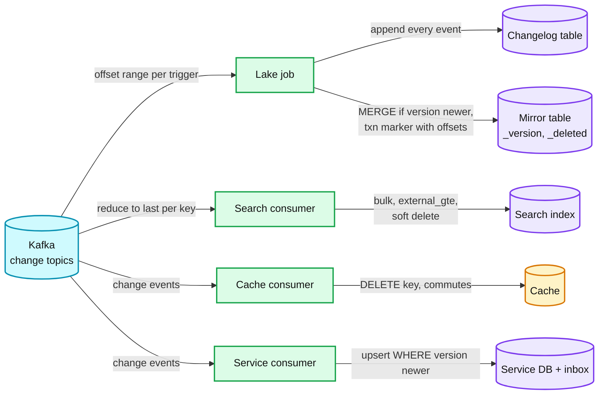

Data model so far: `SINK_ROW(sink, table_pk, applied_version, deleted)` as a column in every sink, mirror columns `_version`, `_deleted`, `_commit_ts`, changelog columns `op, before, after, version, tx_id`.

**What is still missing:** a `MERGE` on the 2 TB mirror touches every file every minute (§5.5). A consumer that must not show half a transaction needs more than per-key versions (§5.3). The version must still go up across a failover to a server whose positions differ (§5.2). Details in [`deep-dives/exactly-once-sinks.md`](deep-dives/exactly-once-sinks.md).

### 4.4 Schema changes: DDL on a captured table flows through without stopping capture

A captured table is an API. Its schema changes on the owning team's schedule, not ours. Three rules: **additive changes flow automatically, breaking changes are stopped before they ship, and the change reaches every sink at the exact log position where it happened.**

How DDL shows up:
- **Postgres** logical decoding does not emit DDL at all ([Debezium](https://debezium.io/documentation/reference/stable/connectors/postgresql.html)). After an `ALTER TABLE`, pgoutput sends a fresh `Relation` message before the next row of that table, and the new shape is visible on that row. So the schema change is discovered on the first row after it, at the right position, but the DDL statement itself is never seen.
- **MySQL** writes DDL into the binlog as a `Query` event, in order with the rows. The connector parses it and keeps a **schema history topic** so that, after a restart from an old position, it can decode old rows with the schema that was current at that position. That topic needs infinite retention; lose it and the connector cannot interpret the binlog and must re-snapshot.

**Flow: `ALTER TABLE orders ADD COLUMN coupon text` (additive)**

1. The capture task sees the next `orders` row with a column it does not know (a new `Relation` message on Postgres, a parsed `Query` on MySQL).
2. It derives the new Avro schema (new optional field with a default) and registers it under `orders-value`. The subject's compatibility is `FULL_TRANSITIVE`, so the registry accepts it and returns a new schema id. Why not the common `BACKWARD` default: in CDC the producer always upgrades first (the DDL has already run), so consumers on the old schema must read new data, which is `FORWARD`; and consumers rewind to replay old data with new code, which is `BACKWARD`. Both, against every earlier version, is `FULL_TRANSITIVE`. A nullable column added or dropped passes. Widening `int` to `bigint` does not (an old reader cannot read a long), so it goes through the breaking path.
3. Events from that row on carry the new id. Consumers fetch it once and cache it.
4. The lake job adds the column to the mirror and changelog in the same commit as the batch that first carries it (additive schema evolution). Search and service consumers ignore fields they do not map yet.

**`TRUNCATE` is a delete of every older version of one table.** Debezium emits it as `op = t` but skips it by default (`skipped.operations = t`), and the event has no message key, so on a multi-partition topic it has no order relative to the row changes around it. A silently skipped truncate leaves every sink holding rows the source no longer has. Policy: truncate is enabled in the connector, and the platform turns each truncate into a **version-range delete** control record: "delete every row of this table whose version is below the truncate's version". Rows written after the truncate carry higher versions and survive, so the record is correct whenever it is applied and needs no ordering against the row events. It is the same primitive as the epoch sweep in §5.2. The CI gate flags `TRUNCATE` on captured tables so owners use `DELETE` in batches when they mean it row by row.

**Flow: `ALTER TABLE orders ALTER COLUMN amount TYPE numeric(20,4)` or a rename (breaking)**

1. The derived schema is incompatible (a type change), or it looks like drop plus add (a rename: the old field disappears, a new one appears, and downstream queries on the old name silently return null). A rename to a nullable column **passes** `FULL_TRANSITIVE` (dropping an optional field and adding an optional field are both allowed), so the registry alone cannot catch it.
2. Before it reaches production: the owning team's migration CI runs a **CDC contract check** against the registry for every captured table it touches. It fails on registry-incompatible changes and also on "one field removed and one added in the same migration", which is how a rename looks. A breaking change fails the build with the expand/contract recipe: add the new column, dual-write in the application, backfill, move consumers, drop the old column later.
3. If it reaches production anyway (a hand-run migration): the registry rejects the new schema. The capture task **parks that table**: its events go to a holding topic as schemaless JSON with their versions, the other tables of the database keep flowing, the slot keeps advancing, and the owner is paged. The owner decides: register the new shape as a new table version and replay the holding topic into it, or accept the change and re-snapshot the table under the new schema. Parking matters because the alternative (Kafka Connect's default `errors.tolerance = none` fails the task on a conversion error) stops the whole database's stream and turns a schema argument into a WAL-budget emergency (§5.1).

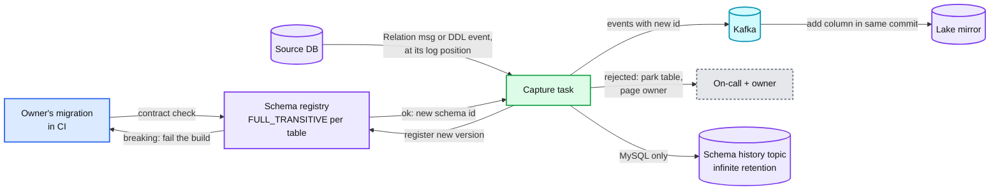

Data model so far: `SCHEMA_SUBJECT(subject, version, schema_id, compatibility)`, `schema_id` on every event, `CAPTURED_TABLE.state ∈ {streaming, snapshotting, parked}`, one holding topic per database for parked tables.

**What is still missing:** a rename is indistinguishable from drop plus add in the Postgres stream, so without the CI gate it silently splits a column's history in two. A DDL during a table's snapshot changes the shape of buffered rows, so the snapshot of that table pauses and restarts its current chunk. Consumers that must not follow the source's internal schema at all (another company, another org) should read an outbox table with a versioned payload, not the raw table. Details in [`deep-dives/schema-evolution-and-ddl.md`](deep-dives/schema-evolution-and-ddl.md).

---

## 5. Deep dives

One per non-functional requirement, phrased as the question the interviewer asks. Each one names what breaks in the §4 design with a number, fixes it, and lists what changed in the API, the data model and the diagram.

### 5.1 "How do you make sure CDC can never take down the production database?" The slot budget

**What breaks.** A logical replication slot tells Postgres "do not recycle WAL past `restart_lsn`, my reader still needs it". That is the whole durability guarantee of §4.1, and it is also a promise Postgres keeps at any cost: with `max_slot_wal_keep_size = -1`, the default, "replication slots may retain an unlimited amount of WAL files" ([Postgres](https://www.postgresql.org/docs/current/runtime-config-replication.html)). Every way the reader falls behind turns into WAL on the primary's disk:
- **Connector down.** A crash loop, a bad deploy, a Connect cluster rebalance storm. On the busy primary: 50 MB/s × 3,600 s = **180 GB per hour**.
- **Kafka unavailable to the connector.** The producer retries, Debezium's in-memory queue (`max.queue.size`, 8,192 records) fills, the task stops reading. Same growth.
- **Reader slower than the database.** The 60k/s database against a 20k/s reader grows the backlog without anything being "down" (§5.4).
- **A quiet database on a busy cluster.** The WAL belongs to the whole cluster, the slot to one database. No captured changes means nothing to confirm, so the slot never moves while the neighbours write gigabytes ([Debezium](https://debezium.io/documentation/reference/stable/connectors/postgresql.html)).
- **An orphaned slot.** A pipeline was decommissioned and nobody dropped its slot. It pins WAL forever.
- **The catalog horizon.** A slot also holds `catalog_xmin`, so a stuck slot stops vacuum on the system catalogs too.

The disk fills, the primary stops accepting writes, and CDC has turned a copy's problem into the product's outage. That is why this node is red.

Note what does **not** hold WAL: a slow sink. Kafka sits between the capture task and every sink, so a search cluster that is down for a day only grows consumer lag in Kafka. Only the path from the database to Kafka holds the slot.

**Fix.**
1. **Cap every slot, and say what you are choosing.** `max_slot_wal_keep_size` per cluster, sized from free disk: 500 GB on the busy primary (2.8 h of budget at peak, ~8.3 h at the average rate), 50 GB on a median one (~14 h). When a slot passes the cap, Postgres marks it `unreserved` and then `lost` (`invalidation_reason = wal_removed`) and the primary keeps its disk ([pg_replication_slots](https://www.postgresql.org/docs/current/view-pg-replication-slots.html)). CDC then has to rebuild: new slot, epoch + 1, DBLog re-snapshot of the database (§4.2, §5.2). That is hours of background work with no lock. The alternative is a production outage. Choose the rebuild. One side effect to plan for: the setting is cluster-wide, so it caps **physical** standby slots too. A standby that is down longer than the budget loses its slot and has to be re-cloned, which the database team must accept when the cap is set.
2. **Alarm in hours, not bytes.** `budget_h = safe_wal_size ÷ current WAL rate` per slot (`safe_wal_size` is in `pg_replication_slots` once a cap is set). Warn when budget < 50% of its full value, page when < 1 h. The connector's recovery SLO (15 min) is sized against the smallest budget in the fleet, so a routine crash never gets near the cap.
3. **Heartbeats on quiet databases.** `heartbeat.interval.ms = 10000` and `heartbeat.action.query = INSERT INTO cdc_heartbeat ...` so every slot confirms at least every 10 s.
4. **No orphans.** The control plane reconciles every slot on every cluster against the pipeline registry every 10 min; a slot with no registered pipeline pages and is dropped after 24 h. On Postgres 18, `idle_replication_slot_timeout` (default 0, off) is set to 3 days as the last-resort sweeper for slots nobody reads.
5. **Snapshot reads off the primary.** Chunk reads go to a replica (§4.2 step 3) under a per-database token bucket (default 20k rows/s), and pause automatically when replica lag > 30 s or primary CPU > 70%. No exported snapshots held open for hours on busy databases (they pin the vacuum horizon).
6. **Decode off the primary for the top 20 databases.** Postgres 16+ can decode on a hot standby. The walsender's CPU and the WAL retention both move to a dedicated CDC standby; if its disk fills, a standby dies, not the primary. The price: `hot_standby_feedback` must be on (so the primary keeps catalog rows the standby's slot needs), a slot on a standby cannot be a failover slot (synced slots "can neither be used for logical decoding nor dropped manually"), so losing that standby means a new slot and a re-snapshot, and creating the slot waits for activity on the primary ([Postgres](https://www.postgresql.org/docs/current/logicaldecoding-explanation.html)).
7. **MySQL is the mirror image.** The binlog is purged by age (`binlog_expire_logs_seconds`, 30 days by default in 8.4) whether or not a reader has consumed it. CDC can never fill a MySQL disk; instead a connector that falls more than the retention behind loses its position and must re-snapshot. Same budget alarm, opposite failure.

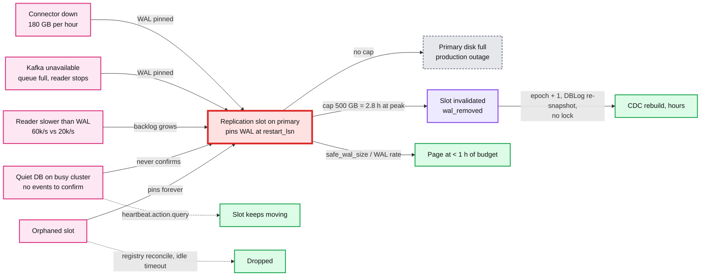

**Push back on the textbook answer.** Most CDC setups leave `max_slot_wal_keep_size` at -1 because "losing the slot means a full re-snapshot". That argument made sense when a snapshot meant a table lock. With watermark chunks it means hours of rate-limited background reads, while an unbounded slot means the primary can go down because a Kafka Connect worker was OOM-killed on a Saturday. The copy must be the thing that breaks.

**What changed.** API: `SOURCE_DB.wal_cap_bytes`, `SOURCE_DB.decode_from ∈ {primary, cdc_standby}`, per-database snapshot token bucket. Metrics: `slot_budget_hours`, `slot_wal_status`. Data model: `SOURCE_DB.epoch` gets a reason log. Diagram: the slot turns red, a CDC standby appears for the top databases. Details in [`deep-dives/source-safety-and-slot-budget.md`](deep-dives/source-safety-and-slot-budget.md).

### 5.2 "The connector crashes, the primary fails over, Kafka goes away. What is lost or duplicated?"

**What breaks.**
1. **Connector crash.** Offsets are committed every 60 s. A crash re-sends up to 60 s of events: 3.6 M duplicates on the 60k/s database. Postgres adds its own: a slot's position "is persisted only at checkpoint, so in the case of a crash the slot might return to an earlier LSN", and "logical decoding clients are responsible for avoiding ill effects" ([Postgres](https://www.postgresql.org/docs/current/logicaldecoding-explanation.html)).
2. **Postgres failover before version 17, or without failover slots.** The slot lives only on the old primary. The new primary has no slot, so everything committed there before someone recreates one is invisible to CDC forever. Debezium's documented recovery is to create the slot before writes resume and then re-snapshot with `snapshot.mode = always` ([Debezium](https://debezium.io/documentation/reference/stable/connectors/postgresql.html)).
3. **Phantom changes.** With asynchronous replication, the old primary can decode a transaction, CDC can publish it, and the primary can die before the standby receives it. After promotion the sinks hold a change the database never had, and the new primary writes new transactions into the same LSN range: same version numbers, different content. Per-key version checks now reject real changes as "older".
4. **MySQL failover.** File and offset positions are per server. A GTID set survives, the byte offsets do not, so the synthetic position would jump backwards.
5. **Kafka unavailable.** Nothing is lost (the slot holds it), but the budget of §5.1 is running.

**Fix.**
1. **Duplicates are the easy case.** The versioned apply of §4.3 rejects every re-sent event. On top of that, for topics consumed by services, KIP-618 exactly-once source support is on (`exactly.once.source.support=enabled` on Connect workers, `exactly.once.support=required` on the connector, Kafka Connect 3.3+, distributed mode) so records and offsets commit in one Kafka transaction and `read_committed` consumers never see the re-sent copies. The design does not depend on it: Debezium itself says the correctness of Kafka transactions is not established ([Debezium EOS](https://debezium.io/documentation/reference/stable/configuration/eos.html)).
2. **Postgres 17+: failover slots and no phantoms.** Create the slot with `failover = true` (Debezium `slot.failover = true`). On the standby: `sync_replication_slots = on`, a physical slot to the primary (`primary_slot_name`), `hot_standby_feedback = on`. On the primary: list that standby's physical slot in `synchronized_standby_slots`, which makes logical walsenders send decoded changes only after the standby has confirmed the WAL ([Postgres](https://www.postgresql.org/docs/current/runtime-config-replication.html)). That closes the phantom window: CDC can never be ahead of the machine that will be promoted. After promotion the connector reconnects, finds the synced slot, and continues in the same epoch, because LSNs continue across a promotion.
3. **The cost of (2).** CDC latency now includes standby replication lag. And "logical replication will not proceed if the slots specified in `synchronized_standby_slots` do not exist or are invalidated": a dead standby stalls CDC and starts burning slot budget. Runbook: replacing or removing a standby updates the list in the same change.
4. **Anything unsafe bumps the epoch.** Slot lost at the cap, failover without a synced slot, promotion of a server that was not in `synchronized_standby_slots`, loss of a CDC standby's slot, a major upgrade from 16 or older (pg_upgrade migrates logical slots only from 17). The control plane sets `epoch = epoch + 1` and creates a slot on the new primary. Every event of the new epoch outranks every event of the old. A snapshot only re-emits rows that still exist, so every repair ends with a **sweep**: rows deleted while CDC was blind and phantom inserts never get a new-epoch event, so once the repair finishes, each sink deletes that source's rows (or, for a targeted repair, those keys) whose version is still below the new epoch. A targeted repair also emits an `op = d` at the high-watermark version for any requested key the snapshot read does not find. The repair depends on whether writes happened before the new slot existed:
   - **Slot created before the new primary took writes** (the runbook order): no change is missed. Only phantoms can be wrong, and on Postgres they are exactly the old-epoch events published past the promotion's timeline switch LSN. Re-snapshot those keys (read from Kafka), minutes of work.
   - **Writes before the slot existed, or the slot lost at the cap:** changes are missing, so run a full DBLog re-snapshot of the database. Hours, rate-limited, no lock.
   - **Planned major upgrade from 16 or older:** drain CDC to the end with writes stopped, upgrade, create the slot before writes resume, bump the epoch. No re-snapshot.
5. **MySQL: GTID resume, epoch bump, targeted repair.** The connector stores the executed GTID set in its offsets and resumes on the new primary from it. Positions differ, so the epoch bumps and the synthetic offset rebases. Phantoms are possible if the connector read a transaction before any replica had it, so after an unplanned MySQL failover the control plane re-snapshots only the keys of events produced to Kafka in the last 60 s before the failover. It reads Kafka, not the lake changelog, because a tier B lake can be 10 minutes behind. Bounded, cheap, and exact.
6. **Kafka outage.** Kafka is 3 AZs with `min.insync.replicas = 2`; a full outage is the one case where every slot's budget burns at once, so the page for "Kafka unavailable to Connect" is sent at 5 min, long before any budget is near.

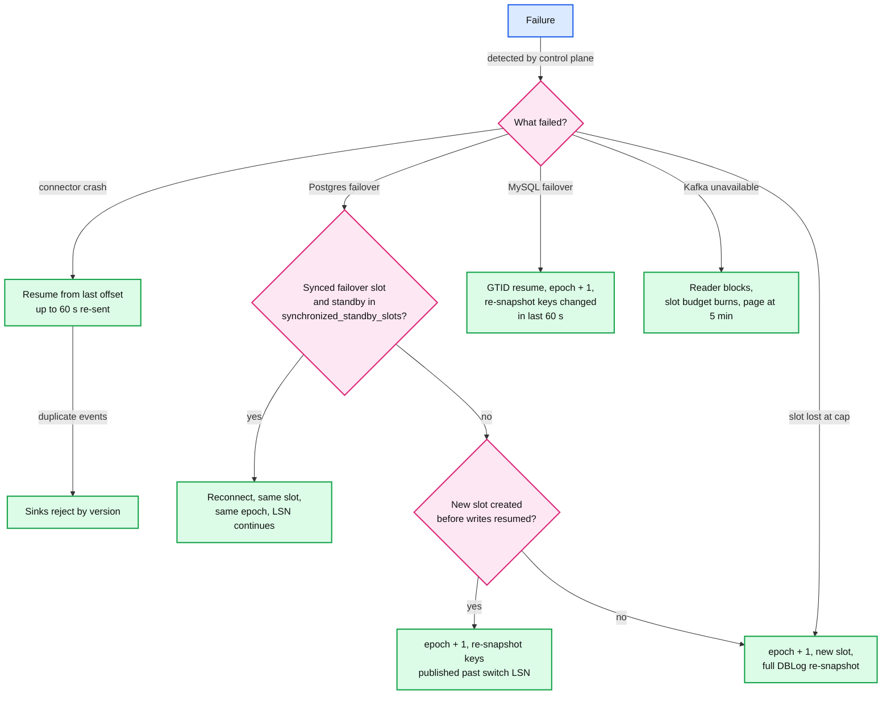

**Push back on the textbook answer.** "Turn on Kafka exactly-once" answers the question nobody should be worried about. Duplicates are harmless once sinks are versioned. The failures that corrupt data are the ones no Kafka feature can see: a change published from a timeline that the failover threw away, and a new primary reusing the same positions. The fix lives at the source (`synchronized_standby_slots`) and in the version (the epoch).

**What changed.** API: `failover(db)` runbook hook that bumps the epoch and schedules repair. Data model: `SOURCE_DB.epoch` with reason, `POSITION.epoch`, version = `(epoch, position, index)` everywhere. Config: failover slots and `synchronized_standby_slots` on every Postgres 17+ cluster. Details in [`deep-dives/failover-and-recovery.md`](deep-dives/failover-and-recovery.md).

### 5.3 "Can a consumer see half a transaction? And what does a 10 M-row UPDATE do?"

**What breaks.**
1. **Order is per key, not per transaction.** `INSERT INTO orders` and five `INSERT INTO order_items` are one transaction and land in two topics on different partitions. A consumer of both sees the order before its items or the items before the order, depending on consumer lag. A dashboard counts an order with zero items; a service rejects an item whose parent it has not seen.
2. **A large transaction stalls the whole database.** A backfill runs `UPDATE events SET region = ...` on 10 M rows in one transaction. Postgres decodes at commit, so the decoder holds the transaction in memory up to `logical_decoding_work_mem` (64 MB by default) and **spills the rest to disk on the primary**. At commit the stream emits 10 M events in one burst. The reader is serial, so every other table on that database waits behind them: 10 M ÷ 20k/s = **500 s, about 8 minutes of lag** on every table, and the search p99 of 5 s is gone.

**Fix.**
1. **State the default promise out loud.** Per-key order and eventual consistency across keys. Most sinks (search, cache, lake mirror) only need that.
2. **Transaction boundaries for the sinks that pay for them.** `provide.transaction.metadata = true` publishes `BEGIN` and `END` per transaction on a per-database topic, with `event_count` per table, and stamps each event with `(tx_id, total_order, data_collection_order)` ([Debezium](https://debezium.io/documentation/reference/stable/connectors/postgresql.html)). A sink that needs atomicity (a relational replica, a materialized view) consumes the tables involved plus the transaction topic, buffers events per `tx_id` until it has `END` and every counted event, then applies them in one local transaction. Materialize does the same thing for Postgres sources: every update in one source transaction gets the same timestamp ([Materialize](https://materialize.com/blog/strong-consistency-in-materialize/)). Cost: latency of the slowest topic in the transaction, buffer memory bounded by the largest transaction, and co-consumption of several topics.
3. **The lake gives per-table atomicity and a cross-table cut.** One mirror commit per table per batch cannot be atomic across tables. Every row carries `_tx_id` and `_commit_ts`, the changelog is complete, and the lake job publishes a per-database watermark "every table is applied through commit timestamp T". Idle tables would pin T forever, so the lake job also consumes the database's heartbeat topic: a table whose partitions were fully drained in a batch counts as applied through the last heartbeat produced before that batch's end offsets were read. A reader that needs a consistent cross-table view queries the history tables as of T.
4. **Services get an outbox, not a join.** A service that needs "an order with its items" should not reassemble it from row changes. The owner writes one outbox row per business event in the same transaction, and consumers get the whole thing in one message.
5. **Large transactions are a source-side contract.** Migration tooling batches backfills into transactions of at most 10k rows. The platform alarms on `spill_bytes` in `pg_stat_replication_slots` and raises `logical_decoding_work_mem` to 512 MB on the top databases (one buffer per walsender, and there is one walsender per slot, so a database split into several slots in §5.4 pays it several times). pgoutput can stream in-progress transactions before commit (protocol v2, Postgres 14+) and stop spilling, but then aborted work reaches the connector and "only committed data leaves the database" is gone; not worth it for a CDC platform.

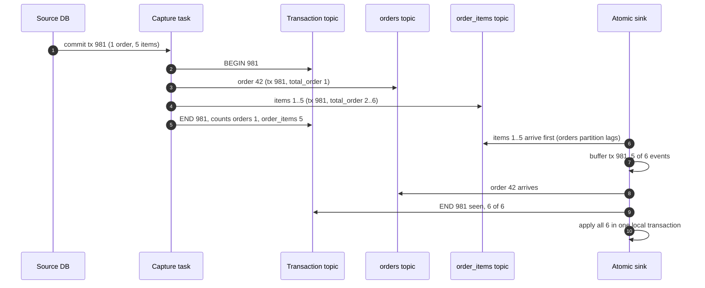

**Push back on the textbook answer.** "Put every table of a database in one partition so transactions stay together" gives total order per database, and caps every consumer of that database at one thread forever. Transaction metadata gives atomicity only to the few sinks that ask, and everyone else keeps partition parallelism.

**What changed.** API: `add_sink(..., atomic = true)`. Data model: `TRANSACTION(tx_id, event_count_per_table)`, `_tx_id` and `_commit_ts` on every lake row, per-database lake watermark. Config: `logical_decoding_work_mem` per tier, spill alarm, migration batch limit. Details in [`deep-dives/transactions-and-ordering.md`](deep-dives/transactions-and-ordering.md).

### 5.4 "How does this scale to 2,000 databases, and to the one database that outruns its reader?"

**What breaks.**
1. **The serial reader.** The largest database peaks at 60k changes/s against ~20k/s per task. It is 3x over at peak and the slot budget (§5.1) burns every afternoon.
2. **Topic count.** Topic per table is 50k topics and 150k+ partition replicas.
3. **One Connect cluster for 2,000 connectors.** A rebalance restarts tasks across the cluster; a crash-looping connector config churns everyone.
4. **Fleet bootstrap.** ~1 T rows at 20k rows/s per database is weeks if run one database at a time, and a stampede on the replicas if run all at once.
5. **The 4 B-row table.** 55.6 h with one chunk reader.

**Fix.**
1. **Raise the ceiling in this order.** (a) Tune the task: Avro with cached schemas, `max.batch.size` from 2,048 up to 8,192, a larger `max.queue.size`, producer compression, and no single-message transforms inside the connector (routing moves downstream). (b) Decode on a CDC standby (§5.1.6) so the decode CPU is off the primary. (c) Split the database into 2 to 4 slots with disjoint publications, one task each. Each extra slot decodes the whole WAL of the database again (the decoder assembles every transaction before the publication filter drops tables), so 3 slots is 3x decode CPU and 3 walsenders on the source, and a transaction that spans two groups is split across two streams. (d) The real fix is on the source: a database doing 60k changes/s is usually the one that should be sharded, and then each shard is its own database with its own slot (Notion: one connector per host over 480 shards; Shopify: ~150 connectors over 100+ shards).
2. **Group quiet tables.** The ~2,000 tables above 100 changes/s get their own topics (~6 partitions each, ~12k). The ~48k quiet tables go to one topic per database keyed by table plus primary key (~4k partitions). Per-key order is unchanged. ~16k partitions, ~48k replicas, ~15 brokers.
3. **Ten Connect clusters.** ~200 connectors each, split by business domain; the top 20 databases on dedicated workers. Connector configs are deployed through GitOps with a canary cluster.
4. **Snapshots under two budgets.** A per-database token bucket (default 20k rows/s on the replica) and a fleet-wide budget (2 M rows/s) enforced by the control plane's snapshot scheduler. The initial fleet load runs as a 1 to 2 week migration, 100 databases at a time.
5. **Parallel chunk readers for big tables, emitting around the serial task.** Eight readers per table on the replica, each chunk with its own `LW_k` and `HW_k` (Flink CDC reads chunks in parallel the same way). 160k rows/s cannot pass through a task that does ~20k/s, so for big tables the task only does the cheap part: it records keys changed inside each chunk's window and, at `HW_k`, sends the worker that key set. The worker drops those keys and produces the rest to Kafka itself with version `HW_k`. Two producers now write the same partition, which is fine: a snapshot row that lands after a newer change is rejected by version, one that lands before is overwritten by it. Each worker holds one buffer (8,096 rows × 500 B = ~4 MB). 160k rows/s: the 4 B-row table in **6.9 h**, with the task's throughput untouched.
6. **Hot keys are not a CDC problem.** A row updated 5k times a second lands on one partition in order; the sinks' per-batch reduce collapses it to one write per batch. The capture cost is per change, not per key.

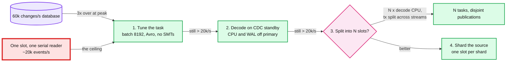

**Push back on the textbook answer.** "Add partitions" scales consumers, not capture. However many partitions the topic has, one slot feeds one serial reader. The capture side scales only by more slots (paid on the source) or more databases (paid by the owning team). Say which one you are asking for and who pays.

**What changed.** API: `SOURCE_DB.slots[]` (1 to 4 publications), `snapshot(table, parallelism)`. Data model: per-database grouped topic, `SNAPSHOT_CHUNK` per reader. Deployment: 10 Connect clusters, dedicated workers for the top 20, a snapshot scheduler in the control plane. Numbers: ~16k partitions, ~15 brokers, ~120 workers, 6.9 h for the largest table.

### 5.5 "How do you keep every sink inside its freshness budget without the lake costing a fortune?"

**What breaks.**
1. **The lake mirror `MERGE`.** §2: the 2 TB mirror at 20k changes/s touches every one of its ~2,000 files every minute. Copy-on-write means 2 TB rewritten per minute. The job never finishes a batch, lag grows without bound, and the S3 bill follows.
2. **Lag measured in offsets.** "3 M messages behind" means 3 s on one topic and 3 days on another. Nobody can page on it.
3. **Snapshot bursts.** Eight chunk buffers released at their watermarks push 64k `op = r` rows into the serial stream at once: 3 s of delay for live changes on that database, every few seconds, for the whole 6.9 h.
4. **Idle tables look stale.** A table with no changes for an hour has a last-applied commit timestamp an hour old.

**Fix.**
1. **Merge-on-read for hot mirrors.** Tables above ~1k changes/s use deletion vectors: a `MERGE` writes the new row versions (~600 MB per minute for the 2 TB table) plus a small bitmap per touched file, instead of rewriting files. Cadence by tier (1 min for A, 10 min for B: fewer, larger merges amortise the bitmaps). A nightly compaction folds deletion vectors into files and purges soft deletes older than 7 days. The changelog table is append-only and cheap. File sizing and commit markers are the [`../streaming-ingestion/`](../streaming-ingestion/) §5.1 machinery. See [`../delta-lake-transactions/`](../delta-lake-transactions/) for copy-on-write versus merge-on-read.
2. **Lag in seconds, end to end.** Every event carries `commit_ts`. Every sink reports `now - commit_ts` of the last applied event per table. Idle tables use the same rule as the §5.3 watermark: a table whose partitions are fully drained is current as of the last heartbeat (every 10 s per database) produced before the drain. The SLO is per sink and tier: search p99 < 5 s, lake tier A < 2 min.
3. **Throttle snapshot emission.** For small and medium tables, where the task publishes chunk rows itself, chunk rows may use at most 20% of the task's throughput (~4k rows/s); the rest is reserved for live changes, so a snapshot slows itself down rather than the database's live stream. Big tables publish from the snapshot workers (§5.4) and cost the task only the key tracking.
4. **Serve freshness from the right sink.** The lake is for minutes. Anything that needs seconds reads search or a service's own copy.

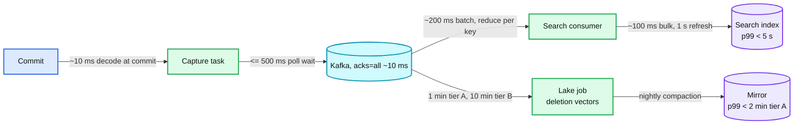

**Push back on the textbook answer.** "Make the lake real time: merge every 5 seconds" multiplies bitmaps and small files by 12 for readers who look at dashboards every few minutes. Notion runs its largest table at up to two hours of lag and most tables at minutes ([Notion](https://www.notion.com/blog/building-and-scaling-notions-data-lake)). Freshness is bought per sink, not platform-wide.

**What changed.** API: `add_sink(..., tier)`. Data model: mirror `_version`, `_deleted`, `_commit_ts`, deletion vectors on hot mirrors. Metrics: `lag_seconds` per sink and table. Config: snapshot emission share 20%. Details in [`deep-dives/exactly-once-sinks.md`](deep-dives/exactly-once-sinks.md).

---

## 6. Final design and the six core flows

Everything from §5 composed. Under 15 nodes; zoom-ins in [`diagrams.md`](diagrams.md).

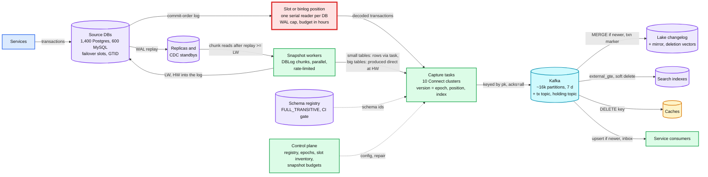

The six flows below are the ones to be able to say from memory. Each is the final design, not the §4 version.

### Flow 1: one transaction, commit to four sinks (about 2 s to search)

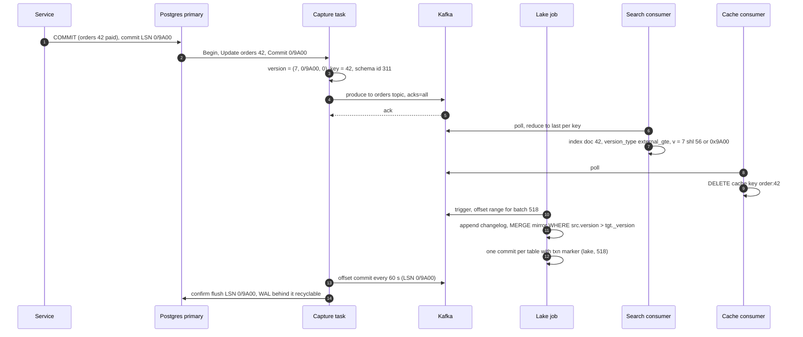

### Flow 2: one snapshot chunk read from a replica (no lock, no gap, no time travel)

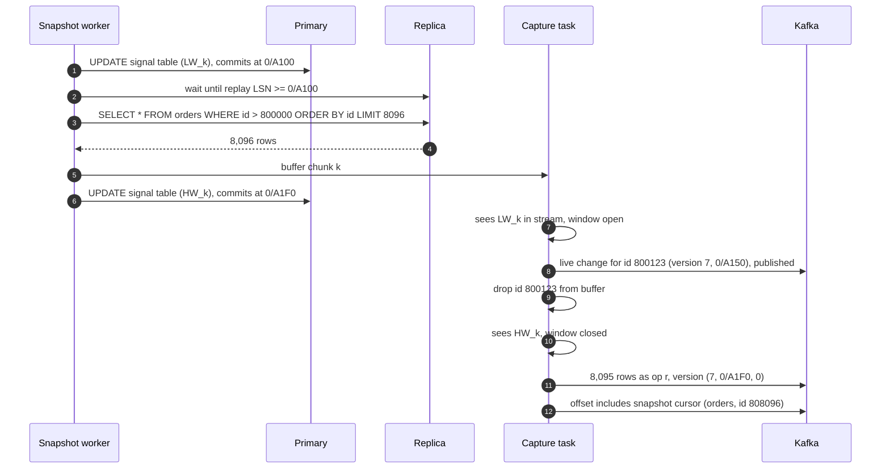

### Flow 3: connector crashes after producing, before its offset commit (failure, duplicates)

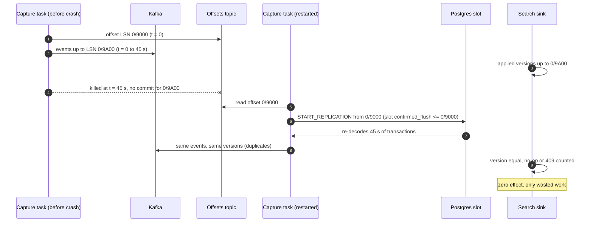

### Flow 4: Postgres primary fails over with a synced failover slot (Postgres 17+)

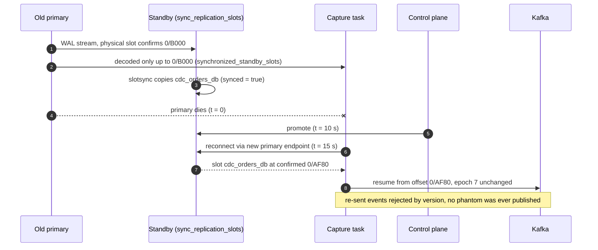

### Flow 5: Connect cluster down past the slot budget (failure, the red node)

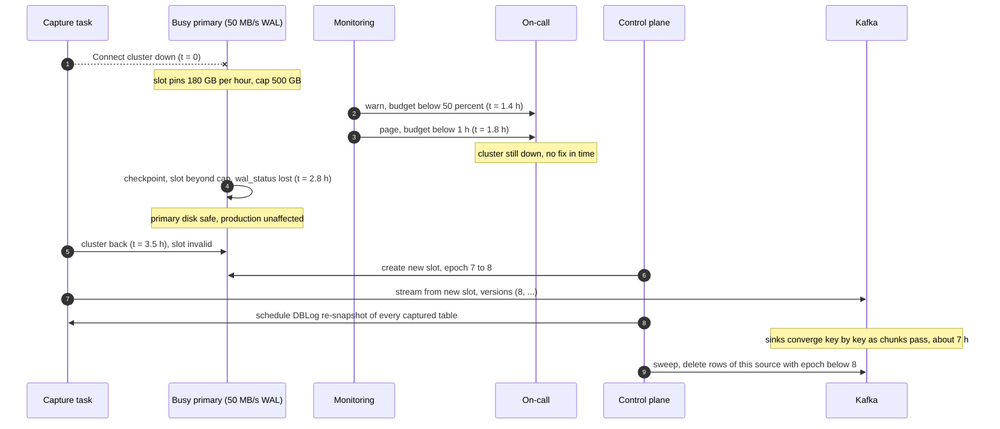

### Flow 6: schema change, additive then a hand-run rename (FR4)

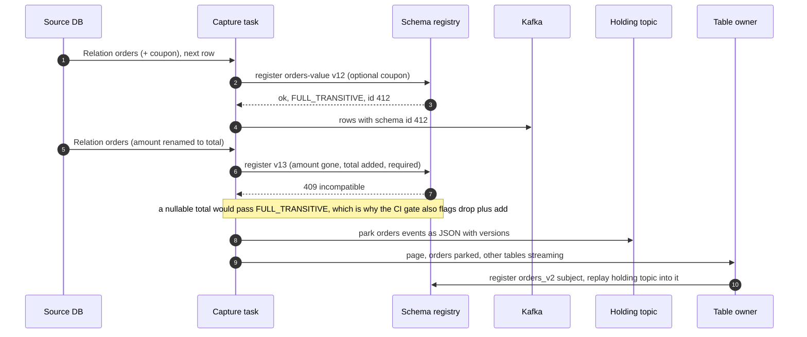

---

## 7. Trade-offs

| Decision | Option A | Option B | Chose | Why |
|---|---|---|---|---|
| Capture | Read the database's commit log | Poll `updated_at`, triggers, or dual writes | A | Only the log has deletes, every intermediate state, only committed data, in commit order. Costs a reader per database and a slot that pins WAL |
| Reader | Debezium on Kafka Connect, one task per database | Flink CDC for everything, or a managed service | A, plus Flink-CDC-style parallel chunks for big snapshots | Mature for Postgres and MySQL, the offsets and heartbeats are solved. Capture is one serial stream per slot in every tool, so the choice matters less than the slot budget |
| Snapshot | Watermark chunks (DBLog) | Position, bulk copy, replay with upsert (Notion style) | A | No lock, no long transaction, pausable, re-runnable for a key range, no time travel for sinks that serve users. B is fine for a one-off lake load |
| Exactly-once | Versioned idempotent apply at every sink | Kafka transactions end to end | A (B as a bonus on service topics) | Every sink is outside Kafka. Versions also handle snapshot overlap and failover replays, which EOS cannot see |
| Version | (epoch, commit position, index) | Change LSN, or commit timestamp | A | Change LSNs are not monotonic per key across concurrent transactions; clocks are not monotonic. The epoch survives lineage breaks |
| Slot WAL | Capped, lose the slot and re-snapshot | Unlimited, never lose the slot | A | A re-snapshot is hours of background reads. A full primary disk is a production outage |
| Topics | Own topic for ~2,000 busy tables, grouped topic per database for ~48k quiet ones | Topic per table | A | ~16k partitions vs 50k+, ~15 brokers vs ~40. Per-key order unchanged |
| Transactions | Per-key order by default, opt-in transaction buffering | One partition per database | A | Atomicity only where it is paid for; everyone else keeps parallelism |
| Failover | Postgres 17 failover slots with `synchronized_standby_slots` | Re-snapshot after every failover | A | No phantoms, no rebuild. Costs standby lag in CDC latency and a stall if the listed standby dies |
| Where to decode | Primary by default, CDC standby for the top 20 | Always primary | A | Moves decode CPU and WAL retention off the busiest primaries. Standby slots are not failover-safe, so their loss means a re-snapshot |
| Lake apply | Merge-on-read (deletion vectors) for hot mirrors, nightly compaction | Copy-on-write | A | Copy-on-write rewrites 2 TB a minute on the hottest table |
| Schema | CI contract gate, auto additive, park table on breaking | Fail the connector on any incompatible change | A | Failing stops the whole database's stream and burns slot budget over one table |
| Cache sink | Delete the key | Write the new value | A | Deletes commute and repeat safely, so no versions and no ordering needed |
| New consumer | Bootstrap from the lake mirror plus Kafka offsets | Snapshot the source again | A | The source pays once per table, not once per consumer (Databus's bootstrap idea) |
| Refused to build | Global commit order across databases, cross-database transactions, sub-100 ms propagation, business intent from raw row changes, bidirectional replication | | | Each one is a different system (a sequencer, 2PC, synchronous replication, an outbox, conflict resolution) for a requirement nobody stated |

---

## 8. Staff-level notes

- **Failure modes and blast radius.** Capture task crash: one database's stream pauses for < 1 min, duplicates absorbed by versions. Connect cluster loss: ~200 databases stop, each slot burns budget; the smallest budget in that cluster is the deadline, which is why clusters are split by domain and budgets are sized against a 15 min recovery. Kafka loss: every slot burns at once, the page is at 5 min. Postgres failover: with failover slots nothing is lost or rebuilt; without them, one database bumps its epoch and repairs, a targeted re-snapshot of the phantom keys if the new slot existed before writes resumed, a full one if not. Schema registry down: running tasks keep their cached schemas, a new schema version parks that table. Snapshot worker bug: it only reads, and its output is versioned at `HW`, so a bad chunk is fixed by re-running the chunk. A sink down: only that sink's consumer lag grows; the source and other sinks never notice. The blast radius that must never exist, a CDC failure taking down a production database, is removed by the WAL cap.
- **Migration.** From nightly batch dumps or `updated_at` polling: (1) create slots and start capture with `no_data` snapshot mode so the stream flows from now, (2) run DBLog snapshots database by database under the fleet budget, (3) build the mirror in a shadow table, compare row counts and per-partition checksums against the old dump daily for a week, (4) flip readers via a view, keep the old job runnable for a month. From application dual writes: capture the table, run the new consumer in shadow and diff its output against the dual-write target, then delete the dual-write code path; the rollback is re-enabling a flag, because the table was the source of truth all along. For services that consumed the dual-written events, give them an outbox first, then retire the dual write.
- **Operability.** SLOs: search and cache p99 < 5 s commit-to-visible, lake tier A p99 < 2 min, measured as `now - commit_ts` at the sink with heartbeats for idle tables. Pages at 3am: any slot with < 1 h of budget, a slot `lost`, Kafka unavailable to Connect for 5 min, a capture task down for 5 min on a tier A database, a parked table on a tier A database, a failover without a synced slot (the epoch bumped). Warnings: spill bytes rising, snapshot behind schedule, sink lag over SLO for 10 min.
- **Cost.** Order of magnitude per month: Kafka ~15 brokers and ~76 TB tiered (~$25k), ~120 Connect workers (~$15k), lake changelog growing ~5 TB/day after Parquet compression (~2 PB a year, so a 90-day hot tier and cold storage after, ~$45k at year end if left hot), mirrors ~500 TB (~$12k), and the biggest single line: ~20 dedicated CDC standbys for the top databases (~$40k). The standbys are the price of keeping decode CPU and WAL off the busiest primaries; say that trade explicitly. Team: one platform team of 5 to 7 owns capture, Kafka and the sink framework; per-table onboarding is self-serve or it does not scale to 50k tables.
- **Team boundaries.** Database owners own their schemas, their migrations, and the CI contract check result; a captured table is a published API. The CDC team owns slots, capture tasks, versions, budgets, snapshots and the sink libraries. Sink owners own their apply logic and tombstone retention within the library's rules. The contract between owners and CDC is the registry subject per table; the contract between CDC and sinks is "events are at-least-once, per-key ordered, versioned".

---

## 9. What is expected at each level

**Mid (80/20 breadth/depth).** Debezium reads the binlog or WAL into Kafka, consumers write to Elasticsearch and the warehouse. Knows there is an initial snapshot and that the snapshot then switches to streaming. Says "exactly-once" and means Kafka's setting. Does not mention the slot, the version, or failover.

**Senior (60/40).** Explains why polling and dual writes fail. Keys by primary key for per-key order. Handles the snapshot handoff with "record the position, snapshot, replay, upsert by key". Makes sinks idempotent with upserts. Knows about deletes and tombstones. Mentions replication lag monitoring and schema registry compatibility. Probably misses: the slot can take the primary down, change LSN is not a safe version, failover can publish phantoms, the time-travel problem during replay.

**Staff+ (40/60).** Says unprompted: the source database is the product and the slot is the red node, so it is capped and alarmed in hours of budget, and losing it is a planned, lock-free rebuild; one serial reader per slot is the throughput ceiling and splitting it is paid on the source; a version of (epoch, commit position, index) on every event, with every sink applying only newer versions, turns at-least-once into exactly-once effect and also merges snapshots and survives failovers; DBLog watermarks give a lock-free, resumable snapshot with no time travel; failover slots plus `synchronized_standby_slots` close the phantom window; per-key order by default and opt-in transaction buffering; large transactions stall the whole database's stream; new consumers bootstrap from the mirror, not the source; CDC copies state, services that need intent get an outbox. Gives the numbers: 43 B changes/day, ~20k events/s per reader vs 60k/s on the largest database, 180 GB of WAL per hour of outage, 2.8 h of budget, 55.6 h vs 6.9 h for the 4 B-row snapshot, ~16k partitions instead of 50k+. Names what was refused: global order, cross-database transactions, intent from raw rows.

---

## 10. Nitty-gritty (past interview scope)

### 10.1 Internals of each chosen technology

- **Postgres logical decoding.** Every change is in the WAL anyway (for crash recovery and physical replicas). With `wal_level = logical` the WAL carries enough to reconstruct rows. For each slot, a walsender process reads WAL from `restart_lsn`, and a **reorder buffer** assembles each transaction's changes (they are interleaved with other transactions in the WAL). At commit, the whole transaction goes through the output plugin (`pgoutput`), which filters by publication and serialises `Begin`, `Relation`, row messages and `Commit`. Aborted transactions are discarded. Memory above `logical_decoding_work_mem` spills to disk under the data directory. The client reports `confirmed_flush_lsn`; `restart_lsn` trails it (the oldest WAL still needed to rebuild in-progress transactions), and WAL older than the smallest `restart_lsn` of all slots is recyclable. The slot state is persisted at checkpoints. The slot also pins `catalog_xmin` because decoding an old change needs the catalog as of that change.

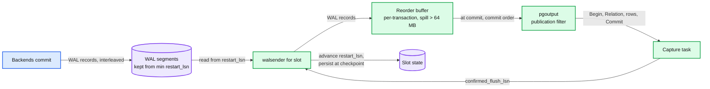

- **MySQL binlog.** With `binlog_format = ROW`, each transaction is written to the binlog at commit as one contiguous event group: `GTID`, `Query(BEGIN)`, then per table a `Table_map` followed by `Write_rows` / `Update_rows` / `Delete_rows` with before and after images, then `Xid`. DDL is a `Query` event. A CDC client registers as a replica and the server's dump thread streams events from a file and offset or a GTID set. Files rotate at `max_binlog_size` and are purged by age regardless of readers.
- **Debezium on Kafka Connect.** A connector with one task. The task's poll loop drains an internal queue (`max.queue.size` 8,192) that the log-reading thread fills in batches (`max.batch.size` 2,048, `poll.interval.ms` 500). Records go to Connect's producer, offsets to the offsets topic every `offset.flush.interval.ms` (60 s); after a successful offset commit the Postgres connector flushes the LSN to the slot (`lsn.flush.mode = connector`). Incremental snapshots are driven by signals (a row in the signal table or a Kafka signal topic) and use the signal table for the watermarks (`insert_insert` by default). Heartbeats go to a heartbeat topic and optionally run `heartbeat.action.query`.
- **Kafka.** Change topics keyed by primary key, `cleanup.policy = delete` with 7 days retention (tiered after 24 h). Delete events are followed by tombstones so a compacted copy of a topic (used by some service consumers as a lookup table) drops deleted keys after `delete.retention.ms` (24 h). Zoom-in: [`../../popular_systems_deepdive/kafka/`](../../popular_systems_deepdive/kafka/).
- **Lake sink.** Micro-batch job, changelog append plus mirror `MERGE` (or `AUTO CDC ... SEQUENCE BY`), deletion vectors on hot mirrors, `txn` marker with Kafka offsets. Zoom-ins: [`../streaming-ingestion/`](../streaming-ingestion/), [`../delta-lake-transactions/`](../delta-lake-transactions/).
- **Search sink.** Bulk API with `version_type = external_gte`. The stored version per document is the guard. Deletes are soft (a `deleted: true` document keeps its version) because real delete versions are forgotten after `index.gc_deletes` (60 s).

### 10.2 Configuration knobs that matter

| Component | Knob | Value | Why |
|---|---|---|---|
| Postgres | `wal_level` | `logical` | Required for decoding |
| Postgres | `max_slot_wal_keep_size` | 500 GB busy, 50 GB median (default -1) | The cap. Converts disk-full into slot-lost |
| Postgres | `logical_decoding_work_mem` | 512 MB on top 20 (default 64MB) | Fewer spills for big transactions, one buffer per walsender |
| Postgres 17+ | slot `failover = true`, standby `sync_replication_slots = on`, `hot_standby_feedback = on`, primary `synchronized_standby_slots` | on | Slot survives promotion, no phantoms |
| Postgres 18 | `idle_replication_slot_timeout` | 3 days (default 0) | Last-resort sweep for orphaned slots |
| Postgres | `max_replication_slots`, `max_wal_senders` | ≥ slots + physical replicas + headroom (default 10 slots) | Room for a rebuild slot next to the old one |
| Postgres | REPLICA IDENTITY | DEFAULT, FULL only where sinks need old values of non-key or TOASTed columns, or where the table has no primary key | FULL logs the whole old row on every update and delete. A published table with no usable identity rejects UPDATE and DELETE |
| Postgres | publication | explicit table list, column lists to exclude secrets (PG15+) | Capture only what is published |
| MySQL | `binlog_format`, `binlog_row_image`, `binlog_row_metadata` | ROW, FULL, FULL | Whole rows with column names in the log |
| MySQL | `gtid_mode`, `enforce_gtid_consistency` | ON, ON | Position survives failover |
| MySQL | `binlog_expire_logs_seconds` | 7 to 30 days sized to disk (default 30 days) | The MySQL "budget": binlogs are kept on every primary regardless of readers, so this is disk on the source, traded against how long capture may be down |
| Debezium | `snapshot.mode` | `no_data` plus signalled incremental snapshots | Never a locked initial snapshot |
| Debezium | `incremental.snapshot.chunk.size` | 8,096 on replicas (default 1,024) | Fewer watermark writes per row read |
| Debezium | `heartbeat.interval.ms`, `heartbeat.action.query` | 10000, insert into heartbeat table | Slots on quiet databases keep moving |
| Debezium | `provide.transaction.metadata` | true on databases with atomic sinks (default false) | Transaction boundaries on demand |
| Debezium | `max.batch.size`, `max.queue.size` | 8,192, 32,768 on top 20 (defaults 2,048, 8,192) | Throughput of the serial reader |
| Debezium | `tombstones.on.delete` | true (default) | Compacted consumers drop deleted keys |
| Debezium | `slot.failover` | true on Postgres 17+ (default false) | Creates a failover slot |
| Connect | `offset.flush.interval.ms` | 10000 on top 20 (default 60000) | Fewer re-sent events after a crash |
| Connect | `exactly.once.source.support` / `exactly.once.support` | enabled / required for service-facing databases | Clean topics for services; not relied on |
| Kafka | `retention.ms`, `local.retention.ms` | 7 d, 24 h | Replay and bootstrap window, bounded broker disk |
| Kafka | `min.insync.replicas`, producer `acks` | 2, all | No acknowledged change lost |
| Search | `version_type`, `index.gc_deletes` | `external_gte`, soft deletes instead of relying on 60 s | Order-safe, resurrection-safe |
| Lake | apply cadence, deletion vectors | 1 min tier A, 10 min tier B, DVs above 1k changes/s | Freshness per tier at bounded rewrite cost |

### 10.3 Capacity math per component

| Component | Unit | Load | Limit | Headroom |
|---|---|---|---|---|
| Capture task | one per database | median 125/s, top 20 at 12.5k/s avg and ~37k/s peak, largest 60k/s peak | ~20k events/s (to benchmark) | Median 160x. Top 20 at or over at peak: **the closest to its limit** |
| Slot WAL | busy primary | 50 MB/s WAL at peak | 500 GB cap | 2.8 h at peak, 8.3 h average |
| Slot WAL | median database | 1 MB/s | 50 GB cap | ~14 h |
| Walsender CPU | per slot | one decoder per database | one core | Split slots multiply it |
| Kafka partition | one of ~16k | ~31 events/s average (500k/s ÷ 16k), ~3 MB/s peak on the busiest | ~10 MB/s comfortable | Fine |
| Kafka cluster | ~15 brokers | 750 MB/s peak in, ×3 replication, ~4 sink groups out | partition replicas per broker is the constraint (~48k total) | ~2x |
| Connect worker | ~20 quiet connectors | ~2.5k events/s | a few cores | Large |
| Snapshot | largest table | 4 B rows | 8 readers × 20k rows/s, produced by the workers, not the serial task | 6.9 h vs 24 h target. Through the task at a 20% share (~4k rows/s) it would be 11.6 days |
| Search | ~200 tables | ~20k changes/s | 5k-doc bulks, 4/s | Large |
| Lake mirror | 2 TB hot table | 1.2 M changes/min | DV write ~600 MB/min, nightly compaction | Fine with DVs, impossible with copy-on-write |
| Control plane | 3 replicas | 2,000 databases, slot reconcile every 10 min | trivial | Metadata only |

### 10.4 Failure timeline

- **Connect cluster down past the budget:** §6 Flow 5. Detection at 1.4 h (warn) and 1.8 h (page), slot lost at 2.8 h, primary untouched, rebuild ~7 h.
- **Postgres failover with a synced slot:** §6 Flow 4. ~15 s of CDC pause, no loss, no phantom, same epoch.
- **MySQL unplanned failover:**

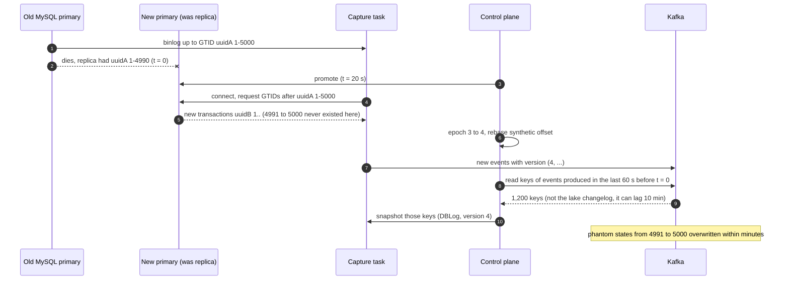

Data at risk in all three: none acknowledged to a service is lost. What the user sees: seconds to minutes of staleness in search and cache, tens of minutes in the lake during a rebuild. What on-call sees: one page per event, with the epoch bump logged.

### 10.5 Exactly-once and idempotency end to end

| Hop | Duplicate or disorder can enter when | Removed by | Key | Lives |
|---|---|---|---|---|
| Database → slot | Postgres restarts and its slot resumes from the last checkpointed position | Connector skips positions ≤ its stored offset; sinks reject by version | position | Offsets topic |
| Slot → capture task → Kafka | Task crash between produce and offset commit (up to 60 s) | Versioned apply at sinks; KIP-618 for service-facing topics | version | Each sink |
| Snapshot → Kafka | Snapshot row and live change for the same key | Watermark window drops the snapshot row; `HW` version ranks it anyway | (key, `HW` version) | Chunk buffer, then sink |
| Snapshot restart | Chunk re-read after a crash | Same versioning, rows re-emitted at the new `HW` | version | Sink |
| Kafka → sink consumer | Rebalance, consumer restart | Versioned apply; lake batches also skip by `txn` marker | version, (appId, batch) | Sink, table log |
| Failover | Phantom events, reused positions | `synchronized_standby_slots` prevents them on Postgres 17+; otherwise epoch bump plus a targeted re-snapshot of keys published past the switch point (Postgres) or in the last 60 s (MySQL) | epoch | `SOURCE_DB.epoch` |
| Blind window (slot lost, writes before a new slot, phantom inserts) | Rows that no longer exist at the source never get a new-epoch event | Sweep after the repair: delete rows whose version is below the new epoch; targeted repairs emit `op = d` for keys not found | epoch | Sink, one pass per repair |
| `TRUNCATE` | Skipped by default, keyless, unordered | Version-range delete control record, correct in any order | (table, truncate version) | Sink |
| Delete then late insert | Replay of an older insert after a delete | Tombstone with version kept ≥ 7 days | (key, version, deleted) | Sink |
| Application | The service really wrote twice | Not CDC's job. Two commits, two changes, correct | | |

The line to say out loud: exactly-once here means "each committed change has exactly one effect per sink", not "each message is delivered once". Delivery is at-least-once on every hop by design.

### 10.6 Consistency model per edge

| Edge | Model | Note |
|---|---|---|
| Services → database | Strong (the database's own isolation) | Source of truth |
| Database → capture task | Commit order, committed data only | Per database. No order across databases |
| Capture task → Kafka | Per-key order (partition by pk), at-least-once | Transactions split across topics unless metadata is used |
| Kafka → search, cache | Eventual, per-key monotonic (versions) | p99 < 5 s. A key never goes backwards |
| Kafka → lake mirror | Eventual, per-table atomic per batch, per-key monotonic | Cross-table consistency via commit-ts watermark |
| Kafka → atomic sinks | Transactional per source transaction | Opt-in, costs latency |
| Snapshot → sinks | Per-key monotonic, no time travel | `HW` versioning |
| Across failover | Monotonic per key via epoch | Phantoms repaired, never silently kept |
| Registry → consumers | Immutable per schema id | New ids appear as the table changes |

### 10.7 Alternatives rejected

| Alternative | Why it looked attractive | Why rejected |
|---|---|---|
| Query-based CDC on `updated_at` | No database config, works on any engine | Misses deletes, intermediate states, long transactions, writes that skip the column; hourly at best (Shopify Longboat) |
| Triggers into an audit table | Captures deletes, engine-agnostic | Doubles write cost inside every user transaction, audit table is the new hot spot |
| Application dual writes or publish-after-commit | No platform needed | Not atomic; drift on the first partial failure. Outbox if a service must publish |
| Locked initial snapshot | Simple, exact | Blocks writers for hours on big tables |
| Exported snapshot plus bulk copy | Fastest exact copy | Holds a snapshot for hours, pins vacuum horizon, no pause or key-range repair |
| Kafka EOS as the exactly-once story | One switch | Sinks are outside Kafka; does not see snapshot overlap or failover phantoms |
| Change LSN as version | Already on every event | Not monotonic per key across concurrent transactions; collides after an unsafe failover |
| One partition per database for transactions | Total order per database | One consumer thread per database forever |
| Unlimited slot retention | Never re-snapshot | Lets CDC take the primary down |
| Google Datastream / AWS DMS | Managed | Datastream documents no ordering guarantee ([FAQ](https://docs.cloud.google.com/datastream/docs/faq)); both hide the slot budget and the version, which are the two things we must control at this scale. Fine for a small estate |
| Streaming in-progress transactions (pgoutput v2) | No spill for big transactions | Aborted work reaches the connector; "committed data only" is lost |

### 10.8 How the big companies do it

- **Meta Wormhole** (NSDI 2015): publishers read each datastore's own transaction log (no interposed store), deliver **at-least-once and in order**, at 35 GB/s steady (50 M messages/s, ~5 trillion/day) with bursts to 200 GB/s during recovery. Lagging subscribers are grouped into "caravans" that read the log together at 1.25 to 2x speed under read-rate caps that protect the datastore: the same "the source is the product" rule as our snapshot budgets ([paper](https://www.usenix.org/system/files/conference/nsdi15/nsdi15-paper-sharma.pdf)). Earlier, **McSqueal** tailed MySQL's committed statements on every database to broadcast memcache deletes, because invalidations embedded in the commit log can be replayed after a misrouting ([Scaling Memcache](https://www.usenix.org/system/files/conference/nsdi13/nsdi13-final170_update.pdf)): our cache sink.
- **LinkedIn Databus** (SoCC 2012): relays hold recent changes in memory, a **bootstrap service** serves snapshots and consolidated deltas so new and lagging consumers never hit the source, "latencies in the low milliseconds", "thousands of events per second per server" ([paper](https://dl.acm.org/doi/10.1145/2391229.2391247)). Our "bootstrap from the mirror" is the same idea using the lake.
- **Netflix DBLog** (2019, arXiv 2020): the watermark algorithm in §4.2, in production since 2018 in ~30 services, MySQL, Postgres and Aurora, active-passive with ZooKeeper ([paper](https://arxiv.org/pdf/2010.12597)). Debezium's incremental snapshots and Flink CDC's parallel variant descend from it.
- **Shopify** (2021): ~150 Debezium connectors on 12 pods over 100+ MySQL shards, ~65k records/s average and 100k/s peaks at BFCM 2020, p99 < 10 s to Kafka, 400 TB+ of CDC data in Kafka; their pain points were the locked snapshot and records of tens of MB against Kafka's 1 MB default ([post](https://shopify.engineering/capturing-every-change-shopify-sharded-monolith)).
- **Notion** (2024): one Debezium connector per Postgres host over 480 logical shards, tens of MB/s of changes into Kafka and Hudi, bootstrap by export at time `t` plus Kafka replay from `t` (the position-then-replay rung), minutes of lag for most tables and up to two hours for the largest, over $1M saved in 2022 ([post](https://www.notion.com/blog/building-and-scaling-notions-data-lake)).
- **Databricks** productised the sink half as `AUTO CDC` (sequence-by-version apply, SCD type 1 or 2) and the capture half as Lakeflow Connect.

Numbers and URLs are verified in [`research/`](research/) with a spot-check section per file.

### 10.9 Operational runbook

Dashboards (5 metrics): slot budget hours per database (sorted ascending), end-to-end lag seconds per sink and table, capture throughput vs WAL rate per top-20 database, parked tables and holding-topic depth, snapshot progress vs schedule.

Alerts: page on budget < 1 h, slot `lost`, Kafka unavailable to Connect 5 min, tier A capture down 5 min, epoch bump, tier A table parked. Warn on budget < 50%, `spill_bytes` rising for 10 min, sink lag over SLO for 10 min, unknown slot found by the reconciler.

Rollout: connector image or config changes go through GitOps to a canary Connect cluster (quiet databases) for 24 h, compared on throughput, lag and error rate, then one cluster at a time. Postgres parameter changes (cap, failover slots) roll per cluster with the database team. A sink library change rolls per sink with a shadow consumer group that diffs its writes against the live one.

Rollback with data: a bad capture release that wrote wrong values is repaired by epoch bump plus re-snapshot of the affected tables (the new epoch overwrites everything). A bad sink release is repaired by resetting that sink's consumer group to a time before the release and replaying in **repair mode**: the guard becomes `>=` instead of `>`. A strict guard would make the replay a no-op (every replayed event carries a version equal to the one already stored, next to the wrong value), while an equal full version is by construction the same source event, so re-applying it is safe and overwrites the bad write. Search already runs `external_gte`. For the lake, the mirror is rebuilt from the changelog.

### 10.10 Security and abuse

- The CDC database role has `REPLICATION` and `SELECT` on published tables only, no write except the signal and heartbeat tables (or none with read-only snapshots). It is the most privileged read credential in the company, so it lives in a secret store with rotation and is used from the Connect network only.
- Publications list tables explicitly and use column lists (Postgres 15+) to keep secrets (password hashes, tokens) out of the log stream entirely. Registry schemas carry `pii` tags that drive topic ACLs and lake masking.
- Topics are ACL'd per domain: a consumer reads only the tables it was granted. Kafka and Connect use mTLS.
- A GDPR delete arrives as a delete event and propagates to every sink within its SLO. The history does not: the changelog and Kafka still hold old values. Kafka ages out in 7 days; the changelog is purged by key (or crypto-shredded per user) by a deletion job with a 30-day SLA.
- A malicious or careless owner can flood the stream (a 100 M-row update) or rename columns; the migration batch limit, the spill alarm and the CI gate are the controls, and the damage is bounded to that database's stream.

### 10.11 Evolution

- **10x (5 M changes/s).** The per-database ceiling does not move, so growth has to come as more databases (sharding) or more slots per database (paid on the source). Kafka grows to ~150k partitions: several clusters by domain. The lake's hot mirrors all go merge-on-read. Nothing in the version or apply rule changes, which is the point of putting correctness in the version.
- **Multi-region.** Capture stays in the database's home region (the log is there). Kafka topics mirror to other regions for their sinks; versions make the mirrored copy safe to apply out of order. A regional failover of the database is a failover (§5.2) with a new epoch if the slot does not follow.
- **New source engines.** MongoDB change streams, DynamoDB streams, Spanner change streams: each needs a reader that yields commit-ordered changes with a monotonic position, and a way to write or read a watermark. The sink side does not change.
- **Logical replication as a product.** Postgres-to-Postgres copies (for migrations and zero-downtime major upgrades) use native logical replication; pg_upgrade migrates logical slots only from 17+ ([Postgres](https://www.postgresql.org/docs/current/logical-replication-upgrade.html)), so older clusters need a rebuild plan per upgrade.
- **Intent events.** When more consumers need "why" not "what", push owners to outbox tables and give them a first-class outbox router in the same pipeline, instead of stretching raw row changes into business events.

---

## 11. Follow-up questions to expect

Ranked by how often they come up.

1. **"How does the snapshot hand off to the stream without a gap or a double apply?"** §4.2 and Flow 2. Watermarks around each chunk, keys changed in the window are dropped, the rest are versioned at `HW`. [`deep-dives/snapshot-and-stream-handoff.md`](deep-dives/snapshot-and-stream-handoff.md).
2. **"The connector crashed. What do sinks see?"** Flow 3. Up to 60 s re-sent, rejected by version. [`edge-cases.md`](edge-cases.md) "connector crash".
3. **"Is this exactly-once?"** §4.3 and §10.5. Exactly-once effect per sink via versions; delivery is at-least-once everywhere; Kafka EOS is a bonus.
4. **"What happens to the database when the connector is down?"** §5.1 and Flow 5. The slot pins WAL at 180 GB/h, capped at 2.8 h of budget, then the slot goes and we rebuild. [`deep-dives/source-safety-and-slot-budget.md`](deep-dives/source-safety-and-slot-budget.md).
5. **"The primary failed over. Is the slot there? Could you have published something that no longer exists?"** §5.2 and Flow 4. Failover slots plus `synchronized_standby_slots`; otherwise epoch bump and repair. [`deep-dives/failover-and-recovery.md`](deep-dives/failover-and-recovery.md).
6. **"Can a consumer see the order without its items?"** §5.3. Yes by default; transaction metadata and buffering for the sinks that need it; outbox for services. [`deep-dives/transactions-and-ordering.md`](deep-dives/transactions-and-ordering.md).
7. **"Someone renamed a column."** §4.4 and Flow 6. CI gate first, registry rejects, table parked, owner decides. [`deep-dives/schema-evolution-and-ddl.md`](deep-dives/schema-evolution-and-ddl.md).
8. **"One database does 60k/s."** §5.4. Tune, decode on standby, split slots (paid on the source), or shard the source.
9. **"Why not poll `updated_at`?"** §3.2. Deletes, intermediate states, long transactions, freshness.
10. **"How do you keep Elasticsearch correct with out-of-order events?"** §4.3. External versions from the source, `external_gte`, soft deletes because of `gc_deletes`. [`deep-dives/exactly-once-sinks.md`](deep-dives/exactly-once-sinks.md).
11. **"A new team wants the whole table."** §4.2. Bootstrap from the mirror plus Kafka offsets, never the source.
12. **"A 10 M-row update just ran."** §5.3. Spill on the source, 8 minutes of head-of-line lag for the whole database; batch backfills at the source.
13. **"What pages at 3am?"** §8 and §10.9. Slot budget < 1 h, slot lost, Kafka unavailable to Connect, epoch bump.
14. **"How do you migrate from our nightly dump or from dual writes?"** §8. `no_data` start, DBLog backfill, shadow mirror with daily diffs, view flip; dual writes retired behind a flag.
15. **"What did you refuse to build?"** §7 last row.
