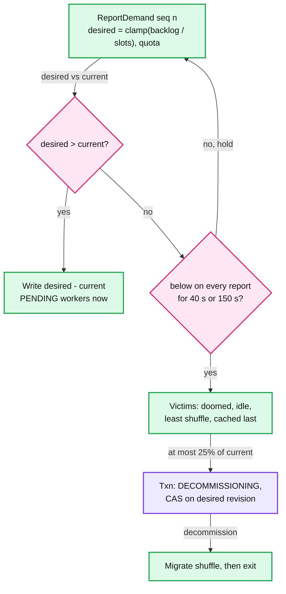
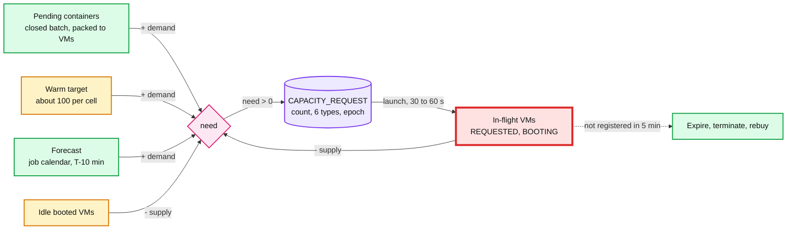
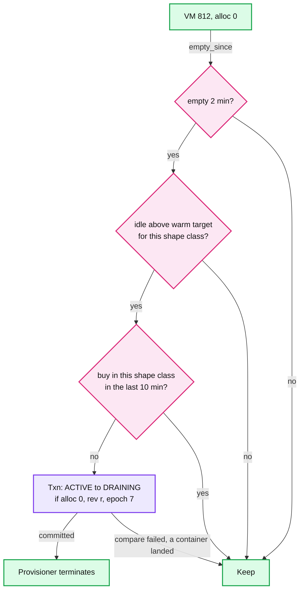
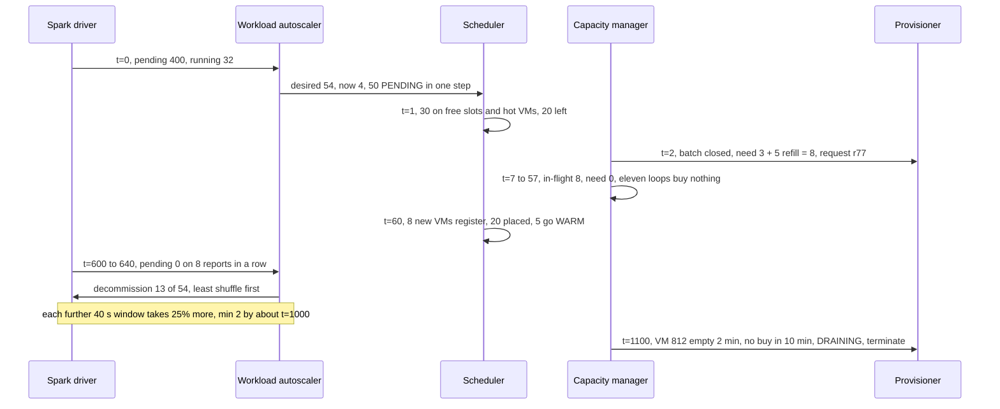

# Deep dive: autoscaling control loops

> One-line answer: three loops on three clocks, and exactly one writer per quantity. The workload autoscaler owns each cluster's worker count (every 5 s from Spark's backlog: jump up at once, step down 25% only after a 40 s or 150 s quiet window). The scheduler owns which VM each container sits on (event-driven, milliseconds). The capacity manager owns how many VMs the cell holds (every 5 s: `need = pending + warm target + forecast - idle - in-flight`; release only after 2 minutes empty and 10 minutes after the last buy in that shape class). Races between the loops are closed by compare-and-swap (CAS) in the cell store, not by timing, and every loop is level-triggered, so a crash is boring.

Reusable block: [`../../../concepts/etcd.md`](../../../concepts/etcd.md), [`../../../concepts/leases-fencing-clocks.md`](../../../concepts/leases-fencing-clocks.md), [`../../../popular_systems_deepdive/kubernetes/kubernetes-08-autoscaling-and-scale.md`](../../../popular_systems_deepdive/kubernetes/kubernetes-08-autoscaling-and-scale.md). Zooms into [`../solution.md`](../solution.md) §4.3, §5.2 and §5.5. Sibling: [`provisioning-and-reconciliation.md`](provisioning-and-reconciliation.md).

---
## 1. Three loops, three clocks, one writer per quantity

| Loop (one set per availability zone, AZ) | Clock | Reads | The one thing it writes |
|---|---|---|---|
| Workload autoscaler, per cluster | 5 s, on each `ReportDemand` | Spark pending + running tasks | worker count: `PENDING` or `DECOMMISSIONING` container rows. Never VMs |
| Cell scheduler | event-driven, about 1 ms per class decision | pending containers, VM free vectors | `container.vm_id`, `vm.alloc_vector`. Never sizes or purchases |
| Capacity manager | 5 s, over batches that close after 1 s quiet or 10 s max | pending, idle, in-flight, warm target, forecast | `CAPACITY_REQUEST` rows, `ACTIVE -> DRAINING`. Never Spark |

Why mixing them thrashes:
- **Clocks.** A scheduler that also bought VMs would buy per unplaceable container, in milliseconds: 500 containers at 00:00 become 500 cloud calls against a request bucket of 5 that refills at 2 per second. Buying must be slower than placing; that is what the batch window is for.
- **Signals and owners.** A capacity manager reading Spark's backlog would buy for workers the autoscaler then clamps by `max` or quota. A workload autoscaler buying VMs would buy per cluster, and 60 s later the VM belongs to a cluster that may have finished. Buy per `(cell, shape class)` from pending containers.
- **Two sizers on one quantity oscillate.** Kubernetes' Horizontal and Vertical Pod Autoscalers (HPA, VPA) on the same CPU metric: VPA drives usage over request to a constant and HPA loses its signal. Databricks says not to enable Spark dynamic allocation on compute that uses its autoscaling. Google's Autopilot avoids the fight with one model emitting both signals ([k8s-08 §10.3](../../../popular_systems_deepdive/kubernetes/kubernetes-08-autoscaling-and-scale.md)). Our rule: one writer per quantity, everyone else reads.

```mermaid
%% One writer per quantity. Each loop runs on its own clock and writes one kind of row in the cell store; the others only read it.
flowchart LR
    DRV[Spark driver]:::service -->|"ReportDemand every 5 s"| WA[Workload autoscaler<br/>5 s, per cluster]:::service
    WA -->|"writes worker count"| CR[(Container rows)]:::store
    CR -->|"pending set, watch"| SCH[Scheduler<br/>event-driven, ms]:::service
    SCH -->|"writes vm_id + alloc, CAS"| VR[(VM rows)]:::store
    CR -->|"pending, closed batches"| CAP[Capacity manager<br/>5 s, per AZ]:::service
    VR -->|"idle, in-flight, empty_since"| CAP
    CAP -->|"writes requests, DRAINING"| RR[(Request rows)]:::store
    classDef service  fill:#dcfce7,stroke:#16a34a,stroke-width:2px,color:#111
    classDef store    fill:#ede9fe,stroke:#7c3aed,stroke-width:2px,color:#111
```

---
## 2. Workload autoscaler: up fast, down slow

- **Target.** `desired = clamp(ceil((pending + running) / task_slots_per_worker), min, max)`, then capped by the tenant's remaining band quota. Solution Flow 2: pending 400, running 32, 8 slots per worker, `max` 60, so 54. It has 4.
- **Up fast: jump, at most two steps.** Write 50 `PENDING` workers in one decision; a second step only if the next report, with the new executors running, still shows a backlog. Spark doubles instead (1, 2, 4, 8 per round, one round per 1 s `sustainedSchedulerBacklogTimeout`): `k` rounds add `2^k - 1`, so 50 workers take 6 rounds, 30 s on our 5 s clock instead of 5 s. Spark doubles because it echoes TCP slow start and does not trust the backlog to last. We trust it because down-slow makes an overshoot cheap: 50 surplus workers for one 40 s window is about 7 VMs for 40 s, about $0.15.
- **Down slow.** Only when `desired < current` on every report for the whole window: 40 s for job clusters (8 reports), 150 s for interactive (30). At most 25% per window. Victims: executors on a doomed spot VM first, then idle, least shuffle output, cached blocks last (Spark's `cachedExecutorIdleTimeout` is infinity for the same reason). An executor whose shuffle a later stage needs is decommissioned (blocks migrated), never killed.
- **The tail is geometric on purpose.** 54 to 2 workers takes 10 windows, about 7 minutes, and about 1.4 extra idle worker-hours over a one-step drop: under $0.50 at $0.27 per worker-hour ($1.89 per VM-hour over 7 workers). A wrong one-step drop at a stage boundary costs 52 cold replacements plus moving or recomputing 52 executors' shuffle. Kubernetes' HPA ships the same asymmetry: 0 s stabilization up, 300 s down.

---
## 3. Capacity manager: the equation, in-flight and late binding

Per `(shape_class, capacity_type)`, in VMs: `need = pending + warm target + forecast - idle - in-flight`. Pending containers are first bin-packed into hypothetical VMs (7 default workers per 64-vCPU VM). In-flight is VMs in `REQUESTED` (intent row written, no instance yet) or `BOOTING` (instance id, agent not registered). A batch closes after 1 s with no new arrivals or 10 s at most (Karpenter's defaults), so 500 containers arriving over 3 s become one request for 72 VMs, not 500.

**The 12x over-buy without the in-flight term** (Flow 2: 20 workers left pending, 3 VMs, plus a hot refill of 5; loop every 5 s; VM registered at 60 s):

| t (s) | Pending + refill | In-flight | `need` without in-flight | `need` with in-flight |
|---|---|---|---|---|
| 0 | 3 + 5 | 0 | 8 | 8 |
| 5 to 55 (11 loops) | 3 + 5 | 8 | 8 each loop | 0 |
| 60, VMs register | 0 | 0 | 96 bought, 88 surplus | 8 bought |

- **The damage is tokens more than dollars.** The 88 surplus VMs cost about $30 while the 10 minute rule holds them. But 96 launches came out of a bucket that refills at 2 per second. At 00:00, 12 x 4,000 VMs is 48,000 launches, 6 times the burst of all 8 accounts, and the over-buy starves the real demand queued behind it.
- **Why in-flight is red.** It breaks first, in both directions. Drop it and the loop buys 12x. Trust it forever and a request whose VMs never register (boot hang, silent capacity error) counts as supply and the cell never buys again. So an in-flight VM not registered 5 minutes after launch (assumption: about 3x the 90 s worst cold path, the order of Karpenter's 5 min launch timeout; the Cluster Autoscaler waits 15 min) stops counting, is terminated, and the next loop buys again.
- **Late binding.** The VM is bought for the cell and shape class, not for the cluster that caused the buy. On registration the scheduler places whatever is pending then; the rest go `WARM`. If that cluster finished at t = 30 s, nothing is wasted and nothing needs cancelling.

---
## 4. Release rules and hysteresis

A VM is released only if it has been empty (`alloc_vector` zero) for 2 minutes, the cell's idle count for its shape class is above the warm target, no purchase in that shape class happened in the last 10 minutes, and the `ACTIVE -> DRAINING` Txn commits. Drain by attrition (a score penalty under 30% allocated) is what empties VMs; jobs live about 20 minutes.

- **2 minutes** outlasts a 40 s scale-down window plus a stage boundary, so slots a down-step frees are still there when the next stage asks. **10 minutes after a buy** stops buy, release, buy: a buy means a cold start was just needed in that shape class. Holding one idle 64-vCPU VM for 10 minutes costs about $0.30; one needless cycle costs a launch token and a 60 s cold start for somebody.
- **Utilization is a lagging signal.** It saturates at 100%, so it cannot tell demand at 101% from 300% of capacity, and it falls only after the work has drained. Pending containers are the shortfall now; an empty VM is the surplus now. A spread fleet at 60% everywhere never crosses a 0.5 threshold.

| | Cluster Autoscaler | Karpenter | Ours |
|---|---|---|---|
| Scale-down signal | requested / allocatable under 0.5, scan 10 s | node empty, or a cheaper packing exists | VM empty |
| Wait before acting | unneeded 10 min; the timer resets if usage recovers | `consolidateAfter` 0 s by default | 2 min empty |
| After a scale-up | `delay-after-add` 10 min | none by default | 10 min, per shape class |
| Moves running work | yes, evicts pods | yes, budget 10% of nodes; kills executors mid-stage | no; active only for VMs under 30% for 30 min, 2% per 10 min |

---
## 5. Races between the loops, and one full cycle

| Race | What goes wrong | Closed by |
|---|---|---|
| 1. Release vs placement | The capacity manager drains VM 812 as the scheduler places a container on it | Both Txns compare 812's `mod_revision`. The first commit bumps it; the second fails and re-reads (rescore, or keep the VM). One process today, but the store stays the referee, so the rule survives a split |
| 2. Scale-down vs new backlog | A down-step picks 13 victims; a new stage's 400 tasks arrive 1 s later | The down-step Txn compares the cluster's `desired_workers` revision, which an up-decision bumps. If already committed, the next tick writes new workers onto the slots just freed, which the 2 minute rule keeps. Damage bounded by 25% |
| 3. Spot replacement vs scale-down | Spot notice on a VM holding 5 of a 30-worker cluster (desired now 20) in the tick its window ends. Naive: replace 5 and decommission 8 healthy | One writer: the autoscaler uses `effective = running - doomed`, and doomed executors are the first, free victims. Here: remove 8 = 5 doomed + 3 idle, 0 replacements |
| 4. Forecast vs hot pool | Forecast VMs count as idle and satisfy the warm target, so no hot VM is left once the burst eats them; or at T the forecast term and the arriving starts both count, and the loop buys twice | Forecast VMs sit in their own bucket: outside the warm target, held until T + 5 min, then released if idle. Each admitted forecast run decrements the forecast term, so a start counts once. Hot-target statistics exclude forecast starts, so the burst does not inflate the all-day pool |

**Level-triggered.** Every tick reads desired and observed state and recomputes; no loop remembers "I already bought for that". In-flight comes from request rows, so a new leader computes the same `need` the old one would have. An event-triggered loop that missed one "VM registered" event would count that VM as in-flight until it expired; a level-triggered loop sees the row `ACTIVE` on the next tick. A crash mid-tick leaves only committed Txns and idempotent request rows (the Kubernetes controller pattern). A second leader's writes fail the `leader_epoch` compare ([provisioning deep dive](provisioning-and-reconciliation.md) §4).

---
## 6. What the interviewer is testing

- That you split "how many workers does this cluster want" from "how many VMs does the fleet hold", each with one writer and its own clock.
- That you count in-flight VMs as supply unprompted, and can derive the 12x from a loop period and a boot time.
- That up and down are asymmetric on purpose and priced (cents of overshoot vs a shuffle recompute), that races are closed by CAS rather than by "they run at different times", and that utilization under 0.5 for 10 minutes is the wrong scale-down signal when containers cannot move cheaply.

---
## 7. Numbers to say out loud

- Clocks: workload autoscaler 5 s; scheduler about 1 ms per decision; capacity manager 5 s over a 1 s quiet, 10 s max batch.
- Up: jump, at most 2 steps; doubling needs 6 rounds for 50 workers. Down: 40 s job, 150 s interactive, 25% per window, 54 to 2 in about 7 minutes.
- No in-flight term: 5 s loop, 60 s boot, 12x; at 00:00 that is 48,000 launches, 6x the burst of 8 accounts. In-flight expiry 5 min (assumption).
- Release: 2 min empty, not within 10 min of a buy. Cluster Autoscaler: 0.5, 10 min unneeded, 10 min after add. Karpenter: `consolidateAfter` 0 s, 10% budget.
