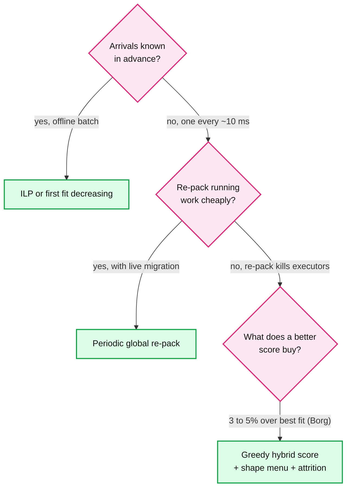
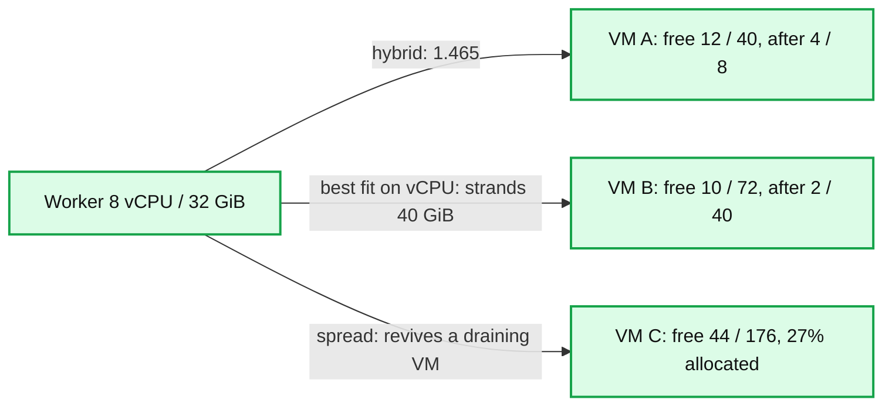
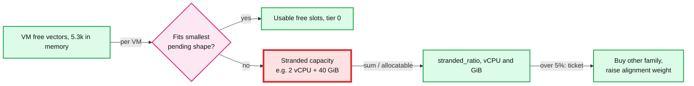
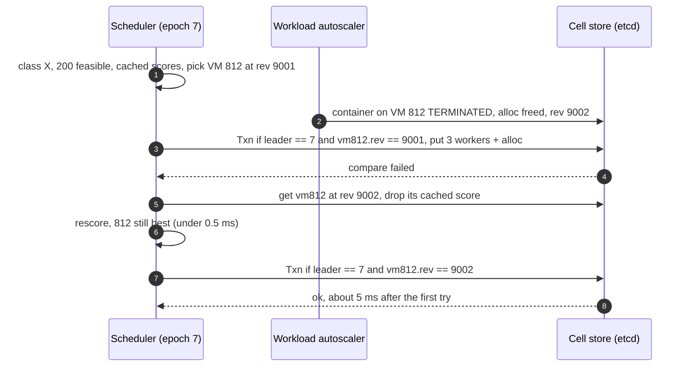
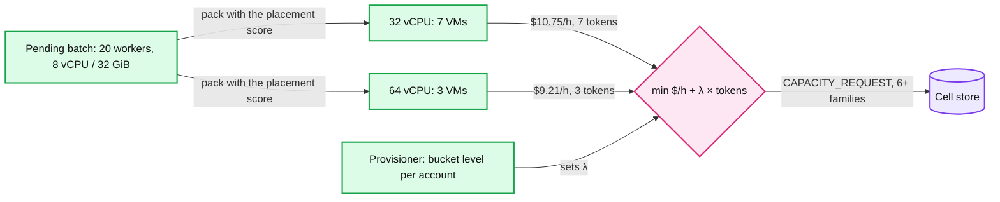
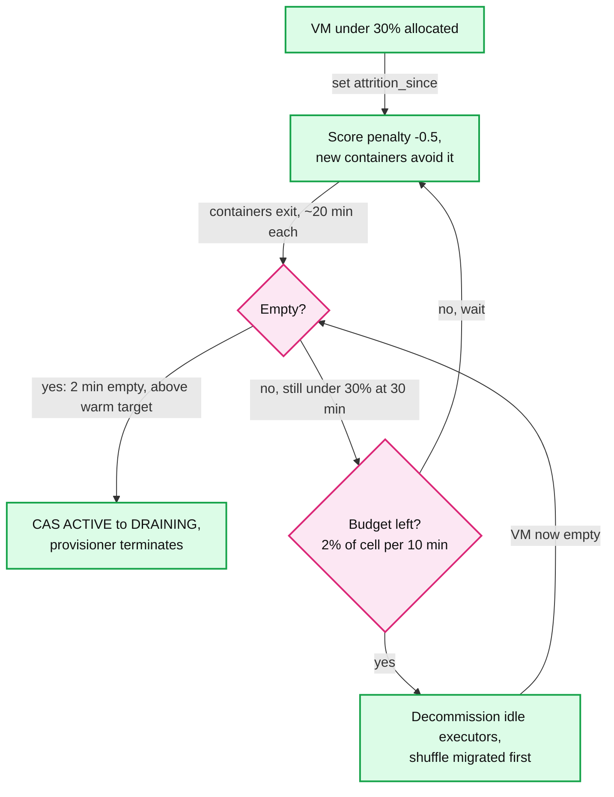

# Deep dive: bin packing and placement

> One-line answer: placement is online, multi-dimensional bin packing, NP-hard in general but easy enough here, because the platform picks executor shapes from a menu that tiles the VM, containers live about 20 minutes, and re-packing means killing executors; so a greedy score (best fit on the tightest dimension, plus alignment, minus a stranded penalty) over 200 sampled feasible VMs, committed with compare-and-swap (CAS), gets within a few percent of optimal, VMs empty by attrition instead of by killing work, and the capacity manager picks the VM size by packing pending containers into hypothetical VMs.

Reusable block: [`../solution.md`](../solution.md) §5.3 (the summary this file zooms into), [`../../../concepts/etcd.md`](../../../concepts/etcd.md), [`../../../concepts/leases-fencing-clocks.md`](../../../concepts/leases-fencing-clocks.md), [`../../../popular_systems_deepdive/kubernetes/kubernetes-03-scheduler.md`](../../../popular_systems_deepdive/kubernetes/kubernetes-03-scheduler.md) (filter, score, `percentageOfNodesToScore`), [`../../../popular_systems_deepdive/kubernetes/kubernetes-08-autoscaling-and-scale.md`](../../../popular_systems_deepdive/kubernetes/kubernetes-08-autoscaling-and-scale.md) (Karpenter's hypothetical nodes and consolidation).

---

## 1. Why it is hard, and why online greedy is enough

- **The general problem is hard.** Vector bin packing over vCPU, memory, local SSD and GPU is NP-hard. First fit decreasing's `11/9 OPT + 6/9` bound is for one dimension and a list known up front; nothing like it holds for two or more dimensions arriving online.
- **Four facts make ours easy.** Arrivals are online (one every ~10 ms at peak), so there is no batch to optimize. Job containers live ~20 minutes, so any packing decays within the hour. Improving a packing after the fact means killing Spark executors. And the platform, not the user, picks the shape. Borg's hybrid score packs 3 to 5% better than plain best fit, $6M to $10M a year here. An integer linear program (ILP) would have to beat that on data stale in 20 minutes, while paying in killed executors.
- **The shape menu tiles the VM, and Borg's bucketing warning does not apply.** Executors are 4, 8, 16 or 32 vCPU at 4 or 8 GiB per vCPU. A 64 vCPU / 256 GiB VM has 60 vCPU allocatable (assume 240 GiB): `7 × (8, 32) + 1 × (4, 16) = (60, 240)`, an exact fill. Rounding user-stated requests up to powers of two would cost Borg 30 to 50% more resources: a service that needs 5 cores gets 8 and wastes 3 forever. A Spark job is a bag of tasks. If it needs 20 cores it gets three 8-vCPU executors, and the spare slots run more of the backlog. The only real gap is memory per core (needs 5 GiB, must take 8), which the default-shape recommender closes (Autopilot: slack 46% to 23%).

## 2. Greedy policies and the hybrid score, worked on three VMs

| Policy | Picks the VM with | Scale-down effect | Used by |
|---|---|---|---|
| First fit | the first feasible VM in scan order | Fixed order empties the tail by luck. With a random start (our sampling) it becomes random fit, which spreads | Textbook baseline |
| Best fit | the least room left after placing | Some VMs stay empty, so the 2-minute release fires | Kubernetes `MostAllocated` |
| Worst fit (E-PVM) | the most room left. E-PVM, Borg's first scorer, minimizes the change in one combined cost and in practice spreads | Nothing empties; big shapes fragment | Borg, before the hybrid |
| Spread (`LeastAllocated`) | the highest average free fraction | Every VM partly full; release never fires | Kubernetes default |

- **Scale-down, worked.** 36 containers of 8 vCPU on 10 VMs. Spread leaves ~3.6 on each, 48% full, none empty. Best fit fills 5 VMs with 7, puts 1 on a sixth, and the release rule returns the other 4: 40% of that slice of the bill. Spread exists for services that burst past their request, which Borg names as best fit's weakness. Our executors have a fixed heap and a sandbox limit, so that weakness does not apply.
- **The hybrid score:** `fit + 0.5 × align - stranded + 0.1 × image - 0.5 × attrition` (weights are an assumption, tuned in shadow mode, solution §10.9). `fit` is the used fraction of the tightest dimension after placing. `align` is the cosine of the demand and free vectors, each divided by VM capacity; Tetris uses a raw dot product, which grows with free space and so fights best fit. `stranded` fires when one dimension can no longer fit the smallest shape (4 vCPU / 16 GiB) while the other has room for two, and costs the stranded fraction. `image` is a tiebreak. `attrition` applies under 30% allocated. Worked below for one 8 vCPU / 32 GiB worker and three feasible VMs (free shown as vCPU / GiB).

| VM | Free before | Free after | fit | align | stranded | image | attrition | Score |
|---|---|---|---|---|---|---|---|---|
| A | 12 / 40 | 4 / 8 | 0.967 (memory) | 0.996 | 0 | no | no | **1.465** |
| B | 10 / 72 | 2 / 40 | 0.967 (vCPU) | 0.962 | -0.167 (40 GiB, no vCPU) | +0.1 | no | 1.381 |
| C | 44 / 176 | 36 / 144 | 0.400 | 1.000 | 0 | +0.1 | -0.5 (27% allocated) | 0.500 |

Best fit on vCPU alone picks B (58 of 60 used) and strands 40 GiB. Best fit on the tightest dimension ties A and B. Spread picks C and keeps an emptying VM alive. Only alignment and the stranded term separate A from B, and B's image bonus cannot buy back a strand.

## 3. Stranded capacity and `stranded_ratio`

- **Definition** (solution §5.3): free capacity on VMs that cannot fit the smallest pending shape. When nothing is pending, use the smallest menu shape so the metric does not read zero at night. Report vCPU and memory separately: VM B strands memory, a memory-heavy mix on general VMs strands vCPU.
- **Price.** A point of stranded vCPU is a point of packing, about $2M a year; the 5% ticket threshold is about $10M a year of paid capacity nobody can use. It is red below because it erodes the 85% target first, long before any scheduler limit.
- **Responses.** Mix drifted: the capacity manager's hypothetical packing (§5) starts buying the 8 GiB per vCPU family, and the alignment weight is raised in shadow mode. `dedicated` tenants: right-size their VMs (§5). Filters forcing poor fits: accepted as the price of blast radius. Blind spot: against the smallest shape the metric misses fragmentation for 32-vCPU executors (20 free vCPU scattered over 5 VMs); the pending-age dashboard by shape catches that.

## 4. Filters and the fast path: from 5.3k VMs to one Txn

- **Filters, cheapest first, and they fight best fit on purpose.** Index lookups (state `ACTIVE`, capacity type, isolation class, free-vCPU bucket), then per-cluster counters: the spread limit `max(1, 25% of workers)` per VM and the spot pool cap of 20% of the cluster's spot workers per pool, rounded up (29 spot workers give 6, solution §5.4). A 12-worker class with 11 on spot gets at most 3 per VM and 3 per pool. Best fit would stack all 12 on the two tightest VMs. When free space is scarce a class can be infeasible while enough vCPU is free in total; it goes pending and the capacity manager buys. That is the price of a 25% blast radius.
- **Equivalence classes and sampling.** A cluster is 2 classes, so 40k containers a minute at the burst is 10k decisions, 55/s per cell. Each samples from a random start until 200 feasible, about 4% of the cell; Kubernetes' adaptive `50 - N/125` would take 8%, 424 nodes. The chance that 200 samples miss every top-5% VM is `0.95^200`, about 0.004%.
- **Score caching.** The score depends only on the shape, the runtime version (image bonus) and the VM's free vector, so the key is `(shape, runtime, vm_id, mod_revision)`. Every cluster asking for 8 / 32 on one runtime shares one entry per VM; an entry dies when the VM's revision moves.
- **Conflicts: where from, and what they cost.** One leader per cell, so not from a rival scheduler; a stale leader is fenced by the epoch compare. They come from other writers in the same store: a container exit freeing alloc, the capacity manager's `ACTIVE -> DRAINING`, a spot notice, the scheduler's own pipelining. A conflict costs one re-read, a rescore under 0.5 ms and one more Raft commit (~5 ms). Assume ~250 VM-row writes/s at the burst over 5.3k VMs, a 5 ms window and ~4 VMs per Txn: well under 1%, call it 1 to 2% because best fit concentrates on the fullest VMs. Protean runs several allocation agents on one inventory with negligible conflicts. A conflict is a 5 ms delay, never a double booking.

## 5. Choosing the VM: hypothetical packing, `dedicated`, instances vs tokens

The capacity manager packs first and picks the type second (Karpenter's order). It packs the pending batch (1 s idle, 10 s max) into hypothetical VMs of each size with the same score, prices each packing, then lists at least 6 families of the winning size for spot. The 20 pending workers from solution Flow 2, with price linear in size from $3.07/h and 4 vCPU of per-VM overhead (both assumptions):

| Candidate | Allocatable vCPU | Workers per VM | VMs = launch tokens | $/h | $ per packed vCPU-hour |
|---|---|---|---|---|---|
| 16 vCPU / 64 GiB | 12 | 1 | 20 | 15.35 | 0.096 |
| 32 vCPU / 128 GiB | 28 | 3 | 7 | 10.75 | 0.067 |
| 64 vCPU / 256 GiB | 60 | 7 | 3 | 9.21 | 0.058 |

- **Big usually wins twice** (fewer tokens, less fixed overhead) but not on sets that do not fill a big VM. 9 workers: 2 × 64 vCPU is $6.14/h and 2 tokens; 3 × 32 vCPU is $4.61/h and 3 tokens. The rule: minimize `$/h + λ × tokens`, with λ zero while the account's launch bucket is over half full and rising as it drains (assumption). Off-peak, price decides. At 00:00, tokens decide, and the leftover vCPU on big VMs becomes tier-0 free slots seconds later.
- **`dedicated` tenants.** A VM holds one tenant and is terminated, not reused, when it empties. A driver plus one worker (16 vCPU) uses 16 of 60 on a 64-vCPU VM and 16 of 28 on a 32-vCPU VM, so buy the smallest size that fits the tenant's current containers. The cost is more launches: every dedicated VM dies with its tenant's last container.
- The Cluster Autoscaler's default expander, `least-waste`, is the same idea one level coarser: it compares node groups, each one instance type fixed in advance.

## 6. Drain by attrition vs active consolidation

- **Attrition is the default.** A VM under 30% allocated gets the -0.5 penalty (VM C above), so new work goes elsewhere. If lifetimes were exponential with a 20-minute mean (assumption), a VM holding k containers empties in `20 × (1 + 1/2 + ... + 1/k)` minutes: 20 for one, 30 for two, 37 for three. It is released after 2 minutes empty, if above the warm target and no purchase in its shape class in the last 10 minutes.
- **Why not kill.** A VM at 27% for 30 minutes wastes about $1.10 on-demand. Killing its 2 executors instead retries their tasks, moves or recomputes up to 80 GB of shuffle, drops cached blocks, and slows the customer's stage. The customer notices that; nobody notices $1.10.
- **Where attrition fails: long-lived containers.** An interactive cluster with a 2-hour auto-terminate, or a streaming job, pins its VM for days. So active consolidation applies only to VMs under 30% for over 30 minutes, within 2% of the cell's VMs per 10 minutes (106 in a 5.3k cell), and only by decommission with shuffle migrated first, picking VMs whose executors are idle and hold the least shuffle. Karpenter consolidates by default with `consolidateAfter` 0 s and a 10% budget: right for stateless pods, wrong for executors mid-stage. The same path retires old OS images (solution §10.9) and VMs with a spot rebalance recommendation (§5.4).

## 7. What the interviewer is testing

- That you say "NP-hard" and then say why it does not matter here (online, 20-minute lifetimes, re-packing kills work, a platform-chosen menu), with Borg's 3 to 5% as the size of the prize.
- That you know spreading defeats scale-down, your score sees two dimensions (tightest dimension, alignment, stranded penalty) well enough to compute it on a candidate VM, and you measure fragmentation (`stranded_ratio`) and price a point of it.
- That placement is fast (classes, 200 samples, cached scores) and safe (CAS on `mod_revision`, leader epoch), a conflict costs 5 ms, and you will not kill executors to save a $3 VM-hour.

## 8. Numbers to say out loud

- Borg: hybrid 3 to 5% better than best fit, $6M to $10M a year here; power-of-two bucketing of user-stated requests costs 30 to 50% more.
- 1 point of packing is $2M a year; stranded ratio ticket at 5%, about $10M a year. A 64 vCPU VM has 60 allocatable; 7 × 8 vCPU + 1 × 4 vCPU fills it exactly.
- 55 class decisions/s per cell at the burst, 200 feasible sampled (Kubernetes would take 424), one core does 2,000/s. CAS conflicts 1 to 2% at the burst (assumption), 5 ms each.
- 20 pending workers: 3 × 64 vCPU at $0.058 per packed vCPU-hour beats 7 × 32 vCPU at $0.067.
- Attrition under 30%; active consolidation after 30 minutes, 2% of VMs per 10 minutes. Karpenter's default is 10% and 0 s.
