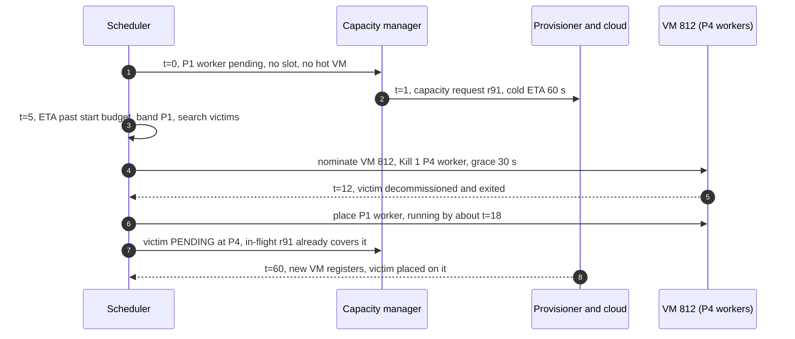
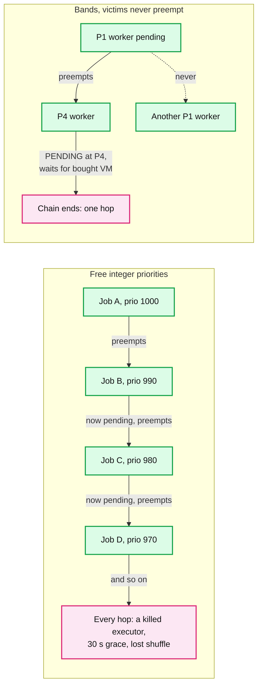
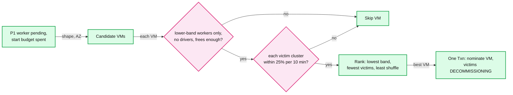
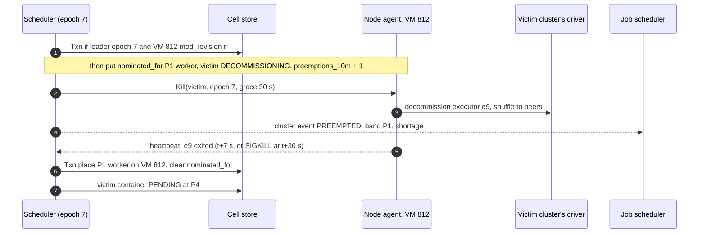
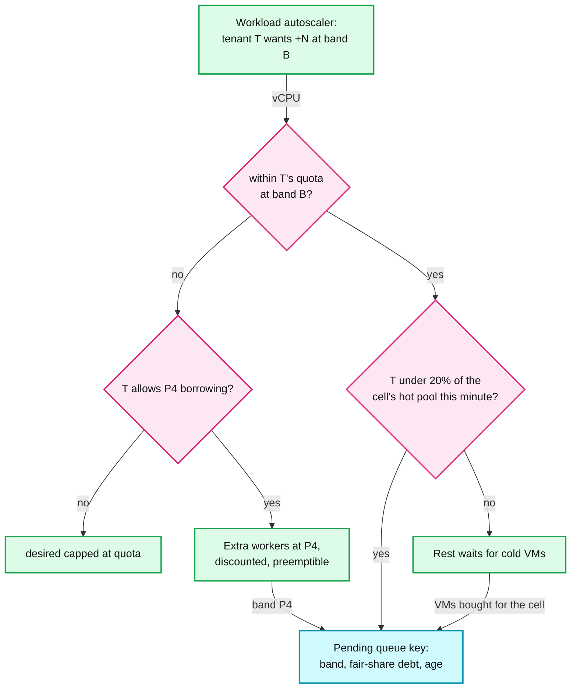

# Deep dive: preemption and priority

> One-line answer: in a cloud, preemption is a bridge, not a strategy: always buy first and in parallel, and preempt only when the 60 s cold path is longer than the start budget, the cloud says `InsufficientInstanceCapacity`, or a quota is full; use four non-overlapping bands where production is never preempted and victims never preempt (Borg's rule, which makes cascades impossible), take only lower-band workers and never drivers, rank by lowest band, fewest victims, least shuffle, cap each victim cluster at 25% per 10 minutes with a 30 s grace, and write the nomination in the same Txn as the kill; around it, quota per tenant per band with borrowing at P4 and band-then-weighted-fair-share when capacity is short.

Reusable block: [`../solution.md`](../solution.md) §4.5 and §5.6 (the design this zooms into), [`../../../popular_systems_deepdive/kubernetes/kubernetes-03-scheduler.md`](../../../popular_systems_deepdive/kubernetes/kubernetes-03-scheduler.md) (`DefaultPreemption` from source), [`../../../concepts/etcd.md`](../../../concepts/etcd.md) (the Txn that nominates), [`../../../concepts/rate-limiting-and-load-shedding.md`](../../../concepts/rate-limiting-and-load-shedding.md) (hot-pool cap), [`spot-capacity-and-interruption.md`](spot-capacity-and-interruption.md) (victims decommission like a spot loss).

---

## 1. Why preemption is only a bridge in a cloud

| Case (§4.5) | Buying alone gives | Preemption gives |
|---|---|---|
| **Cold gap**: no free slot, no hot VM, cold ETA 60 s > start budget left | 30 to 60 s | The victim's exit: seconds with little shuffle, at most 30 s |
| **Capacity error**: every type on the list answers `InsufficientInstanceCapacity` | Minutes: 3 min unavailable cache per type; a running cluster cannot move AZ | Same as above |
| **Quota**: our cloud accounts' quota for the region is used up | Nothing until the cloud raises it: a support case, hours | Same as above |

- Preemption earns its keep in the last two rows. In the cold gap it turns 60 s into about 15 to 40 s: useful for P1, not worth a killed executor for P3. That is why only P1 and P2 may preempt.
- **Buy always runs in parallel.** The pending container is demand from its first second. The VM bought for the preemptor ends up hosting the victims (late binding), and in-flight accounting stops a second buy. No red node in this file: the provisioner breaks first (solution §5.2); preemption is how P1 survives it.

## 2. Bands, and the rule that makes cascades impossible

| Band | Who | May preempt | May be preempted | Borg analog |
|---|---|---|---|---|
| P1 production | SLA jobs, and every driver of every band | P4; P3 during a declared shortage | never | production ("prod") |
| P2 interactive | notebooks, SQL | P4 | never: a human is waiting on it | none; sits between prod and batch |
| P3 batch | default for jobs | nothing | by P1 during a shortage | batch |
| P4 best-effort | discounted, preemptible SKU the customer opted into | nothing | always, with 30 s notice | best effort on reclaimed resources |

- **Why a chain cannot form.** A preemptor needs a strictly higher band than its victim. P1 and P2 are never victims. A victim goes back to `PENDING` and may not preempt; it waits for capacity bought for it. So every chain has length 1. Borg disallows preemption inside its production band for exactly this reason. The victim rule matters beyond bands: P2 may preempt P4, so without it a P2 notebook worker preempted by P1 in a shortage would take a P4 worker, a two-hop chain. The price: that P2 worker waits about 60 s.
- **Why share machines at all.** Borg found that segregating prod and non-prod would need 20 to 30% more machines. Bands let both share a VM; preemption is the cost of sharing. A **declared shortage**, per `(cell, shape class)`, is §5.6's "shape out of stock or launch bucket drained" made mechanical: every type on the list is in the unavailable-offerings cache, or the provisioner's P1 queue ETA is past the start budget. Cleared after 10 minutes without either (assumption).

## 3. Victim selection, and how Kubernetes differs

| Step | Ours | Kubernetes `DefaultPreemption` |
|---|---|---|
| Who can be a victim | Lower-band **workers** only. Never a driver: killing one kills a cluster to free 8 vCPU | Any lower-priority pod |
| Hard limit | Victim cluster's budget: 25% of its workers per 10 min | None. PDBs are counted, not enforced (best effort) |
| Node ranking | Lowest band of victims, then fewest victims, then least shuffle on the victims | Fewest PDB violations, then lowest highest-priority victim, then smallest sum of priorities, then fewest victims, then latest start time |
| Reservation | Nomination in the same Txn as the kill (§4) | `nominatedNodeName` is advisory; another pod can take the room |
| Many preemptors | A class of N workers runs the search N times on one snapshot, commits in Txn chunks | No cross-node gang preemption: victims come from one node |

- **Least shuffle, not latest start.** Kubernetes uses start time as a proxy for work lost. For Spark the loss is shuffle output to migrate or recompute, and a worker started a minute ago can already hold 40 GB. The number comes from `ReportDemand`'s `shuffle_bytes_per_executor`. **A budget, not a PDB:** Kubernetes will violate a `minAvailable` PDB if that is the only way to place the pod. Ours is a filter: a VM whose victims would break a cluster's budget is not a candidate.

## 4. Nomination, budget, grace, and what the victim sees

- **Why the same Txn.** Kill first and nominate later leaves a window where normal placement (a P3 container, say) sees the free room and takes it. The P1 worker then preempts again, and each preemption kills an executor. Kubernetes calls a stolen slot "harmless" because a pod is cheap to reschedule; a Spark executor is not. With the nomination written, every other placement sees the VM's free vector minus the nominee's shape. A nomination expires at grace + 10 s (assumption), so a wedged VM cannot hold it.
- **Budget.** `preemptions_10m` per cluster, in the cell store, at most 25% of its workers per 10 minutes. 25% matches the spread limit and the largest scale-down step: one cause takes at most a quarter, the cluster keeps 75%. **Grace 30 s** (Kubernetes' default `terminationGracePeriodSeconds` is also 30 s). Unlike a 30 s spot loss, only 1 or 2 executors leave the VM, so 40 GB of shuffle moves in about 13 s at 3 GB/s. A preemption usually loses nothing.
- **What the victim sees.** A decommission, not a kill: shuffle migrated, running tasks retried and not counted as failures, a `PREEMPTED` event with the reason, and a replacement on the VM bought for it about 60 s later. The job scheduler (#6) sees `PREEMPTED`, not `FAILED`: no retry is spent, nobody is paged, and the run goes on because its driver is never a victim. Borg's notice reaches the task about 80% of the time; here SIGKILL at t+30 s is the fallback and lineage covers it.

## 5. Quota, borrowing, fair share, guardrails

**Shortage example.** 100 VMs of the 64 vCPU shape arrive in az-a this minute: 6,000 vCPU. P1 wants 1,000 and goes first. 5,000 is left for P3, split by weight 1:1:2 (1,250, 1,250, 2,500); B needs only 1,000, so its spare 250 goes to A and C at 1:2.

| Tenant | Weight | Wants (vCPU) | FIFO (A's cron fired first) | Weighted fair share |
|---|---|---|---|---|
| A | 1 | 8,000 | 5,000 | 1,333 |
| B | 1 | 1,000 | 0 | 1,000 |
| C | 2 | 4,000 | 0 | 2,667 |

- **Quota per tenant per band, in vCPU**: checked at create for `min` and on every growth step. Twine calls these entitlements, and separates "whose capacity is this" (entitlements) from "which machine runs this task" (the allocator), in one control plane for a million machines per region. In a cloud the entitlement is a cost and blast-radius limit, not a slice of a fixed pool.
- **Borrow at P4.** Above quota, a tenant may run more at P4, cheaper and always preemptible. Borg runs about 20% of its workload in reclaimed resources; P4 is that idea sold as a product. P4 demand never jumps P1 in the provisioner's band-ordered queue.
- **DRF collapses to vCPU.** A shortage is per shape class, and within one shape class memory is a fixed multiple of vCPU (4 or 8 GiB), so every tenant's dominant share is its vCPU share.
- **Hot-pool cap**: 20% of a cell's hot pool per tenant per minute, about 20 of 100 VMs or 140 default workers. A 10,000-worker backfill gets 140 warm slots a minute; everyone else keeps 6 s starts. **Spend guardrail**: 3x the tenant's 7-day p95 hourly spend pages its admins and our on-call; 10x holds growth. It catches the `max = 1000` bug that a generous quota still allows.

## 6. What the interviewer is testing

- That you buy first and preempt only to bridge, and know preemption helps the capacity-error and quota cases far more than the cold gap.
- That you can draw a cascade and kill it structurally (bands plus "victims never preempt"), citing Borg, and that victim choice follows Spark's real cost (shuffle), never touches a driver, has a hard budget, and that you know where Kubernetes differs (best-effort PDBs, advisory nomination, no gang preemption).
- That quota in a cloud is a cost limit with borrowing, and shortage is served by band, then weighted fair share, never FIFO.

## 7. Numbers to say out loud

- 4 bands. P1 and P2 never preempted; only P1 and P2 preempt; P4 always, with 30 s notice. Preempt after 5 s pending when the cold ETA (60 s) is past budget.
- Victim budget 25% of a cluster's workers per 10 min; grace 30 s (Kubernetes' default too); one victim's 40 GB moves in about 13 s.
- Kubernetes: 5 tie-breaks, PDBs best effort, candidates `max(100, 10% of nodes)`, nomination advisory.
- Borg: segregating prod and non-prod needs 20 to 30% more machines; about 20% of work runs on reclaimed resources; notice delivered about 80% of the time. Twine: one control plane, a million machines per region.
- Hot-pool cap 20% per tenant per minute (about 140 workers); spend alarm at 3x p95, hold at 10x.
