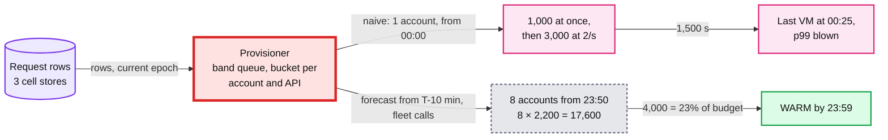
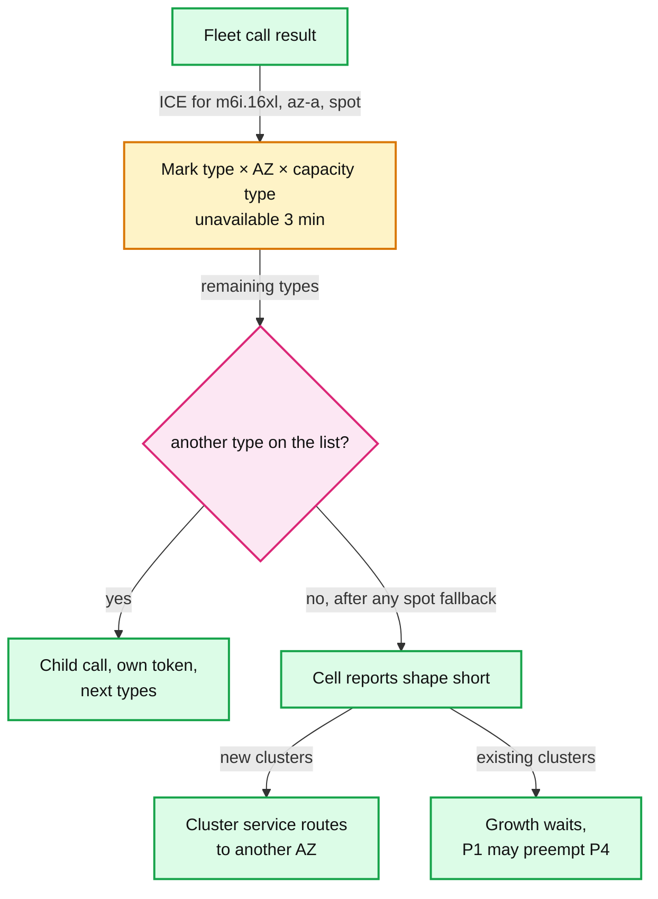
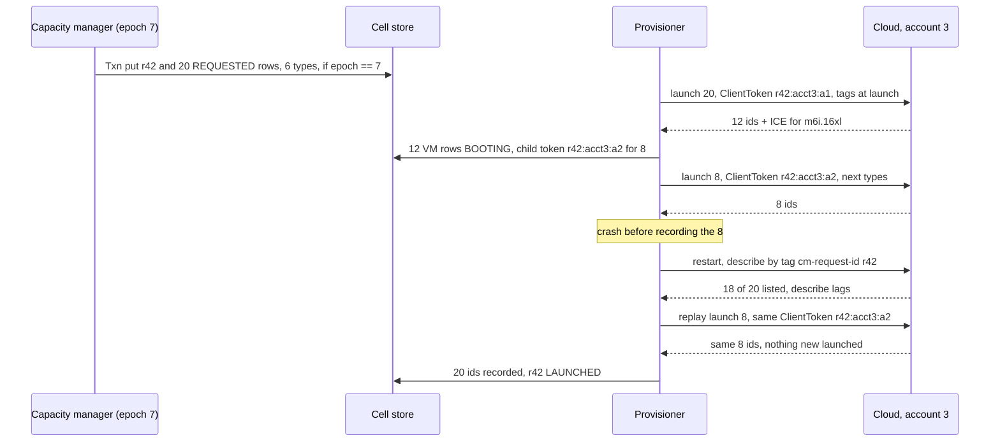
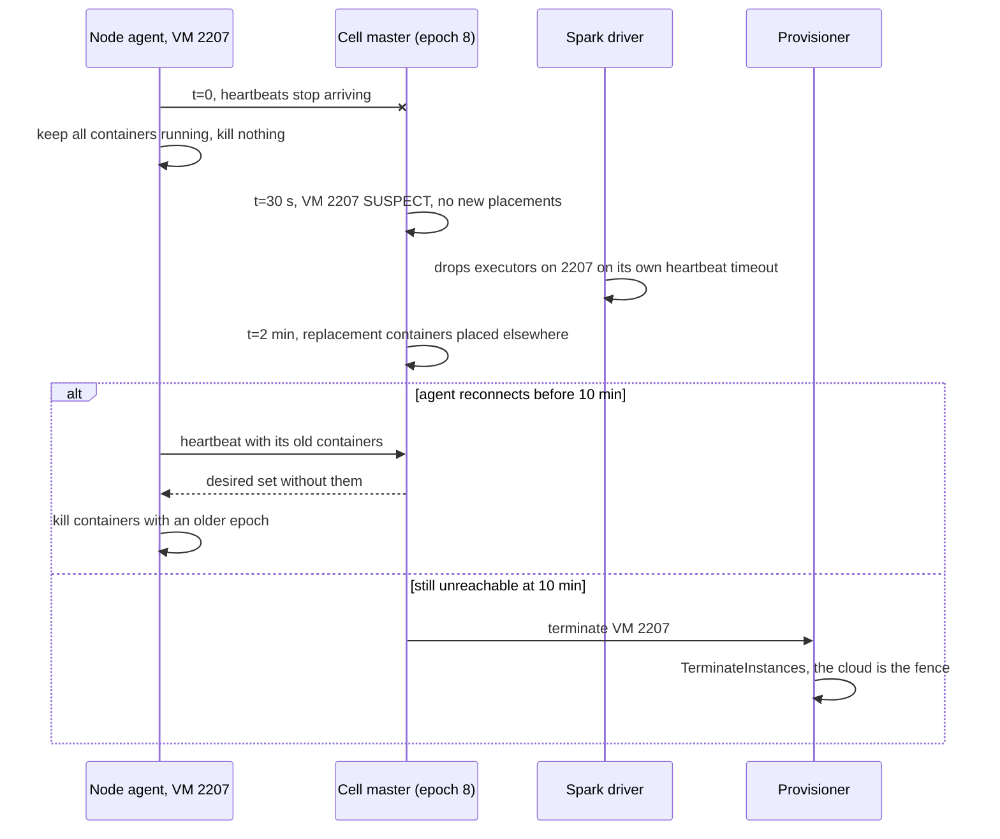
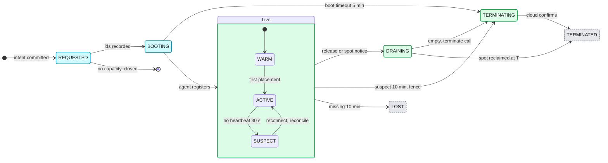

# Deep dive: provisioning and reconciliation

> One-line answer: the provisioner is the red node because the cloud behind it gives each account 1,000 launches at once and then 2 per second, and can answer "no capacity". We change the shape of demand (buy from T - 10 min, 8 accounts, 64-vCPU instances, one batched call per chunk, our own token buckets with a band-ordered queue, a 3-minute unavailable-offerings cache). Every launch is intent, then call, then record, with a client token derived from the request id and tags applied at launch. A describe that says "not found" is never proof; orphan GC terminates anything unmatched for 10 minutes (a 15-minute leak bound, against $39M a year without it). A 10 s lease plus `leader_epoch` in every Txn fences old leaders, and for a partitioned VM the cloud's terminate call is the final fence.

Reusable block: [`../../../concepts/exactly-once.md`](../../../concepts/exactly-once.md), [`../../../concepts/leases-fencing-clocks.md`](../../../concepts/leases-fencing-clocks.md), [`../../../concepts/rate-limiting-and-load-shedding.md`](../../../concepts/rate-limiting-and-load-shedding.md), [`../../../concepts/etcd.md`](../../../concepts/etcd.md). Zooms into [`../solution.md`](../solution.md) §5.2 and §5.5. Sibling: [`autoscaling-control-loops.md`](autoscaling-control-loops.md).

---
## 1. Why the provisioner is red, and how we change the shape of demand

| EC2 API, per account | Request bucket (calls) | Resource bucket (instances) | What it means here |
|---|---|---|---|
| `RunInstances` | 5, refill 2/s | 1,000, refill 2/s | The launch budget. A call must carry a count |
| `StartInstances` | 5, refill 2/s | 1,000, refill 2/s | A stopped-VM tier spends the same tokens |
| `TerminateInstances` | 100, refill 5/s | 1,000, refill 20/s | Releasing 4,000 VMs is 1,000 at once, then 150 s. Not the bottleneck |

**The 00:00 arithmetic.** About 4,000 new VMs in the minute after 00:00. One account: 1,000 at once, then `3,000 / 2 = 1,500 s`, **25 minutes**, before any capacity error. One VM per call is worse: the request bucket (5, then 2 calls/s) would make even the 1,000 burst take about 500 s.

| Fix | The arithmetic |
|---|---|
| Buy the forecast from T - 10 min | Per account `1,000 + 600 × 2 = 2,200` before T, instead of 1,000 plus 120 in the first minute |
| 8 accounts | `8 × (1,000 + 600 × 2) = 17,600` launches before T; 4,000 is 23% of it. 16/s sustained after |
| Big instances (the bucket counts instances) | 4,000 × 64 vCPU = 256k vCPU. As 16-vCPU VMs that is 16,000 tokens, 91% of the 8-account budget, no room for a retry |
| One fleet call per (account, cell, request) | A count plus 6 instance types per call, so the 5-call request bucket stops mattering |
| Our own token buckets, band-ordered queue | One bucket per (account, API) mirroring the cloud's, so we queue in-process instead of collecting throttle errors and retry storms. P1 first, forecast next, hot-pool refills last |

Ask for limit raises too (a support case per API action), but they are per account, negotiated, and do not fix stock. **What 8 accounts cost:** networking (a cell's VMs come from any account, so subnets are shared or peered and IP space per AZ is planned for all 8); quota bookkeeping (8 vCPU quotas and 8 sets of per-API buckets to mirror, raise and alarm on); per-account identity and access management (IAM) (a launch role per account for the provisioner, 8 audit trails, GC per account). What it buys: 8x launch rate and quota, and an account throttle, quota mistake or security incident hits one eighth of the fleet.

---
## 2. Capacity errors: remember per offering, route around the AZ

- `InsufficientInstanceCapacity` (ICE) is an answer about one offering: `(instance type, AZ, capacity type)`. Mark that offering unavailable for 3 minutes and move to the next type on the request's list within seconds (Karpenter's per-offering cache). The Cluster Autoscaler instead backs off the whole node group (one instance type) for 5 to 30 minutes, which for us idles a shape at the minute it is needed.
- Why 3 minutes: without it, a 5 s loop retries a sold-out offering 36 times in 3 minutes; much longer and a pool that refills mid-burst is ignored. This is not the spot pool quarantine (30 minutes after over 5% of a pool is reclaimed in 10): an ICE says "not now", a mass reclaim says "the cloud wants these back".
- All types out: `SPOT_WITH_FALLBACK` first buys on-demand (after 2 failed spot tries, or under 3 healthy pools). Still short: new clusters are routed to another AZ by the cluster service (it reads cell capacity health); growth of existing clusters waits, because a cluster lives in one AZ; P1 may preempt P4 to bridge.

---
## 3. Intent, then call, then record; describe lag; orphan GC

- **Protocol.** (1) The capacity manager commits `CAPACITY_REQUEST {request_id, count, types[], leader_epoch}`. (2) The provisioner marks it `LAUNCHING`, records the token, and calls with `TagSpecifications` `{cm-request-id, cm-cell, cm-account}`, so no instance is ever untagged. (3) It writes instance ids into the VM rows, `REQUESTED` to `BOOTING`. A crash anywhere replays the same token ([`exactly-once.md`](../../../concepts/exactly-once.md): the outbox pattern with the cloud as the downstream).
- **EC2 idempotency.** `ClientToken` up to 64 ASCII chars. Same token and same parameters: success without doing anything further, the same instances back. Same token, different parameters: `IdempotentParameterMismatch`, which pages as a bug and is never retried with a fresh token. `RunInstances` idempotency is zonal when an AZ or subnet is given, always true here (a request is per cell, and a cell is an AZ). AWS documents no expiry for a token, so we never rely on one being forgotten.
- **One token per parameter set.** Solution §5.2 writes the token as `request_id:attempt`; in full it is `request_id:account:attempt`, because a request split across accounts sends one call per account chunk, and each capacity-error fallback (a new type list) is a new attempt (`r42:acct3:a1`, then `r42:acct3:a2`). The token is written to the row before the call, and the attempt is bumped only after a definitive answer, never after a timeout. Reusing `r42` with a new type list is a mismatch; a random token on retry is a double launch.
- **Describe is eventually consistent, so "not found" is never proof.** Seconds after a launch, describe may not list the instance; the call's response is the truth. Only GC reads describe, and only acts on 10 minutes of disagreement. **Orphan GC:** every 5 minutes per account: list by tag, join with VM and request rows. A tagged instance whose request is unknown or closed, older than 10 minutes: terminate. A VM row whose instance has been missing 10 minutes: `LOST`. Leak bound 10 + 5 = 15 minutes. Safety valve (assumption): at most 1% of an account's instances per cycle, page above that, so a bad join cannot become an outage.
- **The $39M.** 40k launches a day, 1 in 10,000 leaks: 4 a day. After a year, 1,460 leaked 64-vCPU VMs × $3.07/h × 8,760 h, about $39M a year run-rate. With GC each lives at most 15 minutes: 4 × 0.25 h × $3.07, about $3 a day.

---
## 4. Leader election, fencing and partitions

- **Cell master.** An etcd lease with a 10 s TTL, renewed every 3 s; hot standbys keep watch caches warm; failover under 15 s. `leader_epoch` (the value of `/cell/<az>/leader`) is compared in every Txn, so a paused old leader's late write fails.
- **The provisioner reads epochs too, and the new leader adopts.** The provisioner acts only on rows stamped with the current epoch. On takeover the new leader re-stamps every open row (`NEW` or `LAUNCHING`) with its epoch in one Txn, keeping `request_id` and `attempt`, and counts them as in-flight; a row the provisioner sees before the re-stamp simply waits. A `LAUNCHING` row is then replayed with its same token, which returns the instances already launched and creates none (solution §5.5, diagrams D5). Two leaders buying 4,000 VMs twice would be $12k an hour. The provisioner's own failover (assumption): one active per region with its own 10 s lease. A brief split brain is safe for correctness because every call is idempotent; only the bucket accounting doubles for seconds, and the cloud's throttle absorbs it.
- **Partitions.** 30 s: `SUSPECT`, no new placements. 2 minutes: its containers are replaced elsewhere. 10 minutes: terminate through the cloud; a terminated VM cannot come back and stops billing, so the cloud is the fence. Why not terminate at 2 minutes: a 1 to 5 minute blip would kill a VM carrying executors from about 7 clusters; the replacements already restored capacity, so waiting costs one VM for 8 more minutes, about $0.40.
- **Data-plane independence.** Agents never kill customer work on their own, and drivers keep running jobs. A cell master outage stops placement, autoscaling and buying, not work. Provisioner down: free slots and the hot pool carry about 5 to 10 minutes of normal demand, and P1 may preempt P4. Regional DB down: only create, resize and terminate fail.

---
## 5. The VM lifecycle

`REQUESTED` is an intent with no instance yet; `BOOTING` has an instance id but no registered agent. Both count as in-flight for the capacity manager, and the 5 min boot timeout is an assumption (see the control-loops deep dive, §3). `WARM` is registered and empty, counted against the warm target. `DRAINING` takes no new placements and is entered by the release CAS or a spot notice. Every transition is a Txn with `leader_epoch`; only `LOST` and a spot `TERMINATED` are driven by the cloud.

---
## 6. What the interviewer is testing

- That you find the cloud's launch budget before drawing a scheduler shard, and fix it by changing the shape of demand with arithmetic (25 minutes vs 17,600 before T).
- That a retry reuses the token and a changed call gets a new one, that "not found" from describe is never a reason to launch, that leaks are priced ($39M a year) and bounded (15 minutes), and that the fence for a partitioned VM is the cloud, not a message to the VM.

---
## 7. Numbers to say out loud

- `RunInstances`: request 5, 2/s; resource 1,000, 2/s. 4,000 VMs from one account: 25 minutes. 8 accounts from T - 10 min: 17,600.
- Unavailable offering 3 min per (type, AZ, capacity type) vs node-group backoff 5 to 30 min. Spot quarantine 30 min.
- Orphan GC every 5 min, terminate after 10 min, leak bound 15 min. 4 leaks a day, $39M a year if never collected.
- Lease 10 s, failover under 15 s. Partition: 30 s suspect, 2 min replace, 10 min terminate.
