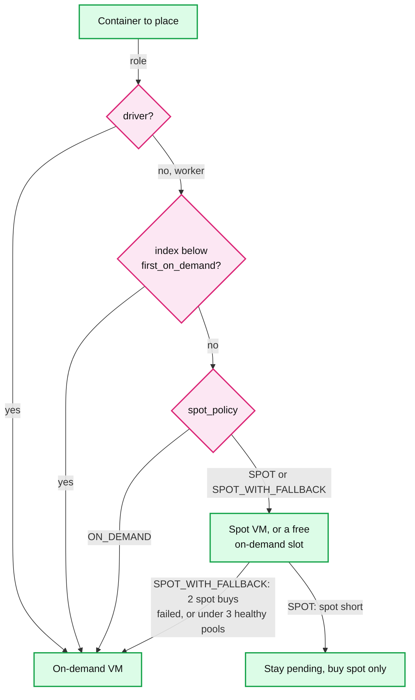
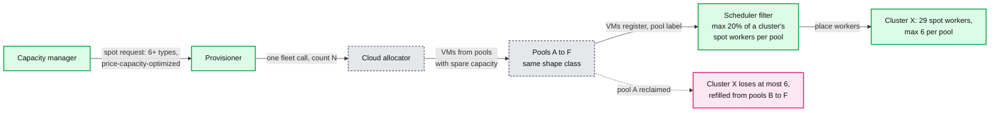
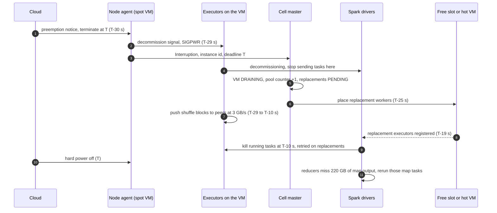
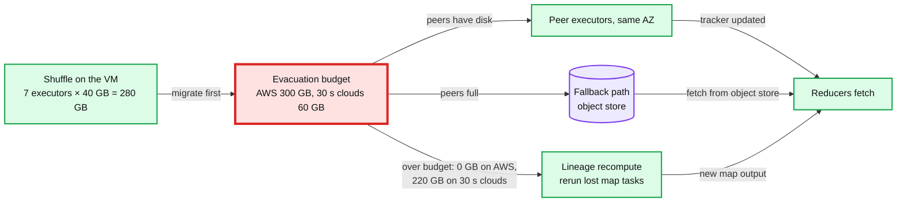
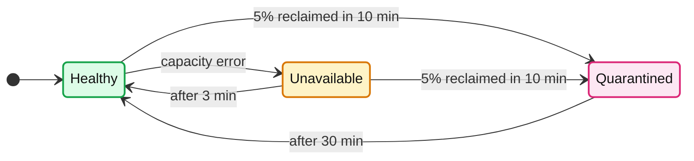

# Deep dive: spot capacity and interruption

> One-line answer: spot saves about $115M a year only if nobody notices it, so keep the driver and a `first_on_demand` floor on-demand, spread each cluster's spot workers over at least 6 instance-type pools with at most 20% in any one, treat the notice (120 s on AWS, 30 s on GCP and Azure) as a decommission deadline that moves shuffle to peers inside a bandwidth budget (about 300 GB per VM on AWS, 60 GB on 30 s clouds), recompute the rest from lineage, and when reclamation is correlated, quarantine the pool and fall back to on-demand knowing what it costs.

Reusable block: [`../solution.md`](../solution.md) §4.4 and §5.4 (the design this zooms into), [`../../../concepts/exactly-once.md`](../../../concepts/exactly-once.md) (two notice paths, one effect), [`../../../popular_systems_deepdive/kubernetes/kubernetes-08-autoscaling-and-scale.md`](../../../popular_systems_deepdive/kubernetes/kubernetes-08-autoscaling-and-scale.md) (Karpenter's interruption queue and spot-to-spot rule), [`preemption-and-priority.md`](preemption-and-priority.md) (preemption victims decommission the same way).

---

## 1. The money, and who may run on spot

| Line | Number | Note |
|---|---|---|
| 64 vCPU VM, on-demand vs spot | $3.07/h vs about $1.10/h | **Plan on 60 to 70% off.** The cloud's "up to 90%" (GCP: 91%) is the best SKU in the best pool |
| Fleet blend (60% of vCPU on spot), saving | $1.89/h, about $180M a year for 11k VMs. Saving: `11k × ($3.07 - $1.89) × 8,760 h` ≈ **$115M a year** | §2, §8 |
| One VM that falls back to on-demand | + $1.97/h | The price of every fallback in §5 |

- Why 60 to 70%: 6 pools puts some workers in pricier pools, price-capacity-optimized trades a little price for fewer interruptions, and interruptions cost rework. Assume one costs about 10 VM-minutes of rework, $0.50 (assumption): spot stays cheaper until a VM is reclaimed about 4 times an hour. The real limit is the < 0.1% run-failure SLO, not dollars.

- **Driver always on-demand**: losing it kills the Spark application (Databricks: never put the driver on a spot pool). **`first_on_demand = K`** (default 1): a cluster never drops to zero workers. **One-way door**: a spot-tolerant worker may use a free on-demand slot (already paid for); an on-demand-only container never lands on spot.

## 2. Diversification: pools, allocation strategy, the 20% cap

A **pool** is `(instance type, AZ, capacity type)`. The cloud reclaims per pool, so a pool is the unit of correlated loss.

- **Why 6, with a 20% cap.** 6 pools × 20% = 120% of room: lose one and 100% remains, so every replacement still fits on spot. 5 pools is the minimum just to place a cluster. Under 3 healthy pools (under 60% of room), `SPOT_WITH_FALLBACK` buys on-demand. The cap rounds up and is at least 1: 29 spot workers may put 6 in a pool.
- **Allocation strategy.** Price-capacity-optimized asks the cloud for the pools with the most spare capacity (least likely to be taken back soon), then the cheapest of those. Lowest-price piles the fleet into the one cheapest pool, which everyone else is also in and which goes first. The allocator spreads the fleet; only our cap spreads a cluster (best fit would happily pack one cluster onto one pool).
- **Why Karpenter asks for 15.** Its spot-to-spot consolidation (off by default) swaps a spot node for a cheaper one only if at least 15 cheaper compatible types exist; a narrow list lands on the least-available pool and raises the interruption rate. We never consolidate spot to spot (attrition empties VMs, §5.3), so 6 is enough for buying. Add that feature and the 15 floor comes with it.

## 3. The notice, second by second, on both kinds of cloud

| Step | AWS, 120 s | GCP or Azure, 30 s |
|---|---|---|
| Notice and detection | EventBridge event (about T-117) and instance metadata, agent polls every 5 s (AWS's advice): seen by T-115 at worst | Metadata flag (GCP) or Scheduled Events (Azure); agent polls every 1 s (our choice, 5 s would burn a sixth of the notice): T-29 |
| First action | Cell master asks each driver to decommission. First path wins; the second is a no-op by `instance_id` | Agent signals the executors itself (SIGPWR, the trigger Spark on Kubernetes uses), then tells the cell master |
| Replacements | On a free slot or hot VM by T-110, registered by T-104 | Placed by T-25, registered by about T-19 |
| Shuffle moved, then kill | T-115 to T-20: about 100 s × 3 GB/s ≈ **300 GB**. T-20: running tasks killed and retried, not counted as failures | T-29 to T-10: about 20 s × 3 GB/s ≈ **60 GB**. T-10: same; the rest is recomputed from lineage |

- **Two paths, one effect.** Event stream and agent both produce `Interruption(instance_id, deadline)`; the cell master dedups by `instance_id` and keeps the earlier deadline. **Treat every notice as best effort** (AWS and GCP say so): no notice is a plain node loss, the instance state-change event marks the VM `LOST` at once (no 30 s `SUSPECT` or 2 min replace wait), and Spark reruns lost map tasks. Borg's own notice reaches the task only about 80% of the time. Be correct at 0 s of notice; be cheap at 120 s.

## 4. Decommission, the evacuation budget, and what is above it

| Config (Spark 3.1+) | Value | What it does |
|---|---|---|
| `spark.decommission.enabled` | true | Executor accepts a decommission request or signal, stops taking tasks, tells the driver |
| `spark.storage.decommission.enabled` | true | Block manager migrates blocks off the executor |
| `spark.storage.decommission.shuffleBlocks.enabled` | true | Shuffle files move to peers; the map-output tracker points reducers at the new home |
| `spark.storage.decommission.rddBlocks.enabled` | true on AWS, false on 30 s clouds (our choice) | On a 60 GB budget, spend it on shuffle: a lost cache block is a re-read, a lost shuffle block is a rerun |
| `spark.storage.decommission.fallbackStorage.path` | object-store prefix per cell | Where blocks go when peers are short of disk |

- **Budget = usable seconds × NIC rate** (25 Gbps, about 3 GB/s). AWS: 100 s, **300 GB per VM, 40 GB per executor** at 7 per VM. GCP and Azure: 20 s, **60 GB per VM, about 8.5 GB per executor**.
- **Why the budget is red.** On a 30 s cloud a VM with 280 GB of shuffle moves 60 GB: 78% is recomputed. Nothing else in the spot path is that close to its limit. The fallback path does not raise it: object-store writes leave through the same NIC.
- **Above budget the run slows; it does not fail.** A VM holds about one executor from each of 7 clusters (§8), so each cluster loses about 31 GB of one executor's map output: for a 20-executor cluster, about 1/20 of the map stage, rerun in parallel on the other 19. Repetition fails runs (Spark aborts a stage after a few consecutive fetch-failure attempts, `spark.stage.maxConsecutiveAttempts`). Hence the pool cap and the livelock guard.
- **Remote shuffle, opt-in per cluster.** It costs every shuffle byte a second hop and adds a stateful fleet; assume 1 shuffle node per 10 worker VMs, about $0.30 per worker VM-hour (assumption). An AWS cluster under 40 GB per executor gains nothing. A shuffle-heavy spot cluster on a 30 s cloud recomputes about 31 GB per executor per reclaim; when reclaim waves repeat, the livelock guard moves it to on-demand at $1.97 more per VM-hour. The real comparison is **$0.30 vs $1.97**, so the threshold is per cloud (§10.11).
- **Live migration, rejected with arithmetic.** 7 × 32 GiB of heap (about 240 GB) plus up to 280 GB of shuffle is about 520 GB: 175 s at 3 GB/s. Longer than AWS's 120 s, 6x GCP's 30 s, the target VM must already exist (cold is 30 to 60 s), and a running JVM keeps dirtying the heap being copied.

## 5. Correlated reclamation: quarantine, rebalance, livelock, fallback

- **Quarantine on a rate, not an event.** One reclaimed VM out of hundreds is noise, so a single warning only bumps `interruptions_10m` (solution §4.4); the pool is quarantined when more than 5% of it is reclaimed in 10 minutes (§5.4, §10.2; a 300-VM pool trips past 15). A capacity error means "cannot sell now", skip 3 minutes; a reclaim wave means "taking back what it sold", skip 30. Neither touches running VMs.
- **Rebalance recommendation (AWS)** is a soft signal with no fixed lead time; it can come before or with the notice. We treat it as "stop placing here" (attrition penalty) and let the VM drain itself. No proactive replacement: that spends a launch token and a cold VM on a VM that may never be reclaimed.
- **Livelock guard.** Over 30% of spot workers lost twice in an hour moves the rest of the run's growth to on-demand, with `SPOT_LOST` and the reason. One pool event costs at most 20% (the cap), so crossing 30% already means several pools went at once; twice in an hour means the shape is being drained and the job is recomputing the same stages.
- **Fallback, priced.** Each fallback VM costs $1.97/h more and is a fresh launch from the provisioner's budget (1,000 burst, 2/s per account). One cell's 3k spot VMs falling back at peak is about **$5.9k an hour** and three accounts' burst tokens, which is why "over half a shape's types quarantined in a cell" pages (§10.9). Going back needs no action: new growth returns to spot as pools heal; on-demand workers age out in about 20 minutes.

## 6. What the interviewer is testing

- That spot is a discount with a tax (plan on 60 to 70%, not 90%; a fallback costs $1.97 per VM-hour), and that reclamation is correlated: "6 types, 20% cap" is arithmetic (5 to place, 6 to survive one loss), not taste.
- That the notice has a second-by-second answer with two paths, and that you know what 30 s breaks: the evacuation budget, and what happens above it.
- That you refuse live migration with a number and offer remote shuffle only where the numbers say so.

## 7. Numbers to say out loud

- Spot saves about $115M a year: $3.07 vs about $1.10 per VM-hour. Plan on 60 to 70% off; the cloud says up to 90%.
- Notice 120 s on AWS, 30 s on GCP and Azure; agent polls every 5 s or 1 s; tasks killed at T-20 s or T-10 s. Borg's notice reaches the task about 80% of the time.
- Budget: 300 GB per VM (40 GB per executor) on AWS; 60 GB per VM (about 8.5 GB per executor) on 30 s clouds.
- At least 6 types, at most 20% of a cluster's spot workers per pool, on-demand below 3 healthy pools. Karpenter wants 15 types for spot-to-spot.
- Unavailable 3 min after a capacity error. Quarantine 30 min after over 5% reclaimed in 10 min. Livelock: over 30% lost twice in an hour.
- Fallback costs $1.97 per VM-hour; one cell's 3k spot VMs falling back is about $5.9k an hour.
