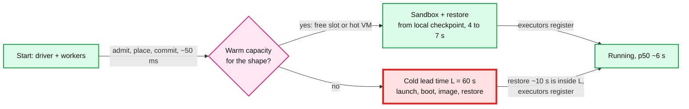
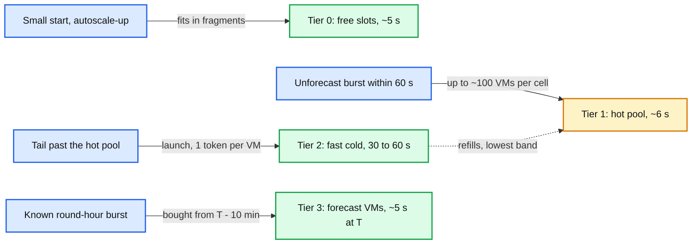
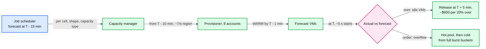
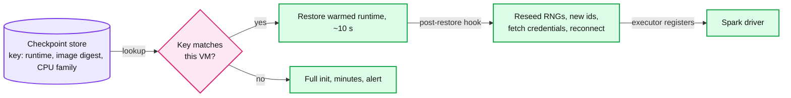
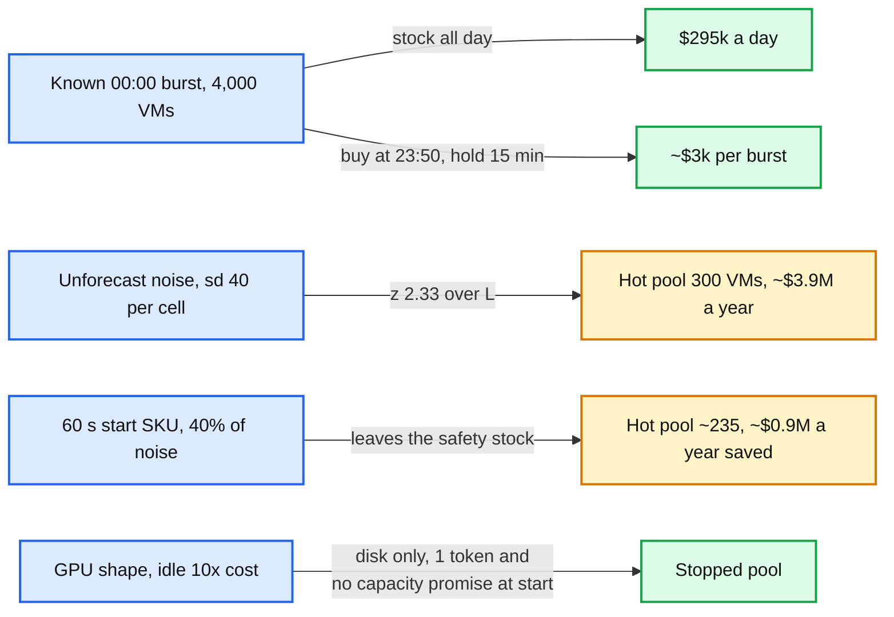

# Deep dive: warm pools and fast start

> One-line answer: a start is fast only if no stage waits on the cloud, so serve starts from four tiers in cost order (free slots ~5 s, a hot pool ~6 s, a fast cold path 30 to 60 s, and VMs bought 10 minutes ahead of the calendar burst), size the hot pool as safety stock over the cold lead time (about 100 VMs per cell, 2% of the fleet, $3M to $8M a year), shrink that lead time with a slim OS, lazy images and checkpoint/restore of a warmed runtime, and buy predictable demand just in time instead of stocking it ($3k per burst, not $295k a day).

Reusable block: [`../solution.md`](../solution.md) §2 and §5.1 (the summary this file zooms into), [`../../../concepts/serverless-architecture.md`](../../../concepts/serverless-architecture.md) (Firecracker, SnapStart and its reseeding caveat), [`../../../concepts/rate-limiting-and-load-shedding.md`](../../../concepts/rate-limiting-and-load-shedding.md) (token buckets), [`provisioning-and-reconciliation.md`](provisioning-and-reconciliation.md) (the launch budget), [`bin-packing-and-placement.md`](bin-packing-and-placement.md) (tier 0 is packing headroom).

---

## 1. The start-latency budget, stage by stage

| Stage | Warm (slot or hot VM) | Cold, eager (classic) | Fast cold | What removes or shrinks it |
|---|---|---|---|---|
| Admission, placement, Raft commit, push to agent | 20 + 1 + 5 + 20 ms | same | same | Equivalence classes, in-memory scoring |
| Launch call | 0 | 1 to 3 s | 1 to 3 s | Tiers 0, 1 and 3 skip it |
| OS boot to agent-ready | 0 | up to 60 s | ~10 s (slim end of solution §2) | Slim OS |
| Image fetch | 0, cached | several minutes | a few seconds | Local cache; lazy image loading |
| Sandbox and container start | 1 to 2 s | 1 to 2 s | 1 to 2 s | microVM sandbox (Firecracker boots in 125 ms) |
| Runtime init and executor registration | 3 to 5 s, local checkpoint | several minutes | ~10 s, checkpoint fetched | Checkpoint/restore of a warmed runtime |
| **Total** | **~5 to 8 s** | **minutes** | **30 to 60 s** | |

- The control plane is ~50 ms of a 6 s start; the node is the rest. Shaving the scheduler is pointless. The levers are "no new VM" (tiers) and "a faster node" (fast cold). Warm restore is 3 to 5 s because the hot VM already holds the checkpoint on local disk; a new VM fetches it first, which is our reading of why Databricks reports ~10 s. p50 <= 10 s means most starts never see the red box below; p99 <= 60 s means at most ~1% may.

## 2. Four tiers: what each costs idle and which demand it serves

| Tier | Start | Cost while idle | Serves | Size |
|---|---|---|---|---|
| 0. Free slots | ~5 s | Nothing extra: it is the 15% packing headroom | Small starts, autoscale-ups | ~15% of the fleet, fragmented |
| 1. Hot pool | ~6 s | Full VM price: $3M (spot) to $8M (on-demand) a year for 300 VMs | Unforecast bursts inside L | ~100 per cell |
| 2. Fast cold | 30 to 60 s | Nothing | The ~1% tail, and refilling tier 1 | Bounded by launch tokens |
| 3. Forecast | ~5 s at T | ~15 min of VM time per burst, ~$3k at 00:00 | 00:00 and other round hours | From the job calendar |

- Tier 0 is the biggest warm tier and was never bought for latency. It serves small starts only: a 20-worker cluster with a spread limit of 5 per VM needs 4 VMs with 40 free vCPU each, rare at 85% packing. The tiers are tried in cost order, not speed order: tier 3 is as fast as tier 1 but costs 15 minutes per burst instead of 24 hours a day, so everything predictable goes there.

## 3. Hot pool size is safety stock

- **Formula.** `target = mean + z × sd` of unforecast net demand (ad hoc starts plus autoscale-ups minus capacity freed) in VMs per window of length L, per `(cell, shape class)`, from the same hour of the week over recent weeks (assume 4). z = 2.33 for 99%. Floor 20. The 1% of windows left uncovered is the 1% of starts the p99 <= 60 s budget lets go cold. Worked (solution §2): L = 60 s, mean 10, sd 40: `10 + 2.33 × 40 = 103`, so ~100 per cell, 300 for the region, 2% of the 16k peak fleet.
- **By hour.** At 03:00, assume mean 2 and sd 12: `2 + 28 = 30` per cell. Recompute hourly. Raising the target back to 100 costs 70 launches per cell, which queue at the lowest band behind P1 and forecast demand (solution §5.2). **A shorter lead time shrinks it.** If unforecast arrivals are roughly independent (assumption), the mean scales with L and the sd with the square root of L. L = 30 s: `5 + 2.33 × 28.3 = 71` per cell. L = 15 s: 49. Halving the cold path cuts the region's pool from 300 to ~213 VMs, ~$1.1M a year. That is Databricks sizing its warm pool from boot time. The square-root rule fails for correlated bursts (one tenant firing 200 clusters), which is why one tenant may take at most 20% of a cell's hot pool per minute (§5.6).
- **Spot vs on-demand.** Drivers need on-demand, so ~20% of the pool is on-demand (drivers are 1 in 8 containers, plus `first_on_demand` floors). An on-demand hot VM can serve anything, since spot-tolerant workers may land on it; a spot one cannot host a driver. A reclaimed idle spot VM costs only its idle minutes, plus one launch token to refill. Blended $1.49/h, $13.1k per VM-year: 300 VMs is ~$3.9M a year.

## 4. The calendar pre-scale

- **What the forecast holds.** At T - 15 min the job scheduler (#6) publishes, per `(cell, shape class, capacity type, T)`, the containers of every run scheduled at T sized from its last run (drivers on-demand, workers by spot policy), packed into VMs, net of expected free slots, with a confidence (share of recent runs that fired). The cluster service routes each forecast run to the cell that bought for it, so forecast and routing agree.
- **The buy.** From T - 10 min the capacity manager adds the forecast to demand and spreads the launches: 4,000 VMs over 600 s is ~7 launches/s for the region, under the 16/s refill of 8 accounts. It leaves each account's 1,000-instance burst bucket full for what nobody forecast at T: spot replacements, P1, an under-forecast. VMs register as `WARM` by T - 1 min; 5,000 starts land on them, free slots and the hot pool at p50 ~6 s. At T + 5 min, forecast VMs still idle above the hot target are released.
- **Over-forecast** (runs paused, smaller clusters): the excess idles until T + 5. 20% over is 800 VMs × 15 min, ~$600 on-demand. **Under-forecast** (new jobs, a backfill): the excess goes to tier 0, then the ~300 hot VMs, then tier 2 from the untouched burst buckets. 20% under is 800 VMs: ~300 come from the hot pool and ~500 are bought cold at 30 to 60 s, and P1 may preempt P4. Being over costs $600; being under costs latency, so bias the forecast up. **Missing forecast** (job scheduler down): fall back to the hourly seasonal baseline per shape class. A capacity error during the buy is fine: 10 minutes leaves room to fail over types (3-minute unavailable cache).

## 5. The fast cold path, and what checkpoint/restore breaks

- **Why the image is the target.** Borg: median task start ~25 s, ~80% of it package installation. Slacker (FAST 2016): pulling packages is 76% of container start time, and only 6.4% of that data is read at start. So fetch blocks on first read: startup touches ~1/16 of the bytes. Databricks cut image pull from several minutes to a few seconds this way, booted its VMs 7x faster with a purpose-built OS, and cut runtime init plus JVM warm-up from several minutes to ~10 s by restoring a checkpoint of a runtime that had already loaded its libraries and run warm-up queries.
- **The hazards**, each of which ships to production if nobody names it:

| Hazard | Why it happens | Fix |
|---|---|---|
| Cloned randomness | Every restore of one checkpoint starts with the same random-number-generator state: same "random" ids, temp names, sampling seeds, and a cloned secure-random state | Reseed every generator from the kernel in a post-restore hook; create executor and app ids after restore; test by restoring twice and comparing ids |
| Stale credentials, identity, sockets | Tokens, certificates, hostname, IP and open connections captured at checkpoint time; timers jump | Checkpoint before any tenant or host identity exists and with no open connections; fetch credentials and recompute deadlines after restore; never capture the instance role |
| Runtime version skew | A checkpoint of runtime 15.4.1 restored beside 15.4.2 jars, or JIT code compiled for CPU features another family lacks (6+ spot families per shape) | Key the checkpoint by `(runtime version, image digest, CPU family)`; on a miss, full init and an alert |

## 6. The cost math: stock, just in time, stopped VMs, and a slow-start SKU

- **Stock the peak:** `4,000 × $3.07 × 24 h ≈ $295k a day`, about $108M a year, 60% of the whole fleet bill. **Buy it just in time:** `4,000 × $3.07 × 0.25 h ≈ $3k` per burst. Only the unpredictable part is stocked: 300 hot VMs, $2.9M a year all spot, $8.1M all on-demand, ~$3.9M at the 20/80 split, 2% of the $180M bill. With 15% packing headroom, that is the exchange rate for a 10 s p50 (solution §8).
- **Stopped VMs are not a free warm pool.** A stopped VM pays only for disk, but starting one is rate limited like a launch (StartInstances has its own bucket of the same size, 1,000 burst and 2 per second); it reserves no capacity and can fail with `InsufficientInstanceCapacity` exactly when the shape is scarce; the OS still boots, saving only the image fetch; and EC2 Auto Scaling warm pools do not support Spot in mixed-instance groups, while our pool is 80% spot across 6+ families. The 00:00 burst is already covered by the forecast for ~$3k. It fits scarce, expensive shapes: a GPU VM idle for an hour costs ~10x a CPU VM (solution §10.11), so disk-only plus a boot is the right trade there, with a paid capacity reservation if stock is the real risk.
- **The SKU.** A segment that accepts 60 s starts (overnight batch) skips tier 1, so its demand leaves the safety stock. If it carries 40% of unforecast demand (assumption), mean and variance fall by 40%: `6 + 2.33 × 31 = 78` per cell, ~235 for the region, 65 fewer hot VMs, ~$0.9M a year. That is the budget for the SKU's discount, and saying that number is the point.

## 7. What the interviewer is testing

- That you break 10 s into stages, see the control plane is ~50 ms of it, and speed up the node and the capacity, not the scheduler.
- That the warm pool is a formula (safety stock over the lead time), recomputed hourly, split by capacity type, and priced, and that a faster cold path shrinks it.
- That you buy predictable demand just in time, keep the burst buckets for the unpredictable, know what happens when the forecast is wrong either way, and name checkpoint/restore's hazards (cloned randomness, stale credentials, version skew) and stopped VMs' limits (rate limited like launches, no reservation, no spot in warm pools).

## 8. Numbers to say out loud

- Warm 5 to 8 s, fast cold 30 to 60 s, eager cold minutes; the control plane is ~50 ms of it.
- Hot pool `10 + 2.33 × 40 ≈ 100` per cell, 300 per region, 2% of the fleet, $3M to $8M a year (~$3.9M at 20% on-demand). Halving L cuts it ~30%.
- Forecast: publish T - 15 min, buy from T - 10 min at ~7 launches/s, release at T + 5 min. $3k per burst vs $295k a day to stock it.
- Slacker 76% / 6.4%. Borg 25 s / 80%. Databricks boot 7x faster, runtime init minutes to ~10 s. Firecracker 125 ms. StartInstances has its own 1,000 burst, 2 per second bucket, the same size as RunInstances'.
