# Diagrams: autoscaling cluster manager

The D1 to D12 set from `hld/CLAUDE.md` §4. Diagrams already embedded in [`solution.md`](solution.md) get a pointer, not a second copy.

| # | Diagram | Where |
|---|---|---|
| D1 | Context | below |
| D2 | Data flow | below |
| D3 | Component architecture (final design) | `solution.md` §6 |
| D4 | Happy path per FR | FR1 create: §4.1 (naive) and §6 Flow 1 (warm start). FR2 placement: §6 Flow 1 steps 6 to 9, plus the score pipeline in §5.3. FR3 autoscale: §6 Flow 2 (up) and Flow 5 (down). FR4 spot: §10.4 spot interruption timeline. FR5 preemption: below |
| D5 | Failure paths | Provisioner crash after launch: §5.5. Cell master failover: §10.4. 00:00 burst with a capacity error: §10.4. Partitioned VM: below. Two capacity-manager leaders: below |
| D6 | Decision flow (one pending container) | `solution.md` §4.5 |
| D7 | Entity relationship | `solution.md` §3.3 |
| D8 | State machines (cluster, VM, container) | below |
| D9 | Deployment / topology | below |
| D10 | Scaling / partitioning (cells, accounts, the launch budget) | below |
| D11 | Failure mode map | below, in two parts |
| D12 | Rollout / migration from classic | below |
| Zoom-ins | Incremental steps, capacity tiers, provisioner red node, placement pipeline, spot diversification | `solution.md` §4.1 to §4.4, §5.1, §5.2, §5.3, §5.4 |

## D1. Context (zoom-out)

The cluster manager as one box: callers on the left, the cloud on the right, three services we use but do not own.

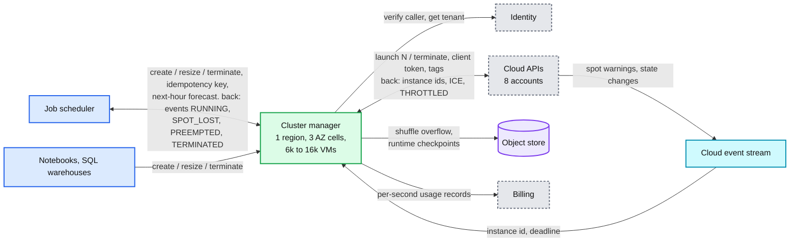

## D2. Data flow (DFD)

Every edge with data, size and rate at peak. Rates come from `solution.md` §2; sizes marked `~` are assumptions.

```mermaid
%% D2: what flows where at peak. Heartbeats are the biggest stream and never touch a store; launches are the smallest stream and the only rate-limited one.
flowchart LR
    JS[Job scheduler,<br/>notebooks, SQL] -->|"create spec, JSON ~1 KB,<br/>3.5/s avg, 83/s at 00:00"| API(Cluster service)
    API -->|"spec row ~2 KB, 300k/day"| DB[(Cluster DB)]
    API -->|"spec copy, ~28/s per cell at 00:00"| CM(Cell master x3)
    DRV(Spark drivers<br/>12k clusters) -->|"ReportDemand ~200 B,<br/>every 5 s, 2,400/s region"| CM
    AG(Node agents<br/>5.3k VMs per cell) -->|"Heartbeat 2 KB, 1,100/s per cell,<br/>2.2 MB/s, memory only"| CM
    CM -->|"Assign / Kill + epoch,<br/>~220/s per cell at 00:00"| AG
    CM -->|"Txns, under 1,000/s per cell,<br/>state ~100 MB"| CS[(Cell store x3)]
    CS -->|"capacity_request ~300 B,<br/>1 per batch, 5 s loop"| PV(Provisioner)
    PV -->|"launch N + 6 types, client token,<br/>~40k VMs/day, 140/min per cell before 00:00"| CL[Cloud APIs<br/>8 accounts]
    CL -->|"interruption warning ~1 KB,<br/>one per reclaimed spot VM"| EQ[Event stream]
    EQ -->|"instance id, deadline"| CM
    CM -->|"usage record ~200 B per container-minute,<br/>~1.7k/s at 100k containers"| BILL[Billing]

    class JS client
    class API,CM,DRV,AG,PV service
    class DB,CS store
    class EQ queue
    class CL,BILL external
    classDef client   fill:#dbeafe,stroke:#2563eb,stroke-width:2px,color:#111
    classDef service  fill:#dcfce7,stroke:#16a34a,stroke-width:2px,color:#111
    classDef store    fill:#ede9fe,stroke:#7c3aed,stroke-width:2px,color:#111
    classDef queue    fill:#cffafe,stroke:#0891b2,stroke-width:2px,color:#111
    classDef external fill:#e5e7eb,stroke:#6b7280,stroke-width:2px,color:#111,stroke-dasharray:4 3
```

## D4 (FR5). Preemption as a bridge

A P1 worker waits 5 s, the cold path is too slow, one P4 worker is evicted within its cluster's budget, and the victim later lands on the VM already in flight.

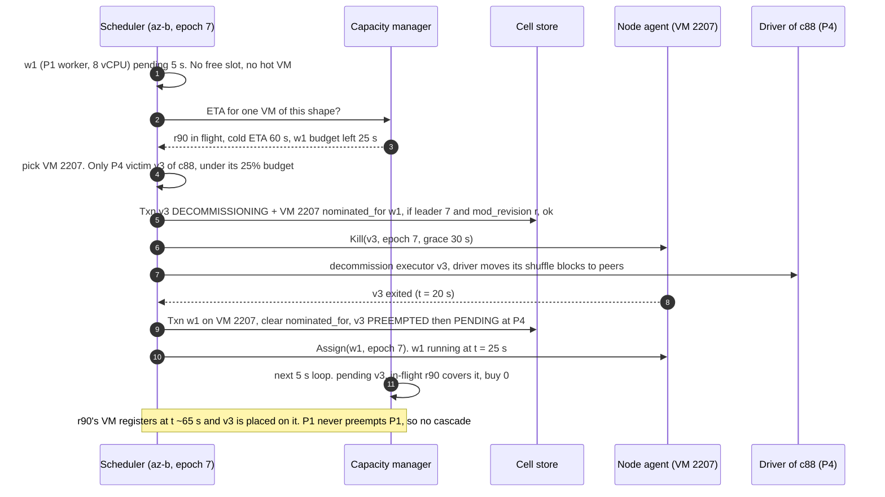

## D5 (fifth). Partitioned VM: suspect at 30 s, replace at 2 min, terminate at 10 min

The agent never kills customer work on its own. The epoch covers a reconnect; the cloud API is the fence for everything else.

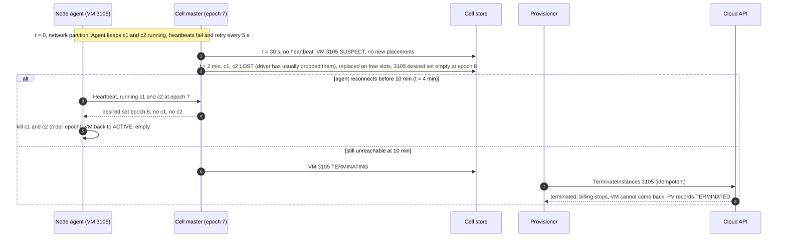

## D5 (sixth). Two capacity-manager leaders after a blip: no double buy

Two fences in series: the old leader's write fails the `leader_epoch` compare, and the provisioner acts only on rows stamped with the current epoch. The new leader **adopts** the old leader's open rows by re-stamping them (same `request_id` and `attempt`), so a launch that was already queued or in flight keeps its client token and is never bought twice ([`../../concepts/leases-fencing-clocks.md`](../../concepts/leases-fencing-clocks.md)).

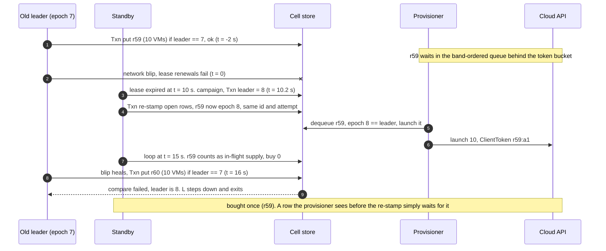

## D8. State machines

Three lifecycles, three owners: the cluster (cluster service and cell), the VM (capacity manager), the container (scheduler). Autoscaling happens inside cluster `RUNNING`; only a user resize enters `RESIZING`.

### D8a. Cluster

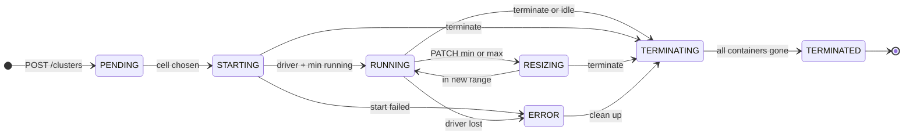

### D8b. VM

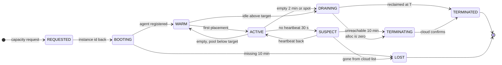

### D8c. Container

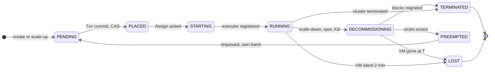

## D9. Deployment / topology

One cell per AZ with its own master and etcd; four regional pieces; one cloud behind 8 accounts.

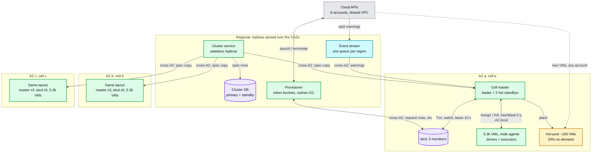

- Never crosses an AZ: heartbeats, `Assign`, shuffle, the etcd quorum, so an AZ loss takes one cell and a third of clusters. Crosses AZs: spec copies, request rows, cloud events, all control traffic off the running job's path. Cells b and c have the same edges as cell a, and draw VMs from all 8 accounts through a shared VPC.

## D10. Scaling / partitioning: cells by AZ, launches by account

The per-account launch budget at 00:00 is the hot shard. The fix is a path around it, not a faster box.

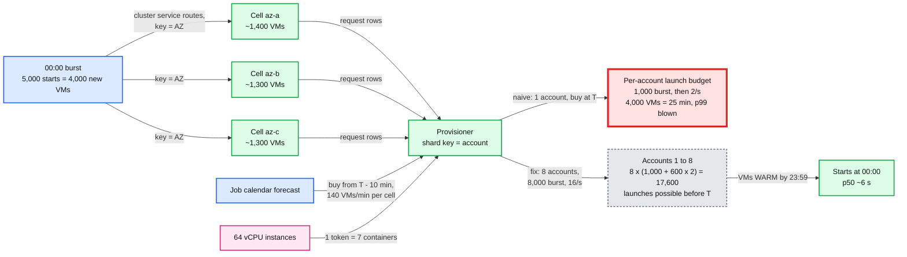

- The fix needs all three: the forecast spreads 1,400 launches per cell over 600 s, 8 accounts multiply the bucket, big instances make one token carry 7 containers. The scheduler is not sharded further: 55 decisions/s per cell against 2,000/s per core.

## D11. Failure mode map

Component, then blast radius (pink), then mitigation (blue), in two parts to stay under 15 nodes. Quorum loss is not in `solution.md` §8; its row follows from §5.5 (data plane independence) and §5.2 (AZ routing).

### D11a. Capacity side

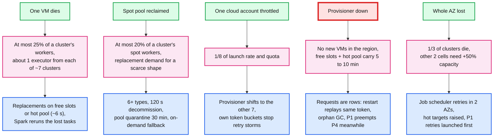

### D11b. Control side

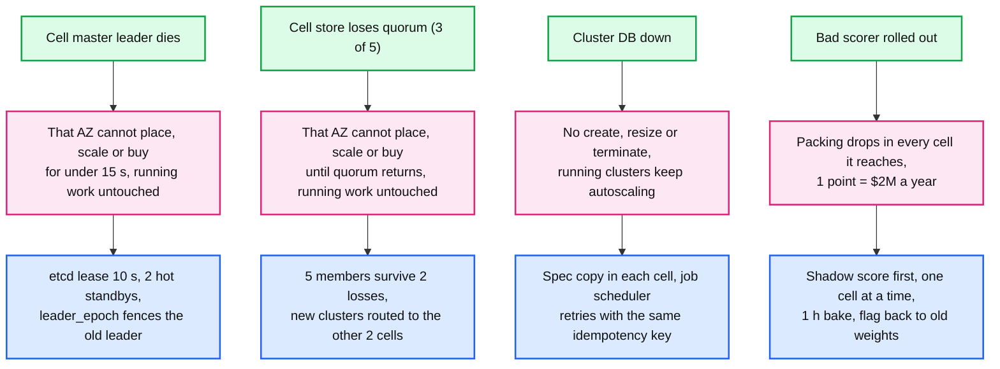

## D12. Rollout / migration from classic (one VM per worker)

Five phases, each ending in a rollback point that is a flag flip.

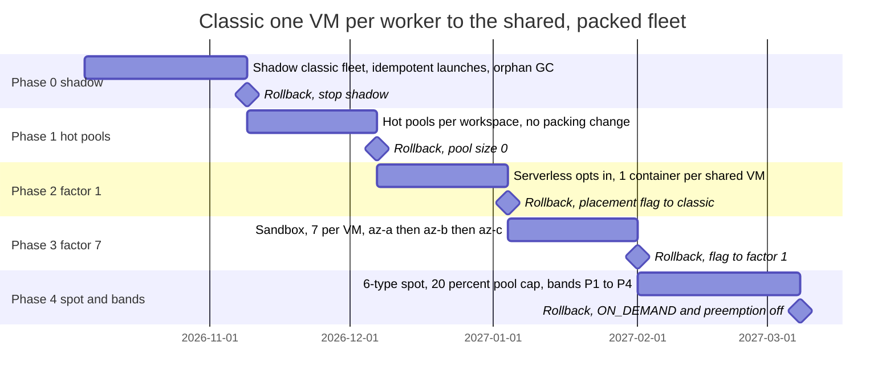

- Order and flags from `solution.md` §8; durations are assumptions. Phase 2 is the key de-risking step: the new control plane does the old thing (packing factor 1) before it does anything new, so any bug found there is a control-plane bug, not a packing or sandbox bug.
