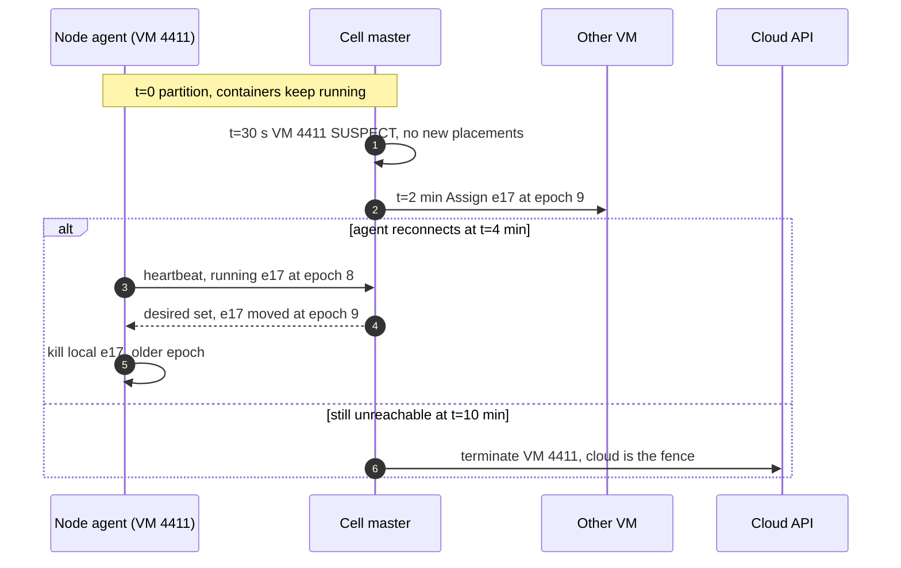

# Edge cases: autoscaling cluster manager

Every entry answerable in under 60 seconds out loud. Categories: failure, consistency, scale, data, operations, security. Design reference: [`solution.md`](solution.md). Bands: P1 production, P2 interactive, P3 batch, P4 best-effort. A cell is one availability zone (AZ). Numbers come from `solution.md`; anything else is marked as an assumption or as our choice.

---

## Failure

## Edge case: one VM dies (on-demand, no warning)
- **Trigger:** hardware fault, kernel panic, or the cloud retiring the host.
- **Symptom:** heartbeats from VM 812 stop. Usually one executor from each of about 7 clusters is lost, with its running tasks. On-call sees one `SUSPECT` VM, no page.
- **Answer:**
  - No heartbeat for 30 s (6 misses at 5 s): `SUSPECT`, no new placements. If the cloud's state-change event says the instance is stopped or terminated, skip the wait and mark it `LOST` at once.
  - The spread limit caps the damage: at most `max(1, 25% of workers)` of any cluster on one VM. The Spark driver drops those executors on its own heartbeat timeout and reruns their tasks (tasks are at-least-once).
  - At 2 min the containers are replaced on free slots or hot VMs (~6 s). Shuffle output on the dead VM had no notice, so the stages that still need it recompute from lineage.
  - At 10 min the VM is terminated through the cloud API. The cloud is the fence: a terminated VM cannot come back, and it stops billing.
- **Confidence:** [ ] shaky  [ ] ok  [ ] confident

## Edge case: a spot VM gets its 2-minute notice
- **Trigger:** the cloud wants the capacity back. AWS gives 120 s, best effort.
- **Symptom:** the user sees nothing, at most a slower stage. On-call sees the pool's interruption count tick up.
- **Answer:**
  - Two notice paths, first one wins: the event stream to the cell master, and the node agent polling instance metadata every 5 s. The VM goes `DRAINING`.
  - The driver decommissions its executors there: no new tasks, shuffle and cached blocks migrate to peers. About 100 s usable at 3 GB/s is about 300 GB per VM (7 executors at 40 GB).
  - Replacements are written at once and register on free slots or hot VMs by T - 104 s. New capacity comes from another pool, or on-demand under `SPOT_WITH_FALLBACK` after two failed spot attempts or with fewer than 3 healthy pools.
  - T - 20 s: leftover tasks are killed and retried, flagged as decommission, not task failure. T - 0: containers `LOST`, nothing else happens.
- **Diagram:** `solution.md` §10.4, spot timeline.
- **Confidence:** [ ] shaky  [ ] ok  [ ] confident

## Edge case: a whole spot pool is reclaimed at once
- **Trigger:** the cloud takes back one instance type in one AZ: hundreds of VMs in minutes.
- **Symptom:** a wave of warnings and a spike of pending workers for one shape, exactly when that shape is scarce.
- **Answer:**
  - Every spot request lists at least 6 types, and the scheduler caps a cluster at 20% of its spot workers per pool. A 30-worker cluster loses at most 6 of its 29 spot workers.
  - On-demand floor: the driver and `first_on_demand` workers (default 1) are never reclaimed, so no cluster drops to zero.
  - Over 5% of a pool reclaimed in 10 min quarantines it for 30 min. Replacements come from the other 5 pools, or on-demand when fewer than 3 healthy pools remain.
  - Livelock guard: a cluster that loses over 30% of its spot workers twice in an hour moves its remaining growth to on-demand and emits `SPOT_LOST` with that reason.
- **Diagram:** `solution.md` §5.4.
- **Confidence:** [ ] shaky  [ ] ok  [ ] confident

## Edge case: the cell master leader freezes in a garbage collection (GC) pause and comes back
- **Trigger:** a 20 s stop-the-world pause on the leader of one cell.
- **Symptom:** placement, both autoscaling loops and buying stop in that AZ for about 12 s. Running containers notice nothing. No page (that needs 30 s without a leader).
- **Answer:**
  - The leader's etcd lease (10 s time to live (TTL), renewed every 3 s) expires at t = 10 s. A hot standby with a warm watch cache wins at t = 10.2 s with `leader_epoch` 8 and resumes the loops by t = 12 s.
  - At t = 20 s the old leader wakes and sends a placement `Txn` that compares `leader == 7`. It fails and the old leader exits. `Assign` is sent only after a commit, so it cannot reach an agent either.
  - Open capacity requests from epoch 7 are re-stamped with epoch 8 under the same `request_id`, so the provisioner's retry reuses the same client token and nothing is bought twice.
  - Safety comes from the fence, not the timing: [`../../concepts/leases-fencing-clocks.md`](../../concepts/leases-fencing-clocks.md).
- **Diagram:** `solution.md` §10.4, cell master failover.
- **Confidence:** [ ] shaky  [ ] ok  [ ] confident

## Edge case: the cell store (etcd) loses quorum
- **Trigger:** 3 of 5 members down (bad rollout, disks), or the store hits its space quota and turns read-only.
- **Symptom:** every `Txn` and lease renewal fails, so the cell has no leader. "No cell leader for 30 s" pages. New work cannot start in that AZ; the other two AZs are fine.
- **Answer:**
  - Data plane independence: agents keep every container running and drivers keep running jobs. What stops is placement, autoscaling, buying and releasing, in one AZ.
  - The cluster service routes new creates to the other two cells on capacity health. No capacity request can be written, so nothing can be bought twice.
  - Recovery: replace members and restore quorum. A total loss is a snapshot restore plus a level-triggered reconcile: heartbeats carry each agent's full container set and cloud tags carry `cm-request-id`, so rows are rebuilt from observed state.
  - The quota case is unlikely: about 100 MB of state against a 2 GiB default quota and an 8 GiB suggested max. Alert on store size anyway. See [`../../concepts/etcd.md`](../../concepts/etcd.md).
- **Confidence:** [ ] shaky  [ ] ok  [ ] confident

## Edge case: the provisioner is down for 10 minutes
- **Trigger:** a bad deploy or a crash loop in the one regional provisioner.
- **Symptom:** request rows pile up unlaunched, the hot pool drains, more starts go cold. Pages: start p99 over 120 s, or P1 pending over 60 s. At 23:50 it threatens the 00:00 burst.
- **Answer:**
  - Free slots (15% of the fleet at 85% packing) and the hot pool (100 VMs per cell) carry roughly 5 to 10 minutes of normal demand. P1 containers past their start budget preempt P4 workers.
  - Intent is durable: the capacity manager keeps writing request rows and counts them as in-flight supply, so demand is queued, not lost and not re-bought.
  - On restart it replays every open row with `ClientToken = request_id:attempt`; anything launched before the crash comes back as the same instances. The queue drains P1 first, then forecast, then hot refill.
  - The outage refills the cloud's buckets: 600 s at 2/s tops each account back to 1,000, so 8 accounts can launch 8,000 at once. Stock, not rate, is the limit then.
- **Diagram:** `solution.md` §5.5, provisioner crash sequence.
- **Confidence:** [ ] shaky  [ ] ok  [ ] confident

## Edge case: one cloud account is throttled or suspended
- **Trigger:** throttling because another tool spends the same account's tokens, a quota mistake, or a suspension after a security incident.
- **Symptom:** throttle or capacity-error rate over 20% for 5 min on account 3 pages. If suspended, its VMs may be stopped.
- **Answer:**
  - 8 accounts per region, so one account is one eighth of launch capacity (1,000 burst, 2/s each). The provisioner stops routing to account 3 and spreads requests over the other 7; a cell's VMs can come from any account.
  - Our token bucket per `(account, API)` mirrors the cloud's, so real throttling means the mirror is wrong or someone else is spending. Back off with jitter; never retry-storm.
  - Suspension is a correlated loss of about one eighth of the fleet, about 2k VMs at peak. Workers are replaced like any lost VM; drivers on those VMs take their clusters down and the job scheduler retries those runs.
  - Only the provisioner holds launch and terminate credentials, so revoking one account's keys is contained.
- **Confidence:** [ ] shaky  [ ] ok  [ ] confident

## Edge case: the regional cluster database (DB) is down
- **Trigger:** primary failover, a bad schema migration.
- **Symptom:** `POST /clusters`, `PATCH` and terminate return 5xx. The 99.95% create service level objective (SLO) burns: about 22 min a month of budget. Running clusters notice nothing.
- **Answer:**
  - The spec copy in each cell keeps autoscaling and auto-terminate running, so idle clusters still stop billing. Only create, resize and explicit terminate fail.
  - Callers retry with the same `Idempotency-Key`. When the DB returns, the unique index on `(tenant, key)` turns every retry into the one cluster.
  - Status flows back eventually: `GET /clusters` is stale during the outage and catches up from the cell afterwards.
  - Blast radius: new work in the region waits; nothing running is touched.
- **Confidence:** [ ] shaky  [ ] ok  [ ] confident

## Edge case: a whole AZ is lost
- **Trigger:** power or network outage takes out one AZ, with its cell master and cell store.
- **Symptom:** a third of clusters die at once, because a cluster lives in one AZ. The job scheduler sees a third of runs fail.
- **Answer:**
  - By design: one cluster, one AZ, because cross-AZ shuffle costs money both ways. The job scheduler retries the runs and the cluster service routes them to the two surviving cells.
  - Those cells need up to 50% more capacity, about 2.65k VMs each at peak, from a cloud absorbing everyone else's failover. They raise hot targets, the provisioner puts P1 retries first, P1 preempts P4, and `SPOT_WITH_FALLBACK` goes on-demand.
  - Launch rate is enough on paper (8 accounts × 1,000 burst). Stock is the real limit, so the 6-type lists and the 3-minute unavailable cache do the work.
  - If the AZ comes back with VMs still running (a partition, not a power loss), the old clusters duplicate the retried runs. The job scheduler terminates them; output stays exactly-once through the job's commit protocol (Delta's log), not ours.
- **Confidence:** [ ] shaky  [ ] ok  [ ] confident

## Edge case: the VM holding a driver dies
- **Trigger:** hardware failure of the on-demand VM that hosts a driver. Drivers never sit on spot, but on-demand hardware still fails.
- **Symptom:** the Spark application dies with it and its executors are orphaned. The user sees `TERMINATED` with reason driver lost.
- **Answer:**
  - The driver is a single point of failure per cluster by Spark's design: it holds the job plan and the map-output tracker. We keep it on-demand and in P1, so it is never reclaimed or preempted. We do not build a standby driver.
  - The cell marks the cluster `TERMINATED`, kills its workers and frees their slots. Blast radius: one cluster.
  - Job clusters: the job scheduler retries the task on a new cluster. The key must carry the attempt (`run42:t3:a2`); reusing `run42:t3` would return the dead cluster for 24 h.
  - Interactive clusters: the user restarts; notebook state that lived in the driver is gone, the same contract as classic.
- **Confidence:** [ ] shaky  [ ] ok  [ ] confident

---

## Consistency

## Edge case: create retried with the same key, or with a new key by mistake
- **Trigger:** the job scheduler times out on `POST /clusters` and retries. Or a bug mints a fresh UUID on every retry.
- **Symptom:** same key: one cluster. New key: two clusters, one of them idle and billing.
- **Answer:**
  - Same key: the unique index on `(tenant, Idempotency-Key)`, kept 24 h, returns the same `cluster_id` and its current state. Same key with a different spec is rejected, like the cloud's `IdempotentParameterMismatch` (our choice: compare a spec hash).
  - New key: the server cannot tell it is a retry. The contract is on the caller: the job scheduler derives the key from run, task and attempt (`run42:t3:a1`); the UI mints one UUID per submit, not per retry.
  - Damage control: the duplicate has no job attached, so it idles and auto-terminates after `autoterminate_min`. The spend alarm catches a loop of them.
- **Confidence:** [ ] shaky  [ ] ok  [ ] confident

## Edge case: two users resize the same cluster at once
- **Trigger:** two admins `PATCH` `max_workers` within the same second.
- **Symptom:** one gets the new `generation`, the other gets `409`.
- **Answer:**
  - `PATCH` carries `if_generation`, and the spec row is compare-and-swapped (CAS). The loser re-reads and decides again. No silent last-writer-wins.
  - The cell applies a spec copy only if its `generation` is higher than the one it holds, so a delayed copy of generation 5 cannot undo 6.
  - The workload autoscaler re-reads `min` and `max` on every 5 s loop. A lower `max` shrinks by decommission, at most 25% of workers per decision.
- **Confidence:** [ ] shaky  [ ] ok  [ ] confident

## Edge case: two scheduler decisions race for the last slot on a VM
- **Trigger:** two equivalence classes in flight both score VM 812, which has 8 free vCPU.
- **Symptom:** without a guard, 16 vCPU placed on 8: an overcommitted VM and an out-of-memory kill.
- **Answer:**
  - Each placement is one etcd `Txn` that compares VM 812's `mod_revision` with the one it scored against, plus the `leader_epoch`. The first commit bumps the revision; the second fails its compare.
  - The loser rescores (VM 812's cached score is invalid now). Cost: one 0.5 ms decision. At 55 decisions/s per cell conflicts are rare.
  - A class above about 60 containers commits in chunks (128 operations per `Txn`). A failed chunk rescores alone; committed chunks start, so big clusters stream in.
- **Diagram:** `solution.md` §5.3, score pipeline with the conflict loop.
- **Confidence:** [ ] shaky  [ ] ok  [ ] confident

## Edge case: a release races a placement on the same VM
- **Trigger:** VM 812 has been empty 2 min; the capacity manager releases it while the scheduler places a worker on it.
- **Symptom:** without a guard, a container assigned to a VM being terminated: a failed start and a retry.
- **Answer:**
  - Release is two steps. A `Txn` moves `ACTIVE -> DRAINING` only if `alloc_vector == 0` and `mod_revision` is unchanged. Only then does the provisioner terminate.
  - The placement `Txn` compares the same `mod_revision`, so exactly one wins. Placement wins: the VM is not empty and the release fails. Release wins: the filter drops the `DRAINING` VM and the class rescores.
  - Hysteresis makes it rare: no release within 10 min of a purchase in the same shape class.
- **Diagram:** `solution.md` §6 Flow 5.
- **Confidence:** [ ] shaky  [ ] ok  [ ] confident

## Edge case: describe says "not found" right after a launch
- **Trigger:** the cloud's read API is eventually consistent; a new instance is missing from describe for a few seconds.
- **Symptom:** a naive provisioner reads "not found" as "not launched", calls again with a fresh token, and buys the VMs twice.
- **Answer:**
  - One "not found" is never proof. The row stays `LAUNCHING`; a retry uses `ClientToken = request_id:attempt` with the same parameters and gets the same instances back, launching nothing.
  - Same token with different parameters returns `IdempotentParameterMismatch`: a bug alarm, not a retry. Idempotency is zonal because we always pass the AZ or subnet.
  - Only 10 minutes of absence marks a VM row `LOST`. Orphan GC lists by tag every 5 min and terminates anything unmatched after 10 min, so a leak lives at most 15 min. See [`../../concepts/exactly-once.md`](../../concepts/exactly-once.md).
- **Diagram:** `solution.md` §5.5.
- **Confidence:** [ ] shaky  [ ] ok  [ ] confident

## Edge case: a partitioned VM comes back after its containers were replaced
- **Trigger:** a network partition cuts VM 4411's agent off from the cell master for 4 minutes.
- **Symptom:** for a while two copies of executor e17 exist: the old one still running on 4411, and its replacement.
- **Answer:**
  - 30 s: `SUSPECT`, no new placements. 2 min: e17 is placed elsewhere with a higher `epoch` (the driver has usually dropped the old one on its own heartbeat timeout). 10 min: terminate through the cloud API.
  - If the agent reconnects first, the heartbeat reply is the desired container set and the agent kills anything with an older `epoch`. While cut off it never kills work on its own: it cannot tell a partition from a control-plane outage.
  - Duplicate task output is harmless: the driver ignores an executor it has removed, and job output is made exactly-once by the job's commit protocol, not by us.
- **Diagram:**

- **Confidence:** [ ] shaky  [ ] ok  [ ] confident

## Edge case: a spot warning arrives twice (event plus metadata)
- **Trigger:** the event stream is at-least-once, and the agent's metadata poll sees the same warning.
- **Symptom:** without dedup: double replacements, two decommission calls, and the pool's interruption count bumped twice, which quarantines it early.
- **Answer:**
  - Dedup key is `instance_id` until the VM row closes. The first notice moves the VM `ACTIVE -> DRAINING` in a `Txn`; the second finds it `DRAINING` and is a no-op.
  - The pool counter is bumped on that state change, not per message, so it counts VMs, not notices.
  - Replacements are not per event: the workload autoscaler writes them from `running < desired` (decommissioning workers do not count as running), which is the same number however many notices arrive.
  - The opposite, no notice at all (it is best effort), degrades to "one VM dies": no evacuation, shuffle recomputed.
- **Confidence:** [ ] shaky  [ ] ok  [ ] confident

---

## Scale

## Edge case: 5,000 cluster starts in the minute after 00:00
- **Trigger:** scheduled jobs pile onto round hours: 83 starts/s, 24x average, about 320k vCPU of new demand.
- **Symptom:** unfixed, about 4,000 new VMs in one minute. One account gives 1,000 now and 2/s after: 25 minutes.
- **Answer:**
  - Forecast from the job calendar: buy from T - 10 min, spread over 10 min. Each account then has `1,000 + 600 × 2 = 2,200` launches before T; 8 accounts give 17,600.
  - Big instances: the bucket counts instances, not vCPU, so one 64-vCPU VM is one token.
  - At T, starts land on forecast VMs, free slots and the hot pool (p50 about 6 s). Forecast VMs still idle at T + 5 min are released.
  - Do not shard the scheduler: it needs 55 decisions/s per cell and one core does 2,000. The cloud API breaks first.
- **Diagram:** `solution.md` §10.4, 00:00 burst timeline.
- **Confidence:** [ ] shaky  [ ] ok  [ ] confident

## Edge case: InsufficientInstanceCapacity for the popular shape in one AZ
- **Trigger:** the cloud is out of `m6i.16xl` in az-a, often at 00:00 when every cron job on the cloud asks at once.
- **Symptom:** capacity errors for one type; pending workers in az-a age. Over 20% errors for 5 min pages.
- **Answer:**
  - The unavailable-offerings cache marks `(type, AZ, capacity type)` out for 3 min, and requests move to the next of 6 types within seconds. The Cluster Autoscaler's 5 to 30 min node-group backoff is too coarse.
  - The fallback call is a new attempt with a new client token (`r42:a2`): changing the type under the old token returns `IdempotentParameterMismatch`. Safe, because the first answer was definitive and any ids it returned are recorded first.
  - New clusters are routed to another AZ. Growth of existing az-a clusters waits (a cluster never spans AZs); P1 may preempt P4; `SPOT_WITH_FALLBACK` goes on-demand below 3 healthy pools.
- **Diagram:** `solution.md` §5.2, the red provisioner.
- **Confidence:** [ ] shaky  [ ] ok  [ ] confident

## Edge case: a 1,000-worker cluster
- **Trigger:** a backfill asks for `max_workers = 1,000` at 8 vCPU: 8,000 vCPU, about 143 VMs at 7 per VM.
- **Symptom:** the start SLO does not cover it (p99 60 s is for up to 50 workers). The user sees the driver in 10 s and workers streaming in.
- **Answer:**
  - Scheduling is cheap: one equivalence class, scored once, committed in about 17 chunks of 60 (128 operations per `Txn`).
  - Up fast: `min` to `max` in at most two steps, capped by the tenant's band quota. Above quota it borrows at P4.
  - Hot-pool cap: one tenant takes at most 20% of a cell's hot pool per minute (20 VMs); the rest goes cold. 143 launches fit well inside one account's 1,000 burst.
  - Down slow: 25% per 40 s window, 1,000 to 750 to 563, idle executors with the least shuffle first.
- **Confidence:** [ ] shaky  [ ] ok  [ ] confident

## Edge case: 10x growth (3 M starts a day, 160k VMs)
- **Trigger:** the business grows 10x in one region.
- **Symptom:** one cell per AZ would hold 53k VMs, 5x a median Borg cell. 8 accounts give a tenth of the launch budget needed.
- **Answer:**
  - Several cells per AZ, each up to about 10k VMs (Borg's median). The cluster service routes to a cell, not an AZ. Each cell's etcd and scheduler stay at today's load.
  - The scheduler is still not the bottleneck: 550 decisions/s for the whole region.
  - The provisioner needs 10x the launch budget: more accounts and raised limits (the cloud raises them per API through a support case).
  - The hot pool grows slower than the fleet: if unforecast demand is independent across tenants, its standard deviation grows about sqrt(10) = 3.2x, so about 3x the VMs, not 10x (assumption: independence).
- **Confidence:** [ ] shaky  [ ] ok  [ ] confident

## Edge case: one tenant's backfill drains the hot pool
- **Trigger:** a tenant launches a 10,000-worker backfill that would take every free slot and the whole hot pool in a minute.
- **Symptom:** everyone else's starts go cold; start p99 in the cell climbs past 60 s.
- **Answer:**
  - Hot-pool cap: at most 20% of a cell's hot pool per tenant per minute. The rest of the backfill goes cold, which a backfill can afford.
  - Quota per tenant per band in vCPU, enforced by the workload autoscaler on every growth step. Above quota the tenant borrows at P4, which anyone can preempt.
  - Under shortage, pending demand is served by band, then by weighted fair share on vCPU across tenants, not first come first served.
  - Spend guardrail: 3x the tenant's 7-day p95 hourly spend pages; 10x holds new growth for manual approval.
- **Confidence:** [ ] shaky  [ ] ok  [ ] confident

---

## Data

## Edge case: runtime version upgrade (a new image on the fleet)
- **Trigger:** a new runtime version, or a new node image (OS plus agent), ships.
- **Symptom:** the risk is that every start on the new version goes cold, because hot VMs hold the old image and the old runtime checkpoint.
- **Answer:**
  - Warm targets are per `(cell, shape class, image version)`. Roll through the hot pool first: new VMs launch with the new image, old VMs age out by attrition (job containers live about 20 min). No VM is replaced in place.
  - The image-cached bonus in the score steers each version to VMs that hold it. A miss costs seconds, not minutes, with lazy image loading (only 6.4% of an image is read at start).
  - Running clusters keep the version in their spec. Both versions sit in the hot pool during the rollout: a small, temporary idle cost.
  - One cell at a time with a 1-hour bake. Rollback: stop launching the new image; its VMs drain by attrition within a few hours.
- **Confidence:** [ ] shaky  [ ] ok  [ ] confident

## Edge case: shuffle bigger than the evacuation budget on a 30 s-notice cloud
- **Trigger:** GCP or Azure spot gives 30 s. A VM with 7 executors at 40 GB each holds 280 GB of shuffle; the budget is about 60 GB.
- **Symptom:** about 220 GB per reclaimed VM is recomputed; stages rerun; a spot-heavy run can livelock.
- **Answer:**
  - Order: migrate to peers first, then to the object-store fallback path, then recompute the rest from lineage.
  - For clusters that are both shuffle-heavy and mostly spot on a 30 s cloud, offer a remote shuffle service, opt-in per cluster. The threshold is per cloud because the notice length is.
  - The 20% per-pool cap bounds what one pool event takes. The livelock guard moves growth to on-demand after two losses over 30% in an hour.
  - Not live migration: 30 s cannot move a 32 GiB heap into a VM that does not exist yet.
- **Confidence:** [ ] shaky  [ ] ok  [ ] confident

## Edge case: stranded capacity climbs after a memory-heavy shape is added
- **Trigger:** product adds an 8 vCPU / 128 GiB executor (16 GiB per vCPU) to a menu built on 4 and 8 GiB per vCPU.
- **Symptom:** the stranded ratio passes 5% (ticket) and packing falls under 85%. Each point is about $2M a year.
- **Answer:**
  - Alone on a 64 vCPU / 512 GiB VM, 3 fit (assume about 480 GiB allocatable) and use 24 of 60 vCPU: 60% of the CPU stranded.
  - The alignment term steers CPU-heavy 4 GiB-per-vCPU executors onto the spare vCPU. The stranded penalty blocks placements that leave one dimension useless.
  - Add a VM family with the same 16:1 ratio to the candidate types. The capacity manager bin-packs pending containers into hypothetical VMs and buys the cheapest per packed vCPU, so it picks that box on its own.
  - Ship a new shape with the scorer in shadow mode and watch `stranded_ratio` per cell before opening it to everyone.
- **Diagram:** `solution.md` §5.3.
- **Confidence:** [ ] shaky  [ ] ok  [ ] confident

---

## Operations

## Edge case: what pages at 3am
- **Answer:**
  - Pages: start p99 over 120 s for 10 min in any cell. Any P1 container pending over 60 s. Throttle or capacity-error rate over 20% for 5 min. Orphan count rising three GC cycles in a row. No cell leader for 30 s. Spot quarantines over half of a shape's types in a cell.
  - Tickets, not pages: spot-caused run failures over 0.1% a day, stranded ratio over 5%, hot pool under 50% of target for an hour.
  - First look: one cell, one account, one shape, or everything? One cell is the AZ or its etcd. One account is throttling. One shape is stock. Everything is our own deploy.
- **Confidence:** [ ] shaky  [ ] ok  [ ] confident

## Edge case: a bad scorer rollout
- **Trigger:** new weights that favour spreading, or a filter bug that rejects valid VMs.
- **Symptom:** spreading: packing sags, VMs stop emptying, the fleet grows, about $5.5k a day per point of packing. Filter bug: pending grows and start p99 pages.
- **Answer:**
  - Scorer changes ship in shadow mode first: compute the new score, log the decision it would have made, compare packing offline.
  - Then one cell at a time, smallest region first, with a 1-hour bake on start latency, stranded ratio and orphan count.
  - Rollback is a flag back to the old weights, instant. Nothing is re-packed; bad placements empty by attrition in about 20 min.
  - A scorer or node-agent build on every cell at once is the largest blast radius in the design. The per-cell rollout exists for this.
- **Confidence:** [ ] shaky  [ ] ok  [ ] confident

## Edge case: migrating from classic one-VM-per-worker
- **Trigger:** today every worker is its own VM in the customer's account. Move to the shared, packed fleet with zero downtime.
- **Answer:**
  - Phase 0: provisioner and cell stores run in shadow over the classic fleet (idempotent launches, orphan GC), no behavior change. Phase 1: hot pools per workspace, the start-time win with no packing change.
  - Phase 2: new serverless workloads join the shared fleet at packing factor 1. Phase 3: packing factor 7 with the sandbox, one cell at a time. Phase 4: diversified spot and preemption bands.
  - Rollback at every phase is a per-cluster placement flag. Nothing is migrated: clusters drain on their own because jobs live about 20 minutes.
  - Classic stays as a mode for tenants whose VMs must live in their own account: packing factor 1 and a role in their account.
- **Confidence:** [ ] shaky  [ ] ok  [ ] confident

## Edge case: cost spike when spot falls back to on-demand at scale
- **Trigger:** several spot pools for a shape quarantined together; `SPOT_WITH_FALLBACK` buys on-demand and livelock guards move growth to on-demand.
- **Symptom:** the "quarantines over half of a shape's types" page. If all 9k peak spot VMs fell back: `9,000 × ($3.07 - $1.10) ≈ $17.7k` an hour, about $425k a day.
- **Answer:**
  - The fallback is correct: spot is only a discount if nobody notices, and the target is under 0.1% of runs failing. The page exists so a human decides how long to pay for it.
  - Levers: widen the type list past 6 (more families and generations), route new clusters to AZs with healthy pools. Clusters on `SPOT` wait instead of paying.
  - Recovery is automatic: quarantine lasts 30 min, then spot is tried again. Fallback VMs empty by attrition in about 20 min; release empty on-demand VMs before spot ones (our choice).
  - `SPOT_LOST` events carry the reason, so the job scheduler and the customer see why the run cost more.
- **Confidence:** [ ] shaky  [ ] ok  [ ] confident

---

## Security and abuse

## Edge case: a malicious driver lies in ReportDemand
- **Trigger:** customer code in the driver reports 400 pending tasks with no work behind them, to hoard workers.
- **Symptom:** the cluster grows to `max` and the tenant's bill grows.
- **Answer:**
  - Bounded by the cluster's `max`, the tenant's band quota, and the fact that the tenant pays for what it asked for.
  - Trusted for sizing only, never for anything that touches another tenant: the band comes from the spec, and the 20% hot-pool cap and fair share still apply.
  - Claiming huge shuffle to dodge preemption barely helps: victims are chosen by band and victim count first; shuffle size is only the tie-breaker.
  - The cell master accepts `ReportDemand` for a cluster only from that cluster's driver container, as named by the node agent (our choice), and ignores an older `seq`.
- **Confidence:** [ ] shaky  [ ] ok  [ ] confident

## Edge case: a container tries to reach the VM's instance metadata and role credentials
- **Trigger:** customer code calls the instance metadata service (IMDS) link-local address from inside its container.
- **Symptom:** if it worked, it would hold the VM's instance role credentials on a VM shared with other tenants.
- **Answer:**
  - Each container runs in a sandbox (microVM or gVisor-class) with no route to the host's metadata service.
  - The host uses IMDS session-token mode with a hop limit of 1, so even a container one network hop away cannot get a token.
  - The instance role is minimal: only the provisioner can launch or terminate. Spot-notice polling runs in the node agent on the host, so blocking containers breaks nothing.
  - A VM cannot pose as another: agents register with the cloud's signed instance identity document, checked against a VM row from our own capacity request, over mutual TLS (mTLS).
- **Confidence:** [ ] shaky  [ ] ok  [ ] confident

## Edge case: a runaway create loop from one tenant
- **Trigger:** a tenant's script calls `POST /clusters` in a loop with a fresh key each time.
- **Symptom:** thousands of `PENDING` clusters; the hot pool and launch budget drain; other tenants start cold.
- **Answer:**
  - Create-API rate limit per tenant (for example 10 creates a second) at the edge ([`../../concepts/rate-limiting-and-load-shedding.md`](../../concepts/rate-limiting-and-load-shedding.md)).
  - Band quota is checked at create for `min`, so the loop stops at the tenant's vCPU quota; beyond that only P4, which anyone can preempt. Trial tenants may use only P4.
  - The hot-pool cap and the provisioner's P1-first queue keep other tenants ahead. The spend alarm pages at 3x the 7-day p95 hourly spend and holds growth at 10x.
  - Clusters the loop never uses idle out and auto-terminate.
- **Confidence:** [ ] shaky  [ ] ok  [ ] confident

## Edge case: a tenant requires no co-tenancy
- **Trigger:** a compliance rule forbids sharing a VM with other customers.
- **Symptom:** packing loss: a driver plus one worker (16 vCPU) alone on a 64-vCPU VM uses 16 of 60 vCPU.
- **Answer:**
  - Isolation class `dedicated`: a VM carries the tenant's label while any of its containers run, and the filter admits only that tenant. A filter, not a second system.
  - An emptied dedicated VM is terminated, never handed to another tenant, so no residue crosses tenants.
  - The capacity manager buys the smallest shape that fits the tenant (16 or 32 vCPU): more launch tokens, less stranding. Price the premium to the tenant.
  - Strongest form: classic mode in the tenant's own account (packing factor 1, their launch limits, their instance pool).
- **Confidence:** [ ] shaky  [ ] ok  [ ] confident
