# HLD: Autoscaling cluster manager

> One-line answer: split the manager into three loops per availability zone (AZ). A **workload autoscaler** turns each cluster's Spark task backlog into a desired worker count between `min` and `max`. A **cell scheduler** bin-packs driver and worker containers onto VMs with a best-fit score, keeps each cluster spread across VMs, and preempts only best-effort workers when nothing is free. A **capacity manager** buys VMs for pending demand minus what is already in flight, keeps a hot pool of about 2% of the fleet, pre-scales before the known top-of-hour burst from the job calendar, and releases VMs only after they sit empty. One regional **provisioner** turns capacity requests into idempotent cloud launches (client token = request id plus attempt), shards them across cloud accounts to stay under the 1,000-burst, 2-per-second launch limit, falls back across instance types on "no capacity", and garbage-collects any VM it cannot account for. Spot is used for workers only, spread over at least 6 instance types, and a reclaimed worker hands its shuffle files to a neighbour inside the 2-minute notice. Running clusters never depend on the control plane being up.

Sources: the problem as indexed in [`../README.md`](../README.md) (no verbatim public prompt exists, see [`research/interview-framing-survey.md`](research/interview-framing-survey.md)), the Borg paper (EuroSys 2015), Autopilot (EuroSys 2020), Twine and Protean (OSDI 2020), the Kubernetes Cluster Autoscaler and Karpenter source, the Databricks compute docs and the 2024 post on booting Serverless VMs 7x faster, and the AWS EC2 throttling, idempotency and spot docs (see [`research/real-world-architectures-survey.md`](research/real-world-architectures-survey.md) and [`research/mechanisms-survey.md`](research/mechanisms-survey.md), each with a spot-check section; numbers here come from those checks). Written flow-first: §4 builds one diagram one functional requirement at a time, §5 breaks and mutates that design one non-functional requirement at a time, §6 shows the final design and the core flows to rehearse. Reusable blocks: [`../../concepts/etcd.md`](../../concepts/etcd.md), [`../../concepts/leases-fencing-clocks.md`](../../concepts/leases-fencing-clocks.md), [`../../concepts/exactly-once.md`](../../concepts/exactly-once.md), [`../../concepts/rate-limiting-and-load-shedding.md`](../../concepts/rate-limiting-and-load-shedding.md). Source-level Kubernetes depth: [`../../popular_systems_deepdive/kubernetes/kubernetes-03-scheduler.md`](../../popular_systems_deepdive/kubernetes/kubernetes-03-scheduler.md) and [`../../popular_systems_deepdive/kubernetes/kubernetes-08-autoscaling-and-scale.md`](../../popular_systems_deepdive/kubernetes/kubernetes-08-autoscaling-and-scale.md).

---

## 1. Understanding the problem

Restate before designing. Three facts shape every decision, and saying them in the first minute is the Staff signal:

1. **Supply is elastic but slow and can say no.** A new VM takes 30 to 90 s to be useful, the launch API is rate limited per account, and a given instance type in a given AZ can be out of stock. So "just buy more" has a latency, a rate, and a failure mode.
2. **Idle capacity is the product's margin.** Customers pay per second of cluster time. Every VM we hold that no cluster uses is our cost. Fast start and low cost pull in opposite directions, and warm capacity is the dial between them.
3. **There are three different questions with three different clocks.** How many workers does *this cluster* want (seconds, from Spark's backlog)? Which VM does *this container* go on (milliseconds)? How many VMs of which type should *the fleet* hold (tens of seconds to minutes)? One loop per question. Mixing them is how autoscalers thrash.

### 1.1 Functional requirements

Core:
1. **Cluster lifecycle.** Create, resize (`min`, `max`), and terminate a cluster: one driver plus `min..max` workers of a chosen shape, runtime version, spot policy and priority band. Asynchronous (returns `PENDING`), idempotent on a client key, auto-terminates after N idle minutes.
2. **Placement (bin packing).** Every driver and worker runs as a container on some VM. Pack tightly to keep cost down, but respect the AZ, the shape, the isolation class, and a limit on how many of one cluster's workers share a VM.
3. **Autoscaling.** Each cluster grows and shrinks between `min` and `max` from its own workload. The fleet grows when containers are pending and shrinks when VMs sit empty.
4. **Spot.** Workers run on spot VMs when the cluster's policy allows (`ON_DEMAND`, `SPOT_WITH_FALLBACK`, `SPOT`). A reclaimed VM does not fail the job.
5. **Preemption.** When capacity is short, higher-priority work takes capacity from lower-priority work, without cascades.

Below the line (say it out loud):
- The Spark engine and the job scheduler that decides when runs start ([`../distributed-job-scheduler/`](../distributed-job-scheduler/), #6). It is our biggest client and its calendar is our best forecast.
- Billing, VPC and network setup, identity. We emit per-second usage records; someone else prices them.
- Gang scheduling (all N GPUs or nothing) for distributed training. Spark does not need it; the seam is in §10.11.
- A cluster spanning AZs. Shuffle traffic across AZs costs money in both directions and adds latency. One cluster, one AZ.
- Live migration of executors. We decommission and recompute instead (§5.4).

### 1.2 Non-functional requirements

Ask for scale first: one region, three AZs, 300k cluster starts a day, 12k concurrent clusters at peak, 800k vCPU requested at peak. Then:

| Dimension | Target | Why it matters |
|---|---|---|
| Start latency | Driver plus `min` workers running: p50 <= 10 s, p99 <= 60 s, for clusters up to 50 workers. Larger clusters: driver in 10 s, workers stream in | Interactive users stare at a spinner. Job clusters that start in 5 minutes add 5 minutes to every pipeline |
| Autoscale reaction | Decision within 5 s of a sustained backlog. New workers within 10 s from warm capacity, 60 s cold. Scale-down after 40 s (job) or 150 s (interactive) of underuse | Too slow up wastes the user's time; too fast down wastes ours on churn |
| Efficiency | Packing (requested / allocatable vCPU) >= 85% at peak. Idle warm capacity <= 3% of fleet. >= 60% of worker vCPU on spot | At our size one point of packing is about $2M a year (§2) |
| Spot resilience | < 0.1% of job runs fail because of spot reclamation | Spot is only a discount if nobody notices it |
| Availability | Running clusters survive a full control-plane outage. Create API 99.95%. Cell scheduler failover < 15 s | The control plane can be down; the customer's job cannot |
| Correctness | No leaked VM lives > 15 min. Over-buy bounded by one control interval. Same create key never yields two clusters | Leaks and double buys are silent money loss that compounds |
| Consistency | Cluster spec: strong (one versioned row). Placement: strong within an AZ (single leader, Raft store, fencing epoch). Node usage and cloud inventory: eventual, seconds | Two schedulers placing on the same free slot overcommit a VM; a stale usage number only delays a scale decision |

---

## 2. Back-of-envelope

Only the numbers that change the design.

**Fleet size comes from vCPU, not from cluster count.** 12k clusters × (1 driver + 7 workers) is about 100k containers. At the default 8 vCPU / 32 GiB shape that is 800k vCPU requested. A 64 vCPU / 256 GiB VM has 60 vCPU allocatable after the OS, node agent and sandbox overhead, so 7 default containers fit (56 vCPU, 93% ceiling for that shape). At 85% fleet packing: `800k / (60 × 0.85) = 15.7k`, so **about 16k VMs at peak**, about 6k at trough. Three AZ cells of about 5.3k VMs each, half the size of a median Borg cell (10k machines).

**Money frames every trade-off.** A 64-vCPU general-purpose VM lists at about $3.07/h on-demand; spot is typically 60 to 70% cheaper, call it $1.10/h. With 40% of vCPU on-demand (drivers, `first_on_demand` workers, on-demand-only clusters) and 60% on spot, the blend is about $1.89/h. An average fleet of 11k VMs is **about $180M a year**. One point of packing efficiency moves the fleet by about 1.2%, **about $2M a year**. A hot pool of 300 idle VMs costs **$3M (spot) to $8M (on-demand) a year**. Every later decision is priced against these two numbers.

**Churn and the top-of-hour burst.** 300k starts a day is 3.5/s on average. But scheduled jobs pile onto round hours: **5,000 cluster starts in the 60 s after 00:00 UTC** (83/s, 24x average). Each start is about 8 containers of 8 vCPU, so 320k vCPU of new demand in one minute. Free slots on running VMs absorb some of it (the fleet runs at 85%, so about 15% is free but fragmented). Net new capacity to buy: **about 4,000 VMs in one minute**.

**The cloud launch API is the first thing to break.** EC2 gives each account a RunInstances resource bucket of **1,000 instances that refills at 2 per second**, and a request bucket of 5 calls refilling at 2 per second. Buying 4,000 VMs from one account is 1,000 immediately and then `3,000 / 2 = 1,500 s`: **25 minutes**. And that is before any `InsufficientInstanceCapacity` answer for the chosen type in that AZ. This single number is why the design has a calendar pre-scale, several cloud accounts, big instance types (the bucket counts instances, not vCPU), and a provisioner that is colored red.

**The scheduler is not the bottleneck.** 40k containers a minute at the burst is 670 placements/s for the region. With equivalence classes (a cluster's workers are identical, so feasibility and scoring are done once per cluster role), that is 10k decisions a minute, 170/s for the region, **55/s per cell**. Each decision filters and scores VMs until it has 200 feasible ones, about 0.5 ms. One core does 2,000 decisions a second. Borg reports online scheduling passes under half a second on 10k-machine cells. Say this before the interviewer asks you to shard the scheduler.

**Cell store load.** At the burst each cell writes about 55 placement transactions/s, 200 container state changes/s and 70 VM state changes/s: under 1,000 writes/s, against an etcd that does tens of thousands of small writes a second. State is about 5.3k VMs + 35k containers + requests, around 100 MB, far under the 8 GiB etcd ceiling. Heartbeats (5.3k VMs every 5 s = 1,100/s) stay in the cell master's memory and never touch the store.

**Start-latency budget.** Warm path: admission 20 ms, placement 1 ms, Raft commit 5 ms, push to the node agent 20 ms, sandbox and container start from a cached image 1 to 2 s, runtime restore and executor registration 3 to 5 s. **About 5 to 8 s.** Cold path adds the launch call (1 to 3 s), OS boot to agent-ready (10 to 60 s depending on how slim the OS is), and the image fetch (minutes if pulled eagerly, seconds if loaded lazily). **30 to 90 s.** So p50 <= 10 s means most starts must never wait for a new VM, and p99 <= 60 s means at most about 1% may.

**Warm pool as safety stock.** Lead time `L` is the cold path, 60 s. The hot pool must cover net demand that nobody forecast over `L`: ad hoc starts plus autoscale-ups minus capacity freed in the same window. Assume we measure a mean of 10 VMs and a standard deviation of 40 VMs per 60 s window per cell at peak. At a 99% service level, `10 + 2.33 × 40 ≈ 100` VMs per cell, **300 for the region, about 2% of the peak fleet**. The known burst at 00:00 is not in this number; it is forecast, and forecast demand is bought ahead (§5.1).

**Spot.** 60% of worker vCPU on spot is about 9k VMs at peak. With at least 6 instance-type pools per shape per AZ and at most 20% of any cluster's spot workers in one pool, losing a whole pool costs a cluster at most 20% of its spot workers. Evacuation budget on AWS: 120 s of notice, about 100 s usable, a 25 Gbps NIC moves about 3 GB/s, so **about 300 GB of shuffle per VM (40 GB per executor)** can be handed off. On GCP and Azure the notice is 30 s: about 60 GB per VM. Anything above that is recomputed.

**Leaks compound.** About 40k VM launches a day per region. If one in ten thousand launches leaks (the provisioner crashes after the cloud accepted the call and before the id was recorded) and nothing collects it, that is 4 VMs a day. After a year, 1,460 leaked 64-vCPU VMs: **about $39M a year**. Orphan garbage collection is not hygiene; it is a line item.

---

## 3. The set-up

### 3.1 Core entities

- **Tenant** (workspace): quota per priority band, isolation class (`shared` sandbox or `dedicated` VMs).
- **Cluster**: the spec (`generation`, driver shape, worker shape, `min`, `max`, spot policy, `first_on_demand`, band, runtime version, auto-terminate minutes) plus status (`state`, `cell`, `desired_workers`, `running_workers`). Owned by the regional cluster service.
- **Container**: one driver or one worker of a cluster. Shape, band, state, the VM it is on, and a placement `epoch`. Owned by one cell.
- **VM** (node): cloud instance, instance type, AZ, capacity type (spot or on-demand), allocatable vector, allocated vector, state, image version, cloud account.
- **Capacity request**: "N VMs of shape class S in AZ A, spot or on-demand, from this list of instance types". Written before the cloud call; its id plus an attempt number is the cloud client token.
- **Spot pool**: (instance type, AZ, capacity type) with recent interruption count and an `unavailable_until` time after a capacity error.
- **Warm target**: per (cell, shape class, image version), how many idle booted VMs to hold.

### 3.2 API

Public API (what the job scheduler, notebooks and SQL warehouses call). REST over HTTPS, asynchronous.

| Call | Request | Response | Notes |
|---|---|---|---|
| `POST /clusters` | `Idempotency-Key`, spec: `driver_shape, worker_shape, min_workers, max_workers, spot_policy, first_on_demand, band, runtime_version, autoterminate_min, isolation` | `202 {cluster_id, state: PENDING}` | Unique on `(tenant, idempotency_key)` for 24 h. A retry returns the same `cluster_id` |
| `GET /clusters/{id}` | | spec, `generation`, state, `workers {desired, running, pending}`, `start_path` (slot, hot, cold) | Read from the cluster DB, seconds stale for worker counts |
| `PATCH /clusters/{id}` | `if_generation`, `min_workers`, `max_workers` | new `generation` or `409` | Optimistic concurrency on the spec row |
| `POST /clusters/{id}/terminate` | | `TERMINATING` | Idempotent |
| `GET /clusters/{id}/events` | cursor | `CREATED, RUNNING, RESIZED, SPOT_LOST, PREEMPTED, TERMINATED` with reasons | For the user and for the job scheduler's retry logic |

Internal RPCs (the ones an interviewer asks about):

| RPC | Direction | Payload |
|---|---|---|
| `ReportDemand(cluster_id, seq, pending_tasks, running_tasks, idle_executors, shuffle_bytes_per_executor)` | Spark driver to cell master, every 5 s | `ack` |
| `Assign(container, epoch)` / `Kill(container_id, epoch, grace_s)` | cell master to node agent | `ok` or `stale_epoch` |
| `Heartbeat(vm_id, agent_epoch, usage, containers[])` | node agent to cell master, every 5 s | desired container set (the agent reconciles to it) |
| `RequestCapacity(request_id, cell, shape_class, types[], capacity_type, count)` | capacity manager to provisioner, via a row in the cell store | launched instance ids, or `ICE(type, az)`, `THROTTLED` |
| `Interruption(instance_id, deadline)` | cloud event stream and node agent to cell master | `ack` |

### 3.3 Data model

Two stores with different jobs. The **regional cluster DB** (a relational store, Postgres-class, sharded by tenant later) holds specs, status, idempotency keys and quotas; it is on the create path but not on the running path. Each **cell store** (etcd, 5 members, one per AZ) holds the live truth of that AZ: VMs, containers, placements, capacity requests, warm targets. A cluster's spec is copied into its cell at admission so the cell can keep autoscaling while the regional DB is down.

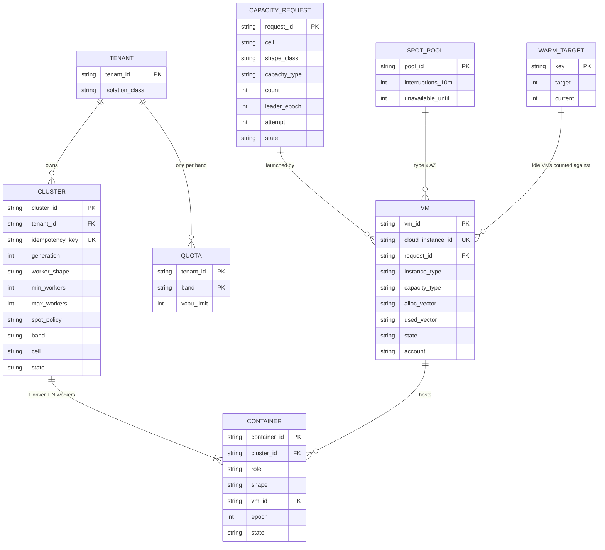

Access patterns that justify it:
- **Create**: insert one cluster row with a unique `(tenant, idempotency_key)`; a retry hits the unique index and returns the existing row. Then a cell is chosen and the spec is written into the cell store.
- **Place**: the cell master keeps every VM's free vector in memory, indexed by shape class and free vCPU. A placement is one etcd `Txn` that sets `container.vm_id` and adds to `vm.alloc_vector`, guarded by the VM's `mod_revision` (compare-and-swap), so two decisions can never both take the last slot.
- **Buy**: the capacity manager counts pending containers and in-flight capacity requests per `(cell, shape_class)` every 5 s. That is a prefix scan over a few thousand keys.
- **Reconcile**: the provisioner lists cloud instances by tag (`cm-cell`, `cm-request-id`) and joins against `VM.cloud_instance_id` and `CAPACITY_REQUEST.request_id`. Anything unmatched for 10 minutes is terminated.
- `CAPACITY_REQUEST.leader_epoch` is the fencing token: a request row can only be written by the current capacity-manager leader, and the provisioner will not act on a row from an older epoch ([`../../concepts/leases-fencing-clocks.md`](../../concepts/leases-fencing-clocks.md)).

---

## 4. High-level design

One subsection per functional requirement. Each one traces input to output through the boxes, adds what it needs to one growing diagram, and ends with what is still missing (a deep dive in §5 fixes it). The design at the end of §4 is deliberately the simple version.

### 4.1 Cluster lifecycle: create, resize, terminate

**Flow (simplest version: one fresh VM per container, like classic Databricks):**

1. The job scheduler calls `POST /clusters` with `Idempotency-Key = run_id:task_id:attempt`. A retry of the same attempt gets the same cluster; a new attempt after the cluster died gets a new one instead of the dead cluster for 24 h. A notebook user does the same with a UUID generated by the UI.
2. The cluster service validates the spec, checks the tenant's quota for the band (the `min` workers of this cluster must fit in what the tenant's running clusters leave; growth toward `max` is checked later by the workload autoscaler, §5.6), and inserts the cluster row with state `PENDING`. The unique index on `(tenant, idempotency_key)` makes a retry return the same `cluster_id` ([`../../concepts/exactly-once.md`](../../concepts/exactly-once.md)).
3. It picks a **cell**, which is one AZ: the one with the most free capacity for the worker shape and the healthiest spot pools. It writes the spec into that cell's store. From here the cell owns the cluster.
4. The cell master sees the new cluster on its watch and creates one driver and `min` worker **container** rows, state `PENDING`.
5. Simple version: for each container it asks the provisioner for one VM. The provisioner calls the cloud's launch API with `ClientToken = container_id`, so a retried call never launches a second VM.
6. The VM boots, the node agent starts, proves its identity with the cloud's signed instance document, and registers with the cell master.
7. The cell master sends `Assign(container, epoch)`. The agent pulls the runtime image, starts the container. The driver starts Spark; workers start executors that register with the driver.
8. When the driver and `min` workers are running, the cell marks the cluster `RUNNING` and the cluster service updates the row and emits an event.
9. **Terminate** (explicit, or after `autoterminate_min` idle): the cell kills the containers, and in this version terminates their VMs.

**Resize** is a `PATCH` with `if_generation`: the spec row is compare-and-swapped, the new `min` / `max` is copied into the cell, and the cell's loops (§4.3) do the rest.

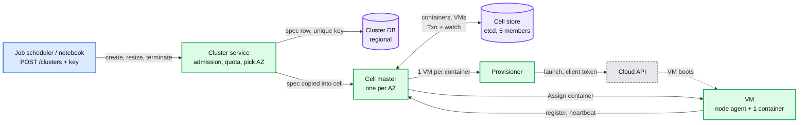

Data model so far: `cluster` row with `generation` and a unique key; `container {cluster, role, shape, state}`; `vm {instance_id, state}`.

**What is still missing:** every start is a cold start (30 to 90 s, minutes with an eagerly pulled image). A container alone on its VM needs a VM sized exactly to it, or strands the rest: an 8-vCPU worker on a 64-vCPU VM strands 87% of it. And the launch count is impossible: 300k starts × 8 containers = **2.4 M launches a day**, 28 per second on average, 14x the 2-per-second refill of one cloud account. VMs must outlive clusters. §4.2.

### 4.2 Placement: pack containers onto shared VMs

**The change: VMs become the cell's capacity, not the cluster's.** A VM is launched for the cell, lives hours to days, and runs containers from many clusters over its life. Containers are placed onto VMs by one scheduler per cell. Launches drop from millions a day to about 40k (the fleet's net growth plus replacements).

**Isolation.** Containers from different tenants on one VM run inside a sandbox (a microVM or a gVisor-class kernel), each with its own local-disk volume that is wiped on exit, and a per-tenant network policy. Tenants whose compliance rules forbid sharing get isolation class `dedicated`: a VM carries a tenant label while any of that tenant's containers run on it, and only that tenant's containers may join. This costs packing efficiency for small tenants (§5.3), and it is a filter, not a second system.

**Flow: place the containers of one new cluster**

1. The cluster's pending containers join the cell scheduler's queue, ordered by band, then by age.
2. **Equivalence classes.** A cluster has two classes: its driver and its workers (identical). Feasibility and scoring run once per class, not once per container. This is what makes 5,000 cluster starts a minute cheap.
3. **Filter** every VM that cannot take the container: wrong state (only `ACTIVE`), wrong capacity type (drivers need on-demand; workers follow the spot policy), wrong isolation class, free vector smaller than the shape in any dimension (vCPU, memory, local SSD, GPU), or the **spread limit**: at most `max(1, 25% of the cluster's workers)` on one VM, so one VM loss costs a cluster at most a quarter of its workers.
4. **Score** the rest (details in §5.3): best fit on the tightest dimension, plus an alignment term that avoids leaving memory with no CPU (stranded resources), plus a small bonus if the runtime image is already cached on the VM, minus a penalty if the VM is being drained by attrition.
5. **Relaxed randomization.** Visit VMs in random order and stop after 200 feasible ones (Borg's trick; Kubernetes does the same with `percentageOfNodesToScore`). Pick the best score.
6. **Commit** the whole class in one etcd `Txn`: set each container's `vm_id`, add to each VM's `alloc_vector`, guarded by each VM's `mod_revision`. If another decision touched that VM first, the Txn fails and the class is rescored. The limit of 128 operations per Txn caps a class at about 60 containers per commit; larger clusters commit in chunks.
7. The node agent receives `Assign(container, epoch)`, starts the sandbox and the container from its local image cache.
8. If no VM passes the filter, the container stays `PENDING`. That pending set is the input to the fleet autoscaler (§4.3).

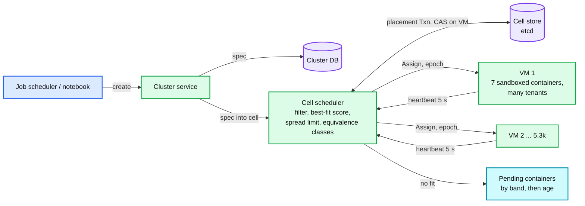

Data model so far: `vm.alloc_vector`, `vm.used_vector`, `vm.mod_revision` (the CAS guard), `container.vm_id`, `container.epoch`, `vm.tenant_label` for dedicated isolation.

**What is still missing:** nobody buys a VM when the pending set grows, nobody gives one back when it empties, and nobody decides how many workers a cluster should have after it starts. §4.3.

### 4.3 Autoscaling: the cluster loop and the fleet loop

Two loops with two different inputs. Keep them apart: the workload autoscaler never talks to the cloud, and the capacity manager never looks at Spark.

**Loop A: workload autoscaler (per cluster, in the cell master, every 5 s)**

1. The Spark driver reports `pending_tasks`, `running_tasks`, idle executors and shuffle bytes per executor every 5 s (`ReportDemand`).
2. Target: `desired = clamp(ceil((pending + running) / task_slots_per_worker), min, max)`. This is Spark's own dynamic-allocation target, computed by the platform instead of inside Spark. Databricks tells users not to enable Spark dynamic allocation on compute that uses its autoscaling: one loop, not two.
3. **Up fast.** If `desired > current` on a report, go straight to `desired` (at most two steps from `min` to `max`, which is what Databricks' optimized autoscaling does). The backlog is the evidence; doubling rounds (Spark's 1, 2, 4, 8) waste 4 rounds on a cluster that needs 16 workers now.
4. **Down slow and careful.** Only if `desired < current` for the whole window (40 s for job clusters, 150 s for interactive, Databricks' numbers). Remove at most 25% of workers per decision. Pick idle executors with the least shuffle output. An executor whose shuffle files a later stage still needs is **decommissioned** (shuffle blocks migrated to peers first, §4.4), not killed.
5. The result is written as container rows: new `PENDING` workers, or existing ones moved to `DECOMMISSIONING`.

**Loop B: capacity manager (per cell, every 5 s)**

1. **Batch.** Collect containers that have been pending for 1 s with no new arrivals, or 10 s at most (Karpenter's batching window). One batch becomes one purchase instead of 500.
2. **Demand** per `(shape_class, capacity_type)`: pending containers + the warm target (§5.1).
3. **Supply**: idle booted VMs + **in-flight capacity** (requests written, VMs not yet registered). Counting in-flight as supply is the single most important line in the loop: a VM takes 60 s to register and the loop runs every 5 s, so without it every iteration re-buys the same demand and the fleet over-buys up to 12x.
4. `need = demand - supply`. If positive, bin-pack the pending containers into hypothetical VMs of each candidate instance type, pick the size that minimizes cost per packed vCPU, and write one `CAPACITY_REQUEST {request_id, count, types[], capacity_type, leader_epoch}` into the cell store. The provisioner picks it up.
5. **Late binding.** When a new VM registers, the scheduler places whatever is pending at that moment. The cluster that caused the purchase may have finished; the VM is not wasted, because it was bought for the cell, not for that cluster.
6. **Release.** A VM that has been empty for 2 minutes, above the warm target, is released in two steps: a `Txn` moves it `ACTIVE -> DRAINING` only if its `alloc_vector` is zero and its `mod_revision` is unchanged (so the scheduler cannot place onto it in the same instant), then the provisioner terminates it.
7. **Drain by attrition.** A VM that is under 30% allocated gets a score penalty so new containers avoid it. Job containers live about 20 minutes; the VM empties by itself and step 6 releases it. No executor is killed to save money.

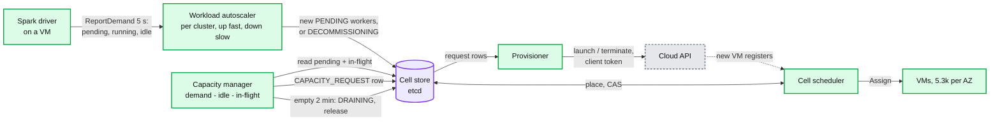

Data model so far: `capacity_request {request_id, count, types[], capacity_type, leader_epoch, state}`; `vm.state` gains `REQUESTED, BOOTING, DRAINING`; `vm.empty_since`; per-cluster `desired_workers` and the demand report history for the stabilization window.

**What is still missing:** once free slots run out, every start waits a cold 60 s; the 00:00 burst asks the cloud for 4,000 VMs a minute from a bucket that refills at 2 a second; and every VM is still on-demand. §4.4 for spot, §5.1 and §5.2 for the latency and the burst.

### 4.4 Spot: use it for workers, survive losing it

**Policy.** Drivers are always on-demand: losing the driver kills the whole Spark application, and Databricks' own docs say never to put the driver on a spot pool. Workers follow the cluster's policy: `ON_DEMAND`, `SPOT_WITH_FALLBACK` (the default), or `SPOT`, with `first_on_demand = K` keeping the first K workers on-demand as a floor. The capacity manager tracks demand per capacity type. A spot request lists at least 6 instance types of the same shape class (for example 64 vCPU / 256 GiB across several families and generations) and lets the cloud pick by price and available capacity. A spot-tolerant worker may land on a free on-demand slot; an on-demand-only container never lands on spot.

**Flow: a spot VM gets its interruption notice (AWS: 2 minutes, best effort)**

1. **T - 120 s.** The cloud emits the warning twice: on an event stream (EventBridge on AWS) that the cell master consumes, and in instance metadata that the node agent polls every 5 s (AWS's own recommendation). Whichever arrives first wins. The agent path works even if the control plane is down; the event path works even if the agent is wedged.
2. The cell master marks the VM `DRAINING` (no new placements) and bumps the pool's `interruptions_10m`. One warning is normal churn and changes nothing else; only when more than 5% of the pool is reclaimed within 10 minutes is the `(type, AZ)` pool quarantined for spot purchases for 30 minutes (§5.4).
3. For each executor on the VM, it asks the owning driver to **decommission** it: Spark stops scheduling new tasks there and migrates the executor's shuffle and cached blocks to other executors, or to an object-store fallback path when peers are short on disk. About 100 s of the 120 s are usable: at 3 GB/s that is about 300 GB per VM.
4. The workload autoscaler sees `running < desired` and writes replacement `PENDING` workers at once. They land on free slots or hot VMs in seconds.
5. The capacity manager buys replacement capacity from a different pool. If two spot attempts fail, or fewer than 3 healthy pools remain for the shape, `SPOT_WITH_FALLBACK` buys on-demand.
6. **T - 20 s.** Tasks still running on the VM are killed and retried elsewhere by Spark; the decommission tells Spark this is not a task failure.
7. **T - 0.** The VM is gone. Its containers are marked `LOST`, the VM row is closed, and nothing else happens: the replacements are already running.

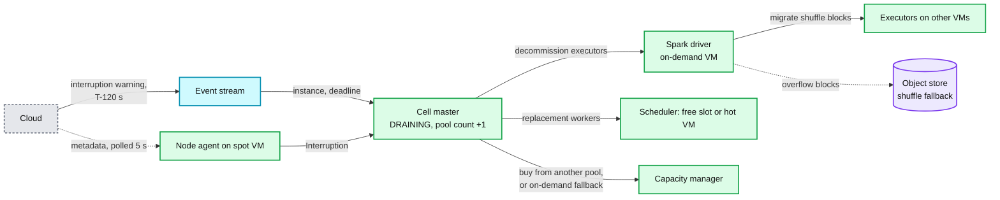

Data model so far: `spot_pool {interruptions_10m, unavailable_until}`; `cluster.spot_policy`, `cluster.first_on_demand`; container state `DECOMMISSIONING`, `LOST`.

**What is still missing:** a whole pool reclaimed at once, a stage whose shuffle is bigger than the evacuation budget, and GCP and Azure giving 30 s instead of 120 s. §5.4.

### 4.5 Preemption: important work takes capacity from cheap work

In a cloud, the normal answer to "not enough capacity" is to buy more. Preemption exists for the three cases where buying does not help fast enough: the 60 s cold start is longer than the start SLO, the cloud says `InsufficientInstanceCapacity` for the shape, or the region's cloud vCPU quota for that capacity type is used up (a tenant at its own quota is capped by admission, §5.6, not rescued by preemption).

**Bands** (Borg's idea: a few non-overlapping bands, not a free integer):

| Band | Who | May preempt | May be preempted |
|---|---|---|---|
| P1 production | SLA jobs, and every driver of every band | P4, and P3 during a declared capacity shortage | never |
| P2 interactive | notebooks, SQL | P4 | never: a human is waiting on it |
| P3 batch | default for jobs | nothing | by P1 during a shortage |
| P4 best-effort | discounted, preemptible SKU the customer opted into | nothing | always, with 30 s notice |

**Flow: a P1 worker has been pending for 5 s**

1. No free slot fits and no hot VM exists for its shape, and the capacity manager's estimated time to a new VM is longer than the container's remaining start budget.
2. The scheduler searches for a VM where evicting only lower-band **workers** would free enough. Never a driver: killing a driver kills a whole cluster to free 8 vCPU.
3. Among candidate VMs pick the one with the lowest-band victims, then the fewest victims, then the least shuffle output on the victims (cheapest to recompute), subject to each victim cluster's **preemption budget**: at most 25% of its workers per 10 minutes.
4. Reserve the VM for the preemptor (a `nominated_for` field, written in the same Txn as the victims' state change) and send `Kill(victim, grace 30 s)`. The victims decommission like a spot loss.
5. When the victims exit, the preemptor is placed. The victims go back to `PENDING` in their own band, and the capacity manager buys for them. They return when the VM arrives, 60 s later.
6. Production never preempts production, and only P3 and P4 are ever victims. Victims never preempt anyone. That is what makes a cascade impossible: Borg disallows preemption inside its production band for exactly this reason.

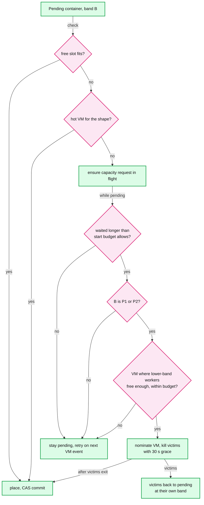

Data model so far: `container.band`, `vm.nominated_for`, per-cluster `preemptions_10m`, tenant `QUOTA` per band.

End of §4. We have a correct but naive design: clusters are created idempotently, containers are packed onto shared VMs, both loops scale, spot VMs are drained, and preemption has no cascades. It falls over on: cold starts once free slots run out (p99 blown), the 00:00 burst against a launch API that refills at 2 VMs a second, fragmentation and churn eating the 85% packing target, a whole spot pool going at once, and a provisioner that crashes mid-call and leaks VMs. §5 takes these in the order an interviewer asks.

---

## 5. Deep dives

One per non-functional requirement. Each names what breaks in the §4 design with a number, fixes it, and lists what changed in the API, the data model, and the diagram.

### 5.1 "p50 10 s, p99 60 s to a running cluster": warm capacity

**What breaks.** In the §4 design a start is fast only if free slots happen to fit it. At 85% packing the free 15% is scattered: a 20-worker cluster with a spread limit of 5 per VM needs 4 VMs with 40 free vCPU each, and at peak those are rare. Everything else waits for a cold VM: launch call, OS boot, image pull, then the runtime's own warm-up. Databricks describes exactly this sequence for its VMs (boot the OS and connect to the cluster manager, pull several gigabytes of images, load thousands of Java libraries and run JIT warm-up queries) and says it used to take minutes. If 10% of starts go cold at peak, p99 is minutes, not 60 s.

**Fix: capacity tiers, cheapest first, and buy what you can forecast.**

| Tier | What it is | Start time | Cost while idle | Covers |
|---|---|---|---|---|
| 0. Free slots | The unallocated 15% on running VMs | ~5 s | Already paid, it is the packing headroom | Most small starts and autoscale-ups |
| 1. Hot pool | Booted VMs, agent registered, runtime images cached, a pre-initialized runtime checkpoint on local disk, no containers | ~6 s | Full VM price | Unforecast bursts inside the 60 s lead time |
| 2. Fast cold | New launch with a slim OS, lazy image loading, and restore of the checkpointed runtime | 30 to 60 s | Nothing | The tail; replenishing tier 1 |
| 3. Forecast | VMs bought 10 minutes before a known burst from the job calendar, released at T + 5 min if unused | ~5 s at T | About 15 minutes of VM time per burst | 00:00 and other round hours |

- **Hot pool size is a safety-stock formula**, not a feeling: `target = mean + z × sd` of unforecast net demand over the cold lead time `L`. With `L = 60 s`, a measured mean of 10 and a standard deviation of 40 VMs per window per cell, and `z = 2.33` for 99%: about 100 VMs per cell, 300 for the region, 2% of the peak fleet. Recompute hourly per `(cell, shape class)`; demand at 03:00 is not demand at 15:00. A faster cold path shrinks `L`, and a smaller `L` shrinks the pool: Databricks says it factors its boot-time gains into warm-pool sizing, which is the same equation.
- **Capacity type of the hot pool.** Drivers need on-demand, so about 20% of the pool is on-demand. The rest is spot: an idle spot VM that gets reclaimed cost nothing but its idle minutes.
- **Make cold fast** because tier 2 is also how tier 1 refills. Three changes, each from the Databricks post: a purpose-built OS that starts only what containers need; a lazy container filesystem that fetches image blocks on first read (image pull went from several minutes to a few seconds; Slacker found only 6.4% of an image's data is read at startup); and checkpoint/restore of a runtime that has already loaded its libraries and warmed its JIT (runtime init went from several minutes to about 10 s). Borg saw the same shape a decade earlier: median task start about 25 s, 80% of it package installation.
- **Calendar pre-scale.** The job scheduler (#6) already knows which jobs fire at 00:00 and their last run's cluster size. It publishes the next hour's forecast per `(cell, shape class)`. At T - 10 min the capacity manager adds the forecast to demand and buys it gradually, spreading launches over 10 minutes so the cloud's refill works for us (§5.2). At T + 5 min whatever is still idle above the hot target is released.

**Push back on the textbook answer.** "Keep a warm pool big enough for the peak." The peak is the 00:00 burst: 4,000 VMs. Holding them all day is `4,000 × $3.07 × 24 ≈ $295k a day`. Buying them at 23:50 and holding them 15 minutes is about $3k. Predictable demand is bought just in time; only the unpredictable part is stocked. Second push back: "stopped instances are a free warm pool." A stopped VM pays only for its disk, but starting it is rate limited like a launch (StartInstances has its own 1,000 burst, 2 per second bucket), does not reserve capacity (it can still fail with "no capacity"), and EC2 Auto Scaling warm pools do not support spot in mixed-instance groups. It is a useful tier for scarce shapes, not a default.

**What changed:** VM state `WARM` (booted, empty, counted against `warm_target`); `warm_target` recomputed hourly per `(cell, shape_class)`; a forecast feed from the job scheduler; image cache and runtime checkpoint on every VM; `cluster.start_path` (slot, hot, cold) recorded for the SLO dashboard. [`deep-dives/warm-pools-and-fast-start.md`](deep-dives/warm-pools-and-fast-start.md).

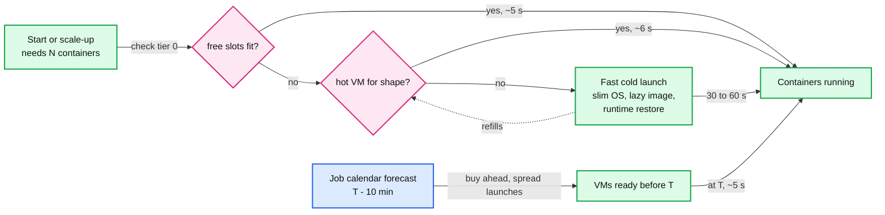

### 5.2 "5,000 cluster starts at 00:00": the provisioner and the cloud API

**What breaks.** Three limits in a row, none of them in our code.

1. **Launch rate.** One account's RunInstances resource bucket holds 1,000 instances and refills at 2 per second. 4,000 new VMs take 25 minutes. The request bucket (5 calls, refill 2 per second) means one VM per call would be even slower, so calls must carry counts.
2. **Stock.** A given instance type in a given AZ can answer `InsufficientInstanceCapacity`. At 00:00 every other tenant of the cloud with a cron job is asking too.
3. **Eventual consistency.** Right after a launch, a describe call may not show the new instance yet. A provisioner that reads "not found" as "did not happen" launches again.

**Fix.**
- **Forecast first (§5.1).** Buying from T - 10 min gives each account `1,000 + 600 s × 2 = 2,200` launches before T instead of 1,000 plus 120 in the first minute.
- **Several cloud accounts per region.** Eight accounts give 8,000 burst and 16 per second sustained, and they cap blast radius: an account-level throttle, quota mistake or security incident hits one eighth of the fleet. The provisioner shards by account; a cell's VMs can come from any account (shared VPC or peering).
- **Big instances.** The bucket counts instances, not vCPU. One 64-vCPU VM costs one token; four 16-vCPU VMs cost four. Prefer the largest shape that still packs well (§5.3).
- **Our own token buckets, in front of the cloud's.** The provisioner keeps a bucket per `(account, API)` that mirrors the cloud's limits, so we queue in our process instead of collecting throttling errors and retry storms. The queue is ordered by band: P1 demand first, forecast next, hot-pool refills last. ([`../../concepts/rate-limiting-and-load-shedding.md`](../../concepts/rate-limiting-and-load-shedding.md).)
- **Batch per call.** One fleet-style launch call per `(account, cell, capacity request)` with a count and a list of instance types, not one call per VM.
- **Unavailable-offerings cache.** A capacity error marks `(type, AZ, capacity type)` unavailable for 3 minutes and the request moves to the next type on its list within seconds (Karpenter does this; the Cluster Autoscaler instead backs off the whole node group for 5 to 30 minutes, which is too coarse). New clusters are routed by the cluster service to another AZ. Growth of existing clusters waits, and P1 may preempt P4 (§4.5).
- **Idempotent calls.** Every launch carries `ClientToken = request_id:attempt`. A retry with the same token and parameters "succeeds without performing any further actions"; the same token with changed parameters fails with `IdempotentParameterMismatch`. So the attempt number is bumped only after a **definitive** answer (a capacity error that makes us change the type list, or a success), and never after a timeout: a timeout is retried with the same token and the same parameters, because the first call may have launched. RunInstances idempotency is zonal when the AZ or subnet is given, which it always is for us. A request split across several accounts gets one token per account chunk (`request_id:account:attempt`); the examples below use one account and write it `r42:a1`.

**Push back on the textbook answer.** "5,000 clusters a minute, so shard the scheduler." §2 showed the scheduler needs 55 decisions a second per cell and does 2,000. The thing that breaks is outside our code and cannot be scaled by adding our servers: the cloud's launch rate and stock. The Staff move is to find that before drawing a single scheduler shard, and to change the *shape of demand* (buy ahead, bigger VMs, several accounts) rather than the speed of our code.

**What changed:** provisioner with per-account token buckets and a band-ordered queue; 8 cloud accounts per region; forecast demand in the capacity manager; `spot_pool.unavailable_until` used for on-demand types too; cluster service AZ routing uses cell capacity health. The provisioner is the red node of the final design. [`deep-dives/provisioning-and-reconciliation.md`](deep-dives/provisioning-and-reconciliation.md).

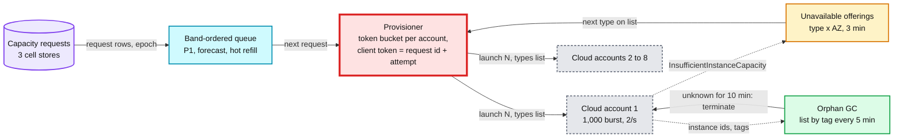

### 5.3 "85% packing without churn": bin packing and fragmentation

**What breaks.** Four ways to miss 85%.

1. **Spreading.** The Kubernetes default score (`LeastAllocated`) puts each new container on the emptiest VM. Every VM ends up 60% full, no VM ever empties, and the release rule in §4.3 never fires. Spreading is right for bursty services that need headroom; it is wrong for a fleet whose cost depends on emptying VMs.
2. **Stranded resources.** Pure best fit on vCPU packs a VM to 60 of 60 vCPU while 40 GiB of memory sits unusable, or fills memory with memory-heavy executors and strands 20 vCPU. Borg's name for this is stranded resources, and its hybrid score exists to reduce it.
3. **Small tenants in `dedicated` isolation.** A driver plus one worker (16 vCPU) alone on a 64-vCPU VM uses 16 of 60 vCPU.
4. **Consolidation that costs more than it saves.** Moving a Spark executor means killing it: its running tasks retry and its shuffle files must move or be recomputed. Saving one VM-hour ($3) by killing 7 executors mid-stage can cost more than $3 of customer time and our goodwill.

**Fix.**
- **A shape menu.** Executors come in 4, 8, 16 and 32 vCPU at 4 or 8 GiB per vCPU. VMs come in families with the same two ratios. Packing becomes a small-integer problem where a 64-vCPU general VM holds exactly 7 eights or 14 fours. Borg found that rounding *user-stated* requests up to powers of two would cost 30 to 50% more resources; that warning is about guessing what users need. Here we choose the executor size, so the menu costs little.
- **Score = best fit + alignment + stranded penalty + image bonus.** Best fit (Kubernetes `MostAllocated`) on the tightest dimension empties VMs. Alignment (the dot product of the container's demand vector and the VM's free vector, the Tetris idea) steers memory-heavy containers to VMs with spare memory. The stranded penalty fires when, after placement, one dimension could no longer fit the smallest shape while another still has room for two. Borg reports its hybrid score packs 3 to 5% better than plain best fit; at our size that is $6M to $10M a year.
- **Match VM shape to tenant size.** For `dedicated` tenants, the capacity manager buys the smallest VM shape that fits the tenant's current containers (16 or 32 vCPU), trading more instances, and so more launch tokens, for less stranded capacity.
- **Drain by attrition, then consolidate only the long-lived.** New placements avoid VMs under 30% allocated. Job containers live about 20 minutes, so those VMs empty by themselves. Active consolidation (decommission idle executors and move them) only for VMs under 30% for over 30 minutes, within a disruption budget of 2% of a cell's VMs per 10 minutes.
- **Right-size the default executor.** Requested vs used memory per workload class feeds a recommender for the default shape. Google's Autopilot cut slack from 46% to 23% this way; slack is packing efficiency hiding inside the container.
- **Measure fragmentation directly.** `stranded = free capacity on VMs that cannot fit the smallest pending shape`. Alert above 5% of the fleet.

**Push back on the textbook answer.** "Bin packing is NP-hard, so use an ILP solver." The inputs are online (arrivals every 10 ms), most containers live 20 minutes, and acting on a global re-pack means killing running executors. A greedy best-fit with a good score, plus attrition, is within a few percent of what a solver would find. Borg's entire gain from a better score was 3 to 5%. Spend the effort on the shape menu and on emptying VMs, not on optimality.

**What changed:** shape menu in the API (`worker_shape` is an enum); the score; `vm.attrition_since`; consolidation budget; `stranded_ratio` metric. Diagram: the score pipeline below. [`deep-dives/bin-packing-and-placement.md`](deep-dives/bin-packing-and-placement.md).

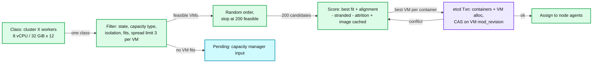

### 5.4 "< 0.1% of runs fail because of spot": correlated loss

**What breaks.** §4.4 handles one VM. Three things it does not handle:

1. **A pool goes at once.** Spot reclamation is correlated: when the cloud needs a type back in an AZ, it takes many at once. A cluster whose 100 spot workers all came from one pool loses 100 workers in 2 minutes, and the replacement demand (hundreds of VMs of the same shape) arrives exactly when that shape is scarce.
2. **Shuffle bigger than the budget.** About 300 GB per VM can move in 100 s on AWS. On GCP and Azure the notice is 30 s, about 60 GB per VM. A shuffle-heavy stage on 7 executors per VM with 40 GB each on GCP loses most of it.
3. **Livelock.** A job that keeps losing workers keeps recomputing the same stages. It never fails and never finishes.

**Fix.**
- **Diversify on purpose.** A spot capacity request lists at least 6 instance types of the shape class and asks the cloud to optimize for price and available capacity. The scheduler adds a filter: at most 20% of a cluster's spot workers per pool. One pool event then costs a cluster at most 20% of its spot workers.
- **An on-demand floor.** Driver plus `first_on_demand` workers (default 1) are on-demand, so a cluster never drops to zero workers and never loses its driver.
- **Pool health.** If more than 5% of a pool's VMs are reclaimed in 10 minutes, stop buying from it for 30 minutes. Treat AWS's rebalance recommendation (an earlier, softer signal) as "stop placing here, drain by attrition", not as a kill.
- **Livelock guard.** A cluster that loses more than 30% of its spot workers twice in an hour moves its remaining growth to on-demand for the rest of the run and emits `SPOT_LOST` with that reason, so the job scheduler and the user can see why the run cost more.
- **Shuffle beyond the budget.** Migrate to peers first, then to the object-store fallback path, and recompute the rest from lineage. For clusters that are both shuffle-heavy and mostly spot, or on 30 s-notice clouds, offer a remote shuffle service so shuffle files never live on the executor's disk.

**Push back on the textbook answer.** Two of them. "Checkpoint and live-migrate the executor when the notice comes." Moving 32 GiB of heap plus local disk in 30 to 120 s over a shared NIC, into a VM that does not exist yet, is slower than recomputing the few tasks that were running. Decommission plus lineage is the cheaper path. And "put all shuffle on a remote service." It adds a network hop and a stateful service for every shuffle byte in the fleet to protect the minority of runs that are spot-heavy and shuffle-heavy. Offer it where the arithmetic says so.

**What changed:** per-cluster per-pool cap in the scheduler filter; `spot_pool.interruptions_10m`; livelock counter per cluster; `SPOT_LOST` event reason; optional remote shuffle per cluster. [`deep-dives/spot-capacity-and-interruption.md`](deep-dives/spot-capacity-and-interruption.md).

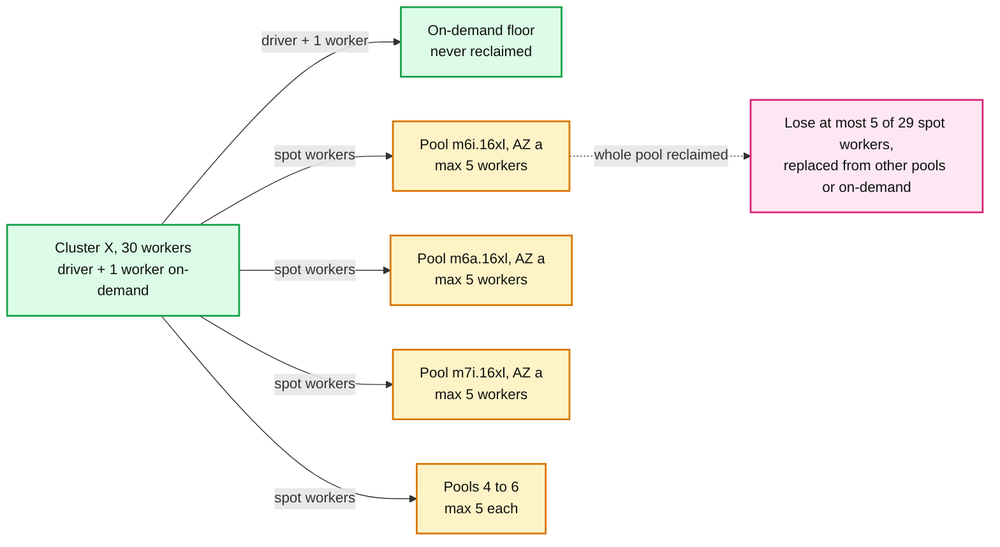

### 5.5 "Control plane dies, nothing running dies; no leak, no double buy": reconciliation and fencing

**What breaks.** Six failures of the §4 control plane, each with a price.

1. **Cell master crash.** Placement, both autoscaling loops and buying stop for that AZ.
2. **Two capacity-manager leaders** after a network blip. Both see the same pending demand; both buy. 4,000 VMs bought twice is $12k an hour until someone notices.
3. **Provisioner crash between the cloud call and the write-back.** The VM exists, is billed, and nothing knows about it. §2 priced this at up to $39M a year if never collected.
4. **Describe lag.** "Instance not found" seconds after a successful launch. A naive retry with a fresh token launches a second VM.
5. **Partitioned VM.** The agent cannot reach the cell master. Its containers may still be running and producing output. If we replace them and the VM comes back, two copies of an executor exist.
6. **Regional cluster DB down.** Creates and terminates fail.

**Fix.**
- **Level-triggered reconcilers.** Every loop reads desired and observed state from the cell store and recomputes; no loop depends on having seen an event. A restarted process re-reads and continues. This is the Kubernetes controller pattern and the reason a crash is boring.
- **One leader per cell, fenced.** The cell master (scheduler, both loops) holds an etcd lease with a 10 s TTL; hot standbys keep watch caches warm. Failover under 15 s (Borg reports about 10 s, up to a minute in big cells because in-memory state is rebuilt). Every write carries `leader_epoch` in the `Txn` compare, so a paused old leader's writes fail ([`../../concepts/leases-fencing-clocks.md`](../../concepts/leases-fencing-clocks.md), [`../../concepts/etcd.md`](../../concepts/etcd.md)).
- **Intent, then side effect, then record.** A capacity request row is committed (with the epoch) before any cloud call. The provisioner acts only on rows stamped with the current epoch; a new leader adopts the old leader's open rows by re-stamping them with its epoch in one `Txn`, keeping each `request_id` and `attempt`, so a launch the old leader already started is replayed under the same token instead of bought again. The provisioner calls the cloud with `ClientToken = request_id:attempt` and tags `{cm-request-id, cm-cell, cm-account}` applied *at launch* so there is no untagged instant, then writes the instance ids back. A crash anywhere replays the same token and gets the same instances. This is the outbox pattern with the cloud as the downstream ([`../../concepts/exactly-once.md`](../../concepts/exactly-once.md)).
- **Orphan GC.** Every 5 minutes per account: list instances by tag and join with VM rows. A tagged instance whose request is unknown or closed, older than 10 minutes, is terminated. A VM row whose instance has been missing for 10 minutes is marked `LOST`. One "not found" is never proof; ten minutes is. Worst case a leak lives 15 minutes.
- **Partition handling.** Unreachable for 30 s: `SUSPECT`, no new placements. 2 minutes: its containers are replaced elsewhere (the Spark driver has usually dropped those executors by then on its own heartbeat timeout). 10 minutes: terminate the VM through the cloud API. The cloud is our fence: a terminated VM cannot come back, and it stops billing. If the agent reconnects first, it reconciles to the desired container set and kills anything with an older `epoch`.
- **Data plane independence.** Node agents keep running their containers forever without the control plane; drivers keep running jobs. A cell master outage stops placement, autoscaling and buying, not work. The cluster spec copy in the cell lets autoscaling and auto-terminate run while the regional DB is down; only create, resize and terminate calls fail.

**Push back on the textbook answer.** "Make the control plane highly available." Do that too, but it only shortens outages. What bounds the blast radius is that running work does not depend on the control plane at all. And "use a transaction across our DB and the cloud." There is none. Intent row, idempotency token, tags, and a reconciler that trusts the cloud's inventory over our own records is the whole story.

**What changed:** `leader_epoch` on every write; `capacity_request` written before calls; launch tags; orphan GC; VM states `SUSPECT`, `LOST`; agent-side reconcile on reconnect. [`deep-dives/provisioning-and-reconciliation.md`](deep-dives/provisioning-and-reconciliation.md), [`deep-dives/autoscaling-control-loops.md`](deep-dives/autoscaling-control-loops.md).

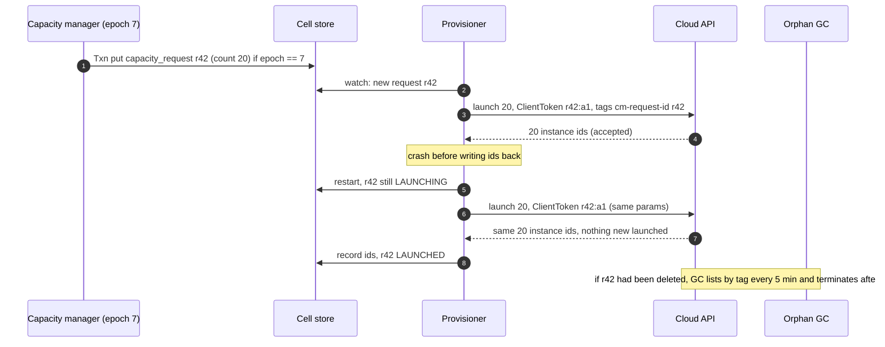

### 5.6 "One tenant cannot starve the rest; production starts first": quota and fairness

**What breaks.** Three ways the shared fleet becomes one tenant's fleet.

1. A tenant launches a 10,000-worker backfill. It takes every free slot and the whole hot pool in a minute. Everyone else starts cold.
2. During a capacity shortage (a shape out of stock, or the launch bucket drained), pending demand is served first-come, first-served, so whoever submitted first wins, regardless of band.
3. A bug in a tenant's job sets every cluster's `max` to 1,000. The workload autoscaler faithfully spends tens of thousands of dollars an hour.

**Fix.**
- **Quota per tenant per band**, in vCPU. Checked at create for `min`, and by the workload autoscaler for every step of growth: `desired` is capped by the remaining quota. Twine calls these entitlements; Borg calls it quota and puts admission in front of scheduling.
- **Borrow above quota at P4.** In a cloud, quota is not about sharing a fixed pool; it is about cost and blast radius. A tenant may exceed its quota with preemptible P4 containers (priced lower), which is Borg's reclaimed-resources idea sold as a product.
- **Fair share when capacity is short.** When pending demand for a shape exceeds what can be supplied this minute, serve by band, then within a band by weighted fair share across tenants on vCPU (dominant resource fairness collapses to vCPU because the shape menu fixes the ratios), not by arrival.
- **Hot-pool cap.** One tenant may take at most 20% of a cell's hot pool per minute. The rest of its demand goes cold, which is fine for a backfill.
- **Spend guardrail.** A per-tenant spend-rate alarm (for example 3x the tenant's 7-day p95 hourly spend) pages the tenant's admins and our on-call; above 10x, new growth for that tenant is held for manual approval.

**Push back on the textbook answer.** "Strict hard quotas and FIFO." Hard quotas with no borrowing waste the cloud's elasticity, and FIFO under shortage means the tenant with the fastest cron job wins. Bands first, fair share second, borrowing at P4 third.

**What changed:** `QUOTA` checked in the workload autoscaler; band-then-fair-share order in the pending queue under shortage; per-tenant hot-pool rate limit; spend alarm. [`deep-dives/preemption-and-priority.md`](deep-dives/preemption-and-priority.md).

---

## 6. Final design and the core flows

Everything from §5 composed. Under 15 nodes; zoom-ins in [`diagrams.md`](diagrams.md).

```mermaid
%% D3: final design. One cell master per AZ runs the three loops over its etcd store. The provisioner is red: the cloud behind it gives 1,000 launches at once and 2 per second per account, and can say no.
flowchart LR
    JS[Job scheduler, notebooks, SQL] -->|"create / resize / terminate,<br/>idempotency key"| API[Cluster service<br/>admission, quota, AZ routing]
    API -->|"spec row, unique key"| DB[(Cluster DB<br/>regional)]
    API -->|"spec copy, cell chosen"| CM[Cell master, one per AZ<br/>workload autoscaler, scheduler,<br/>preemption, capacity manager]
    JS -.->|"next-hour forecast"| CM
    CM <-->|"Txn with leader epoch, watch"| CS[(Cell store<br/>etcd, 5 members)]
    CM -->|"Assign / Kill, epoch"| VMS[VMs, 5.3k per AZ<br/>node agent, sandboxed<br/>drivers and executors]
    VMS -->|"heartbeat 5 s,<br/>driver ReportDemand"| CM
    CM -->|"place on idle VM"| HOT[Hot pool<br/>~100 per AZ]
    CS -->|"capacity requests"| PV[Provisioner<br/>8 accounts, token buckets,<br/>client tokens, orphan GC]
    PV -->|"launch N / terminate"| CLOUD[Cloud APIs]
    CLOUD -.->|"new VMs register"| HOT
    CLOUD -->|"interruption warnings"| EQ[Event stream]
    EQ -->|"instance, deadline"| CM
    VMS -.->|"shuffle overflow,<br/>runtime checkpoints"| OBJ[(Object store)]

    class JS client
    class API,CM,VMS service
    class DB,CS,OBJ store
    class HOT cache
    class EQ queue
    class PV critical
    class CLOUD external

    classDef client   fill:#dbeafe,stroke:#2563eb,stroke-width:2px,color:#111
    classDef service  fill:#dcfce7,stroke:#16a34a,stroke-width:2px,color:#111
    classDef store    fill:#ede9fe,stroke:#7c3aed,stroke-width:2px,color:#111
    classDef cache    fill:#fef3c7,stroke:#d97706,stroke-width:2px,color:#111
    classDef queue    fill:#cffafe,stroke:#0891b2,stroke-width:2px,color:#111
    classDef critical fill:#fee2e2,stroke:#dc2626,stroke-width:4px,color:#111
    classDef external fill:#e5e7eb,stroke:#6b7280,stroke-width:2px,color:#111,stroke-dasharray:4 3
```

The six flows below are the ones to be able to say from memory. Each is the final design, not the §4 version.

### Flow 1: cluster start from warm capacity (about 6 s)

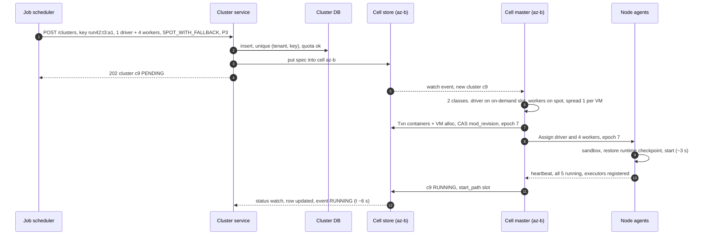

### Flow 2: autoscale up through a cold VM (60 s tail, no double buy)

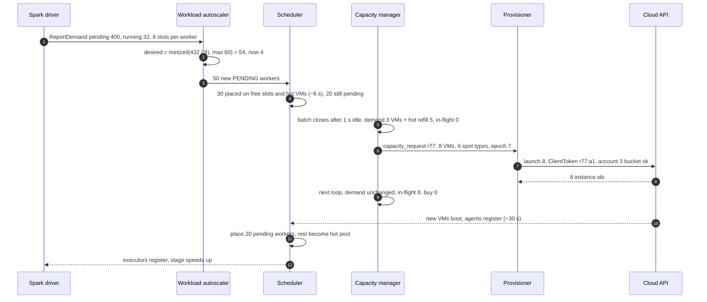

### Flow 3: spot interruption (120 s, no job failure)

Shown in §4.4 and as a second-by-second timeline in §10.4. Summary: two notice paths (event stream, agent polling metadata every 5 s), VM `DRAINING` and the pool's interruption count bumped (quarantine only above 5% in 10 min), executors decommissioned with shuffle migrated to peers (about 300 GB per VM fits in 100 s), replacements placed on warm capacity at once, replacement capacity bought from another pool or on-demand, remaining tasks killed at T - 20 s and retried, VM gone at T - 0 with nothing left on it.

### Flow 4: preemption during a shortage (P1 starts in 5 to 40 s instead of a 60 s cold start, P4 comes back in about a minute)

Shown in §4.5 (D6). Summary: P1 pending 5 s with no free slot, no hot VM, and a cold ETA past its budget; the scheduler finds a VM where evicting P4 workers only (never drivers, within each victim cluster's 25% per 10 min budget) frees enough; the VM is nominated in the same Txn as the victims' state change; victims get 30 s to decommission; P1 is placed; victims return to pending at P4 and land on the capacity bought for them.

### Flow 5: scale down and release (40 s window, 25% per step, VM released after 2 min empty)

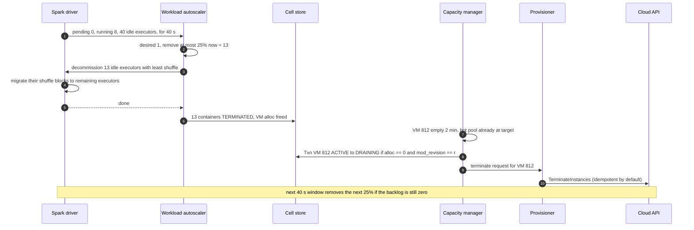

### Flow 6: cell master failover (under 15 s, running work untouched)

Shown as a timeline in §10.4. Summary: the leader's etcd lease (10 s TTL) expires; a hot standby with a warm watch cache wins the election and bumps `leader_epoch`; any late write from the old leader fails its `Txn` compare; the new leader re-reads pending containers and VM states, re-stamps open capacity requests with its epoch (same `request_id` and `attempt`, so their client tokens still dedupe), and continues. Node agents and drivers never noticed.

---

## 7. Trade-offs

| Decision | Option A | Option B | Chose | Why |
|---|---|---|---|---|
| Unit of placement | One VM per worker (classic Databricks, customer's account) | Containers packed on shared, sandboxed VMs | B, with a `dedicated` isolation class | A needs 2.4 M launches a day (14x one account's refill) and every start is cold. B needs about 40k and gives free slots as tier-0 warm capacity. A remains the right answer when the VM must be in the customer's account |
| Scheduler shape | Monolithic per cell (Borg) | Shared-state optimistic (Omega) or two-level offers (Mesos) | Monolithic per AZ, with CAS commits | 55 decisions a second per cell against a capacity of 2,000. Parallel schedulers solve a throughput problem we do not have and add conflicts. Offers hide the full cell from the placer |
| Cell boundary | Region-wide scheduler | One cell per AZ | Per AZ | A cluster lives in one AZ anyway; an AZ is a failure domain; each cell is half a Borg cell |
| Placement score | Spread (Kubernetes default `LeastAllocated`) | Best fit + alignment + stranded penalty | Best fit hybrid | Spreading never empties a VM. Borg's hybrid packs 3 to 5% better than best fit, $6M to $10M a year here |
| Who sizes a cluster | Spark dynamic allocation inside the app | Platform workload autoscaler from the driver's backlog | Platform | One loop, not two. The platform sees quota, spot and warm capacity; Spark does not |
| Scale-up rule | Doubling rounds (1, 2, 4, 8) | Jump to the backlog target, at most two steps | Jump | The backlog is the evidence; doubling spends 4 rounds getting to 16 |
| Fleet signal | Utilization under 50% for 10 min (Cluster Autoscaler) | Pending demand - idle - in-flight + warm target; release after 2 min empty | Pending | Utilization lags; pending demand is the actual shortfall. In-flight accounting stops the 12x over-buy |
| Consolidation | Active re-packing | Drain by attrition, active only for long-lived low-use VMs within a 2% budget | Attrition first | Killing executors to save a $3 VM-hour costs task retries and user trust; 20-minute jobs empty VMs for free |
| Warm capacity | Warm pool sized for the peak | Safety-stock hot pool (2%) + calendar pre-scale + fast cold path | Safety stock + forecast | Holding 4,000 VMs for the 00:00 burst is $295k a day; buying at 23:50 is $3k |
| Spot scope | None, or everything | Workers only, driver and a floor on-demand, 6+ pools, 20% cap per pool | Workers only, diversified | Losing a driver kills the cluster. Diversification bounds a pool event to 20% |
| Spot loss handling | Live migration | Decommission with shuffle migration, recompute the rest; remote shuffle opt-in | Decommission | 30 to 120 s cannot move a 32 GiB heap into a VM that does not exist yet |
| Preemption | Preempt first | Always buy; preempt only to bridge the cold gap or a shortage; only lower-band workers; no P1 on P1 | Buy first | Preemption in a cloud is a bridge, not a strategy. Band rules make cascades impossible |
| Cloud accounts | One per region | 8 per region | 8 | 8x launch rate and quota, 1/8 blast radius, at the cost of cross-account networking and quota bookkeeping |
| Cell state store | Relational DB | etcd, 5 members | etcd | 100 MB of state, under 1k writes/s, needs CAS, watch, and leases. A database would work; etcd is the smaller tool that already has all three |
| What we refused to build | Live migration, cross-AZ clusters, an ILP packer, gang scheduling, a custom ML forecaster, multi-region cells | | | Each is a real system; none is needed for Spark clusters on one cloud region. Seams in §10.11 |

Consistency model, stated once: **cluster spec strong** (one row, `generation` CAS), **placement strong within a cell** (single leader, etcd Txn with CAS on the VM and the leader epoch), **worker counts and status eventual** (seconds, from heartbeats and demand reports), **cloud inventory eventual** (reconciled by tags and client tokens, a leak lives at most 15 min). Nothing crosses cells transactionally; a cluster never spans cells.

---

## 8. Staff-level notes

- **Simplest thing that meets the requirement.** One monolithic scheduler per AZ with compare-and-swap commits, three loops with their own clocks, and one provisioner. We refused sharded schedulers (the arithmetic does not need them), an ILP packer (3 to 5% is the whole prize), live migration (slower than recomputing), gang scheduling (Spark does not need it), and a machine-learned forecaster (the job calendar plus an hourly baseline is most of the signal).
- **Failure modes and blast radius.** One VM: at most 25% of any cluster's workers (spread limit), usually one executor from each of about 7 clusters. One spot pool: at most 20% of a cluster's spot workers. Cell master: that AZ cannot place, scale or buy for under 15 s; running work unaffected. Cell store losing quorum (3 of 5 etcd members down): every write in that AZ fails, so no placement, scaling or buying there until quorum returns; running work is unaffected and the cluster service routes new clusters to the other two AZs. Provisioner down: no new VMs; free slots and the hot pool carry roughly 5 to 10 minutes of normal demand, P1 can preempt P4. One cloud account throttled or broken: one eighth of launch capacity. Regional cluster DB: no creates or terminates; running clusters keep scaling. **AZ loss**: a third of clusters die with it; the job scheduler retries them in the other two AZs, which now need 50% more capacity from a cloud that is also absorbing everyone else's failover, so the surviving cells raise their hot targets and the provisioner prioritizes P1 retries. Largest blast radius: a bad scorer or a bad node-agent build rolled to every cell at once, so every rollout goes one cell (AZ) at a time with a canary.
- **Migration from classic.** Phase 0: provisioner and cell stores run in shadow mode, tracking the classic 1 VM per worker fleet (idempotent launches, orphan GC) with no behavior change. Phase 1: hot pools per workspace (instance pools), which is the start-time win with no packing change. Phase 2: new serverless workloads opt in to the shared fleet with packing factor 1 (one container per VM), which is the same control plane doing the classic thing. Phase 3: raise the packing factor to 7 per VM with the sandbox, one cell at a time. Phase 4: diversified spot and preemption bands. Rollback at every phase is a per-cluster placement flag; nothing is migrated, clusters drain naturally because jobs live about 20 minutes.
- **Operability.** SLOs: start p50 10 s and p99 60 s (by `start_path`), P1 pending age p99 under 30 s, packing at or above 85% at peak, orphan VMs under 0.1% of the fleet. Pages at 3am: start p99 over 120 s for 10 minutes in any cell; any P1 container pending over 60 s; provisioner throttle or capacity-error rate over 20% for 5 minutes; orphan count rising three GC cycles in a row; a cell with no leader for 30 s. Tickets, not pages: spot-caused run failures over 0.1% in a day, stranded ratio over 5%, hot pool under 50% of target for an hour.
- **Cost.** Fleet about $180M a year. Spot saves about $115M a year against an all on-demand fleet. The hot pool is 2% of the bill; one point of packing is $2M. Engineering: a cell team (scheduler and loops), a provisioning team (accounts, quotas, cloud APIs, GC), a node team (agent, sandbox, slim OS, image and runtime checkpoints), and the Spark runtime team owning decommission and shuffle. The contracts between them are four messages: the container spec, `ReportDemand`, the capacity request, and the heartbeat.
- **Explicit trade-off.** We pay about 2% of the bill in idle hot VMs and 15% in packing headroom to buy a 10 s p50 start. A customer segment that accepts 60 s starts (overnight batch) could get a cheaper SKU that skips tier 1 entirely. Say the exchange rate.

---

## 9. What is expected at each level

**Mid (80/20 breadth/depth).** Draws an API, a cluster DB, a scheduler, VMs, and "an autoscaler that adds VMs when CPU is over 70%". Mentions spot instances and first fit. May not separate the cluster's worker count from the fleet's VM count. Passes if the flow from `POST /clusters` to running containers is clean and there are some numbers.

**Senior (60/40).** Separates the workload autoscaler from the fleet autoscaler and uses Spark's backlog as the signal. Picks best fit and explains why spreading defeats scale-down. Handles the 2-minute spot notice with graceful decommission and keeps drivers on-demand. Adds a warm pool and hysteresis on scale-down. Makes cloud calls idempotent. Goes deep on one of: bin packing, spot, or warm pools.

**Staff+ (40/60).** Everything above, plus: three loops with three clocks; in-flight accounting as the fix for over-buying; the cloud launch API (1,000 burst, 2 per second) as the real bottleneck at 00:00, fixed by changing the shape of demand (calendar pre-scale, 8 accounts, big instances) instead of sharding the scheduler; the hot pool sized as safety stock with the dollar cost next to it; packing priced at $2M a point; correlated spot loss bounded by pool caps and an on-demand floor; preemption as a bridge with band rules that make cascades impossible; data-plane independence from the control plane; intent-then-call with client tokens and orphan GC priced at $39M a year of leaks; migration from classic in phases with a per-cluster flag. Says what it refused to build and why.

---

## 10. Nitty-gritty (past interview scope)

### 10.1 Internals of each chosen technology

**Cell store (etcd).** One Raft group of 5 members per AZ; every write is fsynced on a majority and gets a cluster-wide revision ([`../../concepts/etcd.md`](../../concepts/etcd.md)). Key layout: `/cell/<az>/leader` (lease-bound, value = `leader_epoch`), `/cell/<az>/vms/<vm_id>`, `/cell/<az>/containers/<cluster_id>/<container_id>`, `/cell/<az>/requests/<request_id>`, `/cell/<az>/clusters/<cluster_id>/spec`, `/cell/<az>/warm/<shape_class>`. A placement is one `Txn`: compare `leader` value == my epoch and each touched VM's `mod_revision` == what I scored against; then put the containers and the VMs' new `alloc_vector`. Limits that shape the design: 128 operations per Txn (chunk large classes), 1.5 MiB per request (a VM row is a few hundred bytes), 8 GiB suggested maximum (we use about 100 MB). Standbys and the provisioner follow by `Watch` from their last revision; a watcher that falls behind compaction does a list then watch.

**Cell scheduler.** In memory: every VM's free vector, indexed per `(capacity type, isolation class, shape family)` in buckets of free vCPU (0 to 4, 4 to 8, ... 56 to 60), so "VMs with at least 8 free vCPU" is a walk over a few buckets, not 5.3k VMs. Equivalence class key = `(cluster_id, role, shape, constraints)`. Relaxed randomization starts at a random VM and stops at 200 feasible. Score caching per VM (Borg's third trick): a VM's score for a class is reused until the VM changes. The pending queue is a priority queue keyed `(band, fair-share debt, enqueue time)`. Borg's numbers for why the three tricks matter: a whole cell scheduled from scratch in a few hundred seconds with them, not finished after 3 days without them.

**Node agent.** Registers with the cloud's signed instance identity document, so a VM cannot claim to be another. Heartbeats every 5 s with its **full** container state (Borg's Borglet does the same, so a lost message is repaired by the next one instead of by a retry protocol); the reply is the desired container set, and the agent reconciles: start what is missing, kill anything whose `epoch` is older than the desired one. Polls the metadata service for spot actions every 5 s. Keeps a local image cache, a lazily loaded image filesystem, and a checkpoint of a warmed runtime per runtime version. If it cannot reach the cell master it keeps every container running indefinitely; it never kills customer work on its own.

**Spark decommission.** `spark.decommission.enabled` plus `spark.storage.decommission.enabled` with `shuffleBlocks.enabled` and `rddBlocks.enabled` (Spark 3.1+). The driver stops scheduling tasks on the executor, the block manager copies its shuffle and cached blocks to peers (or to `spark.storage.decommission.fallbackStorage.path` on object storage), the map-output tracker is updated so reducers fetch from the new place, and tasks lost to decommission do not count as task failures. Spark's docs list decommission with shuffle-block migration as one of the ways dynamic allocation can remove executors safely, alongside an external shuffle service and shuffle tracking.

**Cloud launch path.** One fleet-style launch call per `(account, cell, request)` with `count`, a launch template (slim OS image, agent, instance role), an override list of instance types, the allocation strategy (price and capacity optimized for spot), `ClientToken = request_id:attempt`, and `TagSpecifications` so the instance is tagged from its first moment. Interruption warnings, rebalance recommendations and state-change notices arrive on the cloud's event bus and are routed to a queue per region that the cell masters consume.

### 10.2 Configuration knobs that matter

| Component | Knob | Value | Why |
|---|---|---|---|
| Workload autoscaler | report interval | 5 s | Matches the decision latency target |
| Workload autoscaler | scale-down window | 40 s job, 150 s interactive | Databricks' optimized autoscaling values; interactive users pause to think |
| Workload autoscaler | max removal per decision | 25% of workers | Bounds the damage of a wrong decision to one step |
| Scheduler | feasible sample | 200 VMs | Quality plateaus well before scoring all 5.3k |
| Scheduler | spread limit | `max(1, 25% of workers)` per VM | One VM loss costs a cluster at most a quarter |
| Scheduler | spot pool cap | 20% of a cluster's spot workers per pool | One pool event costs at most 20% |
| Scheduler | preemption budget | 25% of a victim cluster's workers per 10 min, 30 s grace | Victims degrade, never collapse |
| Capacity manager | batch window | 1 s idle, 10 s max | Karpenter's defaults: one purchase per burst |
| Capacity manager | loop interval | 5 s | Faster than boot time, slow enough to batch |
| Capacity manager | release after empty | 2 min, and not within 10 min of a purchase in the same shape class (forecast VMs exempt: they expire at T + 5 min) | Hysteresis against buy-release-buy |
| Capacity manager | hot target | `mean + 2.33 × sd` of 60 s net demand, hourly per shape class, floor 20 | 99% of unforecast bursts need no cold VM |
| Capacity manager | forecast lead | buy from T - 10 min, release at T + 5 min | Spreads launches under the refill rate |
| Provisioner | token bucket per account | mirror of the cloud's: 1,000 instances, 2/s (raised by request) | Queue ourselves instead of eating throttle errors |
| Provisioner | unavailable offering TTL | 3 min per (type, AZ, capacity type) | Fails over in seconds, retries soon |
| Provisioner | orphan GC | every 5 min, terminate after 10 min unmatched | Leak bound 15 min |
| Spot | pool quarantine | 30 min after > 5% of pool reclaimed in 10 min | Stop buying into a pool that is being taken back |
| Node | heartbeat, suspect, replace, terminate | 5 s, 30 s, 2 min, 10 min | Cheap detection, patient replacement, cloud as the fence |
| Cell master | leader lease TTL | 10 s | Failover under 15 s |

### 10.3 Capacity math per component

| Component | Per unit | Total | Limit and headroom |
|---|---|---|---|
| Cell scheduler | 55 class decisions/s at the 00:00 burst, 0.5 ms each | 170/s region | One core does 2,000/s. 35x headroom |
| Cell store (etcd) | under 1,000 writes/s at burst, about 100 MB state | 3 clusters | Tens of thousands of writes/s and 8 GiB. Plenty |
| Cell master memory | 5.3k VMs + 35k containers + indexes, about 200 MB | | Trivial; Borg's busy Borgmaster uses up to 50 GiB for a 10k cell with far more tasks |
| Heartbeats | 1,100 per second per cell, 2 KB each | 2.2 MB/s per cell | One process; in memory only |
| Provisioner | 4,000 launches in the first minute at 00:00 without forecast | | **25 minutes** from one account (1,000 + 2/s). With forecast from T - 10 min and 8 accounts: `8 × (1,000 + 600 × 2) = 17,600` launches possible before T. This is the component closest to its limit |
| Cloud stock | one instance type in one AZ | | Unknown and variable. The 6-type list and the 3-minute unavailable cache are the only defense |
| Hot pool | 100 VMs per cell | 300 | 2% of the fleet, $3M to $8M a year |
| Orphan GC | list 16k instances per 5 min in pages | | A handful of describe calls per account per cycle; well under the describe rate limits |
| Spot evacuation | 100 s × 3 GB/s = 300 GB per VM on AWS; 60 GB on GCP and Azure | | Shuffle above this is recomputed. Remote shuffle is the fix when it is regularly exceeded |

The component closest to its limit is the **provisioner's launch budget**, which is why it is red, and the second is **cloud stock for the popular shapes**, which is why the type list is long and cells can route new clusters to another AZ.

### 10.4 Failure timeline

**Spot interruption, second by second (AWS, 120 s notice).**

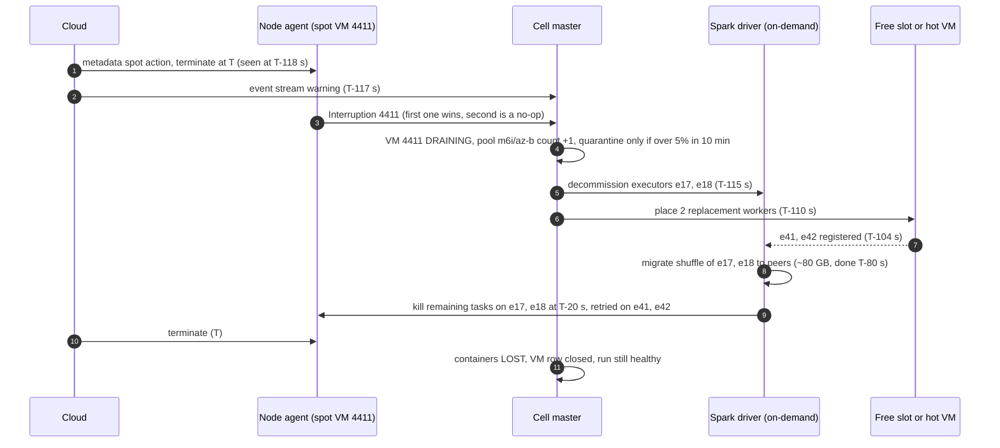

**Cell master failover.**

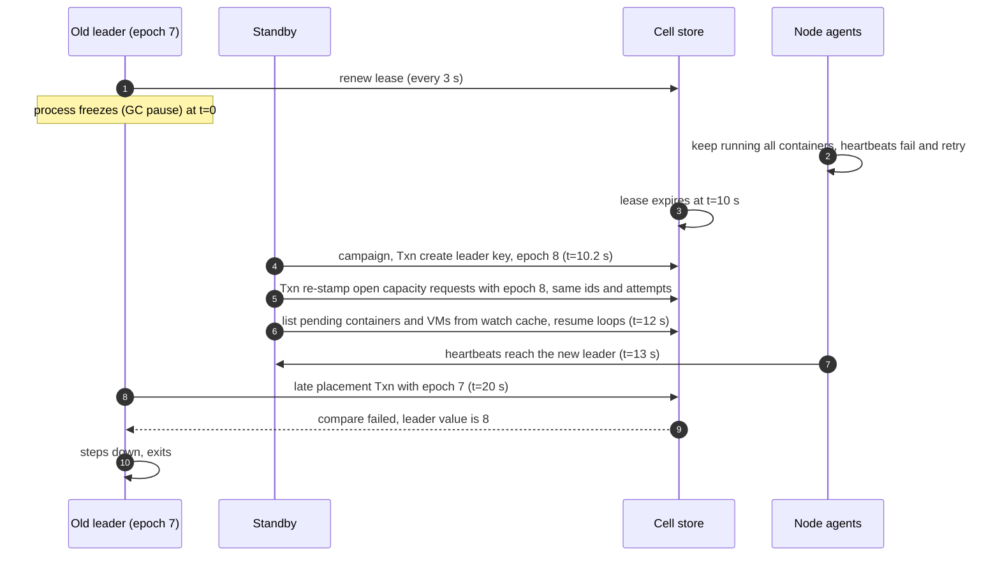

**00:00 burst with a capacity error.**

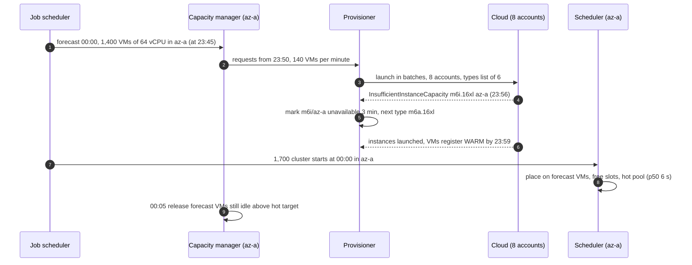

### 10.5 Exactly-once and idempotency end to end

| Hop | Duplicate source | Dedup key | Lives | On retry |
|---|---|---|---|---|
| Client to cluster service | job scheduler or UI retries `POST /clusters` | `(tenant, Idempotency-Key)` unique index | 24 h | Returns the same `cluster_id` and current state |
| Resize | two users edit at once | `if_generation` CAS on the spec row | forever | Loser gets `409` and re-reads |
| Placement | two decisions for the same slot, or an old leader | etcd Txn compare on VM `mod_revision` and `leader_epoch` | per write | Loser rescores |
| Assign to agent | message resent or delivered late | `(container_id, epoch)` | container life | Agent ignores an older epoch, starts a newer one once |
| Capacity request to cloud | provisioner crash, timeout, restart, leader failover | `request_id:attempt` as `ClientToken`; attempt bumped only after a definitive answer | the request row until closed | Same instances returned, nothing new launched. A new type list after a capacity error is a new attempt, never the same token |
| Terminate | retries | idempotent by default in the cloud API | | No-op on an already terminated instance |
| Spot warning | two notice paths, repeated events | `instance_id` | until the VM row closes | Second one is a no-op |
| `ReportDemand` | driver restarts or reorders | `(cluster_id, seq)` | cluster life | Older seq ignored |
| Leaks | anything above that still slipped | tags + orphan GC | 15 min bound | Terminated |

Spark tasks themselves are at-least-once (a task on a lost executor reruns); making job output exactly-once is the job's commit protocol (Delta's log, see [`../delta-lake-transactions/`](../delta-lake-transactions/)), not the cluster manager's.

### 10.6 Consistency model per edge

| Edge (final diagram) | Model | Where it changes |
|---|---|---|
| Client to cluster service | Strong on the spec row (unique key, `generation` CAS) | |
| Cluster service to cell (spec copy) | Eventual, under a second; the cell's copy wins for running decisions | During a regional DB outage the cell keeps its last copy |
| Cell master to cell store | Strong: single leader, Txn with epoch and `mod_revision` compares | |
| Cell master to node agent | Eventual, reconciled every 5 s; the epoch makes it convergent | Partitioned agent diverges until it reconnects or is terminated at 10 min |
| Driver to workload autoscaler | Eventual, 5 s samples, `seq` ordered | |
| Capacity manager to provisioner | Strong intent (row committed first), at-least-once execution with an idempotency token | |
| Provisioner to cloud | Eventually consistent reads (describe can lag); idempotent writes | Reconciled by tags within 15 min |
| Status back to the cluster DB | Eventual, seconds | `GET /clusters` worker counts are seconds stale |
| Cloud events to cell master | At-least-once, best effort, deduped by instance id | The agent's own polling covers a missed event |

### 10.7 Alternatives rejected

| Alternative | Why it looked attractive | Why rejected |
|---|---|---|
| Kubernetes plus Cluster Autoscaler, as is | Off the shelf; filter and score; node groups | 5,000 nodes and 150,000 pods per cluster is the documented envelope, close to one cell with no room; node groups mean one instance type per group, so 6 spot types times shapes times AZs is dozens of groups; scale-down waits for utilization under 0.5 for 10 minutes; the default score spreads. Good for a first version at 10% of our scale |
| Karpenter, as is | Groupless, bin-packs pending pods into instance shapes, per-offering capacity cache, handles interruptions | Closest to this design and a fair answer to "what would you use". Its consolidation kills pods to save cost (wrong for Spark executors mid-stage), it is one cloud, and it has no idea of the job calendar or of Spark's backlog |
| Mesos or YARN two-level scheduling | Frameworks (Spark) choose their own placement | The framework sees only what it is offered, so no one sees the whole cell; stranded capacity hides between offers. YARN's capacity scheduler is a fixed pool with no cloud autoscaling |
| Omega-style parallel schedulers on shared state | Scales scheduling throughput | We need 55 decisions a second per cell; parallel schedulers add conflicts and retries to solve a problem we do not have |
| An ILP or constraint solver for packing | Optimal packing | Online arrivals, 20-minute lifetimes, and re-packing means killing executors. The prize between good heuristics is 3 to 5% |
| Per-cluster auto scaling groups | Simple, cloud-native | Every cluster start is a cold launch; no packing; the launch count is 2.4 M a day |
| Cloud-managed warm pools (EC2 Auto Scaling) | Stopped instances cost only disk | Per group, no spot in mixed-instance groups, starting a stopped VM is rate limited like a launch (StartInstances has its own 1,000 burst, 2 per second bucket) and can still fail for capacity |
| Utilization-threshold fleet scaling | Easy to explain | Lagging signal; a fleet at 60% everywhere never shrinks; pending demand is the direct signal |
| Spark dynamic allocation inside each app | Built into Spark | Two loops on the same cluster fight; the platform sees quota, spot and warm capacity. Databricks says not to combine them |
| Live migration on spot notice | No lost work | 30 to 120 s cannot move a heap and local disk into a VM that does not exist yet |
| Remote shuffle for every cluster | Spot loss never loses shuffle | Every shuffle byte pays a network hop and a new stateful service; opt-in for the workloads where the math says so |
| Gossip for VM membership | No central failure detector | The cell master already hears every heartbeat; ownership of a VM must be one answer ([`../../concepts/gossip-protocol.md`](../../concepts/gossip-protocol.md): gossip for liveness hints, never for ownership) |

### 10.8 How the big companies do it

- **Google Borg (EuroSys 2015).** Cells of about 10k machines, one elected Borgmaster over a Paxos store (failover about 10 s, up to a minute in big cells), four priority bands with no preemption inside production, equivalence classes plus relaxed randomization plus score caching, a hybrid score 3 to 5% better than best fit, about 20% of the workload running on reclaimed resources, median task start about 25 s with 80% of it package installation. Borg does not buy machines; the cloud version of Borg is this design plus a capacity manager and a provisioner. **Autopilot (EuroSys 2020)** right-sizes containers from usage history: slack from 46% to 23%, 10x fewer jobs hit hard by OOM.
- **Meta Twine (OSDI 2020).** One control plane for a million machines across a region, instead of one per cluster. Entitlements (quota) own machines, an allocator assigns machines to entitlements and tasks to machines, a rebalancer improves placement asynchronously, and host profiles let a workload tune the OS of the machines it gets. The lesson for us: separate "whose capacity is this" from "which machine does this task use".
- **Azure Protean (OSDI 2020).** The VM allocator for a cloud: one instance per AZ (10k to 100k machines), rule-based allocation, a multi-layer cache so allocation takes about 20 ms per VM, peaks of 2,000 requests a second, 85 to 90% on its key utilization metric, and several allocation agents running concurrently on the same inventory with negligible conflicts. It is the service on the other side of our launch call, and its per-AZ, cache-heavy design is why our cells are per AZ too.
- **Kubernetes Cluster Autoscaler and Karpenter.** The Cluster Autoscaler scans every 10 s, scales up by simulating pending pods against node-group templates, and scales down nodes under 50% for 10 minutes with a 10-minute delay after any scale-up; node groups back off 5 to 30 minutes after a failed scale-up. Karpenter batches pending pods for 1 to 10 s, bin-packs them into hypothetical nodes, launches through a fleet call with many instance types, caches unavailable offerings per type and zone, drains on spot warnings from an event queue, and consolidates with a default disruption budget of 10% of nodes. Our capacity manager is Karpenter's provisioning half with Spark-aware scale-down.
- **Databricks.** Classic compute is one VM per node in the customer's account, with instance pools as the warm tier and a warning never to put the driver on a spot pool. Optimized autoscaling goes from min to max in at most two steps and scales down after 40 s (jobs) or 150 s (all-purpose) of underuse, looking at shuffle state. Serverless launches millions of VMs a day across three clouds; its 2024 post describes a slim OS, a lazy container filesystem (image pull from minutes to seconds) and checkpoint/restore of a warmed runtime (init to about 10 s), a 7x boot improvement that it feeds into warm-pool sizing. Their serverless VMs are ephemeral; ours live longer because we pack containers onto them.

### 10.9 Operational runbook

- **Dashboards (five).** Start latency p50/p99 by `start_path` and cell; pending containers by band and age; packing efficiency and stranded ratio per cell; provisioner launches, throttles and capacity errors per account and type; hot pool current vs target per shape class.
- **Alerts.** Start p99 over 120 s for 10 min in a cell: page. Any P1 container pending over 60 s: page. Throttle or capacity-error rate over 20% for 5 min: page. Orphan count rising three GC cycles in a row: page. No cell leader for 30 s: page. Spot pool quarantines over half of a shape's types in a cell: page (spot is failing over to on-demand at scale, cost spike). Stranded ratio over 5%: ticket. Spot-caused run failures over 0.1% a day: ticket.
- **Rollout.** One cell (AZ) at a time, smallest region first, with a 1-hour bake watching start latency, stranded ratio and orphan count. Scorer changes ship first in shadow mode (compute the new score, log the decision it would have made, compare packing offline). Node agent and OS image changes roll through the hot pool first: new VMs get the new image, old VMs age out by attrition, no VM is replaced in place.
- **Rollback.** Scorer: flag back to the previous weights, instant. Agent or image: stop launching the new image; VMs on it drain by attrition within a few hours, or are drained actively within the consolidation budget. Provisioner: revert the build; capacity requests are rows, so nothing is lost and the reconciler catches anything half done. No data backfill exists, because the only durable data are specs and requests.

### 10.10 Security and abuse

- **Sandbox per container** (microVM or gVisor-class), a private local-disk volume wiped on exit, per-tenant network policy, no access to the host's metadata service from inside a container (the VM's instance role must never be reachable from customer code; use the metadata service's session-token mode and a hop limit of 1 so containers cannot reach it).
- **Dedicated isolation class** for tenants whose rules forbid sharing: a VM holds one tenant at a time; when it empties it is terminated rather than reused by another tenant.
- **Node identity.** Agents register with the cloud's signed instance identity document; the cell master checks it matches a VM row from its own capacity request. A rogue VM cannot join.
- **mTLS** between agents and the cell master, and between the cell master and the provisioner. Only the provisioner holds cloud credentials that can launch or terminate.
- **The driver is customer code.** `ReportDemand` can lie ("400 pending tasks") to get workers. That is bounded by the cluster's `max`, by the tenant's quota, and by the fact that the tenant pays for what it asked for. The autoscaler trusts it for sizing, never for anything that affects another tenant.
- **Abuse.** Create-API rate limits per tenant (a runaway create loop is capped at, say, 10 creates a second), spend-rate alarms (§5.6), crypto-mining detection on the free or trial SKU by CPU profile, and P4 as the only band a trial tenant may use.

### 10.11 Evolution

- **10x (3 M starts a day, 160k VMs in a region).** Cells stay per AZ but a region gets several cells per AZ (up to about 10k VMs each, Borg's median); the cluster service routes to a cell, not just an AZ. The provisioner needs 10x the launch budget: more accounts and negotiated limits. The scheduler is still not the bottleneck at 550 decisions a second per region.
- **GPUs and gang scheduling.** Distributed training needs all N GPUs at once or none. Add a `gang` flag on a cluster: the scheduler reserves capacity for the whole gang in one Txn (or holds partial reservations with a timeout and releases them to avoid deadlock), and the capacity manager buys whole gangs. GPU shapes get their own pools and their own hot target, because a GPU VM idle for an hour costs 10x a CPU VM. The seam is the equivalence class: today it is placed per member, tomorrow per gang.
- **Classic mode in customer accounts.** The same control plane with packing factor 1 and the provisioner using a role in the customer's account. Launch limits and stock become the customer's; the hot pool becomes the customer's instance pool, billed to them.
- **Multi-cloud.** The capacity request is already cloud-neutral (`shape_class, capacity_type, count`). Each cloud gets a provisioner adapter with its own token buckets, error mapping and notice length (30 s changes the spot evacuation budget, so the remote-shuffle threshold is per cloud).
- **Multi-region.** Out of scope for a cluster (one AZ), but the job scheduler can route a run to another region when a region's cells are short. The cluster manager exposes per-cell capacity health so that routing is informed.
- **Predictive beyond the calendar.** An hourly seasonal baseline per shape class plus the job calendar covers most demand. A learned forecaster only earns its keep if the unforecast share stays large; measure it first.

---

## 11. Follow-up questions to expect

Ranked by how often they come up. Each links to the edge case or deep dive that answers it.

1. **A VM takes 60 s to boot. How does a cluster start in 10 s?** §5.1. Free slots, a hot pool sized as safety stock (2%, $3M to $8M a year), a fast cold path (slim OS, lazy image, runtime checkpoint), and buying the 00:00 burst from the job calendar at 23:50. [`deep-dives/warm-pools-and-fast-start.md`](deep-dives/warm-pools-and-fast-start.md).
2. **5,000 clusters start at 00:00. What breaks first?** §5.2. The cloud launch API: 1,000 at once then 2 a second per account is 25 minutes for 4,000 VMs. Forecast, 8 accounts, big instances, our own token buckets. [`deep-dives/provisioning-and-reconciliation.md`](deep-dives/provisioning-and-reconciliation.md).
3. **A spot VM gets its 2-minute notice. Walk it.** §4.4 and §10.4. Two notice paths, drain, decommission with shuffle migration, replacements on warm capacity, tasks retried at T - 20 s. [`deep-dives/spot-capacity-and-interruption.md`](deep-dives/spot-capacity-and-interruption.md).
4. **Now the whole spot pool goes.** §5.4. Six pools, 20% cap per pool, on-demand driver and floor, pool quarantine, livelock guard, remote shuffle where the math says so.
5. **Bin packing is NP-hard. What do you do?** §5.3. Shape menu, best fit plus alignment plus stranded penalty, spread limit, drain by attrition, measure stranded capacity. Borg's whole gain from a better score was 3 to 5%. [`deep-dives/bin-packing-and-placement.md`](deep-dives/bin-packing-and-placement.md).
6. **How do you stop thrashing and double buying?** §4.3. Two loops with different inputs, in-flight VMs counted as supply, up fast and down slow with a 40 s or 150 s window, release after 2 minutes empty and not within 10 minutes of a buy. [`deep-dives/autoscaling-control-loops.md`](deep-dives/autoscaling-control-loops.md).
7. **Production needs capacity and the cloud says no. Who gets preempted?** §4.5. Only lower-band workers, never drivers, within a 25% per 10 min budget, 30 s grace; P1 never preempts P1, so no cascades. [`deep-dives/preemption-and-priority.md`](deep-dives/preemption-and-priority.md).
8. **The control plane is down for 10 minutes. What happens?** §5.5. Running work continues; placement, autoscaling and buying pause in that cell; failover under 15 s; the regional DB outage only blocks create and terminate. [`edge-cases.md`](edge-cases.md).
9. **The provisioner crashed after calling the cloud. Where is that VM?** §5.5. Same client token on retry returns the same instances; tags plus orphan GC terminate anything unmatched within 15 minutes; $39M a year is the price of not doing it.
10. **Why not just use Kubernetes?** §10.7. Envelope of 5,000 nodes, node groups per instance type, utilization-based scale-down, spreading score. Karpenter is the closest off-the-shelf answer, minus Spark-aware scale-down and the calendar.
11. **Two tenants on one VM?** §4.2 and §10.10. Sandbox, wiped disks, no metadata access, and a `dedicated` class for tenants who cannot share.
12. **How do you migrate from one VM per worker to this?** §8. Five phases, per-cluster placement flag, nothing migrated, clusters drain in 20 minutes.
13. **What pages at 3am?** §8 and §10.9. Start p99 over 120 s, P1 pending over 60 s, launch errors over 20%, orphans rising, no cell leader.
14. **How much does all this cost, and where would you cut?** §2 and §8. $180M a year; spot saves $115M; a point of packing is $2M; the hot pool is 2%. Cut the hot pool for a cheaper SKU that accepts 60 s starts.
