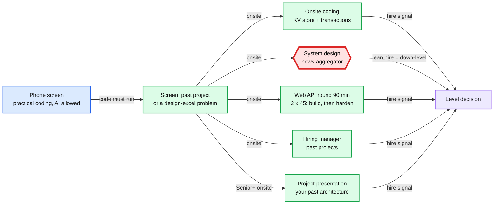
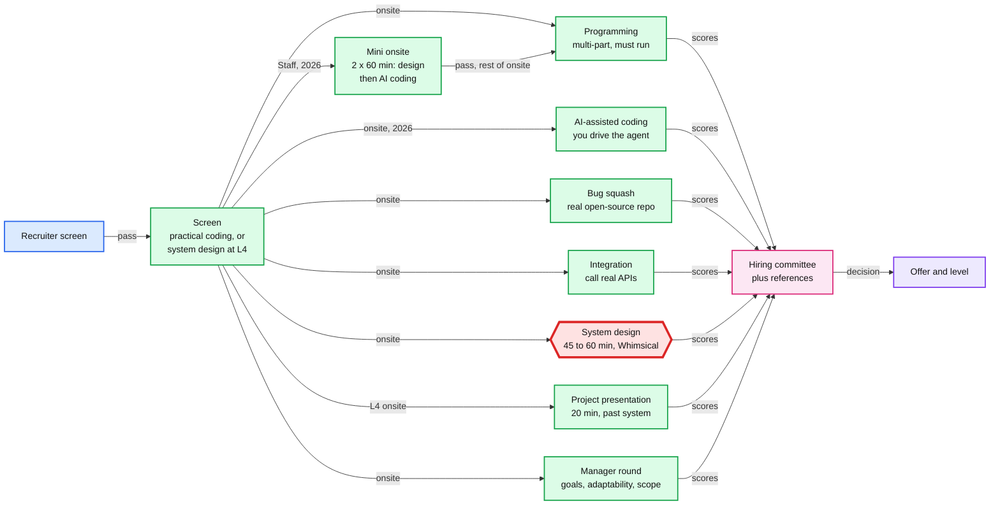
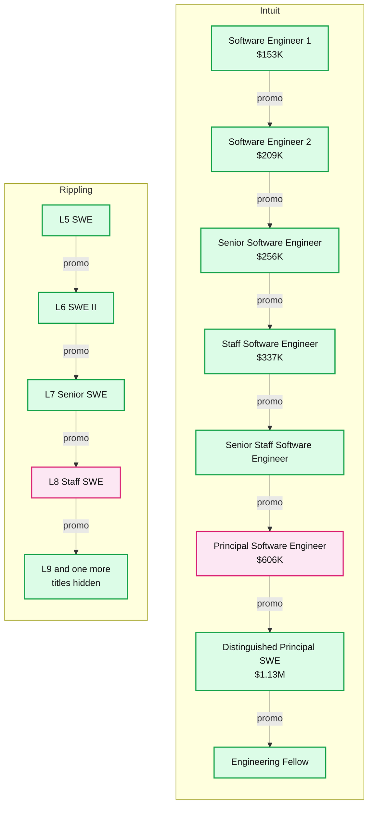

# Company Question Bank: Intuit (Principal), Rippling (Staff) and Stripe (Staff)

> One-line answer: Intuit Principal is a **case-study loop**. You get a design or build prompt ahead of time and defend it across about 4 rounds, with AI and security graded in every one. Rippling Staff is a **practical loop**. You write runnable code with tests (KV with transactions, rules engine, a 90-minute API build), and the system design rounds set your level. The news aggregator is the most reported design prompt: 10 candidate posts and 16 PracHub pages. Stripe Staff (L4) is **practical rounds plus a design bar**: bug squash in a real repo, integration against real APIs and AI-assisted coding, next to one or two 45 to 60 minute design rounds. Stripe's design prompts are its own: metrics counters, idempotent ledgers, a feature-flag service (the one 2026 Staff report) and a "superhero dispatch" graded on why you picked each technology.

Checked 2026-09-30. Rippling design rounds (§2.2) re-checked 2026-10-02. Stripe (§3) checked 2026-10-08. Every row below carries its source and one of these tags:

| Tag | Meaning |
|---|---|
| ✅ | I opened the candidate's own post and confirmed prompt, date and level |
| [snippet] | Only a search-result snippet (Glassdoor blocks fetches) |
| [guide] | An aggregator page (PracHub). Built from candidate reports, but no level and not independent |
| [unverified] | Cited by a research agent, page could not be opened (1point3acres 403, x.com 402) |

Guide-only lists (SystemDesignHandbook, DesignGurus, Exponent / Aced, techinterview.org) are not counted as reports.

---

## 1. Intuit: Principal and Staff+

### 1.1 The loop

```mermaid
%% Intuit Staff+/Principal loop as reported 2022 to 2026. Red = where reported rejections came from.
flowchart LR
    RS[Recruiter screen<br/>AI-tool usage asked] -->|pass| TS[Tech screen 75 min<br/>30 coding + 45 design + AI]
    TS -->|pass| CS[Case study handed out<br/>days to weeks ahead]
    CS -->|your deck or code| SC{{Scoping choices<br/>what you skip is graded}}
    SC -->|deck submitted| L1[Loop day: ~4 rounds<br/>present + deep dives on it]
    L1 -->|same day or next| L2[Assessor / HM / director<br/>machine coding, SD, AI]
    L2 -->|decision + level| OUT[Offer or down-level]

    class RS,TS client
    class L1,L2 service
    class CS decision
    class SC critical
    class OUT store

    classDef client   fill:#dbeafe,stroke:#2563eb,stroke-width:2px,color:#111
    classDef service  fill:#dcfce7,stroke:#16a34a,stroke-width:2px,color:#111
    classDef store    fill:#ede9fe,stroke:#7c3aed,stroke-width:2px,color:#111
    classDef critical fill:#fee2e2,stroke:#dc2626,stroke-width:4px,color:#111
    classDef decision fill:#fce7f3,stroke:#db2777,stroke-width:2px,color:#111
```

- **Tech screen.** 75 min: 30 min coding, then 45 min design with an AI part (Senior Staff, Bangalore, Jul 2025) ✅ [Blind](https://www.teamblind.com/post/insights-on-intuit-interview-process-for-senior-staff-kpeifc1y). A Principal candidate (Oct 2025) said round one was "easy leetcode + system design", and then they got a case study for the loop ✅ [Blind](https://www.teamblind.com/post/intuit-interview-for-principal-software-engineer-htn8z0j0).
- **Case study.** Given before the loop. "It will easily take 3-4 hours of your time, maybe more. Some interviewers expect you to know the ins and outs of a specific database" ✅ [Blind](https://www.teamblind.com/post/insights-on-intuit-interview-process-for-senior-staff-kpeifc1y).
- **Loop day.** Staff+ (Sep 2025): "4 different rounds on the same day to demo this case study", then possibly 3 more rounds (assessor, hiring manager) including machine coding, system design and AI ✅ [Blind](https://www.teamblind.com/post/intuit-craft-demo-case-study-staff-software-engineer-hcouv354).
- **Principal, Bangalore (2022).** HR described 5 rounds: a leadership-team round, craft demo prep and demo, 2 tech rounds, a director round ✅ [Blind](https://www.teamblind.com/post/principal-engineer-intuit-interview-experience-o1duw410).
- **AI is graded everywhere.** "They even have AI assessors in the panel" (Jan 2025) ✅ [Blind](https://www.teamblind.com/post/intuit-craft-interview-beware-bcwqknjd). "As per new rules, Staff engg are supposed to be proficient in AI" (May 2025 comment) ✅ [Blind](https://www.teamblind.com/post/intuit-craft-interview-w3jvnva2).

### 1.2 Two craft formats

| Format | Reported by | What happens | Source |
|---|---|---|---|
| Take-home design case study, presented | Principal (Oct 2025), Senior Staff (Jul 2025), Jan 2025 candidate | Problem statement ahead of time. You build a deck (a Staff commenter: "2 user stories, 1 AI story"), present it, then get grilled across rounds | ✅ Blind [htn8z0j0](https://www.teamblind.com/post/intuit-interview-for-principal-software-engineer-htn8z0j0), [kpeifc1y](https://www.teamblind.com/post/insights-on-intuit-interview-process-for-senior-staff-kpeifc1y), [bcwqknjd](https://www.teamblind.com/post/intuit-craft-interview-beware-bcwqknjd) |
| Build or extend code | Staff backend (May 2025), Staff (Apr 2023) | Given a repo and told to expect live coding on top of it. In 2023: 5 days to build a whole app, then a demo and 3 more rounds on the same app | ✅ Blind [w3jvnva2](https://www.teamblind.com/post/intuit-craft-interview-w3jvnva2), [vybbn3hw](https://www.teamblind.com/post/intuit-interview-experience-vybbn3hw) |

**The build-format repos are public.** The Staff candidate's repo is under the [Intuit-A4A GitHub org](https://github.com/Intuit-A4A). It holds a "Player Service": baseball player data over SQLite, with [Ollama](https://github.com/ollama/ollama) running tinyllama locally, in [Python Flask](https://github.com/Intuit-A4A/backend-python-player-service), [Java Spring Boot](https://github.com/Intuit-A4A/backend-java-player-service) and fullstack React variants, plus mobile variants. Most were pushed 2026-09-25 to 28, so the repos are in current use. Running the Java one locally and adding one LLM-backed feature in 60 minutes is the closest rehearsal available.

### 1.3 Prompts reported

| # | Prompt | Level | Date | Round | Status |
|---|---|---|---|---|---|
| 1 | "Design a service that provides tax refund status" | Principal | undated | Tech screen with a Principal Engineer | [snippet] [Glassdoor Principal SWE](https://www.glassdoor.com/Interview/Intuit-Principal-Software-Engineer-Interview-Questions-EI_IE2293.0,6_KO7,34.htm) |
| 2 | "Identify social media trends for marketing purpose". A take-home design, graded "heavily on how you can build AI native applications" | not stated | Jan 2025 | Craft | ✅ [Blind](https://www.teamblind.com/post/intuit-craft-interview-beware-bcwqknjd). Rejected: "security was a complete miss" (the AI part was "fine") |
| 3 | Live coding on the Player Service repo: CRUD, Ollama integration, an "a4a model" folder with training code | Staff backend | May 2025 | Craft onsite | ✅ [Blind](https://www.teamblind.com/post/intuit-craft-interview-w3jvnva2) |
| 4 | Election management e-board: contenders post a manifesto of at most 3 ideas, citizens rate 0 to 10, a rating above 5 makes the citizen a follower, email followers and followers of followers, remove a contender if any idea is rated under 5 by more than 3 voters, winner = highest sum of average rating per idea. OOP, "code you would be comfortable submitting for a PR" | not stated | Mar 2022 | Craft | ✅ [LeetCode](https://leetcode.com/discuss/interview-question/system-design/1893734/Intuit-or-Craft-demo-or-Election-management-system) |
| 5 | 5-day backend application, then a demo plus 3 rounds on it (prompt not disclosed) | Staff, down-levelled | Apr 2023 | Craft | ✅ [Blind](https://www.teamblind.com/post/intuit-interview-experience-vybbn3hw) |
| 6 | Rate limiter that "allows five people through during each time period", then extended for VIP users | Senior+ | Jul 2026 | 75-min screen | [guide] [PracHub](https://prachub.com/interview-guide/intuit-software-engineer-interview-questions-guide-2026). Also `rateLimit(String key, int intervalInSecs, int maxLimit)` [snippet] [Glassdoor](https://www.glassdoor.com/Interview/Implement-rate-limiter-public-boolean-rateLimit-String-key-int-intervalInSecs-int-maxLimit-QTN_7898902.htm) |
| 7 | "An AI agent that routes financial requests to microservices and validates the returned payload". Plus "an LLM setup and architecture" | SWE, no level | 2026 | Design | [guide] [PracHub](https://prachub.com/interview-guide/intuit-software-engineer-interview-questions-guide-2026) |
| 8 | Parking lot "with classes, state and persistence" | SWE, no level | 2026 | Design | [guide] same |

Coding reported: balanced parentheses at Principal [snippet] (Glassdoor Principal page). The SWE-level PracHub guide (9 candidate experiences) lists: topological sort with cycle detection framed as TurboTax task order, merging QuickBooks time windows, nested-string decoding, longest range with at most k categories, a thread-safe LRU cache, a running median. Plus SQL (JOIN, GROUP BY, HAVING, window ranking) and a Bash log-parsing task in the online assessment [guide].

Not reported, despite what an agent claimed: "gateway cache stampede", "event rollup with late arrivals", "live partitioned-table migration" and "webhook signature header". These are PracHub's own worked practice prompts, not candidate questions.

### 1.4 What gets probed

- **AI inside the product, with guardrails.** Assume every design needs one place where a model does real work. Know where it can fail: schema-checked output, a timeout fallback, token caps, human review for money.
- **Security as a first-class section.** The one detailed rejection came from treating authn, authz, PII and encryption as a side note in a finance product.
- **Scoping is graded.** A commenter on the rejection thread: "what you prioritize might be part of the assessment". Say what you cut and why, in writing, on slide 2.
- **Your own deck, four times.** Every round re-opens your case study. Weak spots get found by round 3.

### 1.5 Intuit numbers worth quoting

- TurboTax on Kubernetes: 26 clusters across 2 AWS regions x 3 AZs, about 1,000 nodes, "scale from 5K to 300K transactions per second (TPS) within two hours". Pods went from ~1,100 to 2,500 in early April, nodes from 600 to 900. Serves 40 to 50M customers ([Diginomica, Nov 2020](https://diginomica.com/modernizing-tax-season-fixture-intuit-migrates-turbotax-kubernetes-and-lives-tell-tale); original posts [part 1](https://medium.com/intuit-engineering/turbotax-moves-to-kubernetes-an-intuit-journey-part-1-aa861c061a11), [part 2](https://medium.com/intuit-engineering/turbotax-moves-to-kubernetes-an-intuit-journey-part-2-f5217772fbb6), which block fetches).
- Tax day (15 April): "185 billion real-time transactions", "11 million transactions per second", "500 million user requests", "14 petabytes of real-time data all in one day" ([Intuit blog, updated Jun 2026](https://www.intuit.com/blog/innovative-thinking/tech-innovation/how-intuit-transformed-tax-filing-experiences/)). 185B / 86,400 s = 2.1M/s average, so 11M/s is the peak. That is a ~5x peak-to-average ratio inside one day, and 60x (5K to 300K) across the season.

### 1.6 Map to this repo

| Intuit prompt | Practise with |
|---|---|
| Tax refund status | New #45 in [README](README.md). Status lookup behind a slow external dependency (the IRS), push vs poll, a 60x seasonal spike |
| Rate limiter with VIP tier | [#7 network-throttling](network-throttling/), [rate limiting concept](../concepts/rate-limiting-and-load-shedding.md) |
| AI agent routing, LLM guardrails | [#43 ai-gateway](ai-gateway/) |
| 5K to 300K TPS in 2 hours | [#21 cluster-manager](cluster-manager/) (calendar pre-scale), [caching patterns](../concepts/caching-patterns.md) |
| QuickBooks money | [#8 payments-ledger](payments-ledger/) |
| Practice list (2026-10, not reported candidate prompts): TurboTax e-file at the April 15 peak | [#49 turbotax-efile](turbotax-efile/). Postmark at our receipt, exactly-once submission ids to MeF, ack reconciliation |
| Practice list: QuickBooks multi-tenant ledger | [#50 quickbooks-ledger](quickbooks-ledger/). Balanced immutable postings, per-company consistency, period balances for fast reports |
| Practice list: bank feed aggregation | [#51 bank-feed-aggregation](bank-feed-aggregation/). Per-institution call governor, idempotent ingestion, pending to posted |
| Practice list: QuickBooks Payments inline risk | [#52 payments-risk-decisioning](payments-risk-decisioning/). 100 ms decision, fallback on timeout, merchant risk. Plays to Uber Risk |
| Practice list: payroll run for ~1M small businesses | [#29 payroll-engine](payroll-engine/). ACH cut-offs, exactly-once money movement, safe retries |
| Practice list: Credit Karma score-change alerts | [#53 credit-score-alerts](credit-score-alerts/). Change detection, fan-out without a herd on the read path |
| Practice list: Mailchimp campaign sending | [#54 email-campaign-sending](email-campaign-sending/). Per (IP, provider) throttling, reputation, canary |
| Practice list: GenAI assistant over financial data | [#55 financial-ai-assistant](financial-ai-assistant/). Tool authorization, grounded numbers, offline evals. Also covers the reported "AI agent routing financial requests" prompt |

---

## 2. Rippling: Staff

### 2.1 The loop

- **Levels.** L5 SWE, L6 SWE II, L7 Senior, **L8 Staff** ([levels.fyi](https://www.levels.fyi/companies/rippling/salaries/software-engineer)). Two public posts are labelled Staff, and both name a design prompt: the [news aggregator](https://leetcode.com/discuss/post/7273857) (Oct 2025) and a [document verification system](https://doniv.substack.com/p/rippling-system-design-interview) (Apr 2025). Every other report is L7 (Senior) or below, so read those as the floor for Staff.
- **Phone screen.** Practical coding in your own IDE with AI tools allowed (Aug 2025) ✅ [Blind](https://www.teamblind.com/post/rippling-interview-with-ai-tools-c4agrsej). "They made it very clear at the beginning that they want the code to run or there will be a reject" (Apr 2024) ✅ [LeetCode](https://leetcode.com/discuss/interview-question/4985212/Rippling-or-PhoneScreen-or-KeyValue-Datastore/).
- **Full loop (Jan 2024, 8 YOE, aiming for SDE-3).** Screening: Design Excel sheet ([LC 631](https://leetcode.com/problems/design-excel-sum-formula/)) and a past-project round. Onsite: in-memory KV store with transactions (Strong Hire), news aggregator and feed system (Lean Hire), Stack Overflow API end to end, "1:30 minutes round, divided in 2 parts 45 minutes each. You need to code end to end API in 45 minutes with working and prod ready code". Outcome: **down-levelled to SDE-2 because of the design round** ✅ [LeetCode](https://leetcode.com/discuss/interview-experience/4496620/Senior-Software-Engineer-or-Rippling/).
- **L7 loop with an offer (Bengaluru, Feb 2024).** Recruiter screen asked "how would you design a deployment system" and "how would you monitor a system". Tech-screen design round: news aggregator. Onsite: design "an event tracking system like amplitude" (requirements given up front: SDK, servers, database, query, chart render), a KV store that starts with save and delete and then adds commit and rollback, a hiring-manager culture round, and a **project presentation** on a past system's architecture. The candidate credits the last 5 minutes on observability, on-call, SOPs and retry bottlenecks for the pass ✅ [LeetCode](https://leetcode.com/discuss/interview-experience/5094495).
- **L7 loop down-levelled to L6 (May 2022).** Org-tree direct reportees, an API-design round that grows into LLD with a design pattern, then design rounds: a real-time "performance matrix" over streams from many services, a Feedly-style newsfeed, and after negative design feedback a reassessment round on an Instagram-style photo app. "All design choices are questioned" ✅ [LeetCode](https://leetcode.com/discuss/interview-experience/2118542).
- **Nested transactions are the Senior bar.** A SWE II candidate: the KV follow-up "support multi-threaded operations and nested transactions ... is a requirement for senior candidates" ✅ [LeetCode](https://leetcode.com/discuss/interview-experience/5375106).
- **AI is allowed but judged.** One candidate was rejected at the tech screen after prompting Copilot through the whole problem: "I shouldn't have used that much AI". Another solved everything without AI but "couldn't write tests for the final question because you have to defend every decision, do OOP, and write tests" ✅ [Blind](https://www.teamblind.com/post/rippling-interview-with-ai-tools-c4agrsej), same thread as the phone-screen bullet.

### 2.2 System design prompts, ranked

"Reports" counts candidate posts I opened. "PracHub" counts question pages tagged Rippling and System Design: the 39 on the [category list](https://prachub.com/companies/rippling/categories/system-design) plus 1 unlisted page reached by an older link (checked 2026-10-02). All are tagged "Software Engineer" except 1 Frontend and 1 Backend Engineer page. Pages show the round, never a level. Different PracHub pages can come from the same candidate.

| # | Prompt | Reports ✅ | PracHub [guide] | What gets probed |
|---|---|---|---|---|
| 1 | **News aggregator / personalized news feed** | 10: [Staff Bangalore Oct 2025](https://leetcode.com/discuss/post/7273857) (5M writes a day, 100k read QPS; no reply after the round); [SDE 2 L6 Jun 2026](https://leetcode.com/discuss/post/8367124) ("Google News-like"; prepare both the feed service and the crawling pipeline); [SDE 2 India Jun 2025](https://leetcode.com/discuss/post/6850291) (crawling, indexing, ranking; offer); [Senior Bengaluru Aug 2024](https://leetcode.com/discuss/interview-experience/5698133) (screening round; offer); [L7 tech screen Feb 2024](https://leetcode.com/discuss/interview-experience/5094495); [onsite Jan 2024](https://leetcode.com/discuss/interview-experience/4496620/Senior-Software-Engineer-or-Rippling/); [SDE 2 Bangalore 2024](https://leetcode.com/discuss/interview-experience/5590877) ("latest 25 news from each publisher", thousands of publishers, write the schema, dedup); [L7 to L6 May 2022](https://leetcode.com/discuss/interview-experience/2118542) (Feedly); [L6 Apr 2022](https://leetcode.com/discuss/interview-experience/1979218) ("Personalized Google Feed"); [Blind May 2026](https://www.teamblind.com/post/rippling-system-design-interview-tew7hkun) "a famous one they ask" | 16 (9 onsite, 6 tech screen, 1 online assessment), e.g. [personalized feed](https://prachub.com/interview-questions/design-a-personalized-news-feed-aggregator), [from publisher APIs](https://prachub.com/interview-questions/design-a-news-aggregator-that-builds-personalized-feeds-from-publisher-apis), [deduplicated feed](https://prachub.com/interview-questions/design-a-deduplicated-personalized-news-feed), [news app with caching](https://prachub.com/interview-questions/design-a-large-scale-news-app-with-caching), [frontend feed](https://prachub.com/interview-questions/design-a-performant-frontend-news-feed) (Frontend Engineer) | Polling many publisher APIs under rate limits and outages, dedup of syndicated copies, stable cursor pagination while articles keep arriving, fan-out on read vs write (pick a hybrid), breaking news for everyone, cold-start defaults |
| 2 | **Event analytics pipelines** | 5: [L7 onsite Feb 2024](https://leetcode.com/discuss/interview-experience/5094495) "event tracking system like amplitude" (offer); [Senior Bengaluru Aug 2024](https://leetcode.com/discuss/interview-experience/5698133) "event system like amplitude with analytics and reporting use cases" (offer); [SSE Oct 2024](https://www.teamblind.com/post/rippling-sse-interview-experience-ysafqm8x) "custom tailored to their use-case ... similar to one of the services developers use a lot for analytics"; [SDE Bangalore Aug 2025](https://roundz.substack.com/p/interview-experience-154-rippling-sde) "Rollup-Aggregation system" (client SDK batching, idempotent retries, 15 min / 1 h / 1 day rollups; rejected on a DSA round); [L7 to L6 May 2022](https://leetcode.com/discuss/interview-experience/2118542) real-time performance matrix from streams | 6: [user-behaviour monitoring](https://prachub.com/interview-questions/design-a-user-behavior-monitoring-system) (onsite), [ad-click aggregation](https://prachub.com/interview-questions/design-an-ad-click-aggregation-and-enrichment-pipeline) (onsite), [logging system](https://prachub.com/interview-questions/design-a-scalable-logging-system) (onsite), [clickstream](https://prachub.com/interview-questions/design-a-user-behavior-tracking-clickstream-analytics-system) (tech screen), [user-behaviour tracking](https://prachub.com/interview-questions/design-a-user-behavior-tracking-system) (tech screen), [log ingestion and query](https://prachub.com/interview-questions/design-centralized-log-ingestion-and-query-system) (tech screen) | Real-time dashboard plus raw retention for batch, client-side batching vs latency, idempotency keys on retry, multi-resolution rollups, late and out-of-order events, hot vs archive retention |
| 3 | **Hotel search, booking and reservation** | 2: [SDE-2 Oct 2024](https://leetcode.com/discuss/interview-experience/5868538) "hotel reservation aggregator", where the hotel is also listed on other aggregators (round feedback borderline, offer); [Senior Sep 2025](https://leetcode.com/discuss/post/7196226) "Design Booking System", No Hire, rejected ("Interviewers wanted full length answer") | 3 onsite: [search and reservation](https://prachub.com/interview-questions/design-a-hotel-search-and-reservation-system), [search and booking](https://prachub.com/interview-questions/design-a-hotel-search-and-booking-system) (external API integration), [hotel booking](https://prachub.com/interview-questions/design-a-hotel-booking-system) | No overselling on any night of a range, the same room sold on other aggregators (sync or hold inventory across channels), idempotency, the payment boundary, stale search results |
| 4 | **Corporate card / expense rules engine** | 1: [Blind Apr 2026](https://www.teamblind.com/post/rippling-sse-interview-phone-screen-s3ce1jf1), SSE phone screen, full prompt (see 2.3). It is a coding round in 3 more posts ([SDE 2 Jun 2025](https://leetcode.com/discuss/post/6850291), [Senior Sep 2025](https://leetcode.com/discuss/post/7196226), [SDE 2 L6 Jun 2026](https://leetcode.com/discuss/post/8367124)). No post has it as a design round | 7 tech screen: [rules + return type](https://prachub.com/interview-questions/design-expense-rules-engine-and-return-type), [scalable engine](https://prachub.com/interview-questions/design-a-scalable-expense-rules-engine), [scale rule evaluation](https://prachub.com/interview-questions/how-would-you-scale-rule-evaluation), [high traffic](https://prachub.com/interview-questions/scale-a-rules-engine-for-high-traffic), [reimbursement system](https://prachub.com/interview-questions/design-a-flexible-expense-reimbursement-system), [trip-level aggregates](https://prachub.com/interview-questions/extend-rules-for-trip-level-aggregates-and-outputs), [expense violation processing](https://prachub.com/interview-questions/design-scalable-expense-violation-processing) | Rules as data, not code. Trip-level aggregates. Adding rule types via an API. Then scale it: compile and cache rules, keep evaluation deterministic, explain each decision |
| 5 | **Delivery cost / driver pay** | 1: [SSE Jan 2025](https://leetcode.com/discuss/post/6290685) as coding (`addDriver`, `addOrder`, `getTotalCost`, then float vs BigDecimal and rate updates). Rejected: 3 parts were expected, only 1 done. A coding round again in 3 more posts: [SDE 2 Jun 2025](https://leetcode.com/discuss/post/6850291) (cost, then `pay_up_to_time`, then max active drivers in the last 24 h), [Senior Sep 2025](https://leetcode.com/discuss/post/7196226), [SDE 2 L6 Jun 2026](https://leetcode.com/discuss/post/8367124) | 4: 3 tech screen ([delivery cost](https://prachub.com/interview-questions/design-a-delivery-cost-system), [driver payment](https://prachub.com/interview-questions/design-delivery-driver-payment-system), [real-time delivery dashboard](https://prachub.com/interview-questions/design-a-real-time-delivery-dashboard)), 1 onsite ([in-memory billing core APIs](https://prachub.com/interview-questions/design-in-memory-delivery-billing-core-apis)) | `add_driver`, `record_delivery`, `get_total_cost`, `pay_up_to`, `get_total_cost_unpaid`. Interval accounting, integer cents, idempotent partial payout, no double pay for overlapping work |
| 6 | **Document verification system** | 1: [Staff, Apr 2025](https://doniv.substack.com/p/rippling-system-design-interview). Upload a document, update its verification status, fetch the status. 500K documents a day, each verified within 1 to 4 h by priority, by a manual operations team. 60 min on CodePair. Written up as a solution post | 0 | Async workflow, priority queues that meet the SLA, bulk upload, a ticket queue for the ops team, blob store plus metadata DB, one document per employee and type |
| 7 | **Employee-ops bundle** | 1: [PracHub experience, May 2026](https://prachub.com/interview-experiences/rippling-seniorplus-software-engineer-interview-experience-phone-screens-plus-a-four-part-ai-team-onsite-building-a-live-llm-chatbot), Senior+, AI team. First-hand but curated by PracHub. It was four separate rounds: counter design (tech screen), driver pay (coding), termination (design), LLM chatbot (90-min build) | 1 onsite, hard: [link](https://prachub.com/interview-questions/build-reliable-employee-operations-and-expense-intelligence-systems). Solved as [#46](employee-ops-bundle/) | Four parts: a tagged event counter (late and duplicate mobile uploads, exact monthly billing), a driver-pay ledger, an **employee-termination orchestrator across external systems**, an LLM expense assistant |
| 8 | **Duplicate payment prevention** | 0 | 1 onsite, May 2026: [link](https://prachub.com/interview-questions/prevent-duplicate-payments-under-high-load) | Idempotency, concurrency control, a payment state machine under failures (from the page summary; the full prompt needs a login) |
| 9 | **Minimal HTTP server from scratch** | 0 | 1 onsite: [link](https://prachub.com/interview-questions/implement-a-minimal-local-http-server) | HTTP/1.1 parsing, concurrency, timeouts, graceful shutdown, tests |
| 10 | **Several systems in one HR screen** | 0 | 1 HR screen, Feb 2026: [link](https://prachub.com/interview-questions/design-several-large-scale-systems) | Page summary: ingestion and dedup pipelines, real-time aggregation, search and ranking, concurrency control for bookings, observability. Rows 1 to 3 in one call |
| 11 | Feed where "fan out at write" details were the miss | 1: [Blind Sep 2025](https://www.teamblind.com/post/failed-on-rippling-system-design-interview-nd0ip4sm), Sr. EM, rejected | n/a | Prompt not named. Same fan-out question as #1 |
| 12 | Generic social: Twitter, Instagram, KV store, distributed counter, Ticketmaster | 3: [2021 onsite](https://leetcode.com/discuss/interview-experience/1318240) "design twitter"; [L7 to L6 2022](https://leetcode.com/discuss/interview-experience/2118542) Instagram reassessment; [Blind Mar 2022](https://www.teamblind.com/post/Rippling-system-design-interview-YtD8DAYL) commenters | n/a | Older loops. Rarer since 2024 |

**Not counted:** an [SDE 2 Mar 2026](https://leetcode.com/discuss/post/7727521) post passed an HLD round without naming the prompt. A Blind commenter (Mar 2024) guessed "Workflow Automation / orchestration" ([Blind](https://www.teamblind.com/post/rippling-system-design-interview-what-to-expect-uwzweqw3)).

**Seen only in guides, never in a candidate post I could open:** payroll system, employee identity system, permissions engine ([SystemDesignHandbook](https://www.systemdesignhandbook.com/guides/rippling-system-design-interview/)); employee graph, onboarding and offboarding cascade, app provisioning, cross-product policy enforcement ([DesignGurus](https://www.designgurus.io/answers/detail/what-to-expect-in-the-rippling-system-design-interview), which derives them from Rippling's product architecture). They are still Rippling's core product, so a Staff interviewer may reach for them. The closest reported ones are the termination orchestrator in #7 and document verification in #6.

### 2.3 Practical coding and API rounds

| Prompt | Round | Status |
|---|---|---|
| **Corporate card rules engine.** `evaluateRules(rules, expenses)`, where expenses are string-to-string maps (`expense_id`, `trip_id`, `amount_usd`, `expense_type`, `vendor_type`, `vendor_name`). Starting rules: no restaurant expense over 75, no airfare, no entertainment, no single expense over $250, a trip total at most 2000, meals at most 200 per trip. "Discuss the return type" before coding. Future: more rule types and "rule creation via an API" | SSE phone screen, Apr 2026 | ✅ [Blind](https://www.teamblind.com/post/rippling-sse-interview-phone-screen-s3ce1jf1) |
| **KV store with `begin`, `commit`, `rollback`.** Nested transactions via a stack of maps. Deletes need a tombstone in the transaction map. Must run with tests | Phone screen Apr 2024; onsite Jan 2024, Aug 2024, Oct 2024 | ✅ [LeetCode](https://leetcode.com/discuss/interview-question/4985212/Rippling-or-PhoneScreen-or-KeyValue-Datastore/), [LeetCode](https://leetcode.com/discuss/interview-experience/4496620/Senior-Software-Engineer-or-Rippling/), [LeetCode](https://leetcode.com/discuss/interview-experience/5698133), [LeetCode](https://leetcode.com/discuss/interview-experience/5868538) |
| **Stack Overflow API end to end.** 45 min to a working, prod-ready API, then 45 min on hardening. Follow-ups: scalability, security | Onsite, Jan 2024; Senior onsite, Sep 2025 (Hire to Strong Hire) | ✅ [LeetCode](https://leetcode.com/discuss/interview-experience/4496620/Senior-Software-Engineer-or-Rippling/), [LeetCode](https://leetcode.com/discuss/post/7196226) |
| **Design Excel sheet** ([LC 631](https://leetcode.com/problems/design-excel-sum-formula/)). Later variant: `set(cell, value or "=A1+5")` and `print()` of raw and computed values | Screen, Jan 2024; SDE-2 onsite, Oct 2024 | ✅ same, [LeetCode](https://leetcode.com/discuss/interview-experience/5868538) |
| "A basic object oriented programming question which involved using heaps" | Phone screen, Aug 2025 | ✅ [Blind](https://www.teamblind.com/post/rippling-interview-with-ai-tools-c4agrsej) |
| **Delivery system**: `addDriver(driverId, hourlyRate)`, `addOrder(driverId, startTime, endTime)`, `getTotalCost()`. Then: why not float for money, and hourly-rate updates. Later posts add `pay_up_to_time`, `get_cost_to_be_paid` and max active drivers in the last 24 h | SSE, Jan 2025; SDE 2 tech screen, Jun 2025; Senior, Sep 2025; SDE 2 L6, Jun 2026 | ✅ [LeetCode](https://leetcode.com/discuss/post/6290685), [LeetCode](https://leetcode.com/discuss/post/6850291), [LeetCode](https://leetcode.com/discuss/post/7196226), [LeetCode](https://leetcode.com/discuss/post/8367124) |
| **Music player analytics**: `playSong(songId, userId)`, `addSong(songId, title)`, `printAnalytics()` for most played. Then star / unstar and last N favourites played | SDE 2, 2024; SDE-2 screen, Oct 2024; SDE 2 onsite, Jun 2025 | ✅ [LeetCode](https://leetcode.com/discuss/interview-experience/5590877), [LeetCode](https://leetcode.com/discuss/interview-experience/5868538), [LeetCode](https://leetcode.com/discuss/post/6850291) |
| **Settle balances**: from a list of transactions return who pays whom and how much, then the optimal settlement | SDE 2 phone screen, 2024 | ✅ same |
| **Currency conversion**, then the path with the maximum rate | SWE II onsite, 2024; Senior onsite, Aug 2024 | ✅ [LeetCode](https://leetcode.com/discuss/interview-experience/5375106), [LeetCode](https://leetcode.com/discuss/interview-experience/5698133) |
| **API design from complex JSON input**: validate so bad input cannot take the API down, then grow it into LLD with a design pattern | L6 and L7 loops, 2022 | ✅ [LeetCode](https://leetcode.com/discuss/interview-experience/1979218), [LeetCode](https://leetcode.com/discuss/interview-experience/2118542) |
| **Org tree**: direct reportees of a manager | L7 loop, 2022 | ✅ [LeetCode](https://leetcode.com/discuss/interview-experience/2118542) |
| Draw shapes on a 2D character grid; in-memory stream processing. Later variant: `draw()` and `move()` rectangles, then an infinite grid | Onsite, 2021; SDE onsite, Aug 2025 | ✅ [LeetCode](https://leetcode.com/discuss/interview-experience/1318240), [Roundz](https://roundz.substack.com/p/interview-experience-154-rippling-sde) |
| **Article management**: `AddArticle`, `UpvoteArticle`, `DownvoteArticle`, `PrintLastKFlippedArticles` | SDE 2 L6, Jun 2026 (AI allowed) | ✅ [LeetCode](https://leetcode.com/discuss/post/8367124) |
| **Employee records**: group by department and sum salary, then group by any key with any aggregate, then `filterBy` | SDE screen, Aug 2025 | ✅ [Roundz](https://roundz.substack.com/p/interview-experience-154-rippling-sde) |

### 2.4 The bar, in a Rippling engineer's words

A Rippling commenter on the Sr. EM rejection (Sep 2025) ✅ [Blind](https://www.teamblind.com/post/failed-on-rippling-system-design-interview-nd0ip4sm):

- "An okay solution isn't enough to pass. It's collaboration, it's thought process, first principals thinking, tradeoffs, technology choices and depth."
- "FANG people ... regularly fail our rounds because it's clear they've never done it, just regurgitating concepts."
- "If you drew a box and said 'caching' but didn't explain any cache patterns, technology, tradeoffs, highlight past experiences ... That's enough for us to fail you."
- The manager bar is to "step into that role day 0 at full competency at staff engineering level". That is the nearest public statement of the Staff design bar.

### 2.5 Rippling context worth quoting

- Core platform: "a powerful, feature-rich Django monolith with 17+ millions LoC". Gunicorn preload plus fork gave "70%+ memory savings and a 30% drop in cost" ([Rippling blog, Oct 2025](https://www.rippling.com/blog/rippling-gunicorn-pre-fork-journey-memory-savings-and-cost-reduction)).
- Reporting: "more than 400,000 reports a week", the heaviest loading intermediate data from more than 2.5M rows. A 1M-row report went from over 30 s to about 3 s ([Rippling blog](https://www.rippling.com/blog/thousands-millions-scaling-reporting-engine)).

### 2.6 Map to this repo

| Rippling prompt | Practise with |
|---|---|
| News aggregator | New #44 in [README](README.md). [fan-out / fan-in](../concepts/fan-out-fan-in.md), [caching](../concepts/caching-patterns.md), [rate limiting](../concepts/rate-limiting-and-load-shedding.md) for publisher polling |
| Rules engine (code, then scale) | [#31 `expense-rules-engine/`](expense-rules-engine/) (studied). The coding-round version (`evaluateRules`, the return type) is in its [rule-model deep dive](expense-rules-engine/deep-dives/rule-model-and-evaluation.md) |
| Driver pay, payroll, reimbursement | #29 `payroll-engine/` (todo), [#8 payments-ledger](payments-ledger/), [exactly-once](../concepts/exactly-once.md) |
| Event analytics, logging, ad clicks | [#26 health-monitoring](health-monitoring/), [#18 streaming-ingestion](streaming-ingestion/), [stream processing](../concepts/stream-processing.md), [sketches](../concepts/stream-sketches.md) |
| Employee-ops bundle (all four parts) | [#46 employee-ops-bundle](employee-ops-bundle/): event counter, [driver pay](employee-ops-bundle/deep-dives/driver-pay-ledger.md) (runnable Java), [termination orchestrator](employee-ops-bundle/deep-dives/termination-workflow-engine.md), [expense assistant](employee-ops-bundle/deep-dives/expense-assistant.md) (runnable Python) |
| Termination orchestrator | [#46 employee-ops-bundle](employee-ops-bundle/) §4.5 to §5.7, #32 `integration-platform/` (todo) for the connectors, [durable execution](../concepts/temporal-durable-execution.md) |
| Hotel search, booking, reservation | #25 `ticket-booking/` (todo) |
| Document verification | No folder yet. Closest: [#6 distributed-job-scheduler](distributed-job-scheduler/) for priority queues and deadlines, [#5 immutable-object-store](immutable-object-store/) for the files |
| Duplicate payment prevention | [#8 payments-ledger](payments-ledger/), its [idempotency-keys deep dive](payments-ledger/deep-dives/idempotency-keys.md) |
| KV with transactions | [#4 kv-store-wal](kv-store-wal/), [MVCC and isolation](../concepts/mvcc-and-isolation.md). Also write it as runnable Java with tests |

---

## 3. Stripe: Staff (L4)

### 3.1 The loop

- **Levels.** levels.fyi lists 6 SWE levels, L1 to L6, and labels **L4 "Staff Engineer"**. Average total comp: L1 $225K, L2 $284K, L3 $446K, L4 $621K. L5 and L6 are hidden ([levels.fyi](https://www.levels.fyi/companies/stripe/salaries/software-engineer), checked 2026-10-08). Candidates write "L4(Staff)" and "Staff, IC4" ✅ [Blind](https://www.teamblind.com/post/bombed-1-interview-for-stripe-l4-bbfkyevt). A candidate targeting Staff everywhere got Stripe's offer at "L5 Software Engineer" (2020) ✅ [LeetCode](https://leetcode.com/discuss/interview-experience/906579/).
- **Round names.** Programming exercise, Bug squash, Integration, System design, and a manager round called "Experience and goals" or "adaptability". A self-described current Stripe interviewer (Mar 2025): "typically the technical onsite involves bug squash, integration, FE design (for frontend roles), coding and sys design" ✅ [Blind](https://www.teamblind.com/post/stripe-onsite-technical-interview-hlpyjoxv). A 2021 SWE loop had the same five ✅ [Blind](https://www.teamblind.com/post/stripe-system-design-bxptt8eb).
- **L4 gets more design (2020 to 2022).** L4 (Sep 2020): "My phone screen was a sys design. Another sys design on the onsite, a regular stripe coding q, project presentation, manager round and another round" ✅ [Blind](https://www.teamblind.com/post/stripe-l4-loop-oq6ap7fh). L4 (Apr 2022): "2 interviews (hiring manager and system design)", then "system design, coding, behavioural and a technical project presentation". Offer ✅ [Blind](https://www.teamblind.com/post/stripe-l4-interview-process-for-sde-bzmjscvl). L5 offer (2020): a design screen, then 1 coding, a 20-minute presentation on a past project, 1 system design, the manager and the org head ✅ [LeetCode](https://leetcode.com/discuss/interview-experience/906579/). A commenter on an L4 thread (May 2022): "L4 generally has two design rounds" ✅ [Blind](https://www.teamblind.com/post/stripe-interview-review-l4-cajhi5dn).
- **Staff in 2026.** The one 2026 Staff report (Aug): after the recruiter screen, "two rounds of a mini onsite (60 min * 2)". Round 1 was system design (feature flags), round 2 AI coding. Rejected after those two ✅ [PracHub](https://prachub.com/interview-experiences/stripe-staff-software-engineer-interview-experience-feature-flag-design-and-an-ai-coding-round-rejected).
- **Below Staff, design is not guaranteed.** Senior+ (Sep 2026): bug hunt, AI coding, a map-drawing integration, behavioral. "I was interviewing for Sr but there was no system design round?!" ✅ [PracHub](https://prachub.com/interview-experiences/stripe-senior-software-engineer-interview-experience-bug-hunt-ai-pairing-and-map-drawing-rounds-no-system-design). L3 / Senior full-stack, 15 YoE (Apr 2026): no design in the onsite, then "a final design round" added after positive feedback ✅ [Blind](https://www.teamblind.com/post/stripe-one-final-design-round-after-virtual-onsite-what-to-expect-l3senior-full-stack-r7cg014e). A commenter guessed it was "to calibrate leveling (L3 vs L4)".
- **Round mechanics.** 45 minutes in 2021 and 2025 ("I felt 45 mins was too short") ✅ Blind [tshyvotg](https://www.teamblind.com/post/stripe-system-design-interview-tshyvotg), [bxptt8eb](https://www.teamblind.com/post/stripe-system-design-bxptt8eb), [ps7pgzwy](https://www.teamblind.com/post/stripe-onsite-design-1-interview-ps7pgzwy). 60 minutes in the 2026 Staff mini onsite. Whimsical as the whiteboard ✅ Blind [fxpd6zng](https://www.teamblind.com/post/stripe-interview-fxpd6zng) (2020), [5clmdoyv](https://www.teamblind.com/post/stripe-system-design-interview-pointers-5clmdoyv) (2022). A printed problem sheet (2021). An NDA before the onsite ✅ [Blind](https://www.teamblind.com/post/stripe-system-design-jeaobs2m), which is why 2020 to 2023 posts name no prompt. Stripe sends a prep Google doc per round type, but in Apr 2026 "it doesn't include system design".
- **AI coding replaced a round in 2026.** An L3 candidate was told a few days before that round 1 "had been changed to an AI round" ✅ [PracHub](https://prachub.com/interview-experiences/stripe-software-engineer-interview-experience-five-onsite-rounds-including-a-superhero-dispatch-system). The Staff candidate's lesson: "the interviewer wanted me to drive the design and write modular code, not to let the agent solve everything by itself".

### 3.2 System design prompts, ranked

"Reports" counts first-hand posts I opened. "PracHub" counts question pages tagged Stripe and System Design: 11 on the [category list](https://prachub.com/companies/stripe/categories/system-design) (checked 2026-10-08), 6 onsite and 5 technical screen, all "Software Engineer", dated Jul 2025 to Aug 2026. PracHub also holds 57 Stripe write-ups. I opened all 57: 6 link a design question, and 3 of those 6 are locked, so only the round, date and level label are visible.

| # | Prompt | Reports ✅ | PracHub [guide] | What gets probed |
|---|---|---|---|---|
| 1 | **Metrics counting and monitoring** | 2: [L5 offer, design screen, 2020](https://leetcode.com/discuss/interview-experience/906579/) "design an e2e metrics/observability system"; [Senior+ Aug 2026](https://prachub.com/interview-experiences/stripe-seniorplus-software-engineer-interview-experience-ai-assisted-phone-screens-rejected-after-four-onsite-rounds) "design a metrics monitoring system. He simplified the metrics down to just counts" (technical side fine, rejected on behavioral scope) | 3: [count-metrics monitoring platform](https://prachub.com/interview-questions/design-a-count-metrics-monitoring-platform) (onsite, Aug 2026, same Senior+ candidate), [distributed metrics counter](https://prachub.com/interview-questions/design-a-distributed-metrics-counter) (onsite, Mar 2026, Senior+, write-up locked), [local activity counter](https://prachub.com/interview-questions/design-a-local-activity-counter-service) (tech screen, Sep 2025) | Recent counts, rates, label grouping, alerts. Duplicate and late events, retention, cardinality limits, replay. Exact vs approximate. Hot keys. `increment(key, timestamp)`, `getCount(key, timeWindow)`, `getUniqueActors(key, window)` |
| 2 | **Ledger: idempotent, double-entry** | 0 readable. The one onsite write-up is locked | 5: [merchant ledger](https://prachub.com/interview-questions/design-a-merchant-ledger-service) (onsite, Oct 2025, write-up locked, "Rejected After Reference Checks"), [ledger and Bikemap integration](https://prachub.com/interview-questions/design-ledger-and-bikemap-integration) (onsite, Jul 2025), [idempotent double-entry ledger](https://prachub.com/interview-questions/design-an-idempotent-double-entry-ledger) (tech screen, Jun 2026), [ledger recording and query](https://prachub.com/interview-questions/design-a-ledger-recording-and-query-system) (tech screen, Aug 2026), [scalable idempotent ledger](https://prachub.com/interview-questions/design-a-scalable-idempotent-ledger-service) (tech screen, Aug 2026). Also first in the [Aced guide](https://www.aced.io/blog/stripe-system-design-interview): "Reported by interviewers and candidates alike" | Immutable postings, idempotent retried writes, balanced currencies, pending vs posted, concurrent requests, hot accounts, shard boundaries, compensating entries, reconciliation, "balances labeled by freshness" |
| 3 | **Superhero dispatch** | 1: [L3, May 2026, onsite round 5](https://prachub.com/interview-experiences/stripe-software-engineer-interview-experience-five-onsite-rounds-including-a-superhero-dispatch-system) "Kind of like Uber, except the dispatch traffic wouldn't be nearly as crazy as Uber's, and this design didn't involve any API design at all". Rejected: "my justification for the technology choices wasn't strong enough" | 2: [superhero dispatch](https://prachub.com/interview-questions/design-a-superhero-dispatch-system) (onsite, May 2026, same candidate, full prompt visible), [superhero incident dispatch](https://prachub.com/interview-questions/design-a-superhero-incident-dispatch-system) (onsite, Feb 2026, write-up locked, titled "Rejected on a Surprise System Design Question") | **Exactly one** hero accepts. Reliability over throughput. Split the assignment (must be right) from live location (can be stale). Radius query, incident state machine, offer timeouts and retries. The prompt page: "The interviewer's primary signal is the strength of your justification for each technology and consistency choice" |
| 4 | **Feature flag service, like Amazon Weblab** | 1: [Staff, Aug 2026, mini onsite round 1, 60 min](https://prachub.com/interview-experiences/stripe-staff-software-engineer-interview-experience-feature-flag-design-and-an-ai-coding-round-rejected). Rejected: "trying to force-fit a template from somewhere else instead of designing around the actual requirements" | 1: [feature flag service](https://prachub.com/interview-questions/design-a-feature-flag-service-with-percentage-rollouts-and-allow-block-lists) (tagged tech screen, Aug 2026, same candidate, full prompt visible) | Read/write ratio first. Evaluate in a client library or in a central service. Deterministic sticky bucketing that holds as the rollout grows and is independent per flag. Allow and block lists with an explicit evaluation order. Propagation with versions, validation and a bounded kill-switch delay. What a service does when the control plane is down |
| 5 | **A new service inside a simplified Stripe architecture** | 2: [SWE, May 2021](https://www.teamblind.com/post/stripe-system-design-bxptt8eb) "I was given a simplified Stripe architecture and was told a build a service which interacted with existing Stripe services and we went into the details of API, DB, scalability" (did "well in my technical rounds", then "Got rejected by HC"); [Apr 2023](https://www.teamblind.com/post/stripe-system-design-jeaobs2m) "a system design question very specific to Stripe, not the run-of-the-mill design newsfeed, distributed like counter etc. Can't share more. NDA" | 0 | API first, then storage and scale. The new service has to fit Stripe's existing objects and services |
| 6 | ML system design (MLE loops only) | 1: [Sr. MLE, Sep 2024](https://leetcode.com/discuss/interview-experience/5984403/) "Non standard design question, specific to Stripe", 1 hour, "The interviewer kept interrupting me to ask clarifications" | 0 | Model design, then the serving system around it |
| 7 | Design round, prompt not named | 11: Blind [L4 Sep 2020](https://www.teamblind.com/post/stripe-l4-loop-oq6ap7fh) (2 design rounds), [Senior Dec 2020](https://www.teamblind.com/post/stripe-interview-fxpd6zng) "pretty standard", [Staff IC4 Aug 2021](https://www.teamblind.com/post/bombed-1-interview-for-stripe-l4-bbfkyevt) "tech and design rounds went well", [EM Nov 2021](https://www.teamblind.com/post/stripe-em-system-design-interview-xqvokadb) "focus on api design and distributed high concurrency systems" (offer, declined), [L4 Apr 2022](https://www.teamblind.com/post/stripe-l4-interview-process-for-sde-bzmjscvl) (2 design rounds, offer), [L4 May 2022](https://www.teamblind.com/post/stripe-interview-review-l4-zxwadrsf) "expecting something clean from the get go", [L4 India May 2022](https://www.teamblind.com/post/stripe-interview-review-l4-cajhi5dn) "went well" (rejected on the debugging round), [FE-leaning Apr 2025](https://www.teamblind.com/post/stripe-onsite-design-1-interview-ps7pgzwy) "about 45mins long"; LeetCode [Jul 2021](https://leetcode.com/discuss/interview-experience/1340172/stripe-no-offer/) "Very typical. Was a concrete problem but didn't need to provide actual queries", [Oct 2023](https://leetcode.com/discuss/interview-experience/4114595/) "Went really well" (no offer, limited openings); PracHub [NYC Jun 2026](https://prachub.com/interview-experiences/stripe-software-engineer-interview-experience-practical-coding-design-and-project-discussion-d5f90202b3) "two long assessment interviews that blended coding and system design" | n/a | |

**Not counted:** two Blind commenters on the Apr 2026 thread, neither describing their own round. One wrote "Design a payment system". The other, offering to sell prep notes, listed "a User Feature System, a payment processing pipeline with idempotency and retry logic, or a Shipping Route optimization system". "User Feature System" may be the feature-flag prompt. LeetCode's ["Design Stripe subscriptions"](https://leetcode.com/discuss/interview-question/system-design/2172363/design-stripe-subscriptions) (2022) is a practice prompt, not a report.

**Seen only in guides, never in a first-hand post:** rate limiter, distributed LRU cache, application performance monitoring (Aced says these two "appear in engineering manager loops"), "Redesign an internal authorization system across services" (Aced: "One interviewer's staple"), "Design the APIs to store transactions and a transaction log" ([Aced](https://www.aced.io/blog/stripe-system-design-interview), which says its list "comes from a verified candidate report or a Stripe interviewer" but gives no dates or links), webhook delivery ([DesignGurus](https://www.designgurus.io/blog/stripe-interview-guide)), payment processing, a payment that times out, Radar fraud detection ([techinterview.org](https://techinterview.org/stripe-interview/)). Of these, only the metrics service and the ledger also appear in first-hand or PracHub data.

### 3.3 The other rounds, for context

| Round | Reported prompts | Status |
|---|---|---|
| **AI-assisted coding** (2026) | Transaction rule engine. Rules as strings ("a credit card name can't equal X"), then AND / OR chains, then nested parentheses. You write the tests. Codex or Claude does the typing | ✅ PracHub [Staff Aug 2026](https://prachub.com/interview-experiences/stripe-staff-software-engineer-interview-experience-feature-flag-design-and-an-ai-coding-round-rejected), [Senior+ Sep 2026](https://prachub.com/interview-experiences/stripe-senior-software-engineer-interview-experience-bug-hunt-ai-pairing-and-map-drawing-rounds-no-system-design), [L3 May 2026](https://prachub.com/interview-experiences/stripe-software-engineer-interview-experience-five-onsite-rounds-including-a-superhero-dispatch-system), [SWE Sep 2026](https://prachub.com/interview-experiences/stripe-software-engineer-interview-experience-ai-coding-reconciliation-and-a-debugger-that-would-not-run) |
| **Integration** | Bikemap: connect JSON coordinates through a documented open-source drawing API (4 posts, May to Sep 2026). Payment-to-invoice reconciliation: match by invoice id in the memo, then exact amount, then amount within a tolerance, earliest due date wins (2 posts, Sep 2026). Request replaying: collapse duplicate JSON requests and process each once (Feb 2026) | ✅ same PracHub posts, [reconciliation + 307](https://prachub.com/interview-experiences/stripe-software-engineer-interview-experience-reconciliation-a-requests-307-bug-squash-bikemap-and-an-ai-exercise-no-offer), [LeetCode](https://leetcode.com/discuss/post/7595344/) |
| **Bug squash** | [Mako](https://github.com/sqlalchemy/mako) templating library (Feb and May 2026). Python [requests](https://github.com/psf/requests) losing a POST body on a 307 redirect when the body is a partly read stream (2 posts, Sep 2026). A parallel graph library in Scala (2021) | ✅ [LeetCode](https://leetcode.com/discuss/post/7595344/), PracHub posts above, [LeetCode](https://leetcode.com/discuss/interview-experience/1340172/stripe-no-offer/) |
| **OA and screens** | Deployment-window scheduler over a 10,080-minute week: allowed minus freeze windows, then time zones, lead time and top k (2 posts, Sep 2026). Data-center health registry with haversine nearest-healthy routing, and rendering a task tree with `├─` and `└─` (Sep 2026). Four-part fraud checks on transactions (Nov 2025). Bank-balance reconciliation across two CSVs (Aug 2026) | ✅ PracHub [scheduler](https://prachub.com/interview-experiences/stripe-software-engineer-interview-experience-a-two-part-deployment-window-scheduler-oa-i-couldnt-finish), [tree](https://prachub.com/interview-experiences/stripe-software-engineer-interview-experience-oa-a-great-recruiter-and-a-tree-rendering-vo-where-i-finished-two-parts), [balances](https://prachub.com/interview-experiences/stripe-software-engineer-interview-experience-a-new-coding-question-a-blank-editor-never-reached-part-3-and-didnt-pass-the-phone-screen); [LeetCode](https://leetcode.com/discuss/post/7384225/) |

The same themes recur in every round: idempotency (request replaying, ledgers), rules as data (the AI round), reconciliation (integration and screens). A design answer that handles retries and reconciliation well matches what the other rounds test.

### 3.4 The bar, in candidates' words

- **Design around the requirements, not a template.** Staff (Aug 2026): the feedback was "I was trying to force-fit a template from somewhere else". In hindsight: "a lot of the logic should really live in a client-side library: the client services pull a snapshot from object storage and compute locally, with no need to build a data plane service" ✅ [PracHub](https://prachub.com/interview-experiences/stripe-staff-software-engineer-interview-experience-feature-flag-design-and-an-ai-coding-round-rejected).
- **Justify every technology.** L3 (May 2026): "my justification for the technology choices wasn't strong enough" ✅ [PracHub](https://prachub.com/interview-experiences/stripe-software-engineer-interview-experience-five-onsite-rounds-including-a-superhero-dispatch-system).
- **Staff scope is graded outside the design round too.** Senior+ (Aug 2026): "no problem on the technical side", but behavioral answers "leaned too much toward execution and didn't show staff-level scope" ✅ [PracHub](https://prachub.com/interview-experiences/stripe-seniorplus-software-engineer-interview-experience-ai-assisted-phone-screens-rejected-after-four-onsite-rounds).
- **Clean from the start.** L4 (May 2022): "they were expecting something clean from the get go" ✅ [Blind](https://www.teamblind.com/post/stripe-interview-review-l4-zxwadrsf).
- **Numbers and a real MVP.** A commenter on a Staff candidate's thread (Apr 2022, role not stated): "You should be able to speak to general sizes and numbers ... you actually need to build an MVP (no magic 'so we'll have a load balancer and some k8s pods over here' type stuff)" ✅ [Blind](https://www.teamblind.com/post/stripe-system-design-interview-pointers-5clmdoyv).

### 3.5 Stripe context worth quoting

- Idempotency keys: sent in an `Idempotency-Key` header and kept for 24 h. Reusing a key with different parameters is a 400. A second request while the first is still in flight is a 409 ([Stripe docs](https://docs.stripe.com/api/idempotent_requests)).
- Ledger: 5 billion events a day, and 99.99% of dollar volume ingested and verified within 4 days ([stripe.dev](https://stripe.dev/blog/ledger-stripe-system-for-tracking-and-validating-money-movement)). Already used in [#8](payments-ledger/) and [#50](quickbooks-ledger/).

### 3.6 Map to this repo

| Stripe prompt | Practise with |
|---|---|
| Metrics counting and monitoring | [#26 health-monitoring](health-monitoring/) for ingest, rollups and alerts. [#46 event counter](employee-ops-bundle/deep-dives/event-ingestion-dedup-and-late-data.md) for duplicate and late events. [Stream sketches](../concepts/stream-sketches.md) for exact vs approximate and unique actors. [Time-series DB](../concepts/time-series-db.md) for cardinality limits |
| Ledger family | [#8 payments-ledger](payments-ledger/): [idempotency keys](payments-ledger/deep-dives/idempotency-keys.md), [double entry](payments-ledger/deep-dives/ledger-and-double-entry.md), [hot accounts](payments-ledger/deep-dives/hot-accounts-and-contention.md), [reconciliation](payments-ledger/deep-dives/reconciliation-and-audit.md). [#50 quickbooks-ledger](quickbooks-ledger/) for balance queries |
| Feature flag service | [#56 feature-flag-service](feature-flag-service/), built 2026-10-08: in-process evaluation, salted SHA-256 buckets in basis points, 5 s pointer poll by a per-host agent, last-known-good, two-stage validation, guarded ramps. §12 there is a 60-minute plan for Stripe's round. Sibling: [#23 distributed-denylist](distributed-denylist/) |
| Superhero dispatch | [#57 superhero-dispatch](superhero-dispatch/) registered (README with the full PracHub prompt, todo). Closest until built: [#41 uber-ride-hailing](uber-ride-hailing/) (attempt only), [geospatial index](../concepts/geospatial-index.md), [leases and fencing](../concepts/leases-fencing-clocks.md) |
| New service inside Stripe's architecture | [#8 payments-ledger](payments-ledger/) API section. Read Stripe's public API objects (PaymentIntent, Charge, Refund, Event) before the loop |
| AI coding: rule engine | [#31 rule model](expense-rules-engine/deep-dives/rule-model-and-evaluation.md). Rehearse with an agent typing and you driving the design |
| Integration: request replaying, reconciliation | [Idempotency keys](payments-ledger/deep-dives/idempotency-keys.md), [reconciliation](payments-ledger/deep-dives/reconciliation-and-audit.md) |
| Guide-only: webhook delivery | [#58 webhook-delivery](webhook-delivery/) registered (README with Stripe's documented retry, ordering and signature behaviour, todo) |
| Guide-only: internal authorization redesign | #30 `authorization-service/` (todo) |
| Guide-only: rate limiter, distributed cache, Radar, payment timeout | Already solved: [#7](network-throttling/), [#20](distributed-cache/), [#52](payments-risk-decisioning/), [#8 rails and timeouts](payments-ledger/deep-dives/rails-timeouts-and-unknown-outcome.md) |

---

## 4. Level ladders

| | Intuit | Rippling | Stripe |
|---|---|---|---|
| Ladder | 8 levels: SWE 1, SWE 2, Senior, Staff, Senior Staff, **Principal**, Distinguished Principal SWE, Engineering Fellow ([ladder](https://www.levels.fyi/companies/intuit/salaries/software-engineer), [Principal page](https://www.levels.fyi/companies/intuit/salaries/software-engineer/levels/principal-software-engineer)) | L5 SWE, L6 SWE II, L7 Senior, **L8 Staff**, then 2 more levels with hidden titles ([ladder](https://www.levels.fyi/companies/rippling/salaries/software-engineer)) | 6 levels, L1 to L6. **L4 is "Staff Engineer"**. L5 and L6 titles hidden ([ladder](https://www.levels.fyi/companies/stripe/salaries/software-engineer)) |
| Target level | Principal is 6th of 8, two rungs above Staff | Staff is L4, 4th of 6, one rung above L3 (Senior) |
| Median total comp | Staff $337K, Principal $606K (about 1.8x). Senior Staff and Fellow hidden | Not captured | Averages, not medians: L3 $446K, L4 $621K (about 1.4x) |
| Oddities | levels.fyi also shows an "Architect" title with no stated position. A 2023 Blind comment calls the rung above Principal "Distinguished Engineer" ([Blind](https://www.teamblind.com/post/principal-engineer-intuit-interview-experience-o1duw410)) | Candidate posts write "L7" for Senior, so "L7 loop" data is Senior, not Staff | A 2020 candidate targeting Staff got an offer at L5. An L3 / Senior candidate got an extra design round in 2026, said to set L3 vs L4 |
| Which loop | Senior Staff and Principal both get the case-study loop | Same prompts across levels, and the design rounds set the level | L4 got a design screen plus an onsite design round (2020 to 2022). 2026 Staff: a 2-round mini onsite that opens with design |

- **Source quality:** these are levels.fyi's user-submitted titles and medians, not an official chart. Medians are the site's headline figures and are not adjusted for location. India pay is much lower: a Senior Staff candidate in Bangalore was quoted a ₹90L base ([Blind](https://www.teamblind.com/post/insights-on-intuit-interview-process-for-senior-staff-kpeifc1y)).
- **No mapping between companies:** the diagram does not claim Intuit Principal equals any Rippling level. Nothing I found maps the two ladders. Stripe is left out of the diagram to keep it under 15 nodes; its ladder is in the table and in §3.1.

---

## 5. What this changes in prep

| | Intuit Principal | Rippling Staff | Stripe Staff (L4) |
|---|---|---|---|
| Format to rehearse | A 10-slide case-study deck, defended in 4 back-to-back mock rounds | A 45-minute runnable build with tests, then 45 minutes of hardening. Plus a project presentation of one past system | A 45 to 60 minute design in Whimsical that starts from the requirements and the numbers, not a template. Plus a 20-minute presentation of one past system, an AI-driven coding round, and a bug squash in a real repo |
| First three problems | #45 tax refund status, #43 AI gateway, #7 rate limiter with a VIP tier | #44 news aggregator, event tracking like Amplitude (via #26 / #18), #31 rules engine (code first) | #56 feature flags, metrics counter (via #26 / #46), #8 ledger with idempotency. Then #57 superhero dispatch |
| Section to add to every answer | AI with guardrails, and security (authn, authz, PII, encryption) | "What if this runs twice", and tenant isolation | One sentence on why each technology, and what the MVP is before any scaling |
| Hands-on | Clone the [Intuit-A4A Java player service](https://github.com/Intuit-A4A/backend-java-player-service), add an LLM feature in 60 min | Rules engine and KV with nested transactions as runnable Java with tests | Clone [Mako](https://github.com/sqlalchemy/mako) and [requests](https://github.com/psf/requests), run their tests, set up the step debugger. Build the AND / OR / parentheses rule engine with an agent typing and you reviewing |

## 6. Gaps and confidence

- **Intuit:** only one report names a Principal design prompt (tax refund status, snippet). The strongest signal is the format, not the prompts. Case studies differ per candidate ("they give different cases with varying levels of difficulty to different candidates", Jan 2025 thread).
- **Rippling:** two public posts are labelled Staff, both 2025, both single design rounds: the news aggregator and document verification. No post is labelled L8. The rest of the data is L7 (Senior) and below, the Sr. EM thread, and the engineer's comment on it. Rippling runs the same prompts across levels and sets the level from the design rounds (one L7 candidate was dropped to L6, another to SDE-2), so the prompts should carry over. What changes is the depth bar, plus the project presentation.
- **Stripe:** one first-hand Staff design report since 2023 (feature flags, Aug 2026). The other Staff and L4 data is 2020 to 2022 Blind threads that name no prompt, because candidates sign an NDA. The ledger has the most PracHub pages (5), but its one onsite write-up is locked, so no ledger report could be read. PracHub write-ups are "curated and edited by PracHub", so the wording is theirs. LeetCode Discuss had 2 Stripe design reports with no prompt and no Staff post. Reddit returned nothing to search or fetch.
- **Blocked sources:** Glassdoor (403), 1point3acres (Cloudflare 403) and x.com (402) could not be opened. Counts from those are left out of the tables.
