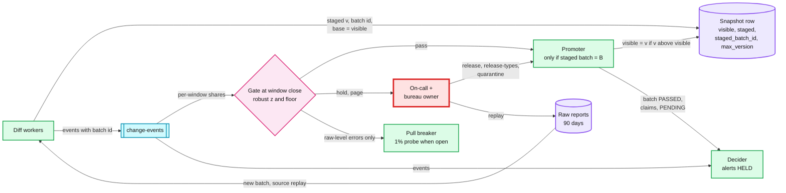
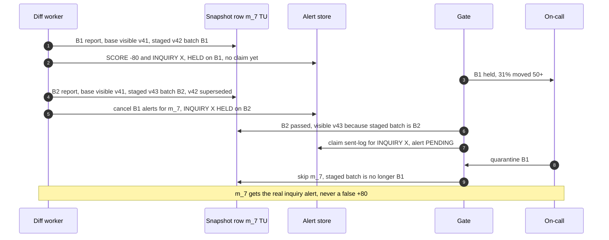

# Deep dive: the bad-batch circuit breaker

> One-line answer: judge every bureau batch (a 15-minute window of ~150k reports, or a 1 M-record file chunk) as a distribution against the same hour-of-week over the last 4 weeks, hold its **alerts and display** (never ingestion) when a metric is past a robust z-score of 6 **and** an absolute floor, and let a person release, release some types, or quarantine and replay; the hard part is not the statistics, it is the snapshot row while a batch is held: diff against the **visible** version, let a newer report supersede a pending one, promote only the version that batch wrote, and claim the dedup row only when the batch passes.

Zoom-in on [`../solution.md`](../solution.md) §5.3 (the gate), §6 Flow 4 (hold and replay), §5.5 (versions only move forward) and [D8a, D8c](../diagrams.md#d8-state-machines). Reusable blocks: [`../../../concepts/stream-processing.md`](../../../concepts/stream-processing.md) (windows, watermarks), [`../../../concepts/exactly-once.md`](../../../concepts/exactly-once.md), [`../../../concepts/mvcc-and-isolation.md`](../../../concepts/mvcc-and-isolation.md) (versions, compare-and-set). Siblings: [`change-detection-and-materiality.md`](change-detection-and-materiality.md), [`fan-out-and-herd-control.md`](fan-out-and-herd-control.md).

Acronyms: TU (TransUnion), EQ (Equifax), KV (key-value store), CAS (compare-and-set), P0 (possible-fraud lane), P1 (morning lane), MAD (median absolute deviation), DLQ (dead-letter queue).

---

## 1. The moving parts



- **The gate never stops ingestion.** Stored raw reports are what we diagnose and replay from ([solution §5.3](../solution.md#53-a-bad-bureau-batch-drops-everyones-score-by-80-points-how-do-you-stop-it-before-the-pushes-go-out)).
- **Red is the person.** The machine holds in ~1 minute. A person decides. A hold at 03:00 that nobody decides by 07:30 freezes displayed scores and morning alerts for everyone in it (§4).

## 2. What a batch is, and when it closes

| Source | Batch | Size | Closes when |
|---|---|---|---|
| Slot pulls | `(bureau, pull, 15-min window by diff time)` | ~150k reports (`165/s × 900 s`) | Wall clock past the end **and** every partition's consumer past it |
| File chunks | `(bureau, file, chunk)` | 1 M records [estimate], ~50 s at 20k/s | Chunk fully diffed |
| Catch-up pulls | `(bureau, catchup, window)` | up to +50% of slot volume | Same as pulls, own baseline |
| Replays | `(bureau, replay of B, window)` | the replayed members | Same, own baseline, `correction_of = B` |
| Triggers | rate per bureau per 5 min | ~1.5k (`~5/s × 300 s`) | Rolling; hold only above 5x and a floor ([solution §5.2](../solution.md#52-a-new-account-could-be-identity-theft-how-does-that-alert-get-out-in-under-5-minutes-while-25-m-score-alerts-wait-for-the-morning)) |

- **Cut by processing time, judge by shares.** A report pulled at 10:14:59 and diffed at 10:16 belongs to the 10:15 window. That keeps closing simple, but a 30-minute consumer stall packs three windows into one. Counts would trip the gate; shares (`members moving 50+ ÷ reports`) do not. Use shares only.
- **Label catch-up and replay traffic.** Overdue members carry two-week diffs: more big movers, twice the new accounts. Against the same hour-of-week baseline a catch-up window scores z = 34 (simulation below). So catch-up and replay batches carry their own source label and their own baseline, and every metric has its own floor, not only the score metric.
- **A stuck partition never closes a window.** "Every partition's consumer past it" means one poison report (a 10 MB file, a parser crash loop) holds every window of both bureaus, silently: it is not a hold, it is "not closed yet". The design: after 3 failed attempts the report goes to a DLQ (dead-letter queue) and the member is dropped from the batch; page if a window is not closed 10 minutes after its end.

## 3. The rule

Hold when any metric is beyond a robust z-score of 6 (median and MAD over the 28 baseline windows of the same source) **and** past that metric's own absolute floor (2% of members moving 50+ points; 3% new accounts; mean delta ±5 points; 0.5% parse errors [estimate], solution §5.3).
- **Power is never the problem.** With 150k reports a 0.5% baseline is `750 ± 27`. The bad batch (30%) scores z ≈ 1,600.
- **The floor stops false holds on real but small shifts:** a catch-up window, a lender changing its reporting day.
- **A real mass event holds anyway** (a large lender reporting 3% of members 60 days late). That is correct. A machine holds, a person releases. The release then goes through the herd controller with a measured, probably high, open rate ([`fan-out-and-herd-control.md`](fan-out-and-herd-control.md)).

## 4. What a long hold freezes

- **Per window:** ~150k members keep their previous visible version, and ~18.75k alerts (`3.6 M a day ÷ 96 windows ÷ 2 bureaus`) sit in `HELD`.
- **Six hours of holds** while pulls continue: 24 windows, **~3.6 M members per bureau** whose new data is staged but not shown, ~450k held alerts.
- **Why holds do not open the pull circuit.** The first version opened the circuit after 2 consecutive holds. Then those 3.6 M members are not pulled at all; on close, catch-up at +50% (~82 extra pulls/s) takes `3.6 M ÷ 82 ≈ 12 hours`, and each of them shows a score 7 to 8 days old meanwhile. In Flow 4 the cause was our parser, the raw reports were good, and they were what the replay needed. So the design opens the circuit **only on raw-level errors** (bureau 5xx or timeouts, schema validation failures, unparseable responses), and keeps a 1% probe (~1.65 pulls/s, judged as its own batch) while open (solution §5.3).

**Escalation ladder.** Steps 1 and 2 are the solution's; 3 to 5 go past it [decision]:
1. Hold: page the on-call and the bureau relationship owner, with the delta histogram attached.
2. A window still open 10 minutes after its end: page. That is a stuck partition, not a hold (§2).
3. Second hold on the same bureau: page the secondary. Pulls continue unless the raw responses are bad.
4. 07:30 local, no decision: held P1 alerts move to the evening window (the solution keeps them held; the effect is the same, they cannot go out). P0 items found in held reports can go out by `:release-types`, which is allowed only when the item-level metrics (new-account, inquiry, item-removed rates) are in bounds.
5. Four hours held: the app shows "Your TransUnion update is delayed" to affected members, instead of silently showing an old date.

## 5. The races while a batch is held

The first version of the design said the diff writes `staged_version` with a CAS (without naming its base), the promoter "flips `visible_version = staged_version`", the decider claims the sent-log row at decide time, and quarantine "frees their sent-log rows". Each is fine alone. Together, with a second report arriving while the first is held, they fail. The table is why the design (solution §5.3) now looks the way it does.

| # | Race | First version | Design now |
|---|---|---|---|
| R1 | A newer report arrives while v42 (batch B1) is held | The base is not specified; diffing against staged v42 (bad) gives "+80" and hides a real new inquiry already in v42 | **Diff against the visible version** and its known items, always |
| R2 | B2 (v43) passes, then B1 is decided | "visible = staged" sets whatever is staged now, possibly a version from a batch not yet judged, or moves backward | **Promote only `v` written by batch B**: `visible = v` if `staged_batch_id = B` and `v > visible`, one conditional write |
| R3 | B1's held alert claimed the inquiry's sent-log row; v43 re-detects it | v43's claim fails and is dropped; quarantining B1 then frees the row, after nothing will re-emit it: the real inquiry is never alerted | **Held alerts claim only when their batch passes**, and writing v43 supersedes v42: the member's B1 held alerts are cancelled. A cancelled batch holds no claims |
| R4 | Quarantine frees rows | An unconditional delete frees a row now owned by a trigger alert, so the next report alerts again | Delete only `where alert_id = cancelled alert` |
| R5 | `:release-types` writes a corrected version | "staged + 1" may already be taken by a newer staged report | Number from the row's `max_version` counter; a derived version; allowed only when item-level metrics passed (otherwise it keeps garbage items in `known_items_12w`) |
| R6 | A released batch is later found wrong | The correction "v + 1 with its own alert" diffed against the wrong v42 is "+80" for everyone | Replay batches carry `correction_of = B1`; events are computed against the last good version; only members alerted from B1 get a `CORRECTION` alert, the rest are fixed silently |



**Schema it took:** `SNAPSHOT.max_version` and `staged_batch_id`, `BATCH.source` and `correction_of`, the `CORRECTION` alert kind (solution §3.3), and `Held --> Suppressed: superseded` in [D8b](../diagrams.md#d8b-alert), with the version lifecycle in [D8c](../diagrams.md#d8c-one-snapshot-version).

## 6. Simulation

Part 1 draws 28 baseline windows of 150k reports and judges four test windows with and without floors. Part 2 replays the R1 to R3 interleaving for one member under the first version's rules and under the design's.

```python
# Part 1: the batch gate. Part 2: a held staged version superseded by a newer report.
import random, statistics
random.seed(3)
N = 150_000                                         # reports in one 15-minute window

def window(big=0.005, new_acct=0.010):              # counts, normal approximation
    draw = lambda p: max(0.0, random.gauss(N * p, (N * p * (1 - p)) ** 0.5)) / N
    return {"moved 50+": draw(big), "new account": draw(new_acct)}

base = [window() for _ in range(28)]                # same hour-of-week, last 4 weeks
FLOOR = {"moved 50+": 0.02, "new account": 0.03}

def verdict(w, use_floor):
    out = []
    for k, x in w.items():
        xs = [b[k] for b in base]
        med = statistics.median(xs)
        mad = statistics.median(abs(v - med) for v in xs) * 1.4826
        z = (x - med) / mad
        if z > 6 and (not use_floor or x > FLOOR[k]): out.append(f"{k} {x:.1%} z={z:.0f}")
    return "HOLD: " + ", ".join(out) if out else "pass"

tests = {"normal window": window(), "bad batch, 30% drop 50+": window(big=0.30),
         "lender reports portfolio late": window(big=0.03),
         "catch-up window, 2-week diffs": window(big=0.011, new_acct=0.02)}
for name, w in tests.items():
    print(f"{name:<32} z only: {verdict(w, False):<40} z + floor: {verdict(w, True)}")

# Part 2. v41 visible: 712, items {A, B}. Batch B1 (bad parser): 632 and a real new
# inquiry X, held. A newer report (B2, correct: 712, {A, B, X}) arrives and passes first.
def play(policy):
    v1 = policy == "first version"
    row = {"visible": (41, 712, {"A", "B"}), "staged": None}
    sent_log, held, out = {}, [], []
    def diff(ver, batch, score, items):
        old_v, old_s, old_i = row["staged"][1:] if v1 and row["staged"] else row["visible"]
        if not v1 and row["staged"]:                # design: newer report supersedes
            held[:] = [a for a in held if a[0] != row["staged"][0]]
        row["staged"] = (batch, ver, score, items)
        ev = [("SCORE", score - old_s, f"score:{old_v}->{ver}")] if abs(score - old_s) >= 10 else []
        ev += [("INQUIRY", x, f"inq:{x}") for x in items - old_i]
        for typ, what, key in ev:
            if key in sent_log: continue            # claimed already: a reason, not an alert
            if v1: sent_log[key] = batch            # first version claims at decide time
            held.append((batch, f"{typ} {what:+}" if typ == "SCORE" else f"{typ} {what}", key))
    def passed(batch):
        st = row["staged"]
        if not v1 and (st[0] != batch or st[1] <= row["visible"][0]): return
        row["visible"] = st[1:]                     # first version: visible = staged
        for a in [a for a in held if a[0] == batch]:
            held.remove(a)
            if not v1 and a[2] in sent_log: continue
            sent_log[a[2]] = batch; out.append(a[1])    # design claims at pass time
    def quarantine(batch):                          # first version frees claims blindly
        for a in [a for a in held if a[0] == batch]: held.remove(a); sent_log.pop(a[2], None)
    diff(42, "B1", 632, {"A", "B", "X"})            # held at window close
    diff(43, "B2", 712, {"A", "B", "X"})            # newer report, correct
    passed("B2"); quarantine("B1")
    return out, row["visible"][:2]

for p in ("first version", "design"):
    alerts, vis = play(p)
    print(f"{p:<14} alerts sent: {alerts or 'none'}, visible version {vis[0]} score {vis[1]}")
```

Output (`python3 gate.py`):

```text
normal window                    z only: pass                                     z + floor: pass
bad batch, 30% drop 50+          z only: HOLD: moved 50+ 30.1% z=1635             z + floor: HOLD: moved 50+ 30.1% z=1635
lender reports portfolio late    z only: HOLD: moved 50+ 3.0% z=138               z + floor: HOLD: moved 50+ 3.0% z=138
catch-up window, 2-week diffs    z only: HOLD: moved 50+ 1.1% z=34, new account 2.0% z=34 z + floor: pass
first version  alerts sent: ['SCORE +80'], visible version 43 score 712
design         alerts sent: ['INQUIRY X'], visible version 43 score 712
```

**Reading the output.**
- **The floor is what separates a catch-up window from a bad batch.** Without it, two-week diffs score z = 34 against the slot pulls' baseline and hold every catch-up window after an outage, the worst moment to hold. The design also gives catch-up its own baseline; the floor is the second guard.
- **The portfolio event holds with or without floors.** That is by design: 3% of a window moving 50+ is something a person should look at before 3% of members get a push.
- **Under the first version's rules the member gets a false "+80" and never hears about the real inquiry X.** Under the design's, they get exactly one alert, for X. Both end with v43 visible at 712, so the display looks right either way; only the alerts reveal the bug, which is why it would survive testing.

## 7. What an interviewer pushes on

1. **"Why not check each record?"** Every bad record is plausible: a 60-day late payment really does cost ~80 points. Only the share is impossible. Per-record checks catch parse errors, which we also use, as a gate metric.
2. **"Why not auto-drop anomalous batches?"** Real mass events happen. A machine holds, a person releases. Auto-drop would silently suppress a real lender's portfolio event, which members need to dispute.
3. **"Who decides at 3 AM, and what if nobody does?"** The on-call, paged at window close. Undecided by 07:30, the alerts stay held and roll to the evening; display stays on the old version; after 4 hours members see a "delayed" note. Holding is the safe default.
4. **"A newer report arrives while the old one is held. Which do you diff against?"** The visible version, always. The newer report supersedes the held one for that member; the held batch's verdict no longer applies to them.
5. **"How do you correct a batch you already released?"** Never by moving `visible` back (it would break `min_version` for anyone who tapped). A replay batch marked `correction_of`, diffed against the last good version, with a `CORRECTION` alert only to members who were told the wrong thing.
6. **"Should the gate stop pulls?"** Only when the raw responses are bad. If our parser is wrong, the raw reports are exactly what the replay needs.

## 8. Trade-offs

| Decision | Option A | Option B | Chose | Why |
|---|---|---|---|---|
| What a hold stops | Ingestion | Display and alerts | Display and alerts | Replay needs the raw reports; holding display costs ~17 minutes when nothing is wrong |
| Rule | Robust z alone | z **and** a floor per metric | Both | z alone holds every catch-up window (z = 34) |
| Batch cut | Pull time | Diff (processing) time, judged on shares | Processing time | Windows close on a clock; shares survive a stall |
| Diff base | Latest staged | Visible | Visible | A held, possibly bad version never becomes anyone's base |
| Pending versions per row | Many | One, newest supersedes | One | One staged slot plus `staged_batch_id` is all the promoter needs |
| Sent-log claim for held alerts | At decide | At pass | At pass | A cancelled batch never holds a claim that blocks a real change |
| Pull breaker | Open after 2 holds (first version) | Open on raw-level errors only, 1% probe | Raw-level only | A parser bug is not a bureau bug; 6 hours open costs ~12 hours of catch-up |
| **Refused** | Auto-release after a timeout, auto-drop, per-member anomaly models at launch, rolling `visible` back | | | Each either scares people or hides real events |

## 9. Numbers to say out loud

- One window: ~150k reports per bureau, ~18.75k alerts, `750 ± 27` big movers at a 0.5% baseline.
- Hold rule: robust z over 6 and a floor (2% moving 50+, 3% new accounts).
- Visibility lag when nothing is wrong: at most ~17 minutes (15-minute window, ~1 minute of checks, ~1 minute of promotion at ~2.5k writes/s).
- Six hours of holds: ~3.6 M members per bureau frozen; with the pull circuit open, ~12 hours of catch-up at +50%.
