# Deep dive: bureau ingestion and refresh scheduling

> One-line answer: give every member a fixed second of the week, `slot = hash(member_id) mod 604,800`, so ~165 members are due every second per bureau forever; pull both bureaus in that second through a per-bureau token bucket at the contracted rate, store the raw report before announcing it, and heal outages as a **rate** (+50% catch-up, oldest first) rather than a new schedule, so a 6-hour outage costs 12 hours of +50% once instead of a weekly spike forever; take bureau monitoring triggers as signed, durable, deduped webhooks, and if a bureau insists on batch files, turn the file into a stream at a rate we choose.

Zoom-in on [`../solution.md`](../solution.md) §4.1 (refresh), §2 (the arithmetic), §5.6 (failures) and §10.2 (knobs). Reusable blocks: [`../../../concepts/rate-limiting-and-load-shedding.md`](../../../concepts/rate-limiting-and-load-shedding.md) (token buckets, breakers), [`../../../concepts/sharding.md`](../../../concepts/sharding.md) (hash placement), [`../../../concepts/stream-processing.md`](../../../concepts/stream-processing.md). Related problems: [`../../distributed-job-scheduler/`](../../distributed-job-scheduler/) (timer tables), [`../../streaming-ingestion/`](../../streaming-ingestion/), [`../../bank-feed-aggregation/`](../../bank-feed-aggregation/) (pulling from third parties at a contracted rate). Siblings: [`change-detection-and-materiality.md`](change-detection-and-materiality.md), [`bad-batch-circuit-breaker.md`](bad-batch-circuit-breaker.md).

Acronyms: TU (TransUnion), EQ (Equifax), mTLS (mutual Transport Layer Security), FCRA (Fair Credit Reporting Act), KV (key-value store), P0 (possible-fraud lane), SLO (service level objective).

---

## 1. Three ways bureau data can arrive

| Mode | Who picks the time | Load shape | Blast radius of a bad response | We use it for |
|---|---|---|---|---|
| Per-member pull (soft inquiry over an API) | Us | Flat, ~165/s per bureau | One member | The weekly refresh |
| Monitoring trigger (bureau pushes "new inquiry", "new account") | The bureau, as events happen | ~5/s, bursts of ~50/s [estimate] | One member | P0, between refreshes |
| Batch file | The bureau's schedule | 100 M records at 2 AM | Every member in the file | Fallback if a bureau only offers files |

- **What is public.** Credit Karma monitors Equifax and TransUnion reports "on a regular basis" ([credit monitoring](https://www.creditkarma.com/credit-monitoring)); the cadence and the integration (pulls, triggers or files) are not published. Weekly pulls plus triggers is the README's design assumption, marked [estimate]. The downstream must work with any of the three.
- **FCRA.** Every pull needs a permissible purpose; ours is the consumer's own request, "in accordance with the written instructions of the consumer to whom it relates" ([15 U.S.C. 1681b(a)(2)](https://www.law.cornell.edu/uscode/text/15/1681b)). So a pull is legal only while that consent stands, which is why the pull worker, not just the scheduler, checks it (§3).

```mermaid
%% Ingest zoom-in. Slots and catch-up feed one pull pool per bureau. Red is the per-bureau contracted rate: it bounds catch-up speed and is the reason file mode exists.
flowchart LR
    IDX[(Slot index<br/>member ids by minute,<br/>~800 MB)] -->|"due this second, ~165"| SCH[Refresh scheduler]
    CQ[(Catch-up queue<br/>overdue, oldest first)] -->|"+50% of steady"| SCH
    SCH -->|"task member, bureau, week"| PW[Pull workers<br/>one pool per bureau]
    PW -->|"take a token"| TB["Per-bureau token bucket<br/>contracted rate"]
    TB -->|"soft pull, mTLS, consent ref"| BU[TransUnion, Equifax]
    BU -->|"report ~30 KB, ~1 s"| PW
    PW -->|"encrypted raw first"| OBJ[(Object storage<br/>raw, 90 days)]
    PW -->|"then pointer, key member"| K[[Kafka reports]]
    BU -->|"signed trigger"| TR[Trigger receiver]
    TR -->|"acks=all, then 200"| KT[[Kafka triggers]]
    BU -.->|"batch file"| FR[File replayer<br/>~20k records/s]
    FR -->|"pointers, per chunk"| K
    BR[Pull breaker<br/>raw-level errors] -->|"open: 1% probe only"| PW

    class SCH,PW,TR,FR,BR service
    class IDX,CQ,OBJ store
    class K,KT queue
    class BU external
    class TB critical

    classDef service  fill:#dcfce7,stroke:#16a34a,stroke-width:2px,color:#111
    classDef store    fill:#ede9fe,stroke:#7c3aed,stroke-width:2px,color:#111
    classDef queue    fill:#cffafe,stroke:#0891b2,stroke-width:2px,color:#111
    classDef critical fill:#fee2e2,stroke:#dc2626,stroke-width:4px,color:#111
    classDef external fill:#e5e7eb,stroke:#6b7280,stroke-width:2px,color:#111,stroke-dasharray:4 3
```



## 2. The slot

- **The formula.** `slot = hash(member_id) mod 604,800`, the member's second of the week (UTC, so daylight saving time never moves it). `100 M ÷ 604,800 ≈ 165` members a second, `~9,900` a minute (standard deviation ~100, ±1%), `~595k` an hour (±0.1%). With slots the average is the peak.
- **Why not one cron.** 200 M pulls in a 4-hour window is `200 M ÷ 14,400 ≈ 13.9k/s`, 42x the steady rate, every week, on the bureau's API, our KV and the alert volume at once.
- **Why not "7 days after the last pull".** It stays spread only if it starts spread. Any disturbance (an outage, a marketing week that adds 5 M members) is copied into next week's schedule and never decays. The simulation below shows it: the catch-up bump repeats every week.
- **Both bureaus in the same second.** One member's TU and EQ reports arrive together, and because releases are spread by `hash(salt, member)`, their alerts land in the same release minute and go out as one push ([`fan-out-and-herd-control.md`](fan-out-and-herd-control.md) §5). The salt keeps the release minute independent of this slot.
- **The slot index** is stored by minute bucket: 10,080 rows of ~9,900 ids, ~800 MB at 8 B per id. A signup adds one id, a closure removes one.
- **New members** get an immediate pull at signup (they want their score now), then their first slot at least 7 days later, the same rule the solution uses for the migration (§8): nobody pulled twice in a week, nobody waits more than 13 days once.

## 3. The pull worker

1. Take the task `(member, bureau, slot week)`. If `last_pull_task` on the snapshot row already equals it, the report exists: re-announce it, do not pull.
2. Check consent. A member who closed their account or withdrew consent since the task was created is skipped. Removing them from the slot index the same day (solution §5.7) is not enough; tasks already emitted and catch-up entries are in flight.
3. Take a token from that bureau's bucket. **One pool per bureau** (a bulkhead): a slow Equifax must not starve TransUnion pulls.
4. Call with a timeout (5 s [estimate]; normal ~1 s). By Little's law, ~165/s at 1 s is ~165 calls in flight per bureau. If the bureau slows to 20 s, the same rate needs 3,300 in flight. Cap concurrency per bureau (~500 [estimate]) and let the queue grow; the catch-up heals it later. Never raise the cap to chase a slow dependency.
5. Write the encrypted raw report to object storage, **then** produce the pointer to `reports` with `acks=all`, **then** record `last_pull_task`. Raw before pointer means no consumer ever reads a missing object.
- **The residual double pull.** A crash after the bureau answered but before the object write leaves nothing to find; the retry pulls (and pays) again. Bounded by the crash rate, and harmless to the member: a soft inquiry does not affect the score.

| Component | Per unit | Load | Headroom |
|---|---|---|---|
| Pull pool, per bureau | ~50 calls in flight per pod at ~1 s [estimate] | 165/s steady, ~250/s with catch-up | 8 pods = ~400/s, N+1 |
| Object storage writes | ~30 KB report | 330/s, ~10 MB/s | Trivial |
| Kafka `reports` | ~300 B pointer | 330/s steady, 20k/s in file mode | Trivial |
| Slot index reads | one minute bucket, ~79 KB | 1 read a minute | Trivial |
| **Bureau contract** | not public | 165/s, 250/s in catch-up | **The limit that sets how fast we heal** |

## 4. Outages and catch-up

- **Catch-up is a rate.** Overdue tasks queue oldest first and drain at +50% of steady on top of the live slots. An outage of `T` hours heals in `T ÷ 0.5 = 2T` hours. The 99.9% availability target allows ~43 minutes a month, healed in ~86 minutes.
- **The slots never move.** Next week every member is back on their own second. That is the whole difference from "7 days after the last pull".
- **The pull breaker opens on raw-level failures only**: bureau 5xx or timeouts over 5% for 10 minutes, schema validation failures, unparseable responses. Not on a gate hold of a plausible-looking distribution: if our parser is the bug, the raw reports are exactly what the replay needs ([`bad-batch-circuit-breaker.md`](bad-batch-circuit-breaker.md) §4). The first version opened it after 2 consecutive holds; six hours open would have left ~3.6 M members per bureau overdue and ~12 hours of catch-up.
- **Half-open is a 1% probe**, ~1.65 pulls/s per bureau, judged as its own batch. Two clean probe batches close the breaker.
- **The freshness SLO** (99.9% of members refreshed within 8 days, solution §8) is the dashboard number that says whether catch-up is keeping up.

## 5. Monitoring triggers

- **Durable, then acknowledged.** Verify the signature (and mTLS), write to `triggers` with `acks=all`, then answer 200. The bureau retries until it gets one; `(bureau, trigger_id)` dedups the retries.
- **Replay protection.** A signed trigger replayed a month later passes a signature check and a 7-day dedup table. So the signed payload carries a timestamp, rejected if older than ~5 minutes [estimate], and the durable dedup is the exact per-bureau `change_id` in the sent-log (solution §10.5; [`change-detection-and-materiality.md`](change-detection-and-materiality.md) §4).
- **A silent feed is the real failure.** A trigger endpoint that is down shows up as bureau retries and errors. A feed that simply stops sending shows nothing. Page if triggers per bureau per hour fall under 20% of the same hour last week for 2 hours [estimate].
- **Write what you alerted.** The trigger path records its `bureau_item_key` in `trigger_items` on the member's snapshot row, so the next weekly report knows the inquiry was already alerted without matching names.
- **If the "feed" is a daily file** (nothing public says which), ~430k triggers arrive at once (`3 M a week ÷ 7`). P0 takes the read-path budget first and has its own cap of ~500/s [estimate], so the file drains in `430k ÷ 500 ≈ 14 minutes` and its promise is "15 minutes from receipt" (solution §5.2).
- **Region.** A trigger that lands in the non-home region is forwarded once to the home region's `triggers` topic (diagrams D9).

## 6. File mode

- **Turn the file into a stream.** The replayer splits it into 1 M-record chunks [estimate] and produces pointers at ~20k records/s, bounded by the snapshot KV's spare write capacity (the same KV serves the app): 100 M records in ~83 minutes, ~40k KV operations a second.
- **Backpressure on the KV, not a fixed rate.** Feed rate `= min(20k/s, rate that keeps KV p99 under its SLO)`. A file is never a reason for the app to slow down.
- **Each chunk is a gate batch,** so one bad chunk holds 1 M members, not 100 M.
- **Integrity before ingest.** Check the trailer's record count and checksum. A truncated file (61 M of 100 M) is not "39 M members with no change"; it is a held file.
- **Checkpoint per chunk.** A replayer crash resumes at the last completed chunk; duplicate pointers are harmless (`last_report_id` and the version CAS).

## 7. Simulation

Scaled 1:500 (200k members, 1-minute buckets, 4 weeks). A 6-hour bureau outage in week 2. Pull budget: steady rate plus 50%. Compare the fixed hashed slot with "next pull 7 days after the last one".

```python
# Refresh scheduling: fixed hashed slot + catch-up vs "7 days after the last pull".
# Scaled 1:500: 200k members, 1-minute buckets, a 6-hour bureau outage in week 2.
import heapq, random, statistics
random.seed(7)
N, WEEK, WEEKS = 200_000, 7 * 24 * 60, 4
OUT_START, OUT_END = WEEK + 2_000, WEEK + 2_000 + 360   # 6 h outage in week 2
mean = N / WEEK                                   # ~19.8 members a minute (~165/s at 100 M)
CAP = 1.5 * mean                                  # pull budget: steady rate + 50% catch-up

members = random.sample(range(10**9), N)
slot = {m: (m * 2654435761 % 2**32) % WEEK for m in members}   # multiplicative hash
hours = [0] * (WEEK // 60)
for s in slot.values(): hours[s // 60] += 1
print(f"members per hour of the week: mean {N / len(hours):.0f}, "
      f"sd {statistics.pstdev(hours):.0f}, min {min(hours)}, max {max(hours)}")

def simulate(policy):
    due = [(slot[m], m) for m in members]
    heapq.heapify(due)
    last, per_hour, gaps = {}, [0] * (WEEKS * WEEK // 60), []
    for t in range(WEEKS * WEEK):
        if OUT_START <= t < OUT_END:              # bureau down: nothing pulled
            continue
        n = 0
        while due and due[0][0] <= t and n < CAP:
            d, m = heapq.heappop(due)             # oldest due first
            if m in last: gaps.append(t - last[m])
            last[m] = t; n += 1
            nxt = d + WEEK if policy == "slot" else t + WEEK
            while nxt <= t: nxt += WEEK           # slot: same second next week
            heapq.heappush(due, (nxt, m))
        per_hour[t // 60] += n
    return per_hour, gaps

hmean = N / (WEEK / 60)
for policy in ("slot", "last+7d"):
    ph, gaps = simulate(policy)
    late = sum(1 for g in gaps if g > 8 * 1440)
    print(f"\n{policy}: worst gap {max(gaps) / 1440:.2f} days, pulls more than 8 days apart: {late}")
    for w in range(WEEKS):
        wk = ph[w * 168:(w + 1) * 168]
        hot = sum(1 for x in wk if x > 1.2 * hmean)
        print(f"  week {w + 1}: busiest hour {max(wk) / hmean:.2f}x mean, hours above 1.2x: {hot}")
```

Output (`python3 slots.py`):

```text
members per hour of the week: mean 1190, sd 33, min 1110, max 1292

slot: worst gap 7.25 days, pulls more than 8 days apart: 0
  week 1: busiest hour 1.09x mean, hours above 1.2x: 0
  week 2: busiest hour 1.51x mean, hours above 1.2x: 11
  week 3: busiest hour 1.09x mean, hours above 1.2x: 0
  week 4: busiest hour 1.09x mean, hours above 1.2x: 0

last+7d: worst gap 7.25 days, pulls more than 8 days apart: 0
  week 1: busiest hour 1.09x mean, hours above 1.2x: 0
  week 2: busiest hour 1.51x mean, hours above 1.2x: 11
  week 3: busiest hour 1.51x mean, hours above 1.2x: 11
  week 4: busiest hour 1.51x mean, hours above 1.2x: 11
```

**Reading the output.**
- **Uniform by construction.** Per hour of the week, the spread is ±3% at this scale (Poisson noise on 1,190 members). At 100 M members the same hour holds ~595k with a standard deviation under 0.2%.
- **The outage costs the same in week 2 for both policies:** 11 hours above 1.2x, peak 1.51x (the +50% cap), worst gap 7.25 days, nobody past the 8-day freshness line.
- **Only the slot heals.** From week 3 the slot policy is back to flat; "7 days after the last pull" carries the 11-hour bump forever, and every later outage adds another.

## 8. What an interviewer pushes on

1. **"The bureau delivers 100 M reports at 2 AM. What happens?"** Then we are in file mode: the replayer feeds ~20k/s, the gate judges 1 M-record chunks, and the delivery scheduler does the pacing that matters. The slots are an optimization; the scheduler is the guarantee.
2. **"Why not refresh on login?"** It ties the bureau bill and the API rate to app traffic, and the members who never open the app never get alerts, which defeats monitoring.
3. **"The bureau is slow, not down."** Per-bureau pool, per-bureau concurrency cap, 5 s timeout. The queue grows; catch-up heals it. TU never waits for EQ.
4. **"A member closes their account at 02:13:06; their slot is 02:13:07."** The pull worker checks consent at call time. The slot index removal is housekeeping, not the control.
5. **"How do you know the trigger feed is working?"** Errors tell you it is broken loudly. Silence needs its own alarm: triggers per hour against last week.
6. **"Daily refresh instead of weekly?"** Seconds of the day instead of seconds of the week: 7x pulls (~2.3k/s), 7x the bureau bill. Nothing downstream changes. Cost, not design, is the obstacle (solution §10.11).

## 9. Trade-offs

| Decision | Option A | Option B | Chose | Why |
|---|---|---|---|---|
| Schedule | One weekly cron | Hashed fixed slot | Slot | 13.9k/s vs a flat 165/s per bureau |
| Recovery | Re-schedule to "7 days after last" | Catch-up as a rate, slots fixed | Rate | A 6-hour outage costs 12 hours once, not every week |
| Isolation | One pull pool | One pool per bureau | Per bureau | A slow bureau must not starve the other |
| Breaker trigger | Gate holds | Raw-level errors | Raw-level | A parser bug is ours; the raw data is still good and needed |
| Trigger dedup | 7-day `(bureau, trigger_id)` table | Plus signed timestamp and durable `change_id` | Both | A replayed trigger after 7 days would alert again |
| File mode | Ingest as fast as possible | Replayer at a KV-bounded rate | Bounded | The KV also serves the app |
| **Refused** | Pull on login, daily refresh at launch, Flink for scheduling | | | Cost or coupling with no requirement behind it |

## 10. Numbers to say out loud

- `100 M ÷ 604,800 ≈ 165` members a second, per bureau; ~330/s for both.
- Naive cron: `200 M ÷ 14,400 s ≈ 13.9k/s`, 42x.
- Catch-up +50%: an outage of `T` heals in `2T`; 43 minutes heals in 86.
- File mode: ~20k records/s, 100 M in ~83 minutes, ~40k KV operations a second.
- Triggers ~5/s (~3 M a week [estimate]); a daily trigger file would be ~430k at once, ~14 minutes at the ~500/s P0 cap.
