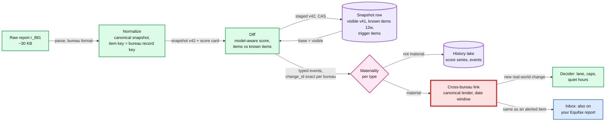

# Deep dive: change detection and materiality

> One-line answer: one pure function, `diff(visible snapshot, new report) → (staged snapshot, typed events)`, run per report as it arrives, with three guards (a model-aware score diff, a 12-week known-items memory so a blinking tradeline is never "new", deterministic ids so retries and replays dedup), then a per-type materiality table; the identity of a change must be **exact per bureau** (the bureau's own record key) for idempotency, and cross-bureau "same account" must be a separate, fuzzy **link** used only to merge the presentation, because creditor names, dates and coverage differ between TransUnion and Equifax.

Zoom-in on [`../solution.md`](../solution.md) §3.2 (the `ChangeEvent` contract), §4.2 (the diff), §4.3 (materiality) and §5.3 (staged and visible versions). Reusable blocks: [`../../../concepts/exactly-once.md`](../../../concepts/exactly-once.md) (deterministic ids), [`../../../concepts/mvcc-and-isolation.md`](../../../concepts/mvcc-and-isolation.md) (versions and compare-and-set), [`../../../concepts/columnar-db.md`](../../../concepts/columnar-db.md) (the history lake). Siblings: [`bad-batch-circuit-breaker.md`](bad-batch-circuit-breaker.md), [`preferences-dedup-and-delivery.md`](preferences-dedup-and-delivery.md).

Acronyms: TU (TransUnion), EQ (Equifax), KV (key-value store), CAS (compare-and-set), P0 (possible-fraud lane), P1 (morning lane), FCRA (Fair Credit Reporting Act).

---

## 1. The path of one report



## 2. The snapshot and its versions

- **One row per (member, bureau)** in the KV, ~8 KB per version normalized [estimate], 3 versions kept, so ~24 KB a row and ~4.8 TB in all (~14 TB with 3 replicas): score `{model, value}`, tradelines, inquiries, collections, public records, personal info, plus the precomputed **score card** (score, delta, top 3 reasons) so the read path computes nothing.
- **Pointers:** `visible_version` (what the app shows and alerts may cite), `staged_version` with `staged_batch_id` (diffed, not yet judged by the gate), and `max_version` (a counter, so a corrected or replayed version never reuses a number).
- **Memories:** `known_items_12w`, every item key seen in the last 12 weeks (~60 keys × ~24 B ≈ 1.5 KB [estimate]); `trigger_items`, the bureau record keys already alerted by a monitoring trigger.
- **The diff base is the visible version, never the staged one.** A staged version may belong to a held, possibly bad batch. If the next report diffed against it, a batch that wrongly dropped a score by 80 would make the following correct report look like "+80" ([`bad-batch-circuit-breaker.md`](bad-batch-circuit-breaker.md) §5, R1). The first version never named its base; the design (solution §5.3) makes visible the only base.
- **Write with a CAS** on `(visible_version, staged_version)` as read. A duplicate delivery after a Kafka rebalance loses the CAS, re-reads, finds `last_report_id = r_881`, and re-emits the same events (same ids).

## 3. The diff, guard by guard

| Guard | What goes wrong without it | Number |
|---|---|---|
| Model-aware score diff | VantageScore 3.0 to 4.0 for one member looks like a 30-point move | A model rollout is every member of a bureau: a false alert for anyone over threshold |
| 12-week known-items memory | A tradeline missing from one report and back the next is a "new account", a P0 fraud alert | 0.5% of reports blinking [estimate] × 200 M a week = **~1 M false fraud alerts a week** |
| Deterministic `change_id` | A retry or replay emits a new id and the sent-log cannot dedup it | Every rebalance, every replay |
| Per-period delinquency key | A second 30-day late on the same account in a later month is "already seen" | `period = reporting month` in the key |
| Utilization hysteresis [decision] | A card hovering at 30% crosses the band every week | Up at 32%, down at 28%, so one crossing per real move |

- **Removed items** produce `ACCOUNT_CLOSED` or item-removed events: inbox and digest only, never a push. A tradeline that disappears is far more often a reporting gap than news.
- **Personal info** (`PERSONAL_INFO_CHANGED`) compares normalized address and name; a new address the member already gave us in the app is not material.

## 4. Change identity: why it is exact per bureau

The first version of the design used two keys: a per-bureau `change_id` for idempotency, and a cross-bureau `dedup_key = hash(member, type, creditor, open_month, last4)` for accounts and `hash(member, NEW_HARD_INQUIRY, creditor, month)` for inquiries, checked in the sent-log so that "when Equifax reports the same inquiry, its insert finds the row and is dropped". The design ([solution §3.2](../solution.md#32-api), §4.3 step 4) dropped the cross-bureau key, for the reasons below.

That key assumed the two bureaus describe one real-world event the same way. They do not:
- **Coverage and timing differ.** Credit Karma's own page: "Some lenders may only report to one or two credit bureaus" and "Lenders may report updates to the credit bureaus at different times" ([Credit Karma](https://www.creditkarma.com/credit-scores)). An inquiry exists only at the bureaus the lender pulled, on the day it pulled each.
- **Names differ.** Each bureau records the creditor or inquirer under its own subscriber name ("CAPITAL ONE" on one, a bank's legal entity name on the other). How often is not published [estimate: the simulation assumes 60% of lenders differ].
- **Account digits differ.** Each bureau masks account numbers its own way, so `last4` is not a shared field [unverified per bureau].

Three failures followed:
1. **Double alert.** Names differ, the keys differ, the member gets two possible-fraud pushes for one application.
2. **Month boundary.** Pulled at TU on Oct 31 and at EQ on Nov 1: two months, two keys, two pushes.
3. **Wrong merge, the dangerous one.** `month` is the only date in the inquiry key, so two real inquiries from the same lender in one month share a key. The member applies for a card on Oct 3; a fraudster applies at the same bank on Oct 20. The fraud inquiry's insert "finds the row and is dropped". The alert built to catch identity theft is suppressed by its own dedup.

**The design: two identities with two jobs.**
- **`change_id`, exact, per bureau.** One definition everywhere (solution §3.2): items `hash(member, bureau, type, bureau_item_key, period)`, where `bureau_item_key` is the bureau's own record identifier if the response carries one, else `(subscriber code, inquiry date)` for an inquiry and `(subscriber code, account as reported, open date)` for an account, and `period` is the reporting month for delinquencies (so a second 30-day late is a new change) and empty otherwise; score changes `hash(member, bureau, model, from_version, to_version)`. A P0 alert is one per change: `alert_id = hash(member, P0, change_id)`. The item id never merges two different records and never splits one. The sent-log dedups on it, with rows that live as long as the retention policy, so a retry, a replay, or a bureau re-sending an old trigger is dropped forever (the receiver's 7-day `(bureau, trigger_id)` table becomes a fast path, not the guarantee).
- **`link`, fuzzy, presentation only.** Before pushing a P0 change, look in the member's `P0_INDEX` (their P0 items of the last 30 days) for an item from the **other** bureau with the same canonical lender (an alias table maps subscriber names to a lender id), a date within ±3 days for an inquiry, or an open date within ±31 days plus the same account type for an account. One-to-one: an item links at most once. A match updates the existing inbox entry ("also on your Equifax report") and sends no push.
- **The index write is a CAS on one member row.** The trigger pool (`triggers` topic) and the report pool (`change-events`) are different consumers, so per-partition ordering does not serialize them. Without the CAS both could miss each other's item and both push.
- **Trigger to report, same bureau.** The trigger path writes its `bureau_item_key` into `trigger_items`. The report's diff then recognizes the inquiry as already alerted by key, not by hoping the trigger payload and the report spell the lender the same way (the first version's Flow 2 relied on that).
- **Bias: when unsure, alert twice.** A second honest push ("a new inquiry on your Equifax report") costs one notification. A wrong merge costs a missed identity theft.

**What is lost.** "At most one alert per (member, change)" is now exact per bureau record and best-effort across bureaus: in the simulation ~2% of applications still push twice (alias misses). The atomic one-key insert becomes a read-check-CAS on a member row. Someone owns the alias table (new lenders appear every week; unknown names fall back to the raw name, which errs to a double alert). A few wrong merges remain, from two applications to one lender within 3 days. The README's correctness row now reads "at most one alert per (member, bureau record)", with the cross-bureau link for display only.

## 5. Materiality, and where it is wrong on purpose

The per-type table is in [solution §4.3](../solution.md#43-decide-and-alert-only-material-changes-once-at-a-decent-hour). Four notes on it:
- **10 points is a product choice, not a law of nature** [estimate]. The member can change it. A per-member threshold learned from opens is a later seam (solution §12), never a launch dependency.
- **Score up is material too.** A +40 after paying down a card is the alert members like most. Same threshold, same lane.
- **Coalesce per member, not per bureau.** A P1 alert is still per `(member, bureau, version)`, so a member's TU and EQ reports from the same second are two alerts. The design spreads releases by `hash(salt, member)`, so both land in the same minute, and the scheduler coalesces them into one push that names both bureaus (solution §5.1). The first version spread by `hash(alert_id)`, so under the 1-push-a-day cap the second bureau's change became inbox-only by race.
- **A new change type needs a silent baseline.** Adding, say, buy-now-pay-later tradelines would make every member's existing such items "new" on the next diff. The first diff after a type ships populates `known_items_12w` with `alertable = false` and emits nothing.

## 6. Versions, replays and corrections

- **Versions only move forward**, allocated from `max_version`. A quarantined version number is never reused, so a replay of the same raw report produces a new version and the same item `change_id`s (the item key does not depend on the version).
- **Score change ids do depend on versions** (`from_version`, `to_version`). After a quarantine, the replay's score change gets new ids and can alert; that is correct, because the quarantined alert never went out.
- **A correction after a released bad batch is its own type.** Diffing the fixed report against the wrong visible v42 would emit "+80" for everyone. The replay batch carries `correction_of = B1`, computes events against the last good version, and sends a `CORRECTION` alert only to members the sent-log says were alerted from B1.
- **Schema.** `ChangeEvent` is versioned in a schema registry; consumers ignore unknown fields; a new type is a new row in the materiality table plus a schema version (solution §10.11).

## 7. Simulation

Synthetic month: 20,000 members, 400 lenders, 17,203 real applications. Each application hits TU only, EQ only, or both (35%); 60% of lenders are named differently on EQ; 20% of EQ pulls land a day later; 8% of applications are followed by a second one to the same lender 3 to 20 days later (the identity-theft pattern). Records arrive in random order. "never pushed" counts real applications that never got a push of their own.

```python
# Change identity for NEW_HARD_INQUIRY across TransUnion (TU) and Equifax (EQ).
# Truth: real applications. Each lender pulls one or both bureaus; names differ by bureau.
import random
random.seed(11)
LENDERS = [f"L{i}" for i in range(400)]
NAME = {(l, b): (l if b == "TU" or random.random() < 0.4 else l + " BANK NA")
        for l in LENDERS for b in ("TU", "EQ")}           # 60% of lenders named differently on EQ
ALIAS = {NAME[(l, b)]: l for l in LENDERS for b in ("TU", "EQ") if random.random() < 0.9}

apps, recs = [], []                                     # truth, then bureau records
for m in range(20_000):
    for _ in range(random.choice([0, 0, 1, 1, 2])):
        l, day = random.choice(LENDERS), random.randint(1, 60)
        apps.append((m, l, day, False))
        if random.random() < 0.08:                      # second app, same lender, days later
            apps.append((m, l, min(60, day + random.randint(3, 20)), True))
for a, (m, l, day, _) in enumerate(apps):
    r = random.random()
    for b in (("TU", "EQ") if r < 0.35 else ("TU",) if r < 0.65 else ("EQ",)):
        d = day + (1 if b == "EQ" and random.random() < 0.2 else 0)   # pulled a day later
        recs.append(dict(app=a, m=m, b=b, name=NAME[(l, b)], day=d, rid=f"{b}-{a}"))
random.shuffle(recs)

def month(d): return (d - 1) // 30

def month_key(r):            # first version: hash(member, type, creditor, month)
    return (r["m"], r["name"], month(r["day"]))

def run(policy):
    sent, pushes = {}, []                               # key -> first record
    p0 = {}                                             # member -> recent P0 items
    for r in recs:
        if policy == "first version":
            k = month_key(r)
            if k in sent: continue                      # suppressed as a duplicate
            sent[k] = r; pushes.append(r)
        else:                                           # exact per-bureau id, fuzzy link
            canon = ALIAS.get(r["name"], r["name"])
            items = p0.setdefault(r["m"], [])
            match = [x for x in items if x["canon"] == canon and x["b"] != r["b"]
                     and abs(x["day"] - r["day"]) <= 3 and not x["linked"]]
            if match: match[0]["linked"] = True; continue   # "also on your EQ report"
            items.append(dict(canon=canon, b=r["b"], day=r["day"], linked=False))
            pushes.append(r)
    per_app = {}
    for r in pushes: per_app[r["app"]] = per_app.get(r["app"], 0) + 1
    missed = [a for a in range(len(apps)) if a not in per_app]
    double = sum(1 for v in per_app.values() if v > 1)
    return len(pushes), double, len(missed), sum(apps[a][3] for a in missed)

print(f"real applications {len(apps)}, bureau records {len(recs)}")
seconds = sum(a[3] for a in apps)
print(f"of which a second application to the same lender: {seconds}")
print(f"{'identity':<36}{'pushes':>8}{'pushed twice':>14}{'never pushed':>14}{'2nd app lost':>14}")
for p, label in (("first version", "v1: creditor name + month key"),
                 ("design", "design: record id + fuzzy link")):
    n, d, miss, sec = run(p)
    print(f"{label:<36}{n:>8}{d:>14}{miss:>14}{sec:>14}")
```

Output (`python3 identity.py`):

```text
real applications 17203, bureau records 23206
of which a second application to the same lender: 1234
identity                              pushes  pushed twice  never pushed  2nd app lost
v1: creditor name + month key          19998          3479           684           319
design: record id + fuzzy link         17511           359            51            30
```

**Reading the output.**
- **The first version's key double-pushes 3,479 applications** (58% of the ~6,000 that hit both bureaus) and **loses 684**, of which 319 are second applications to the same lender: the fraud pattern.
- **Exact ids plus a fuzzy link** push twice 359 times (alias-table misses) and lose 51 (two applications to one lender within the 3-day link window, from different bureaus). Narrowing the window to ±1 day trades a few more double pushes for fewer wrong merges; the knob is the bias, and for P0 the bias is "alert twice".
- **The numbers are as good as the made-up inputs.** The 60% name mismatch and the 35% both-bureau share are estimates. The direction does not depend on them: a month-level key always merges two same-lender inquiries in a month, and a name-based key always splits a name mismatch.

## 8. What an interviewer pushes on

1. **"Is a 1-point move worth an alert?"** No. Default 10 points, member-adjustable, same score model only. Items are different: a new hard inquiry is always material, at any score change.
2. **"The same account shows up on both bureaus. One alert or two?"** One push when we can link them with confidence (same canonical lender, dates within days); two honest pushes when we cannot. Never merge on a guess, because a wrong merge hides fraud.
3. **"Why not key inquiries by month?"** Two applications at one bank in a month is exactly what identity theft looks like. The key must carry the inquiry date, and the bureau's own record key if it has one.
4. **"A tradeline disappears for a week and comes back."** The 12-week memory: an item seen in the last 12 weeks is never new. Without it, ~1 M false fraud alerts a week.
5. **"A new report arrives while the last one is held by the gate. What do you diff against?"** The visible version. A held version is never a base.
6. **"You fixed a parser bug after alerts went out. What happens to the members?"** A correction replay, diffed against the last good version; a `CORRECTION` alert to those alerted, a silent fix for the rest. `visible` never moves back.

## 9. Trade-offs

| Decision | Option A | Option B | Chose | Why |
|---|---|---|---|---|
| Diff engine | Flink keyed state | Stateless workers, state in the snapshot KV | Stateless | The read path needs the KV anyway (solution §7) |
| What counts as new | Not in last week's report | Not seen in 12 weeks | 12 weeks | ~1 M false fraud alerts a week otherwise |
| Diff base | Latest written (staged) | Visible | Visible | A held version may be wrong |
| Idempotency id | Cross-bureau name + month (first version) | Exact per bureau record | Exact | Never merges two real records |
| Cross-bureau merge | Same sent-log key | Fuzzy link, presentation only, CAS on a member P0 index | Fuzzy link | Names, dates and coverage differ by bureau; err to two alerts |
| New change type | Ship and diff | Silent baseline first | Silent baseline | Otherwise every member's existing items alert once |
| **Refused** | ML materiality at launch, alerting on removed items, cross-bureau "golden record" merging of whole reports | | | No labels yet; removed items are mostly gaps; a merged report is a third version of the truth nobody can dispute |

## 10. Numbers to say out loud

- ~330 reports/s, ~500 change events/s, ~41 alerts/s (25 M a week).
- Blinking tradelines: 0.5% × 200 M = ~1 M false fraud alerts a week without the 12-week memory.
- Identity simulation: the first version's name + month key, 3,479 double pushes and 684 lost per 17,203 applications; exact id + fuzzy link, 359 and 51.
- Known items ~1.5 KB per row; ~8 KB a version, 3 versions kept: ~4.8 TB, ~14 TB with 3 replicas.
