# Deep dive: fan-out and herd control

> One-line answer: the herd is not the pushes, it is the app opens that trail them by seconds to an hour, so the delivery scheduler spreads P1 (morning-lane) alerts across the window by `hash(salt, member)` and releases them at a rate set by the member read path's measured headroom; the cap `R_cap = (0.7 × C − B) ÷ p̂k̂` is only as good as `p̂k̂` (requests one push brings), which is a guess exactly on the days that matter, so the controller starts every release at 1k pushes/s, measures `p̂k̂` on that release from requests tagged with `alert_id` (never below 2), grows every 2 minutes by `0.3 × C ÷ (4 × p̂k̂)` so a 2x error still fits the 30% margin, and halves at most once per 2 minutes. The first version started at the cap and halved every 10 s; the simulation in §6 shows why that changed.

Zoom-in on [`../solution.md`](../solution.md) §2 (the read-path arithmetic), §5.1 (where the herd is), §6 Flow 6 and §10.1 (the release control loop). Reusable blocks: [`../../../concepts/rate-limiting-and-load-shedding.md`](../../../concepts/rate-limiting-and-load-shedding.md) (AIMD, shedding), [`../../../concepts/caching-patterns.md`](../../../concepts/caching-patterns.md) (warming), [`../../../concepts/fan-out-fan-in.md`](../../../concepts/fan-out-fan-in.md). The read-spike mechanics are shared with [`../../news-aggregator/deep-dives/breaking-news-and-load-shedding.md`](../../news-aggregator/deep-dives/breaking-news-and-load-shedding.md). Siblings: [`preferences-dedup-and-delivery.md`](preferences-dedup-and-delivery.md), [`bad-batch-circuit-breaker.md`](bad-batch-circuit-breaker.md).

Acronyms: P0 (the possible-fraud lane), P1 (every other alert, released in the member's local morning), APNs (Apple Push Notification service), FCM (Firebase Cloud Messaging), KV (key-value store), AIMD (additive increase, multiplicative decrease), SLO (service level objective).

---

## 1. The loop we are controlling

```mermaid
%% The release loop. Pushes go out now, the read-path load they cause arrives over the next hour, and the controller only sees it through a lagging metric. Red is the member read path.
flowchart LR
    AS[(Alert store<br/>schedule by minute)] -->|"due and overdue P1,<br/>oldest first"| SH[64 shard owners<br/>warm, claim, publish]
    CTL[Release controller<br/>every 10 s] -->|"rate R, R / 64 per shard"| SH
    SH -->|"T minus 2 min,<br/>card at version n"| PC[(Page cache<br/>keyed by version)]
    SH -->|"claimed alerts"| SND[Senders]
    P0[[alerts-p0]] -->|"P0 first,<br/>inside the budget"| SND
    SND -->|"push, collapse id"| PRV[APNs, FCM]
    PRV -->|"notification"| APP[Member app]
    APP -->|"opens, 10 requests each,<br/>tagged with alert_id"| RP["Member read path<br/>~30k req/s"]
    RP -->|"hit"| PC
    RP -->|"load, p99, tagged load,<br/>~30 to 60 s behind"| CTL
    SND -->|"pushes sent per second"| CTL

    class AS store
    class PC cache
    class SH,SND service
    class CTL decision
    class P0 queue
    class PRV external
    class APP client
    class RP critical

    classDef client   fill:#dbeafe,stroke:#2563eb,stroke-width:2px,color:#111
    classDef service  fill:#dcfce7,stroke:#16a34a,stroke-width:2px,color:#111
    classDef store    fill:#ede9fe,stroke:#7c3aed,stroke-width:2px,color:#111
    classDef cache    fill:#fef3c7,stroke:#d97706,stroke-width:2px,color:#111
    classDef queue    fill:#cffafe,stroke:#0891b2,stroke-width:2px,color:#111
    classDef critical fill:#fee2e2,stroke:#dc2626,stroke-width:4px,color:#111
    classDef external fill:#e5e7eb,stroke:#6b7280,stroke-width:2px,color:#111,stroke-dasharray:4 3
    classDef decision fill:#fce7f3,stroke:#db2777,stroke-width:2px,color:#111
```



- **Two delays sit inside the loop.** The open delay: a push sent now produces opens over the next hour (in the solution's estimate, 20% of pushes are opened within the hour and 40% of those within 2 minutes). The measurement delay: the read path's utilization reaches the controller 30 to 60 s late (a metrics scrape every 15 s plus a 1-minute rate window [estimate]).
- **The red node is the member read path** (score API plus the snapshot reads behind it), sized for ~30k requests/s per region. Every mechanism here exists to keep alert-driven load under 70% of it (21k/s).
- **Requests are tagged.** The app opened from a push sends `alert_id` on its home-screen calls (a header, for the session). That one header is what lets the controller measure `p × k` directly instead of guessing it. The client-posted `POST /v1/alerts/{id}/opened` is analytics only: a buggy or modified client could suppress it.

## 2. The arithmetic, and which inputs are guesses

From [solution §2](../solution.md#2-back-of-envelope): organic morning load `B ≈ 5.5k/s`, capacity `C = 30k/s`, target `0.7 × C = 21k/s`, so the alert budget is `21k − 5.5k = 15.5k requests/s`. With the prior `p × k = 0.2 opens × 10 requests = 2`, `R_cap = 15.5k ÷ 2 ≈ 7.75k pushes/s`.

| Input | Prior | Measured or assumed? | If it is off | Effect |
|---|---|---|---|---|
| `p` (opens per push, within the hour) | 0.2 [estimate] | Prior; the product `p × k` is measured on the release | 0.4 for an alarming "your score dropped 60" alert [estimate] | `p × k = 4`, safe rate halves to ~3.9k/s |
| `k` (requests per open) | 10 [estimate] | Assumed | 15 after an app release adds home-screen calls | Same as above, 1.5x |
| `B` (organic load) | 5.5k (3x the daily average) | Measured every 10 s | 8k on a news morning | Budget 13k, `R_cap` 6.5k |
| Open-delay curve `f(τ)` | 44% of opens in 2 min | Assumed shape | Faster for urgent alerts | Load arrives before the metric shows it |
| Eastern share | ~50% [estimate] | Assumed | 60% | Only changes the naive blast; the paced release does not care |

- **`B` and utilization are measured. `p × k` is the one input that is not measured before you need it.** And it is wrong in a correlated way: the days with a big overdue backlog (a held batch released, a real mass event such as a large lender reporting a portfolio late) are the days whose alerts are alarming, so `p` is high exactly when the backlog is large. The first version learned `p × k` from "the last hour's opens", which is a normal morning's mix.
- **A 2x error is the case to design for.** At `R_cap = 7.75k/s` and a true `p × k = 4`, steady-state load is `5.5k + 7.75k × 4 = 36.5k/s`, 122% of capacity, if the release lasts long enough to reach steady state.

## 3. Why the first version's controller changed

The first version of the design released at the formula's cap from the first second, kept "open debt" plus measured load under 70%, and every 10 s halved the rate when utilization was over 75% or p99 over the SLO, otherwise grew 10% a minute. The current controller ([solution §5.1](../solution.md#51-the-bureau-delivers-100-m-updated-reports-at-2-am-what-happens-at-205-and-where-exactly-is-the-herd), [§10.1](../solution.md#101-internals-of-each-chosen-technology)) fixes three problems, each visible in the simulation in §6:

1. **Starting at the cap bets the whole budget on the estimate.** If `p × k` is 2x off, the first minutes at full rate have already committed load the controller cannot recall. Pushes cannot be unsent; their opens arrive regardless.
2. **Halving every 10 s on a signal that is 30 to 60 s old over-corrects.** The metric stays above 75% for several checks after the first cut, because it still shows load from before the cut. The rate is halved 3 to 6 times (to 1/8 or 1/64), then recovers at only 10% a minute (`ln 2 ÷ ln 1.1 ≈ 7.3 minutes` per doubling). It is safe, but the 8 M backlog that could take 17 minutes takes 60 to 108, and most of it misses the 11:00 window end and rolls to the evening. That is a second failure, not a herd: ~5 M alerts a day late.
3. **The first "open debt" formula measured the wrong quantity.** `k × Σ pushes(t − τ) × f(τ)` with `f` the open-delay density is the alert-driven load arriving *now*, which the measured load already contains. Open debt now means the predicted peak of future load from pushes already sent: `max over h of Σ pushes(t − τ) × p × k × f(τ + h)`. For a steady release that peak is just `R × p × k`, so the feed-forward reduces to the `R_cap` formula with a *measured* `p̂k̂`.

**Push back on the textbook answer.** "AIMD on p99 solves it." AIMD works for TCP because the feedback delay (one round trip) is short compared with how fast a sender can overload the link. Here the feedback delay (open delay plus metric lag, minutes) is long compared with how fast we can commit load (7.75k pushes a second). AIMD is the right safety net. It is the wrong primary control.

## 4. The controller, safe when `p × k` is wrong by 2x

Four rules. Each is small. They are the solution's §5.1 and §10.2 knobs.

1. **Slow start.** Begin every release at 1k pushes/s (also the floor when the controller is blind), whatever the formula says. At a true `p × k` of 6 that is 6k requests/s, inside the budget.
2. **Measure `p × k` on this release.** Every 10 s: `p̂k̂ = tagged alert load ÷ Σ pushes(s) × f(t − s)`, using the assumed curve shape `f` only to say how many of the opens should have arrived by now. Use `max(2, p̂k̂)`: never assume less than the prior, and only trust the estimate once the expected opens are large (over ~300 a second). The cap becomes `R_cap = (0.7 × C − B) ÷ p̂k̂`.
3. **Grow in steps sized for a 2x error.** Every 2 minutes (about the time for the fast part of the open curve to show), add `ΔR = 0.3 × C ÷ (4 × p̂k̂)`. At `p̂k̂ = 2` that is ~1.1k pushes/s, whose eventual load at a 2x error is `1.1k × 4 = 4.5k/s`, 15% of capacity. Even two unobserved steps fit in the 30% margin. Reaching 7.75k from 1k takes 6 steps, 12 minutes.
4. **Cut at most once per observation window.** Over 75% or p99 over the SLO: halve, then do not cut or grow again for 2 minutes. That is AIMD with the decrease paced to the feedback delay.

What it costs: on a normal day (true `p × k = 2`) the 8 M backlog drains in ~22 minutes instead of 17, because of the 12-minute ramp. That is the price of not betting on the estimate. Solution Flow 6 (a 90-minute sender outage, `p̂k̂` measured at 3.1) estimates ~35 minutes, inside the simulated 22 to 36.

**Blind rules.** If the headroom endpoint is down, owners keep the last `R` for 60 s, then fall to 1k/s (solution §10.1). If tagged requests disappear (an app release dropped the header), `p̂k̂` falls back to the prior and the ramp stays at the floor until someone looks: the dashboard shows "tagged share 0%".

## 5. The rest of the release plan

- **Spread across the window by member.** `release_at = window_start + hash(salt, member_id) mod 180 minutes`. A member's TransUnion and Equifax alerts land in the same minute and are coalesced into one push at release. The first version hashed `alert_id`, which put them in different minutes, so under the 1-push-a-day cap the second bureau's change became inbox-only by race. The salt keeps the release minute independent of the refresh slot, which hashes the same id.
- **Windows overlap across time zones.** 08:00 to 11:00 Eastern and 08:00 to 11:00 Central overlap from 09:00 to 11:00 Eastern. On a bunched day that is `12.5 M ÷ 10,800 s ≈ 1.16k/s` Eastern plus `25 M × ~29% Central [estimate] ÷ 10,800 ≈ 670/s`, ~1.8k pushes/s, ~3.7k requests/s. The budget is global, so overlap is handled; the point is that "per time zone" is not "one zone at a time".
- **Warm 2 minutes ahead.** The shard owner reads card `v_n` from the KV (it also checks `visible_version ≥ n`, read-your-alert) and writes `card:{member}:{bureau}:v{n}` with a 48 h TTL (time to live). At the cap that is ~7.75k KV reads/s for the warm, versus the same reads arriving as cache misses inside a ~2-minute open burst. Warmed-card hit rate under 90% is a ticket.
- **P0 inside the budget, first.** At ~5/s P0 is noise. But the bureau monitoring feed is not published; if it turns out to be a daily file, ~430k triggers arrive at once (`3 M a week ÷ 7`). So P0 takes budget first rather than bypassing it, and has its own cap of ~500/s [estimate]: 430k drain in `430k ÷ 500 ≈ 14 minutes`, which is why the promise for a file is "15 minutes from receipt" (solution §5.2).
- **Re-check at release.** The same warm read re-checks preferences, quiet hours and the device's current time zone, and the daily cap is counted at claim ([`preferences-dedup-and-delivery.md`](preferences-dedup-and-delivery.md) §2).
- **FCM share.** P1 is capped at 80% of the 600k-a-minute project quota ([Firebase](https://firebase.google.com/docs/cloud-messaging/throttling-and-quotas): "The default quota of 600k messages per minute"). At 7.75k/s and ~45% Android [estimate], P1 uses ~210k a minute, so the quota never binds before the read path does.
- **Pre-scale is a request, not the control.** Asking for +50% read-path capacity at 07:30 for a known 2x backlog is cheap insurance. It does not replace the controller, because the KV and cache behind the read path do not scale in minutes.

## 6. Simulation

8 M overdue P1 pushes released at once (solution Flow 6: a 90-minute sender outage on a bunched morning), organic load 5.5k/s, capacity 30k/s, 10-second ticks. Opens follow a mixture: a fast lognormal part (median 45 s, or 20 s for an alarming alert, or 120 s for a slow audience) and an exponential tail (mean 15 minutes), cut at one hour. Each open is `k` requests. "lag" is how old the utilization number is when the controller reads it. "drained" is when the last push left; "not yet" means still draining at 150 minutes.

```python
# Herd control: release 8 M overdue P1 pushes into a read path with 30k req/s.
# 10 s ticks. Opens trail pushes by a delay curve; each push brings p x k requests.
import math
TICK, C, B, BACKLOG, H, TARGET = 10, 30_000, 5_500, 8_000_000, 150 * 6, 21_000

def delay_frac(median_s, w_fast):  # share of a push's opens landing in each 10 s bin
    ln = lambda x: 0.5 * (1 + math.erf(math.log(max(x, 1e-9) / median_s) / (0.7 * 2 ** 0.5)))
    cdf = lambda x: w_fast * ln(x) + (1 - w_fast) * (1 - math.exp(-x / 900))
    raw = [cdf((j + 1) * TICK) - cdf(j * TICK) for j in range(360)]   # one hour
    return [r / sum(raw) for r in raw]

NORMAL = delay_frac(45, 0.4)    # ~44% of opens inside 2 min: what the controller assumes
FAST = delay_frac(20, 0.6)      # an alarming alert: opens come sooner
SLOW = delay_frac(120, 0.2)     # opens come later than assumed

def run(ctrl, pk_true, shape, lag):
    rel, load, left, peak, o100, o80, drain = [], [], BACKLOG, 0.0, 0, 0, None
    R = 1_000.0 if ctrl == "ramp" else (TARGET - B) / 2   # R_cap at the prior p x k = 2
    pk_hat, last_cut = 2.0, -99
    for t in range(H):
        load.append(B + sum(rel[i] * pk_true * shape[t - i] for i in range(max(0, t - 359), t)))
        seen = load[t - lag] if t >= lag else B             # what the dashboard shows now
        if ctrl == "trim":                                   # first version: every 10 s
            R = R / 2 if seen > 0.75 * C else min((TARGET - B) / 2, R * 1.1 ** (1 / 6))
        elif ctrl == "ramp":
            if t > lag:                                      # opens per push of THIS release
                exp = sum(rel[i] * NORMAL[t - lag - i] for i in range(max(0, t - lag - 359), t - lag))
                if exp > 300: pk_hat = max(2.0, (seen - B) / exp)
            cap = (TARGET - B) / pk_hat
            if seen > 0.75 * C and t - last_cut >= 12:       # halve at most once per 2 min
                R, last_cut = R / 2, t
            elif t % 12 == 0 and t - last_cut >= 12:         # step sized so a 2x error fits 30%
                R = min(cap, R + 0.3 * C / (2 * pk_hat) / 2)
            R = min(R, cap)
        r = min(R, left / TICK); rel.append(r); left -= r * TICK
        if left <= 0 and drain is None: drain = (t + 1) * TICK / 60
        u = load[t] / C; peak = max(peak, u); o100 += u > 1; o80 += u > 0.8
    return peak, o100 * TICK / 60, o80 * TICK / 60, drain

print(f"{'controller':<24}{'pxk':>4}{'opens':>7}{'lag':>5}{'peak':>6}{'min>100%':>9}{'min>80%':>8}{'drained':>9}")
cases = [("static", 2, "normal", 3), ("static", 4, "normal", 3), ("static", 4, "fast", 3),
         ("trim", 4, "normal", 3), ("trim", 4, "normal", 6), ("trim", 4, "fast", 12),
         ("ramp", 2, "normal", 3), ("ramp", 4, "normal", 6), ("ramp", 4, "fast", 12),
         ("ramp", 4, "slow", 6), ("ramp", 6, "fast", 12)]
names = {"static": "cap at once, no feedback", "trim": "v1: cap, 10 s halving", "ramp": "design: slow start"}
for ctrl, pk, sh, lag in cases:
    p, a, b, d = run(ctrl, pk, {"normal": NORMAL, "fast": FAST, "slow": SLOW}[sh], lag)
    print(f"{names[ctrl]:<24}{pk:>4}{sh:>7}{lag * TICK:>4}s{p:>6.0%}{a:>9.1f}{b:>8.1f}"
          f"{(f'{d:.0f} min' if d else 'not yet'):>9}")
```

Output (`python3 herd.py`):

```text
controller               pxk  opens  lag  peak min>100% min>80%  drained
cap at once, no feedback   2 normal  30s   60%      0.0     0.0   17 min
cap at once, no feedback   4 normal  30s  102%      1.3    11.7   17 min
cap at once, no feedback   4   fast  30s   99%      0.0    13.7   17 min
v1: cap, 10 s halving      4 normal  30s   78%      0.0     0.0   60 min
v1: cap, 10 s halving      4 normal  60s   81%      0.0     0.3  108 min
v1: cap, 10 s halving      4   fast 120s   87%      0.0     1.5  not yet
design: slow start         2 normal  30s   60%      0.0     0.0   22 min
design: slow start         4 normal  60s   67%      0.0     0.0   36 min
design: slow start         4   fast 120s   65%      0.0     0.0   38 min
design: slow start         4   slow  60s   68%      0.0     0.0   32 min
design: slow start         6   fast 120s   68%      0.0     0.0   53 min
```

**Reading the output.**
- **Releasing at the cap with no feedback is fine only if the estimate is right.** At `p × k = 4` it peaks at 102% and spends 11.7 minutes above 80%, even though the release is over in 17 minutes. A longer backlog would settle at 122%.
- **The first version's 10-second halving never breaches 100%, and that is its whole merit.** It pays in time: 60 minutes to drain with a 30 s metric lag, 108 minutes with 60 s, still draining at 150 minutes with 120 s. The window ends at 11:00, so most of the backlog rolls to the evening.
- **The design's slow start stays under 70% in every case**, including a 3x error (`p × k = 6`), fast opens and a 2-minute metric lag, and drains in 22 to 53 minutes. On a correct estimate it costs 5 minutes against releasing at the cap.
- **What the sim does not model:** app retries on timeouts (they add load exactly when the path is slow, which makes overshoot worse than shown), autoscaling (it would only help), and organic spikes (the "TV segment" in Flow 6 is handled by the same cut rule).

## 7. What an interviewer pushes on

1. **"Your formula has `p × k = 2` in it. Where does that come from, and what if it is 4?"** It is a prior. If it is 4 the safe rate halves. So the controller never starts at the formula: 1k/s, `p̂k̂` measured on this release from tagged requests, steps that survive a 2x error.
2. **"Why not just autoscale?"** The opens peak ~2 minutes after a push; a new server serves in ~3 (news-aggregator deep dive §5); the KV and Redis behind it do not scale in minutes. And this spike is ours: pacing is free.
3. **"AIMD on p99 is standard. Why is it not enough?"** The loop delay (open delay plus metric lag, minutes) is long compared with how fast we commit load. AIMD that cuts every 10 s on a 60 s-old signal cuts 6 times for one overload and then crawls back at 10% a minute.
4. **"What is the cost of your slow start?"** ~5 minutes on a normal 8 M release (22 instead of 17). A missed window costs ~5 M alerts rolled to the evening; a breach costs every member's home screen.
5. **"How do you know which requests come from pushes?"** The push deep link opens a session tagged with `alert_id`; the read path counts tagged requests per alert, deduped per member. The client-posted `opened` event is a hint, not the measurement (a buggy or malicious client could suppress it).
6. **"P0 bypasses the cap. What if 400k triggers arrive at once?"** Then P0 is not 5/s and it must be paced too, first in the budget. The 5-minute promise is measured from receipt, and a daily trigger file gets a 15-minute promise, said out loud.

## 8. Trade-offs

| Decision | Option A | Option B | Chose | Why |
|---|---|---|---|---|
| Starting rate | `R_cap` from the formula (first version) | Slow start at 1k/s | Slow start | A 2x error in `p × k` at the cap is 102 to 122% of capacity; at 1k/s it is 13 to 20% |
| Source of `p × k` | Last hour's opens | This release's tagged requests | This release | The backlog's alerts are not the last hour's alerts |
| Decrease rule | Halve every 10 s (first version) | Halve at most once per 2 min | Once per window | Same safety, 3 to 5x faster drain |
| Step size | +10% a minute | `0.3 C ÷ (4 × p̂k̂)` every 2 min | Fixed step from the margin | The margin, not a percentage, is what a wrong estimate eats |
| Spread key | `hash(alert_id)` (first version) | `hash(salt, member_id)` | Member | Coalesce a member's two bureau alerts into one push |
| P0 | Outside the budget | First inside the budget, own ~500/s cap | Inside | Safe even if the trigger feed turns out to be a daily file |
| **Refused** | A learned `p × k` model as the control (solution §12 uses it only as a better *prior*, never as the cap), autoscaling as the herd fix, one global release time per zone | | | Each fails exactly when the estimate is wrong |

## 9. Numbers to say out loud

- Read path 30k/s, target 21k/s, organic ~5.5k/s, alert budget ~15.5k/s.
- `p × k = 2` gives `R_cap ≈ 7.75k pushes/s`; at `p × k = 4` the safe rate is ~3.9k/s, and running 7.75k gives 122% at steady state.
- Bunched Eastern morning spread over 3 hours: ~1.2k pushes/s, ~7.8k/s total load, 26%.
- Slow start 1k/s, step `0.3 × C ÷ (4 × p̂k̂)` ≈ 1.1k/s every 2 minutes, 12 minutes to the cap; 8 M drains in ~22 minutes at a correct estimate, ~36 at a 2x error (Flow 6 estimates ~35 at `p̂k̂ = 3.1`).
- The first version's 10-second halving: safe, but 60 to 108 minutes for the same 8 M.
- P0 cap ~500/s: a 430k daily trigger file in ~14 minutes.
