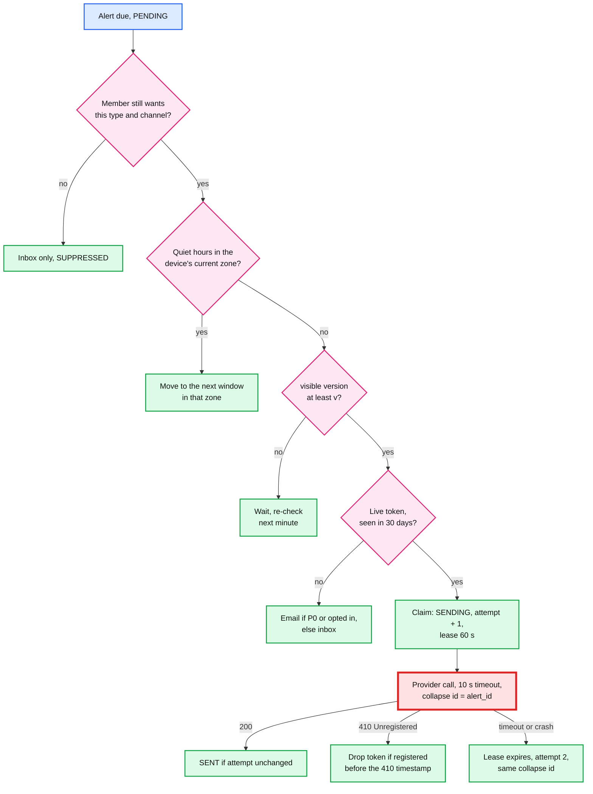
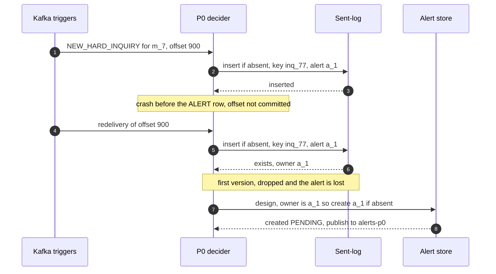

# Deep dive: preferences, dedup and delivery

> One-line answer: decide once (material, wanted, not already claimed) and **re-check at release** (still wanted, not quiet hours in the device's current time zone, under the daily cap, version visible, a live token), claim each send with a 60 s lease and a 10 s provider timeout, and make the resend harmless on the device with `apns-collapse-id` or the FCM `tag` set to the alert id; the sent-log claim is re-entrant (a redelivered event that finds **its own** claim carries on) and a P0 alert is one per change, `hash(member, P0, change_id)`, because the first version lost the alert in both cases (simulation in §8).

Zoom-in on [`../solution.md`](../solution.md) §4.3 (the decider), §5.2 (P0 lane), §5.4 (twice or never), §5.5 (read-your-alert) and §10.5 (idempotency end to end). Reusable blocks: [`../../../concepts/exactly-once.md`](../../../concepts/exactly-once.md), [`../../../concepts/leases-fencing-clocks.md`](../../../concepts/leases-fencing-clocks.md) (leases and fencing by attempt), [`../../../concepts/caching-patterns.md`](../../../concepts/caching-patterns.md). Sibling problem: [`../../email-campaign-sending/`](../../email-campaign-sending/) (paced bulk sending). Siblings here: [`change-detection-and-materiality.md`](change-detection-and-materiality.md), [`fan-out-and-herd-control.md`](fan-out-and-herd-control.md).

Acronyms: APNs (Apple Push Notification service), FCM (Firebase Cloud Messaging), P0 (possible-fraud lane), P1 (morning lane), TTL (time to live), DST (daylight saving time), FCRA (Fair Credit Reporting Act), KMS (key management service).

---

## 1. One alert at release time



## 2. Preferences, caps and quiet hours

- **Decide once, re-check at release.** A P1 alert decided at 02:13 is released at 08:47 (the mean delay is ~13.5 hours, the worst ~23 to 26); that is long enough for the member to mute score alerts, unsubscribe from email, or fly to another time zone. The first version checked preferences and quiet hours only at decide time. The design re-reads them with the warm read 2 minutes ahead (solution §5.1): one point read per release, ~7.75k/s at the cap.
- **Caps count at claim, not at decide.** An alert that is later superseded, seen-suppressed or cancelled with a quarantined batch does not burn the member's "1 push a day" [estimate].
- **Time zone comes from the device.** The app reports its zone on every open; the profile zone is the fallback. `release_at` is stored as "window in zone Z" plus the absolute time; if the device's zone changed, the scheduler moves the schedule row to the next window in the new zone. A member who flew from New York to Los Angeles is not pushed at 05:47 local by an 08:47 Eastern slot.
- **DST** is handled by computing windows with the time-zone database, never a fixed offset. The 08:00 to 11:00 window never touches the repeated or skipped hour.
- **P0 is never frequency-capped, only deduped** (it has a throughput cap of ~500/s for a daily trigger file, solution §5.2). Inside quiet hours it goes out as email plus a push without sound. Turning P0 alerts off needs a fresh sign-in (solution §10.10), and [decision] takes effect after 24 hours with a notice to the **previous** email address and every registered device: an account-takeover attacker's first move is to change the email and then mute the alerts.

## 3. Dedup: why the claim is re-entrant

The sent-log row `(member_id, change_id) → alert_id, state` is written with insert-if-absent (at decide time for triggers, at batch pass for held alerts); then the `ALERT` row is created; then a P0 is published. The first version had two bugs in that order.

**Bug 1: a crash between the claim and the alert row lost the alert.** The first version said "a redelivered event is dropped the same way". On redelivery the insert found the row the crashed attempt wrote and dropped the event. No `ALERT` row existed, so the P0 sweeper ("re-publishes any P0 still `PENDING` after 2 minutes") had nothing to find, which breaks the README's "a crash never loses a material fraud alert".
- **The design (solution §5.4):** on conflict, compare the stored `alert_id` with this event's deterministic `alert_id`. Equal: it is our own claim, carry on to the conditional create. Different: a real duplicate, drop. Writing the claim and the alert row in one single-partition transaction is equivalent; both are keyed by `member_id` first.



**Bug 2: two triggers, one alert id.** The first version used `alert_id = hash(member, bureau, snapshot_version, lane)` for every lane. A trigger creates no snapshot version, so every trigger for one member and bureau between two weekly pulls got the same `alert_id`. A fraudster applies at three banks in an afternoon: the first inquiry pushes; the second and third claim their own sent-log rows, then hit the conditional create on an alert that is already `SENT`, and nothing is pushed. The identity-theft burst, the pattern P0 exists for, alerted once.
- **The design (solution §3.3):** a P0 alert is one per change, `alert_id = hash(member, P0, change_id)`; P1 stays `hash(member, bureau, snapshot_version, P1)` and is coalesced per member at release. [decision] If three P0 alerts arrive within a minute, the sender may give them a shared collapse id per member and day, so the notification updates in place to "3 new inquiries"; each still has its own row and inbox entry.

**Held alerts and quarantine.** Claims for alerts in a held batch are taken when the batch passes, not at decide time, and a quarantine releases only rows `where alert_id = the cancelled alert` ([`bad-batch-circuit-breaker.md`](bad-batch-circuit-breaker.md) §5).

The idempotency hops, condensed from solution §10.5:

| Hop | Duplicate or loss source | Key | Rule |
|---|---|---|---|
| Trigger receiver | Bureau retries; a replayed old trigger | `(bureau, trigger_id)`, signed timestamp | Reject older than 5 min; durable dedup is the `change_id` below |
| Decider claim | Redelivery after a crash | exact per-bureau `change_id` → `alert_id` | Conflict with the same `alert_id` carries on; a different one drops |
| Cross-bureau | Same account or inquiry on TU and EQ | fuzzy link, CAS on the member's P0 index | Match: inbox "also on", no push. No match: push (err to twice) |
| Alert create | Redelivery | P0: `hash(member, P0, change_id)`; P1: `hash(member, bureau, version, P1)` | Conditional create |
| Held batch | Supersede, quarantine | claim at pass; release `where alert_id = mine` | A cancelled alert never blocks a real change |
| Sender | Crash after 200, slow provider | lease 60 s, timeout 10 s, `attempt` fence | Resend with the same collapse id |
| Inbox | Any of the above | `alert_id` | Upsert |

## 4. Sending

- **Lease longer than the provider timeout.** The claim's lease is 60 s and the provider call times out at 10 s (solution §10.2). The first version stated no provider timeout: a provider that is slow rather than down (a 70 s HTTP/2 stall) let the lease expire while sender 1 still waited; sender 2 claimed attempt 2 and sent; both succeeded. `SENT` is written only `where attempt = mine` (fencing by attempt), so a late writer cannot overwrite a newer attempt's state.
- **Collapse on the device.** APNs `apns-collapse-id`: "When sending the same notification more than once, use the same value in this header to merge the requests. The value of this key must not exceed 64 bytes" ([Apple](https://developer.apple.com/documentation/usernotifications/sending-notification-requests-to-apns)). FCM `android.notification.tag` replaces a notification with the same tag that is still shown (solution §5.4). A resend after the member dismissed the first copy shows once more: the residual duplicate.
- **Email has no collapse.** P0 email is resent on an ambiguous attempt (two emails about possible fraud beat none). P1 email is not resent. [decision] Set `Message-ID` from `alert_id` so mail clients thread a duplicate with the original.
- **Offline phones keep one.** "APNs stores only one notification per bundle ID. When you send multiple notifications to the same device for a bundle ID, APNs selects only one notification to store" (same Apple page). A member whose phone was off all night with a P0 and a P1 pending sees one. The inbox, upserted by `alert_id`, is the record; the push is a pointer.

## 5. Tokens

- **APNs 410.** `Unregistered`: "The device token is inactive for the specified topic. There is no need to send further pushes to the same device token, unless your application retrieves the same device token"; the response carries `timestamp`, "the time ... at which APNs confirmed the token was no longer valid for the topic" ([Apple](https://developer.apple.com/documentation/usernotifications/handling-notification-responses-from-apns)). Delete the token only if its last registration is older than that timestamp; a reinstall that re-registered the same token a minute ago must survive. `410 ExpiredToken` means the token expired: delete.
- **APNs 429 `TooManyRequests`** is per token ("Too many requests were made consecutively to the same device token"): back off that token, not the connection.
- **FCM staleness.** "By default, FCM considers a registration to be stale if its app instance hasn't connected for a month", and FCM returns an error for an Android registration "expired after 270 days of inactivity" ([Firebase](https://firebase.google.com/docs/cloud-messaging/manage-tokens)). Treat tokens not seen in 30 days as not live: no push (email or inbox instead), and they leave the open-rate denominator, so token cleanup does not look like a sudden jump in `p` to the herd controller.
- **Per-device limits** (FCM: 240 messages a minute and 5,000 an hour per Android device; collapsible messages "a burst of 20 messages per app per device, with a refill of 1 message every 3 minutes", [Firebase](https://firebase.google.com/docs/cloud-messaging/throttling-and-quotas)) never bind at 1 push a day. They are the backstop for a loop bug.

## 6. Read-your-alert, and what a P0 push opens

- **P1 cites a version.** The push carries `(bureau, v)`; the scheduler released it only after `visible_version ≥ v`; the app calls `GET /v1/scores?min_version=v`; the cache key `card:{member}:{bureau}:v{n}` is immutable (solution §5.5).
- **A trigger P0 cites no new version.** The inquiry is not in any visible report until the next weekly pull, up to 7 days later. A deep link to the score page shows a report without the inquiry the push just announced. Deep-link P0 to the alert detail (from the inbox row: lender, date, bureau, "what to do"), with "will appear on your report at the next refresh".

## 7. Unsubscribe and deletion

- **Unsubscribe** (an email link or a preference toggle) is a preference write, honored by the release-time re-check. Possible-fraud alerts follow the stricter rules in §2.
- **Account closure or deletion.** In one workflow, in this order [decision on the order]: mark consent withdrawn (the pull worker checks it, so no pull happens after this instant, which is the FCRA point); remove from the slot index; cancel every `PENDING` and `HELD` alert (one member-keyed range); delete device tokens; then delete the member's data key in the KMS, which crypto-shreds their KV rows, raw reports and backups, and queue a row delete in the lake, which is encrypted per file and rewritten by the monthly compaction (solution §5.7). A minimal audit record (alert id, type, time, channel) stays under a separate retention key for the legal retention period, then is shredded. The retention period and any exemption under state privacy laws for FCRA-covered data are for legal to set [unverified].

## 8. Simulation

40,000 members with P0 triggers; 5% get a burst of 2 to 4 inquiries in a day. Crash rates are exaggerated to 1% per step so the rare paths show; a crash before the alert row makes Kafka redeliver. Senders crash after the provider's 200 (1%) or run past the lease (0.5%); 30% of members have dismissed the first copy before a resend.

```python
# P0 decide-and-send with injected crashes. Crash rates are exaggerated (1%) so rare
# paths show up; compare the two policies, not the absolute counts.
import random

def run(policy, seed=5):
    rnd = random.Random(seed)
    triggers = []                                     # (member, inquiry) in arrival order
    for m in range(40_000):
        burst = rnd.choice([2, 3, 4]) if rnd.random() < 0.05 else 1   # identity theft: a burst
        triggers += [(m, f"inq{m}-{i}") for i in range(burst)]
    sent_log, alerts = {}, {}
    lost_crash = lost_collide = twice = two_emails = 0
    for m, inq in triggers:
        key = (m, "NEW_HARD_INQUIRY", inq)
        if policy == "first version":                 # alert_id = hash(member, bureau, version, lane)
            alert_id = (m, "TU", "visible v41", "P0") # a trigger creates no new version
        else:
            alert_id = (m, "P0", inq)                 # one alert per change
        outcome = None
        for delivery in range(5):                     # Kafka redelivers until the commit
            if key in sent_log:                       # insert-if-absent lost
                if policy == "first version" or sent_log[key] != alert_id:
                    outcome = "dropped"; break        # "a redelivered event is dropped"
            sent_log[key] = alert_id                  # (design: our own claim, carry on)
            if rnd.random() < 0.01: continue          # crash before the ALERT row is written
            outcome = "collided" if alert_id in alerts else "new"
            alerts.setdefault(alert_id, "PENDING"); break
        if outcome == "dropped": lost_crash += 1; continue
        if outcome == "collided": lost_collide += 1; continue   # create failed: already SENT
        resend = rnd.random() < 0.01 or rnd.random() < 0.005    # crash after 200, or slow call
        if resend and rnd.random() < 0.3: twice += 1  # first copy already dismissed
        if resend: two_emails += 1                    # P0 email is resent on ambiguity
        alerts[alert_id] = "SENT"
    return len(triggers), lost_crash, lost_collide, twice, two_emails

print(f"{'policy':<14}{'P0 changes':>11}{'lost: crash':>13}{'lost: same id':>15}"
      f"{'shown twice':>13}{'two emails':>12}")
for p in ("first version", "design"):
    n, lc, ls, tw, te = run(p)
    print(f"{p:<14}{n:>11}{lc:>13}{ls:>15}{tw:>13}{te:>12}")
```

Output (`python3 dedup.py`):

```text
policy         P0 changes  lost: crash  lost: same id  shown twice  two emails
first version       44071          449           4010          188         580
design              44071            0              0          211         688
```

**Reading the output.**
- **Under the first version's rules, 4,459 of 44,071 possible-fraud changes are never alerted:** 449 from the crash between claim and alert row (≈ the 1% crash rate), 4,010 from the shared trigger `alert_id` (every inquiry after the first in a burst). At a realistic crash rate the first number shrinks; the second does not, because it is not caused by a crash.
- **Under the design's, nothing is lost.** The price is slightly more residual duplicates (211 shown twice, 688 duplicate emails, against 188 and 580), because more alerts are actually sent. Those duplicates are the honest cost of "never lose a fraud alert": an ambiguous send is resent.

## 9. What an interviewer pushes on

1. **"The sender crashes after APNs said 200. Twice or never?"** Lease expiry, resend with the same collapse id; the phone replaces it in place. Twice on screen only if the member already dismissed it. Email: P0 twice, P1 never.
2. **"The decider crashes after writing the dedup row. What happens?"** The redelivery finds the row, sees its own `alert_id` in it, and carries on to create the alert. (The first version dropped it: never.) One partition transaction for claim and alert is the equivalent fix.
3. **"Three inquiries in an hour for one member."** Three changes, three alerts, one notification updating in place if they arrive together. Never one alert id per member and bureau for triggers.
4. **"The member muted alerts at 07:00; the alert was decided at 02:00."** Preferences, quiet hours and the device's time zone are re-checked at release; the cap is counted at claim.
5. **"How do you avoid sending to dead tokens?"** APNs 410 with its timestamp, FCM's one-month staleness; dead tokens leave the push path and the open-rate math.
6. **"An attacker took over the account. How do they hide?"** They change the email, then mute fraud alerts. Muting needs a fresh sign-in, takes 24 hours, and is announced to the old email and every old device.

## 10. Trade-offs

| Decision | Option A | Option B | Chose | Why |
|---|---|---|---|---|
| When to check preferences | Decide time only | Decide and release | Both | P1 waits hours; members change their minds |
| Cap counting | At decide | At claim | At claim | Superseded or suppressed alerts should not burn the cap |
| Claim on conflict | Drop (first version) | Compare `alert_id`, carry on if ours | Compare | Dropping our own claim loses the alert |
| P0 alert identity | `(member, bureau, version, lane)` (first version) | Per change | Per change | Triggers create no version; a burst would alert once |
| Lease vs provider timeout | Lease only | Timeout 10 s, lease 60 s, fence by attempt | Both | A slow provider must not let two senders own one alert |
| Stale tokens | Wait for 410 | 30-day staleness rule | 30 days | Firebase's own default; keeps `p` honest |
| Cross-region sent-log | Synchronous | Asynchronous, device merges | Asynchronous | ~70 ms on every send for a once-a-year resend (solution §5.4) |
| **Refused** | Exactly-once delivery to the phone, SMS, per-alert ML timing as the only control | | | The provider's 200 can be lost; SMS adds cost and a phone-number trust problem |

## 11. Numbers to say out loud

- Lease 60 s, provider timeout 10 s, P0 sweeper at 2 minutes, page at 4.
- `apns-collapse-id` at most 64 bytes; APNs stores one notification per bundle ID while offline.
- FCM: 600k a minute per project; 240 a minute and 5,000 an hour per Android device; stale after a month, expired after 270 days.
- Simulation at 1% crash rates: 4,459 of 44,071 P0 changes lost under the first version's rules, 0 under the design's.
