# Diagrams: Credit Karma score-change alerts

> One-line answer: twelve views of one design. Members are hashed into refresh slots, so bureau reports arrive at a flat ~330 a second. Diff workers diff each report against the visible snapshot and write a staged version plus typed change events with exact per-bureau ids. A batch-level quality gate promotes the version or holds alerting and display. An alert decider keeps material, wanted, not-yet-sent changes and puts them in a lane. A delivery scheduler sends P0 (possible fraud, one alert per change) at once and releases P1 (everything else) across the member's local morning by member hash, starting low and ramping on the read path's measured headroom, warming each score card first. The member read path is the one red box.

The D1 to D12 set from `hld/CLAUDE.md` §4, each with a one-line caption. A diagram already in [`solution.md`](solution.md) gets a heading, a caption and a link, never a second copy. Acronyms: KV (key-value store), APNs (Apple Push Notification service), FCM (Firebase Cloud Messaging), KMS (key management service), FCRA (Fair Credit Reporting Act), P0 (the possible-fraud lane: new account, new hard inquiry), P1 (every other alert, released in the local morning), TTL (time to live), RF (replication factor), DNS (Domain Name System), AZ (availability zone), RPO (recovery point objective).

| # | Diagram | Where it lives |
|---|---|---|
| D1 | Context | below |
| D2 | Data flow | below, plus D2b data lifecycle |
| D3 | Component architecture (final design) | [solution §6](solution.md#6-final-design-and-the-six-core-flows) |
| D4 | Happy path per FR | First versions: [solution §4.1 to §4.4](solution.md#4-high-level-design). Final versions: FR1 + FR2 pull to promotion, FR3 P0 trigger to push, FR3 + FR4 morning release and tap: below |
| D5 | Failure paths | Sender crash after APNs 200, gate hold and replay, FCM 429 mid-release: below. Region loss mid-release: [solution §10.4](solution.md#104-failure-timeline) |
| D6 | Decision flow | Score API with `min_version`: [solution §5.5](solution.md#55-the-member-taps-the-push-and-the-app-shows-last-weeks-score-from-a-cache-how-do-you-prevent-that). Alert decider: below. Release controller: [solution §10.1](solution.md#101-internals-of-each-chosen-technology) |
| D7 | Entity relationship | [solution §3.3](solution.md#33-data-model) |
| D8 | State machines | Batch: [solution §5.3](solution.md#53-a-bad-bureau-batch-drops-everyones-score-by-80-points-how-do-you-stop-it-before-the-pushes-go-out). Alert and snapshot version: below |
| D9 | Deployment / topology | below |
| D10 | Scaling / partitioning | below |
| D11 | Failure mode map | below, two trees |
| D12 | Rollout / migration | below |

## D1. Context (zoom-out)

Our system as one box: bureaus feed it, push and email providers carry its alerts, members read from it, on-call decides held batches.

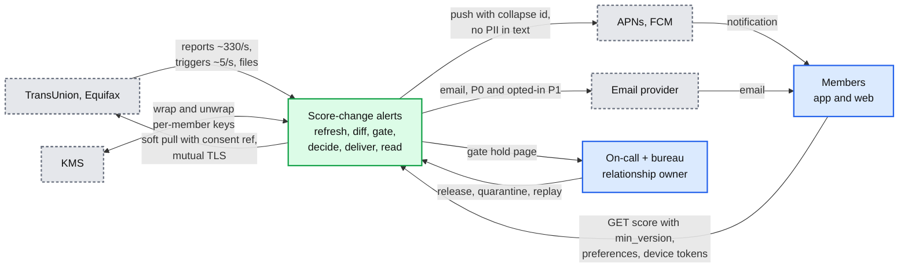

## D2. Data flow (DFD)

Inputs to outputs with format, size and rate on every edge. Two lanes leave the decider: P0 at once, P1 through the scheduler.

```mermaid
%% D2: data flow. Processes are rounded, stores are cylinders. Rates are steady state; file mode in brackets.
flowchart LR
    BU[Bureaus] -->|"report XML or JSON,<br/>~30 KB, 330/s"| ING([Ingest])
    ING -->|"encrypted report, ~10 MB/s"| RAW[(Raw reports<br/>~15 TB, 90 days)]
    ING -->|"pointer ~300 B,<br/>330/s, 20k/s file mode"| KR[[reports]]
    BU -->|"trigger JSON ~1 KB,<br/>~5/s, bursts 50/s"| KT[[triggers]]
    KR -->|"pointer"| DIFF([Diff])
    DIFF -->|"staged version ~8 KB +<br/>score card, diffed vs visible"| KV[(Snapshot KV, 3 versions<br/>~4.8 TB, ~14 TB replicated)]
    DIFF -->|"change event ~200 B,<br/>~500/s"| CE[[change-events]]
    DIFF -->|"Parquet, ~400 GB/week"| LAKE[(History lake)]
    CE -->|"batch stats"| GATE([Quality gate])
    GATE -->|"promote, ~165/s avg"| KV
    CE -->|"events"| DEC([Decider])
    KT -->|"one KV check, then event"| DEC
    DEC -->|"alert ~500 B, ~41/s,<br/>sent-log row"| AS[(Alert store)]
    AS -->|"P0 ~5/s now, own cap ~500/s,<br/>P1 from 1k/s up to R_cap"| SCH([Scheduler +<br/>senders])
    SCH -->|"push ~300 B, email"| PRV[APNs, FCM,<br/>email]

    class BU,PRV external
    class ING,DIFF,GATE,DEC,SCH service
    class RAW,KV,LAKE,AS store
    class KR,KT,CE queue

    classDef service  fill:#dcfce7,stroke:#16a34a,stroke-width:2px,color:#111
    classDef store    fill:#ede9fe,stroke:#7c3aed,stroke-width:2px,color:#111
    classDef queue    fill:#cffafe,stroke:#0891b2,stroke-width:2px,color:#111
    classDef external fill:#e5e7eb,stroke:#6b7280,stroke-width:2px,color:#111,stroke-dasharray:4 3
```

### D2b. Data lifecycle and retention

Where each kind of data lives and when it goes away (solution §5.7). Hot data in the KV, evidence in the lake, raw reports gone at 90 days. Per-member keys crypto-shred the KV, raw reports and backups; the lake is encrypted per file and deletes by rewrite, because per-member encryption inside Parquet would defeat columnar compression.

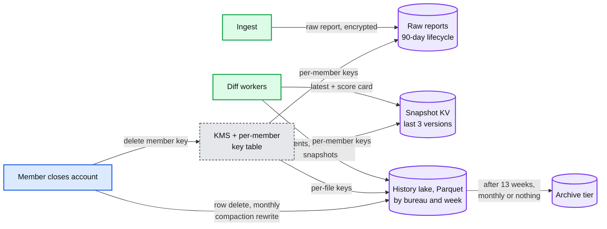

## D3. Component architecture

The final design, 14 nodes, red on the member read path: [solution §6](solution.md#6-final-design-and-the-six-core-flows).

## D4. Happy paths, one per FR

The first versions are in [solution §4](solution.md#4-high-level-design), one per FR. These are the final versions, after §5.

### D4 FR1 and FR2 final: a pull becomes a staged version, passes the gate, and is promoted

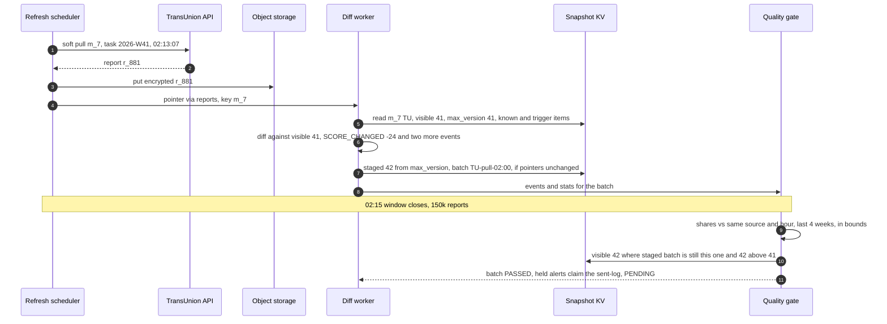

### D4 FR3 P0 final: a trigger becomes a push in about a second

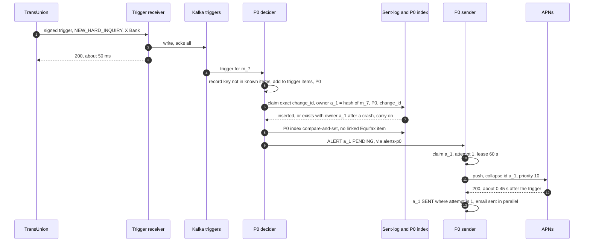

### D4 FR3 and FR4 final: the morning release and the tap

Flow 2 of solution §6 as a sequence: warm first, release by budget, read by version.

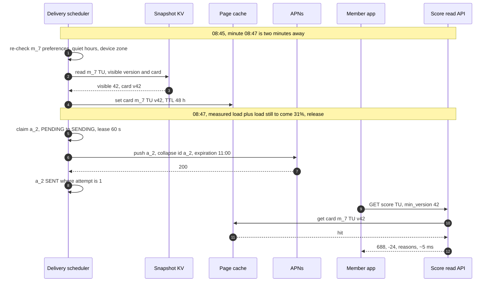

## D5. Failure paths

### D5a. Sender crashes after APNs accepts the push

The ambiguous crash from solution §5.4. The lease turns it into a resend, the collapse id turns the resend into a replacement on the phone, and the attempt number fences the final write.

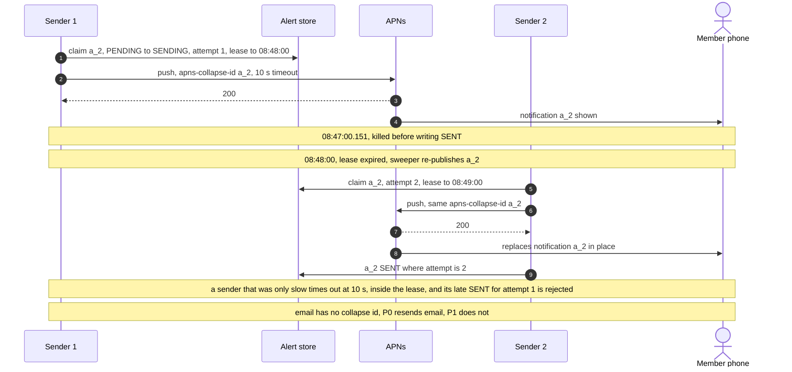

### D5b. The gate holds a bad batch, on-call quarantines and replays

Flow 4 of solution §6. No member sees the bad score and no alert leaves.

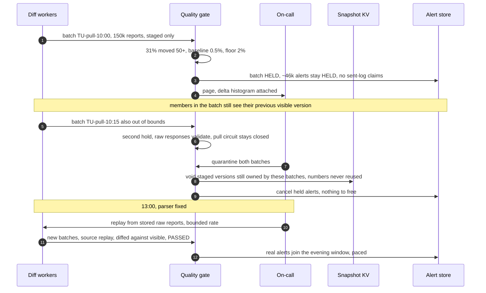

### D5c. FCM answers 429 in the middle of a release

Another team's campaign shares the FCM project quota. P0 keeps its reserved share; P1 slows and rolls.

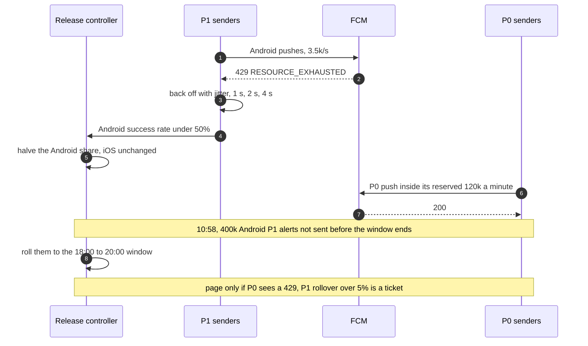

## D6. Activity / decision flow

The score API's `min_version` logic is [D6a in solution §5.5](solution.md#55-the-member-taps-the-push-and-the-app-shows-last-weeks-score-from-a-cache-how-do-you-prevent-that) and the release control loop is in [solution §10.1](solution.md#101-internals-of-each-chosen-technology). Here is the hardest branching component: the alert decider.

### D6b. The alert decider, one change event

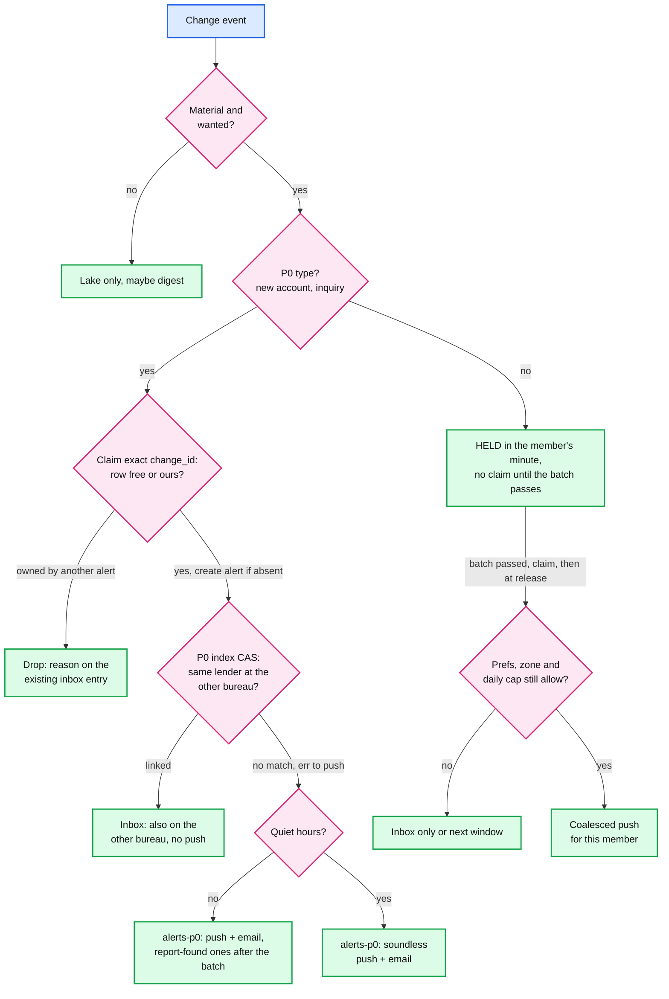

## D7. Entity relationship

The `erDiagram` with partition keys and access patterns: [solution §3.3](solution.md#33-data-model).

## D8. State machines

The batch lifecycle is [D8a in solution §5.3](solution.md#53-a-bad-bureau-batch-drops-everyones-score-by-80-points-how-do-you-stop-it-before-the-pushes-go-out).

### D8b. Alert

Every transition is a conditional update on one row. A held alert claims the sent-log only on the way to `Pending`; a newer report for the member supersedes it. `SENDING` returns to itself on a lease expiry with a new attempt, and only the current attempt can write `Sent`.

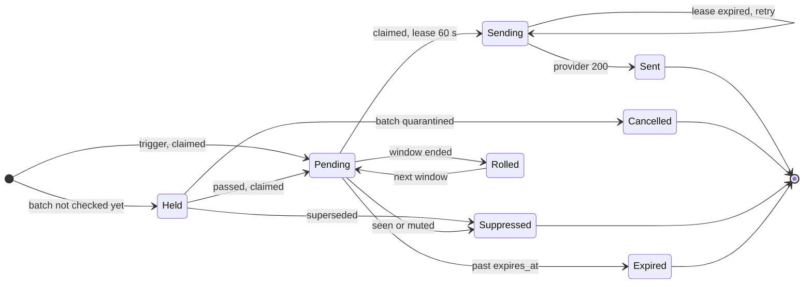

### D8c. One snapshot version

The lifecycle of one version on a snapshot row (`visible_version`, `staged_version`, `staged_batch_id`, `max_version`). Every diff is against the visible version; numbers come from `max_version` and are never reused; `visible` never moves back.

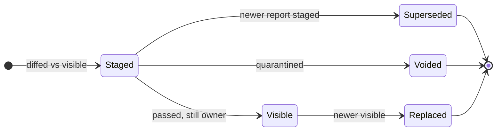

A correction (solution §5.3) is not a transition here: it is a new version, staged from a replay batch with `correction_of`, that replaces the wrong one by moving forward.

## D9. Deployment / topology

Two US regions. Each member has a home region for writes; reads are active-active; each region's read path can carry all traffic alone, which is why the scheduler budgets against one region's 30k.

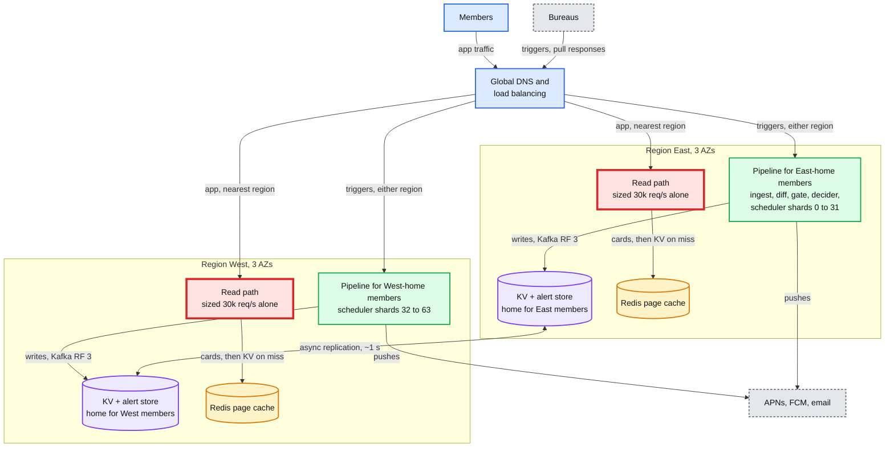

What crosses a region boundary: KV and alert-store replication (asynchronous), the §5.5 fallback read to the home region (rare), a trigger that lands in the non-home region (forwarded once to the home region's `triggers` topic), and shard leases on failover. Object storage is a multi-region bucket.

## D10. Scaling / partitioning

Salted hashes of `member_id` place a member everywhere: its refresh second, its Kafka partition, its KV tablet, its scheduler shard, and its release minute in the morning window. Hashing the member (not the alert) for the release minute keeps a member's two bureau alerts in one minute, so they coalesce into one push. The naive release (everything at 08:00) is the hot bucket; it overloads the red read path.

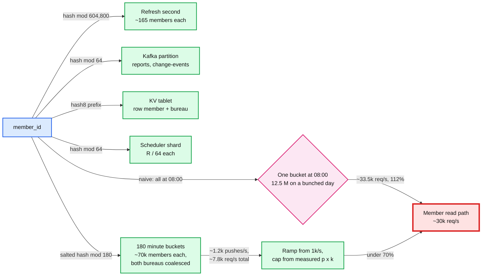

No other key is hot. A refresh second holds ~165 members (±13); a Kafka partition gets ~5 reports/s steady and ~310/s in file mode; a KV tablet split is automatic; a scheduler shard releases at most ~120 pushes/s.

## D11. Failure mode map

Component, what fails, blast radius, mitigation. Two trees so each stays under 15 nodes.

### D11a. Ingest, diff and gate

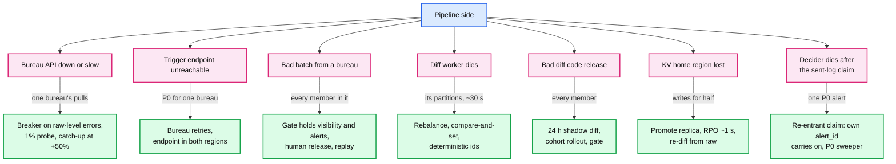

The widest blast radius on this side is a bad batch (every member in it), bounded by the gate (solution §5.3). Nothing here is red: the pipeline can fall behind and catch up. The red node is on the member side (D11b).

### D11b. Delivery and read

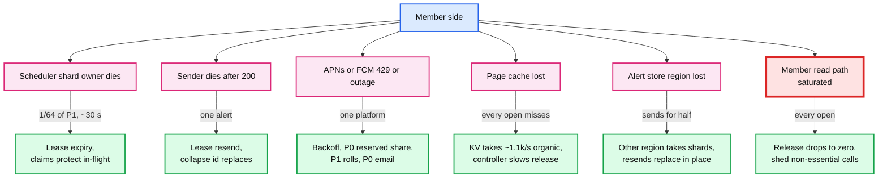

## D12. Rollout / migration

From a nightly job that diffs scores and sends every alert at once, to this design. Each phase has a rollback point; no phase needs a coordinated deploy (solution §8).

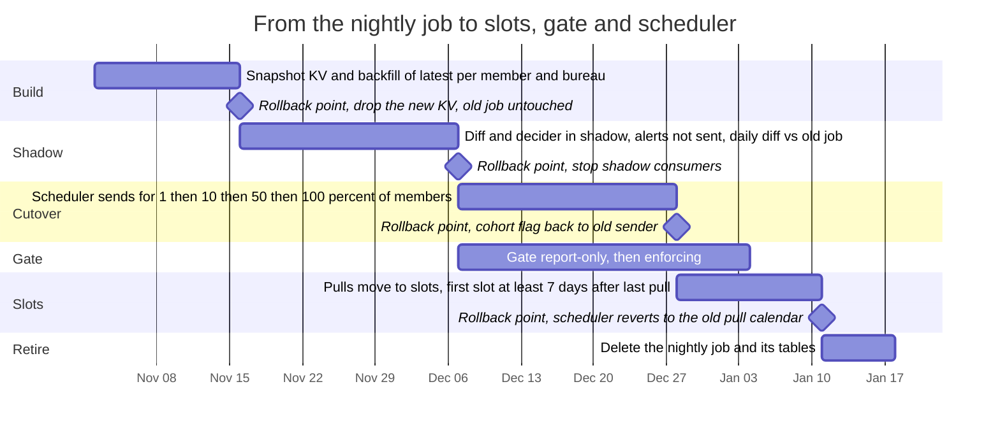

The gate runs report-only from the start of shadow, so its thresholds are tuned on 4 weeks of real batches before it can hold anything. The slot move is last because it is the only phase that changes what we buy from the bureaus.
