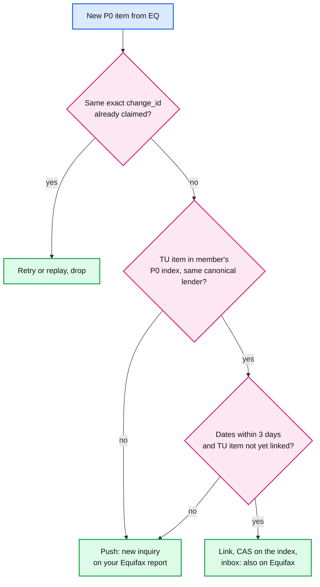
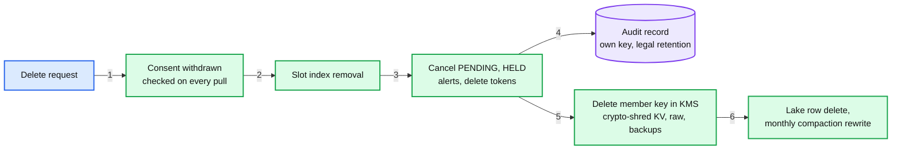
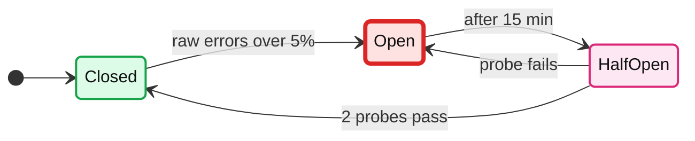

# Edge cases: Credit Karma score-change alerts

Every entry answerable in under 60 seconds out loud. Categories: failure, consistency, scale, data, operations, security / abuse. Design reference: [`solution.md`](solution.md). An answer bullet that starts with **Decision:** goes past what solution.md states. Where the design changed after review, the entry says what the first version did and why it changed; the simulations are in the deep dives. Acronyms: TU (TransUnion), EQ (Equifax), KV (key-value store), P0 (possible-fraud lane: new account, new hard inquiry), P1 (every other alert, released in the member's local morning), APNs (Apple Push Notification service), FCM (Firebase Cloud Messaging), CAS (compare-and-set), DLQ (dead-letter queue), FCRA (Fair Credit Reporting Act), KMS (key management service), SLO (service level objective), AIMD (additive increase, multiplicative decrease).

Deep dives: [ingestion](deep-dives/bureau-ingestion-and-refresh-scheduling.md), [change detection](deep-dives/change-detection-and-materiality.md), [herd control](deep-dives/fan-out-and-herd-control.md), [bad-batch gate](deep-dives/bad-batch-circuit-breaker.md), [dedup and delivery](deep-dives/preferences-dedup-and-delivery.md).

---

## Failure

## Edge case: a bureau API is slow, not down
- **Trigger:** TransUnion's p99 goes from ~1 s to 20 s for an hour.
- **Symptom:** to keep ~165 pulls/s, 3,300 calls would be in flight (Little's law). Pull workers pile up; Equifax pulls could starve if they share the pool.
- **Answer:**
  - **Decision:** one pull pool per bureau (a bulkhead), a 5 s call timeout, and a per-bureau concurrency cap (~500). TransUnion's effective rate drops to ~25/s; Equifax never notices.
  - The overdue tasks queue, ~140/s for the hour, ~500k members. Catch-up at +50% (~82/s) drains them in ~1.7 hours. Slots do not move.
  - Never raise the cap to chase a slow dependency: that converts slowness into a pile-up. [Ingestion §3](deep-dives/bureau-ingestion-and-refresh-scheduling.md#3-the-pull-worker).
- **Confidence:** [ ] shaky  [ ] ok  [ ] confident

## Edge case: a bureau is down for 6 hours
- **Trigger:** the Equifax pull API returns 5xx from 01:00 to 07:00.
- **Symptom:** `165/s × 21,600 s ≈ 3.6 M` members miss their Equifax slot. The pull-error page fires after 10 minutes.
- **Answer:**
  - The breaker opens on raw-level errors; the slots stay where they are. On recovery, overdue members are pulled oldest first at +50%: 3.6 M in ~12 hours. Worst gap between two pulls ~7.25 days, inside the 8-day freshness SLO.
  - Their alerts trickle out over those 12 hours and land in the next morning windows, spread. An ingestion outage does not bunch alerts; the catch-up rate spreads them.
  - "7 days after the last pull" would turn the same outage into a weekly 11-hour bump forever (simulation in the ingestion deep dive).
- **Confidence:** [ ] shaky  [ ] ok  [ ] confident

## Edge case: the trigger feed goes silent
- **Trigger:** a bureau-side change stops monitoring triggers. No errors, no retries, just nothing.
- **Symptom:** P0 volume for one bureau drops to zero. Nothing pages: the endpoint is healthy.
- **Answer:**
  - **Decision:** a silence alarm. Page if triggers per bureau per hour fall under 20% of the same hour last week for 2 hours.
  - Meanwhile the weekly reports still find new accounts and inquiries; they ride the P0 lane after their batch passes the gate. Fraud detection degrades from minutes to up to 7 days; it does not stop.
- **Confidence:** [ ] shaky  [ ] ok  [ ] confident

## Edge case: one poison report stalls a Kafka partition
- **Trigger:** a 10 MB report crashes the parser; the diff worker retries it forever.
- **Symptom:** a window closes only when every partition's consumer is past it, so no TU or EQ window closes. Nothing is promoted and no P1 alert is released. It is not a hold, just "not closed", so the first version paged nobody.
- **Answer:**
  - Three attempts, then the report goes to a DLQ and the member is dropped from the batch (their visible version stays). A window still open 10 minutes after its end pages (solution §5.3, §8).
  - The parse-error rate is a gate metric, so a bureau-wide format change still holds the batch instead of DLQ-ing it silently.
- **Confidence:** [ ] shaky  [ ] ok  [ ] confident

## Edge case: the snapshot KV slows down during a file replay
- **Trigger:** a bureau file is being replayed at ~20k reports/s (~40k KV operations/s) when KV p99 doubles.
- **Symptom:** the same KV serves organic score reads (~1.1k/s of cache misses). Members see a slow home screen.
- **Answer:**
  - **Decision:** the replayer's rate is `min(20k/s, rate that keeps KV p99 under its SLO)`, adjusted every 10 s. The app has priority; the file just takes longer than 83 minutes.
  - Per-chunk checkpoints let the replayer pause and resume without re-reading the file.
- **Confidence:** [ ] shaky  [ ] ok  [ ] confident

## Edge case: the page cache is lost in the middle of a morning release
- **Trigger:** the Redis cluster restarts at 09:00 while the scheduler releases at ~7.75k pushes/s.
- **Symptom:** warmed cards are gone; every open misses. At the cap, ~1.55k opens/s (`7.75k × 0.2`) need a KV read each, on top of ~1.1k/s organic misses.
- **Answer:**
  - ~3 to 5k KV reads/s fits a KV sized for ~60k ops/s. Latency rises; read-path utilization rises; the controller sees it and slows the release.
  - Warming refills the cache 2 minutes ahead of each slice, so within ~2 minutes released alerts are warm again. Correctness never depended on the cache: version-keyed cards are immutable.
- **Confidence:** [ ] shaky  [ ] ok  [ ] confident

## Edge case: the decider crashes after the dedup claim, before the alert row
- **Trigger:** the P0 decider writes `SENT_LOG(m_7, inq_77) → a_1`, then dies before creating `ALERT a_1`. Kafka redelivers the trigger.
- **Symptom:** the redelivery finds a sent-log row for this change. No alert row exists yet, so the P0 sweeper has nothing to re-publish. The first version dropped the event here ("finds the row and is dropped"), and the fraud alert was never sent.
- **Answer:**
  - The claim is re-entrant: on conflict, compare the stored `alert_id` with this event's deterministic one. Ours: carry on to the conditional create. Someone else's: drop (solution §5.4). Writing claim and alert in one single-partition transaction is the equivalent fix (both are member-keyed).
  - At a 1% crash rate the first version lost 449 of 44,071 P0 changes; the design loses 0 ([dedup deep dive §8](deep-dives/preferences-dedup-and-delivery.md#8-simulation)).
- **Confidence:** [ ] shaky  [ ] ok  [ ] confident

## Edge case: the sender crashes after APNs answered 200
- **Trigger:** sender 1 claims `a_2` (lease 60 s), APNs answers 200, the process is killed before `SENT`.
- **Symptom:** the alert is `SENDING` with an expired lease. Was it delivered? We cannot know.
- **Answer:**
  - The sweeper re-publishes; sender 2 claims attempt 2 and pushes with the same `apns-collapse-id` (or FCM `tag`). The phone replaces the first notification in place.
  - Residual: if the member already dismissed the first copy, it shows again. P0 email is resent (two fraud emails beat none); P1 email is not.
  - Exactly-once delivery to a phone does not exist; exactly-once on the screen almost does (solution §5.4).
- **Confidence:** [ ] shaky  [ ] ok  [ ] confident

## Edge case: the region running the release controller dies mid-release
- **Trigger:** the controller leader's region is lost at 08:50 with 1,200 alerts `SENDING`.
- **Symptom:** shard owners in the surviving region stop receiving a rate; all app traffic moves to one region's read path.
- **Answer:**
  - Owners keep the last rate for 60 s, then fall to 1k pushes/s (solution §10.1). A new leader takes the lease in the surviving region.
  - **Decision:** the new leader restarts with slow start and re-measures `p × k`; it does not trust the dead leader's state.
  - The budget was always 70% of one region's 30k, so a region loss does not double the load per region. Expired `SENDING` leases are resent with the same collapse ids (solution §10.4).
- **Confidence:** [ ] shaky  [ ] ok  [ ] confident

---

## Consistency

## Edge case: three inquiries for one member in one afternoon
- **Trigger:** a fraudster applies at three banks; TransUnion sends three triggers within an hour.
- **Symptom:** the first version used `alert_id = hash(member, bureau, snapshot_version, lane)`. A trigger creates no version, so all three got the same `alert_id`: the first pushed, the second and third hit the conditional create on an alert already `SENT` and pushed nothing.
- **Answer:**
  - One P0 alert per change, `alert_id = hash(member, P0, change_id)` (solution §3.3). Three rows, three inbox entries, three pushes.
  - **Decision:** if they arrive close together, the sender may give them a shared collapse id per member and day, so the phone shows one notification updated to "3 new inquiries".
  - In the simulation the shared id lost 4,010 of 44,071 P0 changes, every inquiry after the first in a burst.
- **Confidence:** [ ] shaky  [ ] ok  [ ] confident

## Edge case: the same inquiry on TransUnion and Equifax, named differently
- **Trigger:** a lender pulls both bureaus. TU records "CAPITAL ONE", EQ records the bank's legal entity name, one day later.
- **Symptom:** the first version's cross-bureau key `hash(member, type, creditor, month)` differed, so the member got two possible-fraud pushes for one application. Across a month boundary it split even when the names matched.
- **Answer:**
  - Dedup is exact per bureau record (`change_id`); the cross-bureau link is for display only: canonical lender through an alias table, inquiry dates within ±3 days (accounts: open dates within ±31 days, same account type), one-to-one, checked and written with a CAS on the member's P0 index (solution §4.3).
  - Linked: the inbox entry gains "also on your Equifax report", no push. Not linked: a second honest push. Err to twice.
  - Simulation: 3,479 double pushes per 17,203 applications with the first version's name key, 359 with the link ([change detection §7](deep-dives/change-detection-and-materiality.md#7-simulation)).
- **Diagram:**

- **Confidence:** [ ] shaky  [ ] ok  [ ] confident

## Edge case: two real inquiries from the same lender in one month
- **Trigger:** the member applies for a card at X Bank on Oct 3; a fraudster applies at X Bank on Oct 20.
- **Symptom:** the first version's inquiry key carried only the month, so both mapped to `hash(m, NEW_HARD_INQUIRY, X Bank, 2026-10)` and the fraud inquiry "finds the row and is dropped".
- **Answer:**
  - `change_id = hash(member, bureau, type, bureau_item_key, period)`, where `bureau_item_key` is the bureau's own record id, else `(subscriber code, inquiry date)`. Two applications are two changes; nothing is keyed by month alone.
  - In the simulation the month key lost 319 of 1,234 second applications to the same lender; the design lost 30 (two applications within the 3-day link window, from different bureaus).
- **Confidence:** [ ] shaky  [ ] ok  [ ] confident

## Edge case: the trigger and the weekly report describe the same inquiry differently
- **Trigger:** Monday's trigger names "X BANK"; Tuesday's TransUnion report lists "X BANK NA" with a different date format.
- **Symptom:** the first version relied on the report's key equalling the trigger's key. If not, the member got a second "new inquiry" push the next day.
- **Answer:**
  - The trigger path writes its `bureau_item_key` into `trigger_items` on the snapshot row (CAS). The report's diff recognizes the inquiry by key and makes it a reason on the score card, not a new alert (solution §5.2, Flow 2).
  - Where the trigger carries no record key, fall back to the fuzzy link, same rules as across bureaus.
- **Confidence:** [ ] shaky  [ ] ok  [ ] confident

## Edge case: a newer report arrives while the previous one is held by the gate
- **Trigger:** batch B1 (staged v42, wrongly -80, plus a real new inquiry X) is held. The member's next report (B2: 712, with X) arrives before B1 is decided.
- **Symptom:** the first version never named the diff base, and the held alert for X claimed X's sent-log row at decide time. Diffing against v42 gave a false "+80" and no X; quarantining B1 then freed X's claim when nothing would re-emit it.
- **Answer:**
  - The diff base is always the **visible** version. Writing v43 supersedes v42 for this member: B1's held alerts for them are cancelled. Held alerts claim the sent-log only when their batch passes, so a cancelled batch holds no claims (solution §5.3).
  - The promoter sets `visible = v` only if `staged_batch_id` is still that batch and `v > visible`.
  - Simulated: the first version's rules send `SCORE +80`; the design's send `INQUIRY X` ([gate deep dive §5](deep-dives/bad-batch-circuit-breaker.md#5-the-races-while-a-batch-is-held)).
- **Confidence:** [ ] shaky  [ ] ok  [ ] confident

## Edge case: a held batch is released after a newer batch already passed
- **Trigger:** B1 held at 10:16; on-call releases it at 13:00, but 2% of its members already have a newer version visible from catch-up pulls.
- **Symptom:** the first version's "flip `visible_version = staged_version`" would either move those members backward or publish a version from a batch nobody judged.
- **Answer:**
  - Per member, the promoter publishes only the version B1 wrote, only if it is still the staged one and newer than visible. Members superseded since are skipped; their B1 alerts were already cancelled (solution §5.3, §10.6).
  - Versions only move forward, so `min_version` in any alert already sent stays satisfiable (solution §5.5).
- **Confidence:** [ ] shaky  [ ] ok  [ ] confident

## Edge case: the member taps the push and sees last week's score
- **Trigger:** a cache entry, a lagging replica, or the app's local copy holds v41 when the alert cites v42.
- **Symptom:** "Your score changed" and the screen shows the old 712. Trust gone.
- **Answer:**
  - The alert carries `(bureau, v)` and is released only after `visible_version ≥ v` in the home region. The app calls `GET /v1/scores?min_version=v` and renders nothing older; the cache key includes the version, so it never needs invalidating.
  - A lagging replica triggers one cross-region read; a 409 is a page-worthy invariant break (solution §5.5).
  - A trigger P0 cites no new version (the inquiry is not in any report yet), so its deep link opens the alert detail, not the report (solution §5.5).
- **Confidence:** [ ] shaky  [ ] ok  [ ] confident

## Edge case: a slow provider outlives the 60-second lease
- **Trigger:** an APNs HTTP/2 stream stalls for 70 s. The lease on `a_2` expires while sender 1 still waits.
- **Symptom:** with no provider timeout (the first version), sender 2 claims attempt 2 and sends; then sender 1's call returns 200 and it writes `SENT`. Two sends; for P0, two emails.
- **Answer:**
  - The provider call times out at 10 s, well under the 60 s lease. `SENT` is written only `where attempt = mine`, a fencing token, so a late writer cannot overwrite attempt 2's state (solution §5.4).
  - The device still merges the two pushes by collapse id.
- **Confidence:** [ ] shaky  [ ] ok  [ ] confident

## Edge case: quarantine frees a sent-log row another alert now owns
- **Trigger:** a cancelled alert's claim and a live alert's claim meet on one sent-log row (in the first version: B1's held alert claimed inquiry X at decide time; a trigger alert for X arrived later). On-call quarantines B1.
- **Symptom:** the first version's "free their sent-log rows", done unconditionally, deleted the trigger alert's claim. The next weekly report alerted X again.
- **Answer:**
  - Held alerts now claim only at pass, so a quarantined batch usually holds no claims. Any row is freed only `where alert_id = the cancelled alert`: a conditional delete, like every other state change in the alert store (solution §5.3).
- **Confidence:** [ ] shaky  [ ] ok  [ ] confident

---

## Scale

## Edge case: `p × k` is 4, not 2
- **Trigger:** the backlog after a held batch is all "your score dropped 60" alerts. Twice the usual share open them.
- **Symptom:** releasing at the formula's cap with the prior, `R_cap = 15.5k ÷ 2 = 7.75k/s` (the first version), settles at `5.5k + 7.75k × 4 = 36.5k/s`, 122% of the read path. Even a 17-minute release peaks at 102% and spends 11.7 minutes above 80% (simulation).
- **Answer:**
  - Slow start at 1k/s; `p̂k̂` measured on this release from requests tagged with `alert_id`, never below 2; every 2 minutes add `0.3 × C ÷ (4 × p̂k̂)` (~1.1k/s), so even a 2x error in one step uses half the 30% margin (solution §5.1).
  - Peak stayed under 70% in every simulated case, including `p × k = 6`. Cost: ~22 minutes instead of 17 on a normal day ([herd deep dive §6](deep-dives/fan-out-and-herd-control.md#6-simulation)).
- **Confidence:** [ ] shaky  [ ] ok  [ ] confident

## Edge case: a feedback trim starves the backlog
- **Trigger:** the first version's trim halved the rate every 10 s while utilization was over 75%, on a metric 30 to 60 s old.
- **Symptom:** the rate was cut 3 to 6 times for one overload, then grew back at 10% a minute (~7 minutes per doubling). The 8 M backlog took 60 minutes (30 s lag) or 108 (60 s lag) instead of 17; most of it missed 11:00 and rolled to the evening (simulation).
- **Answer:**
  - The design halves at most once per 2 minutes (the feedback delay), then holds. Same safety, 3 to 5x faster drain: 22 to 36 minutes for 8 M (solution Flow 6 estimates ~35 for its 90-minute sender outage).
  - Push back on "AIMD on p99 is enough": it works when feedback is faster than the sender can overload. Here we commit 7.75k pushes a second and see their effect minutes later.
- **Confidence:** [ ] shaky  [ ] ok  [ ] confident

## Edge case: a bureau delivers 100 M reports in one file at 2 AM
- **Trigger:** a bureau that only offers batch files.
- **Symptom:** fed as fast as possible, 64 diff workers would hit ~128k KV operations/s on the KV the app reads from.
- **Answer:**
  - The file replayer feeds ~20k reports/s (KV-bounded): 100 M in ~83 minutes. Each 1 M-record chunk is a gate batch. At 2:05, ~6 M are diffed and ~0.75 M alerts exist: ~0.1 M P0 go out as each chunk passes the gate, paced by the P0 cap, as email plus a silent push; ~0.65 M P1 wait for the morning.
  - The herd moves to the morning, where spreading and the controller handle it. **Decision:** check the file's trailer (record count, checksum) first; a truncated file is held, not read as "no change".
- **Confidence:** [ ] shaky  [ ] ok  [ ] confident

## Edge case: the trigger "feed" is a daily file of ~430k triggers
- **Trigger:** nothing public says the bureaus push triggers one by one; suppose they arrive daily (`3 M a week ÷ 7`).
- **Symptom:** the first version exempted P0 from the headroom cap because it is "~5/s". 430k alarming pushes in a minute is a herd of its own.
- **Answer:**
  - P0 goes first **inside** the read-path budget, with its own cap of ~500/s [estimate] (solution §5.2). 430k drain in `430k ÷ 500 ≈ 14 minutes`, at most ~500 × 4 = 2k requests/s of read load if `p × k` is 4 for fraud alerts [estimate].
  - So the promise for a file is "15 minutes from receipt", said out loud, and the file's own delay at the bureau is not ours to promise.
- **Confidence:** [ ] shaky  [ ] ok  [ ] confident

## Edge case: a large lender reports a portfolio late, for real
- **Trigger:** a servicer reports 3% of members 60 days late in one cycle.
- **Symptom:** the gate holds (3% is past the 2% floor). The event is real at the bureau, and members need to know so they can dispute.
- **Answer:**
  - On-call confirms with the bureau relationship owner and releases. The alerts are alarming, so measured `p × k` is high and the controller releases at ~3.9k/s instead of 7.75k; organic load also rises as members talk about it.
  - **Decision:** the alert copy links to dispute guidance; a release above 1 M members needs two people (solution §10.10).
- **Confidence:** [ ] shaky  [ ] ok  [ ] confident

## Edge case: time-zone windows overlap and a news story lifts organic load
- **Trigger:** Eastern 08:00 to 11:00 overlaps Central's window from 09:00 Eastern; a TV segment about credit scores adds 3.5k/s organic.
- **Symptom:** bunched Eastern (~1.16k pushes/s) plus Central (~670/s [estimate]) is ~1.8k/s; organic goes from 5.5k to 9k.
- **Answer:**
  - The budget is global and `B` is measured: `(21k − 9k) ÷ 2 = 6k` pushes/s cap, far above 1.8k. Nothing changes.
  - If organic alone passes 75%, releases stop, P1 rolls to the evening, P0 continues. The read path sheds non-essential home-screen calls first (solution §5.1).
- **Confidence:** [ ] shaky  [ ] ok  [ ] confident

---

## Data

## Edge case: a tradeline blinks out of one report and returns
- **Trigger:** a furnisher misses one weekly cycle; the account reappears the next week.
- **Symptom:** diffed against last week only, it is a "new account": a P0 possible-fraud push.
- **Answer:**
  - The 12-week known-items memory: an item seen in the last 12 weeks is never new. At 0.5% of reports blinking [estimate] that guard is worth ~1 M false fraud alerts a week.
  - Removed items never push; they go to the inbox and the weekly digest.
- **Confidence:** [ ] shaky  [ ] ok  [ ] confident

## Edge case: the bureau switches the score model
- **Trigger:** VantageScore 3.0 to 4.0 for a bureau's whole population, over a few weeks.
- **Symptom:** a 30-point difference that is a model change, not a credit change, for millions.
- **Answer:**
  - The score diff is model-aware: no `SCORE_CHANGED` across models. **Decision:** emit `MODEL_CHANGED` to the inbox once, and mark the boundary on the history chart.
  - The gate's model-mix metric will hold the first mixed batches; that is expected, released against a planned-change ticket.
- **Confidence:** [ ] shaky  [ ] ok  [ ] confident

## Edge case: a new change type ships
- **Trigger:** we start tracking buy-now-pay-later tradelines.
- **Symptom:** on the next diff, every member's existing such tradelines are "new", for 100 M members in a week.
- **Answer:**
  - **Decision:** a silent baseline. The first diff after the type ships puts existing items into `known_items_12w` with `alertable = false` and emits nothing.
  - The type ships behind the shadow rollout (24 h, compare counts by type) like any materiality change.
- **Confidence:** [ ] shaky  [ ] ok  [ ] confident

## Edge case: a batch already released turns out to be wrong
- **Trigger:** a parser bug slipped past the gate; 40k members were told their score dropped.
- **Symptom:** re-diffing the fixed report against the wrong visible version gives "+80" good news to everyone in the batch.
- **Answer:**
  - Never move `visible` backward (it would break `min_version`). The replay batch carries `correction_of = B1`, computes events against the last good version, and sends a `CORRECTION` alert only to members the sent-log says were alerted from B1. Everyone else is fixed silently (solution §5.3).
  - The correction is a new version with its own dedup key; alerts already sent cannot be unsent.
- **Confidence:** [ ] shaky  [ ] ok  [ ] confident

## Edge case: catch-up windows trip the gate
- **Trigger:** after an outage, catch-up pulls carry two-week diffs: twice the new accounts, more big movers.
- **Symptom:** against the same hour-of-week baseline the catch-up window scores a robust z of 34 on both metrics (simulation). Hold every catch-up window: the worst moment to hold.
- **Answer:**
  - The absolute floor (2% moving 50+, 3% new accounts) passes it; z alone would not. Every metric needs a floor.
  - Catch-up and replay batches are their own source with their own baseline, and the gate judges shares, not counts, because windows are cut by processing time and a stall packs several into one (solution §5.3).
- **Confidence:** [ ] shaky  [ ] ok  [ ] confident

## Edge case: a member closes the account or asks for deletion
- **Trigger:** the member deletes their account at 07:00. Their slot is 07:01; an alert is scheduled for 08:47.
- **Symptom:** a pull after consent ends breaks the FCRA permissible purpose (the consumer's written instruction). A push after deletion is a privacy failure.
- **Answer:**
  - **Decision:** one workflow, in order: consent withdrawn (the pull worker checks it on every call), slot index removal, cancel `PENDING` and `HELD` alerts (one member-keyed range), delete tokens, then delete the member's KMS key (crypto-shreds KV rows, raw reports and backups) and queue the lake row delete (per-file encryption, rewritten by the monthly compaction, solution §5.7).
  - A minimal audit record (alert id, type, time, channel) is kept under its own key for the legal retention period [legal sets it; unverified].
- **Diagram:**

- **Confidence:** [ ] shaky  [ ] ok  [ ] confident

## Edge case: keep weekly snapshots for 7 years?
- **Trigger:** the interviewer asks what 100 M members' weekly snapshots cost for 7 years, and whether we need them.
- **Symptom:** `200 M × 2 KB × 52 × 7 ≈ 146 TB`.
- **Answer:**
  - Dollars are small: ~$3k a month by year 7 at ~$20/TB-month [estimate], ~$120k over 7 years, or ~$150 a month in an archive tier [estimate].
  - Liability is not: 7 years of full credit files for 100 M people. The bureaus themselves may not report most adverse items that "antedate the report by more than seven years" ([15 U.S.C. 1681c(a)](https://www.law.cornell.edu/uscode/text/15/1681c)); an archive would keep what the source has to forget.
  - Keep change events, the score series and the alert log (~3.8 TB a year) plus 13 weeks of snapshots for replay (solution §5.7).
- **Confidence:** [ ] shaky  [ ] ok  [ ] confident

## Edge case: crypto-shredding meets a columnar lake
- **Trigger:** the first version encrypted each member's rows under their own key everywhere, so deleting the key deleted them everywhere.
- **Symptom:** per-member encryption inside Parquet defeats what columnar storage is for: no dictionary encoding or statistics across members, no predicate pushdown. The ~2 KB per snapshot-week estimate assumes compressed columns.
- **Answer:**
  - Crypto-shred where data is per member anyway: KV rows, raw reports, backups. The lake is encrypted per file (compress the columns, then encrypt the file), and a deletion is a table-format row delete plus a monthly compaction rewrite (solution §5.7).
  - So a deleted member can linger in lake files for up to a month; say it. Analytics runs on a de-identified copy (score bands, counts), which needs no deletion.
- **Confidence:** [ ] shaky  [ ] ok  [ ] confident

---

## Operations

## Edge case: a gate hold at 03:00 that nobody decides
- **Trigger:** a TransUnion batch holds at 03:16. The on-call is slow; holds keep coming for 6 hours.
- **Symptom:** if pulls continue, 24 windows: ~3.6 M members with new data staged but not shown, ~450k alerts `HELD`. Their app shows a week-old score.
- **Answer:**
  - Holding is the safe default: alerts stay held, display stays on the old version. **Decision:** escalation ladder: page the secondary on the second hold; at 07:30 undecided P1 rolls to the evening; P0 items in held reports can go out via `:release-types` once item-level metrics are in bounds; after 4 hours affected members see "your TransUnion update is delayed".
  - The decision deadline is the morning release, which is why a hold pages at 3 AM.
- **Confidence:** [ ] shaky  [ ] ok  [ ] confident

## Edge case: two windows hold because of our own parser bug
- **Trigger:** solution Flow 4: a changed field, our parser maps it to the wrong scale, two TransUnion windows hold.
- **Symptom:** the first version opened the pull circuit after 2 consecutive holds. The raw reports were good (Flow 4 replays them), so stopping pulls bought nothing and left ~600k members an hour unpulled; 6 hours open meant ~3.6 M overdue and ~12 hours of catch-up.
- **Answer:**
  - The pull breaker opens only on raw-level signals (bureau 5xx or timeouts, schema validation, unparseable responses), never on a distribution hold (solution §5.3). When open, a 1% probe (~1.65 pulls/s) is judged as its own batch; **Decision:** two clean probes close it.
- **Diagram:**

- **Confidence:** [ ] shaky  [ ] ok  [ ] confident

## Edge case: the member mutes alerts or changes time zone after the alert was scheduled
- **Trigger:** decided at 02:13 for 08:47 Eastern; at 07:00 the member mutes score pushes, or has flown to Los Angeles.
- **Symptom:** the first version checked preferences and quiet hours only at decide time, so the push went out anyway, or arrived at 05:47 local.
- **Answer:**
  - Preferences, quiet hours and the device's current time zone are re-checked at release, riding the warm read (solution §5.1). Muted: inbox only. New zone: the schedule row moves to that zone's next window.
  - Windows are computed with the time-zone database, so daylight saving changes never shift them. Caps count at release, so a moved or suppressed alert does not burn the day's push.
- **Confidence:** [ ] shaky  [ ] ok  [ ] confident

## Edge case: the member's device token is stale
- **Trigger:** the app was deleted months ago; APNs answers `410 Unregistered`, or the Android token has not connected in a month.
- **Symptom:** pushes vanish; a P0 alert reaches nobody; dead tokens drag the measured open rate down.
- **Answer:**
  - APNs 410 carries a `timestamp`, "at which APNs confirmed the token was no longer valid"; Apple says no further pushes are needed "unless your application retrieves the same device token". So the token is deleted only if it was last registered before that timestamp, and a reinstall a minute ago survives (solution §5.4).
  - FCM: "stale if its app instance hasn't connected for a month" ([Firebase](https://firebase.google.com/docs/cloud-messaging/manage-tokens)). Stale tokens get no push and leave the open-rate denominator. P0 falls back to email; P1 to inbox and email if opted in.
- **Confidence:** [ ] shaky  [ ] ok  [ ] confident

## Edge case: rolling out a materiality or threshold change
- **Trigger:** product wants alerts at 5 points instead of 10.
- **Symptom:** alert volume roughly doubles; the morning release and the read path feel it.
- **Answer:**
  - Shadow for 24 h, compare alert counts by type; a change above 20% in volume needs product sign-off; then cohorts 1%, 10%, 50%, 100% (solution §10.9).
  - The controller measures `p × k` per release, so a shift in open behavior is absorbed, not assumed.
- **Confidence:** [ ] shaky  [ ] ok  [ ] confident

## Edge case: migrating from the nightly job without double alerts
- **Trigger:** cutover day for a 10% cohort. The old job already alerted last night's changes.
- **Symptom:** the new decider diffs against snapshots backfilled before the old job's last run and re-detects those changes.
- **Answer:**
  - **Decision:** take the backfill at the same cut as the old job's last diff, and seed the sent-log from the old job's alert log for the last 14 days before a cohort is enabled.
  - Cohorts by member hash, the old sender disabled per cohort, rollback is a flag (solution §8, [D12](diagrams.md#d12-rollout--migration)).
- **Confidence:** [ ] shaky  [ ] ok  [ ] confident

## Edge case: the controller goes blind
- **Trigger:** the headroom endpoint is down, or an app release drops the `alert_id` header so no request is tagged.
- **Symptom:** the controller cannot see load, or cannot measure `p × k`.
- **Answer:**
  - Endpoint down: owners keep the last rate for 60 s, then 1k pushes/s (solution §10.1).
  - No tagged requests: `p̂k̂` falls back to the prior and the ramp stays near the floor; a tagged share near 0% during a release is a ticket (solution §10.1, §10.9). The backlog drains slowly instead of blindly.
- **Confidence:** [ ] shaky  [ ] ok  [ ] confident

---

## Security / abuse

## Edge case: an account takeover silences fraud alerts
- **Trigger:** an attacker with the member's password changes the email, registers a new device, then turns off new-account alerts before opening credit.
- **Symptom:** the design's notice ("a new token on a new device triggers an email", solution §10.10) goes to the attacker's new address.
- **Answer:**
  - Turning off fraud alerts needs a fresh sign-in (solution §10.10). **Decision:** it takes effect after 24 hours, and every security notice (new device, email change, alert change) goes to the **previous** email and all previously registered devices for 30 days.
  - Push text carries no score, creditor or digits by default, so a shared lock screen leaks only "your report changed".
- **Confidence:** [ ] shaky  [ ] ok  [ ] confident

## Edge case: a forged or replayed bureau trigger
- **Trigger:** someone posts a fake "new account" trigger, or replays a captured, validly signed one a month later.
- **Symptom:** a false fraud alert, or a real one sent twice.
- **Answer:**
  - Mutual TLS and a signature stop forgery; a trigger for a member we hold no consent for is rejected.
  - A signed timestamp (rejected if older than ~5 minutes [estimate]) and durable dedup on the exact per-bureau `change_id` in the sent-log (solution §10.5). The receiver's 7-day `(bureau, trigger_id)` table alone would let a 30-day-old replay through.
- **Confidence:** [ ] shaky  [ ] ok  [ ] confident

## Edge case: a client fakes or suppresses "opened" events
- **Trigger:** a buggy or modified client never posts `/v1/alerts/{id}/opened`, or posts it in a loop.
- **Symptom:** if the controller learns `p` from that endpoint, a low `p` makes it release faster; a high one stalls the morning.
- **Answer:**
  - The controller measures `p × k` server-side from read-path requests tagged with `alert_id` (solution §5.1). **Decision:** dedup them per member per alert, and treat the posted event as analytics only.
  - Clamp the estimate to at least the prior (2), and rate-limit the endpoint per member. No client can make the controller release faster than the prior allows.
- **Confidence:** [ ] shaky  [ ] ok  [ ] confident

## Edge case: an insider releases a held batch or reads reports
- **Trigger:** an engineer with gate access releases a bad batch, or browses a celebrity's credit report.
- **Symptom:** millions of false alerts, or a privacy breach of FCRA data.
- **Answer:**
  - Releasing a batch above 1 M members needs two people; every gate action records who and why (solution §10.10). Quarantine is reversible by replay; release is not, so release is the guarded one.
  - Staff read reports only through just-in-time access with a ticket; every read is logged with its purpose, and reads of flagged members page security.
- **Confidence:** [ ] shaky  [ ] ok  [ ] confident

## Edge case: a malformed or huge report
- **Trigger:** a 10 MB response, deeply nested XML, or an entity-expansion payload from a compromised or buggy bureau endpoint.
- **Symptom:** a diff worker runs out of memory or loops, stalling its partition.
- **Answer:**
  - **Decision:** a size cap (~1 MB against a ~30 KB average [estimate]), entity expansion disabled, a parse timeout. Then the design's three attempts, the DLQ, and the member drops out of the batch.
  - The parse-error rate is a gate metric, so a bureau-wide format break holds the batch rather than quietly DLQ-ing thousands of members.
- **Confidence:** [ ] shaky  [ ] ok  [ ] confident
