# HLD: Credit Karma score-change alerts for 100M+ members

> One-line answer: spread the work **before** it becomes a herd. Each member is hashed into a refresh slot across the week, so bureau pulls and their results arrive as a steady ~165 a second per bureau (~330 in all) instead of 100 M at once. Each new report is diffed against the member's last **visible snapshot** (latest in a key-value store, history in cheap columnar storage) into typed change events with exact, per-bureau ids (score delta, new account, new hard inquiry, new delinquency). An alert decider keeps only material changes the member wants, applies quiet hours, frequency caps and a sent-log keyed by `(member, change_id)`, and puts each alert in a lane: possible-fraud alerts go out in seconds, score changes wait for the member's local morning. A **delivery scheduler** releases the morning lane spread across the window by member hash, under a global rate that **starts low and ramps on the app read path's measured headroom** (with the requests per push measured on the release itself), and warms each member's score page in cache before the push, because the real herd is not the pushes, it is the app opens 2 minutes later: 12.5 M pushes at 8:00 would bring ~33k requests a second to a read path sized for 30k. A batch-level quality gate holds **alerting and display** (not ingestion) when a bureau batch's distribution looks wrong, so one bad file cannot scare 100 M people. Every alert carries the snapshot version, and the read path refuses to show anything older. **The red node is the member read path** (score API plus the snapshot reads behind it).

Sources: the problem contract [`README.md`](README.md); the research survey [`research/facts-survey.md`](research/facts-survey.md) (weak, see its spot-check notes; I re-checked every number used here). Primary pages opened for this file: Credit Karma's [about page](https://www.creditkarma.com/about) ("more than 140 million members"), [credit monitoring page](https://www.creditkarma.com/credit-monitoring) (alert types, push and email) and [free credit score page](https://www.creditkarma.com/free-credit-score) (Equifax and TransUnion, VantageScore 3.0); Firebase Cloud Messaging (FCM) [throttling and quotas](https://firebase.google.com/docs/cloud-messaging/throttling-and-quotas) and the [FCM v1 message reference](https://firebase.google.com/docs/reference/fcm/rest/v1/projects.messages); Apple Push Notification service (APNs) docs [Sending notification requests to APNs](https://developer.apple.com/documentation/usernotifications/sending-notification-requests-to-apns) and [Handling notification responses from APNs](https://developer.apple.com/documentation/usernotifications/handling-notification-responses-from-apns); [15 U.S.C. 1681b](https://www.law.cornell.edu/uscode/text/15/1681b) (the Fair Credit Reporting Act's permissible purpose); LinkedIn's [Air Traffic Controller](https://www.linkedin.com/blog/engineering/messaging-notifications/air-traffic-controller-member-first-notifications-at-linkedin) and Uber's [real-time push platform](https://www.uber.com/blog/real-time-push-platform/). How often Credit Karma refreshes each bureau is **not published** on any page I could open (the monitoring page says "on a regular basis"), so weekly is the README's design assumption, marked [estimate]. Reusable blocks: [`../../concepts/rate-limiting-and-load-shedding.md`](../../concepts/rate-limiting-and-load-shedding.md), [`../../concepts/caching-patterns.md`](../../concepts/caching-patterns.md), [`../../concepts/exactly-once.md`](../../concepts/exactly-once.md), [`../../concepts/stream-processing.md`](../../concepts/stream-processing.md), [`../../concepts/sharding.md`](../../concepts/sharding.md), [`../../concepts/columnar-db.md`](../../concepts/columnar-db.md), [`../../concepts/fan-out-fan-in.md`](../../concepts/fan-out-fan-in.md). The read-spike and load-shedding mechanics are already worked out in [`../news-aggregator/`](../news-aggregator/) §5.5 and its [breaking-news deep dive](../news-aggregator/deep-dives/breaking-news-and-load-shedding.md); this file links to them instead of repeating them. Sibling: [`../email-campaign-sending/`](../email-campaign-sending/) (paced bulk sending).

Written flow-first: §4 builds one diagram one functional requirement at a time, §5 breaks and changes that design one non-functional requirement at a time, §6 is the final design plus the flows to rehearse.

---

## 1. Understanding the problem

Restate before designing. Credit Karma shows members their TransUnion and Equifax credit scores (VantageScore 3.0) and reports for free, and tells them when something changes. We get each member's report from each bureau about once a week, find what changed, decide which changes deserve an alert, and send it. The member taps the alert and opens the app to see the new score and why it moved.

Three facts shape every decision. Say all three in the first minute:

1. **The data is slow, and most alerts are not urgent.** A score moves at most once per refresh, about weekly per bureau [estimate]. A score alert at 8:30 AM instead of 2:05 AM loses nothing. A new account or a new hard inquiry can be identity theft and should arrive in minutes. So there are **two lanes**, and the slow lane is allowed to wait for a good moment.
2. **The herd is self-inflicted and it lands on the read path.** Pulls and diffs are a few hundred a second. Pushes are cheap to send. But every push produces an app open a minute or two later, and each open is ~10 API calls. Release the Eastern time zone's 12.5 M alerts at 8:00 and the read path sees ~33k requests a second against 30k of capacity. We choose when the herd happens, so we pace it.
3. **One bad file can scare 100 M people.** A bureau-side bug that drops 30% of scores by 50 points looks, member by member, exactly like real bad news. Only the batch's distribution gives it away. So the quality check is per batch, and it holds alerts and display, not ingestion.

### 1.1 Functional requirements

Core (from the README):
1. **Refresh.** Pull each member's credit report and score from each bureau (TransUnion, Equifax) on a schedule, and accept bureau monitoring triggers (new inquiry, new account) as they arrive.
2. **Detect changes.** Compare the new report with the last one and emit typed, versioned change events.
3. **Decide and alert.** Turn material changes into alerts using the member's preferences, quiet hours and frequency caps, with priorities, and deliver them by push, email or in-app inbox.
4. **Show it.** When the member opens the app from an alert, they see the new score and the reason for the change.

Below the line (say it out loud):
- **Computing the score.** The bureau's VantageScore model does that. We store and compare it.
- **Recommendations, offers, disputes, dark-web identity monitoring.** Each could consume our change events later; that is the seam.
- **Experian, SMS, and the bureaus' own systems.** A third bureau is a config change (§10.11); SMS costs money per message and adds little over push plus email.

**Agree before drawing:**

| Question | Answer we pick | Why |
|---|---|---|
| Unit of refresh | One report per (member, bureau), weekly [estimate] | Matches the README; Credit Karma does not publish its cadence |
| Unit of change | One typed change event: `SCORE_CHANGED`, `NEW_ACCOUNT`, `NEW_HARD_INQUIRY`, `NEW_DELINQUENCY`, `NEW_COLLECTION`, `PERSONAL_INFO_CHANGED`, `ACCOUNT_CLOSED`, `BALANCE_BAND_CHANGED` | Materiality and dedup work per type, so the type is the contract |
| Unit of alert | P1: one per (member, bureau, report version), coalesced per member at release. P0: one per change | Three changes from two reports become one morning push; three fraudulent inquiries stay three alerts |
| "Possible fraud" | `NEW_ACCOUNT` and `NEW_HARD_INQUIRY` (the two Credit Karma's monitoring page leads with) | They are the identity-theft signals a member can act on today |
| "Local morning" | 08:00 to 11:00 in the member's time zone [estimate] | Awake, not commuting, before the workday fills up |

### 1.2 Non-functional requirements

Ask for scale first: how many members have a refreshable file, how often each bureau refreshes, how many alerts a week, what the app's read path can take. The README's design point:

| Dimension | Target | Why it matters |
|---|---|---|
| Scale | ~100 M members with a bureau file [estimate] (Credit Karma reports "more than 140 million members"), ~40 M monthly active. 200 M reports a week, ~330/s. ~25 M material alerts a week [estimate] | Ingestion is small; the alert volume is what lands on people |
| Herd budget | App read path sized for ~30k requests/s. Alert-driven traffic must keep it under 70% (21k/s) | The open spike after a push is the thing that breaks first (§5.1) |
| Alert latency | Possible-fraud alerts: under 5 min p95 from the bureau event. Score changes: in the member's next local morning window | Two lanes with different promises |
| Correctness | No alert for a change that did not happen. At most one alert per (member, bureau record); the same event seen at both bureaus is linked for display, not merged for dedup. A crash never loses a material fraud alert | A false "your score dropped 80 points" is worse than no alert; a wrong merge hides fraud |
| Read-your-alert | The app shows a score at least as new as the alert that opened it | Tapping "your score changed" and seeing last week's score destroys trust |
| Availability | Ingestion and diff 99.9% (they can catch up). App reads 99.95% | The pipeline is batch-like; the app is not |
| Compliance | FCRA (Fair Credit Reporting Act) data: encrypted, access logged, retention per policy. Alerts carry no full account numbers | Consumer reports are regulated; a push passes through Apple and Google |

Consistency, stated once: **snapshots are strongly consistent per (member, bureau) in the member's home region (compare-and-set on the version pointers); change events and alerts are eventually consistent but idempotent by deterministic ids; the read path gives read-your-alert by version, not by recency; the history lake is eventual (minutes).** Per edge in §10.6.

---

## 2. Back-of-envelope

Only the numbers that change the design. Inputs marked [estimate] are assumptions to state out loud.

**Reports.** `100 M members × 2 bureaus = 200 M reports/week`. `200 M ÷ 604,800 s = ~330/s` average, **~165/s per bureau**. Hashed into seconds of the week: `100 M ÷ 604,800 s = ~165 members a second` (~9,900 a minute), the same every second. With slots there is no peak; the average is the peak.

**Monitoring triggers** (the bureau tells us about a new inquiry or account between refreshes): ~3 M a week [estimate], `3 M ÷ 604,800 = ~5/s`, bursts of ~50/s.

**Change events.** ~1.5 per report [estimate] (most reports move the score a little): `300 M/week ÷ 604,800 = ~500/s`.

**Alerts.** ~25 M material alerts a week (README) `= ~41/s` average, **~3.6 M a day**. Of these ~3 M a week are possible-fraud (P0) [estimate], ~5/s; the rest (P1) wait for a morning window. ~80% of alertable members have push enabled [estimate].

**The read path, which is the real constraint.**
- Organic traffic: 40 M monthly active, ~8 M daily active [estimate], 2 opens a day, ~10 API requests per open [estimate]: `160 M requests/day ÷ 86,400 = ~1.9k/s` average. App traffic follows the waking day, so the morning peak is ~3x, not the 10x default: **~5.5k/s**.
- Budget for alert-driven traffic: `0.7 × 30k − 5.5k = 15.5k requests/s`.
- One push costs, in steady state, `p_open × requests_per_open = 0.2 × 10 = 2 requests` [estimate: 20% of pushes opened within the hour, 40% of those within 2 minutes].
- So the most we can release is `15.5k ÷ 2 = ~7.75k pushes/s` (~465k a minute).

**The naive morning blast.** On a bunched day (both bureaus' weekly files landing the same night) up to ~25 M alerts are due at once; the Eastern time zone holds about half of members [estimate]: **12.5 M pushes at 8:00 ET** (Eastern Time). Sent as fast as the providers allow (a few minutes), 8% open within 2 minutes: `12.5 M × 0.08 = 1 M opens` in ~6 minutes `= ~2.8k opens/s × 10 = ~28k requests/s`, plus 5.5k organic `= ~33.5k/s`, **112% of the 30k the read path has**, 160% of the 21k line. Every one of those opens is a cache miss, because the score just changed. App retries on timeouts make it worse.

**The paced morning.** The same 12.5 M spread over the 3-hour window: `12.5 M ÷ 10,800 s = ~1.2k pushes/s → ~2.3k requests/s`. On a normal day (3.6 M alerts, ~1.8 M Eastern) it is `~170 pushes/s`. The headroom cap (~7.75k/s at `p × k = 2`) only binds when something bunches.

**Push providers.** FCM (Firebase Cloud Messaging, Android) has a default quota of **600k messages per minute per project** and answers `429 RESOURCE_EXHAUSTED` above it ([Firebase](https://firebase.google.com/docs/cloud-messaging/throttling-and-quotas)). Apple publishes no APNs (Apple Push Notification service) throughput limit; it says to open multiple connections "when sending many remote notifications". The naive blast's Android half (~5.6 M at ~45% Android [estimate]) needs ~9 minutes of full FCM quota; paced at 7.75k/s, Android is ~210k a minute, a third of the quota.

**Storage.**

| Data | Math | Size |
|---|---|---|
| Raw reports, 90 days | `200 M × 30 KB [estimate] = 6 TB/week`, ~5x compressed, × 13 weeks | ~15 TB |
| Snapshot rows, 3 versions kept | `200 M × 3 × 8 KB [estimate]` normalized | ~4.8 TB, ~14 TB with 3 replicas |
| Full snapshot history, columnar | `200 M × 2 KB` per week, compressed before file-level encryption | ~21 TB/year, ~146 TB over 7 years |
| Score series only | `200 M × 52 × 16 B` | ~166 GB/year |
| Change events | `300 M × 200 B` per week | ~3 TB/year |
| Alerts + sent-log | `25 M × 500 B` per week | ~650 GB/year |

**Bandwidth.** Ingest `330/s × 30 KB = ~10 MB/s`. A push payload is a few hundred bytes. Nothing here is a bandwidth problem.

**What the numbers tell us.** Ingestion (330/s), diffing (500 events/s) and alerting (41/s) are small enough for a handful of workers. The only resource that can be pushed past its limit is **the read path, and only by us**: the naive blast takes it to 112%, the paced release adds ~8%. The design is about **when**, not **how much**. The second constraint is cost and risk, not throughput: 200 M bureau pulls a week, and 146 TB of credit history nobody reads (§5.7).

---

## 3. The set-up

Product-style: a member-facing API on top of a data pipeline.

### 3.1 Core entities

- **Member**: `member_id`, time zone, home region, consent to pull (the FCRA permissible purpose is the consumer's own written instruction), status.
- **Device**: a push token per app install (APNs or FCM), platform, last seen.
- **Preferences**: per alert type, which channels (push, email, in-app), score threshold, quiet hours.
- **Refresh slot**: `slot = hash(member_id) mod 604,800`, the member's second of the week. Computed, never stored. The last pull per bureau (`last_pull_task`, `last_pulled_at`) lives on the snapshot row.
- **Report**: one raw bureau response, encrypted in object storage for 90 days.
- **Snapshot**: the normalized report per (member, bureau), with a `version` allocated from a per-row `max_version` counter, so it only grows. The latest lives in a key-value (KV) store with two pointers: `staged_version` (diffed, not yet trusted) and `visible_version` (what the app shows, what alerts may cite, and the only diff base). History goes to columnar storage.
- **Change event**: a typed difference between two snapshot versions, with an exact, deterministic, per-bureau `change_id`. A fuzzy cross-bureau **link** (same lender at both bureaus) is computed for display only, never for dedup.
- **Batch**: the unit the quality gate judges: `(bureau, source, window)`, for example TransUnion pulls between 10:00 and 10:15.
- **Alert**: one notification to one member, in a lane (P0 possible fraud, P1 everything else), with a release time, an expiry and the snapshot version it cites.
- **Sent-log entry**: `(member_id, change_id) → alert_id, state`. The guard against a second alert for the same bureau record.
- **P0 index**: one row per member with their possible-fraud items of the last 30 days, written with compare-and-set; the place the cross-bureau link is decided.

### 3.2 API

Member-facing (mobile app and web, OAuth 2.0 bearer token, member id from the token):

| Call | Request | Response | Notes |
|---|---|---|---|
| `GET /v1/scores?bureau=TU&min_version=42` | bureau, optional `min_version` from the alert | score card: score, delta, `version`, report date, reasons | Never returns `version < min_version` (§5.5) |
| `GET /v1/alerts?cursor=` | | in-app inbox, newest first | The inbox is the source of truth; a push is a pointer to it |
| `PUT /v1/alert-preferences` | per type: channels, score threshold; quiet hours; time zone | stored preferences | Changing fraud-alert settings needs a fresh sign-in (§10.10) |
| `POST /v1/devices` | push token, platform, app version | `device_id` | Token rotation replaces, never appends |
| `POST /v1/alerts/{alert_id}/opened` | | 204 | Analytics only; the release controller measures p × k from `alert_id`-tagged read requests (§5.1) |

Bureau-facing:

| Call | Direction | Payload | Notes |
|---|---|---|---|
| Report pull (soft inquiry) | us to bureau API, mutual TLS (Transport Layer Security) | member identity token, consent reference | Per-bureau token bucket at the contracted rate. Idempotent per `(member, bureau, slot week)` |
| Monitoring trigger | bureau to us, signed webhook or a feed we poll | trigger id, member reference, type, item | Acked only after a durable write; deduped on `(bureau, trigger_id)` |
| Batch file (alternative, §4.1) | bureau drops a file on its schedule | millions of reports | Turned into a stream at a rate we choose |

Internal (on-call and the herd controller):

| Call | Purpose |
|---|---|
| `POST /internal/batches/{id}:release`, `:quarantine`, `:release-types` | Decide a held batch (§5.3) |
| `POST /internal/batches/{id}:replay` | Re-run a batch from raw reports after a fix |
| `GET /internal/read-path/headroom` | Read-path utilization, p99, organic baseline. Polled by the scheduler every 10 s |

**The change event** (the contract between the diff and everything downstream):

```text
ChangeEvent {
  change_id      // items: hash(member, bureau, type, bureau_item_key, period)
                 //   bureau_item_key = the bureau's own record id, else (subscriber code,
                 //   inquiry date) or (subscriber code, account as reported, open date)
                 //   period = reporting month for delinquencies, empty otherwise
                 // score: hash(member, bureau, model, from_version, to_version)
  link           // optional: change_id of the same lender's item at the other bureau (display)
  member_id, bureau, type, from_version, to_version, batch_id, correction_of
  payload        // SCORE_CHANGED {model, from, to, delta}, NEW_HARD_INQUIRY {creditor, date}, ...
  detected_at, report_date
}
```

**The push** (APNs shown; FCM is the same idea):

```text
headers: apns-collapse-id = alert_id (at most 64 bytes)
         apns-expiration  = end of the release window (P1) or now + 24 h (P0)
         apns-priority    = 10
payload: {"aps": {"alert": {"title": "Your TransUnion report changed",
                            "body": "Tap to see what changed"}},
          "alert_id": "a_9f3c...", "bureau": "TU", "v": 42}
```

No score, no creditor name, no account digits in the visible text by default: the notification shows on a lock screen and passes through Apple and Google. A member can opt in to "show details in notifications".

### 3.3 Data model

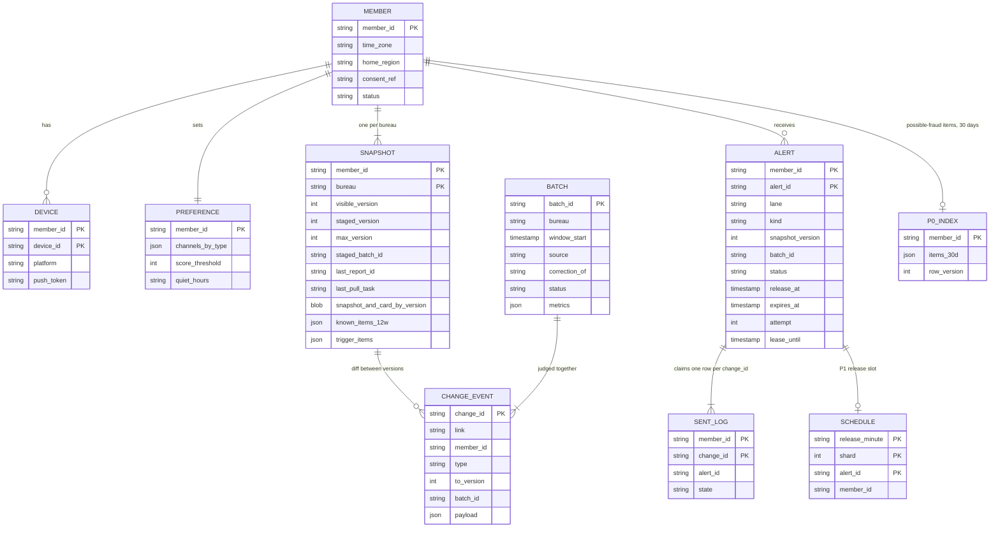

Access patterns that justify it:
- **Everything member-scoped is keyed by `member_id` first.** A diff, a decision and a send each touch one member's rows, so every write is a single-partition operation. No cross-member transaction exists anywhere.
- **Snapshot by `(member_id, bureau)`**, row key prefixed with a hash of the member id so consecutive ids do not land on one tablet. The diff reads it, diffs against `visible_version`, and writes a new staged version (number from `max_version`) with a **compare-and-set on the pointers it read**; the promoter flips `visible_version` only if `staged_batch_id` is still its batch and the version is newer; the read path reads `visible_version` and its score card. Versioned cells keep the last ~3 versions; older ones go to the lake.
- **`known_items_12w`**: every account and inquiry key seen in the last 12 weeks. A tradeline that vanishes for one report and comes back is not "new" (§4.2). **`trigger_items`**: bureau record keys already alerted by a monitoring trigger, so the weekly report recognizes them by key, not by name.
- **Sent-log by `(member_id, change_id)`**, insert-if-absent, storing the claiming `alert_id`. A retry or replay of the same bureau record finds the row: if the stored `alert_id` is this event's own, it is a crashed attempt of ours and carries on; if not, it is dropped (§5.4).
- **Alert by `(member_id, alert_id)`**: P0 `alert_id = hash(member, P0, change_id)`, one per change (a trigger creates no version, so a version-based id would merge an identity-theft burst into one alert); P1 `alert_id = hash(member, bureau, snapshot_version, P1)`. State moves only by conditional update: `PENDING → SENDING` (with a lease) `→ SENT`.
- **P0 index by `member_id`**: read, match, compare-and-set. The trigger pool and the report pool are different consumers, so only the compare-and-set serializes their link decisions.
- **Schedule by `(release_minute, shard)`**: a timer table. The scheduler for shard `s` scans minute `m`'s rows. 64 shards by member hash [estimate].
- **Batch by `batch_id`**: ~200 rows a day (2 bureaus × 96 fifteen-minute windows, plus triggers and files). Tiny; relational.
- **Raw reports** in object storage under `bureau/date/member_hash/report_id`, encrypted per member, 90-day lifecycle rule. **History** as Parquet partitioned by `(bureau, week)`, encrypted per file (§5.7).

---
## 4. High-level design

One subsection per functional requirement. Each traces input to output through the boxes, adds the boxes it needs to one diagram, and ends with what is still missing. The design at the end of §4 is deliberately the simple version: it works on a quiet Tuesday and falls over on the first bunched morning. §5 breaks it.

### 4.1 Refresh: every member, every bureau, every week, at a steady rate

The idea: **give every member a fixed second of the week.** `slot = hash(member_id) mod 604,800`. The same ~165 members are due every second, forever.

**Flow: member m_7 is due at Tuesday 02:13:07.**

1. The **refresh scheduler** keeps a slot index: member ids bucketed by minute of the week (10,080 buckets of ~9,900). Each second it takes the members whose slot is now and emits one pull task per bureau, `(m_7, TU, 2026-W41)` and `(m_7, EQ, 2026-W41)`, to the pull workers.
2. A **pull worker** takes a token from that bureau's token bucket (the contracted rate; we use ~165/s steady) and calls the bureau's API over mutual TLS with m_7's identity token and consent reference. This is a soft inquiry: it does not affect the score. FCRA allows it because the consumer asked in writing ("in accordance with the written instructions of the consumer to whom it relates", [15 U.S.C. 1681b(a)(2)](https://www.law.cornell.edu/uscode/text/15/1681b)).
3. The ~30 KB response is encrypted and written to **object storage** under `TU/2026-10-06/<hash>/r_881`, with a 90-day lifecycle rule.
4. The worker produces a pointer `{m_7, TU, r_881, uri, pulled_at}` to Kafka `reports`, keyed by `member_id`, then records `last_pull_task` on the snapshot row. A crash before the record means the task is retried; the pull task id makes the retry find the stored report instead of pulling (and paying) twice.
5. **Monitoring triggers** arrive between refreshes: the bureau posts a signed `NEW_HARD_INQUIRY` for m_7. The **trigger receiver** checks the signature, writes it to `reports` with `acks=all`, and only then answers 200. The bureau retries until it gets one; `(bureau, trigger_id)` dedups the retries.
6. **Catch-up** after an outage: overdue members are pulled at a fixed extra rate (+50% [estimate]) on top of the current slots, oldest first. Next week everyone is back on their own slot.

Data model touched: the snapshot row's `last_pull_task` and `last_pulled_at`; raw reports in object storage.

**What breaks, rung by rung.**
- **Naive: one cron at 2 AM Sunday.** 200 M pulls in a 4-hour window is `200 M ÷ 14,400 s = ~13.9k/s`, 42x the steady rate. The bureau's API limit, our KV writes and the alert volume all spike in the same 4 hours, every week.
- **Better: refresh 7 days after the last pull.** Spread only if it starts spread. A marketing week that adds 5 M members, or a 6-hour outage that makes 3.6 M members overdue at once, becomes a weekly spike that never heals.
- **Chosen: a hashed fixed slot.** Uniform by construction (each minute holds ~9,900 members, a standard deviation of ~100, so ±1%), stable (a member's slot never moves), and self-healing (catch-up is a rate; the slots stay uniform). Both bureaus in the same second, so one member's two reports arrive together and their alerts can share one push (coalesced at release, §5.1).

**If the bureau sends batch files instead.** Some bureau products deliver a file on the bureau's schedule: 100 M records at 2 AM. Then we cannot spread the pulls, and smoothing moves downstream. A **file replayer** splits the file into chunks and feeds `reports` at a rate we pick (~20k/s [estimate], bounded by the KV's spare write capacity, so 100 M takes ~83 minutes), the gate judges each chunk as a batch (§5.3), and the **delivery scheduler** (§5.1) does the pacing that matters. Both work. **We pick per-member pulls on slots plus triggers**, because they make every minute look the same, a bad response hurts one member instead of a whole file, and the two bureaus line up per member. But the downstream never assumes it: the slots are an optimization, the delivery scheduler is the guarantee. [`deep-dives/bureau-ingestion-and-refresh-scheduling.md`](deep-dives/bureau-ingestion-and-refresh-scheduling.md).

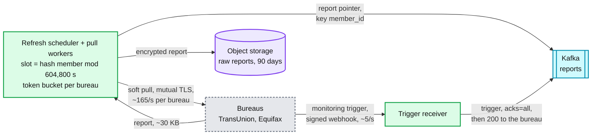

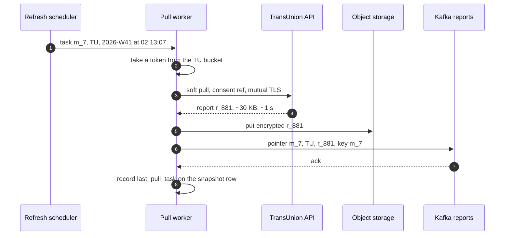

**What is still missing:** the report is stored, but nothing compares it with last week's. §4.2.

### 4.2 Detect changes: diff each report against the last snapshot

The idea: **one pure function, `diff(previous snapshot, new report) → (new snapshot, typed events)`, run per report as it arrives.** The same library runs in the stream path and in the file replayer.

**Flow: m_7's TransUnion report r_881 arrives.**

1. A **diff worker** (one consumer group on `reports`, 64 partitions keyed by member) takes the pointer and fetches r_881 from object storage.
2. It **normalizes** the bureau format into a canonical snapshot: score `{model: VantageScore 3.0, value: 688}`, tradelines and inquiries with a stable `bureau_item_key` (the bureau's own record id when the response carries one, else subscriber code plus date), collections, public records, personal info. It precomputes the **score card** the app will show: score, delta, the top 3 reasons.
3. It reads m_7's snapshot row: version 41, the snapshot, `known_items_12w`, `last_report_id`.
4. If `last_report_id` is already r_881, this is a redelivery: re-emit the same events (their ids are deterministic) and stop.
5. **Diff.** Score: 712 to 688, delta -24, same model. Items: inquiry `X Bank, 2026-10-03` is not in `known_items_12w` (nor in `trigger_items`): `NEW_HARD_INQUIRY`. Card `Y` went from 18% to 41% of its limit: `BALANCE_BAND_CHANGED` (crossed 30%).
6. It writes version 42 (snapshot, score card, `last_report_id = r_881`, updated `known_items_12w`) with a **compare-and-set on the version it read**. If another worker won (a duplicate delivery after a rebalance), it re-reads and lands in step 4.
7. It produces three change events to `change-events`, keyed by member, with `change_id = hash(m_7, TU, NEW_HARD_INQUIRY, bureau_item_key, period)` and so on (the one definition, §3.2), plus the snapshot to a history topic that a sink writes to Parquet. Then it commits the Kafka offset.

Data model touched: `SNAPSHOT` (read, compare-and-set), `CHANGE_EVENT`, the history lake.

**What breaks, rung by rung.**
- **Naive: a weekly SQL join of this week's table against last week's.** A 400 GB scan per run, untyped output ("this row differs"), and it runs as one batch, so its output is a herd by construction.
- **Good: diff each report against the last snapshot as it arrives.** Steady ~330/s, typed events. But a tradeline the bureau drops for one week and restores the next becomes a "new account" when it comes back. If 0.5% of reports blink like that [estimate], that is **~1 M false possible-fraud alerts a week**.
- **Chosen: the per-report diff plus three guards.** Deterministic `change_id`s (a retry or replay produces the same ids, so dedup works downstream). A 12-week **known-items memory** (an item seen in the last 12 weeks is never "new"). A **model-aware** score diff (a switch from VantageScore 3.0 to 4.0 is a model change, not a score change, and emits no `SCORE_CHANGED`).

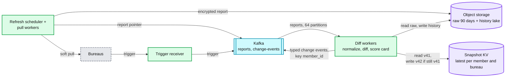

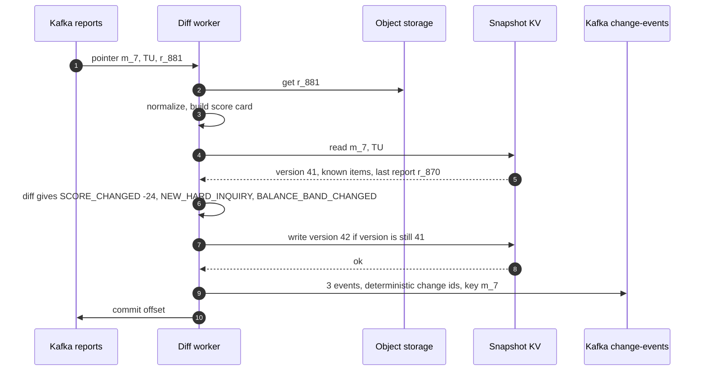

**What is still missing:** ~300 M events a week and nobody decides which ones deserve to interrupt a person. Sent as they come, that is ~3 pushes per member per week, most of them for 1-point wiggles. §4.3. [`deep-dives/change-detection-and-materiality.md`](deep-dives/change-detection-and-materiality.md).

### 4.3 Decide and alert: only material changes, once, at a decent hour

The idea: **a change becomes an alert only if it passes four filters (material, wanted, not already sent, under the cap), and its type picks the lane.**

**Materiality per change type** (the answer to "is a 1-point move worth an alert?"):

| Type | Material when | Lane | Why |
|---|---|---|---|
| `NEW_HARD_INQUIRY` | always | P0, now | Someone applied for credit in your name, maybe not you |
| `NEW_ACCOUNT` | always | P0, now | The other identity-theft signal |
| `NEW_DELINQUENCY`, `NEW_COLLECTION`, public record | always | P1, first in the window | Bad news the member can act on, not fraud |
| `PERSONAL_INFO_CHANGED` | address or name changed | P1 (P0 if the member opts in) | Sometimes fraud, mostly a move |
| `SCORE_CHANGED` | abs(delta) at least the member's threshold, default 10 points [estimate], same score model | P1 | Coalesced with the report's other changes |
| `BALANCE_BAND_CHANGED` | utilization crossed 10, 30, 50 or 75% | P1, inbox only when alone | Explains a score move; rarely worth a push by itself |
| `ACCOUNT_CLOSED`, item removed | never pushed | inbox and weekly digest | Informational |

**Flow: m_7's three events from version 42.**

1. The **alert decider** consumes `change-events`. Keyed by member, so one consumer sees all of m_7's events in order. It groups them by `(member, bureau, to_version)`.
2. **Materiality** keeps `SCORE_CHANGED -24` (over 10) and `NEW_HARD_INQUIRY`. `BALANCE_BAND_CHANGED` rides along as a reason, not an alert.
3. **Preferences**: m_7 wants inquiries by push and email, score changes by push. (P1 re-checks preferences, quiet hours and time zone at release, §5.1: the member may change them in the hours between.)
4. **Dedup**: insert-if-absent into `SENT_LOG` on each change's exact `change_id`, storing the alert id that claims it. A redelivered event finds the row; if the stored alert id is its own (a crashed attempt), it carries on, otherwise it is dropped. **Cross-bureau** is a separate, softer question: before pushing a P0, the decider compare-and-sets the member's **P0 index**; if it already holds the other bureau's item from the same canonical lender within ±3 days (inquiry) or ±31 days plus the same account type (account), the new one only adds "also on your Equifax report" to the inbox entry. When unsure, push twice: a duplicate costs one notification, a wrong merge hides fraud. Never a month-level key: two real inquiries from one lender in one month is the identity-theft pattern ([`deep-dives/change-detection-and-materiality.md`](deep-dives/change-detection-and-materiality.md) §4).
5. **Lane**: the inquiry is P0, so alert `a_1 = hash(m_7, P0, change_id)`, one per change, is released now. The score change is P1: alert `a_2` gets `release_at = next 08:00 local`, one release time per time zone, the simplest thing that works (§5.1 spreads it), and `expires_at = release_at + 72 h` [estimate].
6. **Caps** (P1 only): at most 1 push a day and 3 a week per member [estimate]. Over the cap, the alert is inbox-only and its sent-log rows say `INBOX_ONLY`. P0 is never frequency-capped, only deduped.
7. **Quiet hours** (default 21:00 to 08:00 local [estimate]): P1 never releases inside them by construction. A P0 alert inside them still goes out at once, as email plus a push without sound, so the 5-minute promise holds and nobody is woken at 3 AM for the car loan they applied for themselves.
8. Right after each claim the decider writes the `ALERT` row (`PENDING`) and the inbox entry, publishes `a_1` to `alerts-p0`, and writes `a_2` into the `SCHEDULE` timer table under minute 08:00.
9. A **sender** consumes `alerts-p0` at once. A timer scans `SCHEDULE` every minute and sends whatever is due. Sending: claim the alert `PENDING → SENDING`, call APNs, FCM or the email provider, mark `SENT`.

Data model touched: `PREFERENCE`, `SENT_LOG`, `ALERT`, `SCHEDULE`, the inbox.

**What breaks, rung by rung.**
- **Naive: alert on every change event.** 300 M a week. LinkedIn's notification platform (Air Traffic Controller, ATC) reported that rate limiting and aggregating cut member complaints "in half" ([LinkedIn, 2018](https://www.linkedin.com/blog/engineering/messaging-notifications/air-traffic-controller-member-first-notifications-at-linkedin)); the reverse is uninstalls and push opt-outs.
- **Good: a threshold per type.** Still sends the same new account twice (once per bureau), three pushes for one report, and wakes people at 2 AM.
- **Chosen: materiality per type, coalescing, exact per-bureau ids with a cross-bureau link for display, caps, quiet hours and two lanes.** What it costs: a 12-week memory, a sent-log row per alerted change (~650 GB a year), and an alias table of lender names someone must own.

```mermaid
%% Incremental diagram, step 3 of 4: the decider filters, dedups and assigns a lane. A simple sender sends P0 at once and P1 when the timer says it is due.
flowchart LR
    RS["Refresh scheduler +<br/>pull workers"] -->|"soft pull"| BU[Bureaus]
    BU -->|"trigger"| TR[Trigger receiver]
    RS -->|"encrypted report"| OBJ[(Object storage)]
    RS -->|"report pointer"| K[[Kafka<br/>reports, change-events,<br/>alerts-p0]]
    TR -->|"trigger"| K
    K -->|"reports"| DW[Diff workers]
    DW -->|"compare-and-set version"| KV[(Snapshot KV)]
    DW -->|"change events"| K
    K -->|"change-events by member"| DEC[Alert decider<br/>materiality, prefs,<br/>dedup, caps, lane]
    DEC -->|"sent-log claim, alert,<br/>P1 schedule row"| AS[(Alert store<br/>prefs, alerts, sent-log,<br/>schedule)]
    DEC -->|"P0 alert"| K
    K -->|"alerts-p0"| SND[Sender<br/>+ P1 timer]
    AS -->|"P1 due this minute"| SND
    SND -->|"push, email"| PRV[APNs, FCM,<br/>email provider]
    PRV -->|"notification"| APP[Member app]

    class RS,TR,DW,DEC,SND service
    class BU,PRV external
    class OBJ,KV,AS store
    class K queue
    class APP client

    classDef client   fill:#dbeafe,stroke:#2563eb,stroke-width:2px,color:#111
    classDef service  fill:#dcfce7,stroke:#16a34a,stroke-width:2px,color:#111
    classDef store    fill:#ede9fe,stroke:#7c3aed,stroke-width:2px,color:#111
    classDef queue    fill:#cffafe,stroke:#0891b2,stroke-width:2px,color:#111
    classDef external fill:#e5e7eb,stroke:#6b7280,stroke-width:2px,color:#111,stroke-dasharray:4 3
```

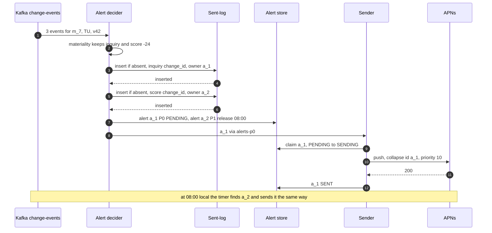

**What is still missing:** the timer sends whatever is due as fast as it can. On a bunched morning, everything due at 08:00 Eastern goes out in minutes. And when the member taps, there is nowhere to read the new score from. §4.4.

### 4.4 Show it: the tap opens the new score and the reason

The idea: **the score card is computed at diff time, so the read path is a lookup.**

**Flow: m_7 taps the 08:00 push.**

1. The app opens on the deep link carried by the push: `alert_id = a_2, bureau = TU, v = 42`.
2. It calls `GET /v1/scores?bureau=TU&min_version=42`, plus ~9 other home-screen calls (profile, the other bureau's score, inbox, offers, configuration).
3. The **score read API** looks in the **page cache** (Redis) under `card:m_7:TU` (in this first version, keyed by member, 1-hour TTL, time to live).
4. On a miss it reads the snapshot row's score card for the latest version from the KV and fills the cache.
5. It returns `{score: 688, delta: -24, version: 42, report_date, reasons: ["New hard inquiry from X Bank on Oct 3", "Card Y balance rose from 18% to 41% of its limit"]}`. The reasons come from the change events, stored in the score card at diff time, so the read path computes nothing.
6. The app posts `/v1/alerts/a_2/opened` for analytics. (In this first version the scheduler would use that open rate; §5.1 replaces it with `p × k` measured from tagged read requests.)

Data model touched: the snapshot row's score card; the page cache; the alert's `opened_at`.

**What breaks, rung by rung.**
- **Naive: the app shows its locally cached score and refreshes in the background.** The member who tapped "your score changed" sees last week's 712 first.
- **Good: always ask the server, with a TTL cache keyed by member.** An entry cached 20 minutes before version 42 was written still says 712 for up to 40 more minutes.
- **Chosen: the score card precomputed at diff time, and a cache keyed by version with `min_version` from the alert.** Built in §5.5.

```mermaid
%% Incremental diagram, step 4 of 4: the read path. The design is complete for one quiet morning. Section 5 breaks it.
flowchart LR
    RS["Refresh scheduler +<br/>pull workers"] -->|"soft pull"| BU[Bureaus]
    BU -->|"trigger"| TR[Trigger receiver]
    RS -->|"encrypted report"| OBJ[(Object storage)]
    RS -->|"report pointer"| K[[Kafka]]
    TR -->|"trigger"| K
    K -->|"reports"| DW[Diff workers]
    DW -->|"version + score card"| KV[(Snapshot KV)]
    DW -->|"change events"| K
    K -->|"change-events"| DEC[Alert decider]
    DEC -->|"alerts, sent-log"| AS[(Alert store)]
    AS -->|"due alerts"| SND[Sender + P1 timer]
    SND -->|"push, email"| PRV[APNs, FCM, email]
    PRV -->|"notification"| APP[Member app]
    APP -->|"GET score, min_version"| API[Score read API]
    API -->|"get card"| PC[(Page cache<br/>Redis)]
    API -->|"miss: score card"| KV

    class RS,TR,DW,DEC,SND,API service
    class BU,PRV external
    class OBJ,KV,AS store
    class K queue
    class APP client
    class PC cache

    classDef client   fill:#dbeafe,stroke:#2563eb,stroke-width:2px,color:#111
    classDef service  fill:#dcfce7,stroke:#16a34a,stroke-width:2px,color:#111
    classDef store    fill:#ede9fe,stroke:#7c3aed,stroke-width:2px,color:#111
    classDef cache    fill:#fef3c7,stroke:#d97706,stroke-width:2px,color:#111
    classDef queue    fill:#cffafe,stroke:#0891b2,stroke-width:2px,color:#111
    classDef external fill:#e5e7eb,stroke:#6b7280,stroke-width:2px,color:#111,stroke-dasharray:4 3
```

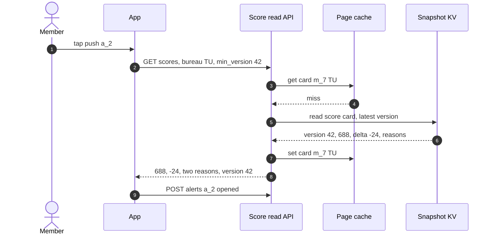

**What is still missing:** everything in §5. At 08:00 on a bunched morning the timer releases 12.5 M pushes in minutes and ~33k requests a second arrive at a 30k read path (§5.1). A P0 alert can sit behind a P1 backlog in the same sender (§5.2). One bad bureau batch becomes millions of false alerts (§5.3). A sender crash sends twice or never (§5.4). A cache entry or a lagging replica shows the old score (§5.5). And nothing yet says what happens when a region, the KV or a push provider fails (§5.6), or what 7 years of credit files cost to keep (§5.7).

---
## 5. Deep dives

One per non-functional requirement, phrased as the interviewer's question. Each names what breaks in the §4 design with a number, fixes it, and lists what changed in the API, the data model and the diagram.

### 5.1 "The bureau delivers 100 M updated reports at 2 AM. What happens at 2:05, and where exactly is the herd?"

**What breaks in the current design.** The herd has three possible places. Say all three, then say which one is real.

1. **Bureau pulls.** With slots (§4.1) this is ~165/s per bureau every second of the week. If the bureau sends a file instead, the 100 M arrive at 2 AM whatever we do.
2. **The diff and alert pipeline.** Fed a 100 M file as fast as it can go, 64 diff workers at ~1k reports/s each would push ~64k reports/s, which is ~128k KV operations a second (one read, one compare-and-set each). That is the same KV the app reads from. **Fix: bounded, partitioned processing.** The file replayer feeds `reports` at ~20k/s [estimate], so the file takes ~83 minutes and the KV sees a flat ~40k operations/s it was sized for. **At 2:05** about 6 M reports are diffed and ~0.75 M alerts exist: ~0.65 M P1 scheduled for the morning, and ~0.1 M P0 that go out as soon as their 1 M-record chunk passes the gate (about a minute), paced by the P0 cap, as email plus a push without sound because it is quiet hours. Nobody's phone lights up.
3. **The app read path after the pushes. This is the real herd.** §4.3 releases each time zone at 08:00. On a normal day that is ~1.8 M Eastern pushes at once: `1.8 M × 8% = 144k opens` in ~3 minutes, `~800 opens/s × 10 requests = 8k/s` plus 5.5k organic, **13.5k/s (45%)**. Fine. On a bunched day it is 12.5 M: **~33.5k/s against 30k (112%)**, every open a cache miss because the score just changed, and app retries on timeouts add a third. What bunches: a bureau that sends weekly files (both landing the same night), a sender or provider outage in the morning window, a large lender reporting a whole portfolio on one day. What does not: a 6-hour gate hold (~450k alerts) or a 6-hour ingestion outage (P1 waits for the morning anyway, and catch-up is a rate).

So the red node is the **member read path**: the score API and the snapshot reads behind it, ~30k requests/s.

**Push back on the textbook answers.**
- **"Autoscale the read path."** A push-driven spike peaks about 2 minutes after delivery. A new stateless server takes ~2.5 to 3 minutes from the autoscaler noticing to serving traffic (worked out in [`../news-aggregator/deep-dives/breaking-news-and-load-shedding.md`](../news-aggregator/deep-dives/breaking-news-and-load-shedding.md) §5), and the KV and cache behind it do not scale in minutes at all. And this spike is ours: pacing costs nothing, capacity costs money. Pre-scale only for a release we know is big.
- **"Put the pushes on a queue."** A queue paces the sender, not the opens. Opening is the member's choice. The only lever we hold is the release rate.
- **"Ask Google for more FCM quota."** 600k a minute is not our limit; the read path is. More quota lets us hurt ourselves faster.

**The fix: a delivery scheduler that releases by headroom, not by clock.**
- **Spread across the window by member.** `release_at = window_start + hash(salt, member_id) mod 180 minutes`. Hashing the member (not the alert) puts a member's TransUnion and Equifax alerts in the same minute, so the scheduler **coalesces them into one push** at release. A bunched Eastern morning becomes ~1.2k pushes/s, ~2.3k requests/s. A normal one is ~170 pushes/s.
- **A cap from measured headroom.** `R_cap = (0.7 × C − B(t)) ÷ p̂k̂`, where `C` is the read path's capacity (30k), `B(t)` its measured organic load, and `p̂k̂` the requests one push brings. At 5.5k organic and `p̂k̂ = 2`, `R_cap = 15.5k ÷ 2 = ~7.75k pushes/s`.
- **`p × k` is the one input not measured before you need it, so measure it on this release.** The push's deep link tags every request with `alert_id`; every 10 s the controller divides tagged load by the opens the pushes already sent should have produced by now, uses `max(2, p̂k̂)`, and trusts it only once expected opens pass ~300/s. A backlog's alerts are alarming exactly when it is large, so "the last hour's opens" would be the wrong prior. At a true `p × k = 4`, releasing at 7.75k/s settles at `5.5k + 31k = 36.5k/s`, 122%.
- **Slow start, steps sized for a 2x error, one cut per window.** Start every release at 1k pushes/s. Every 2 minutes add `ΔR = 0.3 × C ÷ (4 × p̂k̂)` (~1.1k/s at 2): even if `p̂k̂` is 2x low, one unobserved step eats 15% of capacity, inside the 30% margin. Over 75% or p99 over the SLO (service level objective): halve, then neither cut nor grow for 2 minutes, because the metric lags 30 to 60 s and a 10-second halving loop cuts 3 to 6 times for one overload. "Open debt" means the load still to come from pushes already sent (the predicted future peak), not the load arriving now, which the measured load already contains. Simulated in [`deep-dives/fan-out-and-herd-control.md`](deep-dives/fan-out-and-herd-control.md) §6: every case stays under 70% (even `p × k = 6`); 8 M overdue drains in ~22 minutes at a correct estimate and ~36 at a 2x error, against 60 to 108 minutes for the 10-second halving.
- **Re-check at release.** Preferences, quiet hours and the device's current time zone are re-read with the warm read; a member who flew to Los Angeles is moved to the next window in the new zone. Caps are counted at claim, so a superseded alert does not burn the day's push.
- **Order within the budget.** P0 first (~5/s; if the trigger feed turns out to be a daily file, ~430k at once, P0 is paced at its own cap of ~500/s [estimate] and its promise is measured from receipt), then overdue P1 oldest first, then P1 due now. Whatever cannot go before the window ends rolls to the evening window (18:00 to 20:00 [estimate]) or expires if a newer version superseded it.
- **Warm before the push.** Two minutes before a slice is released, the scheduler copies each member's score card for the cited version from the KV into the page cache as `card:{member}:{bureau}:v{n}`. The KV sees a smooth ~1.2k reads/s instead of a ~2.8k/s burst of misses, and the opens become cache hits. The same read checks `visible_version ≥ n` (read-your-alert, §5.5); if not, the alert waits.
- **Seen-suppression.** If the member already opened the app and saw version `n` before the release, the P1 push is dropped and the inbox keeps it. Fewer pushes, fewer opens.
- **Pre-scale for a known big release.** If tomorrow's backlog is over 2x normal, the scheduler asks the read-path team's autoscaler for +50% from 07:30 [estimate].
- **If the read path saturates anyway** (an organic spike, a news story about credit), it sheds non-essential home-screen calls first and keeps serving cached score cards: the same shed ladder as [`../news-aggregator/`](../news-aggregator/) §5.5. The scheduler sees the utilization and stops releasing.

**What changed.** The P1 timer becomes a delivery scheduler with a slow-start headroom controller. `SCHEDULE` rows are spread by member hash and coalesced per member at release. Push deep links tag requests with `alert_id`. New internal API `GET /internal/read-path/headroom` (with tagged load). Page-cache keys carry the version. `ALERT` gains `rolled_over`. [`deep-dives/fan-out-and-herd-control.md`](deep-dives/fan-out-and-herd-control.md).

```mermaid
%% Herd control after 5.1. The scheduler releases by the read path's measured headroom and warms each card first. Red is the member read path, the first thing to break on a bunched morning.
flowchart LR
    AS[(Alert store<br/>schedule by minute)] -->|"P1 due by member hash,<br/>overdue first"| SCH[Delivery scheduler<br/>slow start, measured p x k,<br/>coalesce per member]
    API -->|"utilization, p99, organic<br/>and alert-tagged load, 10 s"| SCH
    SCH -->|"T minus 2 min,<br/>read card v42"| KV[(Snapshot KV)]
    SCH -->|"warm card m_7 TU v42"| PC[(Page cache<br/>keyed by version)]
    SCH -->|"release slice, from 1k/s,<br/>+1.1k/s per 2 min up to R_cap"| SND[Senders]
    SND -->|"push"| PRV[APNs, FCM]
    PRV -->|"notification"| APP[Member app]
    APP -->|"p x k requests per push,<br/>tagged with alert_id"| API["Member read path<br/>score API, ~30k req/s"]
    API -->|"hit"| PC
    API -.->|"miss only"| KV

    class SCH,SND service
    class AS,KV store
    class PC cache
    class PRV external
    class APP client
    class API critical

    classDef client   fill:#dbeafe,stroke:#2563eb,stroke-width:2px,color:#111
    classDef service  fill:#dcfce7,stroke:#16a34a,stroke-width:2px,color:#111
    classDef store    fill:#ede9fe,stroke:#7c3aed,stroke-width:2px,color:#111
    classDef cache    fill:#fef3c7,stroke:#d97706,stroke-width:2px,color:#111
    classDef critical fill:#fee2e2,stroke:#dc2626,stroke-width:4px,color:#111
    classDef external fill:#e5e7eb,stroke:#6b7280,stroke-width:2px,color:#111,stroke-dasharray:4 3
```

| Morning | Pushes | Release rate | Read-path load (with 5.5k organic) |
|---|---|---|---|
| Normal, §4 timer at 08:00 | 1.8 M Eastern | all in ~3 min | ~13.5k/s, 45% |
| Bunched, §4 timer at 08:00 | 12.5 M Eastern | all in ~5 min | **~33.5k/s, 112%** |
| Bunched, spread over 3 h | 12.5 M | ~1.2k/s | ~7.8k/s, 26% |
| 90-min sender outage on a bunched morning, 8 M overdue at 09:30 | 8 M | from 1k/s, ramping to ~7.75k/s | peak ~60% (~67% if `p × k` is 4), drained in ~22 min (~36) |

### 5.2 "A new account could be identity theft. How does that alert get out in under 5 minutes while 25 M score alerts wait for the morning?"

**What breaks in the current design.**
1. **One sender pool.** At 08:00 the §4 timer puts ~1.8 M Eastern P1 pushes in the same worker queue as any P0 alert. At ~10k sends/s a P0 behind them waits ~3 minutes; behind a bunched 12.5 M morning, ~20.
2. **One FCM quota.** A P1 release that uses all 600k messages a minute makes the P0 push get `429 RESOURCE_EXHAUSTED`.
3. **One `reports` topic.** In file mode a trigger lands behind up to 83 minutes of file.
4. **The gate** (§5.3) would hold a trigger for its 15-minute window.

**The fix: a separate lane end to end, small on purpose.**
- **Own topics and pools.** Triggers go to `triggers`, not `reports`. A trigger needs no full diff: one KV read checks the item against `known_items_12w`, and the trigger path writes its `bureau_item_key` into `trigger_items` so next week's report knows it was alerted. Then its own decider instances, `alerts-p0`, its own sender pool with its own APNs connections.
- **Reserved budgets.** The scheduler caps P1 at 80% of the FCM project quota (480k a minute) and leaves 120k for P0 [estimate]. P0 takes the read-path budget first rather than bypassing it: at ~5/s, even 10x is ~100 requests/s. But nothing public says the trigger feed is a stream; if it is a daily file, ~430k triggers (`3 M a week ÷ 7`) land at once, so P0 has its own rate cap (~500/s [estimate]) and the promise for a file is "15 minutes from receipt", said out loud.
- **The gate checks triggers by rate, not by window.** Triggers per bureau per 5 minutes against the same hour last 4 weeks; hold only above 5x and an absolute floor. Normal triggers wait for nothing.
- **Latency budget, trigger to push:**

| Step | Typical | Bad case inside the budget |
|---|---|---|
| Bureau webhook, signature, `acks=all` write | 50 ms | bureau retry after our 5xx: 30 s |
| Trigger check: one KV read of known items | 20 ms | consumer rebalance: 30 s |
| Decide, sent-log insert | 20 ms | |
| Kafka hops (3) | 50 ms | |
| Sender claim, APNs or FCM call | 300 ms | provider retry with backoff: 60 s |
| **Total** | **~0.5 s** | **~2 min, inside 5 min p95** |

- **Say what the promise covers.** "5 minutes from the bureau event" is from the trigger. A new account first seen in a weekly report was already up to 7 days old when we pulled it; it rides the P0 lane after its batch passes the gate (at most ~17 minutes).
- **Cross-bureau and bursts.** The first bureau to report pushes; a linked item from the second bureau (P0 index match, §4.3) only updates the inbox entry. Three inquiries from three banks in an afternoon are three changes and three alerts: P0 ids are per change, never per (member, bureau, version), which would merge the burst into one.

**Push back on the textbook answer.** "Make the whole pipeline real-time, then fraud is fast for free." The weekly reports do not get fresher by being processed in real time, and the morning batching is what protects the read path. Keep the fast lane tiny (~5/s) and keep everything else slow on purpose.

**What changed.** `triggers` topic, P0 decider and sender pools, `alerts-p0`, the FCM split, a rate-based trigger gate. [`deep-dives/fan-out-and-herd-control.md`](deep-dives/fan-out-and-herd-control.md), [`deep-dives/preferences-dedup-and-delivery.md`](deep-dives/preferences-dedup-and-delivery.md). Two lanes are drawn in the final design (§6) and in [`diagrams.md`](diagrams.md#d2-data-flow-dfd).

### 5.3 "A bad bureau batch drops everyone's score by 80 points. How do you stop it before the pushes go out?"

**What breaks in the current design.** In §4 every report becomes visible and alertable on its own. A bureau-side bug in one 15-minute window of TransUnion pulls (~150k reports) drops 30% of scores by 50 or more: **~45k false "your score dropped" alerts**, and everyone who opens the app sees the wrong score. If it runs 6 hours before someone notices, it is 24 windows and **~1 M false alerts**. In file mode, one file is 30 M. Per member, -80 is plausible: a 60-day late payment can do it. Only the distribution is impossible.

**The fix: judge each batch, hold alerting and visibility, keep ingesting.**
- **A batch** is `(bureau, source, window)`, cut by processing time: slot pulls, catch-up pulls and replays in 15-minute windows (~150k reports per bureau), file chunks of 1 M records [estimate], triggers by rate (§5.2). Each source has **its own baseline**: a catch-up window carries two-week diffs and scores z = 34 against the slot pulls' same-hour baseline.
- **Diff against visible, write staged.** The diff base is always `visible_version`, never a staged version (a held, possibly bad version must never become anyone's base: diffing against it turns the next correct report into "+80"). The new version number comes from `max_version`, and the row records `staged_batch_id`. A newer report for the same member **supersedes** a still-held staged version: it cancels that member's held alerts from the old batch. Change events carry `batch_id`; the decider creates alerts in state `HELD` (a P0 found in a report too; only triggers skip this). **Held alerts claim the sent-log only when their batch passes**, so a cancelled batch never holds a claim that blocks a real change.
- **At window close** (wall clock past the end and every partition's consumer past it), the gate compares the batch's **shares** (never counts: a 30-minute consumer stall packs three windows into one) with the same source and hour-of-week over the last 4 weeks:

| Metric | Normal [estimate] | Floor [estimate] | The bad batch |
|---|---|---|---|
| Share of members with abs(delta) at least 50 | ~0.5% | 2% | 30% |
| Mean score delta | ~0 | ±5 points | -24 |
| `NEW_ACCOUNT`, item-removed, personal-info shares | ~1%, ~0.5%, ~0.3% | 3%, 2%, 1% | normal or wild |
| Parse errors, missing fields, score-model mix | ~0.01%, stable | 0.5%, any model change | often the actual cause |

  Hold when any metric is beyond a robust z-score of 6 **and** past its own floor. With 150k reports a 0.5% baseline is 750 ± 27, so detection power is never the problem; false holds on real shifts are, which is what the floors are for. A window that never closes (one poison report stalling a partition) is not a hold, it is silence: after 3 failures a report goes to a dead-letter queue, and a window still open 10 minutes after its end pages.
- **Pass.** For each member, the promoter sets `visible_version = v` **only if** `staged_batch_id` is still this batch and `v > visible_version` (one conditional write: no publishing a newer, unjudged version, no moving backward). ~165/s on average, done as a ~2.5k/s burst for about a minute after each window closes. Then the batch is `PASSED`, its alerts claim the sent-log and become `PENDING`. Visibility lags the pull by at most ~17 minutes (15-minute window, ~1 minute of checks, ~1 minute of promotion).
- **Hold.** Page the on-call and the bureau relationship owner. The app keeps showing the previous version. Ingestion continues, and the next windows are judged on their own. The **pull circuit opens only on raw-level errors** (bureau 5xx or timeouts, schema validation failures, unparseable raw responses), never on a plausible-looking distribution: if our parser is the bug, the stored raw reports are exactly what the replay needs, and opening the circuit for 6 hours would leave ~3.6 M members per bureau overdue and ~12 hours of catch-up. While open, a 1% probe keeps pulling and is judged as its own batch.
- **Decide.** `release` (a real mass event: a large lender reported a whole portfolio late), `release-types` (allowed only when the item-level metrics pass: the promoter writes a derived version from `max_version` with the new inquiries and accounts kept and the score fields carried over from the last visible version; it becomes visible, the inquiry and new-account alerts are re-pointed to it and go out, the score changes are voided; an alert must never cite a version that will not become visible), or `quarantine` (void the staged versions and their events, cancel the held alerts; they hold no claims, and any row is freed only where `alert_id` is the cancelled alert). Then `replay`: re-pull the batch's members, or re-diff the stored raw reports with a fixed parser, as a new batch (source `replay`) through the same gate. Versions only move forward.
- **A released batch later found wrong** is fixed by a replay batch with `correction_of = B`, diffed against the last good version, never by moving `visible` back. Members the sent-log says were alerted from B get one `CORRECTION` alert ("an earlier update was wrong"); everyone else is fixed silently. Diffing the fix against the wrong visible version would tell everyone "+80". The race-by-race walkthrough and its simulation are in [`deep-dives/bad-batch-circuit-breaker.md`](deep-dives/bad-batch-circuit-breaker.md) §5 and §6.

**Push back on the textbook answers.** "Sanity-check each record." Every bad record is individually plausible. "Auto-drop anomalous batches." Real mass events happen; a machine holds, a person releases. "Stop ingestion too." Holding visibility and alerts costs nothing; the stored reports are what we diagnose and replay from.

**What changed.** `SNAPSHOT.staged_version`, `visible_version`, `staged_batch_id`, `max_version`; the `BATCH` table with `source` and `correction_of`; `ALERT.status = HELD` and the `CORRECTION` kind; the gate, the guarded promoter and supersede-on-stage; the internal `:release`, `:release-types`, `:quarantine`, `:replay` calls. The diagram gains the gate between the diff and the decider. [`deep-dives/bad-batch-circuit-breaker.md`](deep-dives/bad-batch-circuit-breaker.md).

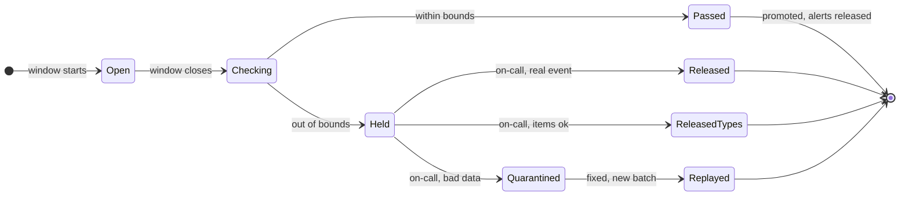

### 5.4 "The sender crashes after sending the push but before recording it. Twice or never?"

**What breaks in the current design.** Duplicates enter at six places: Kafka redelivers a change event to the decider; a scheduler restarts after publishing a slice but before marking it; a sender crashes between the provider's 200 and `SENT`; a region fails over with the alert store ~1 s behind; the same account appears on both bureaus; a batch is replayed. Losses enter at three: a decider crash between the sent-log claim and the `ALERT` row (the redelivery finds the claim and drops itself: 4,459 of 44,071 P0 changes at an exaggerated 1% crash rate in [`deep-dives/preferences-dedup-and-delivery.md`](deep-dives/preferences-dedup-and-delivery.md) §8); a burst of triggers sharing one alert id; and an offline phone (APNs "stores only one notification per bundle ID").

**The fix: dedup the change once, claim the send, and make a resend harmless on the device.**
1. **One alert per bureau record, ever, and the claim is re-entrant.** Insert-if-absent `SENT_LOG(member_id, change_id) → alert_id` (at decide time for triggers and P1 in §4; at batch pass for held alerts). On conflict, compare the stored `alert_id` with this event's deterministic one: equal means our own crashed attempt, so carry on and create the alert if absent; different means a real duplicate, so drop. (Equivalently, write claim and alert in one single-partition transaction; both are keyed by `member_id`.) P0 ids are per change, `hash(member, P0, change_id)`, so a burst of three inquiries is three alerts.
2. **Claim before sending.** Conditional update `PENDING → SENDING`, `attempt + 1`, `lease_until = now + 60 s`. The provider call has a **10 s timeout**, well inside the lease, so a slow provider cannot let two senders own one alert.
3. **Send with the alert id as the device-side key.** APNs `apns-collapse-id = alert_id`: "an identifier you use to merge multiple notifications into a single notification for the user", at most 64 bytes ([Apple](https://developer.apple.com/documentation/usernotifications/sending-notification-requests-to-apns)). FCM `android.notification.tag = alert_id`: "if specified and a notification with the same tag is already being shown, the new notification replaces the existing one" ([FCM reference](https://firebase.google.com/docs/reference/fcm/rest/v1/projects.messages)). A resend replaces; it does not add.
4. **Mark `SENT` only where `attempt` is still ours** (fenced by attempt), with the provider's id, so a late writer never overwrites a newer attempt.

| Crash point | What happens next | What the member sees |
|---|---|---|
| Before the claim | Another sender claims it | One push |
| After the claim, before the call | Lease expires, attempt 2 | One push, 60 s late |
| After the provider's 200, before `SENT` | Lease expires, resend with the same collapse id or tag | One notification, replaced in place. If the member already dismissed the first, it shows once more: the residual duplicate, bounded to a crash inside a ~150 ms window |
| After `SENT` | Nothing | One push |

- **Email has no collapse key.** P0 email is resent on an ambiguous attempt (two emails about a possible fraud beat none). P1 email is not (at most once; the inbox has it).
- **Never lose a P0.** The `ALERT` row is durable before it is published; a sweeper re-publishes any P0 still `PENDING` after 2 minutes and pages if one is older than 4.
- **The inbox is the record, the push is a pointer.** Inbox rows are upserted by `alert_id`, so a member whose phone was off for a week still sees every alert.
- **Token hygiene.** APNs `410` carries a `timestamp`, "the time ... at which APNs confirmed the token was no longer valid": delete the token only if it was last registered before that time, so a reinstall that re-registered the same token survives. FCM: "by default, FCM considers a registration to be stale if its app instance hasn't connected for a month" and rejects Android registrations inactive for 270 days ([Firebase](https://firebase.google.com/docs/cloud-messaging/manage-tokens)); tokens not seen in 30 days get email or inbox instead, and leave the open-rate denominator. APNs `429 TooManyRequests` is per device token: back off that token.

Exactly-once delivery to a phone is impossible (the provider's 200 can be lost); exactly-once **effect** on the screen is not. [`../../concepts/exactly-once.md`](../../concepts/exactly-once.md), [`deep-dives/preferences-dedup-and-delivery.md`](deep-dives/preferences-dedup-and-delivery.md). The crash sequence is [D5a in diagrams.md](diagrams.md#d5a-sender-crashes-after-apns-accepts-the-push).

**What changed.** The re-entrant claim; per-change P0 ids; `ALERT.attempt` and `lease_until` with an attempt-fenced `SENT`; the 10 s provider timeout; the P0 sweeper; collapse id and tag on every push; token staleness rules.

### 5.5 "The member taps the push and the app shows last week's score from a cache. How do you prevent that?"

**What breaks in the current design.** Four places can serve the old score: the app's local cache; the page cache keyed by member with a 1-hour TTL (§4.4); the KV replica in the other region, ~1 s behind normally and minutes during an incident; and a staged version the alert cites before it is visible.

**The fix: the alert names a version, and every layer refuses anything older.**
- **The alert carries `(bureau, v)`.** It is released only after `visible_version ≥ v` in the member's home region (checked by the warm read, §5.1).
- **The app**, opened from a push, never renders a score older than `v`: it shows the alert's own text and a skeleton until the server answers with version `≥ v`.
- **The cache is keyed by version.** `card:{member}:{bureau}:v{n}` is immutable, so it never needs invalidating. A pointer `cardv:{member}:{bureau} → n` with a 60 s TTL serves organic opens (up to 60 s stale, fine without a push).
- **The read API** follows the flow below. One cross-region read (~30 to 70 ms [estimate]) is the worst case, and it only happens when the local replica lags.

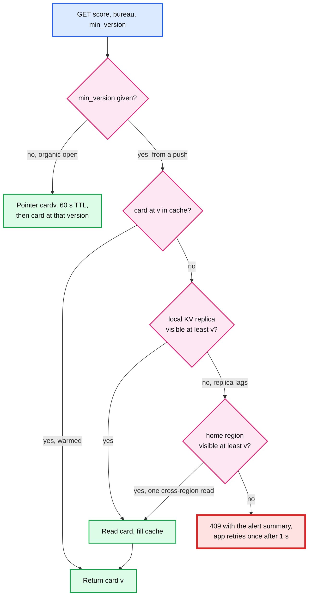

The red box is the one outcome that should never happen in steady state (the release check guarantees the home region has `v`). If it fires more than a handful of times a day, the invariant is broken and someone gets paged.

- **Versions only move forward.** If a released batch turns out to be wrong, the fix is a new version from `max_version`, diffed against the last good version, with a `CORRECTION` alert only to members who were told the wrong thing (§5.3), never a rollback of `visible_version`. A rollback would make `min_version = v` unsatisfiable.
- **A P0 from a trigger cites no version.** The inquiry is not in any visible report until the next pull, so its deep link opens the alert detail (lender, date, bureau, what to do), not the score page.

**What changed.** `min_version` on `GET /v1/scores`; version-keyed cache entries plus a pointer; the release check; the app rule. [`deep-dives/preferences-dedup-and-delivery.md`](deep-dives/preferences-dedup-and-delivery.md), [`../../concepts/caching-patterns.md`](../../concepts/caching-patterns.md).

### 5.6 "What fails, and what is the blast radius?"

**The layout.** Two US regions [estimate]. Each member has a **home region** (by member hash, 50/50) where their snapshot and alert rows are written, replicated asynchronously to the other. The pipeline for a member (pulls, diff, gate, decider, scheduler shard) runs in the home region. The read path is active-active in both, and each region is sized to carry all of it alone: the 30k the scheduler budgets against is what survives a region loss, so a region can die in the middle of a release without overloading the other. Kafka is per region, 3 replicas, `min.insync.replicas = 2`.

| What fails | Blast radius | What happens |
|---|---|---|
| A bureau API is down or slow | That bureau's pulls | Tasks retry with backoff; the per-bureau breaker opens on raw-level errors, with a 1% probe; overdue members catch up at +50%. A missed week only means the next diff covers two weeks |
| Trigger endpoint unreachable | P0 for one bureau | The bureau retries; the endpoint is behind DNS (Domain Name System) in both regions |
| A diff worker or decider dies | Its partitions, ~30 s | Rebalance; deterministic ids and compare-and-set make reprocessing safe |
| A scheduler shard owner dies | 1/64 of P1 releases, ~30 s | Lease expiry; another instance takes the shard; claims protect in-flight alerts |
| Page cache lost | Every open misses | KV reads rise; the headroom controller sees it and slows releases. Organic score reads (~1.1k/s) fit the KV with no cache |
| KV home region lost | Writes for half the members | Promote the replica (RPO, recovery point objective, about 1 s of snapshot writes; those reports are re-diffed from Kafka and raw storage). Reads continue from the replica with the §5.5 check |
| Alert store region lost | Sends for half the members | The other region takes the shards; up to ~1 s of `SENT` marks lost, so some pushes are resent and replaced on the device. P1 email may duplicate; accepted |
| APNs or FCM degraded, 429s | One platform | Backoff with jitter; P1 rolls within the window; P0 falls back to email |
| The read path itself | Every open | Release drops to zero; the read path sheds non-essential calls first |

Ingestion and diff at 99.9% is ~43 minutes a month of allowed downtime; catching up at +50% clears 43 minutes of backlog in ~86 minutes, still inside the same morning for P1. App reads at 99.95% (~22 minutes a month) come from running both regions active. The full tree is [D11 in diagrams.md](diagrams.md#d11-failure-mode-map) and the topology is [D9](diagrams.md#d9-deployment--topology).

**Push back.** "Write the sent-log synchronously across regions so a failover never resends." That puts ~70 ms [estimate] of cross-region latency on every send for an event that happens once a year, and the device already merges the resend. Accept the rare duplicate email instead.

### 5.7 "What does it cost to keep weekly snapshots for 100 M members for 7 years, and do you need them? And how do you handle FCRA data?"

**What breaks if you keep everything.** Full weekly history is `200 M × 2 KB × 52 × 7 = ~146 TB`. At ~$20 per TB-month for standard object storage [estimate] that is ~$2.9k a month by year 7, a few hundred at an archive tier. **The dollars are not the problem.** The problems are a breach that exposes 7 years of full credit files for 100 M people, a deletion request that must touch 364 weekly partitions, and every analyst query becoming a compliance review.

**The fix: keep what the product and the audit need, and nothing else.**

| Keep | Why | Size | How long |
|---|---|---|---|
| Snapshot rows per (member, bureau), last ~3 versions | The product and the diff | ~4.8 TB (~14 TB replicated) | While a member |
| Score series | The history chart | ~166 GB/year | Retention policy |
| Change events | The evidence behind every alert | ~3 TB/year | Retention policy |
| Alert log and sent-log | What we told whom, when, why | ~650 GB/year | Retention policy |
| **Evidence total** (series, events, alerts) | | **~3.8 TB/year** | |
| Raw reports | Replay and disputes | ~15 TB | 90 days |
| Full snapshot history | Replay of recent batches | ~5 TB | 13 weeks, then one per month or none |

How long "retention policy" is gets set by legal, not by this design; I could not verify a specific FCRA retention period on a primary page, so none is quoted.

**Deletion: crypto-shred where data is per member, rewrite where it is columnar.** KV rows, raw reports and backups are per-member blobs anyway, so each is encrypted under a per-member data key wrapped by the KMS (key management service); 100 M wrapped keys are ~10 GB in a key table, and deleting a member's key shreds those copies at once. Per-member encryption inside Parquet would defeat the columnar format (no dictionary encoding or statistics across members), so the lake is encrypted **per file** and a deletion is a table-format row delete plus a monthly compaction rewrite. The ~2 KB per snapshot-week assumes exactly that: columns compressed, then the file encrypted. Analytics runs on a de-identified copy (score bands, counts) that needs no deletion. A legal hold overrides deletion.

**FCRA and security basics.** Pulls only with a valid consent reference (the consumer's written instruction is the permissible purpose). Mutual TLS to the bureaus, KMS envelope encryption at rest, SSNs (Social Security numbers) tokenized at ingest and never stored in the KV. Services read member data by workload identity; people only through just-in-time access with a ticket, every read logged with its purpose. Push text has no score, creditor or account digits by default. A member who closes the account leaves the slot index the same day, so nobody pulls their file again.

**Push back on the textbook answer.** "Storage is cheap, keep it all for ML." Storage is cheap; liability is not. Features for models come from the change events and the score series, about a seventh of the bytes of full history.

The lifecycle (KV, raw 90 days, lake, archive, key deletion) is drawn in [D2b in diagrams.md](diagrams.md#d2b-data-lifecycle-and-retention).

**What changed.** Lifecycle rules on the lake and raw storage; the per-member key table for KV, raw and backups; per-file lake encryption with delete-by-rewrite; the slot-index removal on account close.

---
## 6. Final design and the six core flows

Everything from §5 composed. 14 nodes; zoom-ins in [`diagrams.md`](diagrams.md).

```mermaid
%% D3: final design. Red is the member read path: the scheduler's release rate is built around its headroom, and it is the first thing to break if releases bunch.
flowchart TD
    BU[Bureaus<br/>TransUnion, Equifax] -->|"reports ~330/s,<br/>triggers ~5/s"| ING["Ingest<br/>slots, pull workers,<br/>trigger receiver, file replayer"]
    ING -->|"encrypted raw"| OBJ[(Object storage<br/>raw 90 days + history lake)]
    ING -->|"reports, triggers"| K[[Kafka<br/>reports, triggers, change-events,<br/>alerts-p0, releases]]
    K -->|"by member"| DW[Diff workers<br/>normalize, diff, score card]
    DW -->|"staged version,<br/>compare-and-set"| KV[(Snapshot KV<br/>staged + visible)]
    DW -->|"typed events with batch_id"| K
    K -->|"batch stats"| QG[Quality gate<br/>+ promoter]
    QG -->|"PASS: visible = v if batch still owns it"| KV
    K -->|"change-events"| DEC[Alert decider<br/>materiality, prefs,<br/>dedup, caps, lane]
    DEC -->|"alerts, sent-log,<br/>schedule rows"| AS[(Alert store)]
    QG -->|"batch PASSED or HELD"| AS
    AS -->|"P0 now, P1 by window"| SCH[Delivery scheduler + senders<br/>headroom cap, warm, claims]
    SCH -->|"warm card at version"| PC[(Page cache<br/>keyed by version)]
    SCH -->|"push with collapse id, email"| PRV[APNs, FCM,<br/>email provider]
    PRV -->|"notification"| APP[Member app]
    APP -->|"GET score, min_version"| API["Member read path<br/>score API, ~30k req/s"]
    API -->|"card at version"| PC
    API -.->|"miss, version check"| KV
    API -->|"headroom every 10 s"| SCH

    class ING,DW,QG,DEC,SCH service
    class OBJ,KV,AS store
    class PC cache
    class K queue
    class BU,PRV external
    class APP client
    class API critical

    classDef client   fill:#dbeafe,stroke:#2563eb,stroke-width:2px,color:#111
    classDef service  fill:#dcfce7,stroke:#16a34a,stroke-width:2px,color:#111
    classDef store    fill:#ede9fe,stroke:#7c3aed,stroke-width:2px,color:#111
    classDef cache    fill:#fef3c7,stroke:#d97706,stroke-width:2px,color:#111
    classDef queue    fill:#cffafe,stroke:#0891b2,stroke-width:2px,color:#111
    classDef critical fill:#fee2e2,stroke:#dc2626,stroke-width:4px,color:#111
    classDef external fill:#e5e7eb,stroke:#6b7280,stroke-width:2px,color:#111,stroke-dasharray:4 3
```

The six flows below are the ones to say from memory. Each is the final design, not the §4 version.

### Flow 1: a quiet weekly refresh (no alert, visible ~5 minutes after the pull)

1. **02:11:40** m_3's slot. Pull TransUnion and Equifax in parallel, ~1 s each.
2. **02:11:41** Diff: score 731 to 733, no new items. Write staged version 18. One `SCORE_CHANGED +2` event in batch `TU-pull-02:00`.
3. Decider: +2 is under m_3's threshold of 10. No alert. The event still goes to the lake (it is the score history).
4. **02:15** Window closes. **02:16** Gate: every metric in bounds. The promoter flips `visible_version = 18` for the window's ~150k members in about a minute (~2.5k writes/s).
5. **02:17** v18 is visible, ~5 minutes after the pull. If m_3 opens the app at 02:20, the pointer (60 s TTL) moves to v18 and they see 733.

### Flow 2: a score drop becomes a morning push (~6.5 hours, by design)

1. **Tue 02:13** Pull, diff against visible v41: -24; `NEW_HARD_INQUIRY` X Bank is already in `trigger_items` (alerted by Monday's trigger, Flow 3), so it is only a reason now; `BALANCE_BAND_CHANGED` 18% to 41%. Staged v42, `staged_batch_id = TU-pull-02:00`.
2. Decider: `SCORE_CHANGED -24` is material. Alert `a_2`, P1, `HELD` on that batch, no claim yet, `release_at = 08:00 + hash(salt, m_7) mod 180 = 08:47` local.
3. **02:17** Batch passed. The promoter sets visible = 42 (staged batch still matches, 42 > 41). `a_2` claims its sent-log row and becomes `PENDING`.
4. **08:45** The shard reaches minute 08:47 two minutes early: re-checks m_7's preferences, quiet hours and device time zone, reads card v42 (visible ≥ 42, good) and warms `card:m_7:TU:v42`. If Equifax also moved, its alert sits in the same minute and joins the same push.
5. **08:47** Budget check: measured load plus the load still to come from pushes already sent is 31%. Release. Sender claims `a_2`, APNs answers 200 in ~150 ms, `SENT` (attempt 1).
6. **08:48** m_7 taps. `GET /v1/scores?bureau=TU&min_version=42` hits the cache: ~5 ms. 688, -24, two reasons.

The same flow as a sequence diagram: [D4 FR3 and FR4 in diagrams.md](diagrams.md#d4-fr3-and-fr4-final-the-morning-release-and-the-tap).

### Flow 3: a new hard inquiry, push in about a second

1. **Mon 14:02:00.000** TransUnion posts a signed trigger: `NEW_HARD_INQUIRY`, X Bank, for m_7.
2. **.050** Receiver verifies, writes to `triggers` with `acks=all`, answers 200.
3. **.080** Trigger check: the bureau record key is not in `known_items_12w`; it is added to `trigger_items`. Event `NEW_HARD_INQUIRY`, exact `change_id`.
4. **.100** Decider: sent-log claim on the `change_id` for `a_1 = hash(m_7, P0, change_id)`, then the `ALERT` row; the P0 index (compare-and-set) has no X Bank item from Equifax. Not quiet hours: push with sound plus email.
5. **.150** P0 sender claims, **.450** APNs 200. The member's phone buzzes within a second.
6. **Mon 14:30** Equifax reports an inquiry from "X BANK NA" dated the same day. Its own `change_id` claims a new row, but the P0 index maps the name to the same lender within ±3 days: no push, the inbox entry says "also on your Equifax report". Had the alias table missed, the member would get a second honest push, never a silent merge.

### Flow 4: a bad bureau batch is held and replayed

1. **10:00 to 10:15** TransUnion responses carry a changed score-model field; our parser maps it to the wrong scale. 31% of the window's 150k members show a drop of 50+.
2. **10:16** Gate: 31% against a 0.5% baseline and a 2% floor. `HELD`. Page the on-call and the bureau relationship owner. The app still shows v41 to everyone in the window. ~46k alerts sit in `HELD`, holding no claims.
3. **10:31** The next TransUnion window is held too. The pull circuit stays closed: the raw responses parse and validate, so the bug is ours, and the raw reports are what the fix needs. Equifax is unaffected.
4. **10:40** On-call finds the field change and quarantines both windows: staged versions void (unless a newer report already superseded them), held alerts cancelled.
5. **13:00** Parser fixed. `:replay` re-diffs the stored raw reports against visible v41 as new batches (source `replay`, own baseline) at a bounded rate. They pass. Real alerts from them join the evening window, paced. Nobody received a false alert.

### Flow 5: the sender dies after APNs said 200

1. **08:47:00.000** Sender claims `a_2` (`SENDING`, attempt 1, lease to 08:48:00). **.150** APNs 200. **.151** The process is killed before `SENT`.
2. **08:48:00** Lease expired. The shard's sweeper re-publishes `a_2`; another sender claims attempt 2 and pushes with the same `apns-collapse-id`. The phone replaces the first notification: one on screen. `SENT` is written only where `attempt = 2`.
3. For email the same crash means: P0 resend, P1 no resend (§5.4).

### Flow 6: 8 M overdue alerts after a sender outage, without a herd

1. A bad sender deploy stops all pushes from 08:00 to 09:30 ET on a bunched morning. ~8 M Eastern and Central P1 alerts are past their `release_at`. (A gate hold does not make this backlog: 6 hours of holds is ~450k alerts.)
2. **09:30** The scheduler orders them oldest first and starts at 1k pushes/s, not at the cap. Pre-scale was requested at 09:00 when the backlog passed 2x normal.
3. Each slice is warmed 2 minutes ahead, so ~95% of opens hit the cache [estimate]. Tagged requests give `p̂k̂ = 3.1` within 5 minutes: these alerts are later and more alarming than the prior assumed. The cap becomes `15.5k ÷ 3.1 = ~5k/s`, and each 2-minute step is ~0.75k/s.
4. **09:45** A TV segment about credit scores adds organic load; utilization hits 77%; the controller halves once and then waits 2 minutes before acting again.
5. **~10:05** The backlog is clear in ~35 minutes [estimate]. The simulation in [`deep-dives/fan-out-and-herd-control.md`](deep-dives/fan-out-and-herd-control.md) §6 gives 22 minutes at a correct `p × k`, 36 at 2x, peak under 70% in every case; the old 10-second halving needed 60 to 108. Alerts that would miss 11:00 roll to the evening window.

---

## 7. Trade-offs

| Decision | Option A | Option B | Chose | Why |
|---|---|---|---|---|
| When to refresh | One weekly batch (cron) | Hashed fixed slot per member | Slot | Flat ~165/s per bureau forever; outages heal as a rate, not a spike |
| How bureau data arrives | Per-member pulls plus triggers | Bureau batch files | Pulls plus triggers, with a file replayer as the fallback | Uniform load, per-member blast radius; the downstream does not depend on it |
| Diff engine | Flink job with keyed state | Stateless consumers, state in the snapshot KV | Stateless consumers | The state already lives in the KV for the read path; no checkpoints to run; the same library runs in the replayer |
| Snapshot store | Relational, sharded | Member-keyed wide-column KV with single-row compare-and-set | KV | One row per (member, bureau), ~4.8 TB with 3 versions, every operation single-row |
| What counts as new | Diff against last week only | Diff against a 12-week known-items memory | 12 weeks | One blinking tradeline per 200 reports would be ~1 M false fraud alerts a week |
| Diff base | Latest written (staged) | Visible only; newer staged supersedes held | Visible | A held, possibly bad version must never be a base, or the next correct report reads "+80" |
| Change identity | Cross-bureau key (lender + month) in the sent-log | Exact per-bureau `change_id`; cross-bureau link for display only | Exact + link | The month key merges two real inquiries from one lender, the fraud pattern; names differ by bureau. Err to two pushes |
| P0 alert id | Per (member, bureau, version, lane) | Per change | Per change | Triggers create no version, so a burst would alert once |
| Data quality | Per-record checks | Per-batch distribution gate | Both, the gate decides | Bad records are individually plausible |
| What a hold stops | Ingestion | Visibility and alerts | Visibility and alerts | Ingestion is needed to diagnose and replay; holding display costs at most ~17 min |
| Pull breaker | Open after 2 holds | Open on raw-level errors only, 1% probe | Raw-level | A parser bug is ours; 6 hours open would mean ~12 hours of catch-up |
| Release | Send when due | Delivery scheduler with a headroom cap | Scheduler | 112% vs 26% of the read path on a bunched morning |
| Rate control | Start at the formula's cap, halve every 10 s | Slow start, `p × k` measured on this release, steps sized for a 2x error, one cut per 2 min | Slow start | At a 2x error the formula's cap is 122%; 10 s halving on a 60 s-old metric drains 8 M in 60 to 108 min instead of ~22 to 36 |
| Release spread key | `hash(alert_id)` | `hash(salt, member_id)` | Member | A member's two bureau alerts land in one minute and coalesce into one push |
| Herd fix | Autoscale the read path | Pace the release and warm the cache | Pace + warm | Our spike peaks in ~2 min; new servers serve in ~3; pacing is free |
| Cache key | Member, TTL | Member + version, immutable, plus a pointer | Version | Read-your-alert without invalidation |
| Duplicate push | Rely on exactly-once delivery | Sent-log + claim + collapse id or tag | Sent-log + claim + collapse | Exactly-once to a phone does not exist; exactly-once on the screen does |
| Cross-region sent-log | Synchronous | Asynchronous, the device merges resends | Asynchronous | ~70 ms on every send to avoid a rare replaced notification |
| APNs priority for P1 | 5, the device batches by power | 10, we pace | 10 | Apple says priority 5 and 1 "might get grouped and delivered in bursts" and may be throttled; our pacing is the pacing |
| History | Full weekly snapshots for 7 years | Events, score series, 13 weeks of snapshots | The smaller set | 146 TB of liability vs ~3.8 TB a year of evidence |
| **Refused to build** | Real-time processing of the weekly reports, SMS, per-member ML thresholds at launch, a vendor platform as the pacing brain, synchronous cross-region writes, 7 years of full snapshots | | | Each adds cost, risk or a failure mode no requirement pays for |

---

## 8. Staff-level notes

- **Simplest thing that meets the requirement.** Two salted hashes of the member do most of the work: one spreads the pulls across the week, the other spreads the releases across the window. One pure diff function, one sent-log, one claim per send, one version number. We refused a stream processor with its own state, real-time processing of weekly data, synchronous cross-region writes and a 7-year snapshot archive, and can say why for each.
- **Failure modes and blast radius.** The widest is **a bad batch** (every member in a file) and the gate is built for it. Next is **a bad release of the diff code** (every member, every bureau): it ships behind a shadow diff that compares old and new event streams for 24 hours, and the gate catches what slips through. A bureau outage only delays a week's refresh. A decider crash never loses a P0, because the claim is re-entrant. A region loss resends a few pushes that replace themselves. A read-path brown-out stops releases, not data.
- **Migration from the system that exists.** Assume today is a nightly job that diffs this week's scores against last week's and sends every alert at once. Phase 1: build the snapshot KV and backfill the latest snapshot per (member, bureau) from the existing tables. Phase 2: run the diff and decider in **shadow**, producing alerts that are not sent; compare with the old job's alerts daily until the difference is explained. Phase 3: move sending to the delivery scheduler by member cohort (1%, 10%, 50%, 100% by member hash) with the old sender disabled for those cohorts; rollback is a flag. Phase 4: turn the gate from report-only to enforcing. Phase 5: move pulls to slots. Each member's first slot is the first one at least 7 days after their last pull, so nobody is pulled twice in a week and nobody waits more than 13 days; the move takes two weeks. Phase 6: delete the nightly job. [D12 in diagrams.md](diagrams.md#d12-rollout--migration).
- **Operability.** SLOs over 28 days: P0 trigger to provider under 5 minutes for 95%; 99% of P1 alerts delivered inside their window; 99.9% of members refreshed within 8 days; read-path p99 under 300 ms [estimate] during releases; zero alerts sent from a batch later quarantined. **Pages at 3 AM:** a gate hold (it must be decided before the 08:00 release); a window still open 10 minutes after its end (a stuck partition is silence, not a hold); any P0 alert `PENDING` over 4 minutes; trigger consumer lag over 2 minutes; a bureau's pull error rate over 5% for 10 minutes; read-path utilization over 80% while the scheduler is releasing (the controller failed); more than 10 read-your-alert 409s in an hour. **Tickets, not pages:** P1 rollover over 5%, a cache hit rate on warmed cards under 90%.
- **Cost.** The largest line is bureau data, set by contract and not public; the design never pulls more than once per slot, and the breaker stops buying garbage when the raw responses are bad. Infrastructure is small: ~10 diff pods, a small Kafka cluster per region, a ~14 TB KV (3 versions, 3 replicas), a ~64 GB Redis, ~3.8 TB a year of evidence plus ~5 TB of rolling snapshots in the lake instead of ~21 TB a year. Engineering: a credit-data team of ~6 to 8 owns ingest, diff and the gate; the notifications platform team owns the decider, scheduler and senders.
- **Team boundaries.** Bureau integrations (pulls, triggers, the file replayer, contracts). Credit data platform (normalize, diff, snapshots, gate). Notifications platform (decider, scheduler, senders; it can serve other Intuit products). Member app and read path (score API, cache, the headroom signal). Security and compliance. The contracts between them: the `ChangeEvent` schema (versioned in a schema registry), the headroom API, and the alert API.
- **The explicit trade-off.** We accept a delay on score alerts of ~13.5 hours on average and ~23 to 26 hours at worst (a report pulled just after the window closes waits for the next morning), and at most ~17 minutes on visibility, in exchange for a read path that never sees more than 70% from our own pushes and a system that cannot scare 100 M people with one bad file.

---

## 9. What is expected at each level

**Mid (80/20 breadth/depth).** A nightly or weekly job that compares scores, a threshold ("alert if it moved 20 points"), a notification service that calls APNs and FCM, and user preferences. Mentions a queue between the job and the sender. May not see that the herd is the app opens, and may not think about a bad batch.

**Senior (60/40).** Splits the refresh across the week or at least batches it, stores snapshots and diffs into typed events, separates fraud alerts from score alerts, uses idempotency keys so a retry does not double-send, and rate-limits the sender to the FCM quota. Goes deep on one of: change detection, dedup, or the notification pipeline.

**Staff+ (40/60).** Says in the first minute that the herd has three places and the real one is the read path after the push, and does the arithmetic (pushes × open rate × requests per open against capacity). Paces releases by measured headroom, starts low because `p × k` is a guess until measured on the release itself, spreads by member within the local window, and warms the cache. Builds a batch-level gate that holds alerts and visibility but not ingestion, diffs only against the visible version, with human release and replay. Refuses a cross-bureau dedup key (lender plus month) because a wrong merge hides fraud, and links the two bureaus' records for display only. Explains why exactly-once to a phone is impossible and uses collapse ids to get exactly-once on the screen. Gives read-your-alert by version. Questions the 7-year snapshot archive on liability, not dollars. Describes the shadow-first migration and what pages at 3 AM.

---
## 10. Nitty-gritty (past interview scope)

### 10.1 Internals of each chosen technology

**The delivery scheduler (the one component we build that has no off-the-shelf twin).** A timer table plus a controller. `SCHEDULE` rows are keyed `(release_minute, shard)`, with the minute from `hash(salt, member_id)`. 64 shard owners hold leases (30 s, renewed every 10 s). Each owner, every second: reads its due and overdue rows, coalesces each member's alerts into one push, asks the controller for its share of the release budget (`R ÷ 64`), re-checks preferences and warms the next-but-one minute's cards, and publishes claimed alerts to `releases`. The controller runs as one leader per deployment and polls `GET /internal/read-path/headroom` every 10 s for organic load, utilization, p99 and the load tagged with `alert_id`. It estimates `p̂k̂` from the tagged load on this release, sets `R_cap`, starts each release at 1k/s, steps up every 2 minutes and cuts at most once per 2 minutes (§5.1). If the controller or the headroom endpoint is down, owners keep the last `R` for 60 s, then fall to the 1k/s floor; if tagged requests vanish (an app release dropped the tag), `p̂k̂` falls back to the prior and the ramp stays at the floor. [`deep-dives/fan-out-and-herd-control.md`](deep-dives/fan-out-and-herd-control.md).

```mermaid
%% The release control loop. Slow start, p x k measured on this release, steps sized for a 2x error, one cut per 2 minutes because the metric lags.
flowchart LR
    SH[64 shard owners<br/>coalesce, warm, claim] -->|"pushes with alert_id"| APP[Member app]
    APP -->|"requests tagged alert_id"| RP[Member read path<br/>and its metrics]
    RP -->|"organic B, utilization,<br/>p99, tagged load, 10 s"| EST[Estimate p x k<br/>tagged load over<br/>expected opens so far]
    EST -->|"max of 2 and estimate"| CTL{Controller}
    RP -->|"over 75% or p99 over SLO"| CTL
    CTL -->|"start 1k/s, +0.3 C over<br/>4 p x k every 2 min"| R[Release rate R,<br/>at most R_cap]
    CTL -->|"halve, then hold 2 min"| R
    R -->|"R / 64 per shard"| SH

    class SH,EST,R service
    class CTL decision
    class APP client
    class RP critical

    classDef client   fill:#dbeafe,stroke:#2563eb,stroke-width:2px,color:#111
    classDef service  fill:#dcfce7,stroke:#16a34a,stroke-width:2px,color:#111
    classDef decision fill:#fce7f3,stroke:#db2777,stroke-width:2px,color:#111
    classDef critical fill:#fee2e2,stroke:#dc2626,stroke-width:4px,color:#111
```

**The snapshot KV (a Bigtable-class wide-column store; Cassandra or DynamoDB would also do).** Rows are sorted by key and split into ranges (tablets) served by different servers; writes go to a log and a memtable and are flushed into immutable sorted files, a log-structured merge (LSM) tree ([`../../concepts/lsm-tree.md`](../../concepts/lsm-tree.md)). The row key is `hash8(member_id) # member_id # bureau`, so new members do not pile onto the last tablet. A single-row check-and-mutate is atomic, which is all the compare-and-set on the pointers (and `max_version`), the guarded promotion and the P0 index need. Cells are versioned; we keep 3. Replication between regions is asynchronous, so read-your-writes needs routing to the home cluster, which is exactly the §5.5 fallback. Multi-row transactions are never needed because nothing spans two members.

**Kafka.** `reports` and `change-events` have 64 partitions keyed by `member_id`, so one member's events are processed in order by one consumer. `triggers` and `alerts-p0` are separate topics with their own consumer groups, so a file backlog never sits in front of a trigger. Producers use `acks=all` with `min.insync.replicas = 2` of 3 and idempotence on. Consumers commit offsets only after the KV write and the downstream produce; a crash in between replays the message, and the compare-and-set plus deterministic ids make the replay a no-op. [`../../concepts/stream-processing.md`](../../concepts/stream-processing.md), [`../../concepts/exactly-once.md`](../../concepts/exactly-once.md).

**Redis (page cache).** A cluster spreads keys over 16,384 hash slots; each shard runs commands on one thread, so a GET is ~0.1 to 0.5 ms. Card keys are immutable per version with a 48 h TTL; pointer keys have a 60 s TTL. `maxmemory-policy volatile-lru`: everything has a TTL, and the least recently used warmed card goes first under pressure. Losing the cache costs latency and KV reads, never correctness. [`../../concepts/caching-patterns.md`](../../concepts/caching-patterns.md).

**APNs and FCM.** APNs takes one HTTP/2 POST per notification over long-lived TLS connections; Apple says "when sending many remote notifications, you can establish multiple connections" and publishes no throughput limit. Token authentication must not be refreshed more than once every 20 minutes (`429 TooManyProviderTokenUpdates`). For an offline device APNs stores one notification per app for up to the `apns-expiration` date (30 days at most); `apns-expiration = 0` means try once and do not store. FCM v1 is one HTTPS call per message, 600k a minute per project by default, `429 RESOURCE_EXHAUSTED` above it; per Android device, 240 messages a minute and 5,000 an hour, and collapsible messages limited to "a burst of 20 messages per app per device, with a refill of 1 message every 3 minutes" ([Firebase](https://firebase.google.com/docs/cloud-messaging/throttling-and-quotas)). `collapse_key` allows "a maximum of 4 different collapse keys", and `ttl` maxes out at 4 weeks ([FCM reference](https://firebase.google.com/docs/reference/fcm/rest/v1/projects.messages)). None of the per-device limits matter at 1 push a day per member; they matter for a bug that loops.

### 10.2 Configuration knobs that matter

| Component | Knob | Value | Why |
|---|---|---|---|
| Refresh | slot granularity | 1 s of 604,800 | ~165 members per second, flat |
| Refresh | catch-up rate | +50% of steady [estimate] | Heals an outage in about twice its length without a spike |
| File replayer | feed rate | ~20k reports/s [estimate] | KV spare write capacity; a 100 M file in ~83 min |
| Diff | known-items memory | 12 weeks | Blinking tradelines never look new |
| Gate | window / hold rule | 15 min; shares only; robust z over 6 **and** each metric's floor; a baseline per source | Power is never the issue; false holds on catch-up and replay windows are |
| Gate | unclosed window page / dead-letter | 10 min after window end / after 3 failures | A stuck partition is silence, not a hold |
| Pull breaker | opens on / probe | raw-level errors only (5xx, timeouts, schema, unparseable) / 1% | Our parser bug is not the bureau's |
| Decider | score threshold default | 10 points [estimate] | Member can change it |
| Decider | P1 caps | 1 push a day, 3 a week [estimate], counted at claim | P0 never frequency-capped, only deduped |
| P0 lane | rate cap | ~500/s [estimate] | Only binds if the trigger feed is a daily file (~430k at once) |
| Scheduler | P1 window | 08:00 to 11:00 local, evening 18:00 to 20:00 [estimate] | Spread `hash(salt, member) mod 180`, coalesce per member |
| Scheduler | start / step / cut | 1k/s / `0.3 C ÷ (4 p̂k̂)` every 2 min / halve, then hold 2 min | A 2x error in `p × k` fits the 30% margin; the metric lags 30 to 60 s |
| Scheduler | `p̂k̂` | tagged load ÷ expected opens, `max(2, estimate)`, trusted above ~300 expected opens/s | The one input not known before the release |
| Scheduler | warm lead | 2 min | Long enough to finish, short enough to stay cached |
| Scheduler | FCM share for P1 | 80% of 600k a minute | P0 never meets a 429 |
| Sender | claim lease / provider timeout | 60 s / 10 s; `SENT` fenced by attempt | A slow provider cannot give one alert two owners |
| Tokens | staleness | not seen in 30 days: no push; APNs 410 by its timestamp | Firebase's own default; keeps `p` honest |
| Push | `apns-collapse-id` / FCM `tag` | `alert_id` | A resend replaces, never adds |
| Push | `apns-expiration` | window end (P1), now + 24 h (P0) | A score alert at 3 PM is noise |
| Cache | card TTL / pointer TTL | 48 h / 60 s | Immutable cards, briefly stale pointers |
| Retention | raw reports / full snapshots | 90 days / 13 weeks | Replay window; liability |

### 10.3 Capacity math per component

| Component | Per unit | Load | Headroom |
|---|---|---|---|
| Pull workers | ~50 calls in flight at ~1 s [estimate] = 50/s per pod | 330/s, 16 pods for N+1 and catch-up | The bureau's contract is the limit |
| Kafka `reports` | pointer ~300 B | 330/s steady, 20k/s in file mode = ~310/s per partition | Trivial |
| Diff workers | ~1k reports/s per pod (parse ~30 KB, diff) [estimate] | 2 pods steady, 20 in file mode | Capped at 64 by partitions |
| Snapshot KV | single-row ops; ~24 KB a row with 3 versions | ~1k/s steady (diff, promote, warm), ~1.1k/s organic misses; ~40k/s in file mode; ~4.8 TB, ~14 TB replicated | Sized for ~60k ops/s [estimate]; the file replayer is the knob |
| Gate | histograms per window | ~150k records per bureau per 15 min | Trivial, in memory |
| Decider | ~500 events/s | 2 to 4 pods | Trivial |
| Alert store | 2 writes per release (claim, `SENT`) | up to ~15.5k writes/s at the release cap | The scheduler's cap bounds it |
| Senders | APNs HTTP/2 streams, FCM HTTPS | at the cap ~3.5k/s Android = ~210k a minute | 35% of FCM's default |
| Page cache | 2 KB card | warmed `3.6 M/day × 2 KB × 2 days = ~14 GB`, organic `8 M × 2 × 2 KB = ~32 GB` | A 64 GB cluster |
| **Member read path** | 30k requests/s | 5.5k organic + at most 15.5k from releases | **70% by design: the nearest limit** |

### 10.4 Failure timeline

**Region loss during a morning release.** Each region's read path is sized to carry all traffic alone (N+1 at the region level), and the scheduler budgets against that single-region 30k, so the capacity it planned with does not halve.

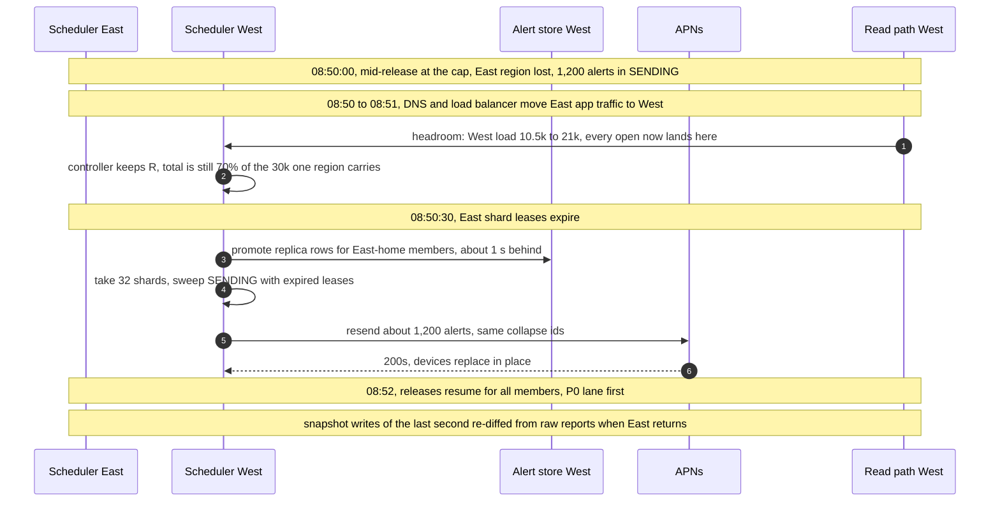

What the member sees: nothing, or a notification that refreshes in place. What on-call sees: a region page, a spike in attempt-2 sends, no read-path page.

**FCM answers 429 during a large release.** t = 0, Android sends start failing with `429 RESOURCE_EXHAUSTED` (another team's campaign shares the project quota). The senders back off with jitter; the scheduler sees the Android success rate fall and halves the Android share; P0 keeps its reserved 120k a minute. If it lasts past the window, Android P1 alerts roll to the evening window; nothing is lost. The fix is organizational: one FCM project per product, or a shared quota broker.

**Gate hold at 03:00.** Flow 4: held at window close, paged, decided before 08:00, replayed later. If nobody decides by 07:30, the alerts simply stay held; holding is the safe default.

### 10.5 Exactly-once and idempotency end to end

| Hop | Where duplicates come from | Dedup key | Where removed | Lifetime |
|---|---|---|---|---|
| Scheduler to bureau pull | Worker retry after a timeout | `(member, bureau, slot week)` pull task | `last_pull_task` on the snapshot row; a retry finds the stored report | One week |
| Bureau trigger to us | Bureau retries until 200; a replayed old trigger | `(bureau, trigger_id)`, signed timestamp | Receiver's table (fast path); durable dedup is the `change_id` in the sent-log | 7 days / retention policy |
| `reports` to diff | Kafka redelivery, rebalance | `report_id` | `last_report_id` plus compare-and-set on the version | Per row |
| Diff to `change-events` | Re-emit after a crash | deterministic `change_id` | Sent-log insert at the decider | Per change |
| Same event, two bureaus | Bureaus report independently, names differ | none: two `change_id`s | Fuzzy link via compare-and-set on the P0 index: match updates the inbox, no push; no match pushes twice | 30 days |
| Decider crash after claim | Redelivery finds its own claim | stored `alert_id` vs this event's | Equal: carry on and create the alert; different: drop | Retention policy |
| Held batch | Supersede, quarantine, replay | claim taken at batch pass; freed only `where alert_id` matches | A cancelled alert never blocks a real change; versions from `max_version`, never reused | |
| Decider to alert | Kafka redelivery | P0 `hash(member, P0, change_id)`, P1 `hash(member, bureau, version, P1)` | Conditional create | Alert lifetime |
| Scheduler to sender | Restart after publish, before mark; a slow provider | `alert_id`, `attempt` | Claim `PENDING → SENDING`; 10 s provider timeout; `SENT` only where attempt matches | Lease 60 s |
| Sender to APNs / FCM | Crash after 200, region failover | `apns-collapse-id` / FCM `tag = alert_id` | On the device | While shown |
| Sender to email | Crash after accept | `alert_id` | P0: resend accepted. P1: no resend | |
| Inbox | Any of the above | `alert_id` | Upsert | Retention policy |

### 10.6 Consistency model per edge

| Edge | Model | Why |
|---|---|---|
| Bureau to raw storage | Write-once objects | A report never changes |
| Diff to snapshot KV | Strong per row: compare-and-set in the home region | Two workers never write two version 42s |
| Gate to `visible_version` | Strong per row, forward only, only if `staged_batch_id` matches | `min_version` stays satisfiable; an unjudged version is never published |
| Change events to decider | At least once, per-member order | Deterministic ids make duplicates free |
| Decider to sent-log | Strong per row: re-entrant insert-if-absent | At most one alert per bureau record |
| Trigger and report pools to P0 index | Strong per member row: compare-and-set | Two pools cannot both miss each other's item and both push |
| Alert store to scheduler | Strong per alert: conditional claim | One sender at a time |
| Scheduler to device | At least once, merged on the device | Exactly-once effect on the screen |
| Alert to read path | Read-your-alert by version | The release check plus `min_version` |
| Organic read | Eventual, at most 60 s (pointer TTL) | No promise to keep without an alert |
| Home region to other region | Asynchronous, ~1 s | Region loss resends a few pushes; re-diff the last second |
| KV to history lake | Eventual, minutes | Analytics and evidence, not serving |

### 10.7 Alternatives rejected

| Alternative | Why it looked attractive | Why rejected |
|---|---|---|
| Flink with keyed state for the diff | Stateful streaming is built for "compare with the previous value" | The previous value must be in a KV anyway for the read path, so Flink's state would be a second copy with its own checkpoints and restore time |
| A nightly Spark job over full tables | Simple, one batch | 400 GB scanned per run, and its output arrives as one herd |
| A vendor notification platform as the pacing brain | Channels, templates, analytics for free | It paces against provider limits, not against our read path's headroom; we use it, if at all, as a sender behind the scheduler |
| `apns-priority 5` to let devices batch | Free spreading | Apple says such pushes "might get grouped and delivered in bursts" and may be "throttled", so delivery time becomes unknowable |
| Per-member ML thresholds at launch | Fewer, better alerts | No labels until the system runs; start with rules, learn from opens (§12) |
| SMS for fraud alerts | Reaches members without the app | Costs per message, needs a phone-number trust story, and push plus email meet the 5-minute promise |
| Exactly-once Kafka transactions end to end | "Exactly once" in the name | The last hop is APNs or FCM, outside any transaction; idempotent ids are simpler and cover it |

### 10.8 How the big companies do it

- **Credit Karma itself** says it monitors Equifax and TransUnion reports "on a regular basis" and that "if you've enabled push notifications, you may get a push notification alerting you to an important change. You may also receive an email notification" ([credit monitoring](https://www.creditkarma.com/credit-monitoring)). The alert types it leads with, "new hard inquiry or a new credit card", are our P0 lane. It serves "more than 140 million members" ([about](https://www.creditkarma.com/about)). The internal design is not public.
- **LinkedIn Air Traffic Controller** (Mar 2018) sits between every notification producer and the member: it rate-limits upstream apps "to prevent them from accidentally spamming members", aggregates "a group of notifications together as one notification at a later time", picks the channel, and avoids sending while the member is asleep. At "546 million members" and "over a billion requests per day", it "cut member complaints in half" ([LinkedIn](https://www.linkedin.com/blog/engineering/messaging-notifications/air-traffic-controller-member-first-notifications-at-linkedin)). Our decider plus scheduler is the same idea, plus one input ATC did not need: the read path's headroom.
- **Uber's real-time push platform (RAMEN)** (Dec 2020) replaced polling, which was 80% of API gateway requests, with server push, reaching "more than 1.5M concurrent connections" and "over 250,000 messages per second" ([Uber](https://www.uber.com/blog/real-time-push-platform/)). The lesson for us is the reverse direction: their pushes were the cure for read load; ours cause it, because a push invites a read.
- **Intuit's own calendar peaks.** TurboTax scales "from 5K to 300K transactions per second within two hours" around tax day (see [`../company-questions.md`](../company-questions.md) §1.5 for the sources). That is pre-scaling for a peak you can see coming. Ours is cheaper: we choose the peak, so we flatten it instead.

### 10.9 Operational runbook

- **Dashboards (the five):** refresh freshness per bureau (members past 8 days); gate status per batch with the delta histogram against baseline; P0 latency trigger-to-provider p50/p95; release rate against `R_cap` with read-path load, measured `p̂k̂` and tagged-request share on one chart; delivery outcomes per provider (200, 410, 429, 5xx) and opens per push.
- **Alerts:** gate hold (page); a window not closed 10 min after its end (page); P0 `PENDING` over 4 min (page); trigger lag over 2 min (page); bureau pull errors over 5% for 10 min (page); read path over 80% while releasing (page, the controller failed); 409s over 10 an hour (page); P1 rollover over 5% (ticket); warmed-card hit rate under 90% (ticket); tagged-request share near 0% during a release (ticket: the controller is flying on the prior).
- **Rollout:** diff and materiality changes run in shadow for 24 h, with the event streams compared by type and count, then by member cohort (1%, 10%, 50%, 100%). A materiality change that moves alert volume by more than 20% needs a product sign-off. Scheduler changes ship behind a rate ceiling that starts at 1k/s.
- **Rollback:** code by cohort flag. Data by version: a bad diff release is fixed by replaying its batches through the gate as new versions, never by rewriting old ones. Alerts already sent cannot be unsent; members alerted from the bad batch get one `CORRECTION` alert from a replay batch marked `correction_of` (§5.3).

### 10.10 Security and abuse

- **Authentication and authorization.** Members use OAuth 2.0 tokens bound to the device ([`../../concepts/oauth.md`](../../concepts/oauth.md)); a member reads only their own rows (the member id comes from the token, never from the request). Changing or turning off fraud alerts needs a fresh sign-in, takes effect after 24 hours, and sends notices to the previous email and old devices for 30 days: an account-takeover attacker's first move is to change the email and silence the alerts that would expose them.
- **Bureau boundary.** Mutual TLS both ways; triggers must be signed; the receiver rejects a trigger for a member we have no consent for.
- **Push hijack.** A device token is registered only by an authenticated session; a new token on a new device triggers an email. Push text carries no PII (personally identifiable information), so a stolen or shared lock screen leaks only "your report changed".
- **Phishing that copies our alerts.** Emails are signed and authenticated (SPF, DKIM and DMARC, the standard email-authentication records) and never ask for a password or link to a sign-in form with prefilled data; the app's inbox is the authoritative copy.
- **Insiders.** Staff read member reports only through just-in-time access with a ticket; every read is logged with purpose. The gate's release button is two-person for batches above 1 M members [estimate].
- **Abuse of our own system.** A loop that re-enqueues the same alert is stopped three times: the sent-log, the claim, and the per-device limits at the provider (FCM's 240 a minute).

### 10.11 Evolution

- **10x alerts (250 M a week).** Pulls and diff scale linearly with workers. The read path does not: the scheduler will stretch releases into the evening window. That is the moment to negotiate read-path capacity with the app team, using the open-rate and cache-hit data the scheduler already collects.
- **Daily refresh instead of weekly.** 7x pulls, ~2.3k/s, and 7x the bureau bill. The slots become seconds of the day; nothing downstream changes. The cost, not the design, is the obstacle.
- **A third bureau (Experian).** One more pull per slot, one more token bucket, the same diff with a new parser, and the cross-bureau link already handles a third copy of one account (one push, two "also on" lines).
- **Real-time bureau streams.** If bureaus push every change as it happens, the P1 lane stays morning-batched by choice; only P0 gets faster.
- **GDPR (EU General Data Protection Regulation) or CCPA (California Consumer Privacy Act) deletion at scale.** Per-member key deletion covers the KV store, raw reports and backups; the lake is encrypted per file, so a deleted member's rows are removed by row delete plus monthly compaction and can linger in lake files for up to a month (§5.7).
- **New channels or alert types.** A new change type is a new row in the materiality table plus a schema version; a new channel is a new sender behind the same scheduler and the same headroom budget.

---

## 11. Follow-up questions to expect

Ranked by how likely an interviewer asks them. Answers in [`edge-cases.md`](edge-cases.md) and the deep dives.

1. **The bureau delivers 100 M reports at 2 AM. What happens at 2:05, and where is the herd?** §5.1, [`deep-dives/fan-out-and-herd-control.md`](deep-dives/fan-out-and-herd-control.md).
2. **What counts as a change worth an alert?** §4.3, [`deep-dives/change-detection-and-materiality.md`](deep-dives/change-detection-and-materiality.md).
3. **A bad batch drops everyone 80 points.** §5.3, [`deep-dives/bad-batch-circuit-breaker.md`](deep-dives/bad-batch-circuit-breaker.md).
4. **The sender crashes after APNs said 200. Twice or never?** §5.4, [`deep-dives/preferences-dedup-and-delivery.md`](deep-dives/preferences-dedup-and-delivery.md).
5. **The member taps and sees last week's score.** §5.5.
6. **Fraud alerts vs score alerts: how do priorities work?** §5.2.
7. **What do 7 years of weekly snapshots cost, and do you need them?** §5.7.
8. **What if the bureau sends files instead of answering pulls?** §4.1, [`deep-dives/bureau-ingestion-and-refresh-scheduling.md`](deep-dives/bureau-ingestion-and-refresh-scheduling.md).
9. **The same new account shows up on both bureaus.** Exact per-bureau ids, a display-only link, and "when unsure, push twice", §4.3, [`deep-dives/change-detection-and-materiality.md`](deep-dives/change-detection-and-materiality.md) §4.
10. **A tradeline disappears for a week and comes back.** The 12-week known-items memory, §4.2.
11. **A region dies in the middle of the morning release.** §10.4.
12. **How do you get here from a nightly job that sends everything at once?** §8, [D12](diagrams.md#d12-rollout--migration).

---

## 12. Presenting this as an Intuit case study

**The deck (10 slides).**
1. The one-line answer and the three places a herd can form.
2. **Scope and what we cut:** score computation, offers, disputes, dark-web monitoring, Experian, SMS; and what we refused to build (real-time processing of weekly data, 7 years of full snapshots, autoscaling as the herd fix).
3. Numbers: 330 reports/s, 41 alerts/s, and the one that matters: 12.5 M pushes is 112% of the read path.
4. The final architecture (§6), red node explained.
5. Herd control: spread by member, slow start, `p × k` measured on the release, one cut per 2 minutes, warm cache. The table from §5.1.
6. Change detection and materiality: typed events, the 12-week memory, the materiality table.
7. The bad-batch gate: hold alerts and visibility, not ingestion; human release; replay.
8. Correctness: one alert per change, claims, collapse ids, read-your-alert by version.
9. Security and compliance (below).
10. Migration, SLOs, what pages at 3 AM, cost, and the AI story.

**The AI story: a model decides *when*, never *whether*.** An open-propensity model, trained on each member's past app opens and alert opens, predicts for each P1 alert the probability of an open and the minute it is likely to happen. It does real work twice: it picks the release minute inside the member's window (the minute they usually open the app, instead of `hash mod 180`; still one minute per member, so coalescing holds), and it gives the controller a better **prior** for `p × k` than the flat 2, so the slow start is less often too slow or too bold. It is never the cap: `p̂k̂` measured from tagged requests on the release overrides it within minutes, and slow start plus one cut per 2 minutes still apply. Guardrails: the minute is clamped to the window and quiet hours; the model never decides materiality, which stays in auditable rules. Fallback: if the model is unavailable or its calibration drifts (predicted vs actual opens off by more than 20% for an hour), the scheduler goes back to `hash mod 180` and a prior of 2. A second, optional use: a language model drafts the plain-language "why your score changed" from the typed events at diff time, with every number checked against the event and the template text as the fallback.

**The security story.** Authentication: OAuth 2.0 tokens bound to the device, a fresh sign-in to weaken fraud alerts. Authorization: member-scoped reads by token, staff through just-in-time access with a ticket. PII: SSNs tokenized at ingest, no PII in push text, last 4 digits at most in the app. Encryption: mutual TLS to bureaus, KMS envelope keys at rest, a per-member key for crypto-shredding. Audit: every alert (what, why, when, which version), every staff read, every gate release with who pressed it.

**What each round will re-open.**

| Round | Three questions |
|---|---|
| Architecture (the presentation) | Why not just autoscale? What if `p × k` is 4, not 2? What happens if the bureau sends files? |
| Data and correctness | How do you know a change is real? What exactly does the gate compare, and who decides? Twice or never? |
| Reliability and operations | A region dies mid-release: show the timeline. What pages at 3 AM? How do you migrate from the nightly job without double alerts? |
| AI, security, leadership | Where does the model fail, and what happens then? How does an attacker silence fraud alerts, and how do you stop it? Which teams own what, and what is the contract between them? |
