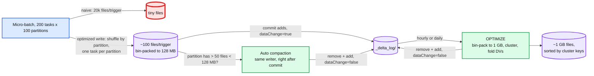

# Deep dive: compaction and data layout

> One-line answer: small files are created by streaming writers (one file per task per partition per trigger) and paid for by every reader forever (two footer GETs, a task, and a kilobyte of checkpoint per file), so the design writes files at ~128 MB in the first place (optimized writes), compacts hot partitions right after each commit (auto compaction), and bin-packs to ~1 GB on a schedule while clustering on the filter columns (OPTIMIZE with Z-order or liquid clustering); every one of those is a `dataChange=false` commit, which is exactly what lets it run beside streams and appends without conflicting, and its bill is roughly one to two extra writes of every ingested byte.

Part of [`../solution.md`](../solution.md) §4.5, §5.4. Docs: [Databricks OPTIMIZE](https://docs.databricks.com/aws/en/sql/language-manual/delta-optimize), [file size tuning](https://docs.databricks.com/aws/en/delta/tune-file-size), [liquid clustering](https://docs.databricks.com/aws/en/delta/clustering). Paper §4.4, §6.2. Reusable block: [`../../../concepts/lsm-tree.md`](../../../concepts/lsm-tree.md) (same write/read/space triangle), [`../../../concepts/columnar-db.md`](../../../concepts/columnar-db.md) (why files should be big and sorted).

## 1. Why small files hurt, per file

| Cost | Per file | 1 M files at 1 GB | 10 M files at 100 MB | 100 M files at 10 MB |
|---|---|---|---|---|
| Checkpoint bytes | ~0.75 KB | 0.75 GB | 7.5 GB | 75 GB |
| Footer reads per query on the files it opens | 2 GETs, ~10 ms each | | 10x more | 100x more |
| Scheduler tasks | 1 | 1 M | 10 M | 100 M |
| Stats selectivity | min/max per file | tight ranges if sorted | | ranges as wide as the data |
| Object store requests for VACUUM's LIST | 1/1000 | 1k pages | 10k pages | 100k pages |
| Parquet efficiency | row groups, dictionaries, compression need MBs of data | full | full | poor (10 MB is one small row group) |

The paper's line: "patterns like loading a stream as thousands of small objects" are what the log and compaction exist to fix. Target range: 128 MB to 1 GB. Databricks' OPTIMIZE targets 1 GB and auto-tunes lower for small tables and for MERGE-heavy tables (smaller files make copy-on-write rewrites cheaper).

## 2. Where small files come from

A streaming micro-batch with `T` tasks writing into `P` partitions produces up to `T × P` files per trigger, each holding one task's slice of one partition. 200 tasks × 100 partitions × 1 trigger/s = 20,000 files/s of a few KB each. Batch jobs have the same shape once per run.

## 3. Three layers of fix

1. **Optimized writes** (`delta.autoOptimize.optimizeWrite`): an adaptive shuffle before the write so each output partition is written by as few tasks as needed to hit ~128 MB files. Costs a shuffle per batch (network), saves 10 to 100x in files. Always on for streaming tables.
2. **Auto compaction** (`delta.autoOptimize.autoCompact`): after a write commits, the same job looks at the partitions it touched; if one has more than a threshold (50) of files under a threshold (128 MB), it runs a synchronous small OPTIMIZE on that partition and commits it as a second, `dataChange=false` version. Bounded work, bounded latency, only where the writer just made a mess.
3. **Scheduled OPTIMIZE**: bin-pack every partition (or the whole table) to the target size, apply clustering, fold deletion vectors. Idempotent: a second run finds nothing to do. Run one per table at a time (two OPTIMIZEs on the same files conflict on removes) or scope by partition predicate: `OPTIMIZE t WHERE date >= current_date() - 7`.

## 4. Why compaction cannot conflict with appends, and when it does conflict

- An append has no read set and adds new files. OPTIMIZE removes files that existed when it read and adds `dataChange=false` replacements. Conflict detection for the append: skipped (no read set). For OPTIMIZE against the append: the append removed nothing OPTIMIZE read, added nothing OPTIMIZE's "predicate" covers (it has none) — no conflict. Both commit. The append's new small files are picked up by the next OPTIMIZE.
- Streaming *sources* skip `dataChange=false` versions, so a compaction of a table being streamed from does not re-emit every row.
- OPTIMIZE vs UPDATE/DELETE/MERGE on the same files: without deletion vectors both remove the same files, so one fails `ConcurrentDeleteDelete` (usually the UPDATE, which then re-runs). With DVs, the UPDATE writes a DV against a file OPTIMIZE replaced; the checker re-bases the DV onto the new file (rows are the same, positions map via row tracking), so both commit. Exception: `ZORDER BY` reorders rows, positions no longer map, conflict.
- OPTIMIZE vs OPTIMIZE on overlapping files: conflict on removes. Serialise them.

## 5. Layout: partitioning, Z-order, liquid clustering

Pruning is only as good as the min/max ranges per file, and those are only tight if the data inside a file is close together on the filter columns.

| Technique | Mechanism | Good for | Cost and limits |
|---|---|---|---|
| Hive-style partitioning | Directory per value, `partitionValues` on the add | Low-cardinality, always-filtered columns (date, region). Partition pruning is exact | Over-partitioning creates small files (1,000 partitions × 100 tasks). Cannot change without a rewrite. Skip it under ~1 TB |
| Sort within files (single column) | OPTIMIZE writes files sorted by one column | Range predicates on that column | Only that column prunes; every other column's min/max spans the whole file |
| Z-order (`OPTIMIZE ... ZORDER BY (a, b, c)`) | Interleave the bits of the sort keys into one Z-value, sort by it, cut into files | 2 to 4 high-cardinality filter columns queried in any combination. Paper: 43% of files skipped on any one column, 54% on average, vs 25% average for a single sort, 93% on a 500 TB production table | Rewrites the whole partition each time (the curve is global). Adding a column re-Z-orders everything. Effect fades past 4 columns |
| Liquid clustering (`CLUSTER BY (a, b)`) | Incremental: new data is clustered on write and only unclustered or poorly clustered files are rewritten by OPTIMIZE; keys can change without a full rewrite (new data uses the new keys) | Same use cases as Z-order plus tables with skew and evolving access patterns. Replaces both partitioning and Z-order on Databricks | Cluster keys must be among the stats columns. Row-level concurrency requires an unpartitioned table, which liquid clustering allows |
| Bloom filter index | Per file per column bitset in a sidecar file | Equality on high-cardinality columns (ids, hashes) | Extra bytes per file, only equality, must be built on write |

Rule to say out loud: partition by at most one time-like column (or not at all), cluster on the 2 to 4 columns that appear in `WHERE` most, put those columns in `dataSkippingStatsColumns`, and let OPTIMIZE keep the layout.

## 6. Cost

For a table ingesting `I` bytes/day: optimized writes cost a shuffle (network, no extra object-store bytes), auto compaction rewrites the hot partitions once (~`I`), scheduled OPTIMIZE rewrites them again to 1 GB with clustering (~`I`), and DV folds rewrite touched files (a fraction of the table per day, depends on the update rate). Budget **1 to 2 × I of extra writes per day**. At 8.6 TB/day that is roughly a 50-node cluster for an hour a day. The alternative is that every query pays the small-file tax forever, and reads outnumber writes by 10 to 100x on an analytics table.

Storage: compaction tombstones the small files, which stay for the retention (7 days). A table that compacts 100% of its ingest keeps 7 days × `I` of dead bytes. Fine at 8.6 TB/day (60 TB) against a PB table, but visible on the bill.

## 7. Operational signals

- Average file size per partition and count of files under 32 MB: compaction health.
- OPTIMIZE duration and bytes rewritten per run: the cost line.
- DV cardinality as % of rows: fold backlog.
- Files opened per query vs files in the table: pruning effectiveness; if a query on one day opens files from every day, clustering is wrong.

## 8. Interview soundbite

"Streams make small files, readers pay for them forever, so fix it at three points: write big files in the first place, compact the partition you just touched, and bin-pack plus cluster on a schedule. Every fix commits with dataChange=false, so streams skip it and appends cannot conflict with it. The bill is one to two extra writes of every byte, and it buys a ten to hundred times smaller file count for every read."
