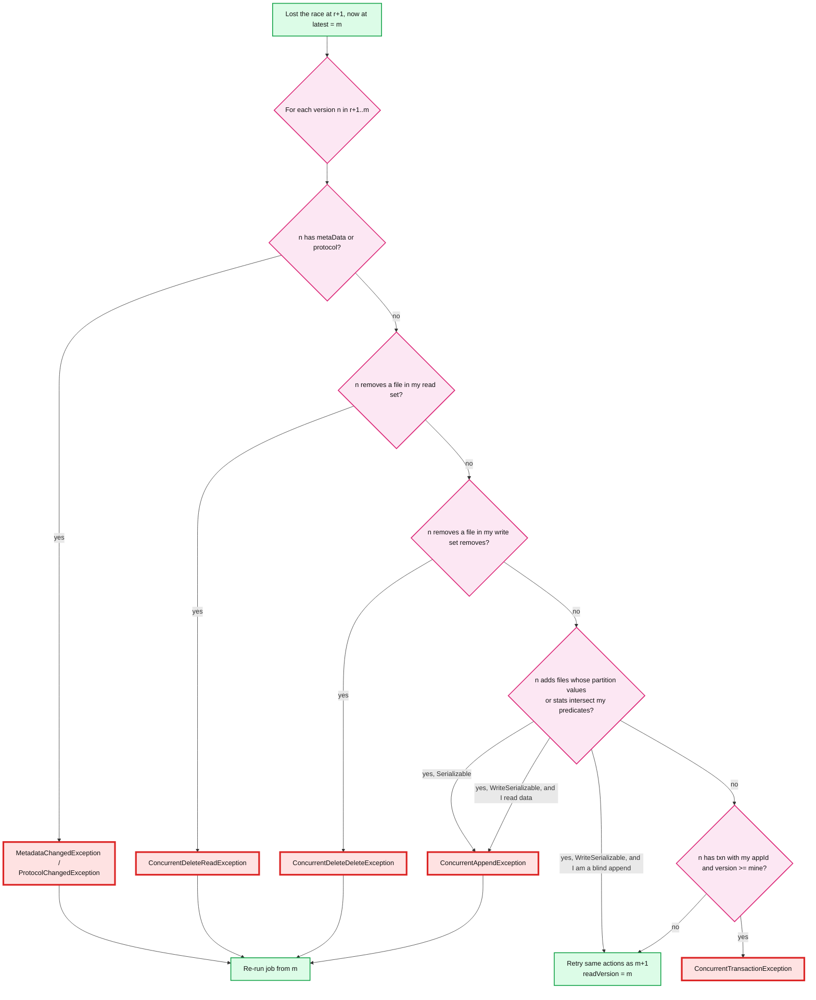

# Deep dive: optimistic concurrency and conflict detection

> One-line answer: a writer reads version `r`, does its work against that snapshot, and tries to claim `r+1`; if someone else got there first it reads every version it missed and asks four questions in order (did metadata or protocol change, did they remove a file I read, did they remove a file I remove, did they add rows my predicate would have matched), fails on the first yes, and otherwise retries the same actions as `latest+1`; blind appends skip all four, which is why streaming ingest never conflicts, and the object store round trip per attempt is what caps a table at a few commits per second.

Part of [`../solution.md`](../solution.md) §4.3, §5.3. Sources: [Delta concurrency control](https://docs.delta.io/latest/concurrency-control.html), [Databricks isolation levels](https://docs.databricks.com/aws/en/optimizations/isolation/isolation-levels), [row-level concurrency](https://docs.databricks.com/aws/en/optimizations/isolation/row-level-concurrency), paper §3.2.2 and §3.4.

## 1. Why optimistic

Analytics transactions are long (seconds to hours of scanning and writing) and rare (a few per second per table at most). A pessimistic scheme would hold a lock for the whole job, block readers or need a lock service with fencing tokens, and pay that on every commit. OCC pays only on actual conflicts, which partitioning makes rare, and readers never participate at all: they read an immutable snapshot. The paper: "As in any optimistic concurrency control protocol, a high rate of write transactions will result in commit failures."

## 2. The read set

What a writer records while it plans, so the checker has something to compare:

| Operation | Read set | Write set |
|---|---|---|
| Blind `INSERT` / append (no subquery on the target) | none | adds |
| `INSERT OVERWRITE` with `replaceWhere` | predicate, files matching it | removes of those files, adds |
| `UPDATE`, `DELETE`, `MERGE` | predicate(s) pushed to the scan, every file the scan opened (after pruning) | removes of touched files, adds of replacements (or adds with DVs) |
| `OPTIMIZE` | the files it compacts (no predicate) | removes + adds with `dataChange=false` |
| `ALTER TABLE` | metadata | metaData / protocol |

Note the asymmetry: a MERGE that prunes 1 M files down to 2,000 and touches 300 has a read set of 2,000. A concurrent writer that removes any of the 1,700 untouched-but-read files still conflicts with it, because the MERGE's join might have matched rows there had they been different. This is where false conflicts come from.

## 3. The check



Details worth saying:
- **"Adds that intersect my predicates"** is evaluated on the *added files' metadata* (partition values, min/max stats), not their contents. If the checker cannot tell, it assumes a conflict. A predicate on a non-partition column with no stats makes every add look like a conflict.
- **`dataChange=false` adds are not new rows.** A concurrent OPTIMIZE's adds are skipped by the append check. Its removes still count, which is why UPDATE + OPTIMIZE conflicts without DVs (the UPDATE read files OPTIMIZE removed) and does not with DVs (the checker can re-base the DV onto the compacted file, since compaction preserved every row).
- **Serializable vs WriteSerializable** differs in exactly one cell: concurrent adds that match a data-reading transaction's predicate. Databricks example: a delete reads v0, an insert commits v1, the delete tries v2. Serializable: fail, because in the serial order "insert, delete" the delete should have removed the new rows. WriteSerializable: allow, because the serial order "delete, insert" is a valid ordering of the *writes*; the history just shows them the other way round. OSS Delta only implements Serializable; Databricks defaults to WriteSerializable.

The matrix (Databricks, tables without row-level concurrency, metadata changes excluded):

| Pair | WriteSerializable | Serializable |
|---|---|---|
| INSERT + INSERT | cannot conflict | cannot conflict |
| INSERT + UPDATE/DELETE/MERGE | cannot conflict | can conflict, the UPDATE/DELETE/MERGE fails |
| INSERT + OPTIMIZE | cannot conflict | cannot conflict |
| UPDATE/DELETE/MERGE + same | can conflict (same files) | same |
| UPDATE/DELETE/MERGE + OPTIMIZE | cannot conflict with DVs unless `ZORDER BY`, can otherwise | same |
| OPTIMIZE + OPTIMIZE | can conflict (same files) | same |

With row-level concurrency (DBR 14.3+, unpartitioned, DVs on): UPDATE/DELETE/MERGE pairs conflict only when they modify the same row, and never with OPTIMIZE unless `ZORDER BY`.

## 4. Row-level concurrency, how

- Row tracking gives every row a stable id: `add.baseRowId` plus the row's position in the file, carried through rewrites via a materialised `_row_id` column or the file's `defaultRowCommitVersion`.
- A DV write is "these row ids are now deleted from this logical file". Two writers producing DVs against the same file conflict only if their bitmaps intersect. The loser re-bases: same bitmap, applied to the winner's new `add` for that path (union with the winner's DV).
- A CoW rewrite by the winner (no DV) still forces the loser to re-run, because rows moved.
- Cost: row ids per file (one extra column or a base id per add), and the checker must read the winner's DV. Cheap next to a MERGE re-run.

## 5. The rate ceiling, with numbers

One attempt = conditional PUT (50 to 200 ms on S3) + on loss: LIST (~50 ms) + `k` GETs of ~20 KB (5 to 10 ms base latency each) + the check (ms). Call it 150 ms won, 300 ms lost.

`n` writers all trying at once, no batching: round 1 has `n` attempts and 1 winner, round 2 `n−1`, ... total `n(n+1)/2` attempts for `n` commits. For `n = 10`: 55 attempts, ~10 s wall clock, 10 commits. Throughput ~1 commit/s per table with 10 contending writers, and each loser that read data re-runs its plan on top. The paper's "several transactions per second" is the uncontended case (one writer at a time, 150 to 300 ms each).

Ways up:
1. **Fewer writers, bigger commits.** One ingest job per table committing 1,000 files/s in one commit is 1 commit/s of 1,000 files, not 1,000 commits. This is what the paper says nearly everyone does.
2. **Blind appends.** No read set, no re-plan, only the PUT race. Ten appenders cost `n(n+1)/2` PUTs but zero re-execution.
3. **Disjoint read sets.** Partition by the columns in the MERGE condition so two MERGEs never read the same files; then a loss is a cheap retry, not a re-run.
4. **A coordinator.** The catalog assigns versions. A commit is one ~5 ms database CAS, and the coordinator can accept a batch of non-conflicting proposals in order (it holds their read sets) instead of making them race. ~100 commits/s per table. It can also queue a long MERGE behind short appends so it never starves. Cost: a service on the write path.

```
Contention math (S3 arbiter, 10 writers, one burst):
  attempts          = 10 + 9 + ... + 1 = 55
  time per attempt  ~ 200 ms (mix of won and lost)
  wall clock        ~ 55 x 0.2 / (parallel across writers) ~ 10 rounds x ~0.3 s = 3 to 10 s
  useful commits    = 10
  => 1 to 3 commits/s during the burst, 3 to 5 commits/s with one writer at a time
Coordinator:
  CAS ~ 5 ms, batched ordering, no re-plan for non-conflicting sets
  => ~100 commits/s, bounded by the catalog's write throughput
```

## 6. Starvation and backoff

A 30-minute MERGE on a table with a 1 s streaming append loses every race by definition (there is always a newer version when it finishes), but under WriteSerializable the appends do not conflict with it, so its retry succeeds after one extra round. Under Serializable, an append into its partitions every second means it *never* commits: switch the isolation level, partition, or pause the stream for the MERGE. Delta retries with exponential backoff and a very high attempt cap (`maxCommitAttempts` = 10,000,000) so a writer waits out contention rather than failing the job.

## 7. Interview soundbite

"Optimistic because transactions are long and rare. The loser reads what it missed and checks metadata, removes-of-what-I-read, removes-of-what-I-remove, and adds-matching-my-predicate, in that order. Blind appends have no read set, so they never fail. The ceiling is the object store round trip, a few commits a second; batch upstream or move the arbiter into the catalog for a hundred."
