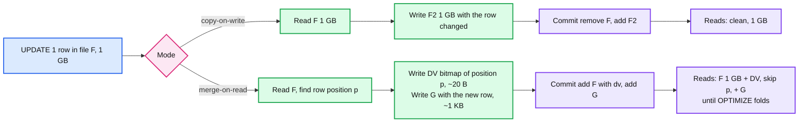

# Deep dive: row-level changes, copy-on-write vs merge-on-read

> One-line answer: files are immutable, so a row-level change is "find the files that hold affected rows, then either rewrite them without those rows (copy-on-write: one 1 GB rewrite per touched file, clean reads) or mark the rows dead in a per-file bitmap and write only the new rows (merge-on-read with deletion vectors: kilobytes per touched file, every read pays a bitmap fetch and filter until compaction folds it); MERGE is the same plus a join to find the touched files; GDPR erase is a delete that is invisible in seconds and physical only after the fold and the retention window.

Part of [`../solution.md`](../solution.md) §4.4, §5.5. Spec: [Deletion vectors](https://github.com/delta-io/delta/blob/master/PROTOCOL.md#deletion-vectors), [Change Data Feed](https://github.com/delta-io/delta/blob/master/PROTOCOL.md#add-cdc-file). Docs: [Databricks deletion vectors](https://docs.databricks.com/aws/en/delta/deletion-vectors).

## 1. Finding the touched files

Everything starts with pruning, because the cost of any row-level operation is proportional to the files it opens.

1. **Partition pruning.** `WHERE date = '2026-09-01'` on a table partitioned by date keeps one partition's files.
2. **Stats pruning.** Every `add` carries `minValues`/`maxValues`/`nullCount` for the first 32 columns. `WHERE user_id = 42` keeps files whose `[min, max]` on `user_id` contains 42. On a table clustered (Z-order, liquid) by `user_id` that is a handful of files; on a table sorted by arrival time it is nearly all of them, because every file spans the whole id range.
3. **Bloom filter index** (optional, per file, per column) turns "range contains 42" into "42 probably in this file", cutting the survivors again by 10 to 100x for high-cardinality equality predicates.
4. **Scan the survivors** to find the rows that actually match: for `DELETE`/`UPDATE` this is a filter, for `MERGE` it is a join with the source on the merge condition. Files with zero matches are dropped from the write set (but stay in the read set for conflict detection).

MERGE specifically: an inner join of `source` with the pruned target files finds `F_touched`; a second pass (or the same join, outer) produces updated rows, deleted rows, and rows to insert. MERGE conditions should include the partition or clustering columns, otherwise the join reads the whole table and the read set is the whole table.

## 2. Copy-on-write

For each file in `F_touched`: read it, apply the change, write a new file (or several), commit `remove(old) + add(new)`. Unmatched inserts go to fresh files.

- Write amplification: a 1-row change in a 1 GB file writes 1 GB. 300 touched files = 300 GB written for 50k changed rows.
- Read cost afterwards: zero extra. Files are clean.
- Conflicts: the old files are removed, so any concurrent reader-writer of those files conflicts.
- When it wins: bulk changes that touch most rows of each file anyway (a backfill, a re-partition), tables read far more than written, engines without DV support.

## 3. Merge-on-read with deletion vectors

For each file in `F_touched`: compute the positions (row indexes within the file) of changed rows, write a bitmap, and commit `add(path, deletionVector = dv)` replacing the previous `add` for that path, plus `add(new file with the updated rows)`. For a pure `DELETE` there are no new rows.

The descriptor on the `add`:

| Field | Values | Meaning |
|---|---|---|
| `storageType` | `u` (uuid, relative path in the table), `i` (inline), `p` (absolute path) | Where the bitmap lives |
| `pathOrInlineDv` | uuid + optional prefix, or base85 bytes | |
| `offset` | int | Byte offset inside a shared `.bin` file (many DVs packed in one object) |
| `sizeInBytes` | int | |
| `cardinality` | long | Rows deleted, so `numRecords − cardinality` is the live count |

Format: a 64-bit roaring bitmap (RoaringBitmapArray) of row indexes, so a DV covering 1 M scattered rows is a few MB and a DV covering a contiguous range is bytes. A logical file is `(path, dvId)`; a second delete on the same file writes a new DV that is the union and a new `add` with the new `dvId`. DVs are immutable like everything else.

Read path: the scanner opens the file, fetches the DV (tiny, cached), and filters rows by position while decoding. Databricks' Photon does it in the same pass (predictive I/O); the cost is one extra small GET per file and a bitmap test per row.

- Write cost: bytes of the bitmap + the new rows. The 300-file MERGE above writes ~60 MB instead of 300 GB.
- Read cost afterwards: one DV GET per file plus skipped rows. A file with 40% masked rows still reads all 1 GB and throws 40% away.
- Conflicts: the file's `add` is replaced, not removed, so OPTIMIZE and other DV writers can be re-based (row-level concurrency). See the OCC deep dive.
- When it wins: frequent small changes (CDC apply, GDPR deletes, corrections), MERGE-heavy pipelines.

## 4. The fold: MoR needs a maintenance step

Without it, read amplification grows without bound. `OPTIMIZE` rewrites files with DVs into clean files (and bin-packs at the same time); `REORG TABLE ... APPLY (PURGE)` does only the fold, for files whose DV cardinality exceeds a threshold. Both commit `dataChange=false` because no row is added or removed logically. Rule of thumb: fold when masked rows exceed 10% of a file, alert at 20% table-wide.

## 5. Change Data Feed (CDF)

With `delta.enableChangeDataFeed = true`, every UPDATE/DELETE/MERGE also writes change files under `_change_data/` recorded by `cdc` actions: rows with `_change_type` in `insert`, `update_preimage`, `update_postimage`, `delete`, plus `_commit_version` and `_commit_timestamp`. Blind appends do not write change files (the `add` itself is the change). A downstream consumer reads `table_changes(t, from_version)` and gets a proper changelog instead of re-diffing snapshots, which is what makes "stream from a table that has updates" possible. Cost: the changed rows are written twice (once in the data, once in the change file). CDF files follow the same retention as data files.

## 6. GDPR erase, end to end

| Step | Time | What is true |
|---|---|---|
| `DELETE FROM t WHERE user_id = 42` with DVs | seconds to minutes (pruning decides) | New snapshots never return the rows. Old snapshots within retention still do |
| Fold: `REORG ... APPLY (PURGE)` or scheduled `OPTIMIZE` | next maintenance window | New clean files without the rows exist; old files are tombstoned |
| `VACUUM` after `deletedFileRetentionDuration` | +7 days (default) | Old files physically gone. Time travel to before the delete is gone too |
| Log cleanup | +30 days | JSON entries mentioning the old paths gone. Old checkpoints held only paths and stats, not rows, but stats can contain values: exclude PII columns from `dataSkippingStatsColumns` |

Faster: per-table `deletedFileRetentionDuration = 1 day` on the tables that hold personal data (1 day of time travel there), or per-user encryption keys and crypto-shred (the rows become unreadable the moment the key is dropped, with no rewrite at all; see [`../../immutable-object-store/deep-dives/delete-gc-and-compaction.md`](../../immutable-object-store/deep-dives/delete-gc-and-compaction.md)).

## 7. Iceberg and Hudi for contrast

- **Iceberg v2:** position delete files (file path + row position, same idea as a DV but as a Parquet file per delete commit, so many small delete files accumulate and must be compacted) and equality delete files (a predicate on key columns, cheap to write, expensive to read because every data file must be checked). Iceberg v3 adds binary deletion vectors, converging on Delta's design.
- **Hudi:** every record has a key; Merge-on-Read tables write row-level *log files* (Avro deltas) beside a base Parquet file and compact them in; Copy-on-Write rewrites the base file. A record-level index routes an upsert to its file group in O(1) instead of a join, at the cost of maintaining the index on every write.

## 8. Interview soundbite

"A row-level change is a file-level change in disguise. Copy-on-write rewrites the file, a gigabyte per touched file; merge-on-read writes a bitmap of dead rows and only the new rows, kilobytes, and pushes the cost to reads until compaction folds it. Use deletion vectors for MERGE-heavy tables and fold on a threshold. GDPR is a delete that is invisible immediately and physical after the fold and the retention window."
