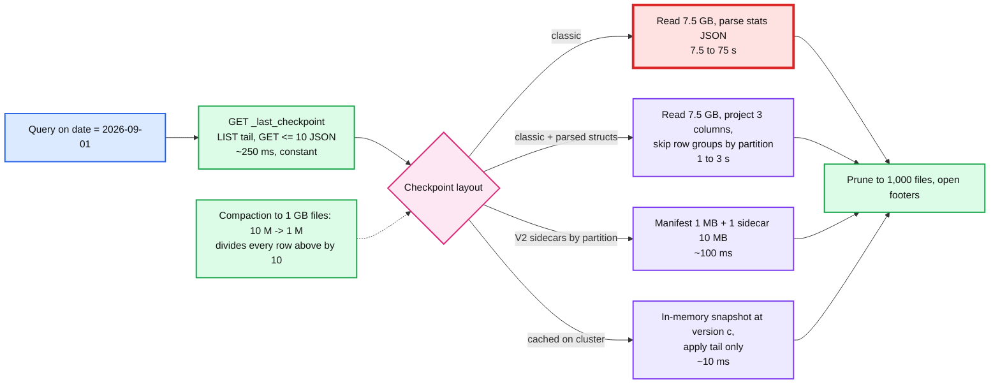

# Deep dive: snapshots, checkpoints, and time travel

> One-line answer: a snapshot is the newest checkpoint at or below the wanted version plus a replay of the JSON tail, so its cost is the checkpoint's size, which is proportional to the number of live files (about 0.75 KB each); at 10 M files that is 7.5 GB read per query and rewritten every 10 commits, and the fixes in order are fewer files (compaction), stats as struct columns so the checkpoint scan prunes itself, V2 checkpoints whose sidecars are rewritten only when they change and read only when the query needs them, and a per-cluster snapshot cache; time travel is the same replay stopped early, and it works only as far back as retention keeps both the log entries and the files they name.

Part of [`../solution.md`](../solution.md) §4.2, §5.2, §5.5. Spec: [PROTOCOL.md checkpoints](https://github.com/delta-io/delta/blob/master/PROTOCOL.md#checkpoints), [V2 spec](https://github.com/delta-io/delta/blob/master/PROTOCOL.md#v2-spec). Paper §3.2.1, §6.1.

## 1. What a checkpoint contains

The complete replay of all actions up to and including version `N`, with invalid actions removed: every live `add`, every `remove` tombstone not yet past its retention (VACUUM needs them), the current `metaData`, `protocol`, and the latest `txn` per `appId`. Stored as Parquet so an engine reads it as a table.

Classic schema (one row per action, one struct column per action type, most nulls):

```
protocol   struct<minReaderVersion, minWriterVersion, readerFeatures, writerFeatures>
metaData   struct<id, schemaString, partitionColumns, configuration, ...>
txn        struct<appId, version, lastUpdated>
add        struct<path, partitionValues map<string,string>, size, modificationTime, dataChange,
                  stats string, deletionVector struct<...>, baseRowId, defaultRowCommitVersion,
                  partitionValues_parsed struct<date: date, region: string>,   -- optional, typed
                  stats_parsed struct<numRecords, minValues struct<...>, maxValues struct<...>, nullCount struct<...>>>
remove     struct<path, deletionTimestamp, dataChange, deletionVector, size>
sidecar    struct<path, sizeInBytes, modificationTime>     -- V2 only
```

`stats_parsed` and `partitionValues_parsed` are the important ones: with them the planner runs `WHERE add.partitionValues_parsed.date = '2026-09-01' AND add.stats_parsed.minValues.user_id <= 42 AND add.stats_parsed.maxValues.user_id >= 42` as a Parquet scan of the checkpoint with column projection and row-group skipping. With `stats` as a JSON string it must parse every row.

## 2. Naming and discovery

| Kind | Name | Notes |
|---|---|---|
| Classic | `N.checkpoint.parquet` | One file, written atomically |
| Multi-part (V1) | `N.checkpoint.o.p.parquet`, `o` of `p` parts | Parallel write, but not atomic: readers must ignore a checkpoint with missing parts |
| V2 | `N.checkpoint.<uuid>.{json,parquet}` + `_sidecars/<uuid>.parquet` | Manifest holds protocol, metaData, txns, and `sidecar` actions; sidecars hold `add` and `remove` |
| Hint | `_last_checkpoint` = `{version, size, parts, sizeInBytes, numOfAddFiles, checkpointSchema, checksum, tags}` | The only overwritten object in the log. Stale is fine |

Discovery: GET `_last_checkpoint` → `c`. LIST `_delta_log/` with start-after `c` padded. The listing shows `c`'s checkpoint files, every `N.json` for `N > c`, and any newer checkpoint (prefer the newest complete one). Readers should not assume a checkpoint exists at any particular interval; the one guarantee is that metadata cleanup leaves a checkpoint at the oldest retained version.

## 3. The size wall, with math

Per `add`: path ~100 B, partition values ~50 B, size and times ~30 B, stats for 32 columns × (min + max + nullCount) ≈ 32 × 60 B ≈ 2 KB as JSON. In Parquet with dictionary and RLE encoding, ~0.5 to 1 KB per add. Call it 0.75 KB.

| Files | Checkpoint | Cold read at 1 GB/s (cluster) | Cold read at 100 MB/s (one driver) | Rewrite cost per 10 commits |
|---|---|---|---|---|
| 100k | 75 MB | 0.1 s | 0.75 s | trivial |
| 1 M | 750 MB | 0.75 s | 7.5 s | 750 MB, fine at 1 commit/s |
| 10 M | 7.5 GB | 7.5 s | 75 s | 7.5 GB every 10 s at 1 commit/s: the writer spends its life checkpointing |
| 100 M | 75 GB | 75 s | 12 min | impossible |

Paper §6.1 puts the alternative in perspective: Delta finds the files of a 1 M partition table in 108 s (17 s with the log cached on SSD) where Hive needed over an hour at 10k partitions and Presto over an hour at 100k. That 108 s is what the checkpoint wall looks like without the fixes below.

## 4. The fixes



1. **Fewer files.** Every number in §3 divides by the average file size. This is the only fix that also helps the data scan.
2. **Typed stats and partition values** so the checkpoint is a real columnar table: project three columns out of dozens, skip row groups by min/max on the partition column (write the checkpoint sorted by partition so row-group stats are tight).
3. **V2 checkpoints.** The manifest is small and rewritten every time. Sidecars are content-addressed by uuid: a new checkpoint re-links unchanged sidecars and writes new ones only for the slice of adds/removes that changed since the last checkpoint. For an append-only table with time partitions, one hot sidecar changes and hundreds of cold ones do not. The reader fetches sidecars in parallel and, with partition-range tags on the `sidecar` action, skips those outside the query. This is the same shape as Iceberg's manifest list → manifests.
4. **Snapshot cache.** A cluster keeps the parsed snapshot for `(table, version c)` in memory; a new query does the constant-cost LIST and tail read and applies the ≤ 10 tail versions to the cached state. Hot tables cost ~10 ms of metadata per query.
5. **Log compaction files** (`N.M.compacted.json`, some implementations) collapse a range of JSON versions into one object to shorten tails without a full checkpoint. Optional.

Push back on "put the file list in a database": it moves the 7.5 GB into a metastore that must then serve 10 M rows per query, and the paper reports the Hive metastore becoming the bottleneck exactly there. The object store already has the bandwidth; layout is the fix.

## 5. Time travel

`VERSION AS OF v`: newest checkpoint ≤ `v`, replay to `v`. `TIMESTAMP AS OF t`: commit timestamps are monotonic per table (a commit whose clock is behind gets `prev + 1 ms`; in-commit timestamps in `commitInfo` make this explicit), so find the last version with timestamp ≤ `t` by binary search over the log listing, then the same replay.

What must still exist for version `v` to be readable:
- A checkpoint at or below `v` **or** every JSON file from 0 to `v`: bounded by `logRetentionDuration` (30 days). Cleanup at checkpoint time deletes JSON and checkpoint files older than that, always keeping a checkpoint at the oldest retained version.
- Every data file `v` references: bounded by `deletedFileRetentionDuration` (1 week). A file removed at version `v+1` more than 7 days ago may be gone.

So the honest time-travel window is `min(logRetention, fileRetention)` for versions that removed files, i.e. 7 days by default for any table with updates or compaction. Raising file retention to 30 days costs 30 days of every rewritten byte (on a compacted, MERGE-heavy table that can be several times the live size).

## 6. VACUUM and why it is safe without coordination

```
VACUUM(table, retention = 7 d):
    snap = snapshot(latest)
    live = { path for (path, dv) in snap.files } ∪ { dv paths }
    for obj in LIST(table root, recursive, excluding _delta_log):
        if obj.path in live: keep
        elif obj.path in snap.tombstones and tombstone.deletionTimestamp > now - retention: keep
        elif obj.modificationTime > now - retention: keep        # orphan from an in-flight or failed writer
        else: DELETE obj
```

- A reader that pinned version `v` less than 7 days ago reads only files that were live at `v`; any of them removed since carries a tombstone younger than 7 days, so VACUUM keeps it. No reader registry, no lease: retention is a static promise.
- The only way to break a reader is a query longer than the retention, or `VACUUM RETAIN 0 HOURS`, which `spark.databricks.delta.retentionDurationCheck.enabled` refuses by default.
- An in-flight writer's uncommitted files are protected by modification time, so a job longer than the retention is at risk. Raise retention for the run or commit in stages.
- VACUUM is the one LIST-heavy operation (1,000 keys per page, 10k pages for 10 M objects). Run it daily, off-peak, in parallel across prefixes.
- Tombstones themselves are dropped from the next checkpoint once their retention passes, so the checkpoint does not grow with history.

## 7. RESTORE and CLONE, the two things time travel enables

- `RESTORE TABLE t TO VERSION AS OF v`: computes `live(v) − live(latest)` as adds and `live(latest) − live(v)` as removes, commits them as a new version. No data copy, seconds, history preserved (the bad versions stay readable until retention). Requires `v`'s files to be within retention.
- `CREATE TABLE t2 SHALLOW CLONE t VERSION AS OF v`: a new table whose version 0 `add`s point at `t`'s files (no copy); `DEEP CLONE` copies them. Shallow clones are how you fork a table for an experiment; they break if `t` vacuums a file they reference, so deep-clone anything long-lived.

## 8. Interview soundbite

"Snapshot = checkpoint + tail. The tail is bounded by the checkpoint interval; the checkpoint is bounded by nothing but the file count, roughly a kilobyte a file, so ten million files is a seven-gigabyte read per query and a seven-gigabyte write every ten commits. Compact first, then split the checkpoint into sidecars that are rewritten and read only when needed, then cache. Time travel is the same replay stopped early, and it reaches back only as far as retention keeps both the log and the files."
