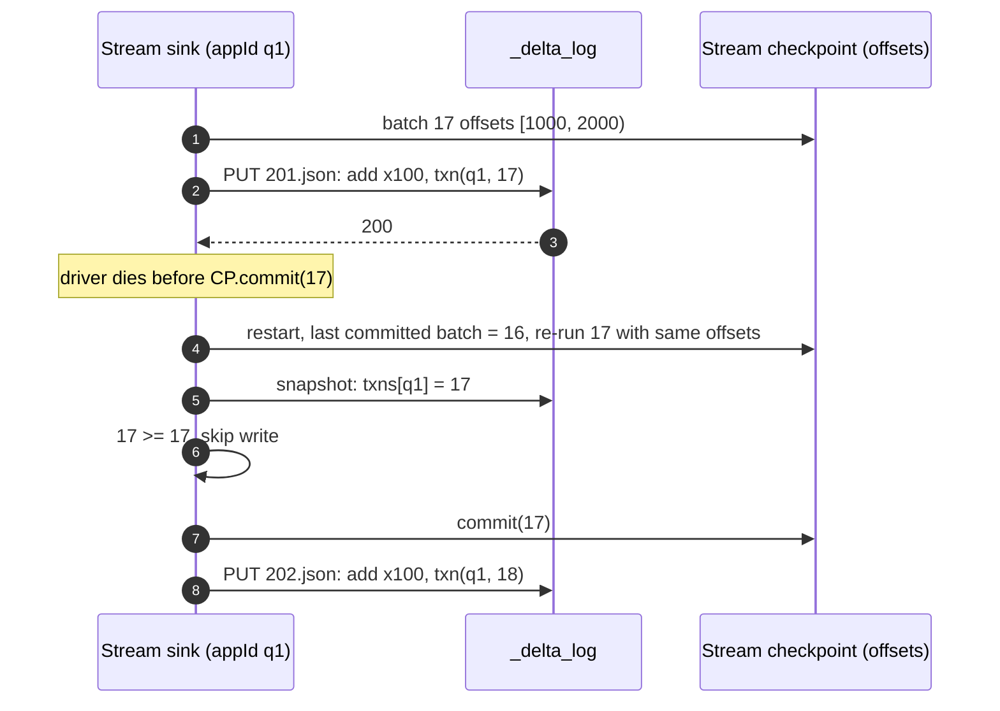

# Deep dive: streaming on a transactional table and idempotent writes

> One-line answer: a streaming sink gets exactly-once by putting a `txn(appId, batchId)` action in the same atomic commit as its data, so a re-executed batch finds its own marker in the snapshot and skips; a streaming source gets a replayable feed by tailing the log and emitting the `add` actions with `dataChange=true` of each new version (skipping compactions), failing loudly on `remove` unless Change Data Feed turns updates into a proper changelog; and the two hard cases are schema changes (the stream stops, by design) and merge-on-read plus streaming (the changelog must come from CDF, not from diffing files).

Part of [`../solution.md`](../solution.md) §4.5, §10.5. Spec: [Transaction identifiers](https://github.com/delta-io/delta/blob/master/PROTOCOL.md#transaction-identifiers). Docs: [Delta streaming reads and writes](https://docs.delta.io/latest/delta-streaming.html), [Databricks idempotent writes](https://docs.databricks.com/aws/en/structured-streaming/delta-lake#idempot-write). Paper §4.3.

## 1. The sink: exactly-once with `txn`

Structured Streaming already guarantees that batch `b` is re-executed with the same input after a failure (its own checkpoint records the offsets per batch). What it cannot guarantee alone is that the *effect* of batch `b` lands once. The `txn` action closes that gap:

```
write_batch(b):
    snap = snapshot(latest)
    if snap.txns[appId] >= b: return          # already committed, skip (idempotent)
    write data files for b
    commit(adds for b + txn(appId, version = b))
```

Because the marker and the data are one commit file, there is no window where the data is in the table and the marker is not, or the reverse. The protocol keeps only the latest `version` per `appId` in a snapshot, which is enough because batches are monotonic. `foreachBatch` users get the same via `txnAppId` / `txnVersion` write options, and can even write to several tables from one batch, each table checking its own marker (per-table idempotence, not cross-table atomicity: a crash between the two table writes leaves one done, and the retry finishes the other).

`setTransactionRetentionDuration` expires old markers so the snapshot does not accumulate every app that ever wrote. A stream that restarts after longer than that must start from a new checkpoint (new `appId`).



## 2. The source: tailing the log

A stream reading from a Delta table keeps `(version, index)` of the last `add` it emitted. Each trigger:

1. LIST the log from the last version, GET the new JSON files.
2. For each version, in order: if it has `add` actions with `dataChange=true`, emit those files' rows (rate-limited by `maxFilesPerTrigger` / `maxBytesPerTrigger`). If every file action has `dataChange=false` (compaction, Z-order, DV fold), skip the version.
3. If a version contains a `remove` with `dataChange=true` (an UPDATE, DELETE, MERGE, or overwrite), fail: the source cannot express "rows went away" as appends. Options: `ignoreDeletes` (skip removes, fine for partition-drop retention), `skipChangeCommits` (skip whole versions that changed data, accepting loss), or read the Change Data Feed instead (`readChangeFeed`), which delivers the changed rows with `_change_type`.
4. If a version contains `metaData` (schema change), fail with a schema-changed error. Restart the stream; it resumes at that version with the new schema. Column mapping makes rename/drop a metadata-only change, but the stream still needs a restart because its output schema changed.

Initial load: the first trigger snapshots the table at the start version and emits every live file (`startingVersion` / `startingTimestamp` choose where to begin). Because the log is immutable and ordered, the source is deterministic: replaying from `(version, index)` yields the same rows, which is what makes the sink's `txn` idempotence meaningful end to end.

## 3. Latency floor

A commit is an object-store PUT, so end-to-end latency is trigger interval + commit (~100 to 300 ms) + the source's next LIST. Seconds, not milliseconds. The paper is explicit that Delta is not a message bus: "millisecond-scale streaming latency" is left to Kafka-style systems; for the common case "latency on the order of seconds" was acceptable to users. Sub-second requirements go to a log-based system with Delta as the sink.

## 4. Backpressure and small files

A 1 s trigger with 100 partitions is the worst case from the compaction deep dive. Streaming tables get optimized writes and auto compaction by default; the trigger interval is the main knob (10 s cuts files 10x). `maxFilesPerTrigger` on the source bounds how much a downstream stream ingests per batch, so a compaction-free upstream table cannot flood it.

## 5. Late data and watermarks

Delta does not know about event time; the engine does. A watermark in the streaming query decides when an aggregation window closes; the sink just commits what the engine emits. The pattern that needs Delta's features: a late event that must *update* a previously emitted aggregate. That is a MERGE per batch (`foreachBatch` with MERGE), which is a row-level change, so the sink table wants deletion vectors and the downstream consumer must read CDF rather than the raw log.

## 6. The hard combination: merge-on-read plus streaming

- Sink side: MERGE per micro-batch writes DVs. Fine, with idempotence via `txn` in the same commit.
- Source side: a downstream stream sees `add` with DV replacing `add` without DV for the same path. Diffing files cannot tell which rows changed. CDF can: the `cdc` files hold the pre- and post-images. So a streaming pipeline with updates anywhere in it must enable CDF on every table that is both updated and streamed from. Cost: changed rows written twice.
- Compaction folds DVs with `dataChange=false`, so the downstream stream is unaffected.

## 7. Interview soundbite

"Exactly-once is one line: put the batch id in the same commit as the data. A re-run sees its own marker and skips. Reading a table as a stream is tailing the log for adds and skipping dataChange=false; updates need Change Data Feed because file diffs cannot express them; a schema change stops the stream on purpose. Latency is seconds because a commit is an object-store write."
