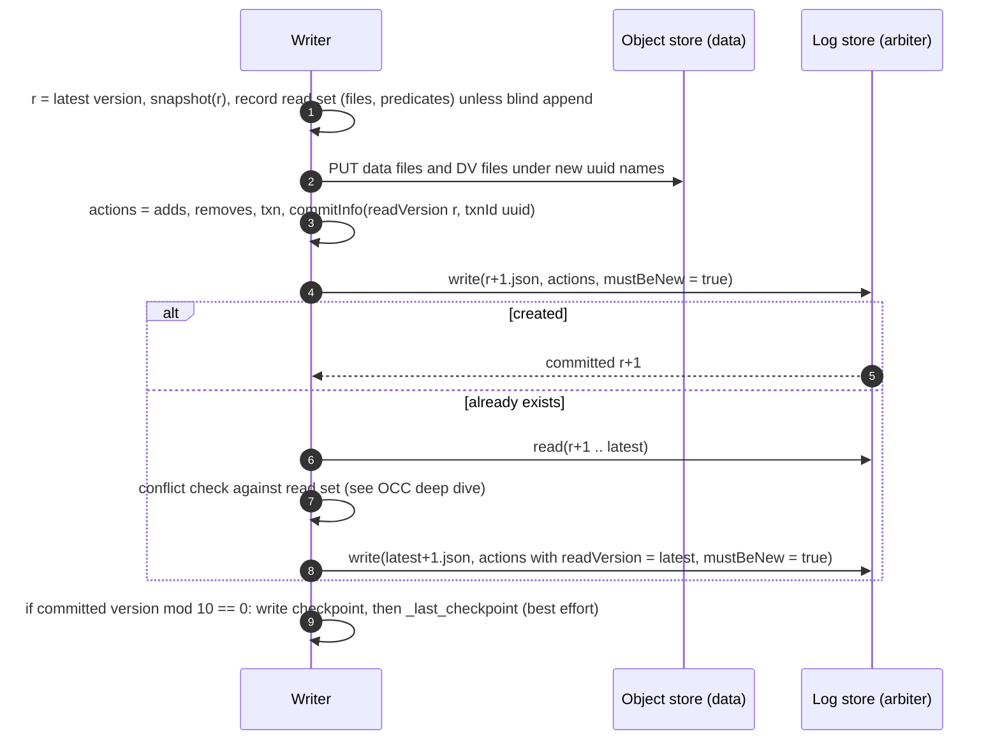

# Deep dive: the transaction log and the commit protocol

> One-line answer: a table is a directory of immutable Parquet files plus `_delta_log/`, an ordered sequence of JSON files `00000000000000000000.json`, `...001.json`, each holding an atomic set of actions; a commit is exactly one conditional PUT of the next version's file, so the object store's "create only if absent" is the sole arbiter of who owns version N+1, and readers reconstruct any version by replaying the log from the newest checkpoint at or below it.

Part of [`../solution.md`](../solution.md) §4.1, §4.3, §5.1. Spec: [PROTOCOL.md](https://github.com/delta-io/delta/blob/master/PROTOCOL.md). Paper: [Armbrust et al., VLDB 2020](https://www.vldb.org/pvldb/vol13/p3411-armbrust.pdf) §3.

## 1. Layout on disk

```
warehouse/events/
  part-00000-3f2a...-c000.snappy.parquet        data files, uuid names, never overwritten
  part-00001-9b1c...-c000.snappy.parquet
  date=2026-09-01/part-...parquet                partitioned layout is optional (randomizeFilePrefixes spreads instead)
  deletion_vector_a1b2....bin                    packed deletion vectors
  _delta_log/
    00000000000000000000.json                    version 0: protocol, metaData, first adds
    00000000000000000001.json
    ...
    00000000000000000010.checkpoint.parquet      classic checkpoint at version 10
    00000000000000000011.json
    00000000000000000020.checkpoint.a1b2c3.json  V2 checkpoint (manifest) at version 20
    _sidecars/7d17ac10-....parquet               V2 checkpoint sidecars (add/remove actions)
    _staged_commits/00000000000000000021.9f8e....json   proposed commit, catalog-managed tables only
    _last_checkpoint                             hint: {"version":20,"size":...}
    00000000000000000020.crc                     optional checksum + snapshot summary
```

Rules from the spec that matter in an interview:
- Versions are contiguous, monotonically increasing integers, zero-padded to 20 digits so lexicographic LIST order is version order and `LIST start-after=<checkpoint version>` returns exactly the tail.
- A Delta file is the unit of atomicity. Writers MUST never overwrite an existing log entry and should use the filesystem's atomic primitive to guarantee it.
- Within one version, at most one `add` and one `remove` per `(path, dvId)`, and they reconcile: the version's net effect on a path is what a replayer keeps.

## 2. Actions

| Action | Fields that matter | Used by |
|---|---|---|
| `add` | `path`, `partitionValues`, `size`, `modificationTime`, `dataChange`, `stats` (JSON: `numRecords`, `minValues`, `maxValues`, `nullCount`), `deletionVector`, `baseRowId`, `defaultRowCommitVersion` | Snapshot (live set), pruning, streaming source |
| `remove` | `path`, `deletionTimestamp`, `dataChange`, `deletionVector`, `size` | Snapshot (tombstone), VACUUM, conflict detection |
| `metaData` | `id`, `schemaString`, `partitionColumns`, `configuration` (table properties), `format` | Schema, conflict detection |
| `protocol` | `minReaderVersion`, `minWriterVersion`, `readerFeatures`, `writerFeatures` | Clients refuse tables they cannot handle |
| `txn` | `appId`, `version`, `lastUpdated` | Idempotent writers (streaming sinks) |
| `commitInfo` | `timestamp` (in-commit), `operation`, `readVersion`, `isolationLevel`, `txnId`, `operationParameters` | History, later writers' conflict checks, retry safety |
| `cdc` | `path`, `partitionValues`, `size` | Change Data Feed readers |
| `domainMetadata` | `domain`, `configuration`, `removed` | Feature-specific state (clustering keys) |
| `sidecar` | `path`, `sizeInBytes`, `modificationTime` | V2 checkpoints |

`dataChange=false` on `add`/`remove` means "this version rearranges existing rows or adds statistics, it does not change the table's contents". Compaction, Z-order, DV folds, and stats recomputation set it. Streaming sources skip such versions.

## 3. Replay

```
snapshot(v):
    c = newest checkpoint with version <= v (from _last_checkpoint hint, verified by LIST)
    state = read checkpoint c              # live adds, unexpired removes, metaData, protocol, txns
    for n in c+1 .. v:                     # tail, normally <= 10 files
        for action in read(n.json):
            match action:
                add(p, dv)      -> state.files[(p, dv)] = action, drop any remove for p
                remove(p, dv)   -> delete state.files[(p, dv)], state.tombstones[(p, dv)] = action
                metaData        -> state.metadata = action
                protocol        -> state.protocol = action
                txn(app, ver)   -> state.txns[app] = ver
    return state
```

Cost: O(size of checkpoint) + O(tail). The checkpoint is the thing that scales with the table; the tail is bounded by the checkpoint interval. [`snapshots-checkpoints-and-time-travel.md`](snapshots-checkpoints-and-time-travel.md).

## 4. The commit, step by step



The three primitives a log store must provide, and nothing more:

| Primitive | Contract | Why |
|---|---|---|
| `write(path, bytes, mustBeNew)` | If `mustBeNew`, fail if the object exists. Atomic: readers see all bytes or none | The commit point |
| `listFrom(path)` | All objects in the log directory with key >= `path`, in lexicographic order | Find the tail after a checkpoint |
| `read(path)` | Whole object. Must see objects that `write` has completed (read-after-write) | Replay |

## 5. `mustBeNew` on each store

| Store | Mechanism | Since | Failure signal |
|---|---|---|---|
| Azure Blob | `PUT` with `If-None-Match: *` | always | 409 / 412 |
| ADLS Gen2 (hierarchical namespace) | write temp file, atomic `rename` to `N.json` (fails if target exists), or ETag precondition | always | rename error |
| GCS | `PUT` with `x-goog-if-generation-match: 0` (object generation 0 = does not exist) | always | 412 |
| HDFS | `rename` (atomic, fails if target exists) | always | false |
| S3 | `PutObject` / `CompleteMultipartUpload` / `CopyObject` with `If-None-Match: *` | Aug 2024 | `412 Precondition Failed`, `409 Conflict` if a delete raced |
| S3 before Aug 2024 | Not available. `S3SingleDriverLogStore`: safe only for one writer process (in-memory lock). `S3DynamoDBLogStore`: DynamoDB row per `(table, version)` as the mutex, then PUT | Delta 1.2, 2022 | DynamoDB `ConditionalCheckFailedException` |

**The DynamoDB log store, because interviewers ask "how did it work on S3 before?"**

1. Writer PUTs the commit content to a temp object `_delta_log/.tmp/<version>.<uuid>.json`.
2. Writer does `PutItem` on the DynamoDB table with key `(tablePath, version)`, attributes `{tempPath, complete: false, expireTime}`, condition `attribute_not_exists(version)`. Winner gets the row.
3. Winner copies the temp object to `_delta_log/<version>.json` and updates the row to `complete: true`.
4. Readers and other writers, before acting on the latest version, check the newest DynamoDB row: if `complete: false` they perform step 3 on the winner's behalf (the copy is idempotent, same bytes), so a writer dying between 2 and 3 cannot leave a hole. The paper describes the same shape as Databricks' internal "lightweight coordination service ... only needed for log writes (not reads and not data operations)".
5. Rows carry a TTL so the DynamoDB table stays small. DynamoDB cost: one conditional write per commit, ~200 bytes.

After Aug 2024 the DynamoDB row is unnecessary on S3: `If-None-Match: *` gives the same semantics from the store itself. Tables already using the DynamoDB store must keep using it until every writer switches (mixing the two arbiters on one table would allow two winners).

## 6. Catalog-managed commits (Delta 4.0 `catalogManaged`)

When the catalog owns the table, the object store is no longer the arbiter.

- The writer either stages the commit at `_delta_log/_staged_commits/<v>.<uuid>.json` (the version in the name is authoritative for that attempt, the uuid keeps attempts apart) or sends the content inline.
- The catalog ratifies at most one proposal per version with a compare-and-swap on its own `latest_version` row. The writer learns "ratified" or "rejected".
- Ratified commits are published to `_delta_log/<v>.json` later (by the catalog or a client). Until then, only the catalog knows about them, so **readers must ask the catalog for the unpublished tail**. Filesystem-only readers are told, via the table feature, that they are not allowed.
- The existence of `<v>.json` still proves ratification, so published history is readable exactly as before, and the catalog can forget published commits.

What it buys: commit latency of a database write instead of an object-store write; the catalog can validate proposals (paths, schema, quotas) and serialise non-conflicting commits without a race; cross-table atomicity becomes possible (several `(table, version)` rows in one database transaction). What it costs: a stateful service on both the write path and the fresh-read path, and per-table lock-in to that catalog. Iceberg made this choice from the start (every commit is a catalog swap of the `metadata.json` pointer), which is why Iceberg needed a catalog even on stores that had atomic rename.

## 7. Failure modes of the protocol itself

| Failure | Effect | Handling |
|---|---|---|
| Writer dies before step 4 | Orphan data files | VACUUM after retention; no reader impact |
| Writer dies after step 4 | Committed, no checkpoint | Next writer at a multiple of 10 checkpoints |
| `write` response lost | Unknown outcome | `read(r+1)` and compare `commitInfo.txnId` |
| Two writers, store without `mustBeNew` | Second overwrites first, silent data loss | Never run a plain PUT log store with more than one writer. This is the whole reason the DynamoDB store exists |
| `_last_checkpoint` stale or missing | Longer LIST and replay | Hint only |
| Log entry deleted | Table unreadable from that version | Bucket versioning, deny `DeleteObject`, RESTORE |
| Multi-part checkpoint partially written | Ignored by readers (missing parts) | Fall back to the previous checkpoint |

## 8. Interview soundbite

"The object store gives me one atomic operation: create-if-absent. I spend it on the commit file. Everything else is immutable objects with unique names, so nothing else needs to be atomic. Readers replay the log, writers race for the next number, and the loser re-checks its read set. On S3 before 2024 there was no create-if-absent, so a DynamoDB row stood in for it; with a catalog, the catalog's CAS stands in for it and gets you cross-table transactions as a bonus."
