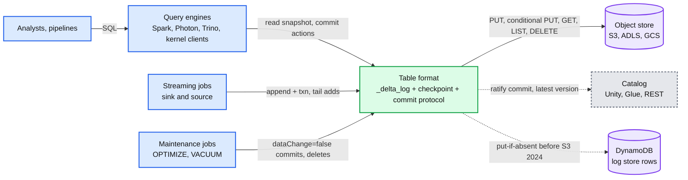
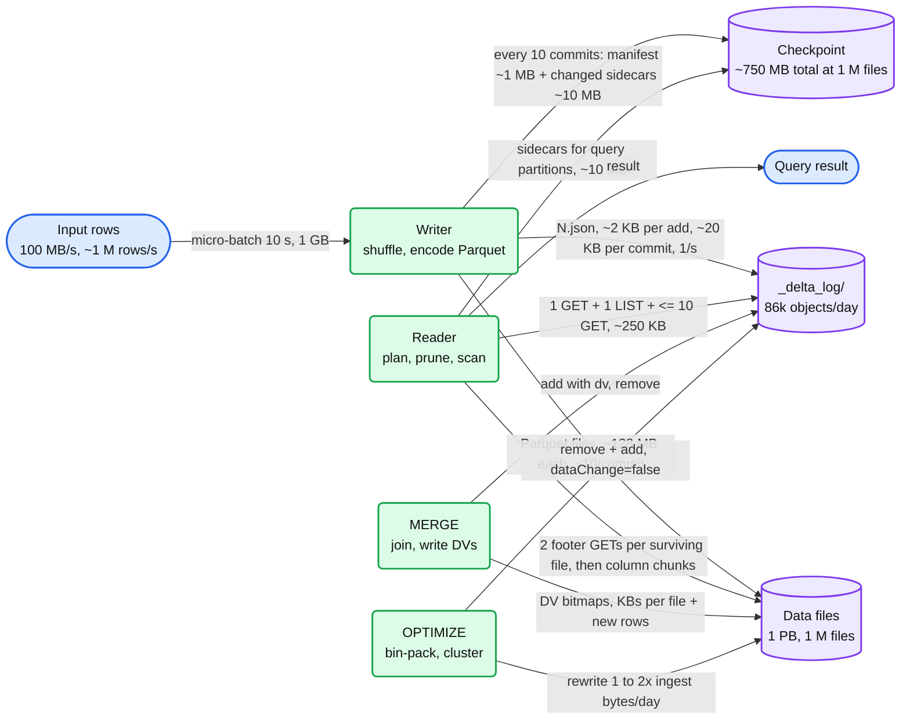
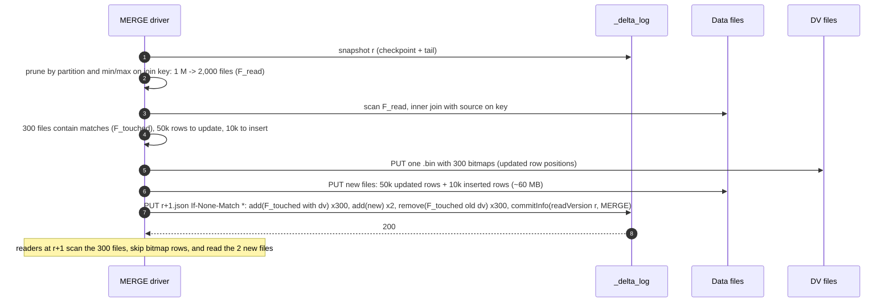
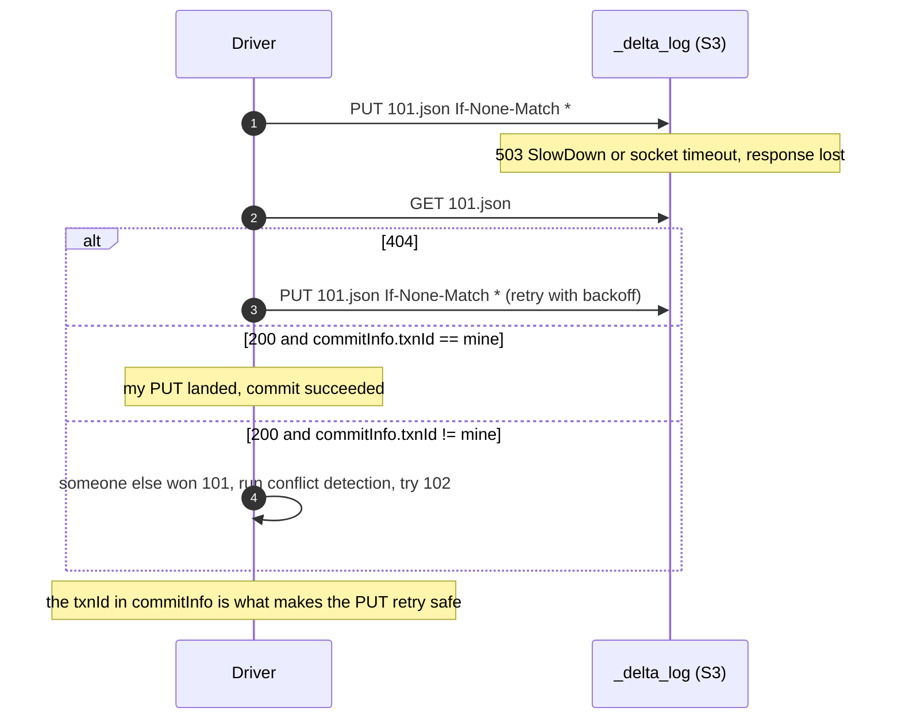
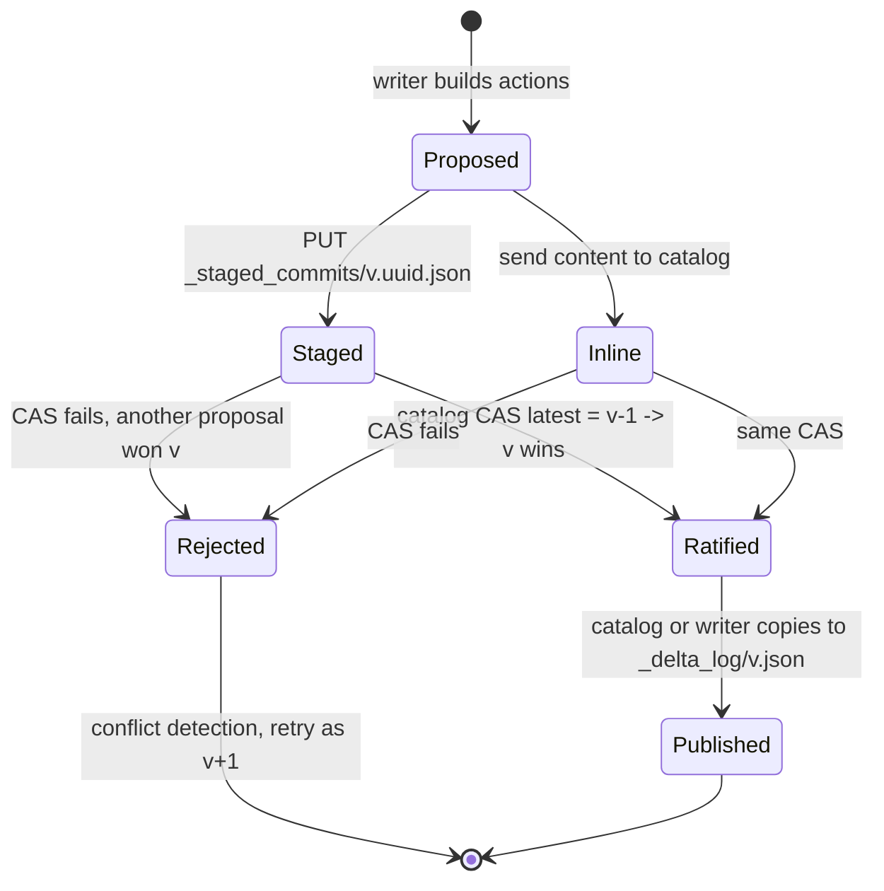
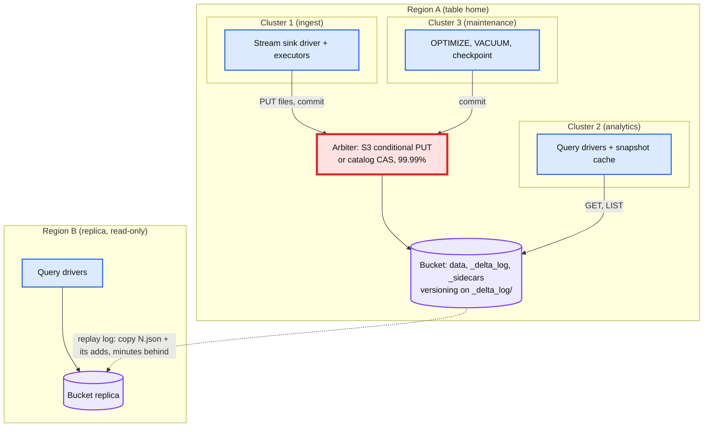
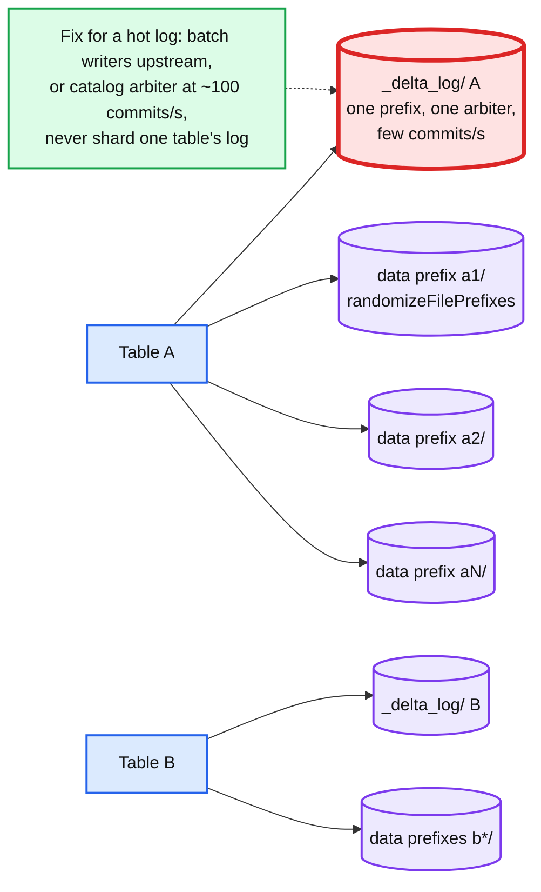
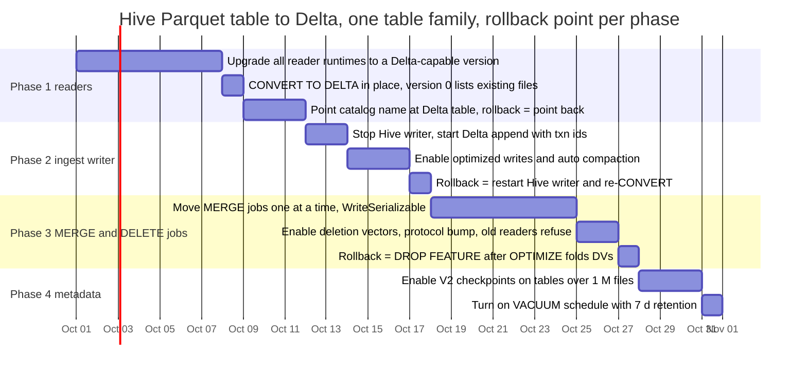

# Diagrams: Delta Lake, transactional tables over object storage

The D1 to D12 set from `hld/CLAUDE.md` §4. A diagram is drawn once: the ones embedded in [`solution.md`](solution.md) are linked here, not repeated.

| # | Diagram | Where |
|---|---|---|
| D1 | Context | below |
| D2 | Data flow | below |
| D3 | Component architecture (final design) | `solution.md` §6 |
| D4 | Happy path per FR | FR1 atomic write: `solution.md` §6 Flow 1. FR2 snapshot: §6 Flow 2. FR3 concurrent writers: §6 Flow 3. FR4 MERGE with deletion vectors: below. FR5 OPTIMIZE + stream: §6 Flow 5 |
| D5 | Failure paths | Writer crash before commit: `solution.md` §6 Flow 4. VACUUM vs time travel: §6 Flow 6. DynamoDB arbiter loses a writer: §10.4. Object store 503 mid-commit: below |
| D6 | Decision flow | Arbiter choice: `solution.md` §5.1. Conflict detection: §5.3. File size pipeline: §5.4 |
| D7 | Entity relationship | `solution.md` §3.3 |
| D8 | State machine (data file lifecycle) | `solution.md` §5.5. Commit lifecycle (catalog-managed): below |
| D9 | Deployment / topology | below |
| D10 | Scaling / partitioning | `solution.md` §5.2 (checkpoint sidecars). Log and data prefixes: below |
| D11 | Failure mode map | below |
| D12 | Rollout / migration | below |

---

## D1. Context (zoom-out)

## D2. Data flow (DFD)

## D4. Happy path, FR4: MERGE with deletion vectors

## D5. Failure path: object store returns 503 SlowDown mid-commit

## D8. Commit lifecycle (catalog-managed variant)

## D9. Deployment / topology

## D10. Scaling / partitioning: prefixes and the hot one

## D11. Failure mode map

```mermaid
%% D11: component -> failure -> blast radius -> mitigation. The only red node is the one that can break every reader at once.
flowchart TD
    W[Writer] -->|"dies before commit"| W1[Orphan files, invisible] --> W1M[VACUUM after 7 d]
    W -->|"dies after PUT, before checkpoint"| W2[Longer replay for next reader] --> W2M[Any next writer checkpoints]
    W -->|"PUT response lost"| W3[Unknown outcome] --> W3M[GET N.json, compare txnId]
    A[Arbiter] -->|"conditional PUT unsupported"| A1[Two winners, lost commit] --> A1M[DynamoDB store or catalog, never plain PUT]
    A -->|"catalog down"| A2[No commits table-wide, reads of tail stall] --> A2M[99.99% catalog, readers fall back to published log]
    L[_delta_log] -->|"entry deleted or corrupt"| L1[Table unreadable past N-1]:::critical --> L1M[S3 versioning on prefix, deny DeleteObject, RESTORE]
    L -->|"no checkpoint for 500 commits"| L2[Snapshot 5 s instead of 250 ms] --> L2M[Alert on checkpoint age, any writer can fix]
    V[VACUUM] -->|"retention 0"| V1[Every reader on an old snapshot fails] --> V1M[retentionDurationCheck on, 7 d floor]
    OPT[OPTIMIZE] -->|"races an UPDATE without DVs"| O1[One of them re-runs] --> O1M[Enable DVs, schedule per partition]
    OS[Object store] -->|"503 SlowDown"| S1[Commits slow, no corruption] --> S1M[Backoff, spread data prefixes]

    class W,A,L,V,OPT,OS service
    class W1,W2,W3,A1,A2,L2,V1,O1,S1 decision
    class W1M,W2M,W3M,A1M,A2M,L1M,L2M,V1M,O1M,S1M store

    classDef service  fill:#dcfce7,stroke:#16a34a,stroke-width:2px,color:#111
    classDef store    fill:#ede9fe,stroke:#7c3aed,stroke-width:2px,color:#111
    classDef decision fill:#fce7f3,stroke:#db2777,stroke-width:2px,color:#111
    classDef critical fill:#fee2e2,stroke:#dc2626,stroke-width:4px,color:#111
```

## D12. Rollout / migration from Hive-style Parquet tables

