# HLD: Delta Lake, transactional tables over object storage

> One-line answer: keep the data as immutable Parquet files in the object store and make the table's state a write-ahead log of JSON commit files under `_delta_log/`, where one commit is one put-if-absent of `N.json`; readers rebuild a snapshot from the newest checkpoint plus the log tail and read only the files that snapshot lists, so they never see a half-written table; writers use optimistic concurrency (read at version `r`, write new files under unique names, try to claim `r+1`, on loss re-read `r+1..m` and check the read set against what those commits added or removed, then retry); a checkpoint every 10 commits bounds replay, retention bounds time travel, and updates, compaction, schema changes, and streaming checkpoints are all just more commits.

Sources: the Delta Lake paper (Armbrust et al., VLDB 2020, [pvldb vol 13 p3411](https://www.vldb.org/pvldb/vol13/p3411-armbrust.pdf)), the [Delta protocol spec](https://github.com/delta-io/delta/blob/master/PROTOCOL.md), [Databricks isolation levels](https://docs.databricks.com/aws/en/optimizations/isolation/row-level-concurrency), [AWS S3 conditional writes](https://docs.aws.amazon.com/AmazonS3/latest/userguide/conditional-writes.html). Written flow-first: §4 builds one diagram one functional requirement at a time, §5 breaks and mutates that design one non-functional requirement at a time, §6 shows the final design and the six core flows to rehearse. Raw notes in [`research/`](research/).

---

## 1. Understanding the problem

Restate before designing. An object store gives us: PUT and GET of whole objects (durable, strongly consistent on every major cloud since 2020), LIST by prefix in lexicographic order (1,000 keys per page, tens to hundreds of ms per page), and, on modern stores, one conditional primitive: "create this key only if it does not exist". It does not give us: multi-object transactions, atomic rename (on S3), locks, or an index. A "table" today is a directory of Parquet files. Every guarantee we add must be built from PUT, GET, LIST, and put-if-absent.

### 1.1 Functional requirements

Core:
1. **Atomic writes.** A job appends or overwrites many files as one unit. Readers see all of it or none of it, even if the writer crashes halfway.
2. **Consistent reads and time travel.** A query reads one snapshot for its whole duration while writes land. Any past version is readable by version number or timestamp, inside a retention window.
3. **Concurrent writers.** Independent jobs on independent clusters commit to the same table. Writes are serializable. Blind appends never block each other.
4. **Row-level changes.** `UPDATE`, `DELETE`, `MERGE` (upsert, CDC apply, GDPR erase) on a table stored in immutable files.
5. **Evolve without downtime.** Schema changes, compaction of small files, retention cleanup, and exactly-once streaming writers, while readers and other writers keep running.

Below the line: the query engine, the catalog and permissions, cross-table transactions (one table is the unit of atomicity), secondary indexes beyond file statistics, cross-region replication.

### 1.2 Non-functional requirements

Ask for scale first. The numbers below are what Databricks-style interviewers accept.

| Dimension | Target | Why this number |
|---|---|---|
| Table size | 1 PB, 10 M files (100 MB average). Real tables reach hundreds of millions of objects | Paper §6.1: "real-world petabyte-scale tables using Delta Lake do contain hundreds of millions of objects" |
| Commit rate | 1 commit/s sustained per table, bursts of 10 concurrent writers | Streaming micro-batch every 1 to 10 s. Paper §3.4: object-store PUT latency of "tens to hundreds of milliseconds" limits the rate to "several transactions per second" |
| Snapshot latency | < 1 s at 1 M files, < 10 s at 10 M files, with no LIST of data directories | Paper: 108 s to find files for 1 M partitions vs Hive over an hour at 10k; 17 s with the log cached on SSD |
| Write isolation | Serializable writes. WriteSerializable by default (only writes are ordered), Serializable on request | Databricks default. Blind appends must never fail |
| Read isolation | Snapshot isolation for every query. Read-your-writes for the committing job | A query plans against one version and reads only files in it |
| Durability | Once `N.json` exists the commit is durable. Writer crash at any point loses nothing committed | The log is the only truth. Data files without a log entry are garbage |
| Availability | Reads depend on the object store only. Writes depend on the object store plus, optionally, a catalog at 99.99% | No coordination service on the read path |
| Retention | Time travel 30 days. Deleted files kept 7 days. GDPR erase visible immediately, physical within 7 days | Delta defaults `logRetentionDuration = 30 days`, `deletedFileRetentionDuration = 1 week` |

Below the line: sub-second streaming latency (the log is an object store write per commit, so seconds is the floor), a single table shared by 1,000 concurrent writers (needs a coordinator, §5.3), point lookups by primary key (not a table format's job).

---

## 2. Back-of-envelope

Table: 1 PB. At 100 MB files that is **10 M files**. At 1 GB files (the compaction target) it is **1 M files**. That factor of 10 is the whole story of §5.2 and §5.4.

Metadata per file: the `add` action carries path (~100 B), partition values, size, modification time, and stats (min, max, null count) for the first 32 columns. At roughly 60 B per column of stats that is ~2 KB of JSON per file, ~0.5 to 1 KB once stored as Parquet in a checkpoint.

- Checkpoint at 10 M files: 10 M × ~0.75 KB = **~7.5 GB**. A single reader pulling that at 100 MB/s spends 75 s before it can plan a query. That is the red node.
- Checkpoint at 1 M files: **~0.75 GB**. A cluster reading it in parallel at 1 GB/s finishes in under a second.
- Log tail between checkpoints: at most 10 JSON files. A streaming append of 100 files is ~200 KB of JSON. Ten of them is 2 MB. Cheap.

Commits: 1 commit/s → 86,400 commits/day → 8,640 checkpoints/day → 2.6 M log objects over 30 days of retention. LIST of the tail after `_last_checkpoint` reads 1 page. Retention cleanup deletes ~86k objects/day. At 1 commit/s of 100 files each (streaming with 100 partitions), the table gains **8.6 M files/day**. Without compaction the checkpoint grows by ~6 GB/day. Compaction is not optional.

Commit latency on the object store path: write `N.json` with put-if-absent (50 to 200 ms) + on conflict, LIST the tail (50 ms) + GET each new JSON (5 to 10 ms base latency each, paper §2.1) + re-run the conflict check. One attempt is ~100 to 300 ms, so under contention the table sustains **3 to 5 commits/s** before retries dominate. A catalog-backed commit (a row in a database, §5.3) is ~5 to 10 ms, so ~100/s.

Query planning read path: 1 GET `_last_checkpoint`, 1 LIST from that version, k ≤ 10 GETs of JSON, plus the checkpoint Parquet. At 20 ms per request that is ~250 ms of metadata latency before any data is read, plus the checkpoint scan. Data files are then opened with 2 GETs each for the Parquet footer (length, then footer), so pruning files by stats is what makes a query on 1 M files fast, not the scan.

---

## 3. The set-up

Product-style. The "user" is a query engine (Spark, Photon, Trino, a Rust or Python client) acting for a job.

### 3.1 Core entities

| Entity | What it is |
|---|---|
| Table | A directory in the object store: data files at the root (or under partition directories) plus `_delta_log/` |
| Version / commit | One JSON file `_delta_log/N.json`, `N` zero-padded to 20 digits. The unit of atomicity. Contains a set of actions applied to version `N−1` |
| Action | One line of the commit: `add` (a data file with stats), `remove` (a tombstone with a deletion timestamp), `metaData` (schema, partitioning, properties), `protocol` (reader and writer versions and features), `txn` (application id and version for idempotent writers), `commitInfo` (who, when, what operation, isolation level, read version), `cdc` (change data file), `domainMetadata` |
| Snapshot | The table state at version `N`: the live set of `(path, deletion vector)` pairs plus schema and protocol. Built by replaying the log, with `remove` cancelling `add` |
| Checkpoint | A Parquet file with the full replay of all actions up to version `N`, tombstones included until they expire. Written every 10 commits. Found via `_last_checkpoint` |
| Data file | An immutable Parquet file, unique name (UUID), never overwritten, never appended to |
| Deletion vector | A bitmap of invalidated row positions for one data file, stored beside the data. Makes a delete a metadata write instead of a file rewrite |

### 3.2 API

Two layers. The SQL layer is what the interviewer sees users type. The log layer is what the design must implement, and it is where the interview goes.

| Layer | Call | Semantics |
|---|---|---|
| SQL | `INSERT INTO t ...` / `df.write.mode("append")` | Blind append: writes files, commits `add` actions, reads no table state, never conflicts |
| SQL | `INSERT OVERWRITE`, `UPDATE`, `DELETE`, `MERGE INTO` | Read some files, write replacements or deletion vectors, commit `remove` + `add`. Conflict-checked |
| SQL | `SELECT ... FROM t VERSION AS OF 42` / `TIMESTAMP AS OF '...'` | Time travel. Same read path with a pinned version |
| SQL | `OPTIMIZE t [ZORDER BY (c)]`, `VACUUM t [RETAIN n HOURS]`, `ALTER TABLE t ADD COLUMN` | Maintenance commits: `dataChange=false` rewrite, physical delete of expired tombstones, `metaData` change |
| SQL | `readStream` / `writeStream` on `t` | Source: tail the log for `add` actions. Sink: commit with a `txn(appId, batchId)` for exactly-once |
| Log | `Snapshot load(table, version=latest)` | `_last_checkpoint` → LIST from that version → replay |
| Log | `Snapshot filesFor(predicate)` | Prune the snapshot's files by partition values and column stats |
| Log | `commit(readVersion, actions, isolation) -> version` | The transaction: write `N.json` with put-if-absent, on failure run conflict detection against `readVersion+1..latest`, retry or throw |
| Log store | `write(path, bytes, mustBeNew=true)`, `listFrom(path)`, `read(path)` | The three primitives the object store must give us. `mustBeNew` is the whole design |

### 3.3 Data model

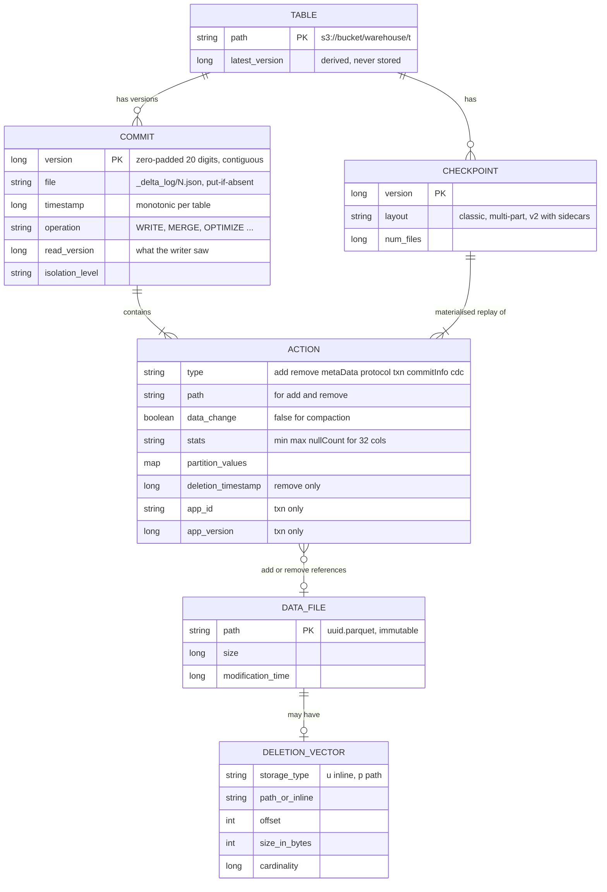
```mermaid
%% D7: entity relationship. The log is the truth, data files are referenced, never enumerated by LIST.
erDiagram
    TABLE ||--o{ COMMIT : "has versions"
    TABLE ||--o{ CHECKPOINT : "has"
    COMMIT ||--|{ ACTION : "contains"
    ACTION }o--o| DATA_FILE : "add or remove references"
    DATA_FILE ||--o| DELETION_VECTOR : "may have"
    CHECKPOINT ||--|{ ACTION : "materialised replay of"

    TABLE {
        string path PK "s3://bucket/warehouse/t"
        long latest_version "derived, never stored"
    }
    COMMIT {
        long version PK "zero-padded 20 digits, contiguous"
        string file "_delta_log/N.json, put-if-absent"
        long timestamp "monotonic per table"
        string operation "WRITE, MERGE, OPTIMIZE ..."
        long read_version "what the writer saw"
        string isolation_level
    }
    ACTION {
        string type "add remove metaData protocol txn commitInfo cdc"
        string path "for add and remove"
        boolean data_change "false for compaction"
        string stats "min max nullCount for 32 cols"
        map partition_values
        long deletion_timestamp "remove only"
        string app_id "txn only"
        long app_version "txn only"
    }
    DATA_FILE {
        string path PK "uuid.parquet, immutable"
        long size
        long modification_time
    }
    DELETION_VECTOR {
        string storage_type "u inline, p path"
        string path_or_inline
        int offset
        int size_in_bytes
        long cardinality
    }
    CHECKPOINT {
        long version PK
        string layout "classic, multi-part, v2 with sidecars"
        long num_files
    }
```

Access patterns that justify it:
- **Latest snapshot:** read `_last_checkpoint`, LIST `_delta_log/` from that version, GET the checkpoint and the tail. Never LIST the data directory.
- **Files for a query:** filter the snapshot's `add` set by partition values, then by min/max stats, then hand the survivors to the engine. Pruning happens in metadata.
- **Time travel to version `v`:** newest checkpoint with version ≤ `v`, replay to `v`. For a timestamp, binary search commit timestamps in the log.
- **Conflict check:** GET the JSON files `readVersion+1 .. latest` and scan their `add` and `remove` actions. Never the checkpoint.
- **Streaming source:** GET JSON files after the last processed version and emit their `add` actions with `dataChange=true`.
- **Idempotent sink:** look up `txn.version` for `appId` in the snapshot (the snapshot keeps the latest per app).

Partition key for the log: the table. Every table's log is independent, so tables scale horizontally for free. Nothing in the design is shared across tables, which is exactly why cross-table transactions are below the line.

---

## 4. High-level design

One subsection per functional requirement. Each one traces input to output through the boxes, adds the boxes it needs to a single diagram, and ends with what is still missing (which a deep dive in §5 fixes). The design at the end of §4 is deliberately the simple version.

### 4.1 Atomic writes: a job appends 500 files and readers see all or none

The trick that everything else builds on: **data files are never the truth. The log is.** A file that exists in the bucket but is not named by a committed log entry does not exist as far as the table is concerned.

**Flow (simple version): `df.write.mode("append").save(t)`**

1. The driver assigns the write a read version `r` = the latest version it can see (for a blind append it does not even need to read the table, only to know `r`).
2. Executors write Parquet files to the table directory under unique names (`part-<uuid>.parquet`). Nothing is overwritten. Each executor reports back `(path, size, partition values, stats)`.
3. The driver builds the commit: one `add` action per file, plus `commitInfo` (operation, timestamp, read version, isolation level).
4. The driver writes `_delta_log/<r+1>.json` with **put-if-absent**. If the object already exists, someone else committed `r+1` first (§4.3). If it succeeds, the write is committed. This single PUT is the atomic point.
5. If the driver dies before step 4, the Parquet files are orphans. No log entry names them, no reader will ever see them. A periodic `VACUUM` deletes unreferenced files older than the retention window.

**Flow: reader (simple version)**

1. LIST `_delta_log/`. Because versions are zero-padded to 20 digits, the listing is in version order.
2. GET every `N.json` in order, apply the actions: `add` puts a file in the live set, `remove` takes it out, `metaData` sets the schema.
3. The live set at the end is the snapshot. The engine reads exactly those files. A file added by a commit that landed after the LIST is invisible to this query, which is what snapshot isolation means.

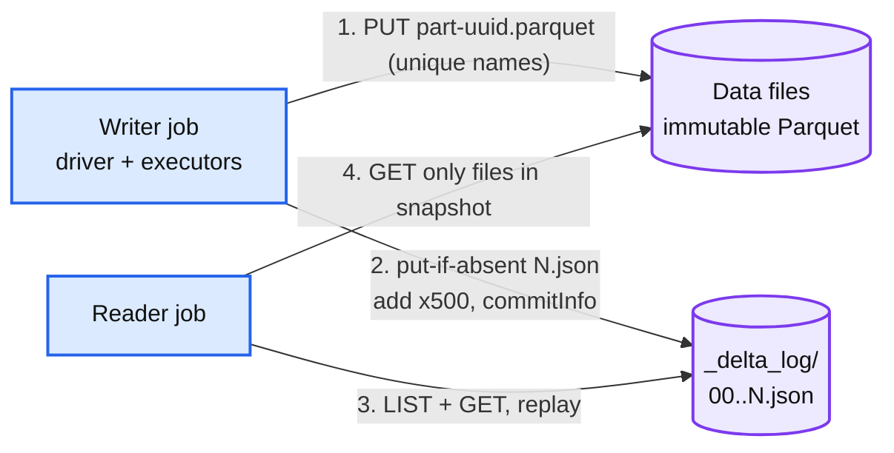
```mermaid
%% Incremental diagram, step 1 of 5: one writer, one reader, the log is the truth. Data files are written first, the commit is one put-if-absent.
flowchart LR
    W[Writer job<br/>driver + executors] -->|"1. PUT part-uuid.parquet (unique names)"| DATA[(Data files<br/>immutable Parquet)]
    W -->|"2. put-if-absent N.json<br/>add x500, commitInfo"| LOG[(_delta_log/<br/>00..N.json)]
    R[Reader job] -->|"3. LIST + GET, replay"| LOG
    R -->|"4. GET only files in snapshot"| DATA

    class W,R client
    class DATA,LOG store

    classDef client   fill:#dbeafe,stroke:#2563eb,stroke-width:2px,color:#111
    classDef store    fill:#ede9fe,stroke:#7c3aed,stroke-width:2px,color:#111
```

Data model so far: `commit(version, actions)`, `add(path, size, partitionValues, stats)`, `commitInfo`.

**What is still missing:** (a) replaying the whole log from version 0 is O(commits), which at 1 commit/s is 86,400 GETs after one day (§4.2 fixes it with checkpoints). (b) Put-if-absent is assumed. S3 did not have it until Aug 2024, ADLS and GCS did (§5.1). (c) Two writers both trying `r+1` (§4.3).

### 4.2 Consistent reads and time travel: a snapshot in a handful of requests

**Flow: build the latest snapshot**

1. GET `_delta_log/_last_checkpoint`. It says "the newest checkpoint is at version `c`". If it is missing, start from version 0.
2. LIST `_delta_log/` starting at key `c` (lexicographic listing plus zero padding makes "everything at or after `c`" one LIST call). This returns the checkpoint file(s) for `c` and every `N.json` for `N > c`. Normally ≤ 10 JSON files.
3. GET the checkpoint Parquet. It is the full replay up to `c`: every live `add`, plus `remove` tombstones that have not expired, plus the current `metaData` and `protocol`. Read it with the engine, in parallel, as a table.
4. GET and apply the tail `c+1 .. latest`.
5. The result is the snapshot at `latest`. Pin it for the whole query.

**Flow: who writes the checkpoint.** The writer that commits version `N` where `N mod 10 == 0` also writes `N.checkpoint.parquet` and then overwrites `_last_checkpoint`. Both are best-effort: if the writer dies in between, the next reader's LIST still finds the checkpoint (or falls back to an older one). A stale `_last_checkpoint` costs one longer LIST, never correctness (paper §3.2.1).

**Flow: `SELECT ... VERSION AS OF 42`**

1. Pick the newest checkpoint with version ≤ 42 (LIST from a lower bound, or walk `_last_checkpoint` back).
2. Replay to exactly 42, ignore everything after.
3. For `TIMESTAMP AS OF`, each commit carries a timestamp; Delta makes them monotonic per table (a commit whose clock is behind the previous commit gets `prev + 1 ms`), then binary-search the log.
4. The files named by snapshot 42 must still exist. That is a **retention** promise: `remove` tombstones keep their file for `deletedFileRetentionDuration` (7 days) before `VACUUM` may delete it, and log entries are kept for `logRetentionDuration` (30 days). Time travel beyond those windows is not possible. Say that out loud: time travel and retention are one knob.

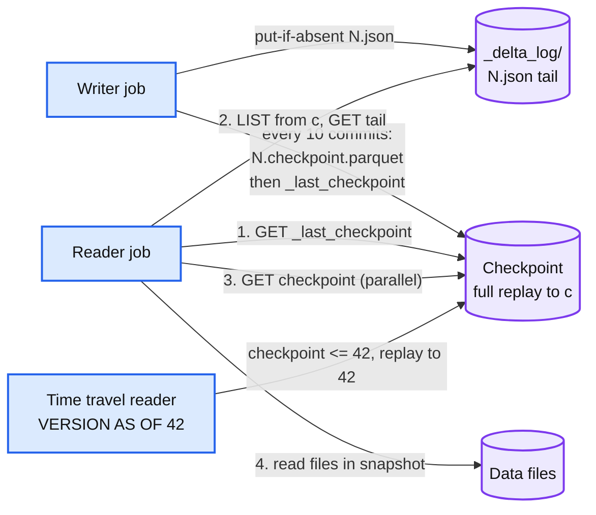
```mermaid
%% Incremental diagram, step 2 of 5: checkpoints bound replay. The reader touches a handful of objects, never the data directory listing.
flowchart LR
    W[Writer job] -->|"put-if-absent N.json"| LOG[(_delta_log/<br/>N.json tail)]
    W -->|"every 10 commits:<br/>N.checkpoint.parquet<br/>then _last_checkpoint"| CK[(Checkpoint<br/>full replay to c)]
    R[Reader job] -->|"1. GET _last_checkpoint"| CK
    R -->|"2. LIST from c, GET tail"| LOG
    R -->|"3. GET checkpoint (parallel)"| CK
    R -->|"4. read files in snapshot"| DATA[(Data files)]
    TT[Time travel reader<br/>VERSION AS OF 42] -->|"checkpoint <= 42, replay to 42"| CK

    class W,R,TT client
    class DATA,LOG,CK store

    classDef client   fill:#dbeafe,stroke:#2563eb,stroke-width:2px,color:#111
    classDef store    fill:#ede9fe,stroke:#7c3aed,stroke-width:2px,color:#111
```

Data model so far: `checkpoint(version)`, `_last_checkpoint{version, size, parts}`, `remove(path, deletionTimestamp)`, `commitInfo.timestamp` monotonic.

**What is still missing:** the checkpoint is the whole table's metadata. At 10 M files it is ~7.5 GB and every query planner reads it. That is the red node of this design, and §5.2 fixes it. Also: `VACUUM` racing with a long query that pinned an old snapshot (§5.5).

### 4.3 Concurrent writers: two clusters commit at the same moment

Optimistic concurrency control (OCC) on the log. No locks, no lease, no coordinator on the happy path. The object store's put-if-absent is the arbiter.

**Flow: `DELETE FROM t WHERE date = '2026-09-01'` while another job appends**

1. Deleter reads version `r = 100`. It records what it read: the predicate `date = '2026-09-01'` and the set of files it scanned (`F_read`). It rewrites the survivors of those files into new files and prepares `remove(F_read) + add(F_new)`.
2. Meanwhile the appender committed `101.json` (blind append, `add` only).
3. Deleter tries put-if-absent `101.json`. **412 Precondition Failed.**
4. Deleter LISTs from 101, GETs `101.json`, and runs **conflict detection** against its own read set:
   - Did 101 change `metaData` or `protocol`? Then fail (`MetadataChangedException`, `ProtocolChangedException`).
   - Did 101 `remove` a file in `F_read`? Then fail (`ConcurrentDeleteReadException`), someone changed what we read.
   - Did 101 `remove` a file we also remove? Fail (`ConcurrentDeleteDeleteException`).
   - Did 101 `add` files that match our read predicate? Under **Serializable**, fail (`ConcurrentAppendException`): a serial order where our delete ran after the append would have deleted those rows too. Under **WriteSerializable** (the Databricks default), allow it: the result is "as if" the delete ran before the append, which is a valid serial order of the *writes*, even though the history shows the append first.
   - Did 101 `add` files outside our predicate's partitions? No conflict.
5. No conflict, so retry: put-if-absent `102.json` with the same actions and an updated `readVersion`. Success.
6. If a conflict was found, the whole job re-runs from a fresh snapshot (the data it rewrote may be stale).

The rules in one table (Databricks, tables without row-level concurrency):

| Pair | WriteSerializable (default) | Serializable |
|---|---|---|
| INSERT + INSERT | Cannot conflict | Cannot conflict |
| INSERT + UPDATE/DELETE/MERGE | Cannot conflict | Can conflict. The UPDATE/DELETE/MERGE fails, not the INSERT |
| INSERT + OPTIMIZE | Cannot conflict | Cannot conflict |
| UPDATE/DELETE/MERGE + same | Can conflict (same files) | Can conflict (same files) |
| UPDATE/DELETE/MERGE + OPTIMIZE | Cannot conflict with deletion vectors on (unless `ZORDER BY`), can conflict otherwise | Same |
| OPTIMIZE + OPTIMIZE | Can conflict (same files) | Same |

Metadata changes (`ALTER TABLE`, schema-changing writes) conflict with everything.

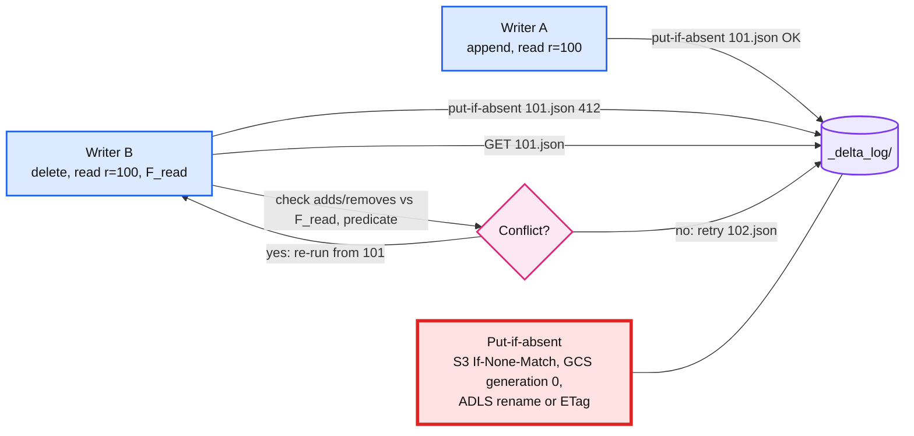
```mermaid
%% Incremental diagram, step 3 of 5: two writers race for N+1. The object store's put-if-absent is the only arbiter. The loser runs conflict detection and retries.
flowchart LR
    W1[Writer A<br/>append, read r=100] -->|"put-if-absent 101.json OK"| LOG[(_delta_log/)]
    W2[Writer B<br/>delete, read r=100, F_read] -->|"put-if-absent 101.json 412"| LOG
    W2 -->|"GET 101.json"| LOG
    W2 -->|"check adds/removes vs F_read, predicate"| CD{Conflict?}
    CD -->|"no: retry 102.json"| LOG
    CD -->|"yes: re-run from 101"| W2
    PIA[Put-if-absent<br/>S3 If-None-Match, GCS generation 0,<br/>ADLS rename or ETag]:::critical --- LOG

    class W1,W2 client
    class LOG store
    class CD decision

    classDef client   fill:#dbeafe,stroke:#2563eb,stroke-width:2px,color:#111
    classDef store    fill:#ede9fe,stroke:#7c3aed,stroke-width:2px,color:#111
    classDef decision fill:#fce7f3,stroke:#db2777,stroke-width:2px,color:#111
    classDef critical fill:#fee2e2,stroke:#dc2626,stroke-width:4px,color:#111
```

Data model so far: `commitInfo.readVersion`, `commitInfo.isolationLevel`, the writer's in-memory read set (files scanned, predicates), `txn(appId, version)` for idempotent retries (§4.5).

**What is still missing:** (a) the primitive. On S3 before Aug 2024 there was no put-if-absent, so "the object store is the arbiter" was false on the most popular store (§5.1). (b) The rate. Every attempt is an object store round trip, so a table sustains a few commits per second; ten streaming writers on one table will spend their time retrying (§5.3). (c) Granularity. Conflicts are detected per file. Two `MERGE`s that touch different rows of the same 1 GB file conflict anyway (§5.3, deletion vectors and row-level concurrency).

### 4.4 Row-level changes: `MERGE` into immutable files

Files are immutable, so a row-level change is "find the files that contain affected rows, produce replacements, commit `remove` + `add`". The interesting parts are how few files we touch and whether we rewrite them at all.

**Flow: `MERGE INTO t USING updates ON t.id = updates.id WHEN MATCHED UPDATE ... WHEN NOT MATCHED INSERT`**

1. Read snapshot `r`. Prune files: partition values, then min/max stats on `id`, then (if present) a Bloom filter. From 1 M files maybe 2,000 survive. Those are `F_read`.
2. Inner join `F_read` with `updates` to find which files actually contain matched rows: say 300 (`F_touched`). This join is the expensive part of MERGE and the reason MERGE conditions should include partition columns.
3. **Copy-on-write:** rewrite each of the 300 files with matched rows updated, plus new files for unmatched inserts. Commit `remove(300) + add(300 + inserts)`. A 1-row update in a 1 GB file rewrites 1 GB: write amplification of ~10^7 for that file.
4. **Merge-on-read with deletion vectors:** instead of rewriting, write a small bitmap per touched file marking the updated rows as deleted, write the *new* row versions into fresh files, and commit `add(file, deletionVector=dv1)` (which replaces the old `add` for the same path) + `add(new files)`. Readers apply the bitmap when scanning. A 1-row update now writes a few KB plus one row, and the 1 GB file is untouched.
5. Either way, a concurrent writer that removed one of `F_read` makes us fail conflict detection and re-run (§4.3).

**Flow: GDPR erase, `DELETE FROM t WHERE user_id = 42`**

1. Same pruning. With deletion vectors the delete commits in seconds and the rows are invisible immediately to every new snapshot.
2. But the bytes are still in the Parquet file and in the deleted-file retention window, and in any checkpoint or old version that can still be time-travelled. "Really gone" = after `VACUUM` past the retention (7 days default), and after `OPTIMIZE` or `REORG ... APPLY (PURGE)` has rewritten files to drop rows masked by deletion vectors. The honest answer is "invisible in seconds, physically gone in about a week, and time travel to before the delete is also gone". If the requirement is stricter, shorten retention for that table or encrypt per user and drop the key (crypto-shred, as in [`../immutable-object-store/`](../immutable-object-store/)).

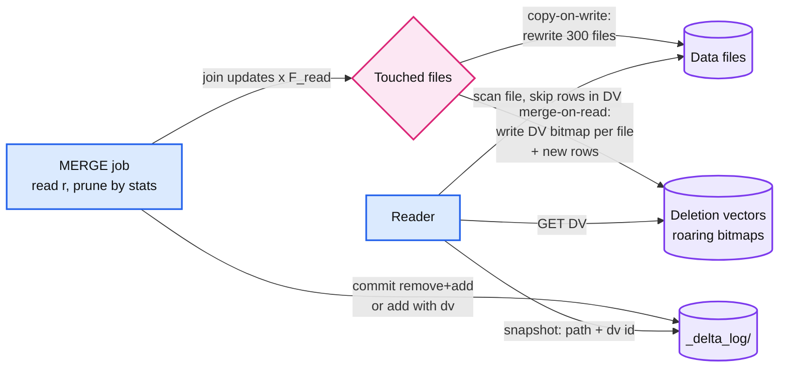
```mermaid
%% Incremental diagram, step 4 of 5: row-level change. Prune with stats, join to find touched files, then either rewrite (copy-on-write) or mark rows in a deletion vector (merge-on-read).
flowchart LR
    M[MERGE job<br/>read r, prune by stats] -->|"join updates x F_read"| T{Touched files}
    T -->|"copy-on-write:<br/>rewrite 300 files"| DATA[(Data files)]
    T -->|"merge-on-read:<br/>write DV bitmap per file<br/>+ new rows"| DV[(Deletion vectors<br/>roaring bitmaps)]
    M -->|"commit remove+add<br/>or add with dv"| LOG[(_delta_log/)]
    R[Reader] -->|"snapshot: path + dv id"| LOG
    R -->|"scan file, skip rows in DV"| DATA
    R -->|"GET DV"| DV

    class M,R client
    class DATA,DV,LOG store
    class T decision

    classDef client   fill:#dbeafe,stroke:#2563eb,stroke-width:2px,color:#111
    classDef store    fill:#ede9fe,stroke:#7c3aed,stroke-width:2px,color:#111
    classDef decision fill:#fce7f3,stroke:#db2777,stroke-width:2px,color:#111
```

Data model so far: `add.deletionVector{storageType, pathOrInline, offset, sizeInBytes, cardinality}`, `add.stats` used for pruning, optional `cdc` actions when Change Data Feed is on (before and after images written as separate files so downstream consumers can read "what changed in version N").

**What is still missing:** deletion vectors pile up. A file with 40% of its rows deleted is read in full and 40% thrown away, and every read pays a DV fetch. Something must fold DVs back into clean files (§5.4). And a MERGE that reads 2,000 files to touch 300 has a large read set that conflicts easily (§5.3).

### 4.5 Evolve without downtime: schema, compaction, retention, streaming

All four are "just commits", which is the point of the design. None needs a lock or a maintenance window.

**Flow: `ALTER TABLE t ADD COLUMN c INT`**

1. Commit a new `metaData` action with the new schema. Existing files lack the column, readers fill `null` (protocol rule: columns in the schema may be missing from files).
2. Every in-flight writer that read the old `metaData` fails conflict detection at commit and retries with the new schema. Streaming readers stop at the metadata change and must be restarted, by design.
3. Rename or drop a column: with **column mapping**, each column has a stable physical name and id in the Parquet files, so the logical rename is metadata only. Without it, a rename would require rewriting every file.

**Flow: `OPTIMIZE t` (compaction)**

1. Read snapshot `r`. Bin-pack small files per partition into targets of ~1 GB. Rewrite them (and fold deletion vectors in, so the output files are clean).
2. Commit `remove(small) + add(big)` with **`dataChange = false`** on every action. That flag says "this commit rearranges bytes, it does not change the table's contents".
3. Because `dataChange = false`, a streaming reader tailing the log ignores it (it would otherwise re-emit every row), and a concurrent blind append cannot conflict with it (appends have no read set, and OPTIMIZE's adds are not new data). Two OPTIMIZEs on the same partition do conflict (both remove the same files), so schedule one per table.

**Flow: `VACUUM t`**

1. Build the snapshot. Everything it references is live.
2. LIST the data directory (this is the one place LIST of data happens, and it is why VACUUM is slow on big tables). Any file not referenced by the snapshot and whose `remove` tombstone (or modification time, for orphans) is older than `deletedFileRetentionDuration` is deleted.
3. Log cleanup happens at checkpoint time: JSON entries older than `logRetentionDuration` are deleted, always leaving a checkpoint at the oldest kept version.

**Flow: streaming sink with exactly-once**

1. Structured Streaming micro-batch `b` writes its files and commits `add(...) + txn(appId = queryId, version = b)`.
2. On restart after a crash the sink reads the snapshot's `txn` for its `appId`. If `version >= b`, the batch is already in the table: skip. Otherwise commit. The `txn` action is in the same atomic commit as the data, so "written but not recorded" cannot happen.

**Flow: streaming source.** A reader tails the log: each new version's `add` actions with `dataChange = true` are the new rows. `remove` actions mean an update or delete happened and the stream fails unless told to ignore or to emit changes (Change Data Feed gives it a proper changelog).

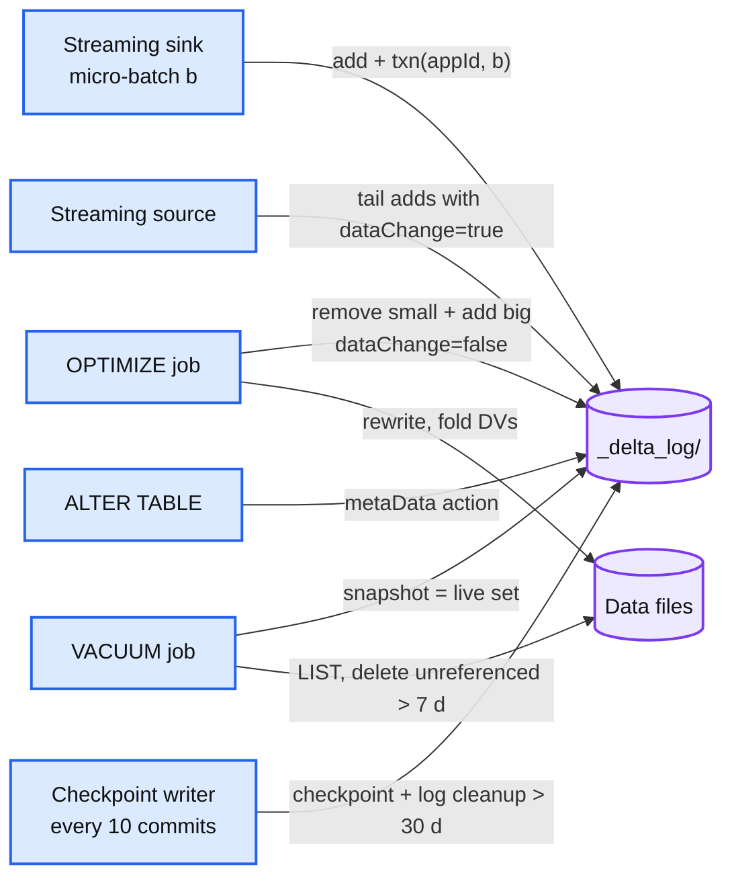
```mermaid
%% Incremental diagram, step 5 of 5: maintenance and streaming are more commits. OPTIMIZE marks dataChange=false so streams and appends ignore it.
flowchart LR
    ST[Streaming sink<br/>micro-batch b] -->|"add + txn(appId, b)"| LOG[(_delta_log/)]
    SR[Streaming source] -->|"tail adds with dataChange=true"| LOG
    OPT[OPTIMIZE job] -->|"remove small + add big<br/>dataChange=false"| LOG
    OPT -->|"rewrite, fold DVs"| DATA[(Data files)]
    VAC[VACUUM job] -->|"snapshot = live set"| LOG
    VAC -->|"LIST, delete unreferenced > 7 d"| DATA
    ALT[ALTER TABLE] -->|"metaData action"| LOG
    CKW[Checkpoint writer<br/>every 10 commits] -->|"checkpoint + log cleanup > 30 d"| LOG

    class ST,SR,OPT,VAC,ALT,CKW client
    class LOG,DATA store

    classDef client   fill:#dbeafe,stroke:#2563eb,stroke-width:2px,color:#111
    classDef store    fill:#ede9fe,stroke:#7c3aed,stroke-width:2px,color:#111
```

Data model so far: `metaData.schema` with column ids, `add.dataChange`, `txn(appId, version)`, `remove.deletionTimestamp`.

End of §4. We have a correct but naive design: atomic commits that assume put-if-absent, snapshots that read a checkpoint whose size grows with the file count, OCC that caps at a few commits per second and conflicts per file, deletion vectors that need folding, and nothing said about failure or cost.

---

## 5. Deep dives

One per non-functional requirement. Each one names what breaks in the §4 design with a number, fixes it, and lists what changed in the API, the data model, and the diagram.

### 5.1 "Commit is atomic on every cloud": the put-if-absent primitive

**What breaks.** §4.1 step 4 assumes "create `N.json` only if it does not exist". The paper (2020) had to say: "Amazon S3 does not have atomic put-if-absent or rename operations". Two writers on S3 could both PUT `101.json`, the second silently overwriting the first, and the first writer's 500 files would vanish from the table while it reported success. ADLS Gen2 with a hierarchical namespace has an atomic rename, GCS has `x-goog-if-generation-match: 0`, Azure Blob has `If-None-Match: *`. S3 got `If-None-Match: *` on `PutObject` in Aug 2024 (loser gets `412 Precondition Failed`). So the design is portable now, but the interviewer will ask "and before that?".

**Fix: a LogStore interface, one implementation per store.**
- The three primitives from §3.2: `write(path, bytes, mustBeNew)`, `listFrom(path)`, `read(path)`.
- **S3 before conditional writes:** the OSS `S3DynamoDBLogStore` (Delta 1.2, 2022). Writer first does a conditional `PutItem` on a DynamoDB row keyed `(table, version)` with `attribute_not_exists`; whoever wins the row owns the version and then writes the JSON to S3. DynamoDB is the mutual exclusion, S3 is the storage. Readers never touch DynamoDB. A writer that dies between the two steps leaves a row with `complete=false`; the next writer or reader finishes the S3 write from the temp copy recorded in the row (the row stores the temp path, so recovery is possible). Databricks ran the same idea as an internal "lightweight coordination service" (paper §3.2.2).
- **S3 after Aug 2024:** `PutObject` with `If-None-Match: *`. The 412 is the conflict signal. A `409 Conflict` can appear if a delete races the put, which for the log means someone ran a broken cleanup, and the writer should retry.
- **The catalog as the arbiter (Delta 4.0 `catalogManaged`, Iceberg's model from day one).** The writer stages the commit at `_delta_log/_staged_commits/<v>.<uuid>.json` (or sends it inline) and asks the catalog to ratify it. The catalog does a compare-and-swap on "latest version" in its own database, so exactly one proposal per version wins, and later publishes ratified commits as `<v>.json`. Readers ask the catalog for the unpublished tail. This also gives cross-table atomicity a place to live, and a commit becomes a database write (~5 ms) instead of an object-store write (~100 ms). The price: writers and readers now depend on the catalog's availability, and filesystem-only readers are locked out.

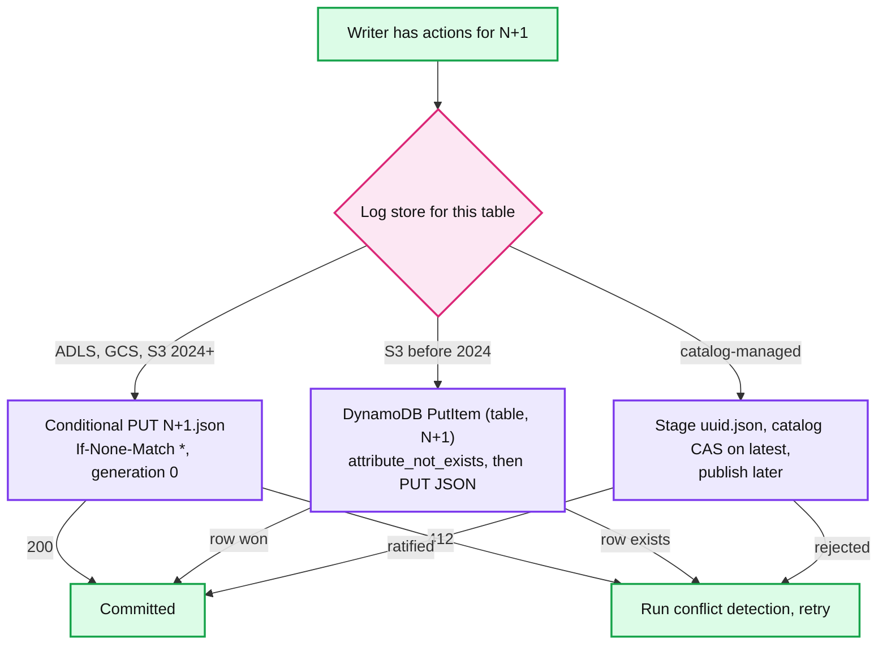
```mermaid
%% D6 (§5.1): which arbiter decides version N+1. Three implementations of the same "mustBeNew" contract.
flowchart TD
    C[Writer has actions for N+1] --> Q{Log store for this table}
    Q -->|"ADLS, GCS, S3 2024+"| P1["Conditional PUT N+1.json<br/>If-None-Match *, generation 0"]
    Q -->|"S3 before 2024"| P2["DynamoDB PutItem (table, N+1)<br/>attribute_not_exists, then PUT JSON"]
    Q -->|"catalog-managed"| P3["Stage uuid.json, catalog CAS on latest,<br/>publish later"]
    P1 -->|"200"| OK[Committed]
    P1 -->|"412"| CF[Run conflict detection, retry]
    P2 -->|"row won"| OK
    P2 -->|"row exists"| CF
    P3 -->|"ratified"| OK
    P3 -->|"rejected"| CF

    class C,OK,CF service
    class Q decision
    class P1,P2,P3 store

    classDef service  fill:#dcfce7,stroke:#16a34a,stroke-width:2px,color:#111
    classDef store    fill:#ede9fe,stroke:#7c3aed,stroke-width:2px,color:#111
    classDef decision fill:#fce7f3,stroke:#db2777,stroke-width:2px,color:#111
```

**What changed.** API: `LogStore` is pluggable per scheme. Data model: `_delta_log/_staged_commits/` and the catalog's `(table, latest_version)` row for the managed variant. Diagram: the red "put-if-absent" node in §4.3 becomes one of three arbiters. Rule to say out loud: **exactly one component may decide who owns version N+1, and readers must never need it.** Details in [`deep-dives/transaction-log-and-commit-protocol.md`](deep-dives/transaction-log-and-commit-protocol.md).

### 5.2 "Snapshot under 1 s at 1 M files, under 10 s at 10 M": the checkpoint wall

**What breaks.** The §4.2 checkpoint is the entire table's metadata. §2's math: 10 M files × ~0.75 KB = ~7.5 GB. Every query planner downloads and parses it before it can prune a single file. At 100 MB/s from a single driver that is 75 s; at 1 GB/s across a cluster still 7.5 s, and the cluster does this per query. Worse, the *writer* of the checkpoint at every 10th commit rewrites all 7.5 GB, so at 1 commit/s the table spends most of its time writing checkpoints. Log replay is the other direction: with no checkpoint, 86,400 JSON GETs per day of history.

**Fix, in order of leverage.**
1. **Fewer files.** Compaction to 1 GB files turns 10 M into 1 M and the checkpoint into 0.75 GB. This is the biggest lever and it is free (§5.4).
2. **Read the checkpoint as a table, in parallel, with pruning.** Stats are stored as a struct column (`stats_parsed`) not a JSON string, partition values as a struct, so the planner runs `WHERE partitionValues.date = '2026-09-01'` on the checkpoint itself with Parquet column pruning and row-group min/max skipping. A query over one partition reads a slice of the checkpoint, not all of it.
3. **V2 checkpoints with sidecars.** The checkpoint becomes a small manifest (`N.checkpoint.<uuid>.json` or `.parquet`) that lists **sidecar** Parquet files under `_delta_log/_sidecars/`, each holding a slice of the `add`/`remove` actions. A new checkpoint rewrites only the sidecars whose contents changed and re-links the rest. Writing the 10th checkpoint of the hour no longer costs 7.5 GB, and readers fetch sidecars in parallel and can skip sidecars by partition range. This is Iceberg's metadata tree (metadata.json → manifest list → manifests) arriving in Delta.
4. **Cache the parsed snapshot** on the cluster keyed by `(table, version)`. Repeated queries on a hot table pay the LIST (one call) and the tail (≤ 10 small GETs), not the checkpoint. The paper's 108 s → 17 s at 1 M partitions is exactly this cache.
5. **Multi-part checkpoints** (V1) split the Parquet into `N.checkpoint.o.p.parquet` parts so writers write in parallel; readers must ignore a checkpoint with a missing part because parts cannot be written atomically. V2 supersedes it.

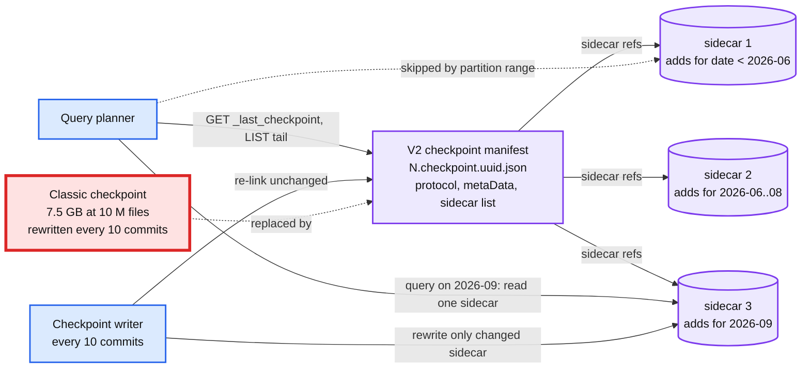
```mermaid
%% D10 (§5.2): the checkpoint is the scaling wall. V2 checkpoint = small manifest + sidecars, rewrite only what changed, read only what the query needs.
flowchart LR
    R[Query planner] -->|"GET _last_checkpoint, LIST tail"| M["V2 checkpoint manifest<br/>N.checkpoint.uuid.json<br/>protocol, metaData, sidecar list"]
    M -->|"sidecar refs"| S1[(sidecar 1<br/>adds for date < 2026-06)]
    M -->|"sidecar refs"| S2[(sidecar 2<br/>adds for 2026-06..08)]
    M -->|"sidecar refs"| S3[(sidecar 3<br/>adds for 2026-09)]
    R -->|"query on 2026-09: read one sidecar"| S3
    R -.->|"skipped by partition range"| S1
    W[Checkpoint writer<br/>every 10 commits] -->|"rewrite only changed sidecar"| S3
    W -->|"re-link unchanged"| M
    OLD[Classic checkpoint<br/>7.5 GB at 10 M files<br/>rewritten every 10 commits]:::critical -.->|"replaced by"| M

    class R,W client
    class M,S1,S2,S3 store

    classDef client   fill:#dbeafe,stroke:#2563eb,stroke-width:2px,color:#111
    classDef store    fill:#ede9fe,stroke:#7c3aed,stroke-width:2px,color:#111
    classDef critical fill:#fee2e2,stroke:#dc2626,stroke-width:4px,color:#111
```

**Push back on the textbook answer.** "Put the file list in a database" (the Hive metastore answer) trades a 7.5 GB Parquet read for a metastore that must serve 10 M rows per query and becomes the bottleneck, which is what the paper says happened to the Hive metastore at millions of objects. The object store already has the throughput; the fix is layout (sidecars, struct stats) and count (compaction), not a new tier.

**What changed.** Data model: `checkpoint.layout` (classic / multi-part / v2), `sidecar` action, `stats_parsed` struct. Diagram: the checkpoint node splits into manifest plus sidecars. Numbers: 1 M files at 1 GB each → 0.75 GB total metadata, one partition's slice ~10 MB, snapshot under 1 s cached, ~3 s cold. Details in [`deep-dives/snapshots-checkpoints-and-time-travel.md`](deep-dives/snapshots-checkpoints-and-time-travel.md).

### 5.3 "10 concurrent writers, 1 commit/s sustained, few false conflicts": the OCC ceiling

**What breaks.** Two numbers. (a) **Rate.** One commit attempt is PUT (50 to 200 ms) plus, on loss, LIST (50 ms) plus k GETs (5 to 10 ms each) plus the check. Ten writers all aiming at version 101: one wins, nine lose and retry at 102, eight lose, and so on: ~45 attempts for 10 commits, ~10 s of wall time for what should be 10 × 150 ms. The paper states the ceiling plainly: "several transactions per second". (b) **False conflicts.** Detection is per file. A MERGE that read 2,000 files conflicts with any concurrent UPDATE that removed one of them, even if the rows were different. Under Serializable, it also conflicts with any append into the partitions it read. Ten MERGE writers on one unpartitioned table serialise completely and each retry re-runs a full join.

**Fix.**
- **Blind appends never read, so they never lose.** Streaming ingest should be `append` with no subquery on the target. Under WriteSerializable they cannot conflict with anything. Ten streaming writers on one table cost only the put-if-absent race, no re-planning.
- **Partition so read sets are disjoint.** `MERGE ... ON t.date = s.date AND t.id = s.id` prunes `F_read` to one partition. Two MERGEs on different dates have disjoint read and write sets and both commit on their first or second attempt.
- **Row-level concurrency.** With deletion vectors on and no partitions, Databricks (DBR 14.3+) compares *rows*, not files: two MERGEs that touched different rows of the same file both commit, and UPDATE/DELETE/MERGE never conflict with OPTIMIZE (unless `ZORDER BY`), because OPTIMIZE's rewrite is `dataChange=false` and the DV can be re-based onto the new file. This drops the false-conflict rate on hot tables by an order of magnitude.
- **Retry with jittered backoff, bounded attempts** (Delta defaults to many attempts with backoff). A long job that keeps losing to short appends is the starvation case: fix it by partitioning, not by more retries.
- **Raise the ceiling with a coordinator.** When one table genuinely needs 50+ commits/s (thousands of IoT writers, a CDC firehose fanned out), move the arbiter to the catalog (§5.1, option 3): commits become a ~5 ms database CAS, and the coordinator can *order* concurrent non-conflicting commits instead of making them race (it assigns versions, it can even run the conflict check centrally with the read sets in hand). Cost: a stateful service on the write path with its own HA story, and readers of unpublished commits must ask it. The simplest honest alternative is "batch upstream": one ingest job per table, 1 commit/s of 1,000 files, which is what the paper says almost everyone does.

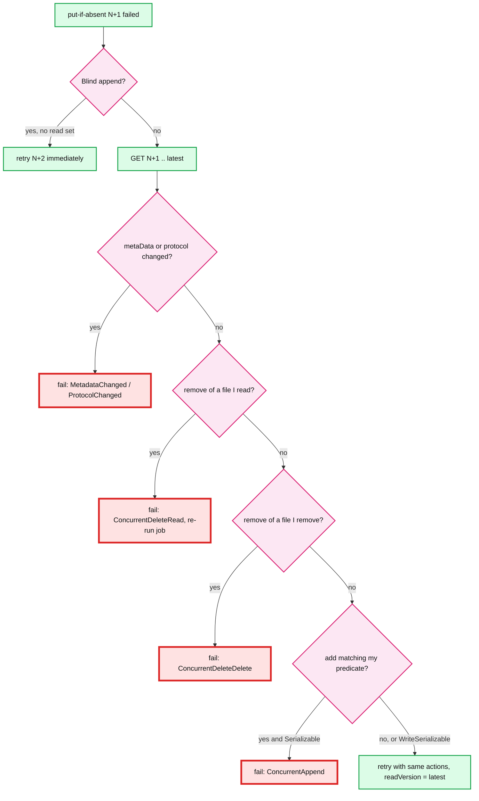
```mermaid
%% D6 (§5.3): what a losing writer does. Blind appends skip the check entirely.
flowchart TD
    A[put-if-absent N+1 failed] --> B{Blind append?}
    B -->|"yes, no read set"| C[retry N+2 immediately]
    B -->|"no"| D[GET N+1 .. latest]
    D --> E{metaData or protocol changed?}
    E -->|"yes"| X[fail: MetadataChanged / ProtocolChanged]
    E -->|"no"| F{remove of a file I read?}
    F -->|"yes"| X2[fail: ConcurrentDeleteRead, re-run job]
    F -->|"no"| G{remove of a file I remove?}
    G -->|"yes"| X3[fail: ConcurrentDeleteDelete]
    G -->|"no"| H{add matching my predicate?}
    H -->|"yes and Serializable"| X4[fail: ConcurrentAppend]
    H -->|"no, or WriteSerializable"| I[retry with same actions, readVersion = latest]

    class A,C,D,I service
    class B,E,F,G,H decision
    class X,X2,X3,X4 critical

    classDef service  fill:#dcfce7,stroke:#16a34a,stroke-width:2px,color:#111
    classDef decision fill:#fce7f3,stroke:#db2777,stroke-width:2px,color:#111
    classDef critical fill:#fee2e2,stroke:#dc2626,stroke-width:4px,color:#111
```

**What changed.** API: `isolationLevel` per table, row-level concurrency implied by `enableDeletionVectors` + no partitions. Data model: the read set gains row identity (row tracking: `baseRowId` per file, `defaultRowCommitVersion`) so the checker can compare rows. Diagram: an optional commit coordinator beside the log store. Numbers: OCC ~3 to 5 commits/s per table, coordinator ~100/s, blind appends at either rate with zero re-planning. Details in [`deep-dives/optimistic-concurrency-and-conflict-detection.md`](deep-dives/optimistic-concurrency-and-conflict-detection.md).

### 5.4 "Streaming at 1 commit/s, reads still fast after a month": small files and layout

**What breaks.** A streaming writer with 100 partitions and a 1 s trigger writes 100 files/s of ~1 MB. After a day: 8.6 M files, 8.6 TB. Each file costs a reader 2 GETs for the footer (~10 ms each), a task, and ~0.75 KB of checkpoint. A query on one day opens 86,400 files to read 86 GB: ~30 min of footer latency on 100 executors before the first byte of data. The checkpoint grows 6 GB/day. And deletion vectors from §4.4 accumulate until a file with 90% deleted rows is still read in full.

**Fix, three layers.**
1. **Write bigger files in the first place.** Optimized writes: shuffle before write so each partition gets one writer task and one ~128 MB file per micro-batch instead of one per task. Trigger interval of 10 s to 1 min instead of 1 s where latency allows. This alone cuts the file rate 10 to 100x.
2. **Auto compaction after the commit.** The writer, after committing, checks whether the partitions it touched have more than N (50) files under 128 MB and if so runs a small `OPTIMIZE` on just those, as a separate `dataChange=false` commit. Cheap, incremental, and it cannot conflict with the next append.
3. **Scheduled `OPTIMIZE`** (hourly or daily) bin-packs to the 1 GB target across the table and folds deletion vectors back into clean files (`REORG ... APPLY (PURGE)` if the goal is physical erasure). Its commit is `dataChange=false`, so streams tailing the log skip it and appends cannot conflict with it. One OPTIMIZE per table at a time, or partition-scoped ones, since two on the same files conflict.

**Layout for pruning.** Compaction is also the moment to sort. Sorting on one column makes min/max stats selective on that column only. **Z-order** interleaves bits of 2 to 4 columns so files are tight ranges in every one of them (paper §6.2: Z-order on 4 columns skipped at least 43% of files on any one column, 54% on average, vs 25% on average for a global sort that only helps its first column; a 500 TB production table skipped 93%). **Liquid clustering** replaces Z-order with an incremental scheme: new data is clustered on arrival and only unclustered files are rewritten, so it does not re-shuffle the whole table every OPTIMIZE and it can change keys without a rewrite. Rule: cluster on the 2 to 4 highest-cardinality filter columns, partition only on low-cardinality time-like columns (and not at all under 1 TB).

**Cost.** Compaction rewrites every byte at least once, sometimes twice (auto compaction to 128 MB, OPTIMIZE to 1 GB). For 8.6 TB/day ingest that is 17 TB/day of extra write traffic and ~1 hour/day of a 50-node cluster. The alternative, not compacting, is paid by every reader forever. Say the exchange rate: **one extra write per byte buys every future read a 10 to 100x smaller file count.**

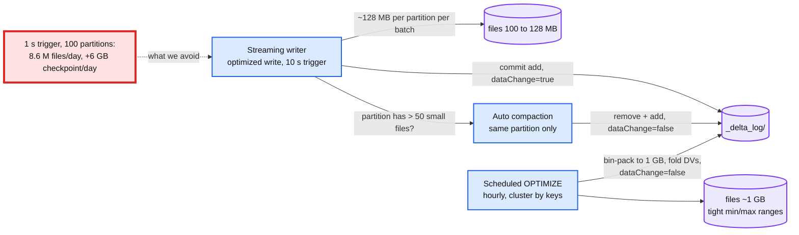
```mermaid
%% D6 (§5.4): where each file size comes from. Small files are created by streaming and fixed in two stages, both as dataChange=false commits.
flowchart LR
    S[Streaming writer<br/>optimized write, 10 s trigger] -->|"~128 MB per partition per batch"| F1[(files 100 to 128 MB)]
    S -->|"commit add, dataChange=true"| LOG[(_delta_log/)]
    S -->|"partition has > 50 small files?"| AC[Auto compaction<br/>same partition only]
    AC -->|"remove + add, dataChange=false"| LOG
    OPT[Scheduled OPTIMIZE<br/>hourly, cluster by keys] -->|"bin-pack to 1 GB, fold DVs,<br/>dataChange=false"| LOG
    OPT --> F2[(files ~1 GB<br/>tight min/max ranges)]
    SMALL[1 s trigger, 100 partitions:<br/>8.6 M files/day, +6 GB checkpoint/day]:::critical -.->|"what we avoid"| S

    class S,AC,OPT client
    class F1,F2,LOG store

    classDef client   fill:#dbeafe,stroke:#2563eb,stroke-width:2px,color:#111
    classDef store    fill:#ede9fe,stroke:#7c3aed,stroke-width:2px,color:#111
    classDef critical fill:#fee2e2,stroke:#dc2626,stroke-width:4px,color:#111
```

**What changed.** API: `OPTIMIZE`, `ZORDER BY` / `CLUSTER BY`, table properties `targetFileSize`, `autoOptimize.*`. Data model: `add.dataChange=false`, clustering columns in `metaData`/`domainMetadata`. Diagram: two maintenance writers beside the stream. Details in [`deep-dives/compaction-and-data-layout.md`](deep-dives/compaction-and-data-layout.md).

### 5.5 "Time travel 30 days, GDPR in 7, VACUUM never breaks a reader": retention

**What breaks.** Three races on the §4.2/§4.5 design. (a) A query pinned snapshot 100 at 09:00 and is still scanning at 09:30. At 09:10 a MERGE removed file `f`. If `VACUUM` deleted `f` at 09:20, the query fails with `FileNotFound` mid-scan. (b) A job that ran longer than 7 days (a giant backfill) has its own *uncommitted* output files deleted as orphans before it commits. (c) Time travel to 40 days ago: the log entries are gone (30-day retention) and so is the ability to know which files made up that version.

**Fix.**
- **Retention is a promise to readers, not a cleanup schedule.** `VACUUM` deletes only files whose `remove` is older than `deletedFileRetentionDuration` (7 days) and orphans older than the same. A reader that started inside the window is safe by construction as long as no query runs longer than the window. `VACUUM ... RETAIN 0 HOURS` exists and is refused by default (`retentionDurationCheck`) because it is exactly race (a).
- **Uncommitted files and long jobs.** Orphan cleanup uses the file's modification time, so a 9-day job's early output is at risk. Either raise the retention for that table for the run, or make giant jobs commit in stages (each stage is its own version, which is also better for retries).
- **Time travel window = min(log retention, file retention) in practice.** You can keep 30 days of log but if files were vacuumed after 7 days, versions older than 7 days reference missing files. Say: "30 days of history is only real if deleted-file retention is also 30 days, which costs storage for every rewritten byte for 30 days".
- **GDPR.** `DELETE` (seconds, via DVs) → the rows are invisible to every new snapshot. Physical: `OPTIMIZE`/`REORG PURGE` rewrites the files without the rows, then `VACUUM` after the retention deletes the old files. Total: retention + one maintenance cycle, so ~8 days at defaults. To do it in 24 h for one table: set that table's retention to 1 day and accept that time travel there is 1 day. Old checkpoints hold only metadata (paths and stats). Stats can leak values (min/max of a name column), which is why `dataSkippingStatsColumns` should exclude PII columns.
- **Log cleanup is safe by design:** it runs at checkpoint time, deletes only JSON older than 30 days, and always leaves a checkpoint at the oldest kept version so every retained version is reconstructible.

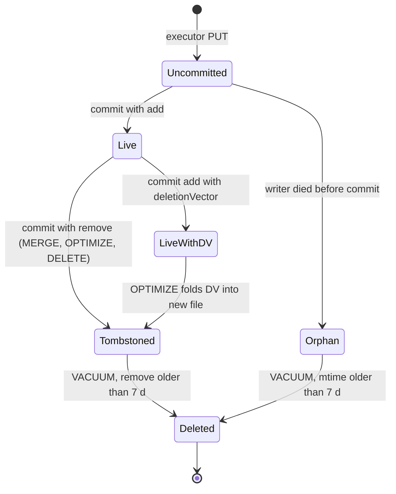
```mermaid
%% D8 (§5.5): lifecycle of one data file. It is only ever deleted from the tombstone state, after the retention window.
stateDiagram-v2
    [*] --> Uncommitted: executor PUT
    Uncommitted --> Live: commit with add
    Uncommitted --> Orphan: writer died before commit
    Live --> Tombstoned: commit with remove (MERGE, OPTIMIZE, DELETE)
    Live --> LiveWithDV: commit add with deletionVector
    LiveWithDV --> Tombstoned: OPTIMIZE folds DV into new file
    Tombstoned --> Deleted: VACUUM, remove older than 7 d
    Orphan --> Deleted: VACUUM, mtime older than 7 d
    Deleted --> [*]
```

**What changed.** API: `VACUUM [RETAIN n HOURS]`, `REORG ... APPLY (PURGE)`, `dataSkippingStatsColumns`. Data model: `remove.deletionTimestamp` is what VACUUM reads. Diagram: VACUUM reads the snapshot before it LISTs. Details in [`deep-dives/snapshots-checkpoints-and-time-travel.md`](deep-dives/snapshots-checkpoints-and-time-travel.md) and [`deep-dives/row-level-changes-cow-vs-mor.md`](deep-dives/row-level-changes-cow-vs-mor.md).

---

## 6. Final design and the six core flows

Everything from §5 composed. Under 15 nodes; zoom-ins in [`diagrams.md`](diagrams.md).

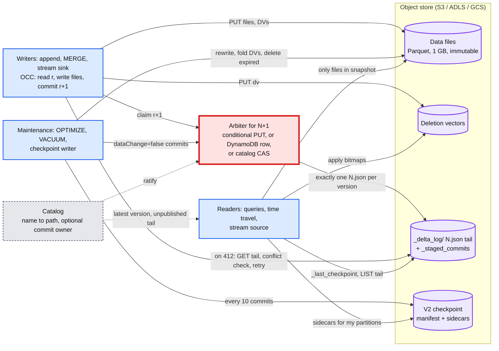
```mermaid
%% D3: final design. No service on the read path. One arbiter per table for version N+1. Everything else is a job that reads and writes objects. The arbiter is red: it is the one thing that serialises the table.
flowchart LR
    subgraph OBJ["Object store (S3 / ADLS / GCS)"]
        DATA[(Data files<br/>Parquet, 1 GB, immutable)]
        DV[(Deletion vectors)]
        LOG[(_delta_log/ N.json tail<br/>+ _staged_commits)]
        CK[(V2 checkpoint<br/>manifest + sidecars)]
    end
    ARB[Arbiter for N+1<br/>conditional PUT, or DynamoDB row,<br/>or catalog CAS]:::critical
    WR[Writers: append, MERGE, stream sink<br/>OCC: read r, write files, commit r+1] -->|"PUT files, DVs"| DATA
    WR -->|"PUT dv"| DV
    WR -->|"claim r+1"| ARB
    ARB -->|"exactly one N.json per version"| LOG
    WR -->|"on 412: GET tail, conflict check, retry"| LOG
    MT[Maintenance: OPTIMIZE, VACUUM,<br/>checkpoint writer] -->|"dataChange=false commits"| ARB
    MT -->|"rewrite, fold DVs, delete expired"| DATA
    MT -->|"every 10 commits"| CK
    RD[Readers: queries, time travel,<br/>stream source] -->|"_last_checkpoint, LIST tail"| LOG
    RD -->|"sidecars for my partitions"| CK
    RD -->|"only files in snapshot"| DATA
    RD -->|"apply bitmaps"| DV
    CAT[Catalog<br/>name to path, optional commit owner] -.->|"latest version, unpublished tail"| RD
    CAT -.->|"ratify"| ARB

    class WR,MT,RD client
    class DATA,DV,LOG,CK store
    class CAT external

    classDef client   fill:#dbeafe,stroke:#2563eb,stroke-width:2px,color:#111
    classDef store    fill:#ede9fe,stroke:#7c3aed,stroke-width:2px,color:#111
    classDef external fill:#e5e7eb,stroke:#6b7280,stroke-width:2px,color:#111,stroke-dasharray:4 3
    classDef critical fill:#fee2e2,stroke:#dc2626,stroke-width:4px,color:#111
```

The six flows below are the ones to be able to say from memory. Each is the final design, not the §4 version.

### Flow 1: commit (append of 500 files, about 300 ms after the data is written)

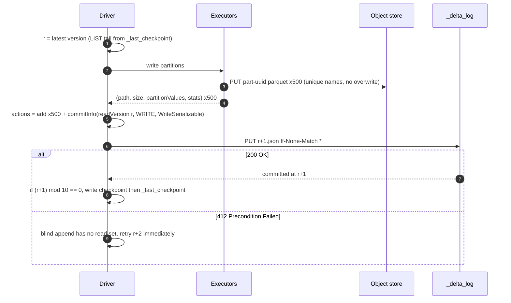
```mermaid
%% D4 (FR1 final): a blind append. The only atomic step is the conditional PUT of the JSON.
sequenceDiagram
    autonumber
    participant D as Driver
    participant E as Executors
    participant OS as Object store
    participant L as _delta_log
    D->>D: r = latest version (LIST tail from _last_checkpoint)
    D->>E: write partitions
    E->>OS: PUT part-uuid.parquet x500 (unique names, no overwrite)
    E-->>D: (path, size, partitionValues, stats) x500
    D->>D: actions = add x500 + commitInfo(readVersion r, WRITE, WriteSerializable)
    D->>L: PUT r+1.json If-None-Match *
    alt 200 OK
        L-->>D: committed at r+1
        D->>D: if (r+1) mod 10 == 0, write checkpoint then _last_checkpoint
    else 412 Precondition Failed
        D->>D: blind append has no read set, retry r+2 immediately
    end
```

### Flow 2: read a snapshot (query planning, about 250 ms cold at 1 M files)

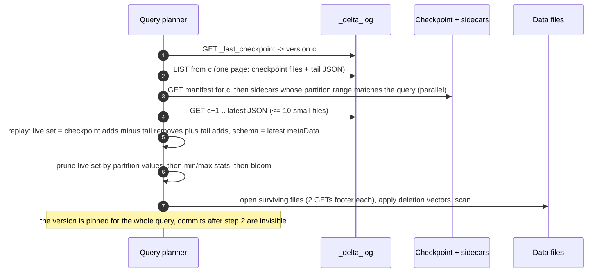
```mermaid
%% D4 (FR2 final): snapshot construction. A handful of metadata requests, never a LIST of the data directory.
sequenceDiagram
    autonumber
    participant Q as Query planner
    participant L as _delta_log
    participant CK as Checkpoint + sidecars
    participant DATA as Data files
    Q->>L: GET _last_checkpoint -> version c
    Q->>L: LIST from c (one page: checkpoint files + tail JSON)
    Q->>CK: GET manifest for c, then sidecars whose partition range matches the query (parallel)
    Q->>L: GET c+1 .. latest JSON (<= 10 small files)
    Q->>Q: replay: live set = checkpoint adds minus tail removes plus tail adds, schema = latest metaData
    Q->>Q: prune live set by partition values, then min/max stats, then bloom
    Q->>DATA: open surviving files (2 GETs footer each), apply deletion vectors, scan
    Note over Q: the version is pinned for the whole query, commits after step 2 are invisible
```

### Flow 3: a MERGE loses the race and retries (conflict detection)

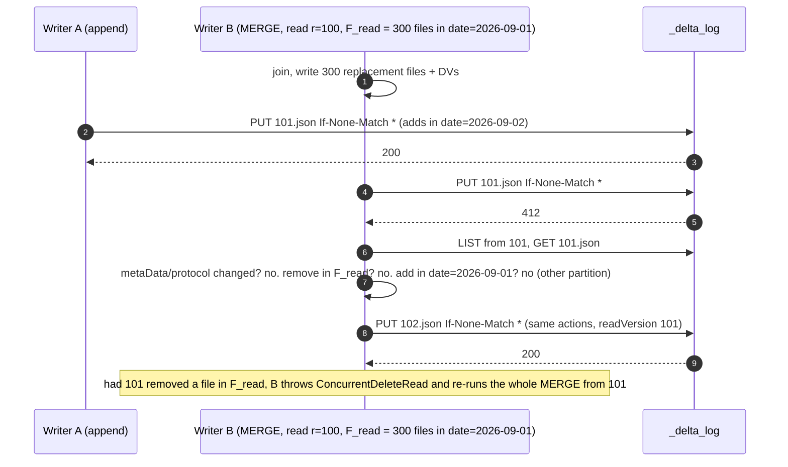
```mermaid
%% D5 (failure, FR3 final): two writers, one loses. What the loser does depends on what it read.
sequenceDiagram
    autonumber
    participant A as Writer A (append)
    participant B as Writer B (MERGE, read r=100, F_read = 300 files in date=2026-09-01)
    participant L as _delta_log
    B->>B: join, write 300 replacement files + DVs
    A->>L: PUT 101.json If-None-Match * (adds in date=2026-09-02)
    L-->>A: 200
    B->>L: PUT 101.json If-None-Match *
    L-->>B: 412
    B->>L: LIST from 101, GET 101.json
    B->>B: metaData/protocol changed? no. remove in F_read? no. add in date=2026-09-01? no (other partition)
    B->>L: PUT 102.json If-None-Match * (same actions, readVersion 101)
    L-->>B: 200
    Note over B: had 101 removed a file in F_read, B throws ConcurrentDeleteRead and re-runs the whole MERGE from 101
```

### Flow 4: writer crashes after writing files, before the commit (failure)

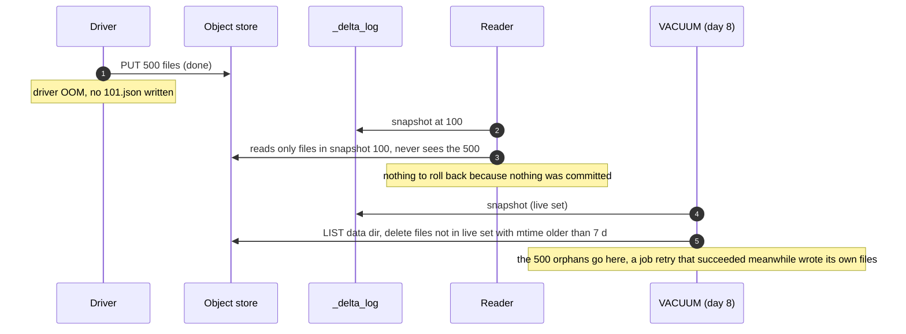
```mermaid
%% D5 (failure): the crash case that makes the design honest. Orphans are invisible and cleaned later.
sequenceDiagram
    autonumber
    participant D as Driver
    participant OS as Object store
    participant L as _delta_log
    participant R as Reader
    participant V as VACUUM (day 8)
    D->>OS: PUT 500 files (done)
    Note over D: driver OOM, no 101.json written
    R->>L: snapshot at 100
    R->>OS: reads only files in snapshot 100, never sees the 500
    Note over R: nothing to roll back because nothing was committed
    V->>L: snapshot (live set)
    V->>OS: LIST data dir, delete files not in live set with mtime older than 7 d
    Note over V: the 500 orphans go here, a job retry that succeeded meanwhile wrote its own files
```

### Flow 5: OPTIMIZE while a stream appends (maintenance, no conflict)

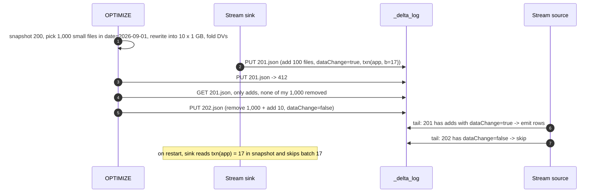
```mermaid
%% D4 (FR5 final): compaction commits dataChange=false. The stream ignores it, the appender cannot conflict with it.
sequenceDiagram
    autonumber
    participant O as OPTIMIZE
    participant S as Stream sink
    participant L as _delta_log
    participant SR as Stream source
    O->>O: snapshot 200, pick 1,000 small files in date=2026-09-01, rewrite into 10 x 1 GB, fold DVs
    S->>L: PUT 201.json (add 100 files, dataChange=true, txn(app, b=17))
    O->>L: PUT 201.json -> 412
    O->>L: GET 201.json, only adds, none of my 1,000 removed
    O->>L: PUT 202.json (remove 1,000 + add 10, dataChange=false)
    SR->>L: tail: 201 has adds with dataChange=true -> emit rows
    SR->>L: tail: 202 has dataChange=false -> skip
    Note over S: on restart, sink reads txn(app) = 17 in snapshot and skips batch 17
```

### Flow 6: time travel and VACUUM at the same time (consistency)

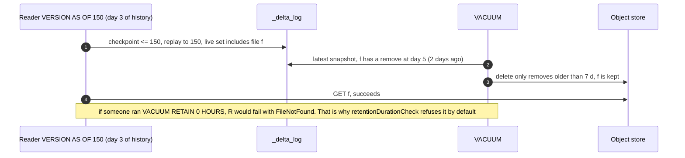
```mermaid
%% D5 (consistency): a long reader on an old version and a VACUUM. Retention makes them safe without talking to each other.
sequenceDiagram
    autonumber
    participant R as Reader VERSION AS OF 150 (day 3 of history)
    participant L as _delta_log
    participant V as VACUUM
    participant OS as Object store
    R->>L: checkpoint <= 150, replay to 150, live set includes file f
    V->>L: latest snapshot, f has a remove at day 5 (2 days ago)
    V->>OS: delete only removes older than 7 d, f is kept
    R->>OS: GET f, succeeds
    Note over R,V: if someone ran VACUUM RETAIN 0 HOURS, R would fail with FileNotFound. That is why retentionDurationCheck refuses it by default
```

---

## 7. Trade-offs

| Decision | Option A | Option B | Chose | Why |
|---|---|---|---|---|
| Source of truth | Directory listing of data files (Hive) | A log of commits in the same object store | B | LIST is eventually consistent on some stores, 1,000 keys per page, minutes at millions of files, and a multi-file write is never atomic. The log makes one PUT the commit point |
| Where the log lives | A database (metastore, FoundationDB as Snowflake does) | The object store, next to the data | Object store, catalog optional | No service on the read path, any engine with S3 access can read. Cost: commit latency ~100 ms and a few commits/s per table. Snowflake's choice gives ms commits and cross-table transactions at the price of a proprietary metadata tier |
| Concurrency control | Locks or a lease on the table | Optimistic, conflict check at commit | OCC | Analytics writes are long and rare; a lease would block readers or need a lock service. OCC costs re-runs under contention, which partitioning and blind appends make rare |
| Isolation for writes | Serializable | WriteSerializable (writes ordered, reads snapshot) | WriteSerializable default | Serializable makes every append conflict with every concurrent MERGE on its partitions. WriteSerializable keeps blind appends conflict-free. The visible cost: a reader can see a state that "never existed" in history order |
| Conflict granularity | File | Row (deletion vectors + row tracking) | Row when DVs are on | File-level causes false conflicts on hot unpartitioned tables. Row-level costs row ids per file and a more expensive check |
| Updates | Copy-on-write (rewrite the file) | Merge-on-read (deletion vector + new rows) | MoR for writes, folded by OPTIMIZE | CoW amplifies a 1-row update to 1 GB. MoR moves the cost to reads until compaction folds it. Both, with a scheduled fold, is the answer |
| Checkpoint layout | One Parquet with everything | Manifest + sidecars, rewrite only what changed | Sidecars (V2) | The single file is O(files) to write every 10 commits and O(files) to read per query. Sidecars make both O(changed slice) |
| Compaction | Never (readers pay) | Always (writers pay twice) | Optimized writes + auto compaction + scheduled OPTIMIZE | One extra write per byte buys every reader a 10 to 100x smaller file count. Reads outnumber writes |
| Retention | Short (cheap storage, no time travel) | Long (30+ days, storage for every rewritten byte) | 30 d log, 7 d files by default, per-table override | Time travel and VACUUM safety are the same knob. GDPR tables get 1 d, audit tables get 90 d |
| What we refused to build | Cross-table transactions, secondary indexes, a metadata service on the read path, sub-second streaming | | | Each is a real system (Snowflake, Hudi's record index, Kafka). None is needed for "ACID table on an object store" |

Consistency model, stated once: **writes are serializable** per table (the log is a total order, one version per commit). **Reads are snapshot isolation** at a pinned version. **Read-your-writes** for the committing job (it knows its version). Metadata (`_last_checkpoint`) is **eventual** and only affects performance. Nothing is shared across tables.

---

## 8. Staff-level notes

- **Simplest thing that meets the requirement.** One ordered log per table and one conditional PUT. No lock service, no metadata database, no daemon. Readers need only object store credentials. We refused a coordinator on the default path and added it only as the option for tables that need 10x the commit rate or cross-table atomicity.
- **Failure modes and blast radius.** Writer dies before the commit: nothing happens, orphans are vacuumed. Writer dies after the JSON PUT but before the checkpoint: the next reader pays a longer replay, the next writer writes the checkpoint. Corrupt or missing `N.json` with `N+1.json` present: the table is unreadable past `N−1` until the entry is restored (S3 versioning on `_delta_log/` is the backup, and this is why nothing but the arbiter may write there). Bad `VACUUM` (retention 0): every reader on an older snapshot fails, which is the largest blast radius in the system and is guarded by a config check. Object store outage: everything stops, nothing corrupts, retries resume.
- **Migration.** From a Hive-style Parquet directory: `CONVERT TO DELTA` writes version 0 with an `add` for every existing file in place, no data copy, minutes for millions of files (one LIST, one commit). Readers switch by table name in the catalog, rollback is "point the name back" because the Parquet files are untouched. Writers move one pipeline at a time; a table must not have both Hive writers and Delta writers because Hive writers bypass the log. Phase it: readers first, then the ingest writer, then the MERGE jobs, then enable DVs and V2 checkpoints once every reader is on a runtime that supports them (protocol version gates this by refusing old readers).
- **Operability.** SLO: commit p99 < 2 s, snapshot construction p99 < 1 s for tables under 1 M files, conflict retry rate < 5% of commits. Pages at 3am: a table whose commit failure rate exceeds 20% for 10 min (a metadata-change loop or a stuck writer holding a version), checkpoint age > 100 commits (checkpoint writer failing, replay cost climbing), file count growth > 10x day over day (compaction stopped), VACUUM deleting more than expected (retention misconfigured). Dashboards: commits/s and 412s per table, files per partition and average file size, checkpoint size and write time, DV cardinality per file, oldest referenced version.
- **Cost.** Storage: the data once, plus 7 to 30 days of rewritten bytes (MoR and compaction make this 10 to 30% extra on an update-heavy table). Requests: at 1 commit/s, ~100k PUT/day for the log and ~10 M GET/day of metadata for 1,000 queries/day, both cents. Compute: compaction is the bill, ~1 to 2x the ingest bytes rewritten daily. Engineering: one team owns the format and the commit protocol (the contract), engines integrate through the protocol spec, the catalog team owns the optional arbiter. The protocol version in the log is the org boundary: a reader that does not understand a feature refuses the table rather than misreading it.
- **Explicit trade-off.** OCC on the object store gives you a few commits per second per table and no service to run. A coordinator gives you 100 per second and cross-table atomicity and a service to run. Say the number, say the exchange rate, and say that almost every table is fine at the first one.

---

## 9. What is expected at each level

**Mid (80/20 breadth/depth).** Draws Spark writing Parquet to S3 and a metastore that knows the schema. Says "we need transactions" and proposes a lock or a database in front. Knows Parquet is columnar and has stats. Passes if the requirements are stated and the diagram is clean, even if the atomicity story is "write to a temp dir and rename".

**Senior (60/40).** Knows rename is not atomic on S3 and puts a transaction log in the table directory. Explains commit as "write a new log entry", snapshots as "replay", and time travel as "replay to N". Proposes OCC and can name a conflict rule. Knows small files are a problem and proposes compaction. Goes deep on one of: checkpointing, conflict detection, MoR vs CoW.

**Staff+ (40/60).** Everything above, plus: names put-if-absent as the single primitive and knows S3 lacked it (and what the workaround was); does the checkpoint-size math and explains sidecars; separates WriteSerializable from Serializable and knows why blind appends never conflict; explains why OPTIMIZE is `dataChange=false` and why that is what lets streams and compaction coexist; couples retention, time travel, VACUUM safety, and GDPR into one knob with a number; states the commit-rate ceiling and what a coordinator buys; gives the Hive migration with rollback; names what is not built (cross-table transactions, indexes) and why Snowflake made the other choice.

---

## 10. Nitty-gritty (past interview scope)

### 10.1 Internals of each chosen technology

**The commit file.** `_delta_log/00000000000000000101.json` is newline-delimited JSON, one action per line. Order within a file does not matter, so a version may contain at most one `add` and one `remove` per `(path, dvId)` and the two reconcile: the latest version's action for a path wins. `add` carries `path`, `partitionValues`, `size`, `modificationTime`, `dataChange`, `stats` (JSON string: `numRecords`, `minValues`, `maxValues`, `nullCount` for the first 32 columns), optional `deletionVector`, `baseRowId`. `remove` carries `path`, `deletionTimestamp`, `dataChange`, and optionally the same DV so the tombstone identifies the logical file exactly. `metaData` carries the schema as a JSON string plus partition columns and table properties. `protocol` carries `minReaderVersion`, `minWriterVersion`, and with versions 3/7 a list of table features; a client that lacks a required feature must refuse the table. `commitInfo` is informational but carries `readVersion` and `isolationLevel`, which the conflict checker of a *later* writer uses when it reads this commit. Optional `{version}.crc` files hold a checksum and a summary (file count, bytes) of the snapshot.

**The checkpoint.** Classic: `N.checkpoint.parquet`, one row per action with a column per action type (`add`, `remove`, `metaData`, `protocol`, `txn`), most of them null per row. `add.stats_parsed` and `partitionValues_parsed` as structs let the planner push predicates into the checkpoint scan. V2: `N.checkpoint.<uuid>.{json,parquet}` holds `protocol`, `metaData`, `txn`, and `sidecar` actions; each sidecar under `_delta_log/_sidecars/<uuid>.parquet` holds only `add` and `remove`. `_last_checkpoint` is a small JSON `{version, size, parts, checkpointSchema, tags}` and is the only object in the log that is overwritten, which is safe because it is a hint.

**Deletion vectors.** A 64-bit roaring bitmap of row indexes within one Parquet file. Stored inline in the `add` (`storageType = "u"`, base85 encoded) when tiny, or in a `.bin` file at the table root shared by many DVs (`storageType = "p"`, with `offset` and `sizeInBytes`). The reader loads the bitmap and filters rows by position during the scan; Databricks' Photon does it with predictive I/O. A DV is immutable: a second delete on the same file writes a new DV (union) and a new `add` with the new `dvId`. `cardinality` in the descriptor lets the planner keep `numRecords` accurate.

**Parquet, the parts that matter here.** Footer at the end: schema, row groups, per-column-chunk min/max/null count. Reading a file starts with 2 GETs (last 8 bytes for the footer length and magic, then the footer). Row groups of 128 MB by default in `parquet-mr`, pages of ~1 MB; the optional column index and offset index give page-level min/max for finer skipping; optional Bloom filters per column chunk. Column ids in the Parquet schema are what column mapping uses so a logical rename never touches the file. [`../../concepts/columnar-db.md`](../../concepts/columnar-db.md).

**Object store primitives used.** PUT (whole object, or multipart for files > 100 MB, 5 MiB min part), conditional PUT (`If-None-Match: *` on S3, `x-goog-if-generation-match: 0` on GCS, `If-None-Match: *` on Azure Blob, atomic rename on ADLS Gen2 with hierarchical namespace), GET with byte range (footers, sidecars), LIST with prefix and start-after (1,000 keys per page, lexicographic), DELETE. S3 has been strongly consistent for read-after-write and LIST since Dec 2020; before that a fresh `N.json` could be missing from a LIST, which is why the paper's read protocol tolerates a stale LIST (it only affects which version you see, never correctness).

### 10.2 Configuration knobs that matter

| Knob | Value we pick | Why |
|---|---|---|
| `delta.checkpointInterval` | 10 (OSS default) | Replay ≤ 10 JSON files. Lower it on tables with huge commits, raise it with V2 checkpoints |
| `delta.checkpointPolicy` | `v2` | Sidecars. Requires readers that support the feature |
| `delta.logRetentionDuration` | `interval 30 days` | Time travel window. 90 days for audit tables |
| `delta.deletedFileRetentionDuration` | `interval 1 week` | VACUUM safety window and the real time travel window. 1 day for GDPR-heavy tables |
| `delta.isolationLevel` | `WriteSerializable` (Databricks default, OSS only supports `Serializable`) | Blind appends never conflict |
| `delta.enableDeletionVectors` | `true` | MoR for UPDATE/DELETE/MERGE, row-level concurrency, OPTIMIZE no longer conflicts with updates |
| `delta.dataSkippingNumIndexedCols` / `dataSkippingStatsColumns` | 32, or an explicit list of filter columns | Stats cost checkpoint bytes and can leak PII. Index the columns you filter on, not the first 32 by accident |
| `delta.targetFileSize` | unset (1 GB OPTIMIZE target, auto-tuned) or 256 MB on MERGE-heavy tables | Smaller files make CoW rewrites cheaper, larger files make scans cheaper |
| `delta.autoOptimize.optimizeWrite` / `autoCompact` | `true` / `auto` on streaming tables | Files land at ~128 MB, partitions with > 50 small files are compacted right after the commit |
| `delta.columnMapping.mode` | `name` | Rename and drop columns without rewriting files |
| `spark.databricks.delta.retentionDurationCheck.enabled` | `true` (never disable in production) | Refuses `VACUUM RETAIN < 7 days` |
| Commit retries | `maxCommitAttempts` high (default 10,000,000) with backoff | A losing writer should wait, not fail, unless a true conflict is found |

### 10.3 Capacity math per component

| Component | Unit | Number | Closest to its limit? |
|---|---|---|---|
| Log tail | JSON GETs per snapshot | ≤ 10 × ~200 KB | No |
| Classic checkpoint | bytes | 0.75 KB × files: 0.75 GB at 1 M, 7.5 GB at 10 M | **Yes at 10 M files.** Fix: compaction + V2 sidecars |
| Checkpoint write | per 10 commits | rewrite all of it (classic) vs changed sidecars (V2) | Yes for classic at 1 commit/s |
| Commit path | attempts/s per table | 3 to 5 sustained under contention (OCC), ~100 with a coordinator | Yes for multi-writer hot tables |
| Data directory | objects | 1 M at 1 GB, 10 M at 100 MB. VACUUM LIST at 1,000 keys/page: 1,000 to 10,000 pages | VACUUM is the only LIST consumer, run it daily off-peak |
| Query planning | footer GETs | 2 per surviving file. 1,000 files → 2,000 GETs, ~20 s serial, < 1 s across 100 tasks | No, after pruning |
| Compaction | bytes/day | 1 to 2x ingest. 8.6 TB/day ingest → 9 to 17 TB/day rewritten | The compute bill |
| Deletion vectors | bytes per file | Roaring bitmap, ~2 bytes per deleted row worst case, KBs typical | No, but fold when > 10% of a file is deleted |
| Log directory | objects | 86,400/day at 1 commit/s, 2.6 M at 30 days, one LIST page per snapshot thanks to `_last_checkpoint` | No |

### 10.4 Failure timeline

**Failure 1: two writers, one arbiter, the DynamoDB variant loses a writer mid-commit.**

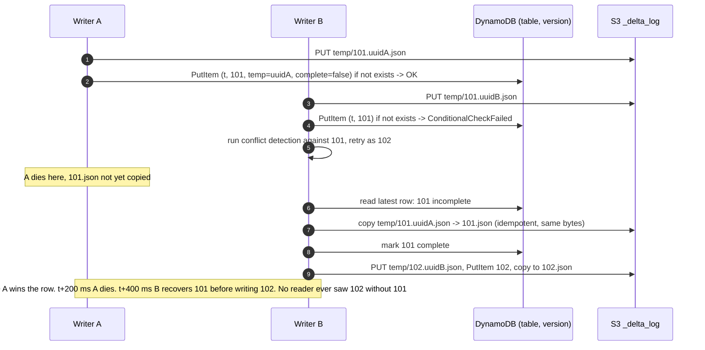
```mermaid
%% D5: S3 with the DynamoDB log store. The row is the lock, the temp file is the recovery record.
sequenceDiagram
    autonumber
    participant A as Writer A
    participant B as Writer B
    participant DDB as DynamoDB (table, version)
    participant S3 as S3 _delta_log
    A->>S3: PUT temp/101.uuidA.json
    A->>DDB: PutItem (t, 101, temp=uuidA, complete=false) if not exists -> OK
    B->>S3: PUT temp/101.uuidB.json
    B->>DDB: PutItem (t, 101) if not exists -> ConditionalCheckFailed
    B->>B: run conflict detection against 101, retry as 102
    Note over A: A dies here, 101.json not yet copied
    B->>DDB: read latest row: 101 incomplete
    B->>S3: copy temp/101.uuidA.json -> 101.json (idempotent, same bytes)
    B->>DDB: mark 101 complete
    B->>S3: PUT temp/102.uuidB.json, PutItem 102, copy to 102.json
    Note over A,B: t=0 A wins the row. t+200 ms A dies. t+400 ms B recovers 101 before writing 102. No reader ever saw 102 without 101
```

**Failure 2: corrupt or missing log entry.** `100.json` returns 404 but `101.json` exists (someone deleted it by hand, or a broken cleanup). Every reader that needs a version ≥ 100 fails to build a snapshot: detection is immediate (first query after the deletion), user sees "version 100 missing". On-call restores it from S3 versioning on the `_delta_log/` prefix (mandatory on production buckets) or, if truly lost, restores the table to version 99 with `RESTORE` semantics and re-runs the writers for 100 and 101 from their idempotent inputs. Data at risk: the actions in 100 (which files became live), not the files themselves. Guard: only the arbiter path may write to `_delta_log/`, bucket policy denies everyone else `DeleteObject` there.

**Failure 3: checkpoint writer keeps failing.** Commits succeed but no checkpoint for 500 versions. Symptom: snapshot construction climbs from 250 ms to 5 s (500 JSON GETs), `checkpoint age` metric alerts at 100. Cause is usually a writer without permission to write the checkpoint or a schema the checkpoint writer cannot serialise. Any writer can write the checkpoint, so the fix is to run one `OPTIMIZE`-style no-op commit from a healthy client. No correctness impact at any point.

### 10.5 Exactly-once and idempotency end to end

| Hop | Duplicate can enter when | Removed by | Key | Lifetime |
|---|---|---|---|---|
| Executor writes a file | task retry writes the same partition twice | The driver only records files from the successful attempt; the other is an orphan | file path (uuid) | Until VACUUM |
| Driver commits | driver retries the PUT after a timeout whose response was lost | `If-None-Match` returns 412; driver reads `N.json` and compares its own `commitInfo.txnId` to decide "that is mine" | `commitInfo.txnId` (uuid per attempt) | The version's lifetime |
| Streaming sink | micro-batch re-executed after a crash | `txn(appId, version)` in the snapshot ≥ batch id → skip | `(appId, batchId)` | Until `setTransactionRetentionDuration` expires it |
| `foreachBatch` user code | user writes to a Delta table in each batch | Same `txn` mechanism exposed as `txnAppId` / `txnVersion` write options | same | same |
| Streaming source | source restarts and re-reads a version | Source checkpoint stores `(version, index)` of the last emitted `add`; replay from there is deterministic because the log is immutable | `(version, fileIndex)` | The stream's own checkpoint |
| Compaction | OPTIMIZE re-run on the same files | Second run finds the files already removed → `ConcurrentDeleteDelete`, aborts cleanly | file path | n/a |
| GDPR delete re-run | DELETE runs twice | Second run's predicate matches nothing, commits nothing (or an empty commit) | n/a | n/a |

### 10.6 Consistency model per edge

| Edge in the final diagram | Model | Notes |
|---|---|---|
| Writer → data files | n/a, invisible until commit | Unique names, never overwritten |
| Writer → arbiter → log | **Strong, linearizable per table** | One winner per version. Conditional PUT, DynamoDB conditional write, or catalog CAS |
| Reader → log (LIST + GET) | **Strong** on S3 since Dec 2020, ADLS, GCS | A stale `_last_checkpoint` is tolerated, a stale LIST would only hide the newest version |
| Reader → checkpoint / sidecars | **Immutable** once written (content-addressed by version and uuid) | A partially written multi-part checkpoint is ignored |
| Reader → data files, DVs | **Immutable** | Snapshot isolation follows from immutability plus a pinned live set |
| Catalog → reader (unpublished tail) | **Strong** if the catalog is the arbiter | Otherwise the catalog is a name-to-path map only |
| Maintenance → log | Same as writer | `dataChange=false` changes semantics for streams, not consistency |
| Across tables | **None** | Two tables are two logs. A join across them may see versions committed at different times |

### 10.7 Alternatives rejected

| Alternative | Why it looked attractive | Why rejected |
|---|---|---|
| Hive-style directory listing + `_SUCCESS` marker | Zero new components | Multi-file writes not atomic, LIST eventually consistent (historically) and slow at scale, no time travel, no concurrent writers, a crashed job leaves partial data visible |
| Metastore holds the file list (Hive metastore with partitions) | Central, transactional | Paper: the metastore becomes the bottleneck at millions of objects; every engine must speak Thrift; still no atomic multi-partition write |
| Database as the log (Snowflake, FoundationDB) | ms commits, cross-table transactions, no OCC retries | Proprietary tier on every read path, every engine must integrate, you run a distributed database to serve a table format. Right choice for a warehouse product, wrong for an open format. We keep it as the optional arbiter |
| Locks / leases on the table | Simple mental model | Blocks readers or needs a lock service with fencing; analytics jobs are minutes long, so a lease is held for minutes; OCC has no such cost for readers |
| Copy-on-write only | Clean files, no DV read cost | 1 GB rewrite per 1-row update, MERGE-heavy tables spend most of their I/O rewriting |
| Merge-on-read forever (no fold) | Cheapest writes | Reads degrade without bound; a 90%-deleted file is still scanned in full |
| Kafka as the commit log | Ordered, fast, multi-writer | Another system to run; the table would depend on Kafka retention for its history; readers need Kafka access. The object store already gives durable ordered storage via naming |
| Iceberg's manifest tree from day one | Scales metadata by design | Delta's flat log was simpler for readers and fine to ~1 M files; V2 checkpoints add the tree where it pays. Both converge |
| Hudi-style primary key + record index | O(1) upsert routing | Forces a key on every table, index maintenance on every write. Delta uses stats + join; a record index is an add-on for tables that need it |

### 10.8 How the big companies do it

- **Databricks (Delta Lake, VLDB 2020).** The design above. Reported "exabytes per day" processed on Delta, tables with hundreds of millions of objects, an internal commit service for S3 before conditional writes, checkpoint every 10 commits, Z-order with min/max stats. Delta 3.x added deletion vectors, V2 checkpoints, liquid clustering, UniForm (writes Iceberg metadata beside Delta's so Iceberg readers can read the same files); Delta 4.0's `catalogManaged` moves the arbiter to the catalog (Unity Catalog).
- **Netflix (Apache Iceberg, 2017).** Same problems (S3 listing cost, non-atomic Hive rename), different shape: a `metadata.json` root pointer swapped atomically in a catalog, snapshots → manifest list → manifests → data files, per-manifest partition ranges for pruning. Iceberg needs the catalog for the swap on every store; Delta needed it only on S3 pre-2024. Row-level deletes as position or equality delete files (Iceberg v2), deletion vectors in v3.
- **Uber (Apache Hudi).** Built for CDC upserts into the lake: every table has a record key, a timeline of instants, and Copy-on-Write or Merge-on-Read table types, plus a record-level index for O(1) routing of an upsert to its file group.
- **Snowflake (SIGMOD 2016).** Data in immutable micro-partitions of 50 to 500 MB uncompressed, *all* metadata (which micro-partitions are live at each version, per-column stats) in FoundationDB. A commit is a metadata transaction in FDB, not an object-store write, so cross-table transactions and ms commits come for free; time travel is 1 day by default and up to 90 days on Enterprise. The price is the closed metadata tier.

### 10.9 Operational runbook

**Dashboards (per table, top 50 tables by commits):** commits/s and 412 rate; snapshot construction p50/p99; checkpoint age (commits since last) and size; file count, average file size, files under 32 MB per partition; DV cardinality as % of rows; oldest snapshot version still referenced by a running query.

**Alerts:** commit failure rate > 20% for 10 min (page); checkpoint age > 100 (page, replay cost); average file size < 32 MB for a day (ticket, compaction broken); VACUUM deleted > 3x the 7-day average (page, retention misconfiguration); any object write to `_delta_log/` from a principal outside the writer role (page, security).

**Rollout of a format change (e.g. enabling DVs or V2 checkpoints):** it is a `protocol` bump, so old readers refuse the table rather than misread it. Canary: upgrade all readers first (they can read both), then enable the feature on 1% of tables, watch snapshot latency and read errors for a day, then the rest. Rollback: `ALTER TABLE ... DROP FEATURE` exists for some features and rewrites what is needed (DVs must be folded first, which is an OPTIMIZE); for others the rollback is `RESTORE` to the version before the upgrade, which is why the upgrade commit should be its own version.

**Rollback of bad data:** `RESTORE TABLE t TO VERSION AS OF n` writes a new commit whose actions bring the live set back to `n`'s (adds and removes, no data copy). Any downstream stream must be restarted from that version.

### 10.10 Security and abuse

- Auth boundary is the object store: IAM on the bucket prefix. Readers get `GET`/`LIST` on the table prefix. Writers get `PUT` on data and `_delta_log/` but not `DELETE` on `_delta_log/` (only the VACUUM/cleanup role has it). Nobody gets overwrite on `_delta_log/` (conditional writes enforced by bucket policy on S3).
- A malicious writer with PUT can commit garbage actions (point `add` at a file that does not exist, or at another table's file it can read). The log is not signed; the catalog's ratification step is the place to validate commits (schema, protocol, path prefix) if that threat matters. Say: "the log trusts writers, the catalog can be made not to".
- Stats leak values: `minValues`/`maxValues` for a `salary` column are readable by anyone who can read the log even if row-level filters are enforced elsewhere. Exclude sensitive columns from `dataSkippingStatsColumns`, or accept that log readers are data readers.
- Time travel leaks deleted data for the retention window; GDPR tables get short retention or crypto-shred.
- Rate abuse: a client spamming commits raises the 412 rate for everyone on the table. Per-principal commit quotas belong in the catalog, or in the arbiter if it is a service.

### 10.11 Evolution

- **10x files (100 M).** Classic checkpoints are dead at this size (75 GB). V2 sidecars partitioned by partition range plus a compaction floor of 1 GB, and snapshot caching per cluster. Beyond that, the catalog serves the file list for a partition range (the Snowflake direction).
- **10x commit rate (10/s per table).** Coordinator as the arbiter (§5.3), inline commits stored in the catalog's database, published to `_delta_log/` asynchronously. Readers ask the catalog for the tail.
- **Multi-region.** Replicate the table by replaying the log: the log is a sequence of immutable objects, so "copy new `N.json` and the files it adds" is a deterministic, restartable pipeline (`DEEP CLONE` incremental). Cross-region writes to one table are not supported; pick one home region per table.
- **New requirement: cross-table transaction.** Only the catalog-managed variant can do it: the catalog CAS covers multiple `(table, version)` rows in one database transaction, and publishes them together. Say that this is exactly the seam Delta 4.0 opened.
- **New requirement: point lookups by key.** Add a secondary structure (a Bloom filter index per file exists, a record-level index like Hudi's is the next step) as more `add`-referenced files. The log does not change.
- **New engine.** The protocol is the contract; a Rust kernel (delta-kernel-rs) exists so engines implement the read path once. The log format version gates what a new reader must support.

---

## 11. Follow-up questions to expect

Ranked by how often an interviewer asks them. Each links to the file with the 60-second answer.

1. **Two writers commit at once, who wins and how?** Conditional PUT (or DynamoDB row, or catalog CAS); loser reads the new versions and runs conflict detection. [`edge-cases.md`](edge-cases.md#edge-case-two-writers-race-for-the-same-version), [`deep-dives/optimistic-concurrency-and-conflict-detection.md`](deep-dives/optimistic-concurrency-and-conflict-detection.md).
2. **Writer crashes after writing files, before committing.** Orphans, invisible, vacuumed after 7 days. Flow 4.
3. **10 M files, how does a reader find the current ones fast?** Checkpoint + tail, never LIST the data. Then the size math and V2 sidecars. §5.2, [`deep-dives/snapshots-checkpoints-and-time-travel.md`](deep-dives/snapshots-checkpoints-and-time-travel.md).
4. **S3 had no put-if-absent, what did you do?** DynamoDB log store / commit service; conditional writes since Aug 2024; catalog-managed commits. §5.1, [`deep-dives/transaction-log-and-commit-protocol.md`](deep-dives/transaction-log-and-commit-protocol.md).
5. **Small files from a streaming writer.** Optimized writes, auto compaction, OPTIMIZE with `dataChange=false`. §5.4, [`deep-dives/compaction-and-data-layout.md`](deep-dives/compaction-and-data-layout.md).
6. **Delete one user for GDPR.** DV in seconds, physical after fold + VACUUM, time travel gone too. §5.5, [`deep-dives/row-level-changes-cow-vs-mor.md`](deep-dives/row-level-changes-cow-vs-mor.md).
7. **Why doesn't OPTIMIZE conflict with appends? When does it conflict?** No read set on the append side, `dataChange=false`; conflicts with another rewrite of the same files, and with UPDATE/DELETE without DVs. §4.5, §5.3.
8. **Time travel while VACUUM runs.** Retention window; `RETAIN 0` refused. Flow 6.
9. **Serializable vs WriteSerializable, give the example.** Delete and insert racing; WS lets the delete commit as if it ran first. §4.3.
10. **What is the commit rate ceiling and how do you raise it?** A few/s from object-store latency; coordinator to ~100/s; or batch upstream. §5.3.
11. **Schema change under a running stream.** Stream stops on `metaData` change, restart; column mapping for rename/drop. [`deep-dives/streaming-and-idempotent-writes.md`](deep-dives/streaming-and-idempotent-writes.md).
12. **Exactly-once for a streaming sink.** `txn(appId, batch)` in the same commit as the data. §4.5, §10.5.
13. **Cross-table transaction.** Not in the object-store design; the catalog-managed variant can. §10.11.
14. **Corrupt log entry.** Table unreadable past it; S3 versioning on `_delta_log/`, restore. §10.4.
15. **How is this different from Iceberg / Hudi / Snowflake?** Arbiter location, metadata tree shape, keys. §10.8.
