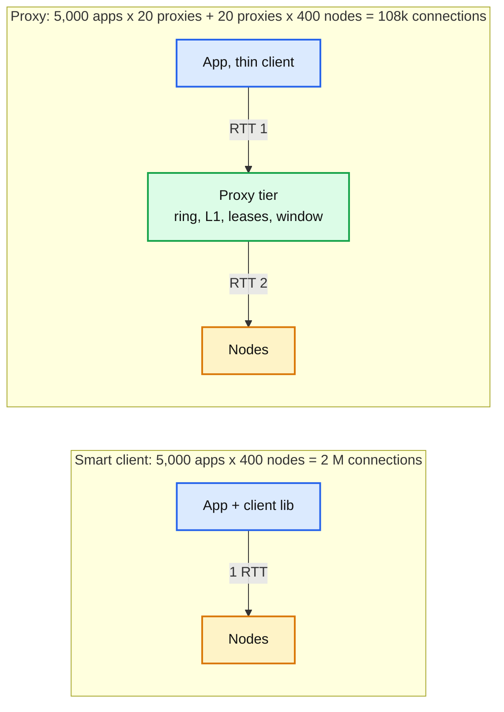

# Deep dive: client and network path

> One-line answer: at 5,000 app servers a smart client library (ring, L1, leases, window, fill cap) beats a proxy tier by one hop of latency and one tier of ops; keep the wire protocol proxy-compatible so the switch to mcrouter-style proxies at 50,000 servers or 6 languages is a config change; on the wire, one pipelined connection per node per app server, a TCP-style sliding window against `mget` incast, a separate pool for values over 64 KB so a 1 MB reply never blocks a 1 KB one, and a 20 ms timeout treated as a miss.

Reusable block: [`../../../concepts/fan-out-fan-in.md`](../../../concepts/fan-out-fan-in.md) (`mget` fan-out, hedging), [`../../../concepts/realtime-client-server-communication.md`](../../../concepts/realtime-client-server-communication.md) (connection lifecycle).

---

## 1. Where one `get` spends its microseconds

| Step | Time | Note |
|---|---|---|
| App call, key hash, ring lookup, sketch add | 0.3 us | All local |
| Serialize request, `write()` syscall | 5 us | Pipelined: many requests per syscall when busy |
| Wire, in-DC RTT | 100 to 200 us | Same AZ 100 us, cross-AZ 300 us |
| Node: parse, shard dispatch, hash lookup, expiry check, memcpy 1 KB | 2 us | No locks, no malloc |
| `read()` syscall, deserialize | 5 us | |
| **Total p50** | **about 200 us** | Matches the NFR |

What adds to p99: queueing behind a large value on the same connection, a `mget` incast retransmit (200 ms minimum RTO), an accept-queue overflow during a connection storm, a GC pause in the app (not the cache's fault, but the timeout must be longer than it), and cross-AZ hops. None of them is the node's CPU.

---

## 2. Smart client vs proxy

| | Smart client | Proxy (mcrouter, twemproxy, Envoy redis filter, memcached's built-in proxy) |
|---|---|---|
| Latency | 1 RTT | 2 RTT (+100 to 200 us, half the p50 budget) |
| Connections | `apps × nodes` | `apps × proxies + proxies × nodes` |
| Routing logic | in every app process, every language | in one place, one language |
| Ring change | every client polls | proxies poll; apps do nothing |
| Failure domain | none added | a proxy dies: its apps re-connect to another (1 s) |
| Ops | library versioning across app teams | one more tier to deploy, scale, page on |
| Break-even | under about 20k app servers and 1 to 2 languages | above that, or when the cache team cannot ship a library to every app |

We pick the client and keep the protocol identical to what a proxy would speak, so the cache team can insert proxies later without touching apps (Facebook ran mcrouter both as a sidecar and as a tier). The client library also does things a proxy could not do as well: the L1 (must be in-process), single-flight (must be in-process), and read-your-writes via L1.

---

## 3. Connections and pipelining

- **One connection per node per app server**, long-lived, opened at startup with a jittered ramp (400 connections over 10 s so a fleet deploy does not open 2 M connections in a second). A second connection is opened only if the first's window is saturated for 1 s.
- **Shard dispatch server-side.** The node reads the key's hash and hands the request to the owning shard thread through a per-shard SPSC queue (one word), so the client does not need a connection per shard. Cost 100 ns; saves 8x connections.
- **Pipelining.** Requests carry a sequence number; the client sends without waiting; responses come back in order per connection. Batches of 10 to 100 requests per `write()` when busy. This is where the 1 M ops/s per node comes from: syscalls per request drop to a fraction.
- **Sliding window per connection.** Outstanding requests capped at `W`, starting at 16, growing by 1 per success up to 256, halving on a timeout. Facebook's finding: too small a window and requests queue in the client; too large and `mget` fan-out causes incast. The window is the knob and it is adaptive.
- **Timeout 20 ms**, treated as a miss, never retried on the same node. Three in a row: suspect.

---

## 4. `mget` and incast

A 100-key `mget` touches about 80 nodes. Their 80 replies (80 KB) arrive within the same 200 us at one app server's NIC. With 1,000 concurrent `mget`s on that server that is 80 MB in a 200 us window, which is 3.2 Tbps instantaneous, and the ToR switch's per-port buffer (a few MB) overflows. Dropped packets are recovered by TCP after the minimum RTO of 200 ms, so the `mget`'s p99 goes from 2 ms to 200 ms.

Fixes in order of cheapness:
1. **The sliding window** above bounds outstanding requests per connection, which bounds the burst.
2. **Stagger fan-out**: send to the 80 nodes in 4 waves 50 us apart. Costs 150 us of latency, cuts the burst 4x.
3. **Group keys by node and pipeline** so the 100 keys are at most 80 requests, not 100.
4. **Hedge** only single-key reads, never `mget`s (hedging a fan-out doubles the incast).
5. **Do not use UDP** for this: incast drops without TCP's recovery become misses.

---

## 5. Large values and head-of-line blocking

- A 1 MB value at 25 Gbps takes 320 us on the wire plus 1 MB of memcpy at both ends; every 1 KB reply queued behind it on that connection waits. Ten of these per second per connection is 1% of requests over 1 ms.
- **Pool by size.** Values over 64 KB go to the `large` pool (own ring, own connections, own nodes). The client learns the pool from `flags` on a 16 B pointer item stored in the default pool (`get` returns the pointer, client fetches from `large`). Two RTTs for a large value, zero impact on small ones.
- **Reject over 1 MB** at the client. The app chunks (`key.0 .. key.n` plus a manifest with a version) or does not cache.
- **Compress over 4 KB** at the client (LZ4, 1 GB/s, typical 2 to 4x on JSON), flagged in `flags`. Halves wire time and memory for the tail of large values.
- memcached's own history: a hard 1 MB item limit (`-I`), 512 KB max slab chunk with chaining above it, and the recommendation to keep values small.

---

## 6. Protocol

Binary, length-prefixed, little-endian header of 24 B: `magic, opcode, key_len, extras_len, status, body_len, opaque (client sequence), cas`. Extras carry `ttl, flags, lease_token`. Text protocols (memcached ASCII, RESP) are easier to debug and 20 to 30% slower to parse; memcached's meta protocol is text but compact and carries the lease-like `won` / `stale` flags natively, which is why it is a fine choice too. What matters for the interview: pipelined, sequence-numbered, with a way to return a lease token and a stale flag in the miss reply.

---

## 7. Numbers to say out loud

- p50 about 200 us, dominated by the in-DC RTT (100 to 200 us). Cross-AZ +300 us.
- 2 M connections fleet-wide with the smart client at 5,000 × 400; 5,000 per node. Proxy break-even about 20k app servers.
- Window 16 to 256 outstanding per connection, TCP-style.
- Timeout 20 ms (20x p99); 3 strikes to suspect.
- `mget` 100 keys to about 80 nodes; incast recovery is a 200 ms RTO; stagger in 4 waves.
- Large pool above 64 KB; reject above 1 MB; compress above 4 KB; a 1 MB reply is 320 us of wire at 25 Gbps.
- Facebook: UDP gets dropped 0.25% at peak, treated as misses that skip the set; average multiget 24 keys.
