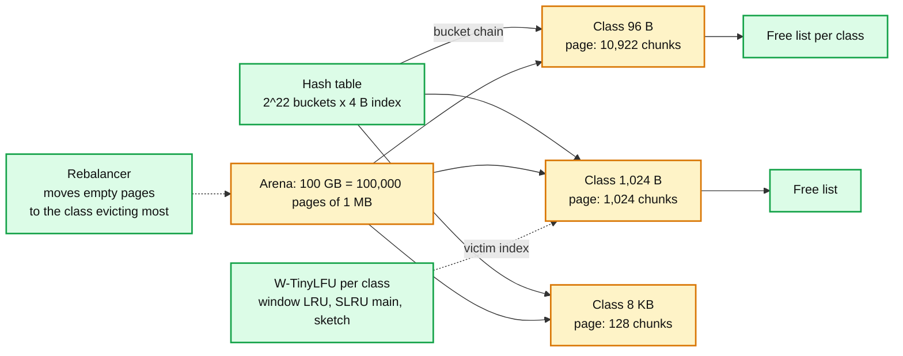
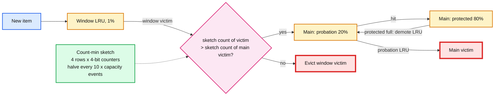

# Deep dive: eviction and memory layout

> One-line answer: carve memory into slab classes (1 MB pages, chunk sizes growing by 1.25) so there is no malloc and no fragmentation on the data path; keep a 34 B header with 4 B slab indexes instead of pointers so overhead stays under 100 B per key; evict with W-TinyLFU (1% LRU window, 99% SLRU main, count-min sketch admission) or S3-FIFO, which beat LRU by 5 to 15 points of hit rate on one-hit-wonder traces; expire lazily on read, reclaim with a crawler, and jitter TTLs.

Reusable block: [`../../../concepts/caching-patterns.md`](../../../concepts/caching-patterns.md) §6 (eviction and sizing), [`../../../concepts/stream-sketches.md`](../../../concepts/stream-sketches.md) (count-min).

---

## 1. Memory layout on one node

**Slab classes.** Sizes `96, 120, 152, 192, 240, 304, 384, 480, 600, 752, 944, 1184, ...` up to 512 KB (memcached's `slab_chunk_size_max = page / 2`); items larger than that are chained across 512 KB chunks. Growth factor 1.25 means an item wastes at most 20% of its chunk and about 8% on a real size distribution. Every class has its own free list and its own eviction structure, so eviction is "free a chunk of the size I need", never "free some bytes and hope".

**Calcification.** Pages are assigned to classes on first demand and never come back automatically. If day-1 traffic was 1 KB values and day-30 traffic is 2 KB, the 2 KB class starves while the 1 KB class holds pages full of dead items. The rebalancer runs every second: if class A's eviction rate is more than 3x class B's and B has a page with no items younger than 1 hour, evict everything on that page and move it to A. Memcached ships this as `slab_automove=1`.

**Header (34 B, padded to 40).**

| Field | Bytes | Why this size |
|---|---|---|
| `next_in_bucket` | 4 | Slab index (page × chunks + slot), not a pointer. 2^32 chunks is enough for 100 GB at 24 B minimum |
| `lru_prev`, `lru_next` | 8 | Same, indexes |
| `expires_at` | 4 | Seconds since node start; 136 years |
| `cas` | 8 | Per-node counter |
| `flags` | 4 | Client opaque (serialization, compression, large-pool pointer) |
| `key_len` | 1 | Max 250 |
| `value_len` | 4 | Max 1 MB |
| `class` | 1 | Slab class id |
| key bytes | up to 250 | Inline |

Per-key overhead for a 40 B key: 40 + 40 = 80 B, plus the 4 B bucket slot, plus 8 to 10% chunk waste on the value. Under the 100 B target. Redis by comparison spends about 50 to 70 B per key on the dict entry plus `robj` plus SDS headers before any value; it is not worse, it is paying for data structures we do not offer.

---

## 2. Eviction policies, honestly compared

| Policy | Per-hit cost | Metadata per item | Where it fails | Where it wins |
|---|---|---|---|---|
| Exact LRU (list) | 2 pointer writes, under a lock if shared | 16 B (8 B with indexes) | Scans and one-hit wonders push out the working set | The coding round; small caches with strong recency |
| Sampled LRU (Redis) | none on hit; on evict, sample 5 keys, evict the oldest | 3 B (24-bit clock per key) | Approximation error; Redis shows 5 samples is close to true LRU, 10 is closer | Memory: no list at all. The right compromise for Redis's per-key budget |
| LFU (Redis) | increment a log counter with probability `1 / (count × factor + 1)`, decay every `lfu-decay-time` minutes | 1 B counter + 2 B clock | Slow to forget yesterday's hot keys unless decay is tuned | Frequency-skewed reads |
| Segmented LRU (memcached hot / warm / cold) | move between segments on second hit | 16 B | Still recency-based | Cheap protection of re-referenced items from a scan |
| W-TinyLFU (Caffeine) | window LRU touch; on window eviction, sketch compare vs main victim | 8 B list + ~1 B sketch amortised | Traces where recency matters more than frequency: worse than FIFO on ~20% of the 6,594 S3-FIFO traces | 5 to 15 points over LRU on DB, search, OLTP traces with a one-hit-wonder tail |
| S3-FIFO | none on hit (a bit flip); FIFO moves on evict | 2 bits + ghost queue of keys | Hot-then-cold objects linger in main until the FIFO reaches them | Robust across 6,594 traces: vs FIFO, more than 32% miss reduction on the top 10% of traces, 14% mean; no locks, no per-hit list moves |

**What the trace studies say.** Twitter's OSDI 2020 study of hundreds of production clusters found many clusters write-heavy, TTLs short, and FIFO within a few percent of LRU on most; their conclusion was to get TTL expiry right first. The S3-FIFO paper's headline is that the median one-hit-wonder ratio on short windows is 72%: most objects inserted into a cache are never read again, so **quick demotion** (evict new objects fast unless they prove themselves) is the property that matters, and both W-TinyLFU's window and S3-FIFO's small queue provide it.

**Our pick.** W-TinyLFU where traces are known (product data behind a user-facing app is frequency-skewed); S3-FIFO where they are not. Either is defensible in the interview if the hit-rate number comes with it. Neither is exact LRU.

**Sketch sizing.** Counters: 4 bits (max 15) because we compare, not count. Rows: 4. Width: `capacity` counters per row, so 2.5 M items → 4 × 2.5 M × 4 bits = 5 MB. Reset: when the sample counter reaches `10 × capacity`, halve every counter (one pass over 5 MB, 1 ms). A doorkeeper Bloom filter (1 bit per expected item) in front stops one-hit wonders from touching the sketch at all: the first access sets the bit, only the second increments a counter.

---

## 3. TTL expiry at 1 B keys

- **Absolute, monotonic.** `expires_at = mono_seconds_since_start + ttl`. Wall-clock steps cannot mass-expire or resurrect. Redis stores absolute Unix ms and did have incidents from clock jumps.
- **Lazy on read.** Every `get` checks; expired items are freed on the spot. This makes TTL *correct* with zero background work.
- **Crawler for reclaim.** Items that expire and are never read again cost memory until eviction reaches them. The crawler walks 1% of buckets per second per shard (full pass every 100 s) and frees expired items. It runs on the shard thread between requests so there is no locking; its cost is bounded by the rate.
- **Segcache's alternative.** Group items by TTL into segments; expiry is freeing a whole segment. Twitter reports 22 to 60% memory savings on TTL-heavy workloads because expired items never linger. The seam if TTLs are short and uniform.
- **Jitter.** `ttl × uniform(0.9, 1.1)` at the client. Without it, everything written during a warm-up expires in the same minute, which is a self-inflicted stampede at the fleet level.
- **Stale-keep.** Expired and deleted items are kept as `stale` for 10 s (their chunk is not freed) so non-lease-holders have something to serve during a refill. This costs at most `10 s × delete rate × value size = 10 × 2,500 × 1 KB = 25 MB` per node. Trivial.

---

## 4. Fragmentation and the "never swap" rule

- Slab allocation means RSS is `arena + hash table + connection buffers` and does not grow. Redis on jemalloc reports `mem_fragmentation_ratio` and needs `activedefrag` because values are individually allocated; we sidestep that.
- The 20% of RAM not in the arena: hash table (16 MB per 2^22 buckets, up to 64 MB at load factor 1.5), 5,000 connections × 64 KB buffers = 320 MB, snapshot write buffer 1 GB, kernel and page cache. Swap is disabled; `vm.overcommit_memory = 1`; the node refuses `set` with `out_of_memory` if the arena is exhausted and eviction cannot free a chunk of that class (only possible before the rebalancer catches up).

---

## 5. Numbers to say out loud

- Slab growth factor 1.25, page 1 MB, max chunk 512 KB, item max 1 MB (memcached defaults).
- Header 34 B padded to 40; overhead about 80 B for a 40 B key; target under 100 B.
- Redis sampled LRU: `maxmemory-samples 5` default; LFU `lfu-log-factor 10`, `lfu-decay-time 1` minute.
- W-TinyLFU: 1% window, 99% main split 80 / 20, sketch 4 × 4-bit, reset at `10 × capacity`.
- S3-FIFO: small 10%, main 90%, ghost; vs FIFO more than 32% fewer misses on the top 10% of traces, 14% mean; median one-hit-wonder ratio 72% on short windows.
- Crawler 1% of buckets per second; TTL jitter ±10%; stale-keep 10 s.
