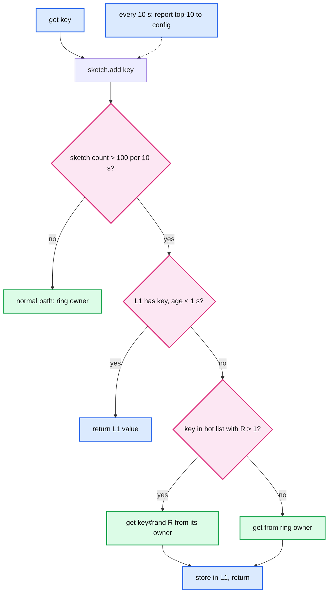
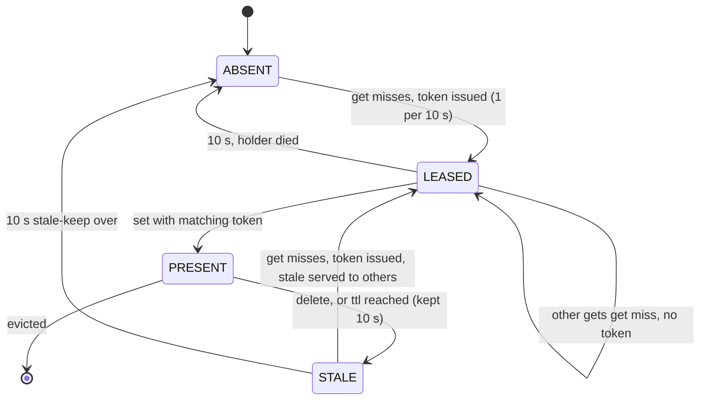

# Deep dive: hot keys and stampedes

> One-line answer: consistent hashing spreads keys, not requests, so one key at 1 M QPS still lands on one node; detect it in the client with a count-min sketch, absorb it with a 1 s client L1 (1 M QPS becomes 5k), replicate it under `key#0..R-1` when it must be fresher than 1 s, and stop the expiry stampede with a per-key lease (one filler per 10 s, everyone else waits 10 ms or takes the stale copy) plus probabilistic early refresh so hot keys never actually expire under load.

Reusable block: [`../../../concepts/stream-sketches.md`](../../../concepts/stream-sketches.md) (count-min, top-k), [`../../../concepts/caching-patterns.md`](../../../concepts/caching-patterns.md) §4 (single-flight code).

---

## 1. Why sharding cannot help

The unit of placement is the key. A node's ceiling is about 1 M ops/s and 25 Gbps. One key at 1 M QPS with 1 KB values is 100% of the ops ceiling and 8 Gbps. Adding nodes changes nothing for that key; it only moves it. The 2.5 M other keys on that node share its fate: the interviewer's "which box melts" answer is "the owner node, and every cold key on it".

Two different hot-key shapes, two different fixes:

| Shape | Example | Fix |
|---|---|---|
| Read-hot | a viral post, a feature flag every request reads | L1 in the client; key replication |
| Write-hot | a global counter, a "last seen" for a bot account | Aggregate in the client; shard the counter; or admit it is a DB problem |

---

## 2. Detection: in the client, with a sketch

- Each client keeps a count-min sketch (4 rows × 65,536 4-bit counters = 128 KB) and a top-100 min-heap over a 10 s sliding window (two sketches, swap every 10 s).
- Threshold: a key above 1,000 QPS on one app server is above about 5 M QPS fleet-wide (5,000 servers), which is already 5x a node's ceiling. Set the threshold at 100 QPS per server (500k fleet-wide) to act before damage.
- Clients report their top-10 to the config service every 10 s (500 reports/s fleet-wide). The config service merges (sum by key) and publishes a hot-key list `{key, qps, R}` with the ring. Every client sees the same `R` for a key, which matters for replication (§4).
- Server-side detection (Redis `--hotkeys` from LFU counters, memcached `stats detail`) works too, but the node is the thing already melting; the client is where the fix lives, so detect there.

---

## 3. Client L1: the fix that costs nothing

- A per-process `LinkedHashMap` of 10k entries, values up to 64 KB, TTL 1 s, used **only** for keys the sketch flagged. Memory 10 MB.
- Effect: 5,000 servers each ask the node once per second: 5k QPS instead of 1 M. Nothing changes on the server.
- Cost: those keys are up to 1 s staler than the cache's own bound. State it: "hot keys are 1 s stale, everything else is bounded by the delete path".
- Invalidation of L1: none, TTL only. A `delete` from this client evicts its own L1 entry (read-your-writes), other clients wait out the second.
- Facebook's equivalent is the web server's in-process cache; Netflix's EVCache client has a near-cache with the same shape.

---

## 4. Key replication: for keys that cannot be 1 s stale

- Writer stores `R` copies under `key#0 .. key#R-1` (each hashes to a different node). Reader picks `key#rand(R)`. `delete` fans out to all `R`. `R = 8` turns 1 M QPS into 125k per node.
- `R` must be agreed fleet-wide or readers pick suffixes writers never filled. That is why the config service publishes `R` per key; changing `R` is a ring-style epoch change (readers use the old `R` for 10 s after a change so the new copies are warm).
- Read-side consistency: the `R` copies are filled independently by different lease holders, from the DB, so they can differ by the staleness bound (1 s). Acceptable by definition; if not, the key needs the DB.
- Cost: `R×` memory for those keys (a few hundred keys, negligible) and `R×` deletes on invalidation.
- Alternative: let the owner node serve a hot key from replicas too (read from `RF` nodes). Cheaper in mechanism, but bounded by `RF = 2`. Suffix replication scales `R` per key.

---

## 5. Stampede on expiry: leases

**The failure.** A 100k QPS key expires. Fill latency is 2 ms. In 2 ms, 200 readers miss. All 200 read the DB and all 200 `set`. Now 1,000 hot keys warmed together expire in the same minute: 200k redundant DB reads and 200k redundant sets. Facebook measured a peak DB query rate of 17k/s from this on one pattern; with leases it was 1.3k/s.

**The mechanism.**
1. On a miss, the node writes a 24 B lease tombstone into the bucket (`token, issued_at, client`) and returns `miss + token`. It refuses to issue another token for that key for 10 s.
2. Every other reader that misses within 10 s gets `miss, no token` and, if the node holds a stale copy (expired or deleted within 10 s), that stale value flagged `stale`.
3. The token holder reads the DB and `set(key, value, ttl, token)`. The node stores only if the tombstone's token matches (a `delete` in between bumps it).
4. Non-holders: if they got a stale value they use it; otherwise they retry after 10 ms (by then the fill is done) with a cap of 3 retries before falling through to the DB under the fill limiter.
5. If the holder dies, the lease expires at 10 s and the next miss gets a new token. Cost of a dead holder: up to 10 s of stale-or-wait for that key.

**Why not a lock.** A lock needs a release (a round trip and a failure mode), lives in a separate system or key, and does not travel with the miss reply. The lease is granted *in* the miss reply, expires alone, and doubles as the stale-set guard. Same guarantee, less mechanism.

**Single-flight inside the client.** Before any of this, the client library coalesces concurrent misses for the same key within one process (`singleflight`: one in-flight fill, others wait on it). It cuts per-process duplicates to one for free and is why Go's groupcache never needed server leases. The server lease handles the cross-process case.

---

## 6. Do not let hot keys expire at all

- **Probabilistic early refresh (XFetch).** On a hit, if `now - delta × beta × ln(rand()) >= expires_at`, the reader refreshes the value itself (delta = last fill latency, beta = 1). Because `ln(rand())` is exponentially distributed, exactly one reader out of the many hitting a hot key tends to refresh a few `delta`s before expiry, and the item never actually expires under load. Costs one extra DB read per hot key per TTL and needs `delta` stored with the item (4 B).
- **Stale-while-revalidate.** Memcached's meta protocol has this built in (`recache` and `won` flags): a `get` on a stale item returns it and marks that one client as the refresher.
- **TTL jitter** ±10% at the client for everything, so warmed-together keys do not expire together.
- **Negative caching.** A DB not-found is cached as `add(key, NULL, 10 s)`, so a hot *missing* key (a deleted post everyone still links to) is a cache hit, not a DB read per request.

---

## 7. Write-hot keys

- **Aggregate in the client.** A counter increments are summed per process and flushed as `incr(key, n)` every 100 ms. 1 M increments/s across 5,000 servers becomes 50k `incr`/s. Loss on process crash: 100 ms of increments; document it as approximate.
- **Shard the counter.** `incr(key#rand(16))`; readers `mget` all 16 and sum. 16 nodes share the writes; reads cost one `mget`.
- **Not a cache problem.** If the counter must be exact and read-after-write (a balance, an inventory count), it lives in the DB with a single-writer batch or row-level locking ([`../../payments-ledger/deep-dives/hot-accounts-and-contention.md`](../../payments-ledger/deep-dives/hot-accounts-and-contention.md)). Say so instead of bending the cache.

---

## 8. Numbers to say out loud

- Node ceiling about 1 M ops/s; one 1 KB key at 1 M QPS is 8 Gbps.
- Client sketch 128 KB, threshold 100 QPS per server (500k fleet-wide), report every 10 s.
- L1: 1 s TTL, 10k entries, turns 1 M QPS into 5k at the node.
- Replication `R = 8`: 125k QPS per node for the key.
- Lease: one token per key per 10 s; non-holders wait 10 ms or take stale. Facebook: 17k/s to 1.3k/s peak DB queries.
- XFetch `beta = 1`; TTL jitter ±10%; negative cache 10 s.
- Write-hot: client aggregation 100 ms flush, 1 M/s to 50k/s.
