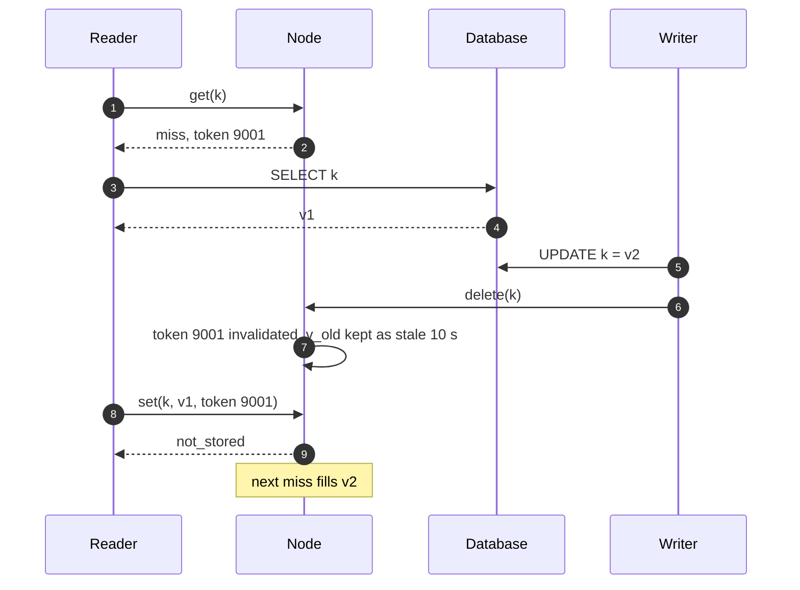
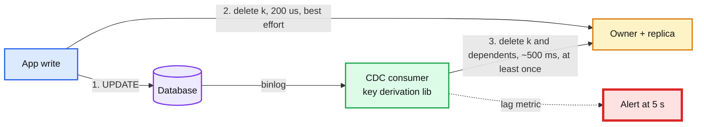

# Deep dive: invalidation and consistency

> One-line answer: the cache is never the truth, so the only question is how stale it can be and for how long; cache-aside with delete-on-write gives 200 us in the common case, the lease token on `set` kills the stale-set race, a CDC consumer reading the DB's change log re-issues every delete about 500 ms later as the guarantee, versioned `cas` sets cover the few keys that need ordering, and the honest claim is "1 s in region, TTL worst case, read-your-writes for the writer for 1 s", with the ring-change window and the replica's last batch named as the two holes.

Reusable block: [`../../../concepts/caching-patterns.md`](../../../concepts/caching-patterns.md) §2 and §3, [`../../../concepts/stream-processing.md`](../../../concepts/stream-processing.md) (CDC), [`../../../concepts/exactly-once.md`](../../../concepts/exactly-once.md) (why deletes are the idempotent choice).

---

## 1. The four write patterns and why we pick delete-on-write

| Pattern | Write path | Staleness | Fails when |
|---|---|---|---|
| Cache-aside, delete on write | write DB, `delete(k)` | one miss after each write; 0 if the delete lands | Delete is lost (app crash, timeout); stale-set race |
| Cache-aside, set on write (write-through-ish) | write DB, `set(k, v_new)` | 0 in the happy path | Two writers race: `set(v1)` lands after `set(v2)`. Caches 1 M values/s nobody reads. Cache on the write path |
| Write-through (cache owns the write) | `set` to cache, cache writes DB | 0 | Cache becomes a dependency of every write; a node death mid-write loses it unless the cache is durable, which it is not. DAX does this because DynamoDB is the durable half and DAX is single-writer per item |
| Write-behind | `set` to cache, cache writes DB later | 0 for readers of the cache; DB lags | Node death loses acknowledged writes. Out of scope by FR |

Delete is the choice because it is **idempotent and order-independent**: two deletes in any order leave the same state (absent), and a late delete is harmless. A late `set` is not. The price is one extra miss per write, `1 M/s × 2 ms` of DB reads, which is 5% of the fill budget.

---

## 2. The stale-set race and the lease

Without the token, v1 sits until TTL (1 h) and the race window is the reader's DB latency (2 ms) times 1 M writes/s: it happens constantly. With the token it cannot happen. Facebook's lease is exactly this (load-link / store-conditional on the key); memcached's `gets` / `cas` is the same idea with a version instead of a token, and Redis's `WATCH` / `MULTI` is the per-connection variant.

---

## 3. The lost delete and the CDC backstop

The app-side delete can be lost: app crashes between the DB commit and the `delete`, the `delete` times out, the node is suspect and the delete went to a replica that then died. Each is rare (say 1 in 10,000 writes) and at 1 M writes/s that is 100 stale keys per second, stale for up to 1 h.

**CDC consumer.** Tails the DB's change log (MySQL binlog, Postgres logical decoding, DynamoDB Streams, a Debezium topic), maps each row change to the cache keys that depend on it (the same derivation the app uses, in a shared library), and issues `delete(k)` to owner and replica. Latency: commit to binlog 1 to 10 ms, consumer poll 100 ms, batching 100 ms, RPC 1 ms: about 500 ms end to end. It is at-least-once (replay from the last committed offset) and deletes are idempotent, so replay is free.

**What it costs.** One consumer per DB shard, `1 M deletes/s` of extra cache traffic (60 B each, 60 MB/s fleet-wide), and a **key derivation contract** between the app and the consumer: if the app changes how `user:{id}` is spelled, the consumer must know. This contract is the real engineering cost of CDC invalidation and the reason to keep key derivation in one library.

**Multi-key dependencies.** A row change can invalidate several keys (the user row invalidates `user:42` and `user:42:profile_card` and `team:7:members` if the row carries `team_id`). The consumer's mapping handles fan-out; the app-side delete usually only knows the primary key. That is a second reason CDC is the guarantee and the app delete is the fast path.

Facebook's mcsqueal reads MySQL commit logs and broadcasts deletes through mcrouter; Uber's CacheFront drives Redis invalidation from Docstore's CDC stream; both publish staleness numbers in the sub-second range for the CDC path.

---

## 4. Versioned sets for keys that need ordering

For a small class of keys (a balance display, a permission bit) where "1 s stale" is a product bug:
- The row has a monotonic `version` (a per-row counter or the commit timestamp).
- After the write, the app does `set(k, v_new, cas = version)`. The node stores only if `version` is greater than the stored one. Two racing writers cannot reorder: the higher version wins regardless of arrival.
- Readers fill with the row's version too, so a fill from a lagging DB replica (older version) loses to a fresher `set`.
- Cost: a version column, a `set` on the write path, and the fill must carry the version. Do it per namespace, not fleet-wide.

---

## 5. The staleness bound, stated precisely

| Path | Staleness after a write | When it applies |
|---|---|---|
| App delete lands | one miss (2 ms) | 99.99% of writes |
| App delete lost, CDC lands | about 500 ms | the rest |
| CDC down | until TTL (1 h default, 30 d max) | alert at 5 s of lag |
| Client L1 for hot keys | up to 1 s | hot keys only |
| Ring change, two owners | up to 5 s | once a day, 0.5% of keys |
| Replica lost last batch of sets | miss, not stale | owner death |
| Replica lost last batch of deletes | stale until CDC (500 ms) | owner death; client sends deletes to both, so rare |
| Gutter | up to 10 s | only while an owner is suspect |
| Cross-region | 1 s + DB replica lag, unless remote marker | secondary regions |

Claim in the interview: **"eventual, 1 s bound in region under normal operation, TTL in the worst case, read-your-writes for the writer for 1 s."** Then list the holes before the interviewer does.

---

## 6. Read-your-writes and multi-region

**In region.** The writer's client puts `v_new` in its L1 for 1 s after `delete(k)` (it has the value; it just wrote it). Subsequent reads on that client hit L1. Cross-client (write on one device, read on another) is not promised; a product that needs it fills from the DB primary for `fresh`-tagged keys.

**Cross region.** Writes go to the primary region's DB; secondary regions read their local DB replica, which lags by 100s of ms. A reader in the secondary who misses right after the CDC delete refills the **old** row from the lagging replica, and the stale value is now cached for a TTL. Facebook's remote marker:
1. Writer (in secondary region) sets `marker:k` in the local cache.
2. Writer sends the write to the primary DB (with "invalidate `k` and `marker:k`" attached).
3. Local readers who find `marker:k` read from the primary DB instead of the local replica.
4. The CDC delete from the primary, replicated to the secondary's cache, removes `k` and `marker:k`.
The marker converts a window of unbounded staleness into a window of cross-region latency, at the cost of one cross-region read per affected reader while the marker exists.

---

## 7. What we refused

- **"Strongly consistent cache"**: would need every read to validate against the DB (defeating the cache) or every write to synchronously update every copy under a lock (a database with worse durability). Say why, then offer versioned sets for the keys that matter.
- **Two-phase ring changes** to close the 5 s window: every client acks the epoch before it takes effect; one slow client stalls the fleet. Not for 0.5% of keys once a day.
- **Invalidation by pub/sub from the app** (app publishes `k changed`, every client drops L1): a third invalidation path with its own ordering problems, for a 1 s L1 TTL. Not worth it.

---

## 8. Numbers to say out loud

- App delete 200 us; CDC delete about 500 ms; alert at 5 s lag; TTL worst case 1 h default, 30 d max.
- Stale-set race without leases: window equals fill latency (2 ms) at 1 M writes/s; with leases, zero.
- Lost app deletes at 1 in 10,000: 100 stale keys/s without CDC.
- Extra miss per write: `1 M/s × 2 ms` of DB reads, about 5% of the fill budget.
- CDC traffic: 1 M deletes/s × 60 B = 60 MB/s fleet-wide.
- Facebook: lease token per key per 10 s; cold cluster 2 s delete hold-off; remote markers for cross-region read-your-writes.
