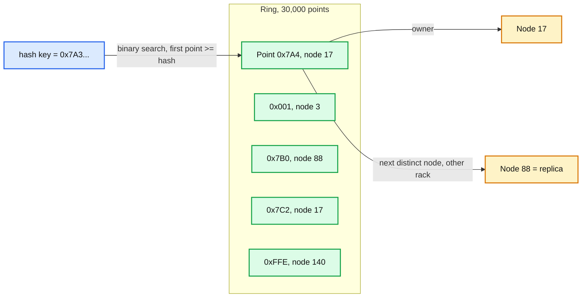
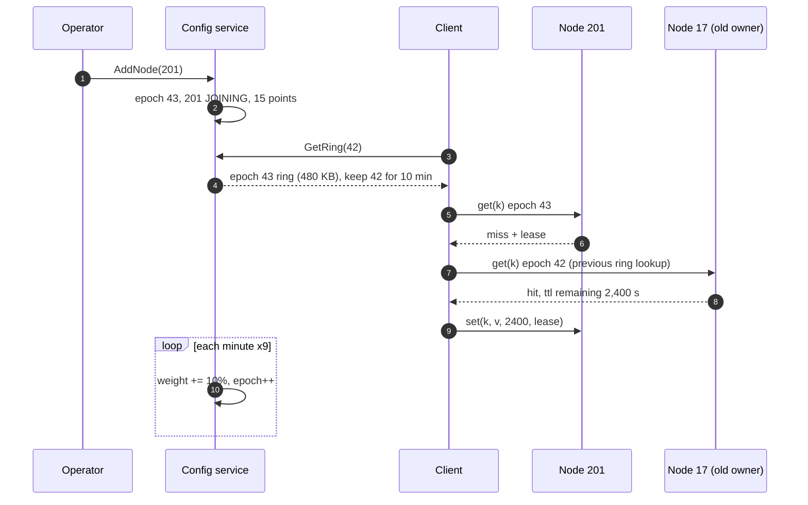

# Deep dive: key placement and membership

> One-line answer: hash every key to a 64-bit ring with 150 points per node so a membership change moves 1/N of the keys spread across all neighbours; keep the ring in a small Raft-backed config service with an epoch, cache it in every client, stamp every request with the epoch so a node can say `MOVED`, and never let gossip decide ownership.

Reusable block: [`../../../concepts/sharding.md`](../../../concepts/sharding.md) (ring code, rebalancing), [`../../../concepts/raft.md`](../../../concepts/raft.md) (the config service), [`../../../concepts/gossip-protocol.md`](../../../concepts/gossip-protocol.md) (why not here).

---

## 1. The three placement schemes and what moves

| Scheme | Lookup | Keys moved on +1 node (N = 200) | Load spread | Verdict |
|---|---|---|---|---|
| `hash mod N` | O(1) | `N / (N+1)` = 99.5% | perfect | Cold cache on every change. Out |
| Consistent hash, 1 point per node | O(log N) | 1/N = 0.5%, all taken from one neighbour | ±50% (ranges are random sizes) | Correct but unbalanced |
| Consistent hash, 150 points per node | O(log 30,000) = 15 steps | 0.5%, spread across ~150 neighbours | about ±10% | Chosen |
| Jump consistent hash | O(log N), zero memory | 0.5% | perfect | Only removes from the end of the list; a mid-list death remaps more. Out |
| Bounded-load consistent hashing | ring + a load counter per node | 0.5% | no node above `c ×` average, `c = 1.25` | Use when node capacities differ (mixed hardware) |
| Redis 16,384 fixed slots | slot = CRC16 mod 16384, slot table | operator moves slots | as even as the slot table | Same idea with a coarser unit; fine, but the table is 16,384 entries not 30,000 points |

Why vnodes fix balance: with one point per node, ranges are the gaps between 200 random points on a circle, whose sizes follow an exponential distribution, so the largest is about `ln(200) = 5x` the mean. With 150 points per node each node's share is the sum of 150 such gaps, and the sum's standard deviation shrinks by `sqrt(150) = 12x`, giving about ±10%.

Why the replica is "next distinct node clockwise, different rack": it is the same lookup with one more step, the client needs no second table, and when the owner dies the replica is exactly the node the ring would promote.

---

## 2. Who owns the ring

Three real answers, and the one we pick:

| Owner | How clients learn | Agreement on "who owns k" | Used by |
|---|---|---|---|
| Static config in the app | deploy | perfect until a node dies, then none | early memcached deployments |
| Gossip between nodes, `MOVED` redirects | ask any node | converges in `log N` rounds; two nodes can disagree for seconds | Redis Cluster |
| Config service (Raft / etcd / ZK), epoch per change | poll or watch | one answer at every epoch; clients lag by the poll interval | our design, mcrouter with a config store, Cassandra 6 (moving ring ownership onto a Paxos log) |

The argument is about **invalidation**, not routing. A `delete(k)` must land on the node that the next `get(k)` will ask. With gossip, client A and client B can hold different views for a few seconds; a delete on one node and a read on the other is a stale read with no bound. With a config service the disagreement window is the poll interval (5 s) and only exists during a change (once a day). Same argument as [`../../../concepts/gossip-protocol.md`](../../../concepts/gossip-protocol.md) §10: gossip for liveness and hints, never for ownership.

**Epoch mechanics.**
- Every ring write in the config service is `epoch + 1`, one Raft entry, applied atomically.
- Every request carries the client's epoch. A node compares it with the newest epoch it has heard (in heartbeat replies). Older: reply `MOVED e_new` and the client refreshes before retrying. Newer: the node serves the request and refreshes itself; it may be serving keys it no longer owns for up to one heartbeat (1 s), harmless because the new owner has them too or misses.
- Clients keep the previous epoch's ring for 10 minutes for warm-from-old-owner (§5).

**Cost.** 400 heartbeats/s, 1,000 `GetRing` polls/s (5,000 clients / 5 s) returning `unchanged` (20 B), and the occasional 480 KB ring. A 3-node Raft group on small VMs.

---

## 3. Membership change, step by step

**Add node 201** (client view):

1. `epoch 43`: node 201 in `JOINING` with weight 10% (15 of 150 points). Clients see it on the next poll (<= 5 s).
2. Keys whose successor is one of those 15 points now route to 201. It misses. The client checks the previous ring (epoch 42): owner was 17, and 17 still holds the item (orphaned but present). Client `get`s from 17, `set`s on 201 with the remaining TTL and the lease token from 201's miss. Cost: one extra cache RTT, no DB.
3. Every minute the config service bumps weight by 10% (`epoch 44 .. 52`). By 10 minutes node 201 has 150 points and its share of keys, warmed from old owners.
4. Replica placement is recomputed per epoch; 201 also becomes replica for a range, streamed from that range's owner at 1 Gbps (the stream is rate-limited so the owner's data path is not hurt).

**Remove node 17** (planned): `DRAINING` at `epoch + 1`: 17 keeps its points but clients send reads for 17's ranges to the replica, and 17 stops receiving replica writes. After 2 minutes (no traffic), `REMOVED` at `epoch + 2`: its points are gone, the former replica is owner, a new replica is streamed. No cold miss at any point.

**Node 17 dies** (unplanned): clients' 3-strike logic routes reads to the replica within 100 ms per client; config service marks `DEAD` after 3 s and `REMOVED` at 10 minutes if it does not return. A returning node within 10 minutes re-enters as `JOINING`; its old data is discarded (it may hold stale items missed by deletes during the outage). This is why the 30 s flap cooldown exists: a node that dies and returns in 5 s would otherwise trigger two full ring changes.

---

## 4. Warm-from-old-owner: the details that bite

- **Which previous ring?** The client keeps a stack of up to 3 previous epochs (10 minutes each). It tries the most recent previous owner only; two hops back is not worth the RTT.
- **Stale risk.** The old owner's copy could have been invalidated after the ring change by a delete that went to the new owner. Bound: the delete also goes to the previous owner for 10 minutes after a ring change (the client fans out deletes to both), so the orphan is at most as stale as the two-owner window (5 s).
- **Only on a miss with a lease.** Non-lease-holders do not go to the old owner; they wait 10 ms like any miss.
- **Turn it off** once the new node's hit rate is within 2 points of the fleet (a client-side flag from the config service), so the extra RTT does not linger.

---

## 5. Failure modes of the placement layer

| Failure | Effect | Bound |
|---|---|---|
| Client cannot reach the config service | Uses its cached ring; misses ring changes | Unbounded in time, bounded in impact: only the 0.5% of keys that moved miss on the wrong node |
| Two clients on different epochs | Two owners for a key for up to 5 s | Once per change, 0.5% of keys |
| Bad ring published (wrong weights, duplicate points) | Fleet-wide mis-routing | Config service validates: every node has 150 × weight points, no duplicates, replica never on the same rack; a client rejects a ring whose ownership differs from the previous by more than 10% unless the change is an explicit rebuild |
| Hash function change in a client build | Fleet-wide cold cache | Ring carries the hash function name; a client with a different one refuses to start |
| Flapping node | Two ring changes per flap | 30 s cooldown before re-add; three flaps in an hour marks the node `quarantined` |

---

## 6. Numbers to say out loud

- `mod N` at N = 200: 99.5% of keys move. Ring: 0.5%.
- 150 vnodes: about ±10% load spread. 1 vnode: about ±50%, worst node about 5x mean.
- Ring size: 30,000 × 16 B = 480 KB. Lookup 15 comparisons, 100 ns.
- Ring changes: about once a day. Convergence window 5 s (poll) or 1 s (heartbeat-driven `MOVED`).
- Staged add: 10% per minute, 10 minutes to full weight, miss peak 5k/s per node instead of 50k/s.
- Bounded loads `c = 1.25`: no node above 125% of average.
