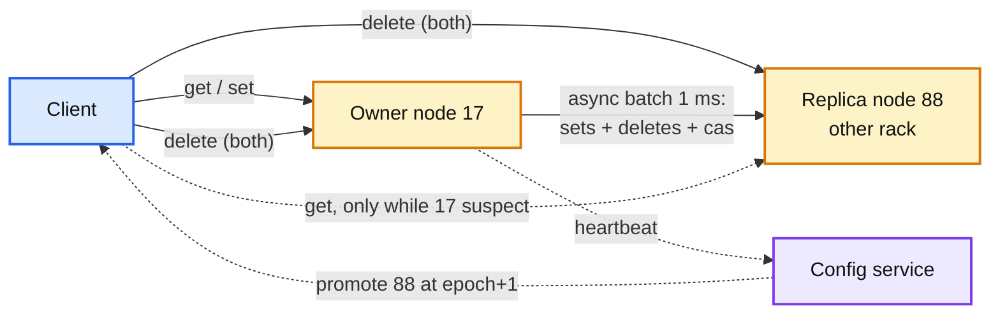

# Deep dive: replication and node failure

> One-line answer: a cache does not need replication for correctness, it needs it (or something cheaper) to keep the database alive when many nodes fail at once; decide by arithmetic (`correlated loss × miss rate` vs `2× memory`), and when you do replicate, do it async from owner to one rack-remote replica with a 1 ms batch, serve reads from the replica only while the owner is suspect, never use quorums, and keep a gutter pool and a fill cap as the layers that work with or without replicas.

Reusable block: [`../../../concepts/replication-and-quorums.md`](../../../concepts/replication-and-quorums.md), [`../../../concepts/rate-limiting-and-load-shedding.md`](../../../concepts/rate-limiting-and-load-shedding.md).

---

## 1. The arithmetic that decides it

| Scenario | Extra DB reads/s (no replicas) | DB budget 1 M/s, organic 500k/s | Verdict |
|---|---|---|---|
| 1 node of 200 dies | 50k for about 100 s | 55% of budget | Fine |
| 5 nodes (a deploy batch) | 250k | 75% | Fine, no headroom |
| 20 nodes (a rack) | 1 M | 150% | DB falls over |
| 67 nodes (an AZ) | 3.3 M | 380% | Site down |

The DB does not "survive the cache being gone" at this ratio. Two ways out: make the DB 4x bigger (permanently, for a bad day), or make the cache survive correlated loss. 200 extra 128 GB nodes cost about $500k/year; a 4x DB is more. So we replicate. For a 100 GB cache in front of a DB with 3x headroom, we would not, and Facebook's design (no in-cluster replication, gutter only) is the right one there. Say the ratio, not the rule.

---

## 2. Replication shapes for a cache

| Shape | Who replicates | Consistency | Cost | Used by |
|---|---|---|---|---|
| None + gutter | nobody; a small spare pool absorbs a dead node's hot keys | n/a | 1% extra nodes | Facebook memcache |
| Owner to replica, async | the owner node forwards sets and deletes | replica lags by one batch (1 ms); a lost batch is a miss | 2x memory, 1 extra write per set on the owner | Redis Cluster, our design |
| Client writes to all copies | the client library sends every set to every AZ's copy | copies can diverge if a client dies mid-fan-out | RF× memory, RF× client writes | Netflix EVCache |
| Quorum (R + W > N) | nodes, with acks | no lost acknowledged write | 2 RTT per write, coordination | Dynamo-style stores. Not for a cache |

Why owner-to-replica async: the client's write path stays one RTT; the owner already has the item in memory and batches replica writes for free; a lost batch on owner death costs a miss (a `set`) or, worse, a stale value (a lost `delete`). We close the second case by having the client send `delete` to both owner and replica directly (deletes are 60 B and idempotent), and the CDC backstop covers what is left.

Why not quorums: a quorum's guarantee is "an acknowledged write is never lost". A cache's `set` is reproducible from the DB; losing it is a miss. Paying 2 RTT on every write to avoid a miss is the wrong trade, and it is the trade an interviewer is checking that you will not make.

**Replica stream details.** Per shard, a ring buffer of `(op, key, value, cas, expires_at)` drained every 1 ms or 64 KB over one long-lived connection to the replica. The replica applies in order with `cas` as the tiebreaker (a set with a lower `cas` than what it holds is dropped). Leases are not replicated: a promoted replica starts issuing its own tokens, and any in-flight `set` with the old owner's token is `not_stored` on the replica (one extra miss). Backpressure: if the buffer fills (replica slow), the owner drops replica writes and marks the replica `lagging` in its heartbeat; the config service will not promote a lagging replica without a full re-stream.

**Placement.** Replica = next distinct node clockwise on the ring that is in a different rack and AZ. Rack-awareness is what turns "a rack dies" into "33% of reads go cross-AZ" instead of "33% of keys are gone".

---

## 3. Failure detection: who decides a node is dead

| Detector | Signal | Speed | Used for |
|---|---|---|---|
| Client, per node | 3 consecutive timeouts (20 ms each) | 60 to 100 ms | Stop sending; read from replica; report |
| Config service | 3 missed heartbeats (1 s each) plus failure reports from >= 10 clients | 3 s | Publish `epoch + 1`, promote replica |
| Gossip (Redis Cluster) | PFAIL from one node, FAIL when a majority of masters agree, `cluster-node-timeout` 15 s default | 15 s default | Not used here |

Two detectors on purpose. The client's is fast and local (a partition between one app server and one node should not remove the node fleet-wide). The config service's is slow and global (it changes the ring, which everyone must agree on). A node that the config service thinks is alive but 10+ clients report as dead is a partial partition; the config service marks it `suspect` and stops routing new replicas to it without removing it.

**Suspect state on the client.** `suspect_until = now + 10 s`; reads for its ranges go to the replica; writes go to the replica too (sets and deletes), so the replica keeps warm and consistent; `ReportFailure` sent once. After 10 s, one probe request; success clears the state. A node that flaps between suspect and up on a client is a network problem on that client's path, and the client's own metric (`suspect transitions per minute`) shows it.

---

## 4. The gutter pool: the layer that works without replicas

- 1% of the fleet (2 to 4 nodes), its own tiny ring, never the primary target for any key.
- On a timeout to the owner (and no replica, or replica also suspect), the client retries the same key on the gutter. A miss there is filled from the DB with **TTL 10 s** so the gutter never holds much and never needs invalidation (Facebook: gutter entries "expire quickly to obviate gutter invalidations").
- Effect: a dead node's hottest keys are served from the gutter after one fill each per 10 s. Facebook's numbers: 10 to 25% of failures converted to hits daily; for a whole-server failure the gutter hit rate passes 35% within 4 minutes and often reaches 50%.
- Why not rehash to the ring neighbour instead? Because the neighbour is a healthy node at its normal load, and a cascading overload (dead node's traffic pushes the neighbour over, which pushes the next) is exactly what an idle gutter avoids. The gutter is idle by design.
- With RF = 2 the gutter is the fallback when both owner and replica are suspect (an AZ outage plus a partition). Keep it; it is 2 nodes.

---

## 5. Fill cap: the last line

The client library rate-limits the DB fills it generates: a token bucket of 100 fills/s per app server (500k/s fleet-wide, half the DB budget). Above the cap a miss returns `miss, do not fill` and the app degrades: stale L1, default value, or a 503 for the least important call. This is what makes the DB's load a **function of the cap** rather than of cache health. It is per server, so no coordination; it fails safe (a server that cannot reach the config service still has its cap).

Why the cap is per second and not per in-flight: a slow DB (200 ms) with a per-in-flight cap of 20 would still admit 100/s; a per-second cap admits 100/s regardless of latency, which is what the DB cares about.

---

## 6. Cold start and warming

| Situation | Without replicas | With RF = 2 |
|---|---|---|
| Node restart (deploy) | 100 s miss storm for its 0.5% of keys, `+50k` DB reads/s | Drain (replica serves), restart, stream back from replica (80 s at 10 Gbps), undrain. Zero misses |
| New node | Same miss storm, spread over 10 minutes by staged weight; warm from old owner via the previous ring | Same, plus it becomes a replica for some range via a stream |
| Whole cluster cold (new region, disaster) | Facebook: read-through from a warm cluster on miss, with a 2 s delete hold-off so a delete cannot be undone by a stale warm-cluster copy | Same trick, cross-region, or accept a ramp with the fill cap holding the DB at budget |
| Snapshot on SIGTERM | Write items to local NVMe (100 GB at 2 GB/s = 50 s), reload on start, drop expired. It is warm-up, not durability; a delete that happened while down is caught by CDC replay from the shutdown offset | Not needed |

---

## 7. What the interviewer is testing

- That you know a cache's replication is about **DB protection**, not data safety, and can show the division.
- That you will not propose quorums.
- That "a node dies" has a second-by-second answer (20 ms, 100 ms, 3 s, 5 s, 80 s) and a DB number at each step.
- That you have a layer that works when replication does not (gutter, cap), because correlated failures include "the replica is in the same blast radius".

---

## 8. Numbers to say out loud

- 1 node loss: `+50k` DB reads/s for 100 s. 20 nodes: `+1 M`, 150% of budget.
- RF = 2 costs 200 nodes, about $500k/year here; that is the price of surviving a rack loss.
- Replica batch 1 ms; loss window on owner death is one batch of sets (misses).
- Client detection 60 to 100 ms; config service 3 s; ring convergence 5 s; replica re-stream 80 s.
- Gutter: 1% of nodes, TTL 10 s, 10 to 25% of failures to hits daily, over 35% within 4 minutes of a full server loss.
- Fill cap 100/s per app server, 500k/s fleet, half the DB budget.
- Redis Cluster's detector: `cluster-node-timeout` 15 s default, FAIL needs a majority of masters.
